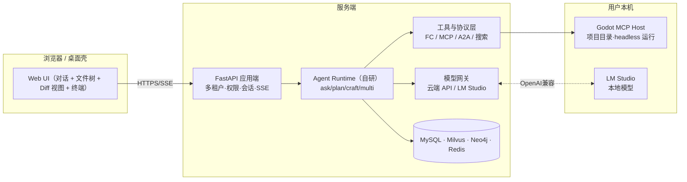
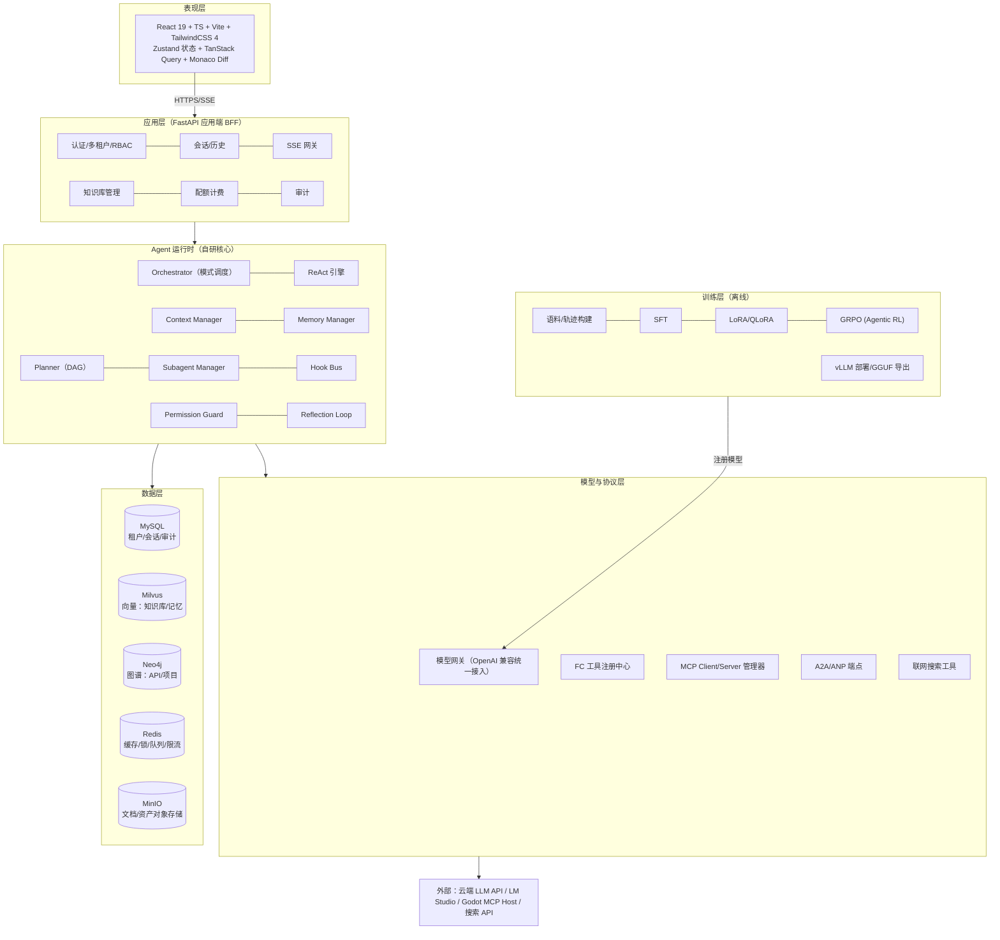
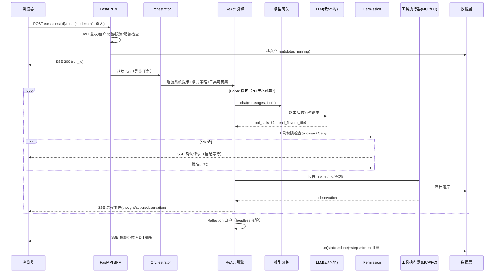
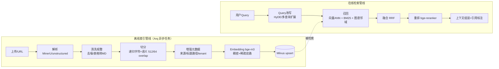
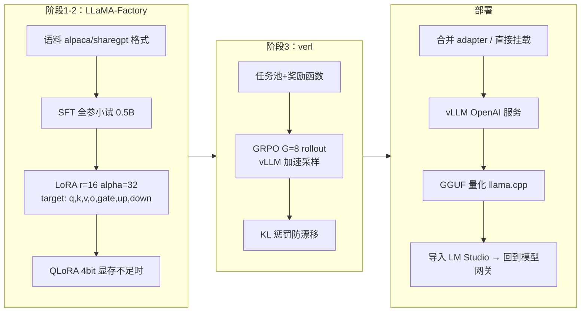

# Agent-Godot 技术需求与开发方案

> **项目定位**：垂直于 Godot 游戏开发的生产级 AI Agent 平台（对标 CodeBuddy / Cursor 网页版形态），同时是一部"以战代练"的 Agent 工程学习教程——**每一个功能都标注对应的教材知识点与大厂面试考点**，做完本项目 = 打通 Agent 全栈知识体系。
>
> **文档版本**：v1.0 ｜ **状态**：设计基线（Baseline） ｜ **维护**：本人（学习者兼开发者）

---

## 目录

- [0. 文档说明与学习方法](#0-文档说明与学习方法)
- [1. 项目概述](#1-项目概述)
- [2. LLM 基础知识体系（地基层）](#2-llm-基础知识体系地基层)
- [3. 智能体经典范式（设计思想层）](#3-智能体经典范式设计思想层)
- [4. 需求设计（功能清单与验收标准）](#4-需求设计功能清单与验收标准)
- [5. 总体架构设计](#5-总体架构设计)
- [6. 核心子系统详细设计](#6-核心子系统详细设计)
- [7. 微调与 Agentic RL 训练管线](#7-微调与-agentic-rl-训练管线)
- [8. 高并发方案](#8-高并发方案)
- [9. 分布式方案](#9-分布式方案)
- [10. 安全设计](#10-安全设计)
- [11. 测试与 Agent 评估](#11-测试与-agent-评估)
- [12. 部署方案](#12-部署方案)
- [13. 项目目录结构](#13-项目目录结构)
- [14. 开发里程碑（学习导向）](#14-开发里程碑学习导向)
- [15. 大厂面试知识点全景映射表](#15-大厂面试知识点全景映射表)
- [16. 术语表](#16-术语表)

---

## 0. 文档说明与学习方法

### 0.1 本文档是什么

这不是一份"直接开工"的需求文档，而是一份**先设计后施工、以知识点为主轴**的生产级方案。编写动机：把《生产级 Agent 项目学习笔记》（21 模块 · 52 天计划）+ 四部公开教程的知识，通过一个真实项目完整落地一遍。

### 0.2 知识来源与映射约定

| 代号 | 来源 | 用途 |
|---|---|---|
| 📝笔记 | 《生产级 Agent 项目学习笔记》（21 模块 · 52 天计划 · ChangeOps 项目贯穿） | 总体知识骨架（注：HTML 正文数据文件 `modules_data.js` 未随文件提供，本文按其体系结构与功能清单做主题级映射，拿到原文件后可补全精确模块编号） |
| 📗HA | hello-agents（Datawhale《从零开始构建智能体》） | Agent 系统构建理论：LLM 基础、提示工程、工具调用、ReAct、记忆、多智能体、评估与部署 |
| 📘Z2A | zero2Agent（《从会用 AI 到会开发 Agent》，面向程序员的 Agent 工程教程） | Agent 核心机制与工程化：MCP、Skills、Hooks、Permission、Session 等 |
| 📙RAG | all-in-rag（RAG 专项教程） | 数据解析→切分→Embedding→索引→检索→重排→生成全链路、GraphRAG、Agentic RAG |
| 📕DSH | DeepSeek Harness 教程（dsh.papertok.ai，"一切皆插件"的 Agent 编排框架） | 插件化架构思想：模型/工具/Agent/编排皆插件、本地 Web UI、配置驱动 |

> 每个功能小节都会出现 `📚知识点` 表格，`面试` 列即该功能对应的高频面试题，第 15 章再做汇总。

### 0.3 建议的学习闭环（对每个功能）

```
读教材对应章节 → 读本文档该功能的设计与知识点表 → 手写实现（不抄框架） 
→ 用面试题自测（第15章） → 回答不出则回到第一步
```

### 0.4 V2 模块化学习体系（2026-08 重构，当前生效）

> **本总纲现在是"地图"，不再是"唯一教材"。** 全部知识点已按**生产项目开发进度（Sprint 制）**重组为 23 篇模块文档（M00~M22），每篇采用统一八段式模板：**知识点详解（原理/演进史/最小案例/易错点四小节）→ 完整接口签名 → 关键难点参考片段 → 手敲指引（每步验证命令）→ 测试与验收 → 踩坑记录（留白自填）→ 面试拷打 → 教程映射**。代码采用"接口签名 + 难点片段 + 测试齐全，主体实现留白手敲"制。

**阅读顺序**：`docs/modules/M00-架构设计.md`（总图纸）→ 按 Sprint 顺序逐模块推进 → 随时回本总纲查需求背景（第 4 章）与全景考点（第 15 章）。

#### 模块索引与旧章节映射

| 模块 | Sprint | 文档 | 手敲代码落点 | 本总纲对应章节 |
|---|---|---|---|---|
| M00 架构设计 | S0 | [M00-架构设计.md](./docs/modules/M00-架构设计.md) | 全仓库骨架 | §5 §13 |
| M01 LLM 地基 | S0-1 | [M01-LLM地基.md](./docs/modules/M01-LLM地基.md) | `lab/m01/` | §2 |
| M02 模型网关 | S2 | [M02-模型网关.md](./docs/modules/M02-模型网关.md) | `agent_godot/core/` | §2.6 §6.12 |
| M03 Agent Loop | S2 | [M03-AgentLoop.md](./docs/modules/M03-AgentLoop.md) | `agent_godot/agent/` | §3.1 §6.13 |
| M04 工具系统 | S3 | [M04-工具系统.md](./docs/modules/M04-工具系统.md) | `agent_godot/tools/` | §3.5 §6.8 |
| M05 MCP | S3 | [M05-MCP.md](./docs/modules/M05-MCP.md) | `agent_godot/mcp/client/` | §3.6 §6.9 |
| M06 Godot 编辑闭环 | S4 | [M06-Godot编辑闭环.md](./docs/modules/M06-Godot编辑闭环.md) | `mcp/servers/godot/` + `tools/godot/` | §6.10 |
| M07 上下文工程 | S5 | [M07-上下文工程.md](./docs/modules/M07-上下文工程.md) | `agent_godot/context/` | §6.3 |
| M08 记忆系统 | S5 | [M08-记忆系统.md](./docs/modules/M08-记忆系统.md) | `agent_godot/memory/` | §6.4 |
| M09 权限与会话 | S6 | [M09-权限与会话.md](./docs/modules/M09-权限与会话.md) | `permission/` + `session/` | §6.16 §6.2 |
| M10 RAG | S7 | [M10-RAG.md](./docs/modules/M10-RAG.md) | `agent_godot/rag/` | §2.5 §6.5 |
| M11 GraphRAG | S8 | [M11-GraphRAG.md](./docs/modules/M11-GraphRAG.md) | `agent_godot/graphrag/` | §6.6 |
| M12 Query Engine | S8 | [M12-QueryEngine.md](./docs/modules/M12-QueryEngine.md) | `agent_godot/query_engine/` | §3.7 §6.7 |
| M13 范式与四模式 | S9 | [M13-范式与四模式.md](./docs/modules/M13-范式与四模式.md) | `agent/paradigms/` | §3.2-3.4 §6.13 |
| M14 Hooks/Cmd/Skills | S10 | [M14-Hooks-Command-Skills.md](./docs/modules/M14-Hooks-Command-Skills.md) | `hooks/ command/ skills/` | §6.15 §6.17 |
| M15 Subagent/A2A | S10 | [M15-Subagent-A2A.md](./docs/modules/M15-Subagent-A2A.md) | `agent/orchestrator.py` | §3.4 §6.14 |
| M16 STT 语音 | S11 | [M16-STT语音.md](./docs/modules/M16-STT语音.md) | `agent_godot/voice/` | §6.18 |
| M17 SFT 与 LoRA | S12 | [M17-SFT与LoRA.md](./docs/modules/M17-SFT与LoRA.md) | `training/datasets/ sft/` | §7.1-7.3 |
| M18 GRPO | S13 | [M18-GRPO.md](./docs/modules/M18-GRPO.md) | `training/grpo/` | §7.1-7.3 |
| M19 应用端平台 | S14 | [M19-应用端平台.md](./docs/modules/M19-应用端平台.md) | `backend/app/` | §6.1 §6.2 |
| M20 Web 前端 | S15 | [M20-Web前端.md](./docs/modules/M20-Web前端.md) | `frontend/` | §5.1 §1.3 |
| M21 生产化 | S16 | [M21-生产化.md](./docs/modules/M21-生产化.md) | `deploy/` + observability | §8 §9 §12 |
| M22 GodotBench 评估 | S17 | [M22-GodotBench评估.md](./docs/modules/M22-GodotBench评估.md) | `benchmarks/` | §3.8 §11 |

> 第 2、3、6、7、8、9、11 章的详细内容已**升级迁移**至对应模块文档（模块文档的知识点详解为教材级，含最小案例与易错点）；本总纲这些章节保留为**速查索引与需求锚点**，两者冲突时以模块文档为准。模块文档模板见 [docs/module-template.md](./docs/module-template.md)。

#### Sprint 开发计划（生产进度主线，约 17 周）

| Sprint | 周 | 模块 | 里程碑验收 |
|---|---|---|---|
| S0 | W1 | M00 | 骨架 + CI 绿灯 |
| S1 | W1-2 | M01（并行预研） | 地基实验全跑通 |
| S2 | W2-3 | M02→M03 | **MI-1a 能对话的最小 Agent** |
| S3 | W3-4 | M04→M05 | **MI-1b 会用工具** |
| S4 | W5 | M06 | **MI-1 Godot 闭环 MVP** |
| S5 | W6 | M07→M08 | **MI-2a 长会话 + 记忆** |
| S6 | W7 | M09 | **MI-2 可内测** |
| S7 | W8-9 | M10 | **MI-3a 知识库问答带引用** |
| S8 | W10 | M11→M12 | **MI-3 知识三件套齐** |
| S9 | W11 | M13 | **MI-4a plan 模式** |
| S10 | W12 | M14→M15 | **MI-4 完整 Agent 形态** |
| S11 | W13 | M16 | **MI-5 语音** |
| S12 | W14 | M17 | **MI-6a SFT/LoRA** |
| S13 | W15 | M18 | **MI-6 GRPO 自研模型回接** |
| S14 | W16 | M19 | **MI-7a 多租户后端** |
| S15 | W17 | M20 | **MI-7 Web 工作台可用** |
| S16-17 | W18-19 | M21→M22 | **MI-8 生产化 + 评估收官** |

> 第 14 章里程碑与本表合并理解：本表为**执行粒度**（每周做什么），第 14 章为**能力粒度**（达到什么水平）。

---

## 1. 项目概述

### 1.1 一句话定位

**Agent-Godot**：一个类 CodeBuddy 网页版的、垂直于 Godot 游戏开发的智能体平台。用户在网页上绑定本地 Godot 游戏项目目录，通过 ask / plan / craft / multi 四种模式让 Agent 阅读工程、修改源码（GDScript/C#）、下载与管理游戏资源（模型、音乐等）、运行 Godot headless 命令验证，全程由 MCP + Function Call + 自研 Agent Runtime 驱动，并支持接入云端或本地（LM Studio）模型、对本地模型做 SFT→LoRA→GRPO 微调使其垂直于 Godot 开发。

### 1.2 目标用户与核心场景

| 用户 | 场景 |
|---|---|
| 独立游戏开发者 | "帮我把玩家移动脚本从键盘适配到手柄"、"给主菜单加一个雨滴粒子特效并配上 BGM" |
| Godot 学习者 | "解释 TileMap 层级系统的设计"、"从零生成一个 2D 平台跳跃项目骨架" |
| 团队（多租户） | 管理成员权限、共享团队 RAG 知识库（内部 Godot 规范/踩坑文档）、审计 Agent 操作 |

### 1.3 产品形态



### 1.4 与主流产品的对标

| 能力 | CodeBuddy/Cursor | 本项目 | 学习收益 |
|---|---|---|---|
| 多模式（ask/plan/craft/multi） | ✅ | ✅ | ReAct / Plan-and-Solve / Reflection / 多智能体编排 |
| 模型可配置 + 本地模型 | ✅ | ✅（OpenAI 兼容协议 + LM Studio） | 统一推理协议、模型网关设计 |
| MCP（自定义/联网服务器） | ✅ | ✅ | MCP 协议、工具生态 |
| 源码修改 + Diff + 回滚 | ✅ | ✅ | 代码补丁、AST、文件系统安全 |
| RAG 知识库 + 联网搜索勾选 | 部分 | ✅ | 全链路 RAG、混合检索、Query Engine |
| Memory / Subagent / Skills / Hooks / Permission | 部分 | ✅ | 前沿 Agent 工程全件套 |
| 模型微调 SFT→LoRA→GRPO | ❌ | ✅ | Agentic RL、训练-部署闭环 |
| 语音输入 STT + 语音分析 | 部分 | ✅ | 语音交互管线 |
| 多租户 SaaS 化 | — | ✅ | RBAC、租户隔离、高并发、分布式 |

### 1.5 非目标（Scope 外）

- 不自研训练大模型基座（微调基于开源基座如 Qwen 系列）。
- 不做 Godot 可视化编辑器插件（仅 MCP + 源码 + headless 命令行交互）。
- 移动端 App 不在本期范围（Web 响应式即可）。

---

## 2. LLM 基础知识体系（地基层）

> 设计原则：**这些知识不是"考前背诵"，而是直接决定本项目的工程决策**。每个小节都标注"在项目哪里用到"。

### 2.1 Transformer 架构解析

**核心内容**：自注意力机制 `Attention(Q,K,V)=softmax(QKᵀ/√d_k)V`、多头注意力、位置编码（正弦 / RoPE 相对位置）、FFN 前馈层、LayerNorm（Pre/Post-Norm）、残差连接；三大结构：Encoder-only（BERT，理解类）、Decoder-only（GPT/Qwen/DeepSeek，生成类，本项目主力）、Encoder-Decoder（T5，翻译摘要类）；KV Cache 推理优化、MoE 混合专家（DeepSeek-V3 风格，稀疏激活）。

**在本项目的落点**：
- 选型决策：对话/代码生成用 Decoder-only；RAG 中的rerank可用 Cross-Encoder（类 BERT 结构）——理解两类模型的差异才能正确组网。
- 上下文窗口与 KV Cache 成本 → 决定 6.3 上下文管理器的压缩策略（长上下文=显存/费用线性增长）。
- MoE 稀疏激活 → 理解为何 DeepSeek 类模型便宜且快，影响模型网关路由策略。

| 📚知识点 | 说明 | 面试高频考点 |
|---|---|---|
| 自注意力 | token 两两相关性加权聚合，√d_k 缩放防止 softmax 梯度消失 | 手推 QKV 维度；为何除以 √d_k |
| 多头注意力 | 多个子空间并行关注不同模式（语法/语义/位置） | 头数与维度关系 |
| 位置编码 | RoPE 旋转位置编码，外推性更好 | 绝对 vs 相对位置编码；长度外推 |
| Decoder-only | 因果掩码 + 自回归生成，天然适配 next-token prediction | 为何主流 LLM 都是 Decoder-only |
| KV Cache | 缓存历史 K/V，生成第 n 个 token 只算新 token | 推理显存估算公式 |
| MoE | 专家网络 + 路由器，激活参数远小于总参数 | DeepSeek MoE 与传统稠密模型成本差异 |

教程映射：📝笔记 LLM 基础模块 ｜ 📗HA 第 1-2 章（大模型基础） ｜ 📕DSH（理解模型插件差异）

### 2.2 Token 是怎么出现的（分词）

**核心内容**：自然语言无法直接进模型，需经 **Tokenizer** 切分为词元（token）再映射为词表 ID。主流算法：BPE（字节对编码，GPT 系：从字符开始迭代合并高频对）、WordPiece（BERT，按互信息）、SentencePiece（语言无关，直接处理原始字节，支持中文友好）、Unigram LM。中文约 1 个汉字 ≈ 1~2 token，英文 1 word ≈ 1.3 token，代码缩进/符号消耗显著。特殊 token：`<|im_start|>`、`<|tool_call|>` 等（对话模板 Chat Template 的组成部分）。

**在本项目的落点**：
- 计费与配额系统（6.1）按 token 计量；上下文预算（6.3）以 token 为单位分配（系统提示/工具结果/历史/RAG 片段的配额切分）。
- 微调（第 7 章）必须构造与基座一致的 Chat Template 与特殊 token，模板错 = 训练崩。
- 语义缓存（8.3）以 embedding 相似度命中，但 key 统计用 token 数。

| 📚知识点 | 说明 | 面试高频考点 |
|---|---|---|
| BPE | 迭代合并最高频字节对构建词表 | 手写 mini BPE；为何 BPE 对未登录词（OOV）鲁棒 |
| 词表与 ID | token → 整数索引 → 查 embedding 矩阵 | 词表大小权衡（如 15 万词表的 Qwen） |
| Chat Template | 角色/工具调用都以特殊 token 编码进 prompt | 不同模型模板不一致导致的工程坑 |
| token 计量 | 上下文长度、费用、延迟都按 token | 估算一段中文/代码的 token 数 |

教程映射：📝笔记 Tokenization 主题 ｜ 📗HA 第 2 章 ｜ 📘Z2A（上下文工程前置知识）

### 2.3 自然语言 → 机器语言（完整链路）

**核心内容**：`文本 →(Tokenizer)→ token IDs →(Embedding 查表)→ 连续向量 →(N 层 Transformer)→ 隐状态 →(LM Head 投影到词表 + softmax)→ 概率分布 →(采样)→ 下一个 token → 循环`。这是自回归（autoregressive）生成的本质：**模型输出的"机器语言"就是概率分布，逐 token 滚动生成直到 EOS**。对比传统 NLP 的"离散符号 → 规则/统计"范式，深度学习范式是"符号 → 分布式连续表示 → 端到端学习"。

**采样策略**（直接影响 Agent 行为稳定性）：
| 参数 | 作用 | Agent 场景建议 |
|---|---|---|
| temperature | 分布锐化/平滑 | 工具调用与代码生成用 0~0.3（确定性），创意文案高 |
| top-p（核采样) | 从累计概率前 p 的候选中采样 | 0.9 常用 |
| top-k | 只保留前 k 个候选 | 与 top-p 二选一 |
| repetition penalty / frequency penalty | 抑制复读 | 代码生成慎用（可能破坏重复缩进） |

**在本项目的落点**：模型网关（6.12）按场景路由采样参数——`craft` 模式 temperature=0.1、`ask` 解释类 0.7；`plan` 模式输出 JSON 时开启结构化约束。

| 📚知识点 | 说明 | 面试高频考点 |
|---|---|---|
| 自回归生成 | next-token prediction 循环 | 为何 LLM 是概率模型、幻觉的本质来源 |
| 采样策略 | greedy/beam/search 随机采样 | temperature=0 为何仍可能不完全确定（浮点/批处理） |
| 幻觉成因 | 采样随机性 + 训练知识截止 + 优化目标（似然≠事实） | 缓解手段：RAG/工具调用/约束解码/低温度 |

教程映射：📝笔记 LLM 基础模块 ｜ 📗HA 第 2 章

### 2.4 Embedding（向量化表示）

**核心内容**：词/句/文档映射为高维稠密向量（如 1024 维），语义相近则向量夹角小（余弦相似度）。演进：one-hot（维度=词表、稀疏、无语义）→ 词嵌入 word2vec（静态，"国王-男+女≈女王"）→ GloVe → **上下文相关动态向量**（BERT/LLM 的隐层表示，一词多义）→ 句嵌入模型（Sentence-BERT、BGE、GTE、jina-embeddings，对比学习训练，专为检索优化）。归一化后内积=余弦；向量数据库的 ANN 索引（HNSW/IVF）以此为前提。

**在本项目的落点**：这是 RAG（6.5）、Memory（6.4）、语义缓存（8.3）、Query Engine 语义路由（6.7）的公共地基。选型 `bge-m3`（多语言、稠密+稀疏+ColBERT 三模式，天然支持混合检索）。

| 📚知识点 | 说明 | 面试高频考点 |
|---|---|---|
| one-hot vs embedding | 稀疏无语义 vs 稠密含语义、维度诅咒 | embedding 维度选择 |
| 相似度度量 | 余弦/内积/欧氏，归一化后等价关系 | 为何检索用余弦不用欧氏 |
| 句嵌入训练 | 对比学习：正例拉近负例推远、难负例挖掘 | InfoNCE 损失 |
| 静态 vs 动态向量 | word2vec 一词一向量 vs Transformer 按上下文 | "苹果手机"与"吃苹果"的区分 |

教程映射：📝笔记 Embedding 主题 ｜ 📙RAG Embedding 章节 ｜ 📗HA RAG 章节

### 2.5 RAG 索引与检索总览（详见 6.5）

**核心内容**：RAG = 检索增强生成，解决知识截止、私有知识、可溯源三大痛点。链路：**离线条引**（解析→清洗→切分→向量化→入库建索引）＋**在线检索**（查询改写→召回（向量 ANN + BM25 关键词 + 图谱）→ 融合（RRF）→ 重排（Cross-Encoder）→ 上下文组装→生成→引用标注）。对比微调：RAG 改"开卷考试"、微调改"肌肉记忆"，二者互补（本项目两者都做）。

| 📚知识点 | 说明 | 面试高频考点 |
|---|---|---|
| 切分策略 | 固定长度/递归字符/语义切分/父子块，overlap 作用 | chunk_size 与召回率关系 |
| ANN 索引 | HNSW（图索引，快准、内存大）vs IVF（倒排聚类） | 为何不用暴力 KNN；recall@k 与延迟权衡 |
| 混合检索 | 稠密向量（语义）+ 稀疏 BM25（关键词、代码符号） | 代码检索为何必须保留 BM25 |
| 重排 Rerank | Cross-Encoder 对 query-doc 对联合编码打分 | 双塔 vs 交叉编码器 |
| RAG vs 微调 | 成本/时效/可解释性对比 | 何时 RAG、何时微调、何时叠加 |

教程映射：📝笔记 RAG 模块 ｜ 📙RAG 全书 ｜ 📗HA RAG 章节

### 2.6 推理服务与 OpenAI 兼容协议

**核心内容**：主流推理框架 vLLM（PagedAttention、continuous batching，吞吐量核心优化点）、SGLang、Ollama、LM Studio（本地 GUI，暴露 OpenAI 兼容 `/v1/chat/completions`）。OpenAI Chat Completions 协议字段：`messages[{role,content,tool_calls}]`、`tools[{type:"function",function:{name,description,parameters(JSON Schema)}}`、`stream=true` 的 SSE 分片（`delta`）。**掌握该协议 = 一套代码适配所有模型**（本项目模型网关的基石）。

| 📚知识点 | 说明 | 面试高频考点 |
|---|---|---|
| continuous batching | 请求级动态拼批 vs 静态批 | vLLM 吞吐提升原理 |
| PagedAttention | KV Cache 分页管理，减少显存碎片 | 显存碎片问题 |
| OpenAI 协议 | 事实上的行业标准 | 手写一个兼容客户端的注意点（流式/工具调用/终止符） |
| 结构化输出 | JSON Mode / guided decoding（约束解码） | 让 LLM 稳定输出 JSON 的 N 种方法 |

教程映射：📝笔记 推理部署模块 ｜ 📘Z2A 模型接入章节 ｜ 📕DSH 模型插件章节

---

## 3. 智能体经典范式（设计思想层）

> 本项目的 Agent Runtime 不是任意堆功能，而是**把教科书范式映射为产品模式**。这是"体现学习成果"的核心章节。

### 3.1 ReAct（Reason + Act）

**范式**：`Thought（推理）→ Action（调工具）→ Observation（观察结果）→ 循环 … → Final Answer`。相比纯 CoT（只说不做）和纯 Action（只做不想），ReAct 用显式推理链纠错、用外部观察注入事实，显著降低幻觉。

**落点**：Agent Runtime 的**核心执行循环**（6.13）。一次 run = 由 Orchestrator 驱动的 ReAct 循环，每步的 thought/action/observation 全部落库（`run_steps` 表）→ 可回放、可评估、可训练（第 7 章轨迹数据来源）。

```python
# 伪代码：ReAct 主循环（骨架示意，实现在 6.13）
while step < MAX_STEPS and not done:
    resp = llm.chat(messages, tools=registry.schemas(mode))   # LLM 决策
    if resp.tool_calls:                                        # Act
        for call in resp.tool_calls:
            obs = await executor.run(call, permission_check)   # Observation
            messages.append(tool_result(obs))
    else:
        done = True                                            # Final Answer
```

| 📚知识点 | 面试高频考点 |
|---|---|
| ReAct 循环、终止条件设计、最大步数/预算熔断 | ReAct vs CoT vs ToT 本质区别；死循环如何检测与打破 |
| 工具结果回填格式（截断、序列化） | 超长工具输出（如整页日志）如何处理 |

教程映射：📝笔记 Agent 范式模块 ｜ 📗HA ReAct 章节 ｜ 📘Z2A 核心循环章节

### 3.2 Plan-and-Solve（计划与求解分离）

**范式**：先 `Plan: ①②③…分解子任务`，再逐项 `Solve`。相比零样本 CoT 减少推理偏航。工程化即 **Planner-Executor 分离架构**：Planner 产出任务 DAG（有向无环图，标注依赖），Executor 按拓扑序执行，每步可用 subagent 并行。

**落点**：**plan 模式**（6.13）。用户输入 → Planner 生成任务 DAG（JSON Schema 约束输出）→ 前端渲染任务清单供用户**确认/编辑**（Human-in-the-loop）→ 转入 craft 逐任务执行 → 每任务完成打钩、失败可重规划（re-plan）。

| 📚知识点 | 面试高频考点 |
|---|---|
| 任务分解粒度、DAG 依赖调度 | plan 太粗/太细的代价；如何评估 plan 质量 |
| Human-in-the-loop 确认门 | 高危操作确认点设计 |

教程映射：📝笔记 Agent 范式模块 ｜ 📗HA 规划章节

### 3.3 Reflection / Reflexion（反思与自我修正）

**范式**：执行后由 **Evaluator**（自评/规则/另一个模型）打分，未达标则把失败经验写入反思记忆，重试时带入上下文（Reflexion 的语言化强化学习思想）。自 refine 与 Ladder of Agents（裁判-工人）都属此族。

**落点**：**craft 模式**的内置自检回路：修改代码后 → 调用 Godot headless 语法检查/测试工具 → 若报错，将错误回填给 Agent 自动修复（最多 N 轮）→ 仍失败则升级 Reflection Agent 生成"失败分析报告"并询问用户。这是"Agent 会改错"与"Agent 只会生成"的分水岭。

| 📚知识点 | 面试高频考点 |
|---|---|
| 反思触发条件、反思内容如何注入（避免上下文膨胀） | Reflexion 与 RL 的关系（语言反馈=强化信号） |
| 自评偏差（模型自评偏高） | 引入外部确定性信号（编译器/测试）作裁判 |

教程映射：📝笔记 Reflection 模块 ｜ 📗HA 反思章节

### 3.4 多智能体协作（Multi-Agent）

**范式**：主从式（Orchestrator-Worker，本项目 multi 模式与 subagent）、流水线式（生成→审查→测试）、辩论式（Debate）、分层式（Manager 分派）。通信协议：MCP（工具共享）、**A2A**（Agent-to-Agent，Google 提出：Agent Card 能力发现 + 任务委托）、ANP（Agent Network Protocol，去中心化 did:web 身份 + JSON-LD 文档发现）。

**落点**：**multi 模式**（6.13/6.14）：主 Agent 拆解 → 并行 subagent（各自独立上下文与工具白名单）→ 汇总仲裁。subagent 间不直接对话，由主 Agent 汇聚（星型拓扑，避免对话爆炸）。

| 📚知识点 | 面试高频考点 |
|---|---|
| 编排拓扑（星型/流水线/图）、上下文隔离 | 为什么 subagent 要独立上下文（污染、token 爆炸） |
| A2A vs MCP | MCP=模型连工具，A2A=Agent 连 Agent；二者互补 |
| ANP did:web 身份 | 去中心化 Agent 发现如何工作 |

教程映射：📝笔记 多智能体模块 ｜ 📗HA 多智能体章节 ｜ 📘Z2A subagent 章节 ｜ 📕DSH Agent 插件思想

### 3.5 Function Calling（工具调用）机制

**范式**：开发者以 **JSON Schema** 声明工具（name/description/parameters），模型经微调获得"何时调、怎么填参"的能力，输出结构化 `tool_calls`；运行时执行后以 `role:"tool"` 消息回填。注意：工具调用是**模型能力 + 协议约定**，不是魔法——description 质量直接决定调用准确率（提示工程的延续）。

**落点**：统一工具注册中心（6.8）。所有能力（MCP 工具、内置工具、Skills、Godot 操作）都归一化为同一 JSON Schema 暴露给模型，按模式过滤可见集（ask 模式只见只读工具）。

| 📚知识点 | 面试高频考点 |
|---|---|
| JSON Schema、参数校验、并行工具调用（parallel tool calls） | 工具太多时怎么办（分组/RAG 选工具——tool retrieval） |
| 失败回传格式（错误也是 observation） | 模型填错参数的防御性校验 |

教程映射：📝笔记工具调用模块 ｜ 📗HA Function Calling 章节 ｜ 📘Z2A

### 3.6 MCP（Model Context Protocol）

**范式**：Anthropic 开放的上下文协议，三类原语：**Tools**（可调用函数）、**Resources**（可读资源，如文件/数据库行）、**Prompts**（可复用提示模板）。传输：stdio（本地子进程，如本项目的 Godot MCP Host）、Streamable HTTP/SSE（远程服务器）。生命周期：initialize 握手（能力协商）→ tools/list → tools/call（JSON-RPC 2.0）。Godot 生态已有社区 MCP Server（headless 命令、场景树查询、运行测试等），本项目同时**自研一个 Godot MCP Server** 补齐缺口。

**落点**：MCP 子系统（6.9）：MCP Client 管理器（多服务器连接池、断线重连、工具缓存）+ 自定义服务器开发规范 + 联网公共服务器（fetch/search/filesystem 等）注册市场。

| 📚知识点 | 面试高频考点 |
|---|---|
| MCP 三原语区别 | Resource 和 Tool 何时用哪个（读副作用 vs 执行副作用） |
| stdio vs SSE/HTTP 传输取舍 | 本地 stdio 的安全边界 |
| JSON-RPC 2.0、能力协商 | MCP 与 OpenAI tools 的桥接转换 |

教程映射：📝笔记 MCP 模块 ｜ 📘Z2A MCP 章节 ｜ 📕DSH 插件体系

### 3.7 Agentic RAG 与 Query Engine 思想

**范式**：传统 RAG 是"单次检索→生成"的管道；**Agentic RAG** 让 Agent 把检索当工具：自主决定搜不搜、搜什么、搜几轮、换哪个库，并对结果批判（评估相关性、二次改写）。配套概念：查询路由（Router 决定走向量库/图谱/联网/直接回答）、Self-Query（从自然语言提取结构化过滤条件）、HyDE（假设性文档嵌入）。

**落点**：Query Engine（6.7）+ 用户可勾选的"联网搜索 / RAG 知识库"开关（勾选=硬约束路由，未勾选=Agent 自主决策，两种都实现以对比学习）。

教程映射：📝笔记 RAG/Agent 模块 ｜ 📙RAG Agentic RAG 章节

### 3.8 Agent 评估范式

**范式**：组件级评估（检索 recall@k、工具调用准确率）与 端到端评估（任务成功率、轨迹效率步数/成本）；自动评估器 LLM-as-a-Judge、Agent-as-a-Judge（用 Agent 评 Agent，可执行代码验证结果）；基准如 AgentBench/SWE-bench 思想 → 本项目自建 **GodotBench**（见 11 章）。

教程映射：📝笔记评估模块 ｜ 📗HA 评估章节

---

## 4. 需求设计（功能清单与验收标准）

### 4.1 功能全景与优先级

> P0=MVP 必做（里程碑 M1-M3）；P1=生产标准必做（M4-M6）；P2=进阶（M7-M8）。

| # | 模块 | 功能点 | 优先级 | 主要知识点（详见对应章节） |
|---|---|---|---|---|
| F01 | 多租户与权限 | 租户/用户/角色（RBAC）、JWT 认证、API Key、租户数据隔离 | P0 | 6.1 |
| F02 | 会话管理 | session 建立恢复、消息历史、分支重命名、跨设备同步 | P0 | 6.2 |
| F03 | 模型网关 | 配置文件式多模型、OpenAI 兼容、LM Studio 本地模型、按模式路由参数、降级 | P0 | 6.12、2.6 |
| F04 | Agent 执行引擎 | ask/plan/craft/multi 四模式、ReAct 循环、预算熔断、中断恢复 | P0 | 6.13、3.1-3.4 |
| F05 | 工具系统 | FC 注册中心、JSON Schema、并行调用、沙箱执行 | P0 | 6.8、3.5 |
| F06 | 源码编辑 | 工作区绑定、文件树、跨文件修改、Diff 预览确认、回滚、检查点 | P0 | 6.10 |
| F07 | Godot 集成 | 自研 Godot MCP Server（场景树/脚本/headless 运行/测试）、社区 MCP 接入 | P0 | 6.9 |
| F08 | 流式交互 | SSE token 级流式、工具执行过程实时可视化、断线重连 | P0 | 8.2 |
| F09 | 上下文工程 | 上下文预算分配、压缩摘要、滑动窗口、工具结果截断策略 | P0 | 6.3 |
| F10 | Memory | 短期记忆、长期记忆（向量+关系）、项目画像、分层记忆管理 | P1 | 6.4 |
| F11 | RAG 知识库 | 个人知识库 CRUD、文档解析切分索引、混合检索、重排、引用溯源 | P1 | 6.5、2.5 |
| F12 | 知识图谱 | Godot API 图谱（Neo4j）、项目结构图、GraphRAG 检索 | P1 | 6.6 |
| F13 | Query Engine | 意图识别、查询改写（HyDE）、路由（RAG/图谱/联网/直答）、RRF 融合 | P1 | 6.7、3.7 |
| F14 | 联网搜索 | 搜索 MCP/工具接入、结果清洗引用、勾选开关 | P1 | 6.19 |
| F15 | 资源获取 | 游戏素材（模型/音乐/贴图）检索下载（Kenney/itch/OpenGameArt API）、版权元数据、导入 Godot | P1 | 6.11 |
| F16 | Subagent 与 multi | 子代理派生、并行执行、结果汇聚、A2A 任务委托 | P1 | 6.14、3.4 |
| F17 | Skills | 技能包目录（SKILL.md+脚本）、启用/禁用、官方+自定义市场 | P1 | 6.15 |
| F18 | Permission | 工具分级（allow/ask/deny）、租户策略、确认门 UI、审计 | P1 | 6.16 |
| F19 | Command & Hooks | 斜杠命令系统、生命周期钩子（PreToolCall 等）、webhook | P1 | 6.17 |
| F20 | STT 与语音 | faster-whisper 本地转写/云端可选、语音指令意图分析 | P2 | 6.18 |
| F21 | 微调管线 | 语料构建、SFT、LoRA/QLoRA、GRPO（Agentic RL）、vLLM/GGUF 部署 | P2 | 第 7 章 |
| F22 | 可观测性 | 全链路追踪（run/step/tool_call/llm span）、指标、成本统计 | P1 | 9.6 |
| F23 | 高并发与分布式 | 限流熔断、多级缓存、消息队列、水平扩展、分布式锁 | P1 | 第 8/9 章 |

### 4.2 关键用户故事与验收标准（节选核心）

| ID | 用户故事 | 验收标准 |
|---|---|---|
| US-01 | 作为开发者，我绑定本地 Godot 项目目录，让 Agent 读懂工程结构 | 首次绑定生成项目画像（语言 GDScript/C#、Godot 版本、场景/脚本清单、依赖资源）；后续会话自动加载画像 |
| US-02 | 作为开发者，我用 plan 模式让 Agent 规划"加入双摇杆射击系统" | 输出可编辑任务 DAG（≥3 粒度合理子任务）；确认后逐任务执行，每任务有 Diff 确认；全链路可回滚 |
| US-03 | 作为开发者，Agent 改完代码自动验证 | 每次脚本修改后自动触发 `godot --headless --check-only` 与项目测试；报错自动进入 Reflection 回路（≤3 轮） |
| US-04 | 作为开发者，我勾选"知识库+联网"开关提问 Godot 4 新 API | Query Engine 依勾选路由；答案带引用（知识库片段/URL），幻觉率人工抽评 < 无 RAG 基线 |
| US-05 | 作为开发者，我用语音说"给主菜单加雨声音效并下载合适的 BGM" | STT 转写→意图分析进入 craft 模式→资源工具检索 CC0 音频→下载导入→修改场景文件→Diff 确认 |
| US-06 | 作为团队管理员，我控制成员的 Agent 权限 | RBAC 生效：viewer 只读、developer 可写代码但高危命令需确认、admin 全权；所有工具调用留审计日志 |
| US-07 | 作为算法学习者，我把 LM Studio 本地模型配置进平台并微调 | 配置文件添加 provider 即可切换；微调管线产出 LoRA adapter → GRPO → 导出部署回网关参与路由 |

### 4.3 非功能需求（生产标准）

| 维度 | 指标 |
|---|---|
| 首字延迟（TTFT） | 云端模型 P95 < 2.5s；本地 LM Studio P95 < 4s |
| 并发 | 单机 8C16G：≥200 并发 SSE 会话，P99 内存 < 70% |
| 可用性 | 无状态服务多副本，月可用性目标 99.5% |
| 数据安全 | 密钥 KMS/环境变量管理、审计日志不可篡改（追加式）、租户隔离零越权（测试覆盖） |
| 可观测 | 每次工具调用/LLM 调用 100% 留痕，trace 全链路贯通 |
| 回滚 | 任何源码修改可一键回滚到检查点；Agent 误操作影响半径 ≤ 单项目 |

---

## 5. 总体架构设计

### 5.1 分层架构总图



### 5.2 技术选型与理由

| 层 | 选型 | 理由（=面试答法） |
|---|---|---|
| 前端 | React 19 + TypeScript + Vite + TailwindCSS 4 + Zustand + TanStack Query + Monaco Editor（Diff）+ shadcn/ui | 前沿主流栈；Monaco 提供生产级 Diff 视图；Zustand 轻量状态 + Query 服务端状态分离 |
| 应用端 | Python 3.12 + FastAPI + Pydantic v2 + SQLAlchemy 2(async) + Alembic + Uvicorn(多 worker) | 原生 async 匹配 LLM 高延迟 IO 密集场景；Pydantic 即协议即校验 |
| Agent 运行时 | 纯 Python 自研（不套 LangChain，仅用 openai/httpx/mcp SDK） | 学习目的：手写循环/记忆/上下文管理才懂原理（DSH"一切皆插件"思想用于模块解耦） |
| 模型接入 | openai SDK（OpenAI 兼容协议直连云端与 LM Studio）+ 自研网关 | 一套协议适配所有模型；网关做路由/降级/计量 |
| MCP | 官方 `mcp` Python SDK；Godot MCP Server 自研（FastMCP） | stdio 本地宿主 + Streamable HTTP 远程双模 |
| 向量库 | Milvus 2.4 standalone（Docker） | 生产级 ANN（HNSW/IVF）、标量过滤、多 collection 隔离 |
| 图数据库 | Neo4j 5 community + neomodel | Cypher 学习价值高、可视化；GraphRAG/影响分析 |
| 关系库 | MySQL 8 + SQLAlchemy + Alembic 迁移 | 事务强一致（租户/审计） |
| 缓存/队列 | Redis 7（缓存、分布式锁、Stream 事件、令牌桶限流）+ Arq（异步任务） | 一件多用、学习 Redis 全家桶场景 |
| 对象存储 | MinIO（S3 协议） | 知识库原始文档/下载资产 |
| Embedding/Rerank | bge-m3（ embedding）+ bge-reranker-v2-m3，本地 Infinity/TEI 服务 | 混合检索三模式；数据不出本地 |
| STT | faster-whisper（本地，CTranslate2 加速）+ 可选云端 ASR | 本地优先、隐私、成本 |
| 训练 | LLaMA-Factory（SFT/LoRA）+ verl（GRPO）+ vLLM（ rollout 与部署）+ llama.cpp（GGUF→LM Studio） | 主流微调三件套全链路 |
| 可观测 | OpenTelemetry + Prometheus + Grafana + Loki | 全链路 trace/metrics/logs 三位一体 |
| 部署 | Docker Compose（开发/单机）→ K8s（扩展期） | 渐进式上生产 |
| CI/CD | GitHub Actions（lint/test/build 镜像） | 标准 |

### 5.3 一次 craft 模式请求的生命周期（时序）



### 5.4 模块解耦原则（DSH"一切皆插件"落地）

- **模型是插件**：模型网关后所有 Provider 同构（OpenAI 兼容），配置文件增删。
- **工具是插件**：内置 FC、MCP 服务器、Skills 统一注册为 Tool，同一 JSON Schema 面。
- **Agent 是插件**：subagent（含系统提示+工具白名单+模型偏好）以配置声明式定义。
- **编排是插件**：ask/plan/craft/multi 是四种编排策略类，新增模式不改内核。
- **Hook 是插件**：生命周期事件总线，业务定制不改主流程。

---

## 6. 核心子系统详细设计

> 每个子节结构统一：**需求 → 设计要点 → 📚知识点表（含面试考点）→ 教程映射**。

### 6.1 多租户与权限系统（F01）

**需求**：SaaS 化基础。租户（团队/个人）→ 用户 → 角色（RBAC：owner/admin/developer/viewer）→ 权限点（工具级 + 资源级 + API Key 级）。租户内数据（会话/知识库/记忆/审计）强隔离；支持邀请成员、配额（token/月、并发 run 数）。

**设计要点**：
- 表设计见 6.20；所有业务表带 `tenant_id`，**DAO 基类统一注入租户过滤**（防越权的工程化手段，而非依赖每个查询自觉）。
- 认证：JWT（access 15min + refresh 7d 轮换），Payload 含 `tenant_id/roles`；API Key（`ag-` 前缀）供 CLI/API 调用，仅存哈希。
- 中间件链：`TraceID → Auth → TenantContext → RateLimit → Quota → Handler`。
- 数据隔离三级演进：共享库共享表（tenant_id 列，本项目默认）→ 共享库独立 schema → 独立库（大客户），为面试讲清权衡。

| 📚知识点 | 说明 | 面试高频考点 |
|---|---|---|
| RBAC vs ABAC | 角色静态 vs 属性动态 | 混合使用场景 |
| JWT | 无状态签名验证、refresh 轮换防重放、注销黑名单 | JWT 如何登出（黑名单/短有效期+refresh） |
| 多租户隔离模型 | 三种方案成本/隔离度权衡 | 越权测试怎么做 |
| 配额与限流差异 | 配额=计量预算（事后/预扣），限流=速率保护（事中） | 令牌桶 vs 漏桶 |

教程映射：📝笔记工程化模块 ｜ 📘Z2A 权限章节 ｜ 📕DSH 配置体系

### 6.2 会话与历史管理（F02）

**需求**：会话（session）是 Agent 交互容器：创建/重命名/归档/删除；消息历史分页加载；分支（从某条消息分叉重试）；跨设备恢复；导出 markdown。

**设计要点**：
- 模型：`sessions(id, tenant_id, user_id, project_id, title, mode_default, status, last_message_at)`；`messages(id, session_id, role, content, tool_calls_json, token_count, created_at)`，role 含 system/user/assistant/tool。
- 标题自动生成：首轮对话后异步用小模型总结（成本低、体验好）。
- 历史≠上下文：历史全量存 MySQL；**送入模型的上下文**由 Context Manager（6.3）按预算裁剪——两者解耦是关键设计。

| 📚知识点 | 说明 | 面试高频考点 |
|---|---|---|
| 会话状态机 | active/archived/deleted 软删 | 软删与 GDPR 删除差异 |
| 分页方案 | offset vs cursor（游标） | 深分页性能 |
| 消息不可变性 | 追加式（append-only）设计 | 为什么聊天消息不做 UPDATE |

教程映射：📝笔记会话管理模块 ｜ 📘Z2A session 章节

### 6.3 上下文工程 Context（F09）

**需求**：有限上下文窗口内，为模型装配"最relevant 的信息"：系统提示、工具定义、项目画像、记忆、RAG 片段、历史、工具结果。craft 长任务（>50 步）不因上下文爆炸而降智/超限。

**设计要点**（上下文预算分配，以 32k 模型为例）：
```
[系统提示+模式策略 8%] [工具 Schema 12%] [项目画像+记忆 10%]
[当前任务/用户输入 10%] [历史对话 35%] [工具结果缓冲 20%] [余量 5%]
```
- **工具结果截断**：单次工具输出 > 阈值（如 4k token）→ 智能截断（头尾保留+中间摘要）或落盘为 artifact 只注入引用句柄。
- **历史压缩**：超过预算 → 老对话段摘要替换（map-reduce 式滚动摘要），保留最近 N 轮原文。
- **上下文遗忘对比**：实现"无管理 vs 滑窗 vs 滘要压缩"三档可切换，用于实测对比（学习实验）。
- pipelined 检查：每次组装后 token 计数校验（tiktoken 级估算），超限自动降级压缩。

| 📚知识点 | 说明 | 面试高频考点 |
|---|---|---|
| 上下文窗口与 KV Cache | 窗口大≠免费，成本/延迟线性 | 为什么不能全塞历史 |
| 滑动窗口/摘要压缩/generation 步数预算 | 经典上下文管理三板斧 | Lost in the middle 现象 |
| 系统提示工程 | 模式策略、工具使用规范、Godot 领域知识注入 | 系统提示的版本管理 |
| token 估算 | tiktoken/模型自带 usage 字段 | 估算与实际偏差处理 |

教程映射：📝笔记上下文工程模块 ｜ 📘Z2A 上下文章节 ｜ 📗HA 记忆与上下文

### 6.4 记忆系统 Memory（F10）

**需求**：跨会话记住：用户偏好（"我的项目用 GDScript，不用 C#"）、项目事实（"主角节点叫 Player.tscn"）、历史决策与教训（"上次改输入映射踩过 Action 冲突坑"）。分短期（会话内）与长期（跨会话），可查看/编辑/删除（记忆透明可控）。

**设计要点**（分层记忆架构）：
| 层 | 内容 | 存储 | 生命周期 |
|---|---|---|---|
| 工作记忆 | 当前 ReAct 循环上下文 | 进程内 | 单 run |
| 情景记忆 Episodic | 历史会话/任务轨迹摘要 | Milvus 向量 | 长期，可淘汰 |
| 语义记忆 Semantic | 提炼的事实/偏好（结构化 JSON + 向量） | Milvus + MySQL | 长期 |
| 项目画像 | 工程结构/技术栈/约定 | Neo4j + MySQL | 与项目同生命周期 |

- **写入**：run 结束后 Memory Extractor（小模型）抽取候选记忆 → 去重（向量相似度>0.92 合并）→ 分类入库；用户可纠正。
- **读取**：每轮按当前话题向量召回 Top-K + 图谱关联（项目画像）注入预算内（与 6.3 联动）。
- 记忆冲突：新记忆覆盖旧记忆需版本号（记忆可回溯）。

| 📚知识点 | 说明 | 面试高频考点 |
|---|---|---|
| 短期 vs 长期记忆 | 上下文内 vs 外部存储检索 | 与 RAG 的本质异同 |
| 记忆写入时机（在线抽取 vs 离线总结） | 成本/时效权衡 | 记忆污染（错误记忆）如何治理 |
| Mem0/Letta 思想 | 记忆即提示的动态组装 | 向量记忆的召回策略 |

教程映射：📝笔记记忆模块 ｜ 📗HA 记忆章节 ｜ 📘Z2A memory 章节

### 6.5 RAG 知识库子系统（F11）

**需求**：个人/团队知识库：上传 md/pdf/docx/html/URL（Godot 官方文档镜像、教程、内部规范）；自动解析→切分→embedding→索引；问答时勾选知识库即检索增强；答案带引用可溯源；Godot 官方文档库作为**预置公共库**。

**设计要点**（离线索引管线 + 在线检索管线）：



- **切分**：递归字符切分（分隔符优先级：`\n## > \n\n > \n > 。> 空格`），chunk 512 token / overlap 64；代码文件按函数/类边界切（AST 感知）；**父子块**（检索子块、返回父块上下文）作为对比实验。
- **Milvus 建模**：collection `kb_chunks`：`id, tenant_id, kb_id, doc_id, chunk_text, dense_vector(FloatVector 1024), sparse_vector(SparseVector), meta(JSON)`；分区按 `tenant_id`（partition key）物理隔离 + HNSW 索引（M=16, efConstruction=200）。
- **引用**：答案中 `[1][2]` 映射 doc 源+chunk 高亮跳转。

| 📚知识点 | 说明 | 面试高频考点 |
|---|---|---|
| 解析（表格/公式难点）与清洗 | 版面分析工具选型 | 扫描件 OCR 兜底 |
| 切分策略对比 | fixed/recursive/semantic/parent-child | chunk 大小与 overlap 的实验方法论 |
| 稠密 vs 稀疏检索 | 语义 vs 关键词，代码检索必须稀疏 | 混合比例如何调 |
| HNSW 参数 | M/efConstruction/efSearch 权衡 | recall@k vs 延迟曲线 |
| RRF 融合 | 倒数排序融合无需调参 | 与加权融合对比 |
| Rerank | Cross-Encoder 精排 top50→top5 | 双塔与交叉编码器结构差异 |
| 评测 | 召回率/MRR/忠实度/答案相关性（Ragas 思想） | 如何构造评测集 |

教程映射：📝笔记 RAG 模块 ｜ 📙RAG 全书（本子系统为其完整落地） ｜ 📗HA RAG 章节

### 6.6 知识图谱子系统（F12）

**需求**：①Godot API 图谱：类/节点/方法/信号/属性及继承与依赖关系（解析官方 docs XML 生成），支撑"NavigationAgent2D 和 NavigationAgent3D API 差异"类问题；②用户项目结构图：场景-节点-脚本-资源依赖，支撑影响分析（改这个信号，谁在监听）。

**设计要点**：
- 图模型（Neo4j）：`(Class)-[:INHERITS*]->(Class)`、`(Class)-[:HAS_METHOD]->(Method)`、`(Method)-[:EMITS]->(Signal)`、`(Scene)-[:CONTAINS]->(Node)`、`(Script)-[:ATTACHED_TO]->(Node)`、`(Script)-[:LOADS]->(Asset)`。
- **GraphRAG**：向量召回锚点实体 → Cypher 扩展 k 跳邻域 → 子图序列化为文本注入上下文（实体+关系线性化模板）。
- 项目图增量更新：文件保存事件（MCP watch）触发局部重析（AST 解析 GDScript 的 `preload/get_node/connect` 等）。
- 影响分析工具（供 Agent 调用）：`impact_analysis(node)` 返回受影响文件列表，写入 craft 的 plan 步骤。

| 📚知识点 | 说明 | 面试高频考点 |
|---|---|---|
| 属性图模型/ Cypher | 节点+边+属性 | 与关系模型表达力对比 |
| 图检索 vs 向量检索 | 多跳关系推理是图强项 | "A 继承链上哪些类有此方法"为何向量检索答不好 |
| GraphRAG | 社区检测摘要（微软 GraphRAG 思想）+局部邻域扩展 | 成本与收益 |
| 增量图更新 | 事件驱动局部重析 | 图一致性 |

教程映射：📝笔记知识图谱模块 ｜ 📙RAG GraphRAG 章节

### 6.7 Query Engine（F13）

**需求**：用户问题的"总调度台"：意图识别（闲聊/概念问答/代码任务/资源获取）、改写（口语→检索友好）、路由（直答/RAG/图谱/联网/组合）、以及**用户勾选硬约束**（勾"联网"必联网，勾"知识库"必检索 RAG）。

**设计要点**：
- 两级路由：规则层（斜杠命令、模式）→ 模型层（小模型分类器，JSON 输出 `{intent, route[], rewrite}`，温度 0）。
- 查询改写套件（可对比实验）：原句 / HyDE（先让 LLM 写假设答案再向量检索）/ 多查询扩展（生成 3 个变体并行召回）/ Self-Query（抽取过滤条件如"Godot 4.3"→标量过滤）。
- 融合层：多路召回统一 RRF；聚合各源引用。

| 📚知识点 | 说明 | 面试高频考点 |
|---|---|---|
| 意图识别 | 分类模型 vs 提示词分类 | 小模型路由的成本收益 |
| HyDE 原理 | 假设文档与真实文档在嵌入空间更近 | 何时 HyDE 反而变差（事实型短查询） |
| 路由组合策略 | 串行/并行/条件分支 | 路由错误的兜底 |

教程映射：📝笔记 Query Engine 模块 ｜ 📙RAG 高级检索章节 ｜ 3.7 Agentic RAG

### 6.8 工具系统 Tools（F05）

**需求**：统一注册所有可调用能力；参数强校验；超时与重试；并行执行（模型一次输出多个 tool_calls 时）；结果结构化回填；注册表随模式/租户配置动态可见。

**设计要点**：
- 注册中心：`@tool(name, description, schema, danger_level, timeout)` 装饰器；启动时收集内置工具 + MCP 工具 + Skills 暴露工具 → 统一 Registry。
- 执行器：参数 Pydantic 校验 → 权限检查（6.16）→ 沙箱执行（进程级隔离，任意命令进 Docker 沙箱：`timeout, mem_limit, 无外网`可配）→ 结果序列化（JSON 优先，截断保护）→ 审计埋点。
- **工具太多问题**（进阶）：>50 工具时按意图 RAG 召回 Top-20 工具注入（tool retrieval，前沿实践）。
- 内置工具集：`read_file / write_file / edit_file(diff) / list_tree / search_code(ripgrep) / run_godot(headless) / download_asset / web_search / kb_retrieve / graph_query / memory_write / spawn_subagent`。

| 📚知识点 | 说明 | 面试高频考点 |
|---|---|---|
| JSON Schema 与模型工具调用 | 描述即提示 | description 写法对调用准确率影响 |
| 并行工具调用与结果乱序回填 | 按 tool_call_id 对应 | 执行顺序与模型感知顺序 |
| 沙箱隔离 | 容器/进程/权限降级 | 命令注入防御 |
| 工具结果截断策略 | 头尾保留/摘要/artifact 句柄 | 超长输出场景 |

教程映射：📝笔记工具模块 ｜ 📘Z2A tools 章节 ｜ 📗HA Function Calling

### 6.9 MCP 子系统（F07/F14 支撑）

**需求**：①**MCP Client 管理器**：连接任意 stdio/HTTP MCP 服务器（自定义+联网公共服务器），工具自动进注册中心；②**自研 Godot MCP Server**：项目选择（像 WorkBuddy 选目录）、场景树查询、脚本读写、headless 运行/测试、资源导入、错误日志流；③服务器配置热更新（不重启生效）。

**设计要点**：
- 配置式接入（MVP）：
```yaml
# config/mcp.yaml —— 用户可自由增删服务器
servers:
  godot:
    transport: stdio
    command: python
    args: ["-m", "agent_godot.mcp_servers.godot"]
    env: { GODOT_BIN: "C:/godot/Godot_v4.3.exe" }
  fetch:            # 联网公共服务器示例
    transport: http
    url: "https://mcp.fetch.server/mcp"
    auth: { type: bearer, token_env: FETCH_TOKEN }
tool_policy:        # 与 6.16 联动
  deny: ["godot.delete_project"]
  ask:  ["godot.run_headless"]
```
- Godot MCP Server 工具面：`list_projects / open_project(path 选择) / scene_tree(project) / read_scene / write_scene / list_scripts / read_script / write_script / run_headless(args) / run_tests / import_asset(path,type) / get_errors / watch_events`。
- 可靠性：连接池、心跳、断线指数退避重连、工具列表缓存 + `tools/list` 定期刷新；JSON-RPC 错误码归一化为 observation 文本。
- 安全：stdio 服务器只允许白名单目录访问；远程服务器强制鉴权与 TLS。

| 📚知识点 | 说明 | 面试高频考点 |
|---|---|---|
| MCP 三原语（Tools/Resources/Prompts） | 执行 vs 只读 vs 模板 | 与 FC 的桥接转换细节 |
| stdio vs Streamable HTTP | 本地进程 vs 远程服务 | 各自安全模型 |
| JSON-RPC 2.0 | 请求/通知/错误对象 | initialize 能力协商流程 |
| 服务器生命周期管理 | 启停/复用/超时 | 多租户下服务器进程池（按租户隔离） |

教程映射：📝笔记 MCP 模块 ｜ 📘Z2A MCP 章节 ｜ 📕DSH 插件化架构

### 6.10 源码编辑子系统（F06）

**需求**：WorkBuddy 式体验：选择本地项目目录 → Agent 按输入修改源码 → 所有改动以 **Diff 预览 + 确认** 应用 → 自动检查点（快照）→ 可整体回滚；支持跨文件重构（改类名同步引用）。

**设计要点**：
- `edit_file(file, old_string, new_string)` 语义化补丁（对齐 Claude Code 风格）：old_string 唯一性校验，避免行号漂移问题；写前强制读（fresh read）防覆盖用户手改。
- Diff 生成（difflib unified）→ 前端 Monaco DiffEditor 渲染 → 用户**批准/跳过/要求修改**；批量多文件改动聚合为一次变更集（changeset）。
- 检查点：每次 changeset 应用前，将受影响文件快照至 MinIO（带 run_id/消息锚点），回滚=恢复快照；`.gitignore` 感知（跳过用户排除目录）。
- 跨文件重构：search_code（ripgrep）+ 批量 edit + Godot headless 校验闭环。
- 写安全：路径穿越校验（resolve 后必须以 workspace 根为前缀）、文件大小上限、二进制文件拒绝文本写。

| 📚知识点 | 说明 | 面试高频考点 |
|---|---|---|
| 补丁应用算法 | string match vs 行号 patch 的鲁棒性 | old_string 不唯一时策略 |
| Diff 算法 | Myers diff | unified diff 格式 |
-| 检查点/快照 | copy-on-write 思想 | 回滚的粒度设计 |
| 路径安全 | path traversal 防御 | `../` 绕过用例 |

教程映射：📝笔记代码编辑模块 ｜ 📘Z2A 文件工具章节

### 6.11 资源获取子系统（F15）

**需求**：Agent 可检索并下载合法游戏资源（3D 模型/贴图/音效/BGM/字体），自动导入 Godot 项目并遵守版权（CC0/CC-BY 元数据展示），下载入 MinIO 再按类型落位 `assets/` 目录 + `.import` 触发。

**设计要点**：
- 资源源适配器：Kenney（CC0 直链）、OpenGameArt（API）、itch.io（页抓取，遵守 ToS）、Freesound（API，音频）。
- 工具面：`search_assets(type, keywords) / download_asset(asset_id, license_filter) / import_asset(...)`；license 过滤默认 CC0，非 CC0 需用户确认署名义务。
- 元数据入 MySQL（资产表）+ 向量化描述入 Milvus（"找一段紧张的 Boss 战 BGM"语义搜索）。

| 📚知识点 | 说明 | 面试高频考点 |
|---|---|---|
| 多源适配器模式 | 统一接口抹平异构 API | 失败源降级 |
| 版权合规 | 许可证元数据随资产流转 | AI 下载资源的法律边界 |
| 大文件传输 | 流式下载/断点续传/校验和 | MinIO 分片 |

教程映射：📝笔记工具/生态模块 ｜ 📘Z2A

### 6.12 模型网关（F03）

**需求**：Cursor/CodeBuddy 式**配置文件驱动的多模型管理**；同一会话可切模型；支持云端（DeepSeek/Qwen/GLM/OpenAI 兼容）与本地（LM Studio、Ollama、vLLM 自部署）；按 Agent 模式/任务类型自动路由（规划用强模型、摘要用便宜模型）；失败降级；token 计量入配额。

**设计要点**：
```yaml
# config/models.yaml —— 产品核心配置面（用户可编辑）
providers:
  deepseek:
    base_url: https://api.deepseek.com/v1
    api_key_env: DEEPSEEK_API_KEY
    models: [{ id: deepseek-chat, ctx: 64k }, { id: deepseek-reasoner, ctx: 64k }]
  lmstudio:                       # 本地模型（OpenAI 兼容）
    base_url: http://127.0.0.1:1234/v1
    api_key: "lm-studio"
    models: [{ id: qwen2.5-coder-7b-instruct, ctx: 32k, local: true }]
  vllm_ft:                        # 微调后自部署模型（第7章产物）
    base_url: http://127.0.0.1:8001/v1
    models: [{ id: godot-agent-7b-sft-lora, ctx: 32k, local: true }]
routing:
  ask:    { default: deepseek-chat,    params: { temperature: 0.7 } }
  plan:   { default: deepseek-reasoner, params: { temperature: 0.2, json_schema: plan_dag } }
  craft:  { default: lmstudio/qwen2.5-coder-7b-instruct, params: { temperature: 0.1 } }
  summarize: { default: deepseek-chat, params: { temperature: 0.3, max_tokens: 512 } }
fallback: [deepseek-chat, lmstudio/qwen2.5-coder-7b-instruct]
```
- 统一抽象：`LLMProvider.chat(messages, tools, stream, **params) -> AsyncIterator[Event]`，屏蔽差异（工具调用格式差异适配层、流式 SSE 解析归一）。
- 降级链：主模型失败（超时/限流/5xx）→ 指数退避重试 → fallback 模型 → 兜底话术；本地模型健康探活。
- 计量：每次调用记录 usage（prompt/completion/缓存命中）→ 配额预扣 + 异步对账。

| 📚知识点 | 说明 | 面试高频考点 |
|---|---|---|
| OpenAI 兼容协议细节 | tools/tool_choice/stream 用法 | LM Studio/Ollama/vLLM 差异 |
| 路由策略 | 按模式/成本/能力路由 | 强弱模型分工设计 |
| 熔断降级 | 半开熔断器状态机 | 何时触发熔断 |
| 成本优化 | prompt 缓存（DeepSeek 上下文缓存）、小模型代理 | 计费模型 |

教程映射：📝笔记模型接入模块 ｜ 📘Z2A 模型配置章节 ｜ 📕DSH 模型插件

### 6.13 Agent 执行引擎与四模式（F04）

**需求**：产品核心。四模式：

| 模式 | 范式映射 | 工具面 | 交互 |
|---|---|---|---|
| **ask** | CoT + RAG 检索（只读 ReAct） | 只读：read/search/kb/graph/web | 即问即答流式 |
| **plan** | Plan-and-Solve | Planner 专用（生成 DAG JSON） | 产出可编辑计划 → 确认 |
| **craft** | ReAct + Reflection | 全量（写操作走确认门） | 自主执行 + 自检回路 |
| **multi** | 多智能体编排 | 主 Agent 派生 subagent | 并行进度可视化 |

**设计要点**：
- 状态机：`created→running→(waiting_confirm)→running→succeeded/failed/cancelled`；事件溯源（Event Sourcing）：状态变化=追加事件（`run_events` 表），断线重连=重放事件流恢复 UI。
- 预算熔断：max_steps（默认 25）/max_tokens/max_tool_calls/超时（wall clock），到达即优雅停止并汇报已完成部分。
- 中断恢复：run 挂起（等确认/用户离线）持久化全部 messages，恢复后续跑（`resume`）。
- craft 自检回路（3.3 落地）：代码改动 → `run_godot --check-only` → 失败则错误回填自动修复（≤3 轮）→ 仍失败触发 Reflection 报告。
- 模式切换提示词：每模式独立 system prompt 模板（Jinja2 管理，版本化），含 Godot 领域规范（命名、节点组织、信号使用等）。

| 📚知识点 | 说明 | 面试高频考点 |
|---|---|---|
| 模式=策略模式 | 编排可插拔（DSH 思想） | 新增模式改动面 |
| 事件溯源 vs CRUD | 状态可回放 | 与审计天然契合 |
| 死循环/退化检测 | 重复动作签名检测（连续相同 tool+args） | 预算设计的必要性 |
| Human-in-the-loop | 确认门挂起与恢复实现 | SSE 挂起技术方案 |

教程映射：📝笔记范式/执行模块 ｜ 📗HA 全书主线 ｜ 📘Z2A 执行引擎 ｜ 3.1-3.4

### 6.14 Subagent 与 A2A（F16）

**需求**：multi 模式下主 Agent 派生专职 subagent（代码手/测试员/资源采购/文档员），并行执行独立子任务，各自独立上下文，结果结构化汇报；对外暴露 **A2A Agent Card**（`/.well-known/agent.json`）供其他系统委托任务；预留 ANP did:web 身份发现实验。

**设计要点**：
- subagent 声明式配置（Agent 即插件）：`subagents/*.yaml`（系统提示/工具白名单/模型路由/最大轮次）。
- 生命周期：spawn → dispatch(task) → 进度事件（回主 SSE 聚合）→ result/timeout → 由主 Agent 仲裁合并（冲突时主 Agent 裁决或 Debate 一轮）。
- A2A server：任务模型（task/artifact 状态机）+ Agent Card 能力描述；演示：两个团队实例互委"帮我审这个 GDScript PR"。
- ANP 实验（P2）：did:web 文档 `/.well-known/did.json` + agent-description.jsonld，最小可用发现 Demo。

| 📚知识点 | 说明 | 面试高频考点 |
|---|---|---|
| 上下文隔离价值 | 防污染、控 token | 星型 vs 网状拓扑取舍 |
| 任务结果仲裁 | 冲突检测与裁决策略 | 多 Agent 一致性 |
| A2A 任务状态机 | submitted→working→completed | A2A 与 MCP 互补关系 |
| ANP/did:web | 去中心化身份与文档发现 | 与中心化注册中心对比 |

教程映射：📝笔记多智能体模块 ｜ 📗HA 多智能体章节 ｜ 📘Z2A subagent

### 6.15 Skills 系统（F17）

**需求**：把"专家工作流"打包为技能：目录式技能包（`SKILL.md`（说明+触发条件+步骤）+ 可选脚本/模板/参考文档），如 `godot-2d-platformer`（从零搭平台跳跃骨架）、`shader-debug`、`game-jam-checklist`；用户启用后 Agent 按需自动加载技能说明进上下文（渐进披露）。

**设计要点**：
- 技能加载：匹配意图 → 注入 SKILL.md（不含资源）→ Agent 需要时再 `read_skill_resource` 按需读取（两层披露，省 token）。
- 技能市场：git 仓库/zip 导入；签名与审核标记。

| 📚知识点 | 说明 | 面试高频考点 |
|---|---|---|
| 渐进式披露 | 上下文经济性 | 与全量工具注入对比 |
| 声明式能力包 | 提示词即代码（prompt as code） | Skills vs MCP 边界（知识流 vs 执行流） |

教程映射：📘Z2A skills 章节 ｜ 📕DSH 插件化

### 6.16 Permission 系统（F18）

**需求**：工具三级权限 `allow / ask / deny`；来源优先级：租户策略 > 项目策略 > 用户设置 > 默认；`ask` 触发前端确认门（展示参数与影响，如将执行的 shell 命令）；全部决策审计。

**设计要点**：
- 决策函数：`decide(tool, args, ctx)` → 依优先级合并策略矩阵；危险参数二次识别（如命令含 `rm -rf`、写路径在工程外 → 强制升级 ask）。
- 沙箱联动：`run_command` 类默认容器沙箱；workspace 外路径一律 deny（与 6.10 呼应）。

| 📚知识点 | 说明 | 面试高频考点 |
|---|---|---|
| 权限模型合并 | 显式拒绝优先、就近覆盖 | 策略冲突测试 |
| 最小权限原则 | 模式最小工具面 | ask 门防什么攻击（提示注入诱导删库） |

教程映射：📝笔记安全模块 ｜ 📘Z2A permission 章节

### 6.17 Command 与 Hooks（F19）

**需求**：①斜杠命令：`/plan`、`/kb`、`/asset`、`/model`、`/checkpoint`…用户自定义命令（markdown 模板+参数）；②Hooks：生命周期 `on_run_start / pre_tool_call / post_tool_call / on_run_end / on_error`，支持本地 Python 插件与 Webhook（团队协作自动化：如 post_tool_call(write_file) → 通知 CI）。

**设计要点**：
- Hook Bus：发布订阅 + 责任链；同步 hook（pre，可否决/改参）与异步 hook（post，通知类）区分，超时保护。
- 命令解析：输入以 `/` 开头 → 命令路由器（不经 LLM，确定性执行）——省 token 且可靠；未匹配则提示。

| 📚知识点 | 说明 | 面试高频考点 |
|---|---|---|
| 确定性命令 vs LLM 路由 | 能否不用模型就不用模型 | 斜杠命令的设计意义 |
| 同步/异步钩子 | 拦截语义与超时 | hook 异常隔离（不影响主流程） |

教程映射：📘Z2A hooks/command 章节 ｜ 📕DSH 生命周期插件

### 6.18 STT 与语音分析（F20）

**需求**：网页麦克风按钮 → 本地 faster-whisper（默认，whisper-large-v3-turbo 量化）或云端 ASR（可选）转写 → 转写文本进对话；**语音分析**：语气/意图分类（是提问还是指令）、关键词抽取（预填充模式选择，如听到"重构"自动建议 plan 模式）。

**设计要点**：
- 浏览器 MediaRecorder（webm/opus）→ 分片上传 → Arq 任务转写 → SSE 回填文本；VAD（静音检测）省算力。
- 隐私：本地模式音频不落盘（内存处理），云端模式显式告知。
- 意图分类：小模型 JSON 分类器（与 6.7 复用）。

| 📚知识点 | 说明 | 面试高频考点 |
|---|---|---|
| Whisper 架构 | Encoder-Decoder、log-Mel 谱输入、多语言 | 流式识别难点（延迟 vs 准确率） |
| VAD | 能量/Webrtcvad | 中英混杂识别优化 |
| 音频分片与对齐 | 时间戳对齐说话人 | 说话人分离（diarization） |

教程映射：📝笔记多模态模块 ｜ 📗HA 多模态章节

### 6.19 联网搜索（F14）

**需求**：勾选"联网"后，Agent 对时效性问题（Godot 新版本发布、插件生态）联网检索：搜索（Tavily/SearXNG/DuckDuckGo API）→ 抓取正文（trafilatura）→ 清洗 → 引用注入。

**设计要点**：作为工具 `web_search(query) / web_fetch(url)` 注册（亦可接 MCP fetch/search 服务器）；结果去重、域名可信度加权；引用格式统一。

| 📚知识点 | 说明 | 面试高频考点 |
|---|---|---|
| 搜索增强幻觉风险 | 低质内容污染 | 域名白名单策略 |
| 网页正文抽取 | 噪声去除 | 反爬礼仪（robots/UA） |

教程映射：📝笔记工具生态模块 ｜ 📘Z2A

### 6.20 数据库设计（F01-F23 基座）

**MySQL 核心 ER（节选）**：
```text
tenants(id, name, plan, quota_json, created_at)
users(id, tenant_id, email, password_hash, status, created_at)          -- 唯一索引(tenant_id,email)
roles(id, tenant_id, name) / permissions(id, code) / role_permissions / user_roles
api_keys(id, tenant_id, user_id, name, key_hash, scopes_json, expires_at)
projects(id, tenant_id, name, root_path, godot_version, language, profile_json)
sessions(id, tenant_id, user_id, project_id, title, default_mode, status, last_message_at, idx(user_id,last_message_at))
messages(id, session_id, role, content, tool_calls_json, token_count, created_at, idx(session_id,id))
runs(id, session_id, mode, status, error, usage_json, started_at, ended_at)      -- 一个用户消息可产多个run
run_steps(id, run_id, seq, type[thought/action/observation], tool_name, args_json, result_json, latency_ms)
tool_calls_audit(id, tenant_id, run_id, tool, args_json, decision, latency, created_at)  -- 追加式
kb_documents(id, tenant_id, kb_id, source_type, source_ref, title, status, minio_key)
kb_chunks_meta(id, doc_id, milvus_pk, seq, text_len)          -- 向量在Milvus，元数据关联
assets(id, tenant_id, source, license, meta_json, minio_key, imported_path)
memories(id, tenant_id, kind[episodic/semantic], content, milvus_pk, version, status)
checkpoints(id, run_id, changeset_json, minio_key, created_at)
```

**Milvus collections**：`godot_public_docs`（预置公共库）/ `kb_chunks`（租户 partition）/ `memories` / `assets_desc` / `code_snippets`——统一 schema：`pk, tenant_id, dense(FloatVector 1024), sparse(Sparse), payload(JSON)`。

**Neo4j**：`godot_api` 图（预置，官方 XML 解析）+ `project:{id}` 图（每项目一子图标签）。

| 📚知识点 | 说明 | 面试高频考点 |
|---|---|---|
| 关系/向量/图三库分工 | 各自查询模式决定选型 | 为什么不全用 MySQL（向量 ANN 与图遍历做不到高效） |
| 跨库一致性 | 双写+补偿（Milvus upsert 与 MySQL 元数据事务外） | 最终一致的对账任务 |
| 索引设计 | 覆盖高频查询（会话列表、审计检索） | 慢查询治理 |
| 数据冷热分层 | 历史消息归档策略 | 大表治理 |

教程映射：📝笔记数据层模块 ｜ 📙RAG 向量库章节

---

## 7. 微调与 Agentic RL 训练管线（F21）

> 目标：让本地开源模型（如 Qwen2.5-Coder-7B）**垂直于 Godot 游戏开发**：懂 GDScript 规范、懂项目结构、会正确调用本平台工具。路线：**预训练基座（不动）→ SFT（指令对齐）→ LoRA（高效微调）→ GRPO（Agentic RL，用真实任务反馈强化）**。

### 7.1 为什么是 SFT → LoRA → GRPO 这条路（知识主线）

| 阶段 | 本质 | 类比 | 产出 |
|---|---|---|---|
| SFT（监督微调） | 监督学习：`(instruction, response)` 交叉熵拟合 | 教学生看范文模仿 | 会"像"但不会"对" |
| LoRA/QLoRA | SFT 的参数高效实现：冻结基座，只训低秩增量 ΔW=BA | 只教新技能不动基本功 | adapter（几十 MB） |
| RLHF/DPO/GRPO | 强化学习：用奖励信号优化策略（生成完整序列，延迟奖励） | 考试打分反推学法 | 会"对"（编译过/测试过/任务成） |
| Agentic RL | GRPO 的环境=Agent 环境：多轮工具调用轨迹作为 rollout，奖励=任务终局反馈 | 实习打怪升级 | 垂直领域能手 |

**面试关键对比**：
- SFT vs RL：SFT 最大化似然（逐 token 教），RL 最大化期望奖励（整条轨迹评）；SFT 易学易偏（模仿覆盖不足），RL 难训难稳（奖励稀疏/破解 reward hacking）。
- PPO vs GRPO：PPO 需要四个模型（policy/value/ref/reward）显存爆炸；**GRPO（组相对策略优化）去掉 value 网络，对同一 prompt 采样一组（如 G=8）response，用组内归一化奖励（减均值除标准差）作为优势**，天然适配可批量验证的代码任务。
- DPO vs GRPO：DPO 免 reward model 用偏好对直接优化，但需要离线偏好数据；GRPO 在线采样+可编程奖励更适合 Agent 任务。

### 7.2 语料与轨迹数据构建（决定上限的脏活）

| 数据集 | 来源 | 构造方式 | 用途 |
|---|---|---|---|
| `godot-qa` | Godot 官方文档/教程 | 文档切块→小模型生成问答对→规则过滤（含版本号、代码可解析） | SFT |
| `godot-code` | 开源 Godot 项目（GitHub 挖掘） | 函数补全/commit 前后 diff→指令化 | SFT |
| `godot-toolcall` | 本平台真实使用日志（脱敏）+ 合成 | ReAct 轨迹：messages 含 tool_calls 与 observation | SFT（工具调用对齐） |
| `godot-agentic` | 任务池（自建 200 个任务：加角色控制/修 bug/装资产/写测试） | 多模型 rollouts + 自动验证奖励 | GRPO |

质量控制：去重（MinHash）、毒性/隐私过滤、难度分层（编译级/测试级/人工级）；SFT 总量级目标 2~5 万条高质量样本（质量>数量）。

### 7.3 训练工程



- **超参基线**：SFT lr=1e-5（全参）/ LoRA lr=1e-4，cosine 调度，warmup 3%，2~3 epoch，early stop on eval loss；GRPO lr=1e-6，KL β=0.04，clip ε=0.2。
- **奖励设计（Godot 可验证性是天然优势）**：
```python
def reward(trajectory, final_state):
    r = 0.0
    r += 1.0 if syntax_check(final_state) else -0.5          # godot --check-only
    r += 2.0 if tests_pass(final_state) else 0                # 项目测试
    r += 0.5 if godot_headless_runs(final_state) else -0.3    # 能启动
    r -= 0.1 * unnecessary_tool_calls(trajectory)             # 效率惩罚
    r -= 0.5 if reward_hacking_detected(trajectory)           # 如直接改测试文件
    return r
```
- **Reward Hacking 防御**：测试文件列入只读、奖励审计抽样人检、组内方差检测（全同分=任务失效丢弃）。
- **灾难性遗忘监控**：通用基准（如 HumanEval 子集）每 checkpoint 回测，掉点>5% 回退。

| 📚知识点 | 说明 | 面试高频考点 |
|---|---|---|
| LoRA 原理 | ΔW=BA 低秩假设、秩 r 选择、为何作用注意力层 | r/alpha 关系；LoRA vs Prefix-tuning/Adapter |
| QLoRA | 4bit NF4 量化基座 + 反量化计算 | 显存估算公式 |
| GRPO 目标函数 | 组内优势=(r-mean)/std，无 value net | 与 PPO 公式逐项对比 |
| KL 惩罚 | 约束策略不漂离参考模型 | 为何 RL 会把模型练"废" |
| 奖励塑形 | 稠密化/惩罚项/合法性 | reward hacking 案例 |
| 训练稳定性 | 梯度裁剪/loss spike 处理 | eval loss 与任务指标不一致 |

教程映射：📝笔记微调/RL 模块 ｜ 📗HA 训练与微调章节 ｜ 📕DSH（模型插件注册回平台）

---

## 8. 高并发方案

> 场景特点：**IO 密集**（LLM 秒级~分钟级长连接）+ **事件流**（SSE 推送）+ **突发**（团队上班高峰）。目标（见 4.3）：单机 200 并发会话、P95 TTFT 达标。

### 8.1 异步全链路

- FastAPI + Uvicorn（uvloop）多 worker；所有 handler `async`；DB 用 `SQLAlchemy 2.0 async`（asyncmy 驱动）+ 连接池（pool_size=20, max_overflow=10, pool_pre_ping）。
- **阻塞库隔离**：whisper/嵌入等 CPU 密集 → Arq worker 进程池；任何 `def`（非 async）handler 自动进线程池（FastAPI 特性，需懂原理防误用）。

| 📚知识点 | 面试高频考点 |
|---|---|
| asyncio 事件循环、await 原理 | 同步库混入事件循环的后果 |
| 多进程 worker vs 线程 vs 协程选型 | GIL 影响 |

### 8.2 SSE 流式与连接管理（F08）

- `GET /runs/{id}/events` SSE（`text/event-stream`），Nginx `proxy_buffering off`；心跳注释行（15s）防中间层断连。
- 事件总线：run 事件发布到 Redis Stream（`XADD`），SSE 网关消费推给客户端——**生产与推送解耦**，支持多实例与断线重连（Last-Event-ID 续传）。
- 背压：客户端慢消费时事件落 Stream（天然缓冲），网关不阻塞 Agent 执行。

| 📚知识点 | 面试高频考点 |
|---|---|
| SSE vs WebSocket vs 长轮询 | 单向流选 SSE 的理由（自动重连/HTTP 兼容） |
| 断线续传 Last-Event-ID | 幂等消费 |
| 连接数上限 | 文件句柄/epoll、单机容量估算 |

### 8.3 多级缓存与语义缓存

| 层 | 内容 | TTL/策略 |
|---|---|---|
| L1 进程内 LRU | 模型列表/工具 Schema/系统提示模板 | 配置版本失效 |
| L2 Redis | 会话元数据/项目画像/权限决策 | 5min + 写穿透 |
| L3 语义缓存 | query embedding 相似度>0.97 命中历史答案（仅 ask 模式、非个性化） | 命中即省一次 LLM |

语义缓存面试点：误命中风险（"Godot 4"与"Godot 3"一字之差）→ 阈值+关键实体校验；缓存失效与知识更新矛盾。

### 8.4 限流、熔断、降级

- 限流（网关中间件）：租级+用户级+API 级三层令牌桶（Redis+Lua 原子实现）；SSE 并发连接数独立上限。
- 熔断：模型网关对上游 Provider 维护错误率滑动窗口熔断器（closed→open→half-open），打开时直接走 fallback 链（6.12）。
- 降级序：强模型→弱模型→本地模型→（缓存应答/排队话术）；检索服务不可用→直答+提示"未检索"。

| 📚知识点 | 面试高频考点 |
|---|---|
| 令牌桶 vs 漏桶 vs 滑动窗口 | 各自适用（突发容忍） |
| Lua 保证原子性 | 为什么不用先读后写 |
| 熔断三态转换条件 | half-open 探测流量 |

### 8.5 异步任务与消息队列

- Arq（Redis）任务队列：索引构建、摘要生成、资产下载、微调作业、审计归档；失败指数退避重试×3 + 死信表人工处理。
- 削峰：高峰期 plan/craft 任务进队列，前端显示排队位次；ask 保持同步低延迟。

### 8.6 数据库与向量库优化

- MySQL：读多写少（会话/审计）预留读写分离；`messages/run_steps` 按月分区（大表治理）；审计表归档到 MinIO+Parquet。
- Milvus：HNSW efSearch 按延迟预算调（先准后快）；partition key 过滤先行减少扫描；批量检索合并（多 subagent 查询打包）。
- 慢查询治理：`slow_query_log` + 周会审（学习工程习惯）。

### 8.7 容量规划与压测

- 压测工具 k6/locust：脚本模拟「SSE 会话保持 + 周期工具事件」混合负载；核心观测：连接数、TTFT、事件延迟 P95、worker 内存、DB 连接等待。
- 容量公式（学习推导）：`并发会话 ≈ (worker数 × 单worker连接上限) 上限取 min(内存/GC压力, fd上限, DB池)`。

---

## 9. 分布式方案

### 9.1 服务拆分（演进式：单体优先 → 按瓶颈拆）

| 阶段 | 拓扑 | 拆分理由 |
|---|---|---|
| MVP | 单体 FastAPI + Arq worker + docker-compose | 学习期避免过度设计（面试加分点：能讲"何时不该拆"） |
| 成长期 | 拆出：`agent-runtime`（执行）、`kb-service`（索引检索）、`model-gateway`（LLM 接入）、`stt-service` | CPU（embedding/whisper）与 IO（LLM 等待）资源模型不同，独立伸缩 |
| 平台期 | K8s 多副本 + HPA（按 QPS/连接数）+ KEDA（按队列长度扩 worker） | 弹性 |

### 9.2 无状态化与分布式会话

- API 无状态（JWT + Redis 上下文）；run 状态在 MySQL/Redis（事件溯源），**任何实例可恢复任何 run**（resume 重放）→ 滚动发布不断会话。
- 跨实例 SSE：事件走 Redis Stream 广播，任意网关实例都能服务任意客户端（见 8.2）。

### 9.3 分布式协调

- **分布式锁**：Redis `SET NX PX` + token 防误删 + 看门狗续期；场景：同文档索引任务防重、租户配额预扣。
- **幂等**：创建类 API 要求 `Idempotency-Key`（Redis 存 key→结果 24h）；工具执行重试幂等（写文件带内容哈希判断）。
- **任务调度**：Arq（MVP）→ 可演进 Celery/Temporal 思想（讲清 cron/延迟/工作流差异即可）。

| 📚知识点 | 面试高频考点 |
|---|---|
| 分布式锁误删与 Redlock 争议 | 锁续期、 fencing token |
| 幂等设计三板斧 | 唯一键/状态机/去重表 |
| CAP/BASE | 会话最终一致 vs 计费强一致取舍 |

### 9.4 可观测性（F22）

- **Trace**：OpenTelemetry 全链路：`run → step → tool_call → mcp_call / llm_call`，SSE 事件携带 trace_id（前端报障可秒定位）；采样策略（错误全采+正常 10%）。
- **Metrics**：Prometheus：TTFT、每模式成功率、工具错误率、LLM 用量/成本（按租户 label）、队列深度、Milvus 检索延迟；Grafana 大盘 + 告警规则（成功率<90% 告警）。
- **Logs**：Loki 结构化日志（JSON），trace_id 串联。
- **成本看板**：租户维度 token/费用报表（SaaS 商业化基础）。

### 9.5 高可用与容灾

- 无状态服务多副本 + 健康探针（liveness/readiness）；Redis 哨兵、MySQL 主从、Milvus standalone→cluster 演进（文档写清升级路径即可，MVP 单点接受）。
- 数据备份：MySQL 每日全备+binlog；MinIO 版本化；混沌演练清单（手杀 worker 验证 run 恢复）。

---

## 10. 安全设计

| 威胁 | 对策 | 知识点/面试点 |
|---|---|---|
| Prompt 注入（知识库文档/网页内容含恶意指令） | 内容信封（`<untrusted_data>` 标记）、工具权限最小化、注入检测分类器、高危操作确认门 | 间接注入（indirect prompt injection）攻击链 |
| 敏感信息泄漏（API Key 进对话） | 密钥仅环境变量/KMS，日志脱敏正则，系统提示禁止复述密钥 | 密钥轮换 |
| 路径穿越/命令注入 | workspace 白名单 + resolve 校验；命令白名单+参数化；沙箱容器 | `;rm -rf` 类用例 |
| 多租户越权 | DAO 统一租户过滤 + 越权自动化测试（每接口跨租户用例） | 水平/垂直越权区别 |
| MCP 供应链风险 | 服务器来源审核、工具策略 deny 列表、远程服务器强制 TLS+鉴权 | 第三方工具信任模型 |
| 数据合规 | 租户数据导出/删除（GDPR 式）、审计不可篡改（追加+哈希链） | 审计日志设计 |
| 生成内容安全 | Godot 资源许可证校验、代码许可证扫描（复用代码片段） | AI 代码版权 |

---

## 11. 测试与 Agent 评估

### 11.1 传统测试（工程质量底线）

| 层 | 工具 | 覆盖 |
|---|---|---|
| 单元 | pytest + pytest-asyncio | 工具校验/权限决策/上下文裁剪/切分器 |
| 集成 | pytest + testcontainers（MySQL/Redis/Milvus） | DAO/索引管线/检索管线 |
| API | httpx AsyncClient | 认证/租户隔离/SSE 格式 |
| E2E | Playwright | 登录→对话→diff 确认→回滚主流程 |

### 11.2 Agent 评估（学习重点：不可测则不可改进）

- **组件级**：检索 recall@k/MRR（Ragas 思想自建）、意图路由准确率、工具调用参数准确率（对比标注 Schema）、记忆召回命中率。
- **端到端 GodotBench（自建基准，本项目招牌实验）**：
  - 任务集：100 个 Godot 任务（脚本编写/修 bug/资源接入/重构），每个含初始项目快照+验收命令（`godot --headless --check-only`+测试脚本）。
  - 指标：任务成功率、平均步数（效率）、token 成本、Diff 应用率、人工评分（Godot 代码规范 1-5 分，抽样）。
  - 用途：①回归（提示词/模型/微调版本变更前后跑分）②第 7 章微调收益量化（基座 vs SFT vs SFT+LoRA vs +GRPO 四条曲线对比——**这就是最大面试谈资**）。
- **LLM-as-a-Judge**：裁判模型按 rubric（正确性/规范/安全）打分，与人工抽评对齐（Kappa 一致性检验）；Agent-as-a-Judge：裁判可运行验收命令获取客观信号。

| 📚知识点 | 面试高频考点 |
|---|---|
| 确定性 vs 概率系统测试 | LLM 输出不稳定如何做断言（结构断言+多次采样一致性） |
| 评测集泄漏 | 训练/评测集隔离 |
| Judge 偏差 | 位置偏好/长度偏好/self-preference |

教程映射：📝笔记评估模块 ｜ 📗HA 评估章节

---

## 12. 部署方案

### 12.1 开发/单机（Docker Compose）

```yaml
# deploy/docker-compose.yml 服务清单（示意）
services:
  web:        # React 构建产物由 nginx 托管
  api:        # FastAPI ×2 worker（uvicorn）
  agent:      # agent-runtime（同镜像不同入口，MVP 可并入 api）
  worker:     # Arq 异步任务
  mysql: / redis: / milvus(standalone+etcd+minio内嵌) / neo4j: / minio:
  embedding:  # infinity: bge-m3 + reranker
  stt:        # faster-whisper server
  otel-collector / prometheus / grafana / loki
```

- `.env.example` 列全配置；`make dev` 一键起。

### 12.2 生产演进（K8s 要点清单）

- Deployment（api/agent/gateway）+ HPA；Worker 用 KEDA 按队列长度扩缩；Milvus/MySQL/Redis 走云托管或 StatefulSet；Ingress（SSE 注意 `proxy-read-timeout`）；ConfigMap/Secret 分离；就绪探针=依赖连通检查。
- CI/CD：GitHub Actions → lint(ruff/mypy) → test → build 镜像 → push GHCR → 部署 staging → 手动审批 → prod（金丝雀：按租户灰度）。

---

## 13. 项目目录结构

```text
Agent-Godot/
├─ README.md
├─ Agent-Godot-技术需求与开发方案.md      # 本文档
├─ config/                        # 全部配置面（模型/MCP/权限/路由）
│  ├─ models.yaml  ├─ mcp.yaml  ├─ permissions.yaml  └─ settings.yaml
├─ backend/                       # Python 3.12 工作区（uv 管理）
│  ├─ app/                        # FastAPI 应用端（BFF）
│  │  ├─ api/                     # 路由：auth/sessions/runs/kb/assets/admin
│  │  ├─ core/                    # 配置/安全/中间件/租户上下文
│  │  ├─ models/                  # SQLAlchemy ORM + Pydantic schema
│  │  └─ services/                # 会话/配额/审计/知识库管理
│  ├─ agent/                      # ★ 自研 Agent Runtime
│  │  ├─ orchestrator/            # 模式调度（ask/plan/craft/multi 策略类）
│  │  ├─ engine/                  # ReAct 循环/预算熔断/事件溯源
│  │  ├─ context/                 # 上下文预算/压缩/截断
│  │  ├─ memory/                  # 分层记忆
│  │  ├─ reflection/              # 自检回路
│  │  ├─ subagent/                # 子代理/A2A
│  │  ├─ hooks/  ├─ commands/  ├─ skills/
│  │  └─ prompts/                 # 系统提示模板（版本化）
│  ├─ tools/                      # 内置工具 + 注册中心 + 沙箱
│  ├─ mcp_servers/                # 自研服务器：godot/(可选)kb、assets
│  ├─ mcp_client/                 # MCP 连接管理器
│  ├─ gateway/                    # 模型网关（providers/路由/熔断/计量）
│  ├─ rag/                        # 解析/切分/嵌入/索引/检索/重排
│  ├─ query_engine/               # 意图/改写/路由
│  ├─ stt/                        # whisper 接入与语音分析
│  ├─ workers/                    # Arq 任务
│  └─ tests/
├─ frontend/                      # React 19 + TS + Vite
│  └─ src/ (chat / diff-viewer / file-tree / plan-board / kb / admin …)
├─ training/                      # 第7章
│  ├─ data_prep/  ├─ sft/  ├─ lora/  ├─ grpo/  └─ eval/ (GodotBench)
├─ deploy/                        # compose / k8s / nginx
├─ benchmarks/                    # GodotBench 任务集与基线报告
└─ docs/                          # ADR 架构决策记录（学习写 ADR 的习惯）
```

---

## 14. 开发里程碑（学习导向）

> 原则：每个里程碑=可演示产物+对应教材复习清单+一次自测面试（用第 15 章题目）。总体对齐"52 天计划"节奏（可按实际拉伸）。

| 里程碑 | 周期 | 交付 | 重点复习 |
|---|---|---|---|
| M0 设计与地基 | 1 周 | 本文档评审通过；repo 初始化；compose 起 MySQL/Redis/Milvus/Neo4j；CI 绿 | 第 2 章全部 |
| M1 能对话的最小 Agent | 1 周 | 登录+会话+模型网关（含 LM Studio）+ask 模式（无工具，纯流式） | 2.3/2.6、SSE |
| M2 会用工具的 Agent | 1 周 | 工具注册中心+read/search/edit_file+ReAct 引擎+权限确认门+审计 | 3.1/3.5、6.8/6.10/6.16 |
| M3 Godot 闭环（MVP 完成） | 1 周 | Godot MCP Server（项目选择/读写/headless 校验）+craft 模式+Reflection 回路+检查点回滚 | 3.3/3.6、6.9 |
| M4 记忆与上下文 | 1 周 | Context Manager 三档压缩实验报告；分层记忆+项目画像 | 6.3/6.4 |
| M5 RAG 三件套 | 2 周 | 知识库管线+Milvus 混合检索+重排+引用溯源；预置 Godot 文档库；Neo4j API 图谱+GraphRAG；Query Engine+联网开关 | 第 2.5、6.5-6.7、📙RAG 全书 |
| M6 前沿工程件套 | 2 周 | plan/multi 模式+subagent；Skills；Hooks/Command；资源下载管线；STT | 6.11-6.19 |
| M7 生产化 | 2 周 | 限流熔断/多级缓存/语义缓存；OTel 全链路；压测报告（k6）；K8s 部署演练；安全用例红队自测 | 第 8/9/10 章 |
| M8 训练与收官 | 2-3 周 | 语料构建→SFT→LoRA→GRPO→部署回网关；GodotBench 四版本对比报告；文档收尾+模拟面试 | 第 7/11 章 |

---

## 15. 大厂面试知识点全景映射表

> 使用方法：面试前按"功能→你亲手实现过→能讲出权衡"过一遍；每行都应能展开 3 分钟。

| 领域 | 高频面试题 | 本项目对应实现 |
|---|---|---|
| Transformer | 自注意力计算/位置编码/KV Cache/MoE | 2.1 + 选型决策记录（docs/ADR） |
| 分词/Embedding | BPE 过程/语义相似度/静态动态向量 | 2.2/2.4 + RAG 管线选型 |
| 推理 | 采样策略/vLLM 原理/结构化输出 | 2.3/2.6 + 模型网关 |
| RAG | 全链路设计/切分权衡/混合检索/重排/评测 | 6.5 + M5 实验报告 |
| GraphRAG | 图 vs 向量/多跳推理 | 6.6 |
| Agent 范式 | ReAct 循环/死循环治理/Plan-Solve/Reflection | 3.1-3.4 + 6.13 |
| Function Call | Schema 设计/并行调用/错误回传 | 6.8 |
| MCP | 三原语/传输/桥接/安全 | 6.9 + 自研 Server |
| 上下文工程 | 预算分配/压缩/长任务不降智 | 6.3 + 三档对比实验 |
| Memory | 分层/写入时机/记忆污染治理 | 6.4 |
| 多智能体 | 拓扑/上下文隔离/A2A | 6.14 |
| 微调 | SFT 数据构造/LoRA 原理/灾难遗忘 | 7.1-7.3 |
| RL | PPO vs GRPO/奖励设计/reward hacking | 7.1/7.3 + GodotBench |
| 评估 | 组件级/端到端/Judge 偏差 | 11 章 + GodotBench |
| 高并发 | async/限流算法/熔断/缓存三兄弟 | 8 章 + 压测报告 |
| 分布式 | 锁/幂等/无状态化/CAP 取舍 | 9 章 |
| 安全 | 提示注入/越权/沙箱 | 10 章 + 红队用例 |
| 系统设计 | "设计一个 Cursor" | 全文档即答案 |

---

## 16. 术语表（速查）

| 术语 | 一句话解释 |
|---|---|
| ReAct | 思考-行动-观察循环的智能体范式 |
| Plan-and-Solve | 先生成计划再逐步执行的范式 |
| Reflection/Reflexion | 执行后反思失败经验并重试的范式 |
| Function Calling | 模型按 JSON Schema 输出结构化工具调用 |
| MCP | Model Context Protocol，工具/资源/提示三原语的开放协议 |
| A2A / ANP | Agent 间任务委托协议 / 去中心化 Agent 网络协议 |
| RAG / GraphRAG / Agentic RAG | 检索增强生成 / 图增强检索 / Agent 自主决策检索 |
| HyDE | 用假设答案的嵌入替代问题嵌入做检索 |
| RRF | 倒数排序融合，多路召回合并 |
| HNSW | 分层可导航小世界图，主流 ANN 索引 |
| SFT / LoRA / QLoRA | 监督微调 / 低秩适配 / 量化+低秩适配 |
| GRPO | 组相对策略优化，无 value 网络的 RL 算法 |
| Reward Hacking | 模型钻奖励函数空子而非真正完成任务 |
| TTFT | Time To First Token，首字延迟 |
| RBAC / JWT | 基于角色的访问控制 / JSON Web Token |
| SSE | Server-Sent Events，服务端单向流式推送 |
| Event Sourcing | 以追加事件流为事实来源的架构模式 |
| 幂等 | 同一请求重复执行结果不变 |
| Godot headless | Godot 无界面命令行模式，用于 CI 校验/测试 |

---

## 附：文档维护记录

| 日期 | 版本 | 说明 |
|---|---|---|
| 2026-08-16 | v1.0 | 初版基线：23 功能域、8 里程碑、面试映射 18 领域 |

> 备注：📝笔记（agent-study-notes.html）的正文数据文件 `modules_data.js` 未随文件提供，第 0.2 节映射暂按主题级对应；补充该文件后可将各功能映射精确到"模块 N"编号。

