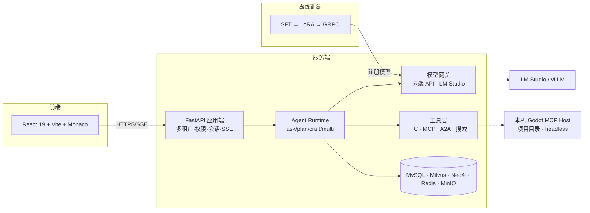

# Agent-Godot

> 垂直于 **Godot 游戏开发** 的生产级 AI Agent 平台 —— 类 CodeBuddy / Cursor 网页版形态，同时是一部"以战代练"的 Agent 全栈工程学习教程。

<div align="center">

**FastAPI · React 19 · MCP · ReAct · RAG · Milvus · Neo4j · SFT → LoRA → GRPO · LM Studio**

</div>

---

## 这是什么

一个可以用自然语言开发 Godot 游戏的智能体平台，也是一个把 Agent 知识体系完整落地的学习项目：

- 🎮 **垂直领域**：绑定本地 Godot 项目目录，Agent 阅读/修改源码（GDScript/C#）、生成 Diff 并确认应用、自动 headless 校验与测试、一键回滚检查点
- 🔌 **MCP + Function Call 双轨工具**：自研 Godot MCP Server（项目选择 / 场景树 / 脚本读写 / headless 运行），可自由接入自定义与联网 MCP 服务器
- 🤖 **四种前沿模式**：`ask`（顾问·只答不改）/ `craft`（执行者·自主干到底）/ `plan`（架构师·先出图纸人批准）/ `multi`（车队·并行派发）—— 对齐 CodeBuddy 三模式并参考 Cursor 新增 `multi`；ReAct / Reflection / Plan-and-Solve / Multi-Agent 四大范式在各模式下**按需组合启用**（模式与范式两层正交，不绑定）
- 🧠 **模型可配置**：Cursor 式 `config/models.yaml`，云端 API（DeepSeek/Qwen/GLM…）与本地模型（LM Studio / Ollama / vLLM）即插即用
- 🎓 **微调闭环**：本地模型支持 SFT → LoRA → GRPO（Agentic RL）训练管线，用自建 GodotBench 量化"基座 → SFT → LoRA → GRPO"四级能力曲线
- 📚 **个人 RAG 知识库**：上传文档/URL 建库（Milvus 混合检索 + 重排 + 引用溯源），预置 Godot 官方文档库，可勾选"联网搜索 / 知识库检索"
- 🏢 **SaaS 化**：多租户、RBAC 权限、会话历史、配额计量、审计日志 —— 按 K8s 生产标准设计

> 完整需求、架构、高并发/分布式/安全/训练方案见 **[Agent-Godot-技术需求与开发方案.md](./Agent-Godot-技术需求与开发方案.md)**（每个功能均标注教材知识点与大厂面试考点）。

## 模块化学习教程（V2 · 生产进度制）

全部知识按**真实项目 Sprint 节奏**重组为 23 篇模块文档（M00~M22），每篇八段式：教材级知识点详解（原理/演进/最小案例/易错点）→ 完整接口签名 → 关键难点片段 → 手敲指引 → 测试验收 → 踩坑留白 → 面试拷打 → 教程映射。**主体代码留白手敲**（签名与测试齐全）。

```text
docs/
├─ module-template.md              # 八段式模板
├─ adr/                            # 架构决策记录（每个重大取舍一篇）
└─ modules/
   ├─ M00-架构设计.md              # 先读：核心包/应用端/前端三架构 + Sprint 总计划
   ├─ M01-LLM地基.md       M12-QueryEngine.md
   ├─ M02-模型网关.md       M13-范式与四模式.md
   ├─ M03-AgentLoop.md     M14-Hooks-Command-Skills.md
   ├─ M04-工具系统.md       M15-Subagent-A2A.md
   ├─ M05-MCP.md           M16-STT语音.md
   ├─ M06-Godot编辑闭环.md  M17-SFT与LoRA.md
   ├─ M07-上下文工程.md     M18-GRPO.md
   ├─ M08-记忆系统.md       M19-应用端平台.md
   ├─ M09-权限与会话.md     M20-Web前端.md
   ├─ M10-RAG.md           M21-生产化.md
   ├─ M11-GraphRAG.md      M22-GodotBench评估.md
   └─ （Sprint S0~S17 · 约 17 周，M00→M01→…→M22 顺序推进，详见方案文档 §0.4）
```

## 功能全景

| 域 | 功能 |
|---|---|
| 交互 | Web 对话界面 · SSE token 级流式 · Monaco Diff 视图 · 文件树 · 斜杠命令 · 语音输入（faster-whisper STT + 意图分析） |
| Agent | ask / plan / craft / multi 四模式 · ReAct 引擎 · Reflection 自检回路 · 预算熔断 · 断线恢复 · Subagent · Skills · Hooks · Permission 确认门 |
| 知识 | RAG 知识库（解析→切分→bge-m3 嵌入→Milvus 混合检索→RRF→重排→引用） · Neo4j GraphRAG（Godot API 图谱+项目结构图） · Query Engine（意图路由/HyDE 改写） · 联网搜索 |
| 记忆 | 分层记忆（工作/情景/语义/项目画像） · 上下文预算管理与滚动压缩 |
| 工具 | Function Call 注册中心 · 自研 Godot MCP Server · 联网 MCP 服务器 · 资源下载（Kenney/OpenGameArt/Freesound 等，许可证合规） |
| 模型 | 模型网关（OpenAI 兼容统一接入 · 按模式路由 · 熔断降级 · 成本计量） · LM Studio 本地模型 · 微调模型回接 |
| 平台 | 多租户 RBAC · JWT/API Key · 会话历史 · 配额限流 · 审计 · OpenTelemetry 全链路可观测 |
| 训练 | 语料/轨迹构建 · SFT · LoRA/QLoRA · GRPO（可验证奖励：语法检查/测试通过/headless 运行） · vLLM/GGUF 部署 · GodotBench 评估 |

## 架构一图流



## 快速开始（开发环境）

### 前置要求

- Python 3.12+（推荐 uv 管理）、Node 20+、Docker Desktop
- 可选：Godot 4.3+（本机安装，供 headless 校验）、LM Studio（本地模型）

### 启动

```bash
# 1. 基础设施（MySQL/Redis/Milvus/Neo4j/MinIO/embedding/stt）
cd deploy && docker compose up -d

# 2. 后端（核心包 agent_godot + 应用端 app）
cd backend
uv sync
cp .env.example .env            # 填入各密钥（亦可全用本地服务）

#    MI-1 阶段：CLI 即应用端（M19 之前无需 FastAPI / 数据库）
uv run godot-agent ask "一句话介绍 Godot 的场景树"

#    M19 起：多租户应用端
uv run alembic upgrade head     # 数据库迁移
uv run uvicorn app.main:app --reload --port 8000

# 3. 前端
cd frontend && pnpm install && pnpm dev

# 4.（可选）本地模型：LM Studio 加载 qwen2.5-coder-7b-instruct 并开启本地服务器
```

### 模型配置示例

```yaml
# config/models.yaml —— 添加/切换模型只需编辑此文件
providers:
  deepseek:
    base_url: https://api.deepseek.com/v1
    api_key_env: DEEPSEEK_API_KEY
    models: [{ id: deepseek-chat, ctx: 64k }]
  lmstudio:                        # 本地模型（OpenAI 兼容）
    base_url: http://127.0.0.1:1234/v1
    models: [{ id: qwen2.5-coder-7b-instruct, ctx: 32k, local: true }]
routing:
  craft: { default: lmstudio/qwen2.5-coder-7b-instruct, params: { temperature: 0.1 } }
  plan:  { default: deepseek-chat, params: { temperature: 0.2 } }
```

### MCP 服务器配置示例

```yaml
# config/mcp.yaml
servers:
  godot:                          # 自研 Godot MCP Server（stdio 本地宿主）
    transport: stdio
    command: python
    args: ["-m", "agent_godot.mcp.servers.godot"]
    env: { GODOT_BIN: "C:/godot/Godot_v4.3.exe" }
  fetch:                          # 联网公共服务器
    transport: http
    url: "https://mcp.fetch.server/mcp"
```

## 里程碑（学习路线）

| 阶段 | 目标 | 状态 |
|---|---|---|
| M0 | 设计与地基（总纲评审 + 骨架 + 基础设施 + CI 绿） | 🚧 进行中 |
| M1 | 能对话的最小 Agent（登录/会话 + 模型网关 + ask 流式） | ⬜ |
| M2 | 会用工具的 Agent（FC + ReAct + 权限确认门 + 审计） | ⬜ |
| M3 | Godot 闭环 MVP（Godot MCP + craft + 回滚） | ⬜ |
| M4 | 记忆与上下文工程 | ⬜ |
| M5 | RAG 三件套（知识库 + 图谱 + Query Engine + 联网） | ⬜ |
| M6 | 前沿工程件套（plan/multi · Subagent · Skills · Hooks/Command · 资源 · STT） | ⬜ |
| M7 | 生产化（高并发/可观测/K8s/安全） | ⬜ |
| M8 | 训练与收官（SFT→LoRA→GRPO + GodotBench 报告） | ⬜ |

> 本表为**能力粒度**（达到什么水平，第 14 章）；**执行粒度**的 Sprint 周计划（S0~S17 · 约 17 周 · MI-1~MI-8 验收点）见开发方案文档 §0.4；自测面试题见第 15 章。

## 知识体系（本项目的学习主轴）

```text
LLM 地基     Transformer · 分词(BPE) · 自回归生成与采样 · Embedding · OpenAI 兼容协议
经典范式     ReAct · Plan-and-Solve · Reflection/Reflexion · Multi-Agent · Agentic RAG
协议与工具   Function Calling · MCP(Tools/Resources/Prompts) · A2A · ANP
工程件套     Context · Memory · RAG · Query Engine · Skills · Hooks · Permission · Session
生产能力     高并发(SSE/缓存/限流熔断) · 分布式(锁/幂等/无状态) · 可观测 · 安全
训练闭环     SFT → LoRA/QLoRA → GRPO(Agentic RL) → vLLM/GGUF 部署 → 评估
```

知识来源：《生产级 Agent 项目学习笔记》（21 模块 · 52 天计划）+ hello-agents + zero2Agent + all-in-rag + DeepSeek Harness（dsh.papertok.ai）教程，映射关系见开发方案文档第 0.2 节。

## 目录结构

```text
Agent-Godot/
├─ Agent-Godot-技术需求与开发方案.md   # 总纲：需求 + 架构 + 模块索引（§0.4）+ Sprint 计划
├─ README.md
├─ docs/         # 模块化教程（modules/M00~M22）+ 模板 + ADR 架构决策记录
├─ config/       # models.yaml / mcp.yaml / permissions.yaml / settings.yaml
├─ backend/
│  ├─ agent_godot/   # ★ 核心包：Agent Runtime（纯库，M02~M16 落点；cli.py 为 MI-1 阶段应用端）
│  └─ app/           # ★ 应用端：FastAPI 多租户外壳（M19）
├─ frontend/     # ★ 前端：React 19 + TS + Vite + Monaco（M20）
├─ training/     # 语料/轨迹构建 / SFT / LoRA / GRPO（M17/M18）
├─ benchmarks/   # GodotBench 任务集与四级模型曲线（M22）
├─ lab/          # 教学实验区（M01 起每模块最小案例）
└─ deploy/       # docker-compose / k8s / nginx / observability
```

> 完整目录树（文件级职责注释）见 `docs/modules/M00-架构设计.md` §2。

## 许可

个人学习项目（License 待定）。

## 声明

本项目用于 Agent 工程学习与实践：Agent Runtime 为手动实现（不依赖编排框架），微调基于开源基座模型，Godot 资源下载默认过滤仅保留可商用许可证（CC0 优先）。
