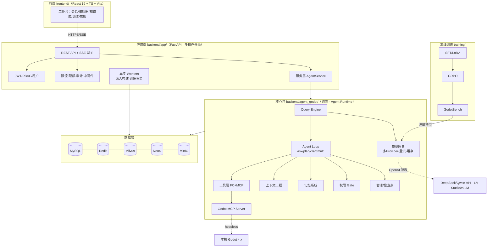
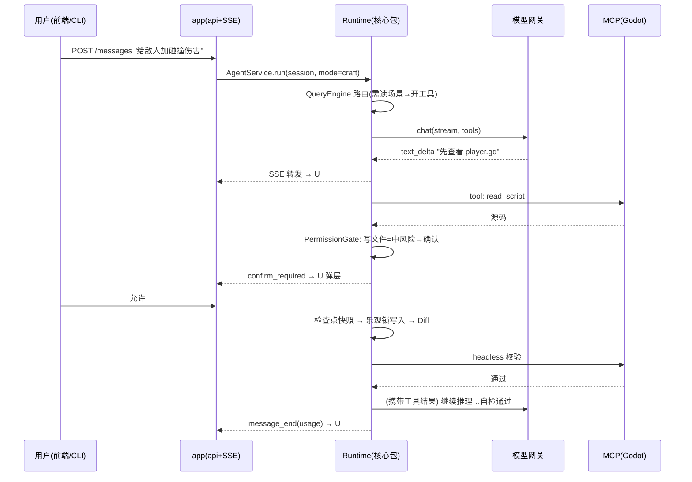

# M00 架构设计（立项第一课）

| 项 | 值 |
|---|---|
| 生产进度 | Sprint 0 · 里程碑 MI-0「图纸就绪」 |
| 代码落点 | 全仓库（本文档即图纸） |
| 前置模块 | 无 |
| 手写比例 | 架构本身 100% 由你拍板；本文档给出的是"参考答案" |
| 教程映射 | 📘 zero2Agent 02-architecture · 📗 hello-agents 整包结构 · 📝笔记「DSH 一切皆插件」 |

---

## 0. 为什么第一篇是架构

真实生产项目的第一天不写业务代码，写三样东西：**需求冻结**（已在总纲 §4）、**架构图纸**（本文档）、**仓库骨架**（空目录 + CI + lint）。之后每个 Sprint 都是在这张图上"填肉"——你后面手敲的每一个文件，都能在本文档的目录树里找到位置，都能在 §9 的映射表里回答"我在哪、我为什么在这"。

参考对象（融合两者，扩展出前端与应用端）：

- **interview-diagnosis-agent**（TS/CLI 形态）：`src/` 下按能力域分包——agent / query-engine / tools / skills / context / memory / permission / session / command / hooks / db，**每个文件名就是一个知识点**
- **hello-agents**（Python 库形态）：`core/`（LLM 基类与适配器）+ `agents/`（四范式各一个类）+ `tools/`（注册表/熔断器/乐观锁）+ `context/` 四件套 + `observability/`，**教程与代码一一对应**

本项目在此基础上多出三块生产化内容：**应用端（多租户 FastAPI）**、**前端（React 19 全交互工作台）**、**离线训练管线**。

---

## 1. 总架构：一图看全



**三条铁律**（面试常问"怎么防架构腐烂"）：

1. **核心包是纯库**：`agent_godot` 不 import FastAPI/React 概念，不感知 HTTP 与租户——它只认"会话 ID + 配置对象"。正因如此，CLI（MI-1）、应用端（MI-7）、离线评估（GodotBench）三个消费者复用同一套 Runtime。
2. **应用端是外壳**：认证/限流/审计/配额全部在 `app/` 层完成，穿透到核心包时已变成干净的领域调用。
3. **一切皆插件**（DSH 思想）：模型（models.yaml）、MCP 服务器（mcp.yaml）、权限规则（permissions.yaml）、Hooks、Skills、Commands 全部注册制——新增不改核心，只加插件。

---

## 2. Monorepo 完整目录树

> 阅读方式：先看五大顶层（backend/frontend/training/基准/部署），再深入各包。**每个文件都是一个知识点的落点**，后文 §9 映射表逐一对号。

```text
Agent-Godot/
├─ docs/
│  ├─ module-template.md              # 模块文档八段式模板
│  ├─ modules/                        # M00~M22 教学文档（本系列）
│  └─ adr/                            # 架构决策记录（ADR-001-...md，每个重大取舍一篇）
├─ config/                            # ★ 产品配置面（用户可编辑，运行时热加载）
│  ├─ models.yaml                     #   Provider/模型/四模式路由（Cursor 式）
│  ├─ mcp.yaml                        #   MCP 服务器注册表（stdio/http/sse）
│  ├─ permissions.yaml                #   权限规则（允许/询问/拒绝 × 路径 glob）
│  └─ settings.yaml                   #   端口/路径/预算/开关
├─ backend/
│  ├─ agent_godot/                    # ★★ 核心包：Agent Runtime（纯库）
│  │  ├─ core/                        # —— 模型接入地基（M02）
│  │  │  ├─ llm.py                    #   LLM 抽象基类 + Message/Usage 数据类
│  │  │  ├─ llm_adapters.py           #   OpenAI 兼容 / Anthropic / 本地 LM Studio 适配器
│  │  │  ├─ streaming.py              #   SSE 流式增量解析器（delta 聚合）
│  │  │  ├─ retry.py                  #   指数退避 + 抖动重试
│  │  │  ├─ circuit_breaker.py        #   熔断器（三态机：闭合/开放/半开）
│  │  │  ├─ semantic_cache.py         #   语义缓存（embedding 相似度命中）
│  │  │  ├─ rate_limiter.py           #   令牌桶限流（客户端侧防 429）
│  │  │  └─ errors.py                 #   错误分类（可重试/不可重试/配额）
│  │  ├─ agent/                       # —— 执行引擎（M03/M13/M15）
│  │  │  ├─ loop.py                   #   ReAct 主循环 + 终止条件 + 死循环治理
│  │  │  ├─ dispatcher.py             #   Tool Call 分发器（并发调度/超时/结果回传）
│  │  │  ├─ budgets.py                #   预算熔断（token/步数/时长/金额）
│  │  │  ├─ events.py                 #   事件流定义（供 SSE/CLI 双消费）
│  │  │  ├─ paradigms/                #   四模式状态机（M13）
│  │  │  │  ├─ ask_mode.py            #     ask：单轮问答
│  │  │  │  ├─ craft_mode.py          #     craft：执行+自检（Reflection 回路）
│  │  │  │  ├─ plan_mode.py           #     plan：DAG 规划 + 逐步执行 + re-plan
│  │  │  │  └─ multi_mode.py          #     multi：多智能体并行
│  │  │  └─ orchestrator.py           #   Subagent 编排器（spawn/隔离/聚合）（M15）
│  │  ├─ query_engine/                # —— 查询引擎（M12）
│  │  │  ├─ intent.py                 #   意图分类（改代码? 问答? 检索?）
│  │  │  ├─ rewriter.py               #   查询改写（指代消解/HyDE）
│  │  │  ├─ router.py                 #   路由决策（本地库/RAG/联网/直答 开关）
│  │  │  └─ pipeline.py               #   编排：intent → rewrite → retrieve → answer
│  │  ├─ tools/                       # —— 工具系统（M04/M06）
│  │  │  ├─ registry.py               #   ToolRegistry（装饰器注册 + JSON Schema 导出）
│  │  │  ├─ schema.py                 #   参数校验（pydantic → JSON Schema）
│  │  │  ├─ response.py               #   ToolResponse 协议（ok/error/数据/引用）
│  │  │  ├─ sandbox.py                #   执行沙箱（超时/输出截断/路径越界防护）
│  │  │  ├─ file_lock.py              #   乐观锁文件编辑（mtime/hash 校验）
│  │  │  ├─ builtin/                  #   内置 FC 工具
│  │  │  │  ├─ file_tools.py          #     读写/列目录/搜索
│  │  │  │  ├─ diff_tool.py           #     Diff 生成与应用
│  │  │  │  ├─ todowrite_tool.py      #     进度管理
│  │  │  │  └─ task_tool.py           #     子代理派生工具
│  │  │  └─ godot/                    #   Godot 领域 FC 工具（M06）
│  │  │     ├─ scene_tools.py         #     场景树解析/修改（.tscn）
│  │  │     ├─ script_tools.py        #     GDScript 读写/静态检查
│  │  │     └─ headless.py            #     headless 运行/测试/导入校验
│  │  ├─ mcp/                         # —— MCP 子系统（M05）
│  │  │  ├─ client/
│  │  │  │  ├─ transport.py           #   stdio/HTTP/SSE 传输层
│  │  │  │  ├─ jsonrpc.py             #   JSON-RPC 2.0 编解码（手写）
│  │  │  │  ├─ session.py             #   initialize/能力协商/工具发现缓存
│  │  │  │  └─ bridge.py              #   MCP 工具 → FC ToolSpec 桥接转换
│  │  │  └─ servers/
│  │  │     └─ godot/                 #   ★ 自研 Godot MCP Server（M06）
│  │  │        ├─ server.py           #     服务器入口（stdio）
│  │  │        ├─ project.py          #     项目选择/扫描/资源索引
│  │  │        ├─ scenes.py           #     场景工具集
│  │  │        ├─ scripts.py          #     脚本工具集
│  │  │        └─ runner.py           #     headless 执行器
│  │  ├─ context/                     # —— 上下文工程四件套（M07）
│  │  │  ├─ token_counter.py          #   精确/估算双模式计数
│  │  │  ├─ truncator.py              #   Observation 截断策略
│  │  │  ├─ history.py                #   HistoryManager（滚动窗口/保留配对）
│  │  │  ├─ builder.py                #   ContextBuilder（预算分配拼装）
│  │  │  └─ compressor.py             #   摘要压缩（三档策略对比）
│  │  ├─ memory/                      # —— 分层记忆（M08）
│  │  │  ├─ store.py                  #   CRUD + SQLite/MySQL 双实现
│  │  │  ├─ extractor.py              #   记忆抽取器（会话结束时提炼）
│  │  │  ├─ retriever.py              #   召回策略（相关度/时间/重要性加权）
│  │  │  └─ profile.py                #   项目画像（GDScript 版本/命名约定/常用节点）
│  │  ├─ permission/                  # —— 权限系统（M09）
│  │  │  ├─ risk.py                   #   风险分级（读=低/写=中/删·网=高）
│  │  │  ├─ rules.py                  #   规则引擎（permissions.yaml 加载）
│  │  │  ├─ gate.py                   #   统一检查入口（pre-tool hook）
│  │  │  └─ confirm.py                #   Human-in-the-loop 确认（CLI/Web 双形态）
│  │  ├─ session/                     # —— 会话与检查点（M09）
│  │  │  ├─ manager.py                #   Session CRUD
│  │  │  ├─ state.py                  #   状态机（active/waiting_confirm/rolled_back…）
│  │  │  ├─ checkpoint.py             #   编辑前快照（文件级）
│  │  │  └─ rewind.py                 #   回滚/恢复/断线重连
│  │  ├─ hooks/                       # —— Hook 管线（M14）
│  │  │  ├─ pipeline.py               #   优先级排序 + 同步/异步执行
│  │  │  ├─ pre_tool/                 #   工具调用前（权限/审计/参数改写）
│  │  │  └─ post_tool/                #   工具调用后（格式化/统计/记忆触发）
│  │  ├─ command/                     # —— 斜杠命令（M14）
│  │  │  ├─ parser.py                 #   /plan /craft /compact /rewind 解析
│  │  │  └─ handlers/                 #   每命令一个处理器
│  │  ├─ skills/                      # —— Skills 系统（M14）
│  │  │  ├─ loader.py                 #   SKILL.md 发现/解析/按需注入
│  │  │  ├─ registry.py               #   技能检索（关键词→技能）
│  │  │  └─ builtin/                  #   内置技能（打包发布/性能分析/多语言…）
│  │  ├─ rag/                         # —— RAG 管线（M10）
│  │  │  ├─ parsers/                  #   pdf/md/html/url/gdscript 解析
│  │  │  ├─ chunking/                 #   固定/递归/语义切分器
│  │  │  ├─ embedding.py              #   bge-m3 嵌入（本地服务）
│  │  │  ├─ retrieval/                #   向量(Milvus)+BM25 混合检索 + RRF 融合
│  │  │  ├─ rerank.py                 #   重排模型接入
│  │  │  └─ citation.py               #   引用溯源（span→源文档高亮）
│  │  ├─ graphrag/                    # —— 知识图谱（M11）
│  │  │  ├─ graph_builder.py          #   Godot API 图谱构建（实体/关系抽取）
│  │  │  ├─ project_graph.py          #   项目结构图（场景↔脚本↔信号依赖）
│  │  │  ├─ cypher.py                 #   Cypher 查询模板
│  │  │  └─ fusion.py                 #   向量+图谱融合查询
│  │  ├─ voice/                       # —— 语音（M16）
│  │  │  ├─ stt.py                    #   faster-whisper 接入
│  │  │  ├─ vad.py                    #   VAD 分段
│  │  │  └─ features.py               #   语速/停顿/填充词分析
│  │  ├─ observability/               # —— 可观测（贯穿，M21 深化）
│  │  │  ├─ trace.py                  #   Trace/Span 树（OTel 兼容）
│  │  │  ├─ events.py                 #   结构化事件总线（SQLite 落地）
│  │  │  └─ metrics.py                #   指标（token/延迟/成功率）
│  │  ├─ db/                          # —— 仓储接口（端口-适配器）
│  │  │  ├─ ports.py                  #   抽象 Repository 协议（核心包只认它）
│  │  │  └─ sqlite_impl.py            #   CLI 单机实现
│  │  └─ cli.py                       #   godot-agent CLI（typer）——MI-1 阶段的"应用端"
│  ├─ app/                            # ★★ 应用端：FastAPI 多租户外壳（M19）
│  │  ├─ main.py                      #   应用工厂（lifespan/中间件注册/路由挂载）
│  │  ├─ core/
│  │  │  ├─ config.py                 #   pydantic-settings（.env）
│  │  │  └─ deps.py                   #   依赖注入（当前租户/用户/会话）
│  │  ├─ auth/
│  │  │  ├─ jwt.py                    #   签发/校验（access+refresh）
│  │  │  ├─ rbac.py                   #   角色→权限矩阵（owner/admin/dev/viewer）
│  │  │  ├─ tenants.py                #   租户上下文与隔离键
│  │  │  └─ api_keys.py               #   API Key 管理
│  │  ├─ middleware/
│  │  │  ├─ rate_limit.py             #   网关限流（Redis+Lua 滑动窗口）
│  │  │  ├─ quota.py                  #   配额计量（token/次数 → 计费表）
│  │  │  └─ audit.py                  #   审计日志中间件
│  │  ├─ api/v1/
│  │  │  ├─ auth_router.py            #   登录/刷新/key
│  │  │  ├─ sessions_router.py        #   会话 CRUD + 列表
│  │  │  ├─ messages_router.py        #   ★ 发消息（SSE 流式响应）
│  │  │  ├─ projects_router.py        #   Godot 项目绑定/文件树/Diff 审查/确认应用
│  │  │  ├─ knowledge_router.py       #   知识库上传/构建状态/检索测试
│  │  │  ├─ training_router.py        #   数据集/训练任务/曲线
│  │  │  └─ admin_router.py           #   租户/用户/配额/审计查询
│  │  ├─ services/
│  │  │  ├─ agent_service.py          #   ★ 桥接层：HTTP 请求 → 核心包 Runtime
│  │  │  ├─ project_service.py        #   项目/文件/快照
│  │  │  └─ knowledge_service.py      #   知识库编排
│  │  ├─ sse/
│  │  │  ├─ hub.py                    #   连接管理（注册/注销/心跳/断线恢复）
│  │  │  └─ protocol.py               #   事件协议（与前端约定的 JSON 格式）
│  │  ├─ workers/
│  │  │  ├─ celery_app.py             #   Celery 实例
│  │  │  ├─ embed_tasks.py            #   异步嵌入构建
│  │  │  └─ train_tasks.py            #   训练任务调度（调用 training/）
│  │  ├─ models/                      #   SQLAlchemy ORM（多租户表）
│  │  │  └─ ... + alembic/ 迁移
│  │  └─ tests/
│  ├─ tests/                          # 核心包测试（每模块 pytest 随写随跑）
│  ├─ pyproject.toml                  # 依赖声明（PEP 621）+ 导出 agent-godot 包；uv 管理无需 requirements.txt（pip 兼容场景可 `uv export` 按需导出，M21）
│  ├─ .env.example                    # 环境变量模板：DEEPSEEK_API_KEY 等（cp .env.example .env；真实 .env 进 .gitignore，由入口 cli.py / app.core.config 加载——核心包不读环境变量）
│  └─ uv.lock                         # uv sync 自动生成并提交——锁死全量传递依赖，可复现构建
├─ frontend/                          # ★★ 前端（M20）
│  ├─ src/
│  │  ├─ app/                         #   路由/布局/全局 Provider
│  │  ├─ api/
│  │  │  ├─ client.ts                 #   openapi-typescript 生成的类型化客户端
│  │  │  └─ sse.ts                    #   ★ SSE 客户端（重连/事件分发/背压）
│  │  ├─ stores/                      #   zustand：会话/设置/通知
│  │  ├─ features/
│  │  │  ├─ chat/                     #   会话列表·消息流·Markdown 渲染
│  │  │  │  ├─ MessageStream.tsx      #     消息流（user/assistant/tool 三类气泡）
│  │  │  │  ├─ ToolCallCard.tsx       #     工具调用卡片（参数/结果/折叠）
│  │  │  │  ├─ ConfirmGate.tsx        #     权限确认弹层（允许一次/总是/拒绝）
│  │  │  │  └─ CitationBadge.tsx      #     RAG 引用角标（点击跳源文档）
│  │  │  ├─ editor/                   #   ★ 工作台核心
│  │  │  │  ├─ FileTree.tsx           #     项目文件树
│  │  │  │  ├─ MonacoPane.tsx         #     Monaco 编辑器（GDScript 高亮）
│  │  │  │  ├─ DiffReview.tsx         #     ★ Diff 审查面板（逐块 approve/reject）
│  │  │  │  ├─ SceneTree.tsx          #     .tscn 场景树可视化
│  │  │  │  └─ PreviewPane.tsx        #     运行预览（截图流/iframe 嵌入）
│  │  │  ├─ knowledge/                #   知识库管理（上传/构建进度/检索测试）
│  │  │  ├─ training/                 #   数据集管理·训练任务·损失曲线
│  │  │  └─ admin/                    #   租户/成员/配额/审计
│  │  ├─ components/ui/               #   基础组件（shadcn/ui）
│  │  └─ hooks/                       #   useSSE/useConfirm/useHotkey
│  └─ package.json                    #   pnpm workspace
├─ training/                          # ★ 离线训练（M17/M18）
│  ├─ datasets/
│  │  ├─ corpus_crawler.py            #   Godot 文档/QA 语料采集
│  │  ├─ sft_builder.py               #   SFT 样本构造（Chat Template+loss mask）
│  │  ├─ trajectory_builder.py        #   ★ 轨迹采集（成功 craft 会话 → GRPO 提示）
│  │  └─ quality.py                   #   去重/过滤/配比
│  ├─ sft/
│  │  ├─ lora_layer.py                #   ★ 手写教学版 LoRA 层（ΔW=BA）
│  │  ├─ train_sft.py                 #   LLaMA-Factory 配方调用脚本
│  │  └─ merge_export.py              #   合并导出（vLLM/GGUF）
│  ├─ grpo/
│  │  ├─ rewards/                     #   ★ 可验证奖励（语法检查/测试通过/headless）
│  │  │  ├─ syntax_reward.py
│  │  │  ├─ test_reward.py
│  │  │  └─ run_reward.py
│  │  ├─ grpo_core.py                 #   ★ 手写教学版 GRPO 损失（组内优势）
│  │  └─ train_grpo.py                #   verl 生产配方
│  ├─ configs/                        #   超参/数据配置
│  └─ pyproject.toml                  #   独立依赖声明（uv workspace member）——重 GPU 依赖与在线服务物理隔离（§6 铁律）
├─ benchmarks/                        # GodotBench（M22）
│  ├─ tasks/                          #   任务集（每个 = 说明+初始项目+验收脚本）
│  ├─ runner.py                       #   跑分器（隔离运行/超时/评分）
│  ├─ judges/                         #   规则判定 + LLM-as-a-Judge
│  └─ reports/                        #   基线与迭代报告
├─ lab/                               # ★ 教学实验区（M01 起，跑通即扔）
│  ├─ m01/  mini_bpe.py · attention.py · sampler.py · mini_embed.py
│  ├─ m02/  ...（每模块最小案例独立目录）
├─ deploy/
│  ├─ docker-compose.yml              #   一键起 MySQL/Redis/Milvus/Neo4j/MinIO/embedding/stt
│  ├─ k8s/                            #   Deployment/Service/Ingress/HPA
│  ├─ nginx/                          #   反代 + SSE 缓冲配置
│  └─ observability/                  #   OTel Collector/Prometheus/Grafana/Loki
└─ README.md
```

---

## 3. 核心包 `agent_godot`：设计细则

### 3.1 子包依赖方向（import 只能向下/向右）

```text
        cli.py
          │
   ┌──────┼──────────────────────┐
   ▼      ▼                      ▼
 agent  query_engine          observability
   │      │
   ▼      ▼
 tools  mcp  context  memory  permission  session  hooks  command  skills  rag  graphrag  voice
   \      \    |        |        |          |        |       |        |      |        |
    └──────┴────┴────────┴────────┴──────────┴────────┴───────┴────────┴──────┴────────┘
                                   │
                                   ▼
                        core/（LLM 基类与适配器）
                                   │
                                   ▼
                        db/ports.py（仓储协议，实现可替换）
```

规则：

- `core` 不依赖任何兄弟包（地基）
- `agent` 是唯一"编排者"，可以依赖所有能力包；能力包之间**禁止横向 import**（memory 不能 import rag）——需要协作时由 `agent` 层串线，这正是解耦的关键
- 所有外部状态经 `db/ports.py` 协议访问：CLI 场景注入 SQLite 实现，SaaS 场景注入 MySQL+Redis 实现（端口-适配器模式）

### 3.2 与两个参考架构的对照

| 参考项目 | 本项目对应 | 差异点 |
|---|---|---|
| interview-diagnosis `src/agent/loop.ts` | `agent_godot/agent/loop.py` | 同为 ReAct 核心，增加预算熔断与事件流 |
| interview-diagnosis `query-engine/provider.ts` | 拆为 `core/llm*.py`（接入）+ `query_engine/`（编排）| 接入与编排分离，query_engine 只做"怎么问"，不管"怎么连" |
| hello-agents `core/llm_adapters.py` | `core/llm_adapters.py`（同名致敬）| 增加 LM Studio/本地模型与语义缓存 |
| hello-agents `agents/react_agent.py` 等 4 类 | `agent/paradigms/` 四模式状态机 | 范式从"四个类"升级为"四模式可切换的状态机"（DSH 思想） |
| hello-agents `tools/circuit_breaker.py` | `tools/` 无、`core/circuit_breaker.py` | 熔断是模型/网络层关注点，归 core |
| hello-agents `context/` 四件套 | `context/` 五件套 | 增加 compressor（滚动摘要压缩） |

---

## 4. 应用端 `app`：设计细则

### 4.1 分层与请求流

```text
Request
  → middleware（限流 → 审计 → 租户上下文注入）
  → api/v1/*_router.py（参数校验，薄）
  → services/*（编排：取会话 → 调核心包 → 推 SSE 事件）
  → agent_godot（核心 Runtime，对 HTTP 一无所知）
  ← events → sse/hub.py → SSE 响应
```

### 4.2 SSE 事件协议（前后端契约，M19/M20 共用）

```jsonc
// POST /api/v1/sessions/{id}/messages  →  text/event-stream
{"type":"message_start","message_id":"..."}
{"type":"text_delta","delta":"让我先看下场景结构"}
{"type":"tool_call_start","tool":"godot_list_scenes","call_id":"..."}
{"type":"tool_call_result","ok":true,"summary":"3 个场景"}
{"type":"confirm_required","action":"write_file","path":"res://enemy.gd","risk":"medium"}
{"type":"message_end","usage":{"input":812,"output":204,"cost_usd":0.003}}
```

关键设计：**确认门（confirm_required）通过 SSE 下发、前端展示弹层、用户选择经普通 REST 回传**——一个会话在等待确认期间状态机停在 `waiting_confirm`（见 M09）。

### 4.3 多租户隔离三件套

1. 认证：JWT（短期）+ Refresh（长期）+ API Key（程序调用）
2. 隔离：所有业务表带 `tenant_id`，仓储层强制注入过滤（防越权写在端口实现里）
3. 配额：中间件计量 token → `usage_records` 表 → 超限 429

---

## 5. 前端 `frontend`：设计细则

### 5.1 技术栈

React 19 + TypeScript + Vite + zustand（状态）+ Tailwind + shadcn/ui（组件）+ Monaco Editor（代码/Diff）+ openapi-typescript（类型化 API 客户端，后端 OpenAPI 自动生成）。

### 5.2 两个难点（M20 展开）

- **SSE 客户端**：`fetch` + `ReadableStream` 手写（EventSource 不支持 POST/headers）；断线重连用 `Last-Event-ID`；事件分发到 zustand store 驱动三类气泡增量渲染
- **Diff 审查闭环**：后端产出 unified diff → 前端 Monaco DiffEditor 渲染 → 逐块 approve/reject → 回传应用 → 触发检查点

### 5.3 前端不做的事

不做业务逻辑（路由决策/预算/权限判定全在后端）；不做直连数据层（一切经 API）——保证 CLI 与 Web 是平级消费者。

---

## 6. 离线训练与主仓库的关系

```text
training/（独立 venv/容器，重 GPU 依赖）
   │  产出：LoRA adapter / 合并模型
   ▼
benchmarks/runner.py（GodotBench 打分，只依赖核心包 CLI）
   │  产出：报告 → 决策（回接 or 回滚）
   ▼
config/models.yaml 注册新模型 → 网关灰度路由
```

训练代码与在线服务**物理隔离**（不同目录/依赖/硬件），只通过"模型产物 + models.yaml"衔接——这是生产项目铁律：训练失败绝不影响在线。

---

## 7. 一次 craft 请求的全链路时序



---

## 8. 架构演进路线（= 生产进度主线）

| 阶段 | 形态 | 新增部件 | 废弃/降级 |
|---|---|---|---|
| MI-1 | **CLI 工具** | `core/` `agent/loop` `tools` `mcp` `cli.py` + SQLite | — |
| MI-2 | 可靠 CLI | `context/` `memory/` `permission/` `session/` | — |
| MI-3~5 | 智能 CLI | `rag/` `graphrag/` `query_engine/` `paradigms/` `hooks` `skills` `voice/` | — |
| MI-6 | 自研模型 | `training/` + 微调模型回接网关 | — |
| MI-7 | **Web 平台** | `app/` 全量 + `frontend/` 全量 + MySQL/Redis 仓储实现 | SQLite 实现降级为"个人模式" |
| MI-8 | 生产化 | k8s/可观测/压测 + GodotBench 报告 | — |

> 这条"CLI 先行 → 服务化 → 平台化"的路线本身就是面试素材：**先用最薄的消费者（CLI）验证核心包 API 设计，再让 Web 复用**——避免一上来写 Web 把 Runtime 接口设计带偏。

---

## 9. 模块 ↔ 代码落点映射表（23 篇文档的施工图）

| 模块 | Sprint | 手敲代码落点 | 验收 Demo |
|---|---|---|---|
| M00 架构设计 | S0 | 仓库骨架 + CI + ADR-0001 | `tree` 与本文档一致 |
| M01 LLM 地基 | S0-1 | `lab/m01/`（mini-BPE/attention/sampler/embed） | 4 个实验脚本各出预期输出 |
| M02 模型网关 | S2 | `core/` 全部 + `lab/m02/` | CLI 直连 3 家 Provider 流式输出 |
| M03 Agent Loop | S2 | `agent/loop.py dispatcher.py budgets.py events.py` | `godot-agent ask "hi"` 走通 ReAct 3 步 |
| M04 工具系统 | S3 | `tools/registry|schema|response|sandbox|file_lock|builtin/` | 注册 3 工具并并发调用成功 |
| M05 MCP | S3 | `mcp/client/` 全部 | 手写客户端调通官方 echo server |
| M06 Godot 闭环 | S4 | `mcp/servers/godot/` + `tools/godot/` | 对话改 .tscn → headless 通过 → 回滚 |
| M07 上下文工程 | S5 | `context/` 五件套 + `lab/m07/` | 50 轮长会话不超预算 |
| M08 记忆 | S5 | `memory/` | 新会话记得项目命名约定 |
| M09 权限与会话 | S6 | `permission/` `session/` | 写文件必弹确认；/rewind 恢复 |
| M10 RAG | S7 | `rag/` + `lab/m10/`（BM25 手写） | 问 Godot API 带引用溯源 |
| M11 GraphRAG | S8 | `graphrag/` | 多跳问题"信号 A 影响哪些场景"答对 |
| M12 Query Engine | S8 | `query_engine/` | 三类意图自动路由正确率抽检 |
| M13 范式与模式 | S9 | `agent/paradigms/` | /plan 拆 5 步任务并自动执行 |
| M14 Hooks/Cmd/Skills | S10 | `hooks/ command/ skills/` | 写插件不改核心包一行 |
| M15 Subagent | S10 | `agent/orchestrator.py` | 两子代理并行改两文件 |
| M16 STT 语音 | S11 | `voice/` | 录音→转写→诊断报告 |
| M17 SFT/LoRA | S12 | `training/datasets/sft_builder.py` `sft/lora_layer.py train_sft.py` | 教学版 LoRA 收敛；7B QLoRA 可跑 |
| M18 GRPO | S13 | `training/grpo/` | 组内优势手算对拍 verl；奖励曲线上升 |
| M19 应用端平台 | S14 | `app/` 全量 | 双租户互不可见对方数据 |
| M20 Web 前端 | S15 | `frontend/` 全量 | Diff 审查+确认门+SSE 全交互 |
| M21 生产化 | S16 | `deploy/` `observability/` 深化 + 压测脚本 | 压测 P99 达标报告 |
| M22 GodotBench | S17 | `benchmarks/` | 基座/SFT/LoRA/GRPO 四级曲线 |

---

## 10. Sprint 总计划（真实进度节奏，约 17 周）

| Sprint | 周 | 模块 | 里程碑验收 |
|---|---|---|---|
| S0 | W1 | M00 | 骨架 + CI 绿灯 |
| S1 | W1-2 | M01（并行预研） | 实验全跑通，地基补完 |
| S2 | W2-3 | M02→M03 | **MI-1a：能对话的最小 Agent** |
| S3 | W3-4 | M04→M05 | **MI-1b：会用工具** |
| S4 | W5 | M06 | **MI-1：Godot 闭环 MVP（产品首次"可用"）** |
| S5 | W6 | M07→M08 | **MI-2a：长会话 + 记忆** |
| S6 | W7 | M09 | **MI-2：可内测（安全可控）** |
| S7 | W8-9 | M10 | **MI-3a：知识库问答带引用** |
| S8 | W10 | M11→M12 | **MI-3：知识三件套齐** |
| S9 | W11 | M13 | **MI-4a：plan 模式** |
| S10 | W12 | M14→M15 | **MI-4：完整 Agent 形态** |
| S11 | W13 | M16 | **MI-5：语音** |
| S12 | W14 | M17 | **MI-6a：SFT/LoRA** |
| S13 | W15 | M18 | **MI-6：GRPO，自研模型回接** |
| S14 | W16 | M19 | **MI-7a：多租户后端** |
| S15 | W17 | M20 | **MI-7：Web 工作台可用** |
| S16-17 | W18-19 | M21→M22 | **MI-8：生产化 + 评估收官报告** |

---

## 11. 技术选型基线（版本钉死，ADR 可改）

| 层 | 选型 | 一句话理由 |
|---|---|---|
| 语言/包管理 | Python 3.12 + uv | 锁定快、monorepo 友好 |
| Web | FastAPI + uvicorn | 原生 async + OpenAPI 自动生成喂前端 |
| ORM/迁移 | SQLAlchemy 2 + Alembic | 异步引擎 + 版本化迁移 |
| 前端 | React 19 + Vite + TS + pnpm | 生态最全；openapi-typescript 全链路类型 |
| 状态/组件 | zustand + shadcn/ui | 轻状态 + 可定制组件 |
| 编辑器 | Monaco | Diff 审查核心 |
| 队列 | Celery + Redis | 训练/嵌入异步任务 |
| 向量库 | Milvus Lite→Standalone | 开发零负担→生产可扩展 |
| 图库 | Neo4j 5 | Cypher 教学资料最多 |
| 对象存储 | MinIO | S3 兼容，本地可跑 |
| 可观测 | OTel + Prometheus + Grafana + Loki | 事实标准四件套 |
| 训练 | LLaMA-Factory(SFT) + verl(GRPO) | 工业级配方，教学版与生产版并存 |
| 推理 | vLLM / LM Studio | 服务化 / 桌面化各取所需 |

---

## 12. 面试拷打（架构篇）

1. 为什么核心包必须是纯库？（提示：三个消费者复用；测试不需要起 Web）
2. 能力包之间禁止横向 import，那 memory 需要 RAG 检索怎么办？（由 agent 层串线/事件解耦）
3. 端口-适配器在本项目哪里用了？换 MySQL 成 PostgreSQL 改几个文件？
4. SSE 相比 WebSocket 在本场景为什么更合适？什么场景必须换 WS？
5. 前端为什么用 fetch+ReadableStream 手写 SSE 而不用 EventSource？
6. 训练与服务为什么物理隔离？如果训练要在线学习呢？
7. CLI 先行的架构演进路线，相比"直接写 Web"省了什么、赚了什么？
8. 多租户数据隔离选共享表+tenant_id 还是 schema 隔离还是库隔离？为什么？
9. `models.yaml` 热加载如何避免运行中会话撕裂？
10. 开放题：如果把 Godot 换成 Unity，架构里哪些层零改动、哪些要重写？（考察分层边界）

---

## 13. 本模块作业（动手才记得住）

1. 亲手敲出目录骨架（`mkdir` 全树），写 `.gitignore` 与 CI 空管道
2. 写 ADR-0001：记录"核心包纯库化"的决策、备选方案与后果
3. 对照 §9 映射表，把每个模块的落点目录在 IDE 里打书签——之后 22 个模块你会反复回到这张图
