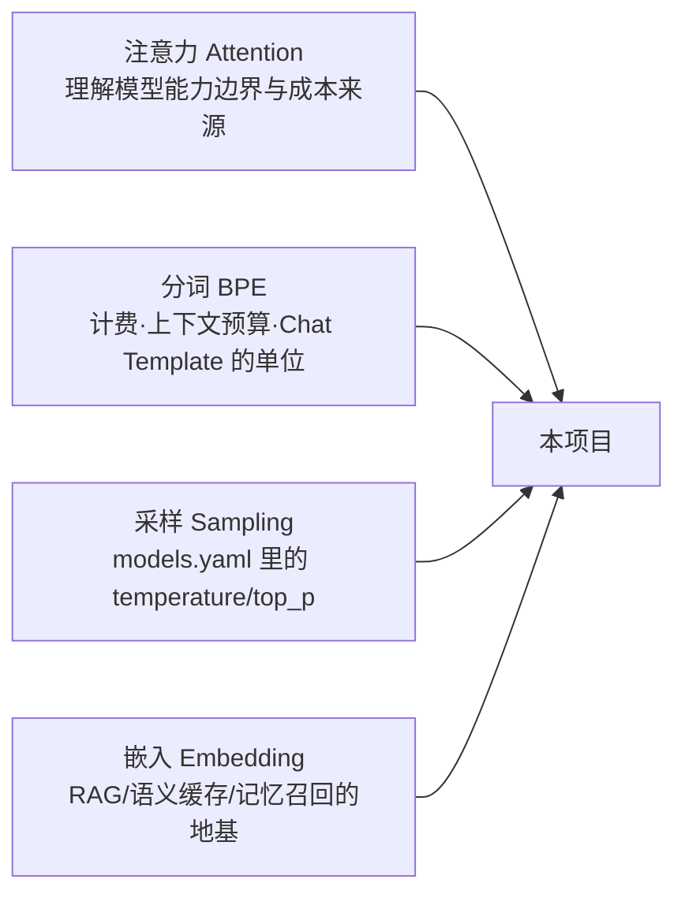

# M01 LLM 地基（技术预研 Spike）

| 项 | 值 |
|---|---|
| 生产进度 | Sprint 0-1 · 里程碑 MI-0「图纸就绪」期间并行预研 |
| 代码落点 | `lab/m01/`（教学实验区，跑通即扔，不进生产——4 个脚本，见 §0.5） |
| 前置模块 | M00（知道实验在全局的位置） |
| 手写比例 | 100% 手敲（仅依赖 numpy——裸看数学本质，生产中对应能力用成熟库） |
| 教程映射 | 📗 hello-agents 第 1-2 章 · 📘 zero2Agent 01 篇 · 📝笔记「LLM 基础」 |

---

## 0. 本模块在项目中的位置

**大白话**：盖楼前先做**地质勘察**。本项目所有上层建筑（网关计费、上下文预算、RAG 检索、微调训练）全部压在四个地基概念上：**注意力、分词、采样、嵌入**。这四个概念你不亲手跑一遍，后面每一步都是黑盒玄学；跑过一遍，后面每个模块你都会遇到"哦，这是 M01 那个东西"的时刻。



**交付后状态**：`lab/m01/` 下 4 个实验脚本各跑出预期输出。之后你在 M02 看到 `usage.total_tokens=1016`、在 M07 做 token 预算、在 M10 建向量索引、在 M17 写 Chat Template 时，脑子里都有这一周的"亲手跑过"。

---

## 0.5 ★ 施工文件清单（开工前必看的一页表）

**本模块你一共要新建 4 个实验脚本**（无依赖顺序，但建议按表序——难度递增）：

| # | 新建文件（完整路径） | 职责一句话 | 关键函数 | 预估行数 | 手敲步骤(§4) |
|---|---|---|---|---|---|
| 1 | `lab/m01/attention.py` | 20 行裸看自注意力 + 因果掩码 | `softmax / causal_mask / causal_attention` | 30 | 步骤 1 |
| 2 | `lab/m01/mini_bpe.py` | 手跑 BPE 合并循环 + 重放编码 | `train_bpe / bpe_encode / pair_freq` | 80 | 步骤 2 |
| 3 | `lab/m01/sampler.py` | 三种采样策略 + 温度扫描 | `softmax_with_temp / top_k_sample / top_p_sample` | 50 | 步骤 3 |
| 4 | `lab/m01/mini_embed.py` | 余弦检索模拟 + InfoNCE 手算 | `cosine_sim / info_nce_loss` | 40 | 步骤 4 |

（可选扩展 `lab/m01/tokenizer_safari.py`：用 tiktoken/sentencepiece 对比真实分词器，步骤 2 附加）

**完成后你拥有**：四个脚本各打印"预期观察点"；一条命令验证：
```bash
uv run python -m lab.m01.attention && uv run python -m lab.m01.mini_bpe \
  && uv run python -m lab.m01.sampler && uv run python -m lab.m01.mini_embed
```

---

## 1. 知识点详解（每节五段：定义 → 大白话 → 举例 → 演进 → 易错点）

### 1.1 Transformer 与自注意力（含多头 / KV Cache / MoE）

**① 严格定义**：自注意力让序列中每个 token 依据"与所有已见 token 的相关度"重新混合信息。每个词向量经三个投影矩阵变换出三种角色——Query（我在找什么）、Key（我能提供什么标签）、Value（我实际携带的信息），计算为：

$$
\text{Attention}(Q,K,V) = \text{softmax}\left(\frac{QK^\top}{\sqrt{d_k}}\right)V
$$

除以 \(\sqrt{d_k}\) 是因为点积方差 ≈ 维度 d_k，不缩放会把 softmax 推进饱和区（梯度消失）。

**② 大白话**：一场**圆桌会议**。每个发言者（token）心里有一张"我想了解什么"的清单（Query），桌上每人胸前挂着自己的"话题标签"（Key）和"干货内容"（Value）。发言前，你拿自己的清单逐个扫别人的标签打相关分（Q·K），分高的多听、分低的不听（softmax 归一化），最后把听到的干货按比例融合（·V）——这就是你新的认知状态。

**③ 举例**：`attention.py` 的 20 行核心，逐行语义（完整代码见 §3）：

```python
x = rng.normal(size=(4, 8))               # 4 个 token，各 8 维向量（假装是查表后的词向量）
Wq, Wk, Wv = (rng.normal(size=(8, 8)) for _ in range(3))
Q, K, V = x @ Wq, x @ Wk, x @ Wv          # 三个角色：同一批人，三种身份投影

scores = Q @ K.T / np.sqrt(8)             # [4,4] 两两相关分矩阵；(i,j)=i 对 j 的兴趣
scores[np.triu(np.ones((4,4)), k=1).astype(bool)] = -1e9   # 因果掩码：未来位置判死刑
attn = np.exp(scores) / np.exp(scores).sum(-1, keepdims=True)  # 每行归一 → 注意力权重
out = attn @ V                            # 按权重把别人的干货融合进自己
```

为什么掩码设 **-1e9 而不是 0**：下一步过 exp——`exp(-1e9)≈0` 彻底出局；`exp(0)=1` 反而白送权重。**必须让它在指数上死掉，而不是数值上归零**。输出的不变量：attn 每行和=1、上三角全 0（第 0 行输出恰好等于 V[0]——它只能看自己）。

**——多头注意力（Multi-Head）——**

**定义**：把 d_model 切成 h 个 d_k=d_model/h 维子空间，每个头**拥有独立的三套投影矩阵**各自算注意力，拼接后再过融合矩阵 W_O：`output = Concat(head_1…head_h)·W_O`。

**大白话**：一场戏用 **8 台摄像机同时拍**——一台专拍表情（指代关系）、一台专拍手部动作（句法搭配）、一台专拍走位（位置邻近）。单机位（单头）每层只能选一个焦点；多机位各拍各的，后期（W_O）再剪成一台戏。

**举例**："小猫 追 自己 的 尾巴，因为 它 很 无聊"——"它"同时牵扯三种关系，一个头表达不了多套并行的关注分配：

| 头 | 自发学到的模式 | 例句中的表现 |
|---|---|---|
| 头 1 | 指代消解 | "它"的注意力集中在"小猫" |
| 头 2 | 动宾搭配 | "追"的注意力集中在"尾巴" |
| 头 3 | 形容词-主语 | "无聊"的注意力集中在"它" |
| 头 4 | 局部邻近 | 每个 token 主要看左右邻居 |

分工是训练**涌现**的（没人指定）。两个面试级细节：①计算量不变——8 头×64 维 = 1 头×512 维；②拼接后必须过 W_O 融合，只 concat 等于各说各话。Godot 代码场景同理：`area_entered` 信号需要有的头盯信号连接、有的头盯类型系统、有的头盯缩进层级——一个头装不下"语法+类型+缩进"三套关系。

**——KV Cache（推理加速的根基）——**

**定义**：自回归生成时，第 N 步的 Query 是新 token，但 K/V 需要全序列。由因果掩码的不变性——**第 i 个 token 的 K/V 只由前 i 个 token 决定，一旦算出永不改变**——历史 K/V 可缓存复用，每步只需算新 token 的一行 q/k/v。

**大白话**：续写长篇小说——前面 40 章你做过笔记（K/V 缓存），写第 41 章只需翻笔记，不用把前 40 章从头再读一遍。每写一章，笔记厚一页。

**举例（显存手算，面试必考）**：KV Cache 字节 = 2(K和V) × 层数 × 序列长 × d_model × 每参数字节。7B 级模型（32 层、d=4096、fp16=2 字节）：

```text
每 token：2 × 32 × 4096 × 2 = 512 KB
32K 上下文：512KB × 32768 = 16 GB   ← 比模型权重本身还大！
```

由此直接推出三个工程事实：①"上下文长=显存/费用线性增长"（M07 压缩历史的动机）；②vLLM PagedAttention（分页管理，利用率 30%→90%，M21 压测会遇到）；③**GQA**——现代模型让多个 Q 头共享少数 KV 头（如 28Q 共 4KV），cache 直接除以 7（Qwen2.5 就这么干，这是"多头"与"KV Cache"的工程交汇点）。注意：**KV Cache 只对 decode 阶段有效，prefill（处理 prompt）必须全量算一遍**——这就是 API 输入/输出 token 单价不同、长会话"第一轮慢后面快"的原因。

**——MoE（混合专家）——**

**定义**：把 FFN 层（约占 2/3 参数）替换为 N 个专家 FFN + 一个路由器，每个 token 只激活 Top-k 个专家（加权求和输出）——总参数与每 token 计算量解耦。DeepSeek-V3：总 671B，每 token 仅激活 37B。

**大白话**：**医院分诊台**。路由器 = 分诊护士，专家 = 各科室主任。病人（token）来了，护士判断"这像骨科 53% + 康复科 47%"，只请这两位会诊——不用全院医生到场。买得起整个图书馆（参数），每次只请 8 位顾问（计算）。

**举例（路由器打分，代数字）**：8 个专家，token 隐向量 x 进来，路由器（小线性层+softmax）打分 `g=[0.02, 0.31, 0.05, 0.28, 0.11, 0.09, 0.03, 0.11]` → Top-2 入选（专家2、专家4）→ 权重归一 0.53/0.47 → `输出 = 0.53×FFN₂(x) + 0.47×FFN₄(x)`，其余 6 个专家完全不参与。两个反直觉点：①专家分工是训练**涌现**的（某专家恰好对代码缩进 loss 降得多，路由器就多派这类活，正反馈固化）；②**负载均衡是训练成败关键**——路由器偏爱某专家会导致它成瓶颈、其他欠训练，解法是辅助均衡损失（谁被选太多就轻度罚款）。代价清单：显存要装下全部 671B（必须 multi-GPU）、微调更难（M17）。

**④ 演进**：RNN/LSTM 长程依赖靠隐藏状态接力、梯度传 20 步消失（1997→2017 痛了二十年）→ 2017 Attention Is All You Need：任意两 token 直连的 O(1) 路径 → GPT 系砍掉 Encoder、用因果掩码 + 预测下一词统一一切任务为生成 → 规模化路线分叉：稠密（每 token 过全部参数）vs MoE（稀疏激活，便宜且快）→ 推理侧 KV Cache + PagedAttention + GQA 三件套把成本压下来。

**⑤ 易错点**：
- Q·Kᵀ 形状是 `[seq, seq]` 不是 `[seq, d]`——手写最容易转置错
- 因果掩码是"上三角置 -inf"，不是整行清零（自己也要参与 softmax）
- 多头是"切片各自算"不是"矩阵相加"；拼接后还要 W_O
- KV Cache 只对生成阶段有效，prefill 没有 cache 可用
- softmax 前不减 max：`np.exp(1000)` 溢出为 nan（sampler.py 专门练）

### 1.2 分词（word/char → BPE → WordPiece → SentencePiece → BBPE）

**① 严格定义**：分词（tokenization）= **规范化 + 切分 + 查表编码**三步的统称——把原始字符串变成 token ID 序列（可直接查 embedding 表）。BPE：从字符/字节出发，反复合并语料中最高频的**相邻符号对**，直到词表达到目标大小。

**② 大白话**：模型不认字，只认编号。分词器就是**编字典的人**——它决定"玩家"整体算一个编号，还是拆成"玩"+"家"两个编号。字典怎么编，直接决定你的账单（token 数=钱）、你的上下文预算消耗、甚至模型能不能读懂生僻字。

**③ 举例（BPE 合并全流程手算，语料 `low lower lowest newest widest`）**：

```text
第 0 轮:  l o w / l o w e r / l o w e s t / n e w e s t / w i d e s t
第 1 轮: 相邻对统计 (e,s)=3 最高（lowest/newest/widest 各贡献一次）
         → 合并 es:   l o w / l o w e r / l o w es t / n e w es t / w i d es t
第 2 轮: (es,t)=3 最高 → est
第 3 轮: (est,‹/w›)=3 → est‹/w›
第 4-5 轮: (l,o)=3 → lo → (lo,w)=3 → low
          （n e w、w i d 各只出现 1 次，频率低，迟迟轮不到合并）

编码新词（重放合并规则，必须按训练顺序）：
  "lowest" → [low][est]        # 2 token：高频词根已合并
  "widest" → [w][i][d][est]    # 4 token：低频词根没轮上，拆着放
  "玩家"   → [玩家]             # 高频 → 整存；"饕餮" → [饕][餮] 低频拆字但绝不 <UNK>
```

**二元合并铁律（最容易误解的点）**：BPE **永远只做"两两合并"，从不存在一次合并三个**。"est"不是三元合并，是 `(e,s)→es` 再 `(es,t)→est` 的接力——合并产物立刻成为不可分的**符号**，参与下一轮配对。**"符号"≠"字符"**：字符只是第 0 轮的符号。为什么必须两两？①表达力足够——任何 n 元序列可由 n−1 次二元合并构造（完全二叉树）；②三元候选 O(V³) 组合爆炸；③只有按序重放二元规则才保证编码唯一（允许三元则同一字符串多种合法切分）。选择依据：**每轮重新统计当前序列的相邻符号对频率，取最高者**——高频组合被反复加长（e→es→est→est</w>），低频停在起点，这就是"高频词完整保留、低频词拆子词"的机制本身。

**六代演进对比（每代解决上一代的死穴）**：

| 代 | 怎么切 | 死穴→解法 | 词表/OOV |
|---|---|---|---|
| word-level | 空格/分词器 | 词表爆炸 50 万+；新词查无此字→`<UNK>` 信息全丢 | 无解 |
| char-level | 每字符 | 无 OOV 但序列长 3~4 倍（注意力 O(N²) 贵 16 倍）、单字符无语义 | 无 |
| BPE(2016) | 高频对迭代合并 | 折中：高频整存低频拆分，OOV 退化到字符 | 可调 |
| WordPiece | **互信息**选合并 `f(xy)/(f(x)·f(y))` | BPE 选"出场率最高的CP"，WordPiece 选"专一度最高的CP"——`(i,d)` 频率仅 1 却因专一（得分 1.0）击败频率 3 的 `(e,s)` | 同 BPE |
| SentencePiece | 删掉预切分＋空格变▁符号 | BPE 默认按空格切块——**中文没空格直接失效**。SP 把整句当原始流："玩家移动 玩家跳跃 敌人移动 移动玩家" 四行训练：(玩,家)=3 与 (移,动)=3 最高 → **"玩家"从统计中涌现，全程无分词器** | 语言无关、无损可逆 |
| BBPE(GPT-2起) | 初始词表=256 字节 | 字符也有覆盖不了的（emoji/生僻字）。`"玩家".encode("utf-8")` → 6 字节，任何文本=字节序列 → **OOV 数学上不存在**（词表生来含全部 256 字节），代价是罕见内容退化为 3~4 字节 token | 永不 UNK |

Qwen 词表 ~15 万 = 多语言合并（中文词/成语整存，"王者荣耀"1~2 token）+ 代码 token + 特殊 token。代价：embedding 矩阵 15万×3584 ≈ 5.4 亿参数（word-level 词表爆炸的温和版复发）。

**④ 演进主线一句话**：粒度从"人为规定"走向"数据驱动"（频率→互信息），地基从"语言假设"走向"字节完备"（空格→▁→256 字节）。中段那台二元合并机，六代从没换过。

**⑤ 易错点**：
- 合并统计的是**符号对**（可能是子词+子词），每轮合并后要重新统计
- encode 新词 = **按训练顺序重放** merges，乱序得到不同切分（"分词器是模型的一部分、换分词器=换模型"的根源——M17 微调必须加载 Qwen 原装 tokenizer）
- token 数 ≈ 中文 1 字 1~2 token、英文 1 词 1~1.5 token——**计费与上下文预算全按 token 不按字数**
- Chat Template 特殊 token（`<|im_start|>`）也是 token——M17 构造 SFT 数据漏算会污染 loss

### 1.3 自回归生成与采样

**① 严格定义**：语言模型每步输出**整个词表上的概率分布** \(P(x_{t+1}\mid x_{\le t})\)（logits 经 softmax 归一），采样一个 token 拼回输入，循环直到 EOS。采样策略决定"从分布里怎么挑"。

**② 大白话**：模型是**接话大王**，一次只说一个词——因为它戴着因果掩码的眼罩（M01 attention.py 里那个下三角矩阵），永远只能看见过去。你看到的 1000 token 回答 = 1000 轮"出概率 → 挑一个 → 拼回去"。而"怎么挑"就是采样策略：同一个概率分布，挑法不同，模型性格完全不同——greedy 是永远选第一名的乖学生，temperature 是调节"冒险程度"的旋钮，top-k/top-p 是"先砍掉不靠谱的选项再抽签"。

**③ 举例（同一分布跑四种策略，全部手算）**：

上下文"玩家按空格后会"，候选 6 个 token，模型 logits=[5.0, 4.0, 1.0, 0.5, -1.0, -2.0]（词表[跳,蹦,飞,蹲,唱,睡]），softmax 后 **P=[71.4%, 26.3%, 1.3%, 0.8%, 0.2%, 0.07%]**。

| 策略 | 规则 | 本例结果 |
|---|---|---|
| greedy | argmax | 永远"跳"。确定但易复读（上下文相似→永远走同一条路→"我说完这句之后我说完这句之后…"） |
| temperature | **logits÷T 再 softmax**（除 logits 不是除概率！） | T=0.1→[≈100%]（逼近greedy）；T=1→[71/26]；T=2→[52/32/7/5]（"睡"也有戏）。对比度旋钮 |
| top-k | 概率降序砍到前 k 个再重归一抽签 | k=2→{跳,蹦}→73%/27%。死穴：k 拍死——尖锐分布[97%,1%…]硬拖进垃圾；平坦分布[25,22,20,15…]砍掉 53% 合法选项 |
| top-p(核采样) | 降序累加至 ≥p 的**最小集合** | p=0.9：71.4%<90→加"蹦"→97.7%≥90 停→{跳,蹦}。**集合大小自适应**：尖锐时只留 1 个、平坦时留 5 个——当前主流（Holtzman 2019） |

实践标配组合拳：`temperature=0.7 + top_p=0.9`（先调形状再砍尾巴最后抽签）。项目落点 models.yaml：craft=0.1（代码要稳，GDScript 错一个 token 就跑不了）、plan=0.2、ask=0.7。

**为什么 temperature=0.1 而不是 0**：严格实现里 `logits/0` 除零未定义，各 API 约定不一（有的按 greedy 有的报错）——工程上用极小 T 代替，别赌实现。

**④ 演进**：beam search（同时养 B 条候选句子按总概率留最优——翻译时代遗物：适合有标准答案的任务，开放式生成产出"安全但无聊"，且贵）→ top-k（2018，砍长尾）→ top-p（2019，自适应）→ 现代标配 T+top-p 组合。

**⑤ 易错点**：
- softmax 前不减 max：`np.exp(1000)` 直接 inf→nan。技巧 `exp(x-max(x))` 数学等价、数值安全（必须能白板推导）
- top-p 是**排序后累计**，不是"概率>p"（后者 p=0.5 时会把 26% 的"蹦"冤杀）
- temperature 作用在 softmax **之前的 logits**——拿概率除 T 再归一（等比缩放比例不变）几乎无效；除 logits 才作用在指数曲线上
- 抽中 EOS = M03 AgentLoop 的自然终止信号（finish_reason="stop"）；撞 max_tokens 则是 "length"

### 1.4 Embedding 与对比学习（含 InfoNCE 手算）

**① 严格定义**：Embedding = 把离散语义对象（词/句/图/用户）表示为固定 n 维空间中的一个点（向量），且满足**语义相近 ⟺ 位置相近**。句子级嵌入管线：tokenization → 查表 E(V×n) 得 m 个点 → Transformer 编码（上下文混融）→ **池化**（mean-pooling 把 m×n 压成 1×n）→ L2 归一化（落到单位球面）。现代嵌入模型用对比学习（InfoNCE 损失）训练：

$$
L = -\log \frac{\exp(\text{sim}(q,k^+)/\tau)}{\sum_j \exp(\text{sim}(q,k_j)/\tau)}
$$

**② 大白话**：**Embedding = 把"含义"翻译成"位置"**。它是一张学出来的"语义地图"——训练负责把地图画准（相似的东西标在附近），使用时只做一件事：在地图上量距离（余弦）。一图图书馆不按字母排书而按主题相邻排书，embedding 就是那张书架分配表。关键认知：**向量里的数字本身毫无意义，意义全在向量之间的关系**——GPS 坐标 (39.9, 116.4) 单看无意义，但能告诉你"离北京近、离巴黎远"。文本 → Token IDs → Transformer 编码 → 池化 → （可选）归一化 → 句子向量

**注意区分两条管线**（LLM 与嵌入模型分叉点）：查表得到的 m×n 矩阵只是模型第一层输入；**LLM（生成模型）保留 m 个位置的向量、取末位置过 LM Head 出词表分布**（自回归，绝不能池化——池化抹掉位置信息就没法"接着写"）；**嵌入模型（bge）池化+归一化压成 1 个点**（算相似度必须点对点）。双向注意力（encoder）vs 因果掩码（decoder）。

**③ 举例（InfoNCE 手算两态）**：batch 4 对（1 正 3 负，负样本=batch 内别人的正例，白得 1023 个负例——这就是"大 batch 重要"的原因）：

```text
训练前（随机向量，相似度≈0）:
  sims=[0.05,0.03,-0.02,0.01] → logits=sims/0.07 → softmax≈[0.34,0.25,0.15,0.26]
  L = -ln(0.34) ≈ 1.08        ← 随机基线 = ln(4)=1.386：模型瞎猜的损失水平

训练后:
  sims=[0.75,0.45,0.30,0.10] → logits/0.07=[10.71,6.43,4.29,1.43]
  softmax≈[98.6%,1.4%,0.16%,0.01%]  → L=-ln(0.986)≈0.014
  ← 训练的全部故事：把 loss 从 ln(N) 压向 0

梯度方向（"拉"与"推"的力学）: ∂L/∂s_j = p_j - 1[j=y]
  正样本: p-1<0 → 相似度上升（拉）; 负样本: p>0 → 压低（推），分到概率越多推得越狠

τ 的作用: 同差 0.3 的两个候选——τ=1 时概率 57/43（温和），τ=0.07 时 98.6/1.4（严苛）。
  τ 越小对"差一点就混进去"的难负例惩罚越重——难负例贡献最大梯度（M10 建库时挖难负例比随便抽值钱）
```

mini_embed.py 实验下半段就是这段手算的代码化；上半段是检索模拟：随机向量下"如何给敌人加碰撞伤害"与"enemy collision damage"相似度 ≈0（未训练的空间一片漆黑）；换真 bge 后 >0.7——**0→0.7 的差值就是训练买来的**。

**④ 演进（七阶段，每代由上一代死穴驱动）**：

| 阶段 | 做法 | 死穴 |
|---|---|---|
| one-hot | 词表多长向量多长 | 任意两词内积=0——"玩家"与"敌人"的距离="玩家"与"披萨"，空间漆黑 |
| Word2Vec(2013) | 滑窗预测上下文（skip-gram），输入侧权重矩阵成为词向量。副产品变主角 | 静态一词一向量："苹果手机"与"吃苹果"同向量 |
| GloVe(2014) | 全局共现矩阵分解（vs word2vec 局部滑窗） | 同上 |
| BERT 隐层(2018) | 查表+Transformer——同词不同句不同向量 | 原生不为检索训练：各向异性（向量挤在窄锥，余弦全 0.9+，无区分度） |
| SimCSE(2021) | 句级对比学习：同句两次 dropout=天然正样本对，InfoNCE 撑开窄锥 | — |
| bge/E5(2022-23) | 指令式：query 加前缀"为这个句子生成表示以用于检索相关文章："。**漏前缀召回掉 5~10 个点** | — |
| bge-m3(2024，本项目选型) | 一个模型三模式：稠密+稀疏+多向量，多语言——M10 混合检索一个模型全包 | 1024 维必须与 Milvus collection 一致，**换模型=重建索引** |

**⑤ 易错点**：
- 相似度用余弦（归一化后点积）不是欧氏直觉；未归一化点积偏向长文本
- τ 是检索嵌入的温度（0.01~0.07），不是分类任务那个 1.0
- query 与 document 要用不同前缀/指令（bge 中文前缀必加）
- 嵌入维度（bge-m3=1024）必须与 Milvus collection 定义一致
- InfoNCE 数值稳定：先 exp 后 sum 会溢出，生产用 logsumexp（先减 max）——与采样一节同源

---

## 2. 接口设计（实验脚本的"规格"）

```python
# lab/m01/attention.py
def softmax(z: np.ndarray, axis: int = -1) -> np.ndarray: ...
def causal_attention(x, Wq, Wk, Wv) -> tuple[np.ndarray, np.ndarray]:
    """返回 (输出 [seq,d], 注意力权重 [seq,seq])，权重已做因果掩码且每行和=1。"""

# lab/m01/mini_bpe.py
def train_bpe(corpus: list[str], n_merges: int) -> tuple[list[tuple[str, str]], set[str]]:
    """返回 (合并规则有序表, 词表)。"""
def bpe_encode(word: str, merges: list[tuple[str, str]]) -> list[str]:
    """按训练顺序重放合并规则，把新词切成子词序列。"""
def train_wordpiece(corpus, n_merges) -> list[tuple[str, str]]:   # 可选扩展
    """互信息评分版：score=f(xy)/(f(x)*f(y))，对比首轮选择差异。"""

# lab/m01/sampler.py
def softmax_with_temp(logits: np.ndarray, T: float) -> np.ndarray: ...
def top_k_sample(probs: np.ndarray, k: int) -> int: ...
def top_p_sample(probs: np.ndarray, p: float) -> int: ...

# lab/m01/mini_embed.py
def cosine_sim(a: np.ndarray, b: np.ndarray) -> float: ...
def info_nce_loss(q: np.ndarray, k: np.ndarray, tau: float = 0.07) -> float: ...
```

---

## 3. 关键难点参考片段

**难点①：BPE encode 的"重放合并"**（比 train 难想到——encode 一个新词不是查表）：

```python
def bpe_encode(word, merges):
    syms = list(word)
    for a, b in merges:                       # 必须按训练顺序重放！
        i, out = 0, []
        while i < len(syms):
            if i < len(syms) - 1 and syms[i] == a and syms[i+1] == b:
                out.append(a + b); i += 2     # 命中规则合并并跳两步
            else:
                out.append(syms[i]); i += 1
        syms = out
    return syms
```

为什么必须按序：`("l","o")` 在 `("lo","w")` 之前训练出来，乱序重放得到不同切分。

**难点②：softmax 数值稳定**：`exp(x - max(x))` 的技巧与"为什么减 max"必须能白板推导（分子分母同乘 e^{-max}，值不变；最大项变 e^0=1，永不溢出）。

**难点③：top_p 的"最小集合"**：`argsort 降序 → cumsum → searchsorted(cum, p) 截断 → 保留集内重归一化`——不是过滤概率>p。

---

## 4. 手敲指引（函数级伪代码）

### 步骤 1：`lab/m01/attention.py`
| 函数 | 作用（伪代码） |
|---|---|
| `softmax(z)` | `逐元素 exp(z - max(z)) → 除以和`。减 max 防溢出（必写） |
| `causal_mask(n)` | `np.triu(ones((n,n)), k=1).astype(bool)`——上三角 True=未来=屏蔽 |
| `causal_attention(x,Wq,Wk,Wv)` | `Q,K,V = 三次矩阵乘 → scores = Q@K.T/√d → 未来位=-1e9 → 按行 softmax → 返回 (attn@V, attn)` |
**验证**：断言 attn 每行和=1、上三角全 0、第 0 行输出==V[0]。

### 步骤 2：`lab/m01/mini_bpe.py`
| 函数 | 作用（伪代码） |
|---|---|
| `pair_freq(ws)` | `双层循环滑窗，Counter 统计每个词内所有相邻符号对` |
| `train_bpe` | `循环 n_merges 轮：统计 pair_freq → max 取最高对 → 记入 merges → 全语料执行合并（命中对替换为拼接符号）→ 打印本轮合并与剩余高频对` |
| `bpe_encode` | §3 难点①代码——按序重放 |
**验证**：`train_bpe(["low","lowest"],3)` 后 `encode("lowest")` 与训练语料切分一致；观察"est 类后缀先于 rare 词根被合并"。

### 步骤 3：`lab/m01/sampler.py`
| 函数 | 作用（伪代码） |
|---|---|
| `softmax_with_temp` | `z = logits/T → 数值稳定 softmax`（T 作用于 logits！） |
| `top_k_sample` | `argsort 降序取前 k → 重归一 → np.random.choice` |
| `top_p_sample` | `降序 cumsum → searchstyled 截断到累计≥p 的最小集 → 重归一抽签` |
**验证**：T 从 0.1→2.0 扫描打印分布变形；top_p_sample 跑 1000 次画直方图（只出现保留集内的索引）。

### 步骤 4：`lab/m01/mini_embed.py`
| 函数 | 作用（伪代码） |
|---|---|
| `cosine_sim` | `归一化后点积`（注意先归一，之后所有相似度都是一次点积——Milvus 同款惯例） |
| `info_nce_loss` | `sims = q@k.T → logits = sims/tau → loss = -logits[0] + log(sum(exp(logits)))`（代数展开式，玩具数值小不会溢出，注释注明生产用 logsumexp） |
**验证**：随机向量 loss≈ln(4)=1.386；5 句语料两两余弦全 ≈0（含互为翻译的一对——漆黑）；换 sentence-transformers 加载真 bge-small 后翻译对 >0.7（记得给中文 query 加 bge 前缀）。

---

## 5. 测试与验收

```python
def test_causal_attention_masks_future():
    _, attn = causal_attention(x, Wq, Wk, Wv)
    assert np.allclose(attn.sum(-1), 1.0)
    assert (np.triu(attn, k=1) == 0).all()

def test_bpe_encode_replays_merges():
    merges, _ = train_bpe(["low", "lowest"], 3)
    assert bpe_encode("lowest", merges) == ["low", "est"]   # 与训练一致

def test_top_p_minimal_set():
    probs = np.array([0.5, 0.4, 0.05, 0.05])
    # p=0.9 → 保留 {0,1}，重采样 1000 次只出现索引 0/1

def test_info_nce_random_baseline():
    # 随机单位向量 batch=4 → loss ∈ [1.0, 1.8]（围绕 ln4=1.386）
```

**验收 Demo**：四个脚本串跑（§0.5 的命令），每脚本打印预期观察点：注意力下三角、BPE 合并轮次、温度扫描分布、InfoNCE 两态对比。

---

## 6. 踩坑记录（留白自填）

| 日期 | 坑 | 现象 | 根因 | 解法 | 关联知识点 |
|---|---|---|---|---|---|
|     |    |     |     |    |          |

---

## 7. 面试拷打（附详细参考答案）

**1. QKV 三个矩阵各自的语义角色？为什么需要三个而不是 x·xᵀ？**
答：Q=我在找什么（提问视角）、K=我能提供什么标签（被检索视角）、V=我实际携带的信息（内容本身）。用 x·xᵀ 的话，同一份向量既要提问又要回答——角色耦合、表达能力受限；三套独立投影让"怎么问"和"怎么答"分开学习。类比：相亲时你的择偶要求（Q）和你的个人简介（K）是两份独立文档，匹配后才交换真实联系方式（V）。

**2. 为什么除以 √d_k？不除会怎样？**
答：两个 d_k 维随机向量点积的方差 ≈ d_k——维度越高点积数值越大。不缩放时大 logits 进 softmax 输出接近 one-hot（饱和区），梯度趋近 0，训练停滞。除以 √d_k 把方差拉回 ~1，softmax 保持"有梯度"的健康区间。推导要点：Var(q·k)=ΣVar(qᵢkᵢ)=d_k·Var(qᵢ)Var(kᵢ)，故标准差 ∝ √d_k，除以 √d_k 恰好归一。

**3. 多头带来了什么？拼接后缺了哪一步？计算量变大了吗？**
答：带来"关系的多样性"——不同头自发分工学指代/句法/邻近等不同模式（单头每层只能一种关注分配）。拼接后必须过 W_O 融合，否则各头信息不交互。计算量**不变**：8 头×64 维=1 头×512 维，矩阵乘总量相同——买到的是多样性不是算力。

**4. KV Cache 为什么能加速？显存怎么算？**
答：因果掩码保证第 i 个 token 的 K/V 只依赖前 i 个 token——算过一次永不改变，缓存后每步只需算新 token 的一行 q/k/v（O(N) 增量），而非重算全历史（O(N²)）。显存 = 2×层数×序列长×d_model×字节/参数：7B 级（32层/4096维/fp16）每 token 512KB，32K 上下文=16GB，比权重还大——这就是上下文压缩（M07）与 PagedAttention（vLLM 分页管理，30%→90% 利用率）存在的原因。GQA 让多 Q 头共享少数 KV 头，cache 再除以共享比。

**5. BPE 相比 word/char-level 的取舍？BBPE 下 OOV 为什么"数学上不存在"？**
答：word-level 词表爆炸+新词 <UNK> 信息全丢；char-level 无 OOV 但序列长 3~4 倍（注意力 O(N²)）且单字符无语义。BPE 折中：频率驱动合并，高频词整存（省序列）、低频拆子词（不撑词表）。BBPE 把初始词表下沉到 256 字节——任何 UTF-8 文本=字节序列，词表生来覆盖全部字节，最坏退化为字节 token 按字节计费，永不出现查无此字。

**6. 描述 temperature 趋向 0 和 ∞ 的极限行为。**
答：T→0：分布退化为 one-hot（逼近 greedy，完全确定）；T→∞：分布趋于均匀（纯随机抽签）。机理：T 除在 softmax 之前的 logits 上——小于 1 放大差距（锐化），大于 1 缩小差距（钝化）。注意除概率无效（等比缩放归一后比例不变），必须作用于指数曲线之前的 logits。

**7. top-k 与 top-p 各自的失效场景？**
答：top-k（k 固定）在分布尖锐时失效——[97%,1%,1%…] 取 k=2 硬拖进 1% 的垃圾；在分布平坦时失效——[25,22,20,15…] 取 k=2 砍掉 53% 概率质量的合法选项。top-p 集合大小自适应（尖锐时留 1 个、平坦时留 5 个），两头都治好——这是它成主流的原因。top-p 的坑：必须"排序后累计到 ≥p 的最小集合"，不是"概率>p 的过滤"。

**8. InfoNCE 的分母里放的是什么？为什么大 batch 重要？**
答：分母 = batch 内所有候选的相似度指数和（1 正 + N−1 负）——本质是"N 选 1 的 softmax 分类交叉熵"。大 batch = 分母大 = in-batch negatives 多（别人的正例是我的负例，免费获得）= 任务更难 = 学出的空间更精细。随机基线 ln(N) 也随 N 增大——"可学习的空间"更大。这就是嵌入模型训练贵（必须大 batch）的原因。

**9. 相似度为什么用余弦不用欧氏？什么时候等价？**
答：文本检索关心"方向是否一致"（语义同向），不关心向量模长（文本长度/信息量）。高维空间里欧氏距离受维度诅咒且被长文本的大模长主导。归一化到单位球面后两者单调等价（欧氏距离² = 2−2·cos）——工程惯例是入库前统一 L2 归一，之后余弦=一次点积（最快）。

**10. 开放题：给"GDScript 代码搜索"选嵌入模型并设计评测，你怎么做？**
答：选型三考虑：①多语言+代码混合能力（中文注释+英文代码）→ bge-m3 或代码专用模型；②必须支持稀疏模式（代码符号检索靠精确 token，BM25 类不可丢——混合检索）；③维度与建库成本。评测设计：构造真实查询集（自然语言→目标代码片段对，含"信号连接找 connect 调用"这类跨语言对），指标 recall@k / MRR；对照组：纯稠密 vs 纯稀疏 vs 混合、加/不加 query 前缀；错误分析聚焦"语义对但符号错"和"符号对但语义错"两类，指导混合权重。

---

## 8. 教程映射与延伸

- 📗 hello-agents 第 1 章（Transformer/分词）、第 2 章（嵌入）
- 📘 zero2Agent 01 篇（LLM 原理铺垫）
- 必读：Attention Is All You Need（只读 3.2 节）；BPE 原文（Sennrich 2016）
- 选读：The Curious Case of Neural Text Degeneration（top-p 出处）；SimCSE 论文；Plan-and-Solve 时代之前的 ToT（了解搜索式推理）
