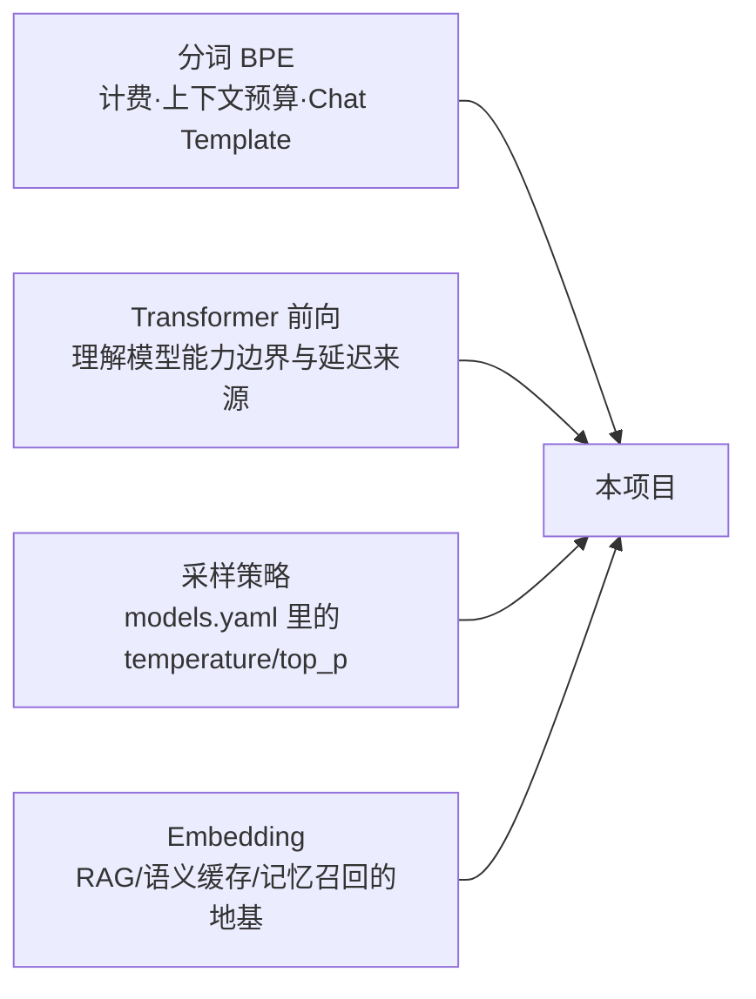

# M01 LLM 地基（技术预研 Spike）

| 项 | 值 |
|---|---|
| 生产进度 | Sprint 0-1 · 里程碑 MI-0「图纸就绪」期间并行预研 |
| 代码落点 | `lab/m01/`（教学实验区，跑通即扔，不进生产） |
| 前置模块 | M00（知道实验在全局的位置） |
| 手写比例 | **② 手写教学版层**：全部实验 100% 手敲（仅依赖 numpy），生产中对应能力用成熟库 |
| 教程映射 | 📗 hello-agents 第 1-2 章 · 📘 zero2Agent 01 篇 · 📝笔记「LLM 基础」 |

---

## 0. 本模块在项目中的位置

真实生产项目开局会留一周做 **技术预研（Spike）**：把项目要用的底层机制各写一个最小实验，确认"我们理解的世界和真实世界一致"。本项目所有上层建筑都压在四个地基上：



**交付后状态**：`lab/m01/` 下 4 个实验脚本各跑出预期输出。之后你在 M02 看到 `usage.total_tokens=812`、在 M07 做 token 预算、在 M17 写 Chat Template 时，脑子里都有这一周的"亲手跑过"。

---

## 1. 知识点详解

### 1.1 Transformer 与自注意力

**① 原理**

注意力回答的问题：每个 token 该"关注"序列中的哪些 token？做法是把每个词向量投影成三个角色：

```text
Query（我在找什么）· Key（我能提供什么标签）· Value（我实际携带的信息）
注意力得分 = softmax(Q·Kᵀ / √d_k) · V
```

为什么除以 \(\sqrt{d_k}\)：点积的大小随维度增长（方差 ≈ d_k），不缩放会把 softmax 推进饱和区——梯度消失。这一步是面试最爱问的"为什么有 √d"。

**多头**：把 d_model=512 切成 8 个 64 维子空间各自做注意力再拼接——不同头可以分别学会"语法依存""指代消解""位置邻近"等不同关系，类似 CNN 的多通道。

**KV Cache（推理加速的根基）**：自回归生成时，第 N 步的 Query 是新 token，但 K/V 都是**全序列**。若每步重算全部历史 K/V 是 O(N²) 浪费——历史 K/V 与新 Query 无关的部分结果可以缓存复用。这是 vLLM PagedAttention（分页管理 KV Cache，显存利用率从 ~30% 提到 ~90%）的前提。

**MoE（一句话到能应对追问）**：FFN 层替换为 N 个专家 + 路由器，每个 token 只激活 Top-k 个专家——参数量与计算量解耦（671B 参数的 DeepSeek-V3 每 token 只激活 37B）。代价：负载均衡难、显存要装下全部专家。

**② 演进**：RNN/LSTM 时代长程依赖靠隐藏状态"接力"，梯度传 20 步就消失（1997→2017 痛了二十年）→ 2017 Attention Is All You Need 用"任意两 token 直连"的 O(1) 路径解决问题 → GPT 系列砍掉 Encoder 只留因果掩码的 Decoder，用"预测下一个词"把一切任务统一为生成。

**③ 最小案例** `lab/m01/attention.py`

```python
import numpy as np

rng = np.random.default_rng(42)
d_model, seq = 8, 4
x = rng.normal(size=(seq, d_model))            # 4 个 token 的词向量

Wq, Wk, Wv = (rng.normal(size=(d_model, d_model)) for _ in range(3))
Q, K, V = x @ Wq, x @ Wk, x @ Wv               # 投影出三角色

def causal_mask(n):                             # 因果掩码：只能看过去
    return np.triu(np.ones((n, n)), k=1).astype(bool)

scores = Q @ K.T / np.sqrt(d_model)             # [seq, seq] 相似度矩阵
scores[causal_mask(seq)] = -1e9                 # 未来位置屏蔽
attn = np.exp(scores) / np.exp(scores).sum(-1, keepdims=True)
out = attn @ V                                  # [seq, d_model]

print(np.round(attn, 2))
# 观察：attn 是下三角矩阵——第 3 个 token 对 0/1/2 各有非零权重，对"未来"全为 0
# 这一行掩码，就是"语言模型只会接话不会预知"的全部秘密
```

**④ 易错点**
- Q·Kᵀ 算的是"两两相似度矩阵"，形状 `[seq, seq]`，不是 `[seq, d]`——手写时最容易转置错
- 因果掩码是"上三角置 -inf"，不是把整个未来行清零（每个 token 自己也要参与 softmax）
- 多头是"切片各自算"不是"多个矩阵相加"；拼接后还要过 W_O 融合
- KV Cache 只对**生成阶段**有效，prefill（处理 prompt）阶段没有 cache 可用

### 1.2 BPE 分词

**① 原理**：初始词表 = 全部单字符（字节级则 256 项），随后反复合并语料中**频率最高的相邻符号对**，直到词表达到目标大小（如 5 万）。"low lower lowest" 的合并顺序由频率决定，最终 `low`、`er`、`est` 成为独立 token。GPT 系用字节级 BPE（BBPE）：任何 UTF-8 文本都先落到字节，**数学上消灭 OOV**（生僻字=多字节组合）。

**② 演进**：按"词"切（word-level）→ 词表爆炸 + 未登录词（OOV）无解 → 按"字"切（char-level）→ 序列过长、丢搭配 → 2016 BPE（源自 1994 压缩算法）折中：高频词完整保留、低频词拆子词 → WordPiece（BERT，按互信息而非频率选合并）→ SentencePiece（语言无关，把空格也当符号，中日友好）→ BBPE（GPT-2 起）。Qwen 词表 ~15 万（多语言大词表，中文效率高但 embedding 参数多）。

**③ 最小案例** `lab/m01/mini_bpe.py`

```python
from collections import Counter

corpus = ["low", "lower", "lowest", "newest", "widest"]
words = [tuple(w) + ("</w>",) for w in corpus]   # </w> 标记词边界

def pair_freq(ws):
    c = Counter()
    for w in ws:
        for i in range(len(w) - 1):
            c[(w[i], w[i+1])] += 1
    return c

merges = []
for round_ in range(6):
    pairs = pair_freq(words)
    if not pairs:
        break
    best = max(pairs, key=pairs.get)             # 最高频相邻对
    merges.append(best)
    words = [tuple(
        "".join(best) if (w[i], w[i+1]) == best else w[i]
        for i in range(len(w) - 1)
    ) + (w[-1],) if False else
        tuple(sum(([("".join(best))] if (w[i], w[i+1]) == best else [w[i]] for i in range(len(w)-1)), []))
    for w in words]
    print(f"第{round_+1}轮 合并 {best} 剩余频率 {pair_freq(words).most_common(3)}")

# 观察点：
# 1. ("e","s","t","</w>") 类后缀会先于 rare 词根被合并——频率驱动
# 2. 亲手解释：为什么 Qwen 把 "ing"/"的" 这类高频单元收进词表——每合并一次，序列就短一点，计算就省一点
```

（上面合并循环故意写得"笨"——你手敲时建议用清晰的 while + 索引扫描重写，体会"合并"这个动作本身。）

**④ 易错点**
- 合并统计的是**符号对**（可能是子词+子词），不是字符对；每轮合并后要重新统计
- encode 一个新词 = 重放 merges 顺序，不是查表
- token 数 ≈ 中文 1 字 1~2 token、英文 1 词 1~1.5 token——**计费与上下文预算全部按 token，不按字数**
- Chat Template（`<|im_start|>` 等）本身也是 token——M17 构造 SFT 数据时漏算会污染 loss

### 1.3 自回归生成与采样

**① 原理**：语言模型每步输出的是**整个词表上的概率分布** \(P(x_{t+1} | x_{\le t})\)，采样一个 token 拼回输入，循环直到 EOS。"解码策略"决定从分布里怎么挑：

| 策略 | 规则 | 特点 |
|---|---|---|
| greedy | 永远取 argmax | 确定性但容易重复车轱辘话 |
| temperature=T | logits ÷ T 再 softmax | T<1 锐化（更稳），T>1 平滑（更浪） |
| top-k | 只在概率前 k 个里采样 | 截断长尾，但 k 是拍死的 |
| top-p（核采样） | 取**累计概率 ≥ p 的最小集合** | 集合大小自适应分布形状，当前主流 |

**② 演进**：beam search（翻译时代遗物，开放式生成会产出"安全但无聊"的句子）→ top-k（2018）→ top-p（2019，Holtzman）→ 现在 models.yaml 里 `temperature: 0.1`（craft 改代码要稳）与 `0.7`（ask 聊天）的差异你从此有了体感。

**③ 最小案例** `lab/m01/sampler.py`

```python
import numpy as np

logits = np.array([5.0, 4.0, 1.0, 0.5, -1, -2])   # 模型某一步的输出
vocab  = ["the", "a", "cat", "dog", "zzz", "qqq"]

def softmax(z, T=1.0):
    z = z / T
    z = np.exp(z - z.max())          # 减 max 防溢出——必写，面试常问
    return z / z.sum()

def top_p_sample(probs, p=0.9):
    idx = np.argsort(-probs)          # 概率降序
    cum = np.cumsum(probs[idx])
    cut = np.searchsorted(cum, p) + 1 # 累计到 p 的最小集合
    keep = idx[:cut]
    renorm = probs[keep] / probs[keep].sum()
    return np.random.choice(keep, p=renorm)

for T in (0.1, 1.0, 2.0):
    print(T, np.round(softmax(logits, T), 3))
# 观察：T=0.1 时 "the" 概率≈1（近似 greedy）；T=2 时分布被拉平
# 再把 top_p_sample 跑 1000 次画直方图，看"长尾被砍、保留集内重归一化"
```

**④ 易错点**
- softmax 前不减 max：`np.exp(1000)` 直接溢出为 nan
- top-p 是**按概率排序后累计**，不是取概率 > p 的（那是另一回事）
- temperature 作用在 softmax **之前**的 logits 上，不是对概率再乘系数
- `temperature=0` 很多 API 会按 greedy 处理，但严格实现里除以 0 未定义——工程上用极小 T 代替

### 1.4 Embedding 与对比学习

**① 原理**：把离散文本映射为稠密向量，语义相近 → 向量夹角小。现代嵌入模型用**对比学习**训练：一个 batch 里，正样本对（问句 vs 其标准答案）互相拉近，与 batch 内其他样本（负样本）推远，损失函数 **InfoNCE**：

\[
L = -\log \frac{\exp(\text{sim}(q, k^+)/\tau)}{\sum_{j}\exp(\text{sim}(q, k_j)/\tau)}
\]

分母把 batch 内所有"非匹配"都当负例——它本质是"一个 softmax 分类：从 N 个候选里挑出正确配对"。分母越大（batch 越大）负例越丰富，嵌入质量越好（这也是嵌入模型训练贵的原因）。

**② 演进**：one-hot（维度=词表、正交、无语义）→ Word2Vec（2013，静态向量，"国王-男+女≈女王"）→ GloVe（全局共现统计）→ BERT 式上下文向量（同词不同义不同向量）→ 句级对比学习（SimCSE）→ 指令式检索嵌入（bge/E5，"query: " 前缀技巧）。本项目 RAG 用 **bge-m3**（支持稠密+稀疏+多向量三模式，正好支撑 M10 混合检索）。

**③ 最小案例** `lab/m01/mini_embed.py`

```python
import numpy as np
rng = np.random.default_rng(0)

# 假装这是嵌入模型输出（真实场景用 sentence-transformers 加载 bge-small）
texts = ["如何给敌人加碰撞伤害", "enemy collision damage",
         "Godot 场景树结构", "recipe: apple pie", "GDScript 信号连接"]
emb = rng.normal(size=(len(texts), 16)); emb /= np.linalg.norm(emb, axis=1, keepdims=True)

def cos(a, b): return float(a @ b)

query = emb[0]
print([(texts[i], round(cos(query, emb[i]), 3)) for i in range(len(texts))])
# 随机向量下相似度 ≈ 0；换 bge 后"如何给敌人加碰撞伤害"与"enemy collision damage"
# 余弦应 > 0.7——跨语言语义对齐就是这么来的

# InfoNCE 手算（模拟一次训练 step）
tau = 0.07
q, k = rng.normal(size=(1, 8)), rng.normal(size=(4, 8))
q, k = q/np.linalg.norm(q), k/np.linalg.norm(k, axis=1, keepdims=True)
logits = (q @ k.T).squeeze() / tau          # [4] 相似度/温度
loss = -logits[0] + np.log(np.exp(logits).sum())
print("InfoNCE loss =", round(loss, 3))      # 随机时 ≈ log(4)=1.386，训练目标：把它压到 0
```

**④ 易错点**
- 相似度用余弦（先归一化再点积），不是欧氏距离直觉；未归一化直接点积会偏向长文本
- τ（温度）控制"推拉力度"，检索嵌入常见 0.01~0.07，不是分类任务那个 1.0
- **query 与 document 通常要用不同前缀/指令**（bge 的 "为这个句子生成表示："）——漏写前缀召回掉 5~10 个点，M10 会再踩一次
- 嵌入向量维度（bge-m3=1024）必须与 Milvus collection 定义一致，改模型=重建索引

---

## 2. 接口设计（lab 实验的"规格"）

```python
# lab/m01/attention.py
def softmax(z: np.ndarray, axis: int = -1) -> np.ndarray: ...
def causal_attention(x: np.ndarray, Wq: np.ndarray, Wk: np.ndarray,
                     Wv: np.ndarray) -> tuple[np.ndarray, np.ndarray]:
    """返回 (输出 [seq,d], 注意力权重 [seq,seq])，权重需已做因果掩码。"""

# lab/m01/mini_bpe.py
def train_bpe(corpus: list[str], n_merges: int) -> tuple[list[tuple[str, str]], set[str]]:
    """返回 (合并规则有序表, 词表)。"""
def bpe_encode(word: str, merges: list[tuple[str, str]]) -> list[str]:
    """按训练出的合并顺序重放，把新词切成子词序列。"""

# lab/m01/sampler.py
def softmax_with_temp(logits: np.ndarray, T: float) -> np.ndarray: ...
def top_k_sample(probs: np.ndarray, k: int) -> int: ...
def top_p_sample(probs: np.ndarray, p: float) -> int: ...

# lab/m01/mini_embed.py
def info_nce_loss(q: np.ndarray, k: np.ndarray, tau: float = 0.07) -> float: ...
def cosine_sim(a: np.ndarray, b: np.ndarray) -> float: ...
```

## 3. 关键难点参考片段

**难点：BPE encode 的"重放合并"**（比 train 难想到）

```python
def bpe_encode(word, merges):
    syms = list(word)
    for a, b in merges:                       # 必须按训练顺序重放！
        i, out = 0, []
        while i < len(syms):
            if i < len(syms) - 1 and syms[i] == a and syms[i+1] == b:
                out.append(a + b); i += 2     # 命中规则则合并并跳两步
            else:
                out.append(syms[i]); i += 1
        syms = out
    return syms
```

为什么必须按序重放：`("l","o")` 在 `("lo","w")` 之前训练出来，乱序重放会得到不同切分——这就是"分词器是模型的一部分、换分词器=换模型"的根源。

**难点：softmax 数值稳定**（三处实验都要用，值得单独一提）：`exp(x - max(x))` 的技巧与"为什么要减 max"必须能白板推导。

## 4. 手敲指引

| 步骤 | 文件 | 做什么 | 验证 |
|---|---|---|---|
| 1 | `attention.py` | softmax + 因果掩码注意力 | 断言 `attn` 每行和=1、上三角=0 |
| 2 | `mini_bpe.py` | train_bpe + 打印每轮合并 | 观察 `est` 类后缀先合并 |
| 3 | `mini_bpe.py` | bpe_encode 重放 | `encode("lowest")` 与训练语料切分一致 |
| 4 | `sampler.py` | 三种采样 + 温度扫描 | T 从 0.1→2.0 打印分布变化 |
| 5 | `mini_embed.py` | info_nce + 余弦 | 随机向量 loss≈log(N)；换成真实 bge 验证跨语言相似 |

## 5. 测试与验收

```python
def test_causal_attention_masks_future():
    _, attn = causal_attention(x, Wq, Wk, Wv)
    assert np.allclose(attn.sum(-1), 1.0)          # 行归一
    assert (np.triu(attn, k=1) == 0).all()          # 未来不可见

def test_bpe_encode_replays_merges():
    merges, _ = train_bpe(["low","lowest"], 3)
    assert bpe_encode("lowest", merges) == ...      # 与训练一致

def test_top_p_minimal_set():
    probs = np.array([0.5, 0.4, 0.05, 0.05])
    # p=0.9 → 保留 {0,1}，重采样 1000 次只出现索引 0/1
```

**验收 Demo**：`uv run python -m lab.m01.attention && uv run python -m lab.m01.mini_bpe ...` 四个脚本全部输出预期观察点。

## 6. 踩坑记录（留白）

| 日期 | 坑 | 现象 | 根因 | 解法 | 关联知识点 |
|---|---|---|---|---|---|
|     |    |     |     |    |          |

## 7. 面试拷打

1. QKV 三个矩阵各自的语义角色是什么？为什么需要三个而不是直接 x·xᵀ？
2. 为什么除以 √d_k？不除会发生什么？（梯度饱和→推导一遍）
3. 多头注意力的"多头"带来了什么？拼接后缺了哪一步？
4. KV Cache 为什么能加速？显存占用怎么算（层数×2×seq×d×精度字节）？
5. BPE 相比 word-level/char-level 的取舍是什么？OOV 在 BBPE 下为什么"数学上不存在"？
6. 描述 temperature 趋向 0 和 ∞ 时的极限行为；
7. top-k 与 top-p 各自的失效场景？（分布尖锐/平坦时谁更稳）
8. InfoNCE 的分母里放的是什么？为什么大 batch 对嵌入训练重要？
9. 相似度为什么用余弦不用欧氏？两者什么时候等价？（归一化后）
10. 开放题：让你给"GDScript 代码搜索"选嵌入模型并设计评测，你怎么做？

## 8. 教程映射与延伸

- 📗 hello-agents 第 1 章（Transformer/分词）、第 2 章（嵌入）——与本文实验一一对应
- 📘 zero2Agent 01 篇（LLM 原理铺垫）
- 必读：Attention Is All You Need（只读 3.2 节）；BPE 原文 Sennrich 2016
- 选读：The Curious Case of Neural Text Degeneration（top-p 出处）；SimCSE 论文
