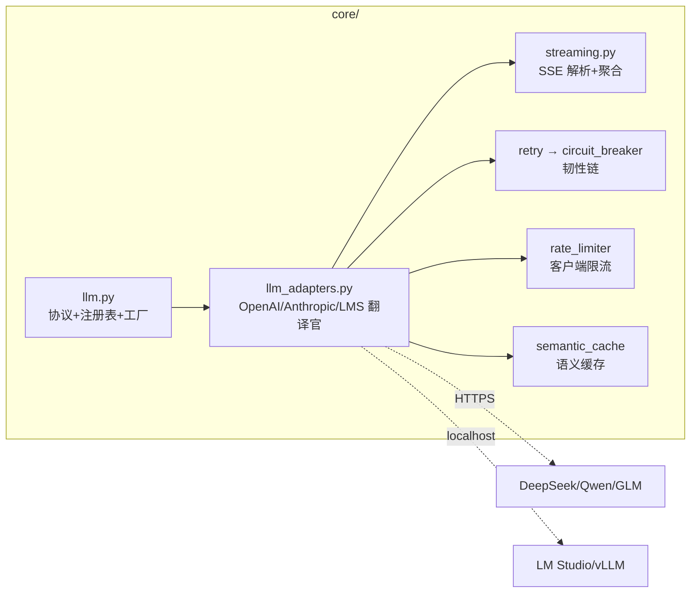

# M02 模型网关（Model Gateway）

| 项 | 值 |
|---|---|
| 生产进度 | Sprint 2 · 里程碑 MI-1a「能对话的最小 Agent」（与 M03 同周） |
| 代码落点 | `backend/agent_godot/core/`（8 个文件 + 1 个实验脚本，见 §0.5 清单） |
| 前置模块 | M01（token/采样/协议里全是它的影子） |
| 手写比例 | **100% 纯手写**（不用 openai SDK / langchain，httpx 直连——为的是看清协议本身） |
| 教程映射 | 📘 zero2Agent 03 课 · 📗 hello-agents core/llm.py · 📝笔记「OpenAI 兼容协议」 |

---

## 0. 本模块在项目中的位置

**大白话**：模型网关就是整个 Agent 的**电力系统**。后面的 AgentLoop（M03）、四模式（M13）、RAG（M10）……全是"电器"，它们不关心墙里的电来自三峡还是火电还是你家屋顶的光伏板——只管插上插座就有电。网关就是那个插座：**上面（上层代码）只说普通话（统一接口），下面（各家厂商）随便说方言**。

你已经摸过它的大门了：`lab/m01/raw_sse.py`（后来修正为 LM Studio 版）就是本模块的第一个实验——你亲身体会过"换一家厂商要改三处字符串"，本模块的任务就是把这件事一次性、永远地解决掉。

本模块完成后，`cli.py` 能实现第一条命令：`godot-agent ask "你好"` 流式打印回答（MI-1a 验收）。



---

## 0.5 ★ 施工文件清单（开工前必看的一页表）

**本模块你一共要新建 9 个文件**（按施工顺序排列——顺序即依赖顺序，先写的被后写的 import）：

| # | 新建文件（完整路径） | 职责一句话 | 关键类/函数 | 预估行数 | 手敲步骤(§4) | 依赖 |
|---|---|---|---|---|---|---|
| 1 | `lab/m02/raw_sse.py` | 裸看协议长什么样（你已完成 80%，归位+补 usage） | — | 40 | 步骤 0 | 无 |
| 2 | `core/errors.py` | 错误分类树：可重试/不可重试 | `LLMError` 家族 | 30 | 步骤 1 | 无 |
| 3 | `core/llm.py` | 标准订单 + 招工启事 + 通讯录 + 总机 | `Message/ToolCall/LLMRequest/Usage` 数据类、`LLM(Protocol)`、`PROVIDERS`、`register_provider`、`get_llm` | 150 | 步骤 2 | errors |
| 4 | `core/streaming.py` | 把分片到达的流拼成完整事件 | `StreamEvent`、`StreamAggregator` | 120 | 步骤 3 | 无 |
| 5 | `core/llm_adapters.py` | 各家厂商的前台翻译 | `OpenAIAdapter`、`AnthropicAdapter`、`LMStudioAdapter` | 180 | 步骤 4 | llm/streaming/errors |
| 6 | `core/retry.py` | 失败后错峰重敲 | `with_retry` | 60 | 步骤 5 | errors |
| 7 | `core/circuit_breaker.py` | 下游死了就跳闸 | `CircuitBreaker` | 90 | 步骤 6 | errors |
| 8 | `core/rate_limiter.py` | 自家水龙头限流 | `TokenBucket` | 50 | 步骤 7 | 无 |
| 9 | `core/semantic_cache.py` | 换个说法也认得的缓存 | `SemanticCache` | 80 | 步骤 8 | M01 嵌入知识 |

配套测试（随写随跑，不单列步骤）：`tests/test_errors.py`、`test_streaming.py`、`test_retry.py`、`test_circuit_breaker.py`、`test_rate_limiter.py`。

**依赖关系图**（谁先谁后，一目了然）：

```text
errors.py ──┬─> llm.py ──> llm_adapters.py ──> (被 M03 loop.py 消费)
            ├─> retry.py ─┐
            └─> circuit_breaker.py ─┴─> 在 llm_adapters 里包成"韧性管道"
streaming.py ──> llm_adapters.py
rate_limiter.py / semantic_cache.py ──> llm_adapters.py（最后挂上）
```

**完成后你拥有**：
- 一条命令验证网关活了：`uv run python -c "from agent_godot.core import get_llm; ..."` 真机流式打印
- models.yaml 里换一行配置 = 换模型，零代码改动
- 6 个 pytest 文件全绿

---

## 1. 知识点详解（每节五段：定义 → 大白话 → 举例 → 演进 → 易错点）

### 1.1 OpenAI 兼容协议（事实标准）

**① 严格定义**：OpenAI Chat Completions 是一套 REST 协议——`POST /v1/chat/completions`，请求体核心字段 `model / messages / tools / stream`；`messages` 是 system/user/assistant/tool 四种角色交替的列表，承载对话全部状态；`stream: true` 时响应是 `text/event-stream`，每行 `data: {chunk}`，delta 携带增量，以 `data: [DONE]` 结束。DeepSeek/Qwen/GLM/vLLM/LM Studio 全部提供兼容端点，故称"事实标准"。

**② 大白话**：它就是 AI 圈的 **USB-C 接口**。早年各家 SDK 各自为政（每家一个专用充电头），OpenAI 这个接口形状出来后全行业都照抄了——于是你一根线（一套 httpx 代码）通吃所有手机（所有厂商）。**换模型 = 换 URL，仅此而已**。你在 raw_sse.py 里亲手验证过：DeepSeek 换 LM Studio，只改了 base_url、key 占位、model 名三处字符串。

**③ 举例**：一次完整的流式往返（你跑过的 raw_sse.py 逐行对应）：

```python
# 请求：填一张"点菜单"
resp = httpx.post("http://127.0.0.1:1234/v1/chat/completions",
    headers={"Authorization": "Bearer lm-studio"},      # 本地不校验，占位即可
    json={"model": model_id, "stream": True,
          "stream_options": {"include_usage": True},    # ★ 要账单（见下文 usage）
          "messages": [{"role": "user", "content": "用一句话解释 token"}]},
    timeout=120)

# 响应：SSE 按行到达，每行是一个 data: 前缀的 JSON
# data: {"choices":[{"delta":{"content":"令"}}]}
# data: {"choices":[{"delta":{"content":"牌"}}]}
# data: {"choices":[{"delta":{},"finish_reason":"tool_calls"}]}   ← 工具调用信号
# data: {"choices":[],"usage":{"prompt_tokens":52,"completion_tokens":180,"total_tokens":232}}  ← ★末帧账单
# data: [DONE]
for line in resp.iter_lines():
    if not line.startswith("data: "):     # 忽略空行/注释行
        continue
    payload = line[6:]                    # 剥掉 "data: " 前缀
    if payload == "[DONE]":               # 流结束标记
        break
    chunk = json.loads(payload)
    if not chunk["choices"]:              # ★ usage 末帧 choices 为空，必须先判空！
        usage = chunk.get("usage")
        continue
    delta = chunk["choices"][0]["delta"]
```

**usage 是"电表读数"**（本项目的计量地基）：
- `prompt_tokens` 输入账单（你的全部上下文）、`completion_tokens` 输出账单（**思考型模型的思考 token 也计入**——你的 Qwen3.6 思考可能比正文还长）、`total_tokens` 总和
- 流式默认**不给账单**（每帧只是增量，账单要等生成完），所以必须加 `stream_options: {"include_usage": true}` 这个"结账开关"
- 五个消费点：M03 预算熔断 `record_usage()`、M02 成本计量（usage×单价）、M19 多租户配额（usage_records 表）、M00 协议的 `message_end` 事件、M17 轨迹元信息
- 进阶字段：`completion_tokens_details.reasoning_tokens`（思考/正文比）、`prompt_tokens_details.cached_tokens`（KV 缓存命中折扣——Agent 每轮全量重发历史，缓存命中时实际账单远低于表面 token 数）

**④ 演进**：2020 前各家 SDK 各自为战（每接一家写一套）→ OpenAI Chat API 凭产品力统一业界："换模型=换 base_url"（DeepSeek/Qwen/GLM/vLLM/LM Studio 全兼容）→ 工具生态也标准化（2023 Function Calling，M04/M05 展开）。**角色字段的最新演变**：2024.9 起 o1/新协议把 `system` 逐渐让位给 `developer`（改名动机：它一直是开发者写的；更深一层是信任分级——developer=可信指令，user=不可信数据，防提示注入）。**你的适配层必须双向容错**：老协议只认 system，新协议只认 developer，Anthropic 的 system 干脆不在 messages 里（顶层字段）——统一在 Adapter 翻译，别让上层感知。

**⑤ 易错点**：
- 流式默认**没有 usage**，要显式开 `include_usage`；且各家支持度不一，要做能力探测
- `tool_calls` 的增量是**分片到达**的（id/name 先来，arguments 字符串按块拼）——必须聚合成完整 JSON 才能解析（本模块 streaming.py 的活，M03 第一个坑在这预埋）
- assistant 的 tool_calls 与随后的 tool 消息必须 `tool_call_id` 配对，漏配直接 400
- usage 末帧的 `choices` 是空数组——不判空先取 `[0]` 就 IndexError

### 1.2 适配器三件套（数据类 · Adapter · 注册表）

**① 严格定义**：**端口-适配器模式**在模型接入层的应用——定义统一的 `LLM` 协议（端口），每个 Provider 一个 Adapter 把"统一接口"翻译成"方言"；数据类（Message/LLMRequest）定义统一报文；注册表（dict + 装饰器 + 工厂函数）实现"配置字符串 → 适配器实例"的路由。

**② 大白话**：一个三种角色的快递系统——
- **数据类 = 标准订单**：内部所有人只填这一张单（发给谁、说什么、温度多少）
- **Adapter = 前台翻译**：每家厂商雇一个前台，把标准订单誊成他们家的表格。OpenAI 家前台最省事（全行业都在学它，DeepSeek/LM Studio 共用一个前台）；Anthropic 前台要把信封拆开重装
- **注册表+工厂 = 总机+通讯录**：订单上写"找 lmstudio"，总机查通讯录转接对应前台。**新雇一家前台 = 通讯录自动多一行（装饰器干的），总机永远不用改**

**信封翻译的关键认知**：翻译的是**信封**（结构/字段名/角色排布），**信**（用户那句话）一字不动。同一个 `"怎么连接信号？"` 在所有厂商那里原样传递。

**③ 举例**：同一条 system 提示的两种信封：

```json
// OpenAI 方言：system 挤在 messages[0]
{"model": "qwen3.6", "messages": [
  {"role": "system", "content": "你是 Godot 专家"},
  {"role": "user",   "content": "怎么连接信号？"}]}        // ← 用户内容不变

// Anthropic 方言：system 提升为请求体顶层字段
{"model": "claude-x", "system": "你是 Godot 专家",
 "messages": [{"role": "user", "content": "怎么连接信号？"}]}  // ← 用户内容不变
```

**Protocol（招工启事）**：`class LLM(Protocol)` 只描述"形状"（有哪些方法什么签名），**不要求继承**。好处落到一个场景：以后测 AgentLoop 不想烧真模型，随手写个 `FakeLLM`——它不用 import 你任何代码，只要长得像（方法签名对上），mypy 就放行。这叫**结构化鸭子类型**：静态检查的鸭子类型——"走起来像鸭子就是鸭子，而且编译期就检查它像不像"。

**④ 演进（三台阶，每台阶解决上一台阶的痛点）**：

```text
台阶 1 继承式基类（hello-agents 的 LLMBase）
  做法：适配器必须 class OpenAILLM(LLMBase) 继承抽象基类
  痛点：血缘认亲——每个实现都被迫 import 你、挤进你的继承树；
        第三方/测试想给个假实现也得先装你的包

台阶 2 typing.Protocol（PEP 544 结构子类型）
  做法：class LLM(Protocol) 只定义形状，实现方无需继承无需 import
  解决：形状认亲——FakeLLM 零侵入即可上岗
  痛点：实现方不用继承了，但"models.yaml 里的字符串"怎么变成类？
        用 if-elif 工厂的话，每加一家都要回来改核心（违反开闭原则）

台阶 3 Protocol + 注册表（本项目采用）
  做法：PROVIDERS 字典 + @register_provider 装饰器写字 + get_llm 查表
  解决：新增 Provider = 新建一个文件 + 打一行装饰器，核心零改动
        ——这也是 M00 铁律"一切皆插件"的第一次落地，
          同款注册表模式 M04(工具)/M14(Hooks/Skills) 会反复出现
```

**⑤ 易错点**：
- 不要在 Adapter 里做重试/缓存——那是管道职责（§1.3~1.6），Adapter 只做"翻译"。翻译官兼职会引入新的耦合
- 抽象泄漏：某家特有参数（如 Anthropic 的 thinking）不要进协议，用 `extra: dict` 透传
- 工厂要用注册表而非 if-elif 链，否则每加一家 Provider 都改核心

### 1.3 重试与指数退避 + 抖动（Retry with Exponential Backoff + Jitter）

**① 严格定义**：请求失败后按 `delay = min(base × 2ⁿ, cap)` 的间隔重试（n 为已重试次数），并对 delay 施加随机抖动（full jitter：`delay = random(0, min(base×2ⁿ, cap))`）。只有**幂等请求**且**可重试错误**（429/500/502/503/504/超时）才重试；400 参数错/401 鉴权错重试一万次也不会好。

**② 大白话**：去朋友家**敲门没人应**—— sensible 的做法不是疯狂连敲（对方可能正在洗澡），而是等一会儿再敲，越敲不动等得越久（指数退避），而且每次等的时长随机一点（抖动）。为什么要随机？想象整栋楼的住户都在同一时刻敲门（网络故障恢复瞬间，成千上万客户端同时重试）——没有抖动就是"惊群共振"，直接把刚缓过来的服务再敲晕。

**③ 举例**：base=0.5s、cap=30s 的实际时间线（代数字）：

```text
第 1 次失败 → 等 random(0, 0.5s)   → 重试
第 2 次失败 → 等 random(0, 1.0s)   → 重试
第 3 次失败 → 等 random(0, 2.0s)   → 重试
第 4 次失败 → 等 random(0, 4.0s)   → 重试
第 5 次失败 → 等 random(0, 8.0s)   → 重试 → 仍失败 → 抛给上层（熔断器记账）
总耗时最多 ~15s，服务端获得逐步加长的喘息窗口
```

特例：429 时服务端常在 `Retry-After` 响应头里**明示等多久**——优先尊重它，别自作聪明算指数。

**④ 演进**：固定间隔重试（简单但惊群）→ 指数退避（AWS 2015 建议，给服务端喘息）→ 加 full-jitter（消除共振）。生产库 tenacity 把这套模式库化——我们手写 60 行获得全部理解。

**⑤ 易错点**：
- 重试必须包住"整个请求"（含流式连接建立），但**不能对已开始的流重放**——流断在中间属于部分失败，策略是整次重来
- 总重试时间要有 cap，否则用户等到天荒地老（配合 M03 预算熔断）
- 错误分类是重试的前提——所以 §4 里 errors.py 必须第一个写

### 1.4 熔断器（Circuit Breaker）

**① 严格定义**：三态状态机——**闭合**（正常放行并统计失败率）→ 失败率超阈值且样本数足够 → **打开**（直接拒绝请求，快速失败）→ 冷却期后 → **半开**（放行少量探测请求：成功回闭合，失败回打开）。核心价值：下游已死时上游立刻知道（把 30 秒超时变成 1 毫秒拒绝），并保护下游不被无意义流量继续打死。

**② 大白话**：家里的**电闸（空气开关）**。线路短路（下游服务挂了）时，你不会站在配电箱前每 30 秒手动合一次闸试试（那是"重试"的做法——电线烧得更旺）；电闸直接跳开（打开态）保护全屋；过一会儿你觉得可能修好了，小心地合一次闸（半开态放一个探测请求）——没再跳就是好了（回闭合），又跳就继续断着。

**③ 举例**：一个完整的熔断故事（参数：失败率阈值 50%、最小样本 20、打开 30 秒）：

```text
10:00:00  正常服务中（闭合态），滑动窗口统计失败率
10:00:30  DeepSeek API 抽风：连续 20 次请求 12 次失败（60% > 50%）
10:00:31  → 熔断打开！此后所有请求 1ms 内被拒（错误信息带"熔断中，预计 30s 后半开"）
10:00:31  同一时刻：models.yaml 里配置的 fallback 模型（LM Studio）自动接管降级
10:01:01  冷却期到 → 半开态，只放行 1 个探测请求（并发的第 2、3 个仍被拒！）
10:01:03  探测成功 → 回闭合、清空统计，流量恢复 DeepSeek
          （若探测失败 → 回打开，冷却期可翻倍再试）
```

**④ 演进**：超时+重试（治标——流量还在打向死下游）→ Netflix Hystrix 熔断（2012，微服务标配）→ 本项目加**每模型独立熔断 + 降级路由**（deepseek-chat 熔断时自动切 fallback，用户几乎无感）。

**⑤ 易错点**：
- 半开态只放行**一个**探测：并发到达的第二个请求必须仍被拒——不控制会形成"探测风暴"（§3 难点代码专门处理）
- 统计窗口要滑动且分桶（如 10 秒×6 桶），否则三分钟前的老失败永远赖在统计里
- 熔断的"失败"要与业务失败区分：模型输出不满意 ≠ 熔断计数 +1，只有传输/5xx 类才算
- 打开态的报错要携带"预计 X 秒后半开"，让上游能给人话提示

### 1.5 语义缓存（Semantic Cache）

**① 严格定义**：以 **embedding 相似度**为键的缓存——查询向量化后在已缓存问答库中做近邻检索，最高相似度 ≥ 阈值（本项目 0.92）且无工具副作用时直接返回缓存答案（标记 `cached=true`）。放在网关层，只缓存纯问答（ask 模式）。

**② 大白话**：你问同事"这题咋解"，他花了 10 分钟答了；第二天你**换个说法**再问同一个问题，他立刻认出"这不就是昨天那题"直接给你上次的答案——省 10 分钟。普通缓存像**指纹锁**（差一个字符都不认），语义缓存像**认人的老门卫**（意思相同就放行）。它能"认出意思相同"，靠的是 M01 学的 embedding：两句话的向量夹角小 = 一个意思。

**③ 举例**：代数字走一遍命中与不命中：

```text
缓存库里已有： ("怎么给敌人加碰撞伤害", 答案A, 向量v₁)

新查询："敌人如何增加伤害"
  → bge 嵌入 → 向量 v₂ → 与 v₁ 余弦 = 0.93 ≥ 0.92 → ★命中！返回答案A（0 成本）
  （普通精确缓存：字符串不等 → 未命中 → 白花一次推理）

不命中的三类（易错点展开）：
  "那第二个方法呢？"   → 带上下文指代，必须先过 M12 改写归一化，绝不能直接查
  "今天 Godot 最新版？" → 时间敏感，缓存 = 给过期答案
  "帮我改 player.gd"   → 有工具副作用，缓存命中 = 跳过真实执行，灾难
```

**④ 演进**：精确 KV 缓存（Redis，快但差一个字不认）→ prefix 缓存（vLLM prompt-cache：系统提示前缀复用，**服务端 KV Cache 级**优化，正好呼应 M01 讲的 KV Cache）→ 语义缓存（GPTCache 论文 2023）。三者互补不是替代：本项目三层都上。

**⑤ 易错点**：
- 时间敏感问题不能缓存；带指代的问句必须先改写；带工具副作用的请求绝不缓存——三条红线
- 阈值是精度/成本旋钮：0.90 误命中伤体验，0.95 命中率趋近零——上线后记录命中率持续调

### 1.6 令牌桶限流（客户端侧 Token Bucket）

**① 严格定义**：容量 `burst`、匀速 `rate`（token/秒）的桶；每请求按预估 token 数取走 n 个令牌，桶空则**本地排队等待**（而非打给服务端吃 429）。与熔断的分工：**限流保护自己不被服务端封，熔断保护自己不被下游拖死**。

**② 大白话**：一个**匀速滴水的的水桶 + 打水队规则**。桶容量 30 升（burst），水管每小时匀速注入（rate）。平时你随便舀（突发额度）；桶见底了，后来的人排队等水攒够再走。它管的是**你自己的出水量**——服务端（自来水公司）说你家最大 10 升/秒，超了就断你的水（429/封号），令牌桶让你永远不越线。

**③ 举例**：rate=10/s、burst=30，瞬时涌入 50 个请求：

```text
前 30 个：桶里有 30 个令牌 → 立即通过（突发吃满）
后 20 个：排队，每 0.1s 攒出 1 个令牌 → 2 秒内全部放行
效果：请求平滑化，服务端视角你永远是合规的 10/s，永远不会吃到 429
```

**④ 演进**：固定计数窗口（窗口边界突刺：两窗口交界处瞬时 2 倍流量）→ 滑动窗口（精确但费内存）→ **令牌桶**（允许突发 + 平滑补充，业界默认）。服务端分布式版在 M19 用 Redis+Lua 重写，本模块先写单机版吃透算法。

**⑤ 易错点**：
- 用 `time.monotonic()` 而非 `time.time()`——系统时钟回拨（NTP 校时）会让桶"凭空回血"
- 惰性计算（取用时才按时间差补充令牌）就不需要后台刷新协程——很多人写复杂了
- 按模型分桶（deepseek 一桶、本地 LMS 一桶），别全局一桶互相挤压

---

## 2. 接口设计（完整签名 = 你要手写的契约）

```python
# ===== core/llm.py =====
@dataclass
class Message:
    """一张对话便签：谁(role)说了什么(content)/发起了哪些工具调用。"""
    role: Literal["system", "user", "assistant", "tool"]
    content: str | None = None
    tool_calls: list["ToolCall"] | None = None     # assistant 发起调用时填
    tool_call_id: str | None = None                # tool 回应时的配对键

@dataclass
class ToolCall:
    """模型"建议"的一次函数调用（注意 arguments 是 JSON 字符串不是对象）。"""
    id: str; name: str; arguments: str

@dataclass
class LLMRequest:
    """标准订单：内部所有代码只填这张单。"""
    model: str; messages: list[Message]
    temperature: float = 0.3; top_p: float = 0.95
    max_tokens: int | None = None
    tools: list["ToolSpec"] | None = None
    stream: bool = True
    extra: dict | None = None                      # 厂商特有参数透传（防抽象泄漏）

@dataclass
class Usage:
    """电表读数：本模块之后所有计量（预算/计费/配额）的数据源。"""
    input_tokens: int; output_tokens: int; cost_usd: float

class LLM(Protocol):
    """招工启事：只认形状不认血缘——FakeLLM 不继承也能上岗。"""
    async def complete(self, req: LLMRequest) -> LLMResponse: ...
    def stream(self, req: LLMRequest) -> AsyncIterator[StreamEvent]: ...
    def count_tokens(self, messages: list[Message]) -> int: ...

PROVIDERS: dict[str, type[LLM]] = {}               # 通讯录：名字 → 类

def register_provider(name: str) -> Callable:      # 前台入职登记（装饰器）
    ...

def get_llm(model_ref: str, config: ModelConfig) -> LLM:
    """总机："lmstudio/qwen3.6-35b" 斜杠前查通讯录 → 实例化（带韧性管道）。"""
    ...

# ===== core/errors.py =====
class LLMError(Exception): ...                     # 全家族祖先：上层一个 except 兜住
class RetryableError(LLMError):
    retry_after: float | None                      # 429 的 Retry-After 存这里
class RateLimitError(RetryableError): ...          # 429 专属（熔断统计要区分）
class AuthError(LLMError): ...                     # 401/403：重试无意义
class BadRequestError(LLMError): ...               # 400：重试无意义

# ===== core/streaming.py =====
@dataclass
class StreamEvent:
    """统一流事件（方言已翻译完毕）：M03 只消费这个。"""
    type: Literal["text_delta", "tool_call_delta", "usage", "done", "error"]
    ...

class StreamAggregator:
    """拼图工人：把分片到达的 tool_call delta 聚成完整 ToolCall。"""
    def feed(self, chunk: dict) -> list[StreamEvent]: ...
```

---

## 3. 关键难点参考片段：熔断器半开态

```python
class CircuitBreaker:
    CLOSED, OPEN, HALF_OPEN = "closed", "open", "half_open"

    def __init__(self, failure_threshold=0.5, min_samples=20,
                 open_seconds=30, half_open_probes=1):
        self._state = self.CLOSED
        self._half_open_inflight = 0                # ★ 并发探测控制

    async def call(self, fn, *a, **kw):
        async with self._lock:
            if self._state == self.OPEN:
                if time.monotonic() - self._opened_at < self.open_seconds:
                    raise CircuitOpenError(self._retry_hint())
                self._state = self.HALF_OPEN         # 冷却期到 → 半开
                self._half_open_inflight = 0
            if self._state == self.HALF_OPEN:
                if self._half_open_inflight >= self.half_open_probes:
                    raise CircuitOpenError("探测中，稍后重试")  # ★ 只放一个
                self._half_open_inflight += 1
        try:
            result = await fn(*a, **kw)
        except RetryableError:
            async with self._lock:
                self._on_failure()                   # 半开失败→重新打开
            raise
        else:
            async with self._lock:
                self._on_success()                   # 半开成功→闭合+清统计
            return result
```

为什么难：三处 `async with self._lock` 的临界区选择——检查状态与计数必须原子，但**执行 fn 决不能持锁**（否则串行化整个网关）。

---

## 4. 手敲指引（函数级伪代码——看懂"作用"后自己写真代码）

### 步骤 0：归位实验脚本 `lab/m02/raw_sse.py`
把 `backend/test/M01/raw_sse.py` 挪到 `lab/m02/`，用你的 LM Studio 修正版（127.0.0.1:1234、`/v1/models` 查真实 model_id、`include_usage`、同时消费 `reasoning_content` 和 `content`）。
**验证**：终端流式打印 + 末尾打印账单三元组。

### 步骤 1：`core/errors.py`（约 30 行，最先写——所有文件都要抛它的异常）

| 类 | 作用（伪代码描述） |
|---|---|
| `LLMError` | `class LLMError(Exception)`——全家族祖先。存在意义：上层 `except LLMError` 一网打尽，不用挨个except子类 |
| `RetryableError` | 继承 LLMError，多一个属性 `retry_after`。抛出场景：429/5xx/超时。with_retry 看到它才睡——其他异常直接上抛 |
| `RateLimitError` | RetryableError 的子类。为什么要单独一个：熔断统计要区分"限流"和"服务器炸了"（前者不用计入熔断） |
| `AuthError` / `BadRequestError` | 直接继承 LLMError（**不可重试**）。401 换 key 才能好、400 改参数才能好——重试无意义 |

**验证**：pytest 断言 `classify(429) → RateLimitError`、`classify(400) → BadRequestError`（classify 是你写的"HTTP 状态码 → 异常类"小函数，Adapter 里会反复用）。

### 步骤 2：`core/llm.py` 前半（数据类，约 60 行）

| 类 | 作用 |
|---|---|
| `Message` | 对话便签。手写要点：`to_openai()`/`from_openai()` 两个转换方法留空给步骤 4 的翻译用 |
| `ToolCall` | 三字段。注意 arguments 类型是 `str`（协议就是 JSON 字符串） |
| `LLMRequest` | 订单。注意 `extra: dict` 字段——厂商特有参数的透传通道（防抽象泄漏） |
| `Usage` | 三字段。将来 M03 的 `budgets.record_usage()` 吃的就是它 |

**验证**：`mypy core/llm.py` 通过。

### 步骤 3：`core/streaming.py`（拼图工人，约 120 行）

| 函数/类 | 作用（伪代码） |
|---|---|
| `StreamEvent` | dataclass 五种 type。它是"方言已翻译"的统一事件——M03 唯一消费的东西 |
| `StreamAggregator.feed(chunk)` | 伪代码：`若 chunk.choices 为空 → 这是 usage 末帧，返回 [StreamEvent(type="usage")]`；`若 delta.content 非空 → 返回 [text_delta 事件]`；`若 delta.tool_calls 非空 → 按 index 找到正在拼的那块（id/name 到了就记下；arguments 是字符串 → 往缓冲拼接）→ 返回 [tool_call_delta]`；`若 finish_reason 到了且是 tool_calls → 把拼好的缓冲 json.loads 验证 → 吐出完整 ToolCall`。**内部状态就是一个 dict[int, {id,name,args_buf}]** |
| `parse_sse_line(line)` | `剥 "data: " 前缀 → "[DONE]" 返回哨兵 → 否则 json.loads`。raw_sse.py 里那三行，搬进来 |

**验证**：用"录制的 chunk 序列"（写死 8 个 dict，模拟分片：id 帧→args 帧帧帧→finish 帧）回放，断言聚出完整 `ToolCall(arguments='{"path": "res://enemy.gd"}')`。**这个测试就是 M02 最有价值的测试**——M03 能不能跑起来全看它。

### 步骤 4：`core/llm.py` 后半 + `core/llm_adapters.py`（本模块灵魂，约 330 行）

| 函数/类 | 作用（伪代码） |
|---|---|
| `register_provider(name)` | `返回装饰器 deco；deco(cls)：PROVIDERS[name] = cls；return cls`。十行不到，但它是"一切皆插件"的地基 |
| `get_llm(model_ref, config)` | 伪代码：`provider名, 模型名 = model_ref.split("/", 1) → PROVIDERS 查表 → 没有就报"未注册，已注册的有…" → 有就 cls(config) 返回实例`。整个工厂零 if-elif |
| `OpenAIAdapter.stream(req)` | 伪代码：`Message 列表 → [m.to_openai() for m] 组装请求体 → self.breaker.call(self.retry, self._post_sse) 韧性管道包裹 → 逐行 parse_sse_line → aggregator.feed → yield 翻译好的事件`。它一个类服务 DeepSeek/Qwen/GLM/LM Studio 全家 |
| `OpenAIAdapter._post_sse` | `httpx.stream POST → for line → yield chunk`。raw_sse.py 的搬家升级版 |
| `AnthropicAdapter._translate_messages` | M02 §1.2 ③ 的翻译现场：system 抽出 join、tool 消息改装成 tool_result 块、tool_calls 改名 tool_use。**信封重装，信不动** |
| `LMStudioAdapter` | `class LMStudioAdapter(OpenAIAdapter)`——OpenAI 兼容所以直接继承，只改默认 base_url。这就是"OpenAI 前台最省事"的代码体现 |

**验证**（网关活了的时刻）：
```bash
uv run python -c "
from agent_godot.core import get_llm
llm = get_llm('lmstudio/qwen3.6-35b', cfg)
async for ev in llm.stream(req): print(ev)"
```
真机流式打印 = 网关通了。

### 步骤 5：`core/retry.py`（约 60 行）

| 函数 | 作用（伪代码） |
|---|---|
| `with_retry(fn)` | `循环 retries+1 次：try 执行 fn；except RetryableError：最后一次就直接 raise；有 retry_after 就用它，否则 delay = random(0, min(base×2ⁿ, cap))；sleep 后继续`。除 RetryableError 外的异常**不捕获**——AuthError 该炸就炸 |
| `classify(status)` | `429→RateLimitError(带 Retry-After 解析)；5xx/超时→RetryableError；400→BadRequestError；401→AuthError`。（若步骤 1 已写，搬过来） |

**验证**：注入"前 3 次抛 429、第 4 次成功"的假 fn，断言总共调 4 次且间隔递增带随机。

### 步骤 6：`core/circuit_breaker.py`（约 90 行）

| 函数 | 作用（伪代码） |
|---|---|
| `call(fn)` | §3 难点代码就是完整参考——手敲时盯着"三个临界区、fn 不持锁"这两条 |
| `_on_failure/_on_success` | `失败：滑动窗口分桶里记一笔；失败率>阈值 且 样本>min → 打开+记时刻`。`成功：半开态回闭合清统计` |
| 滑动窗口 | `deque(maxlen=6) 个桶，每桶 10 秒`——实现可以简单到"每桶一个计数 list[bool]"，但要能回答"最近 60 秒失败率" |

**验证**：§5 的 `test_circuit_opens_after_failures` + `test_half_open_allows_single_probe`。

### 步骤 7：`core/rate_limiter.py`（约 50 行）

| 函数 | 作用（伪代码） |
|---|---|
| `TokenBucket.acquire(n)` | `now = monotonic → tokens += (now-last)×rate（不超过容量）→ last=now → 够 n 就扣掉返回 → 不够就 sleep((n-tokens)/rate) 后重试循环`。**惰性计算，没有后台协程** |

**验证**：100 个并发请求穿过 rate=10/s 的桶，总耗时 ≈ 7 秒（90 个排队）。

### 步骤 8：`core/semantic_cache.py`（约 80 行）

| 函数 | 作用（伪代码） |
|---|---|
| `get(messages)` | `规范化消息 → 嵌入 → 内存向量近邻（top1）→ score≥阈值 且 无工具副作用 → 返回缓存答案；否则 None` |
| `put(messages, answer)` | `嵌入 → 存 (向量, 答案, 时间桶)`。嵌入先用 M01 实验的假嵌入（随机向量），M10 接真 bge 后替换——接口不变 |

**验证**："怎么给敌人加伤害" 命中同义问句；"那第二个呢" 不命中（指代检测：问题里含指代词直接 skip）。

---

## 5. 测试与验收

```python
def test_classify_errors():
    assert isinstance(classify(429), RateLimitError)
    assert not isinstance(classify(400), RetryableError)

def test_stream_aggregator_merges_tool_call_fragments():
    aggr = StreamAggregator()
    events = [e for chunk in RECORDED_FRAGMENTS for e in aggr.feed(chunk)]
    assert events[-1].tool_calls[0].arguments == '{"path": "res://enemy.gd"}'

def test_usage_last_frame_choices_empty():
    # include_usage 末帧 choices=[]，aggregator 必须不炸且吐出 usage 事件
    ...

def test_circuit_opens_after_failures():
    cb = CircuitBreaker(failure_threshold=0.5, min_samples=4)
    for _ in range(4):
        with pytest.raises(RetryableError):
            asyncio.run(cb.call(always_fail))
    assert cb.state == "open"

async def test_retry_backoff_increases():
    # 前 2 次 429 第 3 次成功：记录 sleep 时间，断言递增且 < cap
    ...

def test_token_bucket_smooths_burst():
    # burst=5, rate=10：10 个请求总耗时 ≈ 0.5s
    ...
```

**验收 Demo（MI-1a 的网关半场）**：
```bash
uv run godot-agent ask "用三句话介绍 Godot"
# ① SSE 流式打印  ② Ctrl+C 断网重试日志可见  ③ 重复提问命中语义缓存（输出带 [cached] 标）
```

---

## 6. 踩坑记录（留白自填）

| 日期 | 坑 | 现象 | 根因 | 解法 | 关联知识点 |
|---|---|---|---|---|---|
|     |    |     |     |    |          |

---

## 7. 面试拷打（附详细参考答案）

**1. 流式响应里 tool_calls 为什么要"聚合"？分片到达的顺序有保证吗？**
答：协议把一个 tool_call 拆成多个 delta 帧发送——id 和 name 通常在首帧，arguments（JSON 字符串）按块分片后续到达。不聚合就 json.loads 一定失败（半个 JSON）。顺序保证：**同一 tool_call 内部按 index 有序**（每个分片带 index 字段标识属于第几个调用），但**多个 tool_call 之间**可能交错，所以聚合器内部要按 index 分桶各拼各的。这就是 StreamAggregator 的 `dict[index, buffer]` 设计。

**2. 哪些 HTTP 状态可重试？400 与 429 的处置差异是什么？**
答：可重试：429（限流，服务端忙）、500/502/503/504（服务端临时故障）、网络超时。不可重试：400（我的请求本身错，重发还是错——该改代码/参数）、401/403（鉴权，该换 key）。差异处置：429 要**优先读 Retry-After 头**（服务端明示等多久，比自算指数退避精确）且单独建 RateLimitError 类（熔断统计要区分"限流不算服务挂了"）；400 类直接抛 BadRequestError 让上层修请求，进重试循环纯属浪费。

**3. 画出指数退避 full-jitter 的时间线；没有 jitter 会发生什么？**
答：base=0.5 时：`sleep(random(0,0.5)) → 失败 → sleep(random(0,1)) → 失败 → sleep(random(0,2)) → …`，上限 cap。没有 jitter 的后果：服务端故障恢复的瞬间，所有在同一轮失败副本的客户端**在同一毫秒**同时重试（因为大家的退避时钟是同步算的）——流量尖峰把刚恢复的服务再次打挂，循环往复即"惊群共振/ thundering herd"。full jitter 把每次等待完全随机化，重试流量在时间轴上摊平。

**4. 熔断器三个状态怎么迁移？半开态并发探测怎么防？**
答：闭合→打开：滑动窗口内失败率超阈值**且**样本数≥最小样本（两个条件都要，防止开头 2 连败就熔断）。打开→半开：冷却计时到期。半开→闭合：探测请求成功（清统计）；半开→打开：探测失败（冷却期可翻倍）。防并发探测：`_half_open_inflight` 计数器——第一个进入半开的请求 +1，后续请求看到计数≥probe 上限直接拒绝。这段代码的难点是"状态检查+计数"要原子（锁内）而"执行请求"绝不能持锁（否则全网关串行化）。

**5. 熔断和限流分别保护谁？两者都要吗？**
答：**限流保护"自己不被服务端封"**（主动约束出水量，防 429/封号）；**熔断保护"自己不被下游拖死"**（下游挂了快速失败，把 30s 超时变 1ms 拒绝，同时不给下游雪上加霜）。都要，且正交：限流在熔断之前——正常时段限流器工作，熔断闭合；下游故障时熔断打开，限流器根本见不到请求。一句话：限流是"我守规矩"，熔断是"对方病了我就先撤"。

**6. 语义缓存的键怎么设计？哪三类问题绝对不能缓存？**
答：键 = 规范化后消息的 **embedding 向量**（非字符串），查询时做 top-1 近邻检索，score≥阈值（0.92）命中。三不缓存：①时间敏感（"今天最新版本"——缓存即过期答案）；②带上下文指代（"那第二个呢"——脱离上下文语义完全不同，必须先经 M12 改写归一化）；③有工具副作用（"帮我改文件"——缓存命中=跳过真实执行，用户以为改了其实没改）。设计上还要求：只缓存纯问答（ask 模式）、命中结果带 `cached=true` 标记（用户可知情）。

**7. 令牌桶 vs 滑动窗口各自特点？为什么选令牌桶？**
答：滑动窗口：精确控制任意时刻的通过数，但内存随窗口粒度增长，且**不允许任何突发**。令牌桶：桶里预存的 burst 令牌允许短时突发（符合"偶尔批量请求"的真实模式），同时长期速率被 rate 严格约束；实现还更简单（两个变量 + 惰性计算，无后台协程）。选令牌桶因为 LLM API 场景天然有突发（用户连发几条消息），又必须守住长期配额。

**8. `time.monotonic` 与 `time.time` 的区别在哪类 bug 里暴露？**
答：`time.time()` 读的是**墙钟**，会被 NTP 校时/手动改时间回拨；`monotonic()` 是单调递增的运行时长，永不回退。暴露场景：令牌桶用 time.time 时钟回拨 60 秒 → 桶按"过去了 60 秒"补充令牌 → 凭空回血、限流失效；重试/熔断的冷却计时同理（回拨导致熔断永远打不开或提前半开）。规则：**一切"时长测量"用 monotonic，只有"给人看的时间戳/落库时间"用 time.time**。

**9. 如果让你给网关加"多模型自动降级"，在哪个层做？**
答：在**熔断器与路由之间**：models.yaml 里每个模型声明 `fallback: <model_ref>` 链；熔断器打开事件（CircuitOpenError）被网关捕获 → 查 fallback 链取下一个模型 → 重新 get_llm 发起。要点：①降级目标自己也有熔断器（防级联打挂 fallback）；②降级要打日志/指标（用户该知道这次回答来自备用模型）；③预算按"实际服务的模型单价"记账。这正是 M00 架构图里"熔断降级"箭头的实现位置。

**10. 开放题：设计网关的成本统计：流式无 usage 时怎么记账？**
答：三层兜底：①优先争取真数据——请求加 `include_usage`（各支持度要做能力探测，探测结果缓存到 provider 元数据）；②拿不到就**估算**——输入侧用本地 tokenizer（M01 的 BPE 知识）数 prompt_tokens，输出侧在 StreamAggregator 里逐 delta 累计字符数按 ≈0.6 token/汉字、≈0.25 token/英文字符折算；③标记 `estimated=true` 落库，对账时可区分真账与估账。成本 = Σ(input×单价_in + output×单价_out)，单价表在 models.yaml，cached_tokens 按折扣价单算（Agent 会话每轮全量重发，缓存命中是成本大头）。

---

## 8. 教程映射与延伸

- 📘 zero2Agent 03 课（query-engine，本模块是其"接入半"，编排半在 M12）
- 📗 hello-agents `core/llm.py + llm_adapters.py`（对照：本项目多了韧性管道）
- 必读：AWS Exponential Backoff 文档；GPTCache 论文（语义缓存）
- 选读：Hystrix wiki（熔断模式原始表述）；OpenAI Function Calling 文档（streaming 分片说明）
