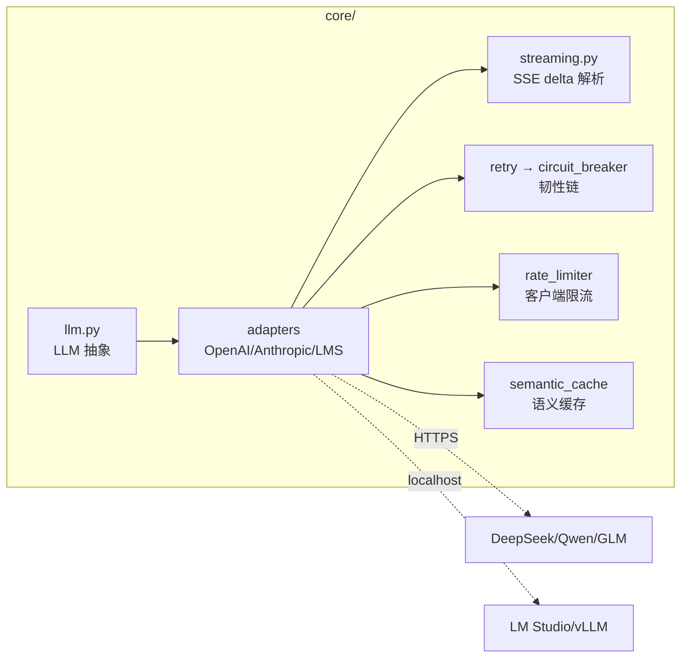

# M02 模型网关（Query Engine 的接入半层）

| 项 | 值 |
|---|---|
| 生产进度 | Sprint 2 · 里程碑 MI-1a「能对话的最小 Agent」 |
| 代码落点 | `backend/agent_godot/core/`（llm/adapters/streaming/retry/circuit_breaker/semantic_cache/rate_limiter/errors） |
| 前置模块 | M01（token/采样/协议里全是它的影子） |
| 手写比例 | **100% 纯手写**（不依赖 langchain 任何封装，httpx 直连） |
| 教程映射 | 📘 zero2Agent 03 课 · 📗 hello-agents core/llm.py · 📝笔记「OpenAI 兼容协议」 |

---

## 0. 本模块在项目中的位置

Agent 一切能力的"电力供应"。它向上暴露一个统一抽象：**给我 Message 列表与参数，我还你流式 token**——至于背后是 DeepSeek 云端 API、Anthropic、还是你本机 LM Studio 上的 Qwen，调用方完全无感。

本模块完成后，`cli.py` 就能实现第一条命令：`godot-agent ask "你好"` 流式打印回答（MI-1a 验收）。



---

## 1. 知识点详解

### 1.1 OpenAI 兼容协议（事实标准）

**① 原理**：`POST /v1/chat/completions`，请求体核心字段 `model/messages/tools/stream`。messages 是**角色交替的列表**：`system/user/assistant/tool` 四种角色构成对话的全部状态。流式时返回 `text/event-stream`，每行 `data: {...}`，delta 里携带增量；以 `data: [DONE]` 结束。

```jsonc
// 非流式响应（节选）
{"choices":[{"message":{"role":"assistant","content":"...","tool_calls":[...]}}],
 "usage":{"prompt_tokens":812,"completion_tokens":204,"total_tokens":1016}}

// 流式 chunk（节选）
data: {"choices":[{"delta":{"content":"让"}}]}
data: {"choices":[{"delta":{"content":"我先"}}]}
data: {"choices":[{"delta":{},"finish_reason":"tool_calls"}]}   // 工具调用信号
data: [DONE]
```

**② 演进**：2020 之前各家 SDK 各自为政 → OpenAI Chat API 凭事实统一业界：DeepSeek/Qwen/GLM/vLLM/LM Studio 全部提供兼容端点，"换模型=换 base_url" → 2023 MCP 出现前的工具生态碎片化，也正是 Function Calling 协议标准化解决的（见 M05）。**你手写适配器而非用 openai SDK，为的是看清协议本身**。

**③ 最小案例** `lab/m02/raw_sse.py`——不用任何 SDK，httpx 裸连：

```python
import httpx, json

resp = httpx.post("https://api.deepseek.com/v1/chat/completions",
    headers={"Authorization": "Bearer $DEEPSEEK_API_KEY"},
    json={"model": "deepseek-chat", "stream": True,
          "messages": [{"role": "user", "content": "用一句话解释 token"}]},
    timeout=60)
for line in resp.iter_lines():            # SSE 按行到达
    if not line.startswith("data: "):
        continue
    payload = line[6:]
    if payload == "[DONE]":
        break
    delta = json.loads(payload)["choices"][0]["delta"].get("content")
    if delta:
        print(delta, end="", flush=True)  # 亲手摸到"流"的原始形状
```

**④ 易错点**
- 流式默认**没有 usage**，需要请求里加 `stream_options: {"include_usage": true}`（各家支持度不一，要做能力探测）
- `tool_calls` 的增量是**分片到达**的（id/name 先来，arguments 字符串按块拼），必须聚合成完整 JSON 才能解析——M03 Dispatcher 踩的第一个坑在这里预埋
- assistant 消息里的 tool_calls 与随后的 tool 消息必须 `tool_call_id` 配对，漏配直接 400
- system 与 developer 角色的演变：新协议里 system 逐渐让位 developer（o1 起），适配层要容错

### 1.2 适配器模式（三家 Provider 抽象）

**① 原理**：定义 `LLM` 协议（端口），每个 Provider 一个 Adapter 把"统一接口"翻译成"方言"。Anthropic 的差异点实战体会：messages 结构（system 独立字段）、工具调用字段名（`tool_use`/`tool_result`）、流事件类型（`content_block_delta` 等 8 种事件）都要翻译。

**② 演进**：继承式基类（hello-agents 的 `LLMBase`）→ 协议式（`typing.Protocol`，结构化鸭子类型，无需继承）→ 本项目选 **Protocol + 注册表**：`@register_provider("openai")` 装饰器，models.yaml 里 `provider: openai` 字符串路由到类——新增 Provider 零改动核心。

**③ 最小案例**：接口骨架（完整签名见第 2 节，这里是"翻译"的味道）

```python
class AnthropicAdapter(BaseLLM):
    def _translate_messages(self, messages: list[Message]) -> dict:
        system = "\n".join(m.content for m in messages if m.role == "system")
        turns = []
        for m in messages:
            if m.role == "system":
                continue
            if m.role == "tool":
                turns.append({"role": "user", "block": {"type": "tool_result",
                    "tool_use_id": m.tool_call_id, "content": m.content}})
            ...
        return {"system": system, "messages": turns}   # 方言翻译现场
```

**④ 易错点**
- 不要在 Adapter 里做重试/缓存——那是管道职责（下两节），Adapter 只做"翻译"
- 抽象泄漏：某家特有的参数（如 Anthropic 的 thinking）不要进协议，用 `extra` 透传字典
- 工厂要用注册表而非 if-elif 链，否则每加一家 Provider 都改核心

### 1.3 重试与指数退避 + 抖动

**① 原理**：失败后不是立刻重试，而是等 `base * 2^n ± jitter`。**只有幂等请求才可重试**；**只有可重试错误才该重试**（429/500/502/503/504/超时 vs 400 参数错/401 鉴权错——重试一万次也不会好）。指数增长的等待给服务端喘息窗口；抖动（随机化）防止多个客户端"同步重试"形成的惊群共振。

**② 演进**：固定间隔（惊群）→ 指数退避（AWS 2015 建议）→ 加 full-jitter（`random(0, base*2^n)`，消除共振）。生产中间件如 tenacity 把这套模式库化——我们手写 60 行获得全部理解。

**③ 最小案例**

```python
async def with_retry(self, fn, *, retries=5, base=0.5, cap=30):
    for attempt in range(retries + 1):
        try:
            return await fn()
        except RetryableError as e:              # 只有分类为可重试的才重试
            if attempt == retries:
                raise
            if e.retry_after:                     # 服务端明示等待（429/Retry-After 头）
                delay = min(e.retry_after, cap)
            else:
                delay = min(base * 2 ** attempt, cap)
                delay = random.uniform(0, delay)  # full jitter
            logger.warning(f"retry {attempt+1}/{retries} in {delay:.1f}s: {e}")
            await asyncio.sleep(delay)
```

**④ 易错点**
- 429 要优先尊重 `Retry-After` 响应头，而不是自作聪明算指数
- 重试必须包住"整个请求"（含流式建立），但**不能对已开始的流重放**——流断在中间属于"部分失败"，策略是重试整次请求
- 超时预算：总重试时间的上限要 cap，否则用户等到天荒地老（配合 M03 的预算熔断）

### 1.4 熔断器（Circuit Breaker）

**① 原理**：三态机。**闭合**（正常放行，统计失败）→ 失败率超阈值且样本数够多 → **打开**（直接拒绝，快速失败不浪费重试）→ 冷却期后 → **半开**（放行少量探测请求：成功则回闭合，失败则回打开）。核心价值：**下游已死时，上游立刻知道**，把 30 秒超时变成 1 毫秒拒绝，并保护下游不被无意义流量继续打死（雪崩防线）。

**② 演进**：超时+重试（治标，流量还在打）→ Netflix Hystrix 熔断（2012，微服务标配）→ 本项目加**每模型独立熔断**：deepseek-chat 熔断时 models.yaml 里配置的 fallback 模型自动接管（降级路由）。

**③ 最小案例**：难点片段见第 3 节（半开态并发控制是全网教程最容易写错的地方）。

**④ 易错点**
- 半开态只放行**一个**探测请求：并发到达的第二个请求必须仍被拒绝——不控制会形成"探测风暴"
- 统计窗口要滑动且分桶（如 10 秒×6 桶），否则老失败永远赖在统计里
- 熔断的失败要与"业务失败"区分：模型输出不满意 ≠ 熔断计数 +1，只有传输/5xx 类才算
- 打开状态返回的错误要携带"熔断中、预计 X 秒后半开"信息，方便上游给用户友好提示

### 1.5 语义缓存

**① 原理**：普通缓存键=精确字符串；语义缓存键=**embedding 相似度**。"怎么给敌人加伤害"与"敌人如何增加伤害"相似度 0.93 > 阈值 0.92 → 直接返回缓存答案（标记 `cached=true`）。命中条件苛刻（高相似 + 无工具副作用 + 非流式敏感场景），因此放在**网关层只缓存纯问答（ask 模式）**。

**② 演进**：精确 KV 缓存（Redis）→ prefix 缓存（vLLM 的 prompt-cache，系统提示复用）→ 语义缓存（GPTCache 论文 2023）。三者互补不是替代：本项目三层都上——Redis 精确层、vLLM prefix 层（服务端）、语义层（本模块）。

**③ 最小案例**

```python
async def get(self, messages, threshold=0.92):
    q_emb = await self._embed(self._normalize(messages))
    hit = self._index.search(q_emb, top_k=1)        # 向量检索（Milvus/内存暴力扫）
    if hit and hit.score >= threshold and not self._has_tool_side_effect(messages):
        return hit.answer
    return None
```

**④ 易错点**
- 时间敏感问题不能缓存（"今天 Godot 最新版本是？"）——缓存键要带时间桶或该类问题不缓存
- 带上下文指代的问句不能直接缓存（"那第二个呢？"）——必须先过 M12 的改写归一化
- 阈值是精度/成本旋钮：0.90 误命中伤用户体验，0.95 命中率趋近于零——记录命中率指标持续调

### 1.6 令牌桶限流（客户端侧）

**① 原理**：桶容量 `burst`，速率 `rate`（token/秒）。每请求取走 n 个令牌（按预估 token 计），桶空则**本地排队等待**而非直接打给服务端吃 429。与熔断的区别一句话：**限流保护自己不被服务端封，熔断保护自己不被下游拖死**。

**② 演进**：计数器窗口（边界突刺）→ 滑动窗口（精确但费内存）→ 令牌桶（允许突发、平滑补充，业界默认）。服务端版在 M19 用 Redis+Lua 重写（分布式限流），本模块先写单机版吃透算法。

**③ 最小案例**

```python
class TokenBucket:
    def __init__(self, rate: float, burst: int):
        self.rate, self.capacity = rate, burst
        self.tokens = float(burst)
        self.last = time.monotonic()

    async def acquire(self, n: int = 1):
        while True:
            now = time.monotonic()
            self.tokens = min(self.capacity,
                              self.tokens + (now - self.last) * self.rate)
            self.last = now
            if self.tokens >= n:
                self.tokens -= n
                return
            await asyncio.sleep((n - self.tokens) / self.rate)   # 等补充
```

**④ 易错点**
- 用 `time.monotonic()` 而非 `time.time()`（系统时钟回拨会让桶"凭空回血"）
- 惰性计算（取用时才按时间差补充）就不需要后台刷新协程——很多人写复杂了
- 按模型维度分桶（deepseek 与本地 LMS 各一桶），别全局一桶互相挤压

---

## 2. 接口设计（完整签名，你要手写的契约）

```python
# core/llm.py
@dataclass
class Message:
    role: Literal["system", "user", "assistant", "tool"]
    content: str | None = None
    tool_calls: list["ToolCall"] | None = None     # assistant 发起
    tool_call_id: str | None = None                # tool 回应时的配对键

@dataclass
class ToolCall:
    id: str; name: str; arguments: str             # arguments 是 JSON 字符串

@dataclass
class LLMRequest:
    model: str; messages: list[Message]
    temperature: float = 0.3; top_p: float = 0.95
    max_tokens: int | None = None
    tools: list["ToolSpec"] | None = None
    stream: bool = True

@dataclass
class Usage:
    input_tokens: int; output_tokens: int; cost_usd: float

class LLM(Protocol):
    async def complete(self, req: LLMRequest) -> LLMResponse: ...
    def stream(self, req: LLMRequest) -> AsyncIterator[StreamEvent]: ...
    def count_tokens(self, messages: list[Message]) -> int: ...

def get_llm(model_ref: str, config: ModelConfig) -> LLM:
    """models.yaml 的 'provider/model' 引用 → 注册表取适配器实例（带韧性管道）。"""

# core/errors.py
class LLMError(Exception): ...
class RetryableError(LLMError):
    retry_after: float | None
class RateLimitError(RetryableError): ...
class AuthError(LLMError): ...          # 不可重试
class BadRequestError(LLMError): ...    # 不可重试

# core/streaming.py
@dataclass
class StreamEvent:
    type: Literal["text_delta", "tool_call_delta", "usage", "done", "error"]
    ...
class StreamAggregator:
    """把分片 tool_call delta 聚成完整 ToolCall——M03 的直接依赖。"""
    def feed(self, chunk: dict) -> list[StreamEvent]: ...
```

## 3. 关键难点参考片段：熔断器半开态

```python
class CircuitBreaker:
    CLOSED, OPEN, HALF_OPEN = "closed", "open", "half_open"

    def __init__(self, failure_threshold=0.5, min_samples=20,
                 open_seconds=30, half_open_probes=1):
        self._state = self.CLOSED
        self._half_open_inflight = 0                # ★ 并发探测控制

    async def call(self, fn, *a, **kw):
        async with self._lock:
            if self._state == self.OPEN:
                if time.monotonic() - self._opened_at < self.open_seconds:
                    raise CircuitOpenError(self._retry_hint())
                self._state = self.HALF_OPEN         # 冷却期到 → 半开
                self._half_open_inflight = 0
            if self._state == self.HALF_OPEN:
                if self._half_open_inflight >= self.half_open_probes:
                    raise CircuitOpenError("探测中，稍后重试")  # ★ 只放一个
                self._half_open_inflight += 1
        try:
            result = await fn(*a, **kw)
        except RetryableError:
            async with self._lock:
                self._on_failure()                   # 半开失败→重新打开(冷却翻倍可加)
            raise
        else:
            async with self._lock:
                self._on_success()                   # 半开成功→闭合+清统计
            return result
```

为什么难：三处 `async with self._lock` 的临界区选择——检查状态与计数必须原子，但**执行 fn 决不能持锁**（否则串行化整个网关）。

## 4. 手敲指引

| 步骤 | 文件 | 做什么 | 验证 |
|---|---|---|---|
| 1 | errors.py | 错误分类树 | 单测：429→Retryable，400→不可重试 |
| 2 | llm.py | 数据类 + Protocol | mypy 通过 |
| 3 | lab/m02/raw_sse.py | 裸连流式 | 终端逐字打印 |
| 4 | streaming.py | delta 聚合器 | 用录制的 chunk 序列回放，聚出完整 tool_call |
| 5 | llm_adapters.py | OpenAI 兼容适配器 | 接 DeepSeek 真 API 通过 |
| 6 | retry.py | 退避+jitter | 注入故障断言 5 次间隔递增且带随机 |
| 7 | circuit_breaker.py | 三态机 | 单测见第 5 节 |
| 8 | rate_limiter.py | 令牌桶 | 100 并发请求耗时 ≈ 预期节流时长 |
| 9 | semantic_cache.py | 语义缓存 | 同义问句命中、追问不命中 |
| 10 | llm_adapters.py 补 Anthropic | 方言翻译 | 同一用例双 Provider 输出等价 |

## 5. 测试与验收

```python
def test_circuit_opens_after_failures():
    cb = CircuitBreaker(failure_threshold=0.5, min_samples=4)
    for _ in range(4):
        with pytest.raises(RetryableError):
            asyncio.run(cb.call(always_fail))
    assert cb.state == "open"

def test_half_open_allows_single_probe():
    # 打开后冷却 → 并发 3 个请求：恰好 1 个到达 fn，2 个被拒
    ...

def test_stream_aggregator_merges_tool_call_fragments():
    aggr = StreamAggregator()
    events = [e for chunk in RECORDED_FRAGMENTS for e in aggr.feed(chunk)]
    assert events[-1].tool_calls[0].arguments == '{"path": "res://enemy.gd"}'
```

**验收 Demo**：`godot-agent ask "用三句话介绍 Godot"` ——SSE 流式打印，断网重试日志可见，重复提问命中语义缓存（输出带 `[cached]` 标）。

## 6. 踩坑记录（留白）

| 日期 | 坑 | 现象 | 根因 | 解法 | 关联知识点 |
|---|---|---|---|---|---|
|     |    |     |     |    |          |

## 7. 面试拷打

1. 流式响应里 tool_calls 为什么要"聚合"？分片到达的顺序有保证吗？
2. 哪些 HTTP 状态可重试？400 与 429 的处置差异是什么？
3. 画出指数退避 full-jitter 的时间线；没有 jitter 会发生什么？
4. 熔断器三个状态怎么迁移？半开态并发探测怎么防？
5. 熔断和限流分别保护谁？两者都要吗？
6. 语义缓存的键怎么设计？哪三类问题绝对不能缓存？
7. 令牌桶 vs 滑动窗口各自特点？为什么选令牌桶？
8. `time.monotonic` 与 `time.time` 的区别在哪类 bug 里暴露？
9. 如果让你给网关加"多模型自动降级"，在哪个层做？（提示：熔断打开事件 → fallback 路由）
10. 开放题：设计网关的成本统计：流式无 usage 时怎么记账？（估算器/tokenizer 计数）

## 8. 教程映射与延伸

- 📘 zero2Agent 03 课（query-engine，本模块是其"接入半"，编排半在 M12）
- 📗 hello-agents `core/llm.py + llm_adapters.py`（对照：本项目多了韧性管道）
- 必读：AWS Exponential Backoff 文档；GPTCache 论文（语义缓存）
- 选读：Hystrix wiki（熔断模式原始表述）
