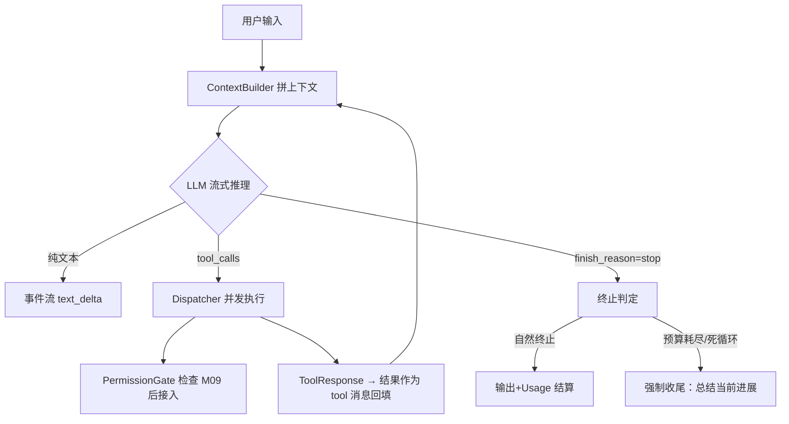

# M03 Agent Loop（ReAct 执行引擎）

| 项 | 值 |
|---|---|
| 生产进度 | Sprint 2 · 里程碑 MI-1a「能对话的最小 Agent」（与 M02 同周完成） |
| 代码落点 | `backend/agent_godot/agent/`（4 个文件 + 1 个实验，见 §0.5） |
| 前置模块 | M02（StreamAggregator 聚出完整 ToolCall 后 Loop 才能工作） |
| 手写比例 | **100% 纯手写**（不用 LangGraph/任何编排框架——本项目宣言） |
| 教程映射 | 📗 hello-agents agents/react_agent.py · 📘 zero2Agent（ReAct 篇）· 📝笔记 ReAct |

---

## 0. 本模块在项目中的位置

**大白话**：整个项目的**心脏起搏器**。M02 让模型能"说话"，本模块让它能"做事"——不是一次性回答，而是"想一步 → 做一步（调工具） → 看一眼结果 → 再想下一步"地循环，直到任务完成。后续所有模块（四模式 M13、Subagent M15、Hooks M14）都是**围绕这个循环加插件**，循环本体在此定型。

**为什么本模块只有 ReAct？——生产进度制的必然，不是范式缺失**。Cursor/CodeBuddy 的 ask/craft/plan/multi 四模式也不是一天建成的：先有对话（ask），再有执行（craft），再有规划（plan）与多代理（multi）。本项目按同样的产品演进顺序分期交付——Sprint 2 的产品只有 ask 模式，ReAct 循环就是它的全部执行内核。**四大范式在本项目的完整落点**：

| 经典范式 | 产品模式（Cursor/CodeBuddy 形态） | 落点模块 | Sprint |
|---|---|---|---|
| **ReAct** | `ask`（也是其余三模式共用的执行底座） | **M03（本模块）** → M12 联通检索 → M13 正式化 | S2/S8/S9 |
| **Reflection**（客观验证器回路） | `craft`（改 → headless 验 → 不过则修） | M06 领域层落地 → M13 §1.2 正式化 | S4/S9 |
| **Plan-and-Solve**（DAG + re-plan） | `plan`（先出计划人批再执行） | M13 §1.1 | S9 |
| **Multi-Agent**（Orchestrator-Worker） | `multi`（拆子任务并行派发） | M13 骨架 → M15 完全体 + A2A | S9/S10 |

一句话记住分工：**M03 造发动机（循环），M06/M09/M12 加油路与刹车（验证/权限/检索），M13 换挡（四模式策略配置），M15 加气缸（并行子代理）**——四大范式一个不少，只是按真实产品的节奏分期长出来。

**交付后状态**：`godot-agent ask "lab 下有什么文件？"`——模型自主决定调用 `list_files` 工具 → 拿到结果 → 组织回答 → 终止。完整 ReAct 三步在终端可见。



---

## 0.5 ★ 施工文件清单（开工前必看的一页表）

**本模块你一共要新建 5 个文件**（按依赖顺序——先写被依赖的）：

| # | 新建文件（完整路径） | 职责一句话 | 关键类/函数 | 预估行数 | 手敲步骤(§4) | 依赖 |
|---|---|---|---|---|---|---|
| 1 | `agent/__init__.py` | 空包标记 | — | 1 | 步骤 0 | — |
| 2 | `agent/events.py` | 统一事件出口（CLI/Web 双消费） | `AgentEvent`、`EventBus` | 40 | 步骤 1 | 无 |
| 3 | `agent/budgets.py` | 四维预算 + 死循环检测 | `BudgetTracker`、`LoopDetector` | 80 | 步骤 2 | M02 errors |
| 4 | `agent/dispatcher.py` | 工具调用并发调度（读写分流） | `Dispatcher` | 70 | 步骤 3 | M04 registry |
| 5 | `agent/loop.py` | ReAct 主循环本体（12 行核心） | `AgentLoop`、`LoopConfig`、`LoopResult` | 120 | 步骤 4 | 上面全部 |
| — | `lab/m03/react_trace.py` | 硬编码剧本看循环骨架（不用真模型） | `react_loop` | 30 | 步骤 2 前置 | 无 |
| — | `tests/test_agent/` | 3 个核心单测 | — | 60 | 随写随跑 | — |

**依赖关系**：`events.py（谁都不依赖）→ budgets.py → dispatcher.py（要 M04 的 ToolRegistry，所以 M03/M04 交替施工：先 loop 骨架后接 registry）→ loop.py（组装一切）`。

**完成后你拥有**：
- `godot-agent ask "帮我看看 lab/m01 下有哪些实验并讲讲 attention.py 在干嘛"` 全程无人工干预跑通（模型自主 list_files → read_file → 中文总结）
- 3 个单测绿：max_steps 熔断 / 死循环干预 / 工具错误变 Observation

---

## 1. 知识点详解（每节五段：定义 → 大白话 → 举例 → 演进 → 易错点）

### 1.1 ReAct：推理与行动交织

**① 严格定义**：ReAct（Reason + Act，Yao et al. 2022）是"推理→行动→观察"循环的智能体范式：每轮模型产出 Thought（推理，隐含在 content）与 Action（工具调用）之一，工具结果作为 Observation 回填上下文，循环直到模型认为任务完成输出 Final Answer。

**② 大白话**：**边做边看的装修师傅**。不动手的师傅（纯 CoT）：听你描述就一口气给出完整方案——错了也没机会发现。ReAct 师傅：先看一眼墙（list_files）→"哦这面是承重墙"（Observation）→ 改方案再敲（read_file）→ 确认管线图 → 才开砸。上下文里积累的 Observation 序列就是他的"工作记忆"——**模型不必一次答对，可以边做边纠错**。

**③ 举例**：`lab/m03/react_trace.py` 用硬编码剧本看清循环骨架（不用真模型——先看清机器，再通电）：

```python
SCRIPT = [                                   # 模拟模型的三轮决策
    {"tool_calls": [{"name": "list_files", "args": {"path": "lab"}}]},
    {"tool_calls": [{"name": "read_file", "args": {"path": "lab/m01/mini_bpe.py"}}]},
    {"content": "lab 下 4 个实验脚本，核心是 mini_bpe.py 的 BPE 训练循环。"},
]
def fake_llm(messages):                      # 按"已发生的轮数"取剧本
    return SCRIPT[len([m for m in messages if m.role == "tool"])]

async def react_loop(user_input: str, max_steps: int = 10):
    messages = [{"role": "user", "content": user_input}]
    for step in range(max_steps):            # ★ 循环本体 12 行
        resp = fake_llm(messages)
        if not resp.get("tool_calls"):
            return resp["content"]           # 自然终止（Final Answer）
        messages.append({"role": "assistant", "tool_calls": resp["tool_calls"]})
        for tc in resp["tool_calls"]:
            result = TOOLS[tc["name"]](**tc["args"])
            messages.append({"role": "tool", "tool_call_id": tc["id"],
                             "content": str(result)})   # ★ Observation 回填
    return "(预算耗尽) " + fake_llm(messages)
```

跑它，在 `messages.append` 处打印：你会**亲眼看到上下文如何一轮轮长胖**——这就是 M07 上下文工程要治理的对象。

**现代实现的关键升级**：原始论文靠提示词让模型输出 `Thought:/Action:` 文本再**正则解析**（脆弱）；现代靠 **Function Calling 原生协议**——`tool_calls` 是结构化 JSON，`finish_reason="tool_calls"` 明示意图，解析从正则降级为 `json.loads`。**但循环骨架与论文完全一致**。

**④ 演进**：直接 prompting（一次性回答，错就是错）→ CoT（2022，"let's think step by step"，推理内化在生成里但不能与外界交互——教模型"想清楚"）→ ToT（2023，把推理组织为"分支×评估×回溯"的搜索树——旁支而非主线，M13 选读）→ **ReAct**（2022.10，与工具交互，错误可被 Observation 纠正——教模型"边想边做边看结果"）→ Function Calling 原生化（2023.6 OpenAI）→ Agent Loop 工程（Cursor/CodeBuddy：预算、权限、上下文管理都是挂在循环钩子上的）→ 本项目。

**⑤ 易错点**：
- assistant 的 tool_calls 消息与 tool 结果消息**必须成对**出现；只留一半，下一轮请求直接 400
- 循环每轮都是"全量历史"发给模型——不截断的话第 20 轮请求里装着前 19 轮全部 Observation（token 成本爆炸，M07 解决）
- `max_steps` 不是装饰：模型陷入"读文件→列表目→读文件"死循环时，没有它进程跑到天荒地老
- 某些模型爱在 content 里"假装"调工具（输出伪 JSON）——Dispatcher 入口要校验工具名真实性

### 1.2 循环工程：终止、预算、死循环治理

**① 严格定义**：论文不告诉你、生产必须做的三件事——**终止条件矩阵**（五种终止各配动作）、**死循环检测**（滑动窗口内相同调用指纹重复 ≥N 次）、**预算熔断**（steps/tokens/usd/wall_time 四维任一触顶即"优雅收尾"而非抛异常）。

**② 大白话**：给发动机装**仪表盘和断油系统**。玩具 demo 是"油箱漏了也踩到底"（while True）；生产 Agent 必须知道：油还剩多少（预算）、是不是在原地绕圈（死循环）、什么时候该熄火总结（优雅收尾）。优雅收尾的精神：**熔断不是急刹车甩飞乘客，而是靠边停车、告知已走了多远**——用户体验从"报错崩溃"变成"有始有终"。

**③ 举例**：终止条件矩阵（全部要实现）+ 死循环指纹：

| 条件 | 类型 | 动作 |
|---|---|---|
| `finish_reason=stop` 且无 tool_calls | 自然终止 | 正常返回 |
| `max_steps` 步数耗尽 | 预算终止 | 注入"请总结进展并收尾"做最后一轮 |
| token 预算耗尽（input+output 累计，吃 M02 的 Usage） | 预算终止 | 同上 + 标记 `truncated` |
| 墙钟超时 | 预算终止 | 取消进行中的工具，收尾 |
| 死循环：连续 N 次相同 tool_call 指纹 | 异常终止 | 注入"你在重复调用 X，换个思路"；仍重复则硬停 |

死循环指纹 = `(tool_name, json.dumps(args, sort_keys=True))` 的哈希，滑动窗口 3 内重复 ≥3 判定——比"步数上限"精细，能在浪费 10 步之前拦住：

```python
class LoopDetector:
    def __init__(self, window: int = 3, max_repeat: int = 3):
        self.window, self.max_repeat = window, max_repeat
        self.history: deque[str] = deque(maxlen=window)

    def check(self, calls: list[ToolCall]) -> bool:
        """返回 True 表示检测到死循环。"""
        fp = hash(tuple(sorted((c.name, c.arguments) for c in calls)))
        self.history.append(fp)
        return self.history.count(fp) >= self.max_repeat
```

**④ 演进**：玩具 demo 不管终止（while True）→ 框架给 max_iterations（LangChain，粗粒度一刀切）→ 生产 Agent（DSH/Cursor 级）的多维预算 + 指纹检测 + 优雅收尾。面试里"你的 Agent 怎么防失控"就考这节。

**⑤ 易错点**：
- 预算检查点在**每轮开始**而非工具执行后——工具本身可能跑 5 分钟，检查晚了等于没检查
- 死循环窗口太敏感会误伤（合理的三次同参重试）；先注入"劝导提示"再硬停
- Usage 结算要在"强制收尾轮"之后继续累计——很多人收尾轮忘了记账

### 1.3 Dispatcher：工具调用的并发调度

**① 严格定义**：模型一轮可返回多个 tool_calls（parallel tool calls），调度策略：**读类（无副作用）asyncio.gather 并发，写类（副作用）按序执行**；每工具独立超时（读 10s/写 30s/headless 120s 分级）；失败不炸循环——错误翻译成 `ToolResponse(ok=False)` 作为 Observation 回填。

**② 大白话**：工地**调度员**。模型一口气喊"搬砖、递瓦、砌墙"——调度员一看：搬砖和递瓦互不干扰（读类，并发去干），砌墙要等材料齐（写类，排队）；哪个工种出事了（工具失败），不是停工整顿（抛异常），而是把"3 号搅拌机坏了，原因水泥受潮"报告给工头（模型），让它决定重试还是换方案。

**③ 举例**：读写分流核心（M04 的 registry 提供 `readonly` 元数据）：

```python
async def dispatch(self, calls: list[ToolCall]) -> list[ToolResponse]:
    read_ops  = [c for c in calls if self.registry.spec(c.name).readonly]
    write_ops = [c for c in calls if not self.registry.spec(c.name).readonly]
    results = []
    if read_ops:                                    # 读类并发
        results += await asyncio.gather(*(
            self._run_one(c) for c in read_ops), return_exceptions=True)
    for c in write_ops:                             # 写类按序
        results.append(await self._run_one(c))
    return [self._to_response(r) for r in results]  # 异常也翻译成 ToolResponse
```

**错误回传是精髓**：`ToolResponse(ok=False, error="路径不存在: res://enemy.gd")` 让模型**读到错误自己纠正**——Agent"自我修复"能力的最小形态，比抛异常中断循环优雅一个量级。

**④ 演进**：串行逐个调（浪费）→ asyncio.gather 全并发（写类工具竞态：两个写同文件互相覆盖）→ 读写分流策略（本项目）。M14 的 pre-tool hook 会挂进 Dispatcher 调用管线（权限门就是第一个 hook）。

**⑤ 易错点**：
- `gather(return_exceptions=True)` 不加的话一个失败全部取消——但要记得把异常翻译成 `ok=False` 响应
- 并发结果顺序必须与调用顺序对应（zip 而非完成顺序），否则 Observation 配对错乱
- 工具超时取消后要清理半成品（临时文件/锁）——M06 的 Godot headless 尤其明显

### 1.4 事件流：SSE 与 CLI 双消费者的统一出口

**① 严格定义**：Loop 内部不发 print、不写日志，只**发结构化事件**（`text_delta / tool_call_start / tool_call_result / budget_update / message_end`）；CLI 消费者打成终端彩色输出，Web 消费者（M19/M20）序列化成 SSE 帧——一个事件协议，两个前端。

**② 大白话**：**电台广播制**。循环不关心谁在听（终端？浏览器？还是 M17 的轨迹录制器？），只管把每一步播出去。这对应 M00"核心包纯库"铁律——正因如此 CLI（MI-1）、Web（MI-7）、离线评估（M22）三个消费者复用同一套 Runtime。

**③ 举例**：

```python
@dataclass
class AgentEvent:
    type: str; payload: dict; ts: float = field(default_factory=time.time)

class EventBus:
    def __init__(self): self._q = asyncio.Queue(maxsize=1000)   # 背压：防内存爆
    async def emit(self, type_: str, **payload): await self._q.put(AgentEvent(type_, payload))
    def stream(self) -> AsyncIterator[AgentEvent]:
        async def gen():
            while (e := await self._q.get()) is not STOP:
                yield e
        return gen()
```

**④ 演进**：直接 print（不可复用）→ 回调注册（洋葱依赖）→ async iterator/Queue 事件流（结构化、可回放、可测试）。回放能力的额外礼物：**录制真实会话事件流 = M17 轨迹数据**（GRPO 的原材料）。

**⑤ 易错点**：
- 事件要带 `ts` 与 `session_id`，多会话并发时防串流
- 队列要有上限（背压），恶意长输出不能吃爆内存
- 顺序保证：`tool_call_result` 必须晚于对应 `tool_call_start`——并发回填按 call_id 配对排序

---

## 2. 接口设计（完整签名 = 你要手写的契约）

```python
# agent/loop.py
@dataclass
class LoopConfig:
    """循环的仪表盘预设。"""
    max_steps: int = 25
    token_budget: int = 200_000
    usd_budget: float = 0.5
    wall_time_budget: float = 600.0
    loop_detector: LoopDetector = field(default_factory=LoopDetector)

class AgentLoop:
    """ReAct 主循环：从用户输入到最终回答的完整发动机。"""
    def __init__(self, llm: LLM, dispatcher: Dispatcher,
                 context_builder: ContextBuilder,   # M07 前先用简单拼接
                 budgets: BudgetTracker, bus: EventBus): ...
    async def run(self, session: Session, user_input: str | None,
                  *, mode: str = "ask") -> LoopResult: ...

@dataclass
class LoopResult:
    final_text: str
    steps: int
    usage_total: Usage
    stop_reason: Literal["natural", "max_steps", "token_budget",
                         "usd_budget", "timeout", "loop_detected", "error"]

# agent/dispatcher.py
class Dispatcher:
    def __init__(self, registry: ToolRegistry, config: DispatchConfig): ...
    async def execute(self, calls: list[ToolCall]) -> list[ToolResponse]: ...

# agent/budgets.py
class BudgetTracker:
    def check(self) -> BudgetStatus: ...            # 每轮开始调用（返回是否耗尽）
    def record_usage(self, usage: Usage) -> None: ...   # 吃 M02 的电表读数
    def record_step(self) -> None: ...

# agent/events.py —— AgentEvent/EventBus（见 1.4）
```

---

## 3. 关键难点参考片段：循环本体

```python
async def run(self, session, user_input, *, mode="ask"):
    self.budgets.reset()
    while True:
        status = self.budgets.check()                          # ① 预算检查前置
        if status.exhausted:
            return await self._graceful_wrap_up(session, status)
        messages = await self.context_builder.build(session)   # ② 每轮重建上下文
        final = None
        async for ev in self.llm.stream(LLMRequest(model=..., messages=messages,
                                                   tools=self.registry.tool_specs())):
            await self.bus.emit(ev.type, **ev.payload)         # ③ 事件直通
            self.aggregator.feed(ev)
        self.budgets.record_usage(self.aggregator.usage)
        calls = self.aggregator.tool_calls
        if not calls:                                          # ④ 自然终止
            return LoopResult(self.aggregator.text, self.budgets.steps,
                              self.budgets.usage, "natural")
        if self.detector.check(calls):                         # ⑤ 死循环劝导
            await self._inject_loop_warning(session)
            continue
        session.append(AssistantMsg(tool_calls=calls))
        results = await self.dispatcher.execute(calls)         # ⑥ 观察
        for r in results:
            session.append(ToolMsg(call_id=r.call_id, content=r.render()))
```

为什么难：六个步骤的**顺序**就是全部设计——预算前置于推理、终止判定先于死循环、结果按序回填。任何一步挪位置都会引入"超支一轮/丢一次观察"的 bug。

---

## 4. 手敲指引（函数级伪代码）

### 步骤 0：`lab/m03/react_trace.py`（30 分钟，先看清机器再通电）
剧本 + 12 行循环（§1.1 ③ 代码原样）。**验证**：终端打印 3 轮 Observation，最后输出总结句。

### 步骤 1：`agent/events.py`
| 类 | 作用（伪代码） |
|---|---|
| `AgentEvent` | dataclass：type/payload/ts 三字段 |
| `EventBus.__init__` | `asyncio.Queue(maxsize=1000)`（背压上限） |
| `EventBus.emit` | `打包 AgentEvent → put 进队列` |
| `EventBus.stream` | `返回 async generator：循环 get，遇到 STOP 哨兵停止` |
**验证**：单测——先订阅 stream 再 emit，断言能收到且 ts 递增。

### 步骤 2：`agent/budgets.py`
| 类 | 作用（伪代码） |
|---|---|
| `BudgetTracker.check` | `四个维度（steps/tokens/usd/wall_time）逐一比对上限 → 任一超即 exhausted=True，并标明哪个维度`。用 monotonic 计时（M02 同款教训） |
| `BudgetTracker.record_usage` | `usage.input+output 累加进 token 维度；cost_usd 累加进 usd 维度` |
| `BudgetTracker.record_step` | `steps += 1` |
| `LoopDetector.check` | §1.2 ③ 代码原样：指纹入滑窗，窗口内计数 ≥max_repeat 返回 True |
**验证**：注入 max_steps=3 + 永远调工具的 fake_llm，断言 stop_reason="max_steps" 且 steps==3。

### 步骤 3：`agent/dispatcher.py`（此时 M04 的 registry 骨架应已能 import——M03/M04 交替施工）
| 函数 | 作用（伪代码） |
|---|---|
| `execute(calls)` | `按 registry.spec(name).readonly 分两堆 → 读堆 gather 并发（return_exceptions=True）→ 写堆 for 循环按序 → 每个结果经 _to_response 统一包装（异常→ok=False 带 hint）` |
| `_run_one(call)` | `json.loads(arguments) → registry.get(name).run(**args) 外面套 asyncio.wait_for(timeout 分级)` |
**验证**：2 读 1 写——断言读两个并发完成（耗时≈单个）、写在最后；单工具抛异常 → 循环不炸、下轮 messages 出现 ok=False 的 tool 消息。

### 步骤 4：`agent/loop.py`
| 函数 | 作用（伪代码） |
|---|---|
| `run` | §3 难点代码：`while True → ①预算检查 ②建上下文 ③流式推理(事件直通+aggregator聚合) ④无calls自然终止 ⑤死循环劝导 ⑥执行工具回填`。六步顺序就是设计 |
| `_graceful_wrap_up` | `注入 system 消息"预算将尽，请总结已完成与未竟事项" → 再跑一轮 → 打 truncated 标记返回` |
**验证**：真机 `godot-agent ask "lab 有什么"` 跑通；耗尽预算时输出"进展总结"而非报错。

---

## 5. 测试与验收

```python
async def test_loop_stops_on_max_steps():
    loop = make_loop(fake_llm_always_calls_tools, max_steps=3)
    result = await loop.run(session, "go")
    assert result.stop_reason == "max_steps" and result.steps == 3

async def test_loop_detector_intervenes():
    # 连续 3 次相同调用 → 注入劝导 → 若仍重复 → stop_reason="loop_detected"

async def test_tool_error_becomes_observation():
    # 工具抛异常 → 循环不中断 → 下一轮 messages 里出现 ok=False 的 tool 消息

async def test_events_ordered():
    # tool_call_result 必须晚于对应 tool_call_start（ts 断言）
```

**验收 Demo**：`godot-agent ask "帮我看看 lab/m01 下有哪些实验并讲讲 attention.py 在干嘛"`——事件流打印 `tool_call_start(list_files)` → 结果 → 模型自主再调 `read_file` → 最终中文总结。全程无人工干预。

---

## 6. 踩坑记录（留白自填）

| 日期 | 坑 | 现象 | 根因 | 解法 | 关联知识点 |
|---|---|---|---|---|---|
|     |    |     |     |    |          |

---

## 7. 面试拷打（附详细参考答案）

**1. ReAct 与 CoT 的本质区别？**
答：**交互性**。CoT 把推理内化在一次生成里（"想清楚再说"）——错了无法纠正、无法获取外部事实；ReAct 在推理间插入真实行动（工具调用），Observation 把外部事实注入上下文、错误可以被发现并纠正（"边想边做边看"）。分界一句话：CoT 教模型想清楚，ReAct 教模型边做边看。这也是幻觉治理的分水岭——CoT 只能靠模型内部知识，ReAct 可以"查了再说"。

**2. 画出 Function Calling 版 ReAct 的一轮完整消息序列。**
答：`[user] 任务` → 模型返回 `[assistant, tool_calls=[{id,name,args}]]`（finish_reason=tool_calls）→ 本地执行 → `[tool, tool_call_id=同id, content=结果]` → 再请求 → 模型 `[assistant, 纯文本]`（finish_reason=stop，Final Answer）。铁律：assistant 的 tool_calls 与 tool 结果**必须按 tool_call_id 成对出现**，漏配或乱序直接 400。多工具时一轮 assistant 可带多个 tool_calls，随后跟多个 tool 消息（顺序与调用对应）。

**3. 模型一轮返回 5 个 tool_calls，你怎么调度？读写怎么分流？**
答：先查每个工具的 readonly 元数据分两堆：读类（无副作用）asyncio.gather 并发——互相干扰不了；写类（副作用）严格按序——防两个写同文件竞态覆盖。结果必须按**调用顺序**回填（zip 而非完成顺序），否则 Observation 与 tool_call_id 配对错乱。每个工具独立超时（读 10s/写 30s/headless 120s），失败翻译成 ok=False 的 ToolResponse 回传——不中断循环。

**4. 你的 Agent 有几种终止条件？预算熔断为什么是"优雅收尾"而不是抛异常？**
答：五种：自然终止（stop 无 calls）、max_steps、token/usd 预算、墙钟超时、死循环检测。优雅收尾的理由：任务可能已完成 80%，直接抛异常等于丢弃全部进展与成本；注入"请总结进展"做最后一轮，用户得到"已做了什么/还差什么"，stop_reason 标记 truncated 供前端提示。设计精神：**熔断是预算管理不是错误处理**——预算耗尽是正常业务事件，不是异常。

**5. 死循环怎么检测？为什么用指纹而不是只数步数？**
答：指纹 = `(tool_name, json.dumps(args, sort_keys=True))` 的哈希，deque 滑窗（window=3）内同指纹计数 ≥3 判定。只数步数的问题：粒度太粗——第 25 步才熔断，中间 15 步可能全是同一动作的无效重复（烧钱）；指纹能在重复第 3 次就拦住，且只拦"真重复"（同参数）不误伤"合理重试"（参数在变）。触发后先注入劝导提示（"你在重复调用 X，换个思路"），仍重复才硬停——给模型一次自救机会。

**6. 工具执行失败，中断循环 vs 错误回传，各自适用什么场景？**
答：错误回传（默认）：工具级失败——路径不存在/参数错/超时，模型读到错误可能自愈（重读文件、换参数），这正是 ReAct 的纠错精髓。中断循环：系统性失败——网关层熔断打开（继续请求无意义）、鉴权失效（重试也不会好）、预算耗尽（继续烧钱）。判据一句话：**模型有能力处理的失败交给模型（回传），模型无能为力的失败别烦模型（中断）**。

**7. 事件流设计为什么让 CLI 和 Web 复用同一 Runtime 成为可能？**
答：核心包只广播结构化事件（AgentEvent），不感知消费者——CLI 把事件渲染成终端彩色输出，Web 端序列化成 SSE 帧，M17 的录制器把它存成训练轨迹，M22 评估器消费同一流。这是"端口-适配器"在输出侧的应用：事件协议是端口，前端是适配器。没有它，CLI 版和 Web 版就要各写一套循环逻辑（或循环里塞满 if cli/web），M00"三消费者复用同一 Runtime"就不成立。

**8. 每轮全量历史重发的 token 成本问题，你打算怎么治理？**
答：分层治理（M07 展开）：①短期——Observation 截断（工具结果保头保尾 2000 字符）；②中期——滑动窗口 + 关键消息对（tool_calls/tool 必须成对保留）外的历史丢弃或摘要压缩成一条 system；③长期——分层记忆（M08）把早期对话提炼成语义记忆按需召回。配套：M02 语义缓存挡重复问题、KV Cache 前缀命中（服务端）摊薄重发成本、M12 让检索决策交给 Loop 避免无效预取。

**9. 如果模型在 content 里输出"伪工具调用 JSON"而不是走 tool_calls 协议，怎么办？**
答：三道防线：①提示层——系统提示明确"工具调用必须走 tool_calls 协议，禁止在文本中输出调用 JSON"；②检测层——Dispatcher 入口校验：tool_calls 里的 name 必须在 registry 中真实存在（防幻觉工具名）；对 content 里的疑似 JSON 模式（`{"name": ... "arguments"...}`）可选择性告警；③兜底层——即使解析失败也把它当普通文本继续循环，不让格式问题炸掉会话。根因常是模型能力（小模型对 FC 支持弱）——网关路由时给 craft 模式配 FC 能力强的模型。

**10. 开放题：把 max_steps 从 25 提到 500 需要配套改什么？**
答：四件配套：①上下文管理必须升级——500 步全量历史必然爆窗口，M07 的压缩/摘要从"优化项"变"生存项"；②预算体系改多维联动——steps 放宽后 token/usd 预算要收紧兜底，防止步数没用完钱先烧完；③检查点与断线恢复——长任务的会话必须可持久化（M09 session/checkpoint），进程重启能续跑；④事件回放——500 步的终端输出没人看得过来，前端要能折叠/回放（事件流的价值在此兑现）。引申：真正的问题不是"步数够不够"而是"任务分解合不合理"——这正是 plan 模式（M13）存在的理由。

---

## 8. 教程映射与延伸

- 📗 hello-agents `agents/react_agent.py`（对照：其 think/act 两方法 = 本循环的推理半/执行半；本项目多了预算与事件流）
- 📘 zero2Agent ReAct 篇
- 必读：ReAct 论文（Yao et al. 2022，读 Figure 1 的 prompt 模板即可）
- 选读：OpenAI Function Calling 文档的 parallel calls 一节；Reflexion 论文（外回路思想，M13 展开）
