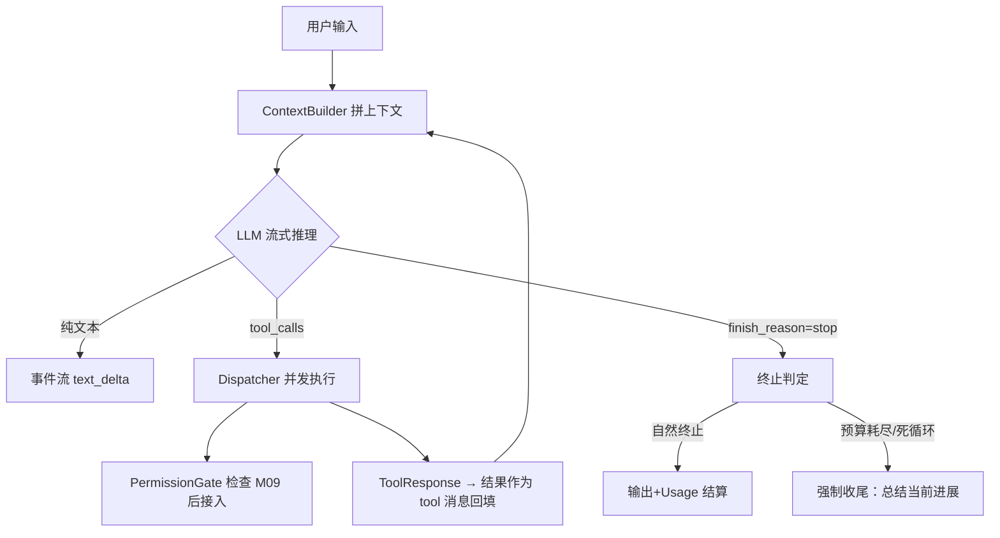

# M03 Agent Loop（ReAct 执行引擎）

| 项 | 值 |
|---|---|
| 生产进度 | Sprint 2 · 里程碑 MI-1a「能对话的最小 Agent」（与 M02 同周完成） |
| 代码落点 | `backend/agent_godot/agent/loop.py dispatcher.py budgets.py events.py` |
| 前置模块 | M02（StreamAggregator 聚出完整 ToolCall 后 Loop 才能工作） |
| 手写比例 | **100% 纯手写**（不用 LangGraph/任何编排框架——本项目宣言） |
| 教程映射 | 📗 hello-agents agents/react_agent.py · 📘 zero2Agent（ReAct 篇）· 📝笔记 ReAct |

---

## 0. 本模块在项目中的位置

整个项目的**心脏**。M02 让模型能"说话"，本模块让模型能"做事"：推理 → 调工具 → 观察结果 → 继续推理的循环，直到模型认为任务完成。后续所有模块（四模式 M13、Subagent M15、Hooks M14）都是**围绕这个循环加插件**，循环本体在此定型。

**为什么本模块只有 ReAct？—— 生产进度制的必然，不是范式缺失**。Cursor/CodeBuddy 的 ask/craft/plan/multi 四模式也不是一天建成的：先有对话（ask），再有执行（craft/agent），再有规划（plan）与多代理（multi）。本项目按同样的产品演进顺序分期交付范式——Sprint 2 的产品只有 ask 模式，ReAct 循环就是它的全部执行内核。**四大范式在本项目的完整落点**：

| 经典范式 | 产品模式（Cursor/CodeBuddy 形态） | 落点模块 | Sprint |
|---|---|---|---|
| **ReAct** | `ask`（也是其余三模式共用的执行底座） | **M03（本模块）** → M12 联通检索 → M13 正式化 | S2/S8/S9 |
| **Reflection**（客观验证器回路） | `craft`（改 → headless 验 → 不过则修） | M06 领域层落地 → M13 §1.2 正式化 | S4/S9 |
| **Plan-and-Solve**（DAG + re-plan） | `plan`（先出计划人批再执行） | M13 §1.1 | S9 |
| **Multi-Agent**（Orchestrator-Worker） | `multi`（拆子任务并行派发） | M13 骨架 → M15 完全体 + A2A | S9/S10 |

一句话记住分工：**M03 造发动机（循环），M06/M09/M12 加油路与刹车（验证/权限/检索），M13 换挡（四模式策略配置），M15 加气缸（并行子代理）**——四大范式一个不少，只是按真实产品的节奏分期长出来。

**交付后状态**：`godot-agent ask "lab 下有什么文件？"` ——模型自主决定调用 `list_files` 工具 → 拿到结果 → 组织回答 → 终止。完整 ReAct 三步在终端可见。



---

## 1. 知识点详解

### 1.1 ReAct：推理与行动交织

**① 原理**

ReAct = Reason + Act。每轮循环模型产出两种内容之一：

```text
Thought: 用户要列文件，我需要先看目录结构
Action: list_files[path="lab"]
Observation: ["m01/attention.py", "m01/mini_bpe.py", ...]   ← 工具结果回填
Thought: 文件都在，可以回答了
Final Answer: lab 下有 4 个实验脚本……
```

原始 ReAct（2022 论文）靠提示词让模型输出上述文本格式，再用**正则解析**——脆弱但开创性。现代实现靠 **Function Calling 原生协议**：模型输出的 `tool_calls` 是结构化 JSON，`finish_reason="tool_calls"` 明示"我要调工具"——解析层从正则降级为 `json.loads`，可靠性质变。**但循环骨架与论文完全一致**：Thought(隐含在 content) → Act(tool_calls) → Observation(tool 消息) 循环。

为什么这个循环如此重要：它把"模型的单次生成能力"扩展成"带外脑的迭代求解器"——模型不必一次答对，可以**边做边看**。上下文里的 Observation 序列就是模型的"工作记忆"。

**② 演进**：直接 prompting（一次性回答，错就是错）→ CoT（2022，"let's think step by step"，推理内化在生成里，但不能与外界交互）→ ToT（2023，把推理组织为"分支生成 × 评估 × 回溯"的搜索树——旁支而非主线，M13 选读展开）→ ReAct（2022.10，与工具交互，错误可被 Observation 纠正）→ Function Calling 原生化（2023.6 OpenAI，结构化工具调用）→ Agent Loop 工程（Cursor/CodeBuddy 等：预算、权限、上下文管理都在循环的钩子上）→ 本项目。一句话记住分界线：**CoT 教模型"想清楚"，ReAct 教模型"边想边做边看结果"**。

**③ 最小案例** `lab/m03/react_trace.py`——不用真模型，硬编码"剧本"看清循环骨架：

```python
SCRIPT = [                                   # 模拟模型的三轮决策
    {"tool_calls": [{"name": "list_files", "args": {"path": "lab"}}]},
    {"tool_calls": [{"name": "read_file", "args": {"path": "lab/m01/mini_bpe.py"}}]},
    {"content": "lab 下 4 个实验脚本，核心是 mini_bpe.py 的 BPE 训练循环。"},
]
def fake_llm(messages):                      # 按"已发生的轮数"取剧本
    return SCRIPT[len([m for m in messages if m.role == "tool"])]

TOOLS = {"list_files": lambda p: ["m01/attention.py", "m01/mini_bpe.py"],
         "read_file":  lambda p: open(p, encoding="utf8").read()[:200]}

async def react_loop(user_input: str, max_steps: int = 10):
    messages = [{"role": "user", "content": user_input}]
    for step in range(max_steps):            # ★ 循环本体 12 行
        resp = fake_llm(messages)
        if not resp.get("tool_calls"):
            return resp["content"]           # 自然终止
        messages.append({"role": "assistant", "tool_calls": resp["tool_calls"]})
        for tc in resp["tool_calls"]:
            result = TOOLS[tc["name"]](**tc["args"])
            messages.append({"role": "tool", "tool_call_id": tc["id"],
                             "content": str(result)})   # ★ Observation 回填
    return "(预算耗尽) " + fake_llm(messages)

print(asyncio.run(react_loop("看看 lab 目录")))
```

跑它，在 `messages.append` 处打断点/打印：你会**亲眼看到上下文如何一轮轮长胖**——这就是后面 M07 上下文工程要治理的对象。

**④ 易错点**
- assistant 的 tool_calls 消息与 tool 结果消息**必须成对**出现在上下文里；只留一半，下一轮请求直接 400
- 循环里每一轮都是"全量历史"发给模型——不截断的话第 20 轮的请求里装着前 19 轮全部 Observation（token 成本爆炸，M07 解决）
- `max_steps` 不是装饰：没有它，模型陷入"读文件→列表目→读文件"死循环时你的进程会跑到天荒地老
- 终止判定要同时看 `finish_reason` 与 content；某些模型爱在文本里"假装"调工具（输出伪 JSON），要在 Dispatcher 入口校验工具名真实性

### 1.2 循环工程：终止、预算、死循环治理

**① 原理**

论文不告诉你、生产必须做的三件事：

**终止条件矩阵**（全部要实现）：

| 条件 | 类型 | 动作 |
|---|---|---|
| `finish_reason=stop` 且无 tool_calls | 自然终止 | 正常返回 |
| `max_steps` 步数耗尽 | 预算终止 | 注入"请总结进展并收尾"做最后一轮 |
| token 预算耗尽（input+output 累计） | 预算终止 | 同上 + 标记 `truncated` |
| 墙钟超时 | 预算终止 | 取消进行中的工具，收尾 |
| 死循环检测：连续 N 次相同 tool_call 指纹 | 异常终止 | 注入提示"你在重复调用 X，换个思路"；仍重复则硬停 |

**死循环指纹**：`(tool_name, json.dumps(args, sort_keys=True))` 的哈希，滑动窗口内重复 ≥3 次判定循环——比"步数上限"精细，能在浪费 10 步之前拦住。

**预算熔断**（budgets.py）：四维预算 `steps/tokens/usd/wall_time` 任一触顶即熔断。设计要点是**熔断不是报错而是"优雅收尾"**——注入一条 system 消息让模型总结已完成部分与未竟事项，用户体验从"报错崩溃"变成"有始有终"。

**② 演进**：玩具 demo 不管终止（while True）→ 框架给 max_iterations（LangChain，粗粒度）→ 生产 Agent（DSH/Cursor 级别）的多维预算+死循环检测+优雅收尾。面试里"你的 Agent 怎么防失控"就考这节。

**③ 最小案例**：死循环检测器（可直接抄进 budgets.py）

```python
class LoopDetector:
    def __init__(self, window: int = 3, max_repeat: int = 3):
        self.window, self.max_repeat = window, max_repeat
        self.history: deque[str] = deque(maxlen=window)

    def check(self, calls: list[ToolCall]) -> bool:
        """返回 True 表示检测到死循环。"""
        fp = hash(tuple(sorted((c.name, c.arguments) for c in calls)))
        self.history.append(fp)
        return self.history.count(fp) >= self.max_repeat
```

**④ 易错点**
- 预算检查点在**每轮开始**而非工具执行后——工具本身可能跑 5 分钟，检查晚了等于没检查
- 死循环检测窗口太敏感会误伤（合理的三次重试同参数）；要先注入"劝导提示"再硬停
- Usage 结算要在"强制收尾轮"之后继续累计——很多人收尾轮忘了记账

### 1.3 Dispatcher：工具调用的并发调度

**① 原理**

模型一轮可以返回**多个 tool_calls**（并行工具调用，parallel tool calls）。调度策略：

```text
默认策略：无副作用工具（读类）→ asyncio.gather 并发
         有副作用工具（写/删/网）→ 按序执行（防竞态）
超时控制：每个工具独立 timeout（读 10s / 写 30s / headless 120s 分级）
失败策略：单工具失败不炸循环——把错误文本作为 Observation 回填，让模型自己决定重试/换路
```

**错误回传是精髓**：`ToolResponse(ok=False, error="路径不存在: res://enemy.gd")` 让模型**读到错误自己纠正**——这是 Agent "自我修复"能力的最小形态，比抛异常中断循环优雅一个量级。

**② 演进**：串行逐个调（浪费）→ asyncio.gather 全并发（写类工具竞态）→ 读写分流策略（本项目）。M14 的 pre-tool hook 会挂进 Dispatcher 的调用管线（权限门就是第一个 hook）。

**③ 最小案例**

```python
async def dispatch(self, calls: list[ToolCall]) -> list[ToolResponse]:
    read_ops  = [c for c in calls if self.registry.spec(c.name).readonly]
    write_ops = [c for c in calls if not self.registry.spec(c.name).readonly]
    results = []
    if read_ops:                                    # 读类并发
        results += await asyncio.gather(*(
            self._run_one(c) for c in read_ops), return_exceptions=True)
    for c in write_ops:                             # 写类按序
        results.append(await self._run_one(c))
    return [self._to_response(r) for r in results]  # 异常也翻译成 ToolResponse
```

**④ 易错点**
- `gather(return_exceptions=True)` 不加的话一个失败全部取消——但要记得把异常翻译成 `ok=False` 的响应
- 并发结果顺序必须与调用顺序对应（zip 而不是完成顺序），否则 Observation 配对错乱
- 工具超时取消后要清理半成品（临时文件/锁）——M06 的 Godot headless 尤其明显

### 1.4 事件流：SSE 与 CLI 双消费者的统一出口

**① 原理**：Loop 内部不发 print、不写日志，只**发事件**：`text_delta / tool_call_start / tool_call_result / budget_update / message_end`。CLI 消费者把它打成终端彩色输出；Web 消费者（M19/M20）把它序列化成 SSE 帧推给浏览器。**一个事件协议，两个前端**——这就是 M00 说的"核心包纯库"的具象化。

**② 演进**：直接 print（不可复用）→ 回调函数注册（洋葱依赖）→ async iterator / asyncio.Queue 事件流（结构化、可回放、可测试）。回放能力额外送你一份礼物：**录制真实会话事件流 = M17 轨迹数据**（GRPO 的原材料）。

**③ 最小案例**

```python
@dataclass
class AgentEvent:
    type: str; payload: dict; ts: float = field(default_factory=time.time)

class EventBus:
    def __init__(self): self._q = asyncio.Queue()
    async def emit(self, type_: str, **payload): await self._q.put(AgentEvent(type_, payload))
    def stream(self) -> AsyncIterator[AgentEvent]:
        async def gen():
            while (e := await self._q.get()) is not STOP:
                yield e
        return gen()
```

**④ 易错点**
- 事件要带 `ts` 与 `session_id`，否则多会话并发时前端串流
- 队列要有上限（背压），恶意长输出不能把内存吃爆
- 事件顺序保证：`tool_call_result` 必须晚于对应 `tool_call_start`——并发回填时按 call_id 配对排序

---

## 2. 接口设计（完整签名）

```python
# agent/loop.py
@dataclass
class LoopConfig:
    max_steps: int = 25
    token_budget: int = 200_000
    usd_budget: float = 0.5
    wall_time_budget: float = 600.0
    loop_detector: LoopDetector = field(default_factory=LoopDetector)

class AgentLoop:
    def __init__(self, llm: LLM, dispatcher: Dispatcher,
                 context_builder: ContextBuilder,   # M07 前先用简单拼接
                 budgets: BudgetTracker, bus: EventBus): ...
    async def run(self, session: Session, user_input: str | None,
                  *, mode: str = "ask") -> LoopResult:
        """单次任务执行：从用户输入到最终回答的完整循环。"""

@dataclass
class LoopResult:
    final_text: str
    steps: int
    usage_total: Usage
    stop_reason: Literal["natural", "max_steps", "token_budget",
                         "usd_budget", "timeout", "loop_detected", "error"]

# agent/dispatcher.py
class Dispatcher:
    def __init__(self, registry: ToolRegistry, config: DispatchConfig): ...
    async def execute(self, calls: list[ToolCall]) -> list[ToolResponse]: ...

# agent/budgets.py
class BudgetTracker:
    def check(self) -> BudgetStatus: ...            # 每轮开始调用
    def record_usage(self, usage: Usage) -> None: ...
    def record_step(self) -> None: ...

# agent/events.py —— 事件类型常量 + AgentEvent/EventBus（见 1.4）
```

## 3. 关键难点参考片段：循环本体

```python
async def run(self, session, user_input, *, mode="ask"):
    self.budgets.reset()
    while True:
        status = self.budgets.check()                          # ① 预算检查前置
        if status.exhausted:
            return await self._graceful_wrap_up(session, status)
        messages = await self.context_builder.build(session)   # ② 每轮重建上下文
        final = None
        async for ev in self.llm.stream(LLMRequest(model=..., messages=messages,
                                                   tools=self.registry.tool_specs())):
            await self.bus.emit(ev.type, **ev.payload)         # ③ 事件直通
            self.aggregator.feed(ev)
        self.budgets.record_usage(self.aggregator.usage)
        calls = self.aggregator.tool_calls
        if not calls:                                          # ④ 自然终止
            return LoopResult(self.aggregator.text, self.budgets.steps,
                              self.budgets.usage, "natural")
        if self.detector.check(calls):                         # ⑤ 死循环劝导
            await self._inject_loop_warning(session)
            continue
        session.append(AssistantMsg(tool_calls=calls))
        results = await self.dispatcher.execute(calls)         # ⑥ 观察
        for r in results:
            session.append(ToolMsg(call_id=r.call_id, content=r.render()))
```

为什么难：六个步骤的**顺序**就是全部设计——预算前置于推理、终止判定先于死循环、结果按序回填。任何一步挪位置都会引入"超支一轮/丢一次观察"的 bug。

## 4. 手敲指引

| 步骤 | 文件 | 做什么 | 验证 |
|---|---|---|---|
| 1 | events.py | AgentEvent + EventBus | 单测：先订阅后发送能收到 |
| 2 | lab/m03/react_trace.py | 硬编码剧本跑通循环 | 终端打印 3 轮 Observation |
| 3 | budgets.py | 四维预算 + LoopDetector | 注入小预算断言 stop_reason 正确 |
| 4 | dispatcher.py | 读写分流并发 | 2 读 1 写：读并发、写在后 |
| 5 | loop.py | 真实 LLM 接入（用 M02 的 get_llm） | `ask "lab 有什么"` 真机跑通 |
| 6 | loop.py | 优雅收尾 `_graceful_wrap_up` | 耗尽预算时输出"进展总结" |

## 5. 测试与验收

```python
async def test_loop_stops_on_max_steps():
    loop = make_loop(fake_llm_always_calls_tools, max_steps=3)
    result = await loop.run(session, "go")
    assert result.stop_reason == "max_steps" and result.steps == 3

async def test_loop_detector_intervenes():
    # 连续 3 次相同调用 → 注入劝导 → 若仍重复 → stop_reason="loop_detected"

async def test_tool_error_becomes_observation():
    # 工具抛异常 → 循环不中断 → 下一轮 messages 里出现 ok=False 的 tool 消息
```

**验收 Demo**：`godot-agent ask "帮我看看 lab/m01 下有哪些实验并讲讲 attention.py 在干嘛"`——事件流打印出 `tool_call_start(list_files)` → 结果 → 模型自主决定再调 `read_file` → 最终中文总结。全程无人工干预。

## 6. 踩坑记录（留白）

| 日期 | 坑 | 现象 | 根因 | 解法 | 关联知识点 |
|---|---|---|---|---|---|
|     |    |     |     |    |          |

## 7. 面试拷打

1. ReAct 与 CoT 的本质区别？（交互性：Observation 可纠错）
2. 画出 Function Calling 版 ReAct 的一轮完整消息序列（4 种角色怎么排）；
3. 模型一轮返回 5 个 tool_calls，你怎么调度？读写怎么分流？
4. 你的 Agent 有几种终止条件？预算熔断为什么是"优雅收尾"而不是抛异常？
5. 死循环怎么检测？为什么用指纹而不是只数步数？
6. 工具执行失败，中断循环 vs 错误回传，各自适用什么场景？
7. 事件流设计为什么让 CLI 和 Web 复用同一 Runtime 成为可能？
8. 每轮全量历史重发的 token 成本问题，你打算怎么治理？（预告 M07，答出思路即可）
9. 如果模型在 content 里输出"伪工具调用 JSON"而不是走 tool_calls 协议，怎么办？
10. 开放题：把 max_steps 从 25 提到 500 需要配套改什么？（上下文压缩/预算/检查点/事件回放）

## 8. 教程映射与延伸

- 📗 hello-agents `agents/react_agent.py`（对照：其 think/act 两方法 = 本循环的推理半/执行半；本项目多了预算与事件流）
- 📘 zero2Agent ReAct 篇
- 必读：ReAct 论文（Yao et al. 2022，读 Figure 1 的 prompt 模板即可）
- 选读：OpenAI Function Calling 文档的 parallel calls 一节
