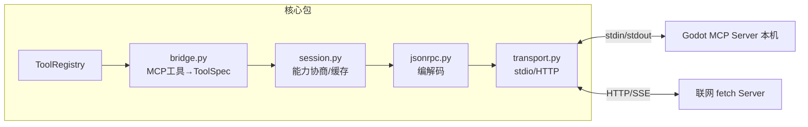

# M05 MCP（Model Context Protocol 客户端手写）

| 项 | 值 |
|---|---|
| 生产进度 | Sprint 3 · 里程碑 MI-1b「会用工具的 Agent」（紧随 M04） |
| 代码落点 | `backend/agent_godot/mcp/client/`（4 个文件 + 1 个实验，见 §0.5） |
| 前置模块 | M04（桥接产物直接进 ToolRegistry） |
| 手写比例 | **100% 纯手写**（不用官方 SDK，协议本身只是 JSON-RPC——本项目最有底气的手写宣言） |
| 教程映射 | 📝笔记 MCP 章 · 📘 zero2Agent（MCP 篇）· MCP 官方规范 |

---

## 0. 本模块在项目中的位置

**大白话**：M04 的工具是**自己店里的员工**（进程内函数，随叫随到）；MCP 让你接入**外部服务商**——独立进程或远程机器上的工具服务。它就是**工具界的统一电源插座标准**：过去每接一家工具要定制一根专用线（M 个应用 × N 个工具 = M×N 份集成代码）；有了 MCP，应用装一次插座（客户端）、工具方提供一个插头（服务器），走标准协议（M+N）——从此 `mcp.yaml` 里加一段配置，Agent 工具箱就多一个服务器的全部工具，**核心代码零改动**（M00"一切皆插件"最完整的一次兑现）。

写完本模块你获得：Godot 集成（M06）、联网搜索、社区生态（数千个现成服务器）全部经此接入。



---

## 0.5 ★ 施工文件清单（开工前必看的一页表）

**本模块你一共要新建 5 个文件**（严格按依赖顺序——下层先写）：

| # | 新建文件（完整路径） | 职责一句话 | 关键类/函数 | 预估行数 | 手敲步骤(§4) | 依赖 |
|---|---|---|---|---|---|---|
| 1 | `mcp/__init__.py` + `mcp/client/__init__.py` | 空包标记 | — | 2 | 步骤 0 | — |
| 2 | `mcp/client/jsonrpc.py` | JSON-RPC 2.0 编解码 | `RPCRequest/RPCResponse`、`encode/decode` | 50 | 步骤 1 | 无 |
| 3 | `mcp/client/transport.py` | 两种传输：子进程/HTTP | `Transport`、`StdioTransport`、`HttpTransport` | 130 | 步骤 2 | jsonrpc |
| 4 | `mcp/client/session.py` | 握手/请求配对/工具缓存 | `McpSession` | 120 | 步骤 3 | transport |
| 5 | `mcp/client/bridge.py` | MCP 工具→FC 注册表 | `McpManager` | 90 | 步骤 4 | session + M04 registry |
| — | `lab/m05/fake_server.py` | 20 行 stdin-stdout 假服务器（测试用） | — | 25 | 步骤 2 前置 | 无 |
| — | `config/mcp.yaml` | 服务器注册表（产品配置面） | — | 15 | 步骤 5 | — |

**依赖链**：`jsonrpc（消息格式）→ transport（怎么送）→ session（何时送/怎么配对）→ bridge（翻译成 FC 工具）`——四层就是协议栈，自底向上手写。

**完成后你拥有**：
- 验收命令：mcp.yaml 启用 everything 服务器 → `godot-agent ask "用 mcp 工具 echo 'hello'"` 模型自主调用
- 中途 kill 服务器进程，Agent 提示"服务器离线"而非挂死
- 3 个单测绿

---

## 1. 知识点详解（每节五段：定义 → 大白话 → 举例 → 演进 → 易错点）

### 1.1 MCP 解决什么问题（M×N 困境）

**① 严格定义**：MCP（Model Context Protocol，Anthropic 2024.11）是连接 AI 应用与外部数据源/工具的开放协议——应用实现一次 MCP 客户端、工具方实现一次 MCP 服务器、中间走标准消息，把 M×N 集成问题降为 M+N。服务器可暴露三类原语：**tools**（模型自主调用的函数）、**resources**（应用决定注入的可读数据）、**prompts**（用户主动触发的提示模板）。

**② 大白话**：**AI 界的 USB-C**。USB 出现前：打印机一根线、相机一根线、鼠标一根线，抽屉里缠成一团；USB 后：一根线标准通吃，新设备出厂即插即用。MCP 之前：每家 AI 应用接每个工具都要 bespoke 集成（Cursor 接 GitHub 一套、接 Slack 又一套）；MCP 之后：GitHub 实现一次服务器，Cursor/Claude/你的 Agent 全都能用。**三原语的控制方设计是精髓**——谁有权触发决定了安全边界：

| 原语 | 给模型什么 | 控制方 | 本项目用例 |
|---|---|---|---|
| **tools** | 可调用函数（模型自主决定） | 模型 | Godot 场景操作、headless 运行 |
| **resources** | 可读数据（应用决定何时注入） | 客户端 | 项目文件树、场景清单 |
| **prompts** | 可复用提示模板 | 用户 | /godot-debug 斜杠命令 |

类比：tools=员工可以自己决定打给供应商的电话；resources=秘书（程序）定期放进简报的资料；prompts=只有老板（用户）按下的按钮。混用会造成安全与体验问题（把危险操作做成 tools 让模型自主决定=权限失控）。

**③ 举例**：不写代码先体会——mcp.yaml 临时加官方 echo 服务器，观察协议报文：

```yaml
servers:
  everything:
    transport: stdio
    command: npx
    args: ["-y", "@modelcontextprotocol/server-everything"]
```

**④ 演进**：各家 FC 私有协议（2023，工具绑定单应用）→ MCP 2024.11 发布 → OpenAI/Google/DeepSeek 2025 相继采纳 → 生态爆发（数千服务器）。对照理解：FC 是"模型↔应用"接口标准化（竖切），MCP 是"应用↔工具生态"标准化（横切），**互补不竞争**。

**⑤ 易错点**：
- MCP 的 `inputSchema` 与 FC 的 `parameters` 概念同构但**字段名不同**——桥接要翻译
- 三原语控制方不可混用（安全设计）
- 服务器挂了不能拖死 Agent：bridge 层做服务器级熔断（复用 M02 CircuitBreaker）

### 1.2 JSON-RPC 2.0：MCP 的传输语法

**① 严格定义**：一切消息是 JSON 对象三种角色——**请求**（有 id，期待响应）、**响应**（result 或 error 二选一）、**通知**（无 id，不期待响应）。id 是异步关联键：并发发出 1/2/3，响应乱序回来按 id 配对。标准错误码：-32700 解析错 / -32600 无效请求 / -32601 方法不存在 / -32602 参数无效 / -32603 内部错。

**② 大白话**：**餐厅的点餐小票系统**。请求=你写的点菜单（编号 7 号）；响应=后厨出餐叫号（"7 号好了"）——好了给菜（result），做不了给原因（error）；通知=你喊的"麻烦加辣"（喊完就走，不等回应）。编号（id）是关键——三个桌同时点餐，出餐顺序乱，全靠小票号配对。双向 RPC=后厨也可以反向给你小票（服务器向客户端发请求，如采样请求）。

**③ 举例**（MCP 真实报文三种形态）：

```jsonc
// 请求（客户端→服务器）
{"jsonrpc": "2.0", "id": 1, "method": "tools/call",
 "params": {"name": "list_scenes", "arguments": {}}}
// 响应（成功/失败二选一）
{"jsonrpc": "2.0", "id": 1, "result": {"content": [{"type": "text", "text": "..."}]}}
{"jsonrpc": "2.0", "id": 1, "error": {"code": -32601, "message": "Method not found"}}
// 通知（无 id，不期待响应）
{"jsonrpc": "2.0", "method": "notifications/initialized"}
```

**④ 演进**：REST（资源导向——但 AI 工具调用需要"方法调用"语义）→ gRPC（重、要 proto 编译）→ JSON-RPC 2.0（2009 规范，零依赖可读双向）→ 被 LSP（2016）证明适合"编辑器↔语言服务"的本地长连接进程协作 → **MCP = LSP 模式在 AI 工具领域的复刻**（连 initialize 握手都是同款）。

**⑤ 易错点**：
- 消息必须**单行 JSON**（stdio 按 `\n` 分帧，嵌入换行破协议）——`json.dumps` 千万别加 `indent=`
- 通知没有 id 也没有响应——发出后不能"等"，等了永远阻塞
- id 可为字符串或数字但同会话不得重复；响应乱序靠它配对（asyncio 的 pending dict）

### 1.3 传输层：stdio 与 Streamable HTTP

**① 严格定义**：两种官方传输。**stdio**：客户端 `subprocess.Popen` 起服务器进程，stdin 写请求、stdout 读响应、stderr 收日志——本地工具首选（零网络开销、天然复用本机环境）。**Streamable HTTP**（2025-03 规范合并旧 HTTP+SSE）：POST 到单一 endpoint `/mcp`，响应可普通 JSON 或 SSE 流，`Mcp-Session-Id` 头维持会话。

**② 大白话**：**两种对话方式**。stdio 像**和坐在旁边同事咬耳朵**（在同一台机器上，你写纸条塞给他手里=stdin，他写纸条递回来=stdout，他自言自语抱怨=stderr 日志）；HTTP 像**给外地供应商打电话**（跨机器，走网络，还要会话凭证防止接错线）。本机 Godot 工具用前者（快、能摸到本地文件），联网服务用后者。

**③ 举例**：StdioTransport 核心 + 最容易写错的 stdout 泵：

```python
class StdioTransport:
    async def start(self):
        self.proc = await asyncio.create_subprocess_exec(
            *self.argv, stdin=PIPE, stdout=PIPE, stderr=PIPE)
        self._reader = asyncio.create_task(self._pump_stdout())   # 后台泵
    async def send(self, line: str):
        self.proc.stdin.write((line + "\n").encode()); await self.proc.stdin.drain()

async def _pump_stdout(self):
    while True:
        line = await self.proc.stdout.readline()      # ★ 按行分帧 = 消息边界
        if not line:
            break                                     # 服务器进程退出
        msg = line.decode("utf-8", "replace").strip()
        if not msg:
            continue
        await self._on_message(decode(msg))           # 分发：响应配 pending / 请求上行
```

**④ 演进**：stdio（LSP 验证过的本地模式）→ HTTP+SSE 双 endpoint（2024-11，部署繁琐）→ Streamable HTTP 单 endpoint（2025-03，简化+支持无状态服务器）。本项目两种都实现：本地 Godot 走 stdio、联网服务走 HTTP。

**⑤ 易错点**：
- **必须持续排空 stdout/stderr**：服务器日志写满管道缓冲区（~64KB）会**死锁**——stderr 单独起泵只打印不解析
- 服务器崩溃检测：`proc.returncode is not None` 时 pending 请求全部错误兑现（否则上游永远挂起）
- Windows 下 `npx` 要 `shell=True` 或用 `npx.cmd`——stdio 跨平台启动的著名深坑

### 1.4 会话生命周期与能力协商

**① 严格定义**：MCP 连接的五步生命周期——①客户端发 `initialize`（携己方能力声明+协议版本）→ ②服务器回 result（携它的能力：tools?/resources?/prompts? + 版本）→ ③客户端发 `notifications/initialized`（握手完成）→ ④正常调用（tools/list 发现→tools/call 执行；列表带 cursor 分页；缓存+`tools/list_changed` 通知失效）→ ⑤关闭（杀进程/DELETE 会话）。

**② 大白话**：**入职握手仪式**。新员工（客户端）第一天：先递简历说明"我会什么、用哪个版本的工作流"（initialize）→ 部门回复"我们有哪些系统权限、流程版本"（服务器能力）→ 员工确认"收到，开始干活"（initialized 通知）→ 之后才能领任务（tools/list）干活（tools/call）。能力协商的意义：双方声明"我支持什么"，按对方实际能力启用功能——版本不匹配时优雅降级而不是报错。

**③ 举例**：会话状态机骨架：

```python
class McpSession:
    def __init__(self, transport):
        self._state = "new"; self._pending: dict[str, Future] = {}
        self.server_caps: dict = {}; self._tools_cache: list | None = None

    async def initialize(self) -> None:
        resp = await self.request("initialize", params={
            "protocolVersion": "2025-03-26",
            "capabilities": {"roots": {"listChanged": True}},   # 我方能力
            "clientInfo": {"name": "agent-godot", "version": "0.1.0"}})
        self.server_caps = resp["capabilities"]                  # 对方能力
        await self.notify("notifications/initialized")           # ★ 通知无响应
        self._state = "ready"

    async def list_tools(self, force=False) -> list[dict]:
        if self._tools_cache is None or force:
            self._tools_cache = (await self.request("tools/list", {}))["tools"]
        return self._tools_cache
```

**④ 演进**：固定接口（版本强绑死，一升级全断）→ 能力协商（LSP/WebRTC/MCP 共同设计，解耦演进）。写客户端必须处理"服务器版本更新/更旧"的分支（protocolVersion 取双方共同最高）。

**⑤ 易错点**：
- 未 initialize 就调 tools/list → 服务器直接断连（协议规定握手前置）
- 工具缓存要订阅 `notifications/tools/list_changed` 失效重拉——服务器热加工具才可见
- 每个 request 挂 `asyncio.wait_for`——服务器无响应时 pending future 必须超时兑现

### 1.5 桥接：MCP 工具 → FC ToolSpec

**① 严格定义**：字段翻译表——MCP tools/list 项的 `name`→`mcp__{server}__{name}`（命名空间防重名）、`description` 同名透传、`inputSchema`→`parameters`（JSON Schema 清洗复用 M04）、tools/call 结果 `content[]` 拼接 text 块→`ToolResponse.summary`。M04 的 ToolRegistry 完全无感（它不知道也不需要知道工具来自 MCP）。

**② 大白话**：**外籍员工入职翻译**。外部服务商的员工（MCP 工具）说方言（inputSchema/content 格式），进店前 HR（bridge）给他办工牌：姓名前加部门前缀（`mcp__godot__`，防止和本地同名员工混淆）、简历格式转换成本店模板（schema 清洗）。之后店长（Registry/Dispatcher）按统一制度调度，无感其外籍身份。**风险标注**：MCP 不带 readonly/risk 元数据 → 按服务器级默认策略（mcp.yaml `default_risk: medium`）+ 名称启发式（write/delete/post 开头→high）。

**③ 举例**：

```python
async def bridge_server(self, name: str, session: McpSession) -> None:
    for t in await session.list_tools():
        fc_name = f"mcp__{name}__{t['name']}"
        spec = clean_schema(t["inputSchema"])
        self.registry.register_dynamic(fc_name, spec, t["description"],
            readonly=_looks_readonly(t["name"]),
            runner=lambda args, s=session, n=t["name"]:
                _call_mcp(s, n, args))            # 闭包绑定会话（默认参数防循环变量坑）
```

**④ 演进**：手动每工具写适配（回到 M×N）→ 声明式桥接（一份翻译表全量自动）——协议标准化的红利兑现处。

**⑤ 易错点**：
- lambda 闭包绑定循环变量是 Python 经典坑（默认参数绑定解决）
- tools/call 的 content 可能含 image 资源块——桥接只透传 text，其他降级为占位说明
- 服务器级熔断：某服务器连续失败整体摘除（tools 保留但调用秒失败并提示），避免每工具都等超时

---

## 2. 接口设计（完整签名 = 你要手写的契约）

```python
# mcp/client/jsonrpc.py
def encode(msg: RPCRequest | RPCNotification) -> str: ...   # 单行 JSON，禁 indent
def decode(raw: str) -> RPCRequest | RPCResponse: ...        # 按"有无 method"分流

# mcp/client/transport.py
class Transport(ABC):
    async def start(self) -> None: ...
    async def send(self, line: str) -> None: ...
    def on_message(self, cb: Callable[[str], Awaitable]) -> None: ...
    async def close(self) -> None: ...

class StdioTransport(Transport):
    def __init__(self, command: str, args: list[str], env: dict | None): ...
class HttpTransport(Transport):
    def __init__(self, url: str, headers: dict | None): ...

# mcp/client/session.py
class McpSession:
    def __init__(self, transport: Transport, timeout: float = 30): ...
    async def initialize(self) -> ServerCapabilities: ...
    async def request(self, method: str, params: dict) -> Any: ...
    async def notify(self, method: str, params: dict | None = None) -> None: ...
    async def list_tools(self, force: bool = False) -> list[dict]: ...
    async def call_tool(self, name: str, args: dict) -> ToolResponse: ...
    async def close(self) -> None: ...

# mcp/client/bridge.py
class McpManager:
    """读 config/mcp.yaml，管理全部服务器会话的启停与桥接。"""
    def __init__(self, registry: ToolRegistry): ...
    async def start_all(self) -> None: ...
    async def stop_all(self) -> None: ...
    def server_status(self) -> dict[str, Literal["running", "dead", "disabled"]]: ...
```

---

## 3. 关键难点参考片段：pending 配对

```python
async def request(self, method, params):
    fut = asyncio.get_running_loop().create_future()
    mid = self._next_id()
    self._pending[mid] = fut                      # ★ id→future 注册
    await self.transport.send(encode(RPCRequest(method, params, mid)))
    try:
        return await asyncio.wait_for(fut, self.timeout)
    finally:
        self._pending.pop(mid, None)

async def _on_message(self, msg):
    if isinstance(msg, RPCResponse):
        if fut := self._pending.get(msg.id):      # 响应按 id 配对（可能乱序）
            fut.set_result(msg.result) if not msg.error else \
            fut.set_exception(McpRemoteError(msg.error))
        else:
            logger.warning("孤儿响应 id=%s", msg.id)   # 超时后迟到的响应
```

为什么难：乱序、超时、孤儿响应、服务器死亡时 pending 清算——四个时序问题叠在一个字典上。测试必须逐个注入模拟。

---

## 4. 手敲指引（函数级伪代码）

### 步骤 0：`lab/m05/fake_server.py`（20 行假服务器，测试基石）
| 作用 | 伪代码 |
|---|---|
| 主循环 | `逐行读 stdin → decode → 按	method 分支：initialize 回能力清单 / tools/list 回 2 个假工具 / tools/call 回 echo 结果 → encode 写 stdout`。注意单行 JSON、无缩进 |
**验证**：终端手工管道 echo 测试通过。

### 步骤 1：`mcp/client/jsonrpc.py`
| 函数 | 作用（伪代码） |
|---|---|
| `encode` | `组装 dict{jsonrpc:"2.0", method} → params 非 None 则加 → id 非 None 则加（无 id=通知）→ dumps 单行` |
| `decode` | `loads → 有 "method" 键 = 请求/通知（有无 id 区分）→ 否则是响应（result 或 error）` |
**验证**：请求/响应/通知三形态编解码往返一致。

### 步骤 2：`mcp/client/transport.py`
| 类 | 作用（伪代码） |
|---|---|
| `StdioTransport.start` | `create_subprocess_exec(command,args, 三管道) → 后台起 stdout 泵任务 + stderr 泵任务`（Windows 注意 npx.cmd） |
| `StdioTransport.send` | `line+"\n" 编码写 stdin → drain` |
| `_pump_stdout` | §1.3 ③ 代码：`循环 readline → 空行跳过 → decode → 回调分发`；进程退出（空字节）时清算 pending` |
| `HttpTransport.send` | `httpx POST 到 url，headers 带 Mcp-Session-Id → 响应逐行喂同一个回调（SSE 形态）` |
**验证**：与 fake_server 收发 echo 通；杀 fake_server 进程 → 上游收到 McpTransportError。

### 步骤 3：`mcp/client/session.py`
| 函数 | 作用（伪代码） |
|---|---|
| `initialize` | §1.4 ③ 代码：`request("initialize", 我方能力) → 存 server_caps → notify initialized → state=ready` |
| `request` | §3 难点代码：`造 future + 自增 id → pending[id]=fut → send → wait_for(fut, timeout) → finally 清 pending` |
| `_on_message` | `响应：按 id 找 future → set_result/set_exception；找不到=孤儿响应记日志。请求（服务器反向）：M05 只记日志不实现（采样/elicitation 留空）` |
| `list_tools/call_tool` | `list：缓存优先，miss 则 request；call：request("tools/call") → content 拼 text → 包成 ToolResponse（含 isError 映射 ok=False）` |
**验证**：假服务器暴露 2 工具 → list 出 2 个、call echo 返回正确；kill 进程 → 挂起调用秒级失败。

### 步骤 4：`mcp/client/bridge.py`
| 函数 | 作用（伪代码） |
|---|---|
| `McpManager.start_all` | `读 mcp.yaml → 逐服务器：按 transport 字段造 Stdio/HttpTransport → session.initialize → bridge_server 注入 registry → 每服务器挂一个 CircuitBreaker` |
| `bridge_server` | §1.5 ③ 代码：命名空间+schema 清洗+register_dynamic（闭包默认参数绑定） |
| `server_status` | `遍历会话返回 running/dead/disabled（供 M19 健康检查/前端展示）` |
**验证**：Registry 出现 `mcp__fake__*` 工具且模型可调用。

### 步骤 5：接真服务器 + HttpTransport
mcp.yaml 启用 everything（stdio）→ 真工具可被模型调用；再接一个公共 HTTP MCP 验证 HttpTransport。
**验收**：`godot-agent ask "用 mcp 工具算一下 echo 'hello'"` → 模型自主选择 `mcp__everything__echo`；中途 kill 服务器，Agent 提示"服务器离线"而非挂死。

---

## 5. 测试与验收

```python
async def test_initialize_handshake_order():
    # 假服务器断言：第一条必须是 initialize，
    # 未收到 initialized 通知前 tools/list 应被拒

async def test_pending_cleared_on_server_death():
    session = ...; session.transport.proc.kill()
    with pytest.raises(McpTransportError):
        await session.call_tool("x", {})          # pending 全部错误兑现

async def test_out_of_order_responses():
    # 假服务器故意乱序回 id=2 再回 id=1 → 两个 await 各自拿到正确结果

def test_bridged_namespec_and_schema():
    specs = registry.filter(namespace="mcp__fake")
    assert all(s["function"]["name"].startswith("mcp__fake__") for s in specs)
```

**验收 Demo**：见步骤 5。

---

## 6. 踩坑记录（留白自填）

| 日期 | 坑 | 现象 | 根因 | 解法 | 关联知识点 |
|---|---|---|---|---|---|
|     |    |     |     |    |          |

---

## 7. 面试拷打（附详细参考答案）

**1. MCP 与 Function Calling 是竞争关系吗？各自标准化了哪一段？**
答：不竞争，互补。FC 标准化"模型↔应用"竖切的一段：模型如何输出结构化调用建议（tool_calls JSON）、结果如何回填（role:tool 消息）——这是模型能力层的协议。MCP 标准化"应用↔工具生态"横切的一段：应用如何发现/调用外部服务器提供的工具——这是集成层的协议。栈关系：模型 --FC--> 应用 --MCP--> 外部工具服务器。本项目里两层都手写了：M02/M04 管 FC 端，M05 管 MCP 端，bridge 把 MCP 工具翻译成 FC ToolSpec 让两层无缝对接。

**2. 三原语 tools/resources/prompts 的控制方分别是谁？这个设计为什么重要？**
答：tools 控制方是**模型**（自主决定何时调用）、resources 是**客户端程序**（决定何时注入上下文）、prompts 是**用户**（主动触发）。重要性=安全分级的根基：危险操作（写文件/执行命令）应放 tools 且配权限门（M09），模型自主但有闸门；参考数据放 resources，程序可控注入（不占模型决策）；标准流程放 prompts，用户显式触发（误触率最低）。混用的后果举例：把"删除数据库"做成 resource 自动注入→上下文里出现诱导性描述可能被模型滥用；把文档做成 tools→模型为回答问题频繁"调用文档"，浪费决策预算。

**3. JSON-RPC 的 Notification 有什么用？举 MCP 里两个通知的例子。**
答：通知=无 id、不期待响应的单向消息——用于"事件告知"而非"请求-应答"。例①`notifications/initialized`：客户端完成握手的通知（服务器据此进入就绪态）；例②`notifications/tools/list_changed`：服务器热加载工具后通知客户端缓存失效重拉。设计价值：省一次往返（告知类信息不需要确认），但代价是**不能等待**——发通知的代码不能写成 await 响应，否则永久阻塞。

**4. stdio 传输下，客户端和服务器怎么知道一条消息到哪里结束？**
答：**按行分帧**——每条 JSON-RPC 消息序列化为单行 JSON（不含换行），以 `\n` 结尾写入 stdin；对端 `readline()` 逐行读取，一行=一条完整消息。两个推论：①json.dumps 绝不能加 indent（多行 JSON 直接破协议）；②消息本身任意长都行，边界只认换行符。这正是文本协议的经典分帧法（HTTP 头、SMTP 同源），对比二进制协议的长度前缀分帧更易调试。

**5. 为什么必须持续排空子进程的 stdout/stderr？不排会怎样？**
答：OS 管道有固定缓冲区（Linux ~64KB）。子进程往 stderr 写日志，若客户端不读取，缓冲区写满后子进程的 write() **阻塞**——服务器卡死在写日志上，无法处理任何请求，客户端等响应超时——表现为"不明原因的假死"，实际是管道背压死锁。解法：stderr 单独起后台泵（只打印不解析），stdout 泵持续 readline。这是 subprocess 编程三大经典死锁之一（另两个：wait 不读管道、双向通信同读同写）。

**6. 能力协商解决什么问题？initialize 握手的三步顺序能换吗？**
答：解决"双方版本/功能不对齐时的优雅共存"：各自声明支持的协议版本与能力集，客户端按服务器实际能力启用功能（没有 resources 能力就不请求 resources），版本不匹配时降级而非报错——这让协议可以独立演进（LSP/WebRTC/MCP 同款设计）。三步顺序不能换：initialize（客户端声明）→ 服务器 result（服务器声明）→ initialized 通知（确认就绪）——因为服务器必须在响应里声明能力，所以它必然在第二步；客户端必须收到服务器能力后才确认就绪，所以 initialized 必然最后。提前调 tools/list 会被服务器按协议拒绝。

**7. 响应乱序到达怎么办？孤儿响应是什么、怎么产生？**
答：乱序处理：每个请求创建 future 并以自增 id 注册进 pending 字典；响应到达按 id 查表 set_result——并发安全且与到达顺序无关。孤儿响应=到达时 pending 里已无对应 id 的响应——产生于超时：客户端 wait_for 超时后已把 future 从 pending 移除并抛错，但服务器的响应稍后才姗姗到达。处置：记 warning 日志（可观测）+ 丢弃（请求层已按失败处理，若上游重试会产生新 id，不会错配）。

**8. MCP 工具桥接进 FC 注册表，名称为什么要加命名空间？**
答：防**跨服务器重名冲突**与**本地工具重名**：不同 MCP 服务器可能都有 `read_file`（filesystem 服务器和 godot 服务器），本地内置工具也叫 read_file——直接注册后者覆盖前者，且模型无法区分来源。`mcp__{server}__{name}` 前缀（如 `mcp__godot__read_scene`）保证全局唯一且**名字自解释**（模型从名字就知道这工具来自哪个服务器，选择更准）。副作用：名字变长占 token——这也是命名空间不宜超过两级的权衡。

**9. 服务器崩溃时，挂起的 tools/call 怎么处理才不会拖死 Agent？**
答：三道防线：①传输层死亡检测——stdout 泵读到 EOF（进程退出）时，把该会话**所有 pending future** 立即 set_exception(McpTransportError)，上游 await 秒级失败而非等到超时；②桥接层熔断——服务器连续失败后整体摘除（CircuitBreaker 同款三态机），后续调用 1ms 拒绝并提示"服务器离线"，工具列表保留（恢复后自动重新桥接）；③Loop 层容错——M03 的错误回传机制把失败变成 Observation，模型可以选择换工具或告知用户，循环不中断。

**10. 开放题：给 MCP 加"工具级权限声明"（服务器自报风险等级），协议和客户端各改哪里？**
答：协议侧：扩展 tools/list 的返回结构，每个 tool 增加可选字段 `"annotations": {"risk": "low|medium|high", "readOnly": true, "destructive": false}`——用 annotations 容器保持向后兼容（不识别的服务器/客户端忽略未知字段，这是 MCP 扩展机制的既有约定）。客户端侧：①bridge 翻译时读取 annotations，映射进 ToolMeta.risk/readonly，取代现在的"名称启发式"猜测；②与 M09 权限系统联动——risk=high 的 MCP 工具自动进入"必须用户确认"清单；③安全兜底：对未声明 risk 的服务器维持保守默认（medium），宁可多确认不可漏放行——**不可信的声明只用来降级不用来提权**（防止恶意服务器自报 low 绕过确认门）。

---

## 8. 教程映射与延伸

- 📝笔记 MCP 章（协议字段对照表）
- 必读：MCP 官方规范（2025-03-26 版）的 Transports 与 Lifecycle 两节
- 选读：LSP 规范的 initialize 握手（看 MCP 的血缘）
