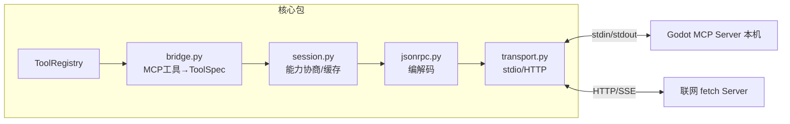

# M05 MCP（Model Context Protocol 客户端手写）

| 项 | 值 |
|---|---|
| 生产进度 | Sprint 3 · 里程碑 MI-1b「会用工具的 Agent」（紧随 M04） |
| 代码落点 | `backend/agent_godot/mcp/client/`（transport/jsonrpc/session/bridge） |
| 前置模块 | M04（桥接产物直接进 ToolRegistry） |
| 手写比例 | **100% 纯手写**（不用官方 SDK，协议本身只是 JSON-RPC——本项目最有底气的手写宣言） |
| 教程映射 | 📝笔记 MCP 章 · 📘 zero2Agent（MCP 篇）· MCP 官方规范 |

---

## 0. 本模块在项目中的位置

M04 的工具都是**进程内函数**；MCP 让工具变成**独立进程/远程服务器提供的服务**——Godot 集成（M06）、联网搜索、社区生态全部经此接入。写完本模块你获得：`mcp.yaml` 里加一段配置，Agent 的工具箱就多一个服务器的全部工具，**核心代码零改动**（M00"一切皆插件"的第一次完整兑现）。



---

## 1. 知识点详解

### 1.1 MCP 解决什么问题（M×N 困境）

**① 原理**

没有 MCP 的世界：M 个 AI 应用 × N 个数据源/工具 = M×N 份集成代码，每家一套私有协议。MCP（Anthropic，2024.11）把它变成 M+N：应用实现一次 **MCP 客户端**，数据源实现一次 **MCP 服务器**，中间走标准协议——"AI 界的 USB-C"。

三原语（服务器可暴露的三类能力）：

| 原语 | 给模型什么 | 控制方 | 本项目用例 |
|---|---|---|---|
| **tools** | 可调用函数（模型自主决定） | 模型 | Godot 场景操作、headless 运行 |
| **resources** | 可读数据（应用决定何时注入） | 客户端 | 项目文件树、场景清单 |
| **prompts** | 可复用提示模板（用户主动触发） | 用户 | /godot-debug 斜杠命令 |

**② 演进**：各家 Function Calling 私有协议（2023，工具绑定单应用）→ MCP 2024.11 发布 → OpenAI/Google/DeepSeek 2025 相继采纳 → 生态爆发（数万服务器）。对照理解：FC 是"模型↔应用"的接口标准化（竖切），MCP 是"应用↔工具生态"的标准化（横切），二者互补。

**③ 最小案例**：不写代码，先用官方 echo 服务器体会协议报文（后面全部手写实现）：

```yaml
# config/mcp.yaml 临时加一条
servers:
  everything:
    transport: stdio
    command: npx
    args: ["-y", "@modelcontextprotocol/server-everything"]
```

**④ 易错点**
- MCP tools 与 FC tools 在概念上同构但**字段名不同**（`inputSchema` vs `parameters`）——桥接要翻译
- 三原语的"控制方"是设计精髓：模型自主（tools）/程序注入（resources）/用户触发（prompts），混用会造成安全与体验问题
- 服务器挂了不应拖死 Agent：bridge 层要做服务器级熔断（复用 M02 CircuitBreaker）

### 1.2 JSON-RPC 2.0：MCP 的传输语法

**① 原理**

一切消息都是 JSON 对象，三种角色：

```jsonc
// 请求（客户端→服务器）
{"jsonrpc": "2.0", "id": 1, "method": "tools/call",
 "params": {"name": "list_scenes", "arguments": {}}}
// 响应（成功/失败二选一）
{"jsonrpc": "2.0", "id": 1, "result": {"content": [{"type": "text", "text": "..."}]}}
{"jsonrpc": "2.0", "id": 1, "error": {"code": -32601, "message": "Method not found"}}
// 通知（Notification，无 id，不期待响应）
{"jsonrpc": "2.0", "method": "notifications/initialized"}
// 服务器也可反向发请求（如采样请求 elicitation）——双向 RPC，不只是"问答"
```

id 匹配是异步关联的关键：并发发出 id=1,2,3，响应可能乱序回来，按 id 配对。错误码：-32700 解析错 / -32600 无效请求 / -32601 方法不存在 / -32602 参数无效 / -32603 内部错。

**② 演进**：REST（资源导向，AI 工具调用需要的是"方法调用"语义）→ gRPC（重、要 proto 编译）→ JSON-RPC 2.0（2009 年规范，零依赖、可读、双向——被 LSP（2016）证明适合"编辑器↔语言服务"这种本地长连接进程协作，MCP 直接继承这套衣钵）。**理解脉络：MCP = LSP 模式在 AI 工具领域的复刻**。

**③ 最小案例** `lab/m05/jsonrpc_round.py`

```python
@dataclass
class RPCRequest:  method: str; params: dict | None; id: int | str | None = None
@dataclass
class RPCResponse: id: int | str; result: Any = None; error: dict | None = None

def encode(req: RPCRequest) -> str:
    d = {"jsonrpc": "2.0", "method": req.method}
    if req.params is not None: d["params"] = req.params
    if req.id is not None: d["id"] = req.id        # 无 id = 通知
    return json.dumps(d, ensure_ascii=False)       # ★ MCP 要求 UTF-8 且不得含嵌入换行

def decode(raw: str) -> RPCRequest | RPCResponse:
    d = json.loads(raw)
    if "method" in d:  return RPCRequest(d["method"], d.get("params"), d.get("id"))
    return RPCResponse(d["id"], d.get("result"), d.get("error"))
```

**④ 易错点**
- 消息必须是**单行 JSON**（stdio 传输按 `\n` 分帧，嵌入换行直接破协议）——`json.dumps` 默认无换行，但 `indent=` 会害死你
- 通知没有 id 也没有响应——发出后不能"等"它，等了就永远阻塞
- id 可以是字符串或数字，但同一会话内不得重复；响应乱序时靠它配对（ asyncio 里配 pending dict）

### 1.3 传输层：stdio 与 Streamable HTTP

**① 原理**

两种官方传输（2025-03 规范把旧 HTTP+SSE 合并为 Streamable HTTP）：

**stdio**：客户端 `subprocess.Popen(command)` 起服务器进程，stdin 写请求、stdout 读响应、stderr 收日志。本地工具首选：零网络开销、天然复用本机环境（Godot 路径、项目目录）。

```python
class StdioTransport:
    async def start(self):
        self.proc = await asyncio.create_subprocess_exec(
            *self.argv, stdin=PIPE, stdout=PIPE, stderr=PIPE)
        self._reader = asyncio.create_task(self._pump_stdout())   # 后台泵
    async def send(self, line: str):
        self.proc.stdin.write((line + "\n").encode()); await self.proc.stdin.drain()
```

**Streamable HTTP**：POST 发请求到单一 endpoint `/mcp`，响应可普通 JSON 或 SSE 流；会话用 `Mcp-Session-Id` 头维持。服务器还能在 SSE 流上反向推送通知。

**② 演进**：stdio（LSP 验证过的本地模式）→ HTTP+SSE 双 endpoint（2024-11 规范，部署繁琐）→ Streamable HTTP 单 endpoint（2025-03，简化+支持无状态服务器）→ 我们两种都实现（本地 Godot 走 stdio、联网服务走 HTTP）。

**③ 最小案例**：stdout 泵的分帧（最容易写错的 30 行，直接给参考）

```python
async def _pump_stdout(self):
    while True:
        line = await self.proc.stdout.readline()      # ★ 按行分帧 = JSON-RPC 消息边界
        if not line:
            break                                     # 服务器进程退出
        msg = line.decode("utf-8", "replace").strip()
        if not msg:
            continue
        await self._on_message(decode(msg))           # 分发：响应配 pending / 请求上行
```

**④ 易错点**
- 必须持续排空 stdout/stderr：服务器日志写满管道缓冲区（~64KB）会**死锁**——stderr 单独起泵只打印不解析
- 服务器崩溃检测：`proc.returncode is not None` 时要把 pending 请求全部以错误终结（否则上游永远挂起）
- Windows 下 `npx` 要 `shell=True` 或用 `npx.cmd`——跨平台启动是 stdio 传输的著名深坑

### 1.4 会话生命周期与能力协商

**① 原理**

```text
1. 客户端 → initialize（携带自己的能力声明 + 协议版本）
2. 服务器 → result（携带它的能力：tools? resources? prompts? 版本）
3. 客户端 → notifications/initialized（通知，握手完成）
4. 正常调用：tools/list 发现工具 → tools/call 执行
   （列表结果带 cursor 分页；工具清单缓存 + tools/list_changed 通知失效）
5. 关闭：直接杀进程(stdio) / DELETE 会话(HTTP)
```

能力协商的意义：双方声明"我支持什么"，客户端按服务器实际能力启用功能——版本不匹配时优雅降级而不是报错。这是所有长生命周期协议（LSP/WebRTC/MCP）的共同设计。

**② 演进**：固定接口（版本强绑死）→ 能力协商（解耦演进）。initialize 里 `protocolVersion` 双方取共同最高版本——写客户端时必须处理"服务器版本更新/更旧"的分支。

**③ 最小案例**：会话状态机骨架

```python
class McpSession:
    def __init__(self, transport): 
        self._state = "new"; self._pending: dict[str, Future] = {}
        self.server_caps: dict = {}; self._tools_cache: list | None = None

    async def initialize(self) -> None:
        resp = await self.request("initialize", params={
            "protocolVersion": "2025-03-26",
            "capabilities": {"roots": {"listChanged": True}},   # 我方能力
            "clientInfo": {"name": "agent-godot", "version": "0.1.0"}})
        self.server_caps = resp["capabilities"]                  # 对方能力
        await self.notify("notifications/initialized")           # ★ 通知无响应
        self._state = "ready"

    async def list_tools(self, force=False) -> list[dict]:
        if self._tools_cache is None or force:
            self._tools_cache = (await self.request("tools/list", {}))["tools"]
        return self._tools_cache
```

**④ 易错点**
- 未 initialize 就调 tools/list → 服务器直接断连（协议规定握手前置）
- 工具缓存要订阅 `notifications/tools/list_changed` 失效重拉——服务器热加工具才可见
- 超时预算：每个 request 要挂 `asyncio.wait_for`，服务器无响应时 pending future 必须超时兑现，防止桥接层挂死

### 1.5 桥接：MCP 工具 → FC ToolSpec

**① 原理**：字段翻译表（M04 的注册表完全无感）：

| MCP tools/list 项 | FC ToolSpec / 本项目 |
|---|---|
| `name` | `mcp__{server}__{name}`（防跨服务器重名） |
| `description` | 同名字段 |
| `inputSchema` | `parameters`（同为 JSON Schema，直接清洗复用 M04） |
| tools/call 结果 `content[]` | 拼接 text 块 → `ToolResponse.summary` |

风险标注：MCP 不带 readonly/risk 元数据 → 桥接层按**服务器级默认策略**（mcp.yaml 里 `default_risk: medium`）+ 名称启发式（write/delete/post 开头 → high）。

**② 演进**：手动每工具写适配（回到 M×N）→ 声明式桥接（一份翻译表全量自动）——这就是协议标准化的红利兑现处。

**③ 最小案例**

```python
async def bridge_server(self, name: str, session: McpSession) -> None:
    for t in await session.list_tools():
        fc_name = f"mcp__{name}__{t['name']}"
        spec = clean_schema(t["inputSchema"])
        self.registry.register_dynamic(fc_name, spec, t["description"],
            readonly=_looks_readonly(t["name"]),
            runner=lambda args, s=session, n=t["name"]:
                _call_mcp(s, n, args))            # 闭包绑定会话
```

**④ 易错点**
- lambda 闭包绑定循环变量是 Python 经典坑（默认参数绑定解决，片段里已示范）
- tools/call 的 content 可能含 image 资源块——桥接时只透传 text，其他块降级为占位说明
- 服务器级熔断：某 MCP 服务器连续失败要整体摘除（tools 保留但调用秒失败并提示），避免每工具调用都等超时

---

## 2. 接口设计（完整签名）

```python
# mcp/client/jsonrpc.py
def encode(msg: RPCRequest | RPCNotification) -> str: ...
def decode(raw: str) -> RPCRequest | RPCResponse: ...

# mcp/client/transport.py
class Transport(ABC):
    async def start(self) -> None: ...
    async def send(self, line: str) -> None: ...
    def on_message(self, cb: Callable[[str], Awaitable]) -> None: ...
    async def close(self) -> None: ...

class StdioTransport(Transport):
    def __init__(self, command: str, args: list[str], env: dict | None): ...
class HttpTransport(Transport):
    def __init__(self, url: str, headers: dict | None): ...

# mcp/client/session.py
class McpSession:
    def __init__(self, transport: Transport, timeout: float = 30): ...
    async def initialize(self) -> ServerCapabilities: ...
    async def request(self, method: str, params: dict) -> Any: ...
    async def notify(self, method: str, params: dict | None = None) -> None: ...
    async def list_tools(self, force: bool = False) -> list[dict]: ...
    async def call_tool(self, name: str, args: dict) -> ToolResponse: ...
    async def close(self) -> None: ...

# mcp/client/bridge.py
class McpManager:
    """读 config/mcp.yaml，管理全部服务器会话的启停与桥接。"""
    def __init__(self, registry: ToolRegistry): ...
    async def start_all(self) -> None: ...
    async def stop_all(self) -> None: ...
    def server_status(self) -> dict[str, Literal["running", "dead", "disabled"]]: ...
```

## 3. 关键难点参考片段：pending 配对

```python
async def request(self, method, params):
    fut = asyncio.get_running_loop().create_future()
    mid = self._next_id()
    self._pending[mid] = fut                      # ★ id→future 注册
    await self.transport.send(encode(RPCRequest(method, params, mid)))
    try:
        return await asyncio.wait_for(fut, self.timeout)
    finally:
        self._pending.pop(mid, None)

async def _on_message(self, msg):
    if isinstance(msg, RPCResponse):
        if fut := self._pending.get(msg.id):      # 响应按 id 配对（可能乱序）
            fut.set_result(msg.result) if not msg.error else \
            fut.set_exception(McpRemoteError(msg.error))
        else:
            logger.warning("孤儿响应 id=%s", msg.id)   # 超时后迟到的响应
```

为什么难：乱序、超时、孤儿响应、服务器死亡时 pending 清算，四个时序问题叠在一个字典上。测试必须逐个注入模拟。

## 4. 手敲指引

| 步骤 | 文件 | 做什么 | 验证 |
|---|---|---|---|
| 1 | jsonrpc.py | 编解码 | 单测：请求/响应/通知三形态往返 |
| 2 | lab/m05/fake_server.py | 20 行 stdin-stdout 假服务器 | 手工 echo 通 |
| 3 | transport.py | StdioTransport + 双泵 | 与假服务器收发 |
| 4 | session.py | initialize 握手 | 假服务器回能力清单 |
| 5 | session.py | tools/list + call | 假服务器暴露 2 工具 |
| 6 | bridge.py | 命名空间桥接 | Registry 出现 mcp__fake__* |
| 7 | 接入真服务器 | server-everything | 真工具可被模型调用 |
| 8 | transport.py | HttpTransport | 调一个公共 HTTP MCP |

## 5. 测试与验收

```python
async def test_initialize_handshake_order():
    # 假服务器断言：第一条必须是 initialize，未收到 initialized 通知前 tools/list 应被拒

async def test_pending_cleared_on_server_death():
    session = ...; session.transport.proc.kill()
    with pytest.raises(McpTransportError):
        await session.call_tool("x", {})          # pending 全部错误兑现

def test_bridged_namespec_and_schema():
    specs = registry.filter(namespace="mcp__fake")
    assert all(s["function"]["name"].startswith("mcp__fake__") for s in specs)
```

**验收 Demo**：`config/mcp.yaml` 启用 everything 服务器 → `godot-agent ask "用 mcp 工具算一下 echo 'hello'"` → 模型自主选择 `mcp__everything__echo` 并返回结果；中途 kill 服务器进程，Agent 给出"服务器离线"提示而非挂死。

## 6. 踩坑记录（留白）

| 日期 | 坑 | 现象 | 根因 | 解法 | 关联知识点 |
|---|---|---|---|---|---|
|     |    |     |     |    |          |

## 7. 面试拷打

1. MCP 与 Function Calling 是竞争关系吗？各自标准化了哪一段？
2. 三原语 tools/resources/prompts 的控制方分别是谁？这个设计为什么重要？
3. JSON-RPC 的 Notification 有什么用？举 MCP 里两个通知的例子；
4. stdio 传输下，客户端和服务器怎么知道一条消息到哪里结束？
5. 为什么必须持续排空子进程的 stdout/stderr？不排会怎样？
6. 能力协商解决什么问题？initialize 握手的三步顺序能换吗？
7. 响应乱序到达怎么办？孤儿响应是什么、怎么产生？
8. MCP 工具桥接进 FC 注册表，名称为什么要加命名空间？
9. 服务器崩溃时，挂起的 tools/call 怎么处理才不会拖死 Agent？
10. 开放题：如果让你给 MCP 加"工具级权限声明"（服务器自报风险等级），协议和客户端各改哪里？

## 8. 教程映射与延伸

- 📝笔记 MCP 章（协议字段对照表）
- 必读：MCP 官方规范（2025-03-26 版）的 Transports 与 Lifecycle 两节
- 选读：LSP 规范的 initialize 握手（看 MCP 的血缘）
