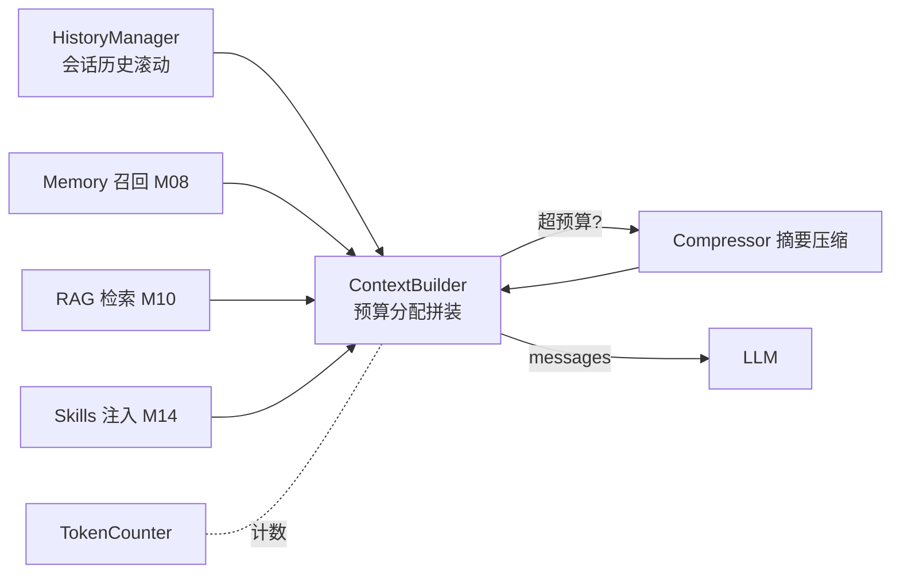

# M07 上下文工程（Context 四件套 + 压缩）

| 项 | 值 |
|---|---|
| 生产进度 | Sprint 5 · 里程碑 MI-2a「长会话 + 记忆」 |
| 代码落点 | `backend/agent_godot/context/`（5 个文件，见 §0.5） |
| 前置模块 | M03（Loop 每轮重建上下文的钩子位）· M01（token 概念） |
| 手写比例 | 100% 纯手写 |
| 教程映射 | 📗 hello-agents context/ 四件套（同名致敬）· 📝笔记 Context Engineering · 📘 zero2Agent 06 课 |

---

## 0. 本模块在项目中的位置

**大白话**：上下文工程就是**书桌管理**。模型的书桌（上下文窗口）就这么大，M03 埋的债在此偿还——循环每轮全量重发历史，20 轮后请求里塞满旧 Observation，就像干活从不收拾桌子：第 50 天的桌面上堆着前 49 天的每一张草稿纸，不但贵（token 成本爆炸），而且**真正要用的资料被垃圾淹没**（有效信息被挤出注意力）。本模块的任务：每轮开始前，把桌面整理成"此刻最该看的东西"——看完的归档进抽屉（摘要压缩），重要的钉在软木板（pin），最新的留在手边。

它决定的不是省多少钱，而是 **Agent 能不能做长任务**——50 轮任务没上下文工程必崩。

**交付后状态**：50 轮长会话稳定运行，任意时刻请求体积不超预算；旧观察被摘要压缩；每轮上下文构成可在 trace 里查看。



---

## 0.5 ★ 施工文件清单（开工前必看的一页表）

**本模块你一共要新建 5 个文件**（按依赖顺序）：

| # | 新建文件（完整路径） | 职责一句话 | 关键类/函数 | 预估行数 | 手敲步骤(§4) | 依赖 |
|---|---|---|---|---|---|---|
| 1 | `context/__init__.py` | 空包 | — | 1 | 步骤 0 | — |
| 2 | `context/token_counter.py` | 行李箱秤：估算+临界精算 | `TokenCounter.estimate/exact/calibrate` | 50 | 步骤 1 | M02 Message |
| 3 | `context/history.py` | 滚动窗口+保留配对+pin | `HistoryManager.rolling/pin/sweep` | 90 | 步骤 2 | token_counter |
| 4 | `context/truncator.py` | 工具结果分级截断 | `ObservationTruncator.truncate/summarize_struct` | 60 | 步骤 3 | M04 sandbox |
| 5 | `context/builder.py` | 分区预算+贪心降级拼装 | `ContextBuilder.build/last_layout`、`Partition` | 100 | 步骤 4 | 全部 |
| 6 | `context/compressor.py` | 三档摘要压缩 | `Compressor.summarize/template_digest` | 80 | 步骤 5 | M02 LLM |

**依赖链**：`token_counter（谁都要数）→ history/truncator（两个治理手段）→ compressor（终极手段）→ builder（总装，接入 M03 Loop）`。

**完成后你拥有**：50 轮混合任务全程无超窗报错；`--trace` 可查每轮各分区 token 占比；压缩纪要可见；pin 的用户约定 50 轮后仍被遵守。

---

## 1. 知识点详解（每节五段：定义 → 大白话 → 举例 → 演进 → 易错点）

### 1.1 TokenCounter：精确与估算的双模设计

**① 严格定义**：上下文工程一切决策（截断/压缩/预算分配）依赖 token 计数。精确计数需调服务端 tokenizer（慢、要网络）或本地 tiktoken 词表（每模型一份）。生产折中：**估算常行、精确兜底**——估算用启发式（中文 ≈0.6 token/字、英文 ≈0.25 token/字符、每消息 +4 结构开销）；估算值进入预算临界区 ±500 时切 tiktoken 精算；每次真实响应的 `usage.input_tokens` 回填校准估算系数（自校准回归）。

**② 大白话**：**行李箱称重**。收拾行李时你不会每放一件东西就上秤（太慢），而是目测"大概还有空间"；只在目测接近 23kg 限重线时才认真上秤——目测是估算（快、够用），上秤是精算（慢、只在临界时必要）。每次托运后机场秤显示的实际重量（usage 回执）拿来修正你的目测手感（校准系数）。

**③ 举例**：估算器实现（代数字）——一条消息 `content="玩家击败了敌人"`（8 个汉字）：

```python
total = 4                                   # 结构开销（角色/分隔符）
cjk = 8                                     # 8 个汉字
total += int(8 * 0.6 + 0 / 4)               # ≈ 4.8 → 4
# 估算 = 8~9 tokens；tiktoken 精算可能 8（误差 <10%，校准后更小）
```

```python
class TokenCounter:
    def estimate(self, messages: list[Message]) -> int:
        total = 0
        for m in messages:
            total += 4                              # 每消息结构开销
            c = m.content or ""
            cjk = sum('\u4e00' <= ch <= '\u9fff' for ch in c)
            total += int(cjk * 0.6 + (len(c) - cjk) / 4)
            if m.tool_calls:                        # 工具调用的 arguments 也占
                total += sum(len(tc.arguments) // 4 + 8 for tc in m.tool_calls)
        return total + 2

    def exact(self, messages, model) -> int:        # 临界精算
        enc = tiktoken.get_encoding("o200k_base")
        return sum(len(enc.encode(m.content or "")) + 4 for m in messages)
```

**④ 演进**：按字符数（错得离谱——中英 token 密度差 3 倍）→ 固定比例估算 → tiktoken 本地精确（每模型一份词表，跨模型麻烦）→ 双模+自校准（本项目）。这条链是"工程精度 vs 工程成本"权衡的经典教材。

**⑤ 易错点**：
- **工具声明（tools 参数）本身占输入 token**——一个 MCP 服务器桥接进来可能吃 2~4k，预算必须给 tools 留额度
- 不同模型 tokenizer 不同（Qwen ≠ DeepSeek），跨模型切换时计数要跟着切
- usage 的 input_tokens 含缓存命中与未命中两段，对账时别混

### 1.2 上下文预算分配（Budget Allocation）

**① 严格定义**：把窗口按分区配额切分，各分区带优先级（0=不可压，越大越先压）。本项目 128k 窗口配额：保留输出 8k / 工具声明 ~5k（动态测量）/ 系统提示+Skills 4k / 记忆召回 2k（M08）/ RAG 注入 4k（M10）/ 历史消息剩余 60~70% / **最新观察保底 16k**（最近 2~3 轮完整 Observation）。原则：**越近越完整、越远越摘要**；"过程数据"（工具结果）优先压缩，用户指令与模型关键决策最后压。

**② 大白话**：**月薪分配**。房租水电（system+工具声明）是固定支出不能动；本周要花的现金（最新观察）必须留足——这是模型此刻干活的"工作记忆"；聚餐娱乐（旧历史）超支了先砍；实在不够就把过去几个月的消费汇总成一张账单摘要（压缩）。砍钱顺序 = 降级链：先压最不痛的。

**③ 举例**：预算求解器（贪心+降级链）完整参考：

```python
async def build(self, session) -> list[Message]:
    budget = self.window - RESERVED_OUTPUT - await self.tools_tokens()
    parts = [Part("system", self.system_prompt(), priority=0),          # 不可压
             Part("memory", await self.memory_block(), priority=1),     # 可丢
             Part("history", session.messages, priority=2),             # 可压可丢
             Part("latest_obs", session.recent_obs(n=3), priority=0)]   # 不可压
    used = sum(self.count(p) for p in parts)
    while used > budget:                               # 降级链：压 history → 丢 memory
        for p in sorted(parts, key=lambda x: x.priority, reverse=True):
            if p.priority == 0: continue
            p.downgrade(self.compressor)               # 压缩/丢弃/摘要，级别递进
            used = sum(self.count(x) for x in parts)
            break
    return self.assemble(parts)                        # system→memory→history→最新
```

**④ 演进**：无分配（塞满为止）→ 简单滑窗（丢最旧）→ 分区配额+优先级压缩（DSH/Cursor 级）。学界支撑：**Lost in the Middle**（Liu et al. 2023）——长上下文中间部分召回率显著低于首尾（U 型曲线）。所以重要信息要么放开头（system），要么放结尾（最新轮），**中间注定是低价值区**——这正是"越远越摘要"的实证依据。

**⑤ 易错点**：
- 降级链有下限：history 全摘要掉还超预算 → 硬失败提示开新会话，不能静默丢 system
- 每轮分区内容会变（RAG 只在检索轮注入），预算**每轮重算**不是会话级恒定
- 压缩本身花钱（调 LLM 摘要）——触发要有滞后带（超 85% 才压到 70%），否则阈值附近反复压缩抖动

### 1.3 HistoryManager：滚动窗口与"保留配对"

**① 严格定义**：最朴素的上下文管理是保留最近 N 条消息，但协议铁律：**assistant(tool_calls) 与 tool 消息必须成对**——滑窗从中间切开（切在 calls 与 result 之间），下一轮请求直接 400。"保留配对"算法：从最新往回收集，遇 assistant 带 tool_calls 时必须连同它引用的所有 tool_call_id 的 tool 消息一起收进来。

**② 大白话**：**撕票据要连存根**。发票（tool_calls）和回执（tool 结果）是一对——只留发票不留回执（或反之），会计（API）直接打回。所以收拾票据时不能"从中间一刀切"，得整对整对地保留。

**③ 举例**：保留配对滑窗（可直接参考）：

```python
def rolling(self, messages: list[Message], max_tokens: int) -> list[Message]:
    kept: list[Message] = []
    used = 0
    pending_calls: set[str] = set()                    # 尚未配对的 call_id
    for m in reversed(messages):                       # 从新到旧
        cost = self.count_one(m)
        if used + cost > max_tokens and not pending_calls:
            break
        if m.role == "tool":
            pending_calls.discard(m.tool_call_id)
            kept.append(m); used += cost
        elif m.role == "assistant" and m.tool_calls:
            pending_calls.update(tc.id for tc in m.tool_calls)
            kept.append(m); used += cost               # 配对优先于预算（临时超）
        else:
            kept.append(m); used += cost
    return list(reversed(kept))                        # 反转后清洗头部孤悬 tool
```

**④ 演进**：定长队列（配对破坏→400）→ 保留配对滑窗（hello-agents 同款）→ 语义感知保留（关键决策打 pin 标，永不滚出——用户说"记住这个约定"或重大决策时打标）。

**⑤ 易错点**：
- 配对完整性 > 预算上限：正确做法是超了就触发更早轮次的压缩，配对只是收集约束
- 首条消息是 tool 时有些 API 直接拒收，反转后再清洗一遍头部
- "最近 N 轮"按 token 不按条数——一条带 50KB 日志的 Observation 顶五十条对话

### 1.4 ObservationTruncator：工具结果的分级截断

**① 严格定义**：工具结果是上下文最肥杀手（headless 日志 100KB、目录列表 2 万行）。三级策略：**L1 展示截断**（进上下文前截头保尾，2k 上限，M04 已做）；**L2 结构化摘要**（结果转紧凑表格：目录列表→"共 214 文件，gd 32 个，前 20: …"）；**L3 事后压缩**（压缩 sweep 时旧 Observation 一律替换为 `<obs: read_file a.gd, 38 行, hash 3f2a>` 一行占位）。

**② 大白话**：**快递打包三档**。L1=纸箱装不下就裁掉一部分（保头保尾——错误信息常在尾部）；L2=把散装零件装成收纳盒（结构化，紧凑但不丢骨架）；L3=旧快递直接扔掉箱子只留发货单（"我读过这个文件"这个事实留下，原文丢掉——反正模型需要时可以重新调工具再取）。

**③ 举例**：L3 的洞察代数字——第 3 轮读的 38 行文件（约 1.5k token），第 40 轮时的价值：只需知道"读过、hash 是 3f2a"（12 token）——**信息价值随轮次衰减 100 倍**，但被 pin 的关键结果（报错信息、用户确认过的 Diff）不降级：

```python
def shrink_observation(self, m: Message) -> Message:
    meta = json.loads(m.content)["meta"] if m.content.startswith("{") else {}
    label = meta.get("tool", "tool")
    return replace(m, content=f'<observation tool="{label}" summarized=true/>')
```

**④ 演进**：不截（撑爆）→ 定长截断 → 结构化摘要 → 按新鲜度衰减的占位替换——与人类记忆"细节遗忘、梗概留存"同构。

**⑤ 易错点**：
- 模型"回看"旧观察时只能重调工具——**特性不是 bug**（用计算换窗口），但 trace 要能看出是替换导致的重调
- 截断要保结构边界：JSON 截成两半比超长更糟（模型会尝试续写残缺 JSON）

### 1.5 Compressor：摘要压缩三档

**① 严格定义**：把旧对话段压缩成摘要消息注入（不是删光）。三档：**A 档（粗）删除法**——工具轮整体占位（1.4 的 L3），保留用户指令与 assistant 结论文本；**B 档（中）模板摘要**——规则抽取每轮"用户意图+最终结果"两行，不调模型零成本；**C 档（细）LLM 摘要**——调廉价模型生成结构化纪要（目标/决策/已改/未决/偏好五段）。压缩后注入一条 system："以下为此前对话的摘要，完整原文已省略"。

**② 大白话**：**旅行打包三策略**。A 档=把不重要的东西直接不带了；B 档=自己列一张行李清单（免费但粗略）；C 档=请专业整理师打包（花钱但压缩率高且保真）。什么时候用哪档：平时 B 档顺手做，长任务定期 C 档大整理，存储紧张时 A 档果断扔。

**③ 举例**：C 档摘要提示（本模块最值得打磨的一段 prompt）：

```python
COMPRESS_PROMPT = """把以下 Agent 会话片段压缩为结构化纪要，供后续继续执行任务时参考。
要求：
- 保留：任务目标、关键决策及理由、已修改文件清单（含 hash）、未完成事项、用户明确偏好
- 丢弃：工具调用过程细节、中间试探、失败尝试（除非失败原因影响后续）
- 输出格式：目标/决策/已改/未决/偏好 五段，总长 ≤ {budget} tokens
片段：
{transcript}"""

# 产出示例：
# <summary turn=1..12> 目标:加敌人 | 决策:用 CharacterBody2D
#   | 已改: enemy.gd(a3f2), player.tscn(9c1d) | 未决: 音效 | 偏好: tabs 缩进 </summary>
```

**④ 演进**：滑窗丢弃（信息突然消失，模型行为跳变）→ 纯滑窗+占位 → 摘要压缩（Claude Code 的 compact、DSH 的 auto-compact 同思想）。学术分支：LLMLingua 等 token 级提示压缩（选读）。C 档同时是 M09 断线恢复与 M08 记忆抽取的共用底座。

**⑤ 易错点**：
- **摘要里的文件清单必须带 hash**——恢复执行时乐观锁要对版本，摘要丢 hash = 恢复后必冲突
- 压缩时机选"任务边界"（工具配对完成后）而非任意点——切在配对中间又要修补
- 压缩结果自身也要过 TokenCounter——摘要超预算是乌龙但真实发生过

---

## 2. 接口设计（完整签名 = 你要手写的契约）

```python
# context/token_counter.py
class TokenCounter:
    def estimate(self, messages: list[Message]) -> int: ...      # 估算常行
    def exact(self, messages: list[Message], model: str) -> int: ...  # 临界精算
    def calibrate(self, reported_input_tokens: int, estimated: int) -> None: ...

# context/history.py
@dataclass
class HistoryConfig:
    max_history_tokens: int = 64_000
    keep_recent_turns: int = 3
    pinned_max: int = 32

class HistoryManager:
    def rolling(self, messages: list[Message]) -> list[Message]: ...     # 保留配对
    def pin(self, index: int | Message) -> None: ...                    # 关键消息钉住
    def sweep_replace_observations(self, messages) -> list[Message]: ... # A 档

# context/truncator.py
class ObservationTruncator:
    def truncate(self, content: str, budget: int = 2000) -> str: ...    # L1
    def summarize_struct(self, tool: str, raw: str) -> str: ...         # L2

# context/builder.py
@dataclass
class Partition: name: str; content: Any; priority: int  # 0 不可压
class ContextBuilder:
    def __init__(self, counter: TokenCounter, compressor: "Compressor",
                 config: BudgetConfig): ...
    async def build(self, session: Session) -> list[Message]: ...       # §1.2 算法
    def last_layout(self) -> dict[str, int]: ...   # 调试：上轮各分区实际 token

# context/compressor.py
class Compressor:
    async def summarize(self, messages: list[Message], budget: int) -> Message: ...  # C 档
    def template_digest(self, messages: list[Message]) -> Message: ...               # B 档
```

---

## 3. 关键难点参考片段：分区降级的联动

预算不足时"压 history"要同时满足配对完整与 pin 保留，降级不是独立的：

```python
async def _downgrade_history(self, part: Partition, deficit: int):
    msgs = part.content
    old = msgs[:-self.cfg.keep_recent_turns]
    keep = msgs[-self.cfg.keep_recent_turns:]
    summary = await self.compressor.summarize(old, budget=len(old) // 4)
    # 摘要边界恰好切在 calls/tool 之间 → 重组后必须重跑配对检查
    merged = [summary] + [m for m in keep if not self._is_orphan(m, summary)]
    part.content = merged
```

为什么难：压缩、配对、pin、预算**四个约束在同一处交汇**——单测必须覆盖"摘要后首条是 tool 消息"的修补场景。

---

## 4. 手敲指引（函数级伪代码）

### 步骤 1：`context/token_counter.py`
| 函数 | 作用（伪代码） |
|---|---|
| `estimate` | `逐消息累加：+4 结构开销 + 中文数×0.6 + 非中文数/4 + tool_calls 的 arguments//4+8`（§1.1 代码） |
| `exact` | `临界时 tiktoken 逐条 encode 求和`（缓存 encoder 实例——重复 get_encoding 很慢） |
| `calibrate` | `每次真实 usage 回来：误差率 = (reported-estimated)/reported → 若 >10% 调整中文系数 ±0.05（滑动平均防过拟合）` |
**验证**：真 API 对账：发 10 条消息记录 usage.input_tokens vs estimate，误差 <10%。

### 步骤 2：`context/history.py`
| 函数 | 作用（伪代码） |
|---|---|
| `rolling` | §1.3 ③ 代码：`reversed 遍历 + pending_calls 集合配对 + 超预算且无配对牵挂时 break + 反转后清洗头部孤悬 tool` |
| `pin` | `消息打标记进 pinned 集合（上限 32 条，LRU 淘汰）；rolling/compression 遇 pinned 跳过` |
| `sweep_replace_observations` | `遍历消息：role=tool 且非 pinned 且轮次早于 N → shrink 成一行占位` |
**验证**：构造切在配对中间的 30 条序列 → rolled 后 calls/ids 集合相等（无孤悬）。

### 步骤 3：`context/truncator.py`
| 函数 | 作用（伪代码） |
|---|---|
| `truncate` | `复用 M04 sandbox.truncate（头 1500 尾 300 + 中间省略标记）` |
| `summarize_struct` | `按工具名分支：list 类→计数+前 N 项摘要；日志类→错误行提取+统计；JSON 类→顶层键骨架` |
**验证**：100KB 目录列表 → 2k 内且含"共 N 文件"结构摘要。

### 步骤 4：`context/builder.py`
| 函数 | 作用（伪代码） |
|---|---|
| `build` | §1.2 ③ 代码：`算预算（窗口-输出保留-tools 实测）→ 组装四分区（带优先级）→ while 超预算：取最高可压优先级分区 downgrade → assemble 按 system→memory→history→最新 拼装` |
| `last_layout` | `返回 dict[分区名, token 数]（trace 用）` |
**验证**：造 50 轮会话（含 30k 肥 Observation），build 后 exact() ≤ 窗口-保留，layout 各区不超配额。

### 步骤 5：`context/compressor.py` + 接入 M03
| 函数 | 作用（伪代码） |
|---|---|
| `template_digest` | `B 档零成本：每轮抽 user 消息首行 + assistant 纯文本尾行，拼两行式纪要` |
| `summarize` | `C 档：COMPRESS_PROMPT 填入 transcript → 调 get_llm（廉价档路由）→ 返回 system 摘要 Message` |
| 接入 | `M03 loop.py 的 context_builder 参数从"简单拼接"换成 ContextBuilder 实例` |
**验证**：50 轮任务全程无超窗报错；`--trace` 看到压缩纪要与各区占比。

---

## 5. 测试与验收

```python
def test_rolling_keeps_tool_pairing():
    msgs = make_messages_with_calls(n=30)
    rolled = hm.rolling(msgs)
    ids_out = {tc.id for m in rolled if m.tool_calls for tc in m.tool_calls}
    ids_in = {m.tool_call_id for m in rolled if m.role == "tool"}
    assert ids_out == ids_in                       # 无孤悬

async def test_builder_never_exceeds_window():
    session = make_session(turns=50, fat_obs=30_000)
    messages = await builder.build(session)
    assert counter.exact(messages, "deepseek-chat") <= WINDOW - RESERVED

def test_pinned_survives_compression():
    # pin 的"用户约定"消息在 C 档压缩后仍原文存在

def test_calibration_converges():
    # 注入固定偏差的 usage 回执 20 次 → 估算系数被校准，误差下降
```

**验收 Demo**：`godot-agent` 里连续 50 轮混合任务（读大文件/列目录/改代码），`--trace` 查看：第 50 轮请求 < 预算；压缩纪要出现在上下文里；模型仍记得第 2 轮的用户约定（pin 生效）。

---

## 6. 踩坑记录（留白自填）

| 日期 | 坑 | 现象 | 根因 | 解法 | 关联知识点 |
|---|---|---|---|---|---|
|     |    |     |     |    |          |

---

## 7. 面试拷打（附详细参考答案）

**1. Lost in the Middle 是什么现象？对上下文分区策略有什么直接指导？**
答：Liu et al. 2023 发现：把关键信息放在长上下文的**中间位置**时，模型召回率显著低于放开头或结尾——呈 U 型曲线（首尾高、中间低）。机理与注意力分布和位置编码有关。直接指导：①重要信息只放开头（system 提示）或结尾（最新轮消息）；②中间区间是"低价值区"——该放可牺牲的过程数据（旧 Observation）；③"越近越完整、越远越摘要"的分区策略正是把低价值区主动压缩，让有效信息密度在首尾集中。反例：把 RAG 检索结果放中间会被显著低估。

**2. 为什么要保留 tool_calls/tool 配对？破坏了会怎样？**
答：Chat Completions 协议规定：assistant 消息里的每个 tool_call（带 id）必须由后续的 tool 消息（带相同 tool_call_id）应答——这是一张"请求-应答"对账单。破坏后果：API 校验失败直接 400（多数厂商严格校验）；部分兼容端点容忍但模型行为异常（它看到一个"没人还的欠条"，会试图重新调用或困惑）。滑窗从中间切是高发场景——所以收集算法必须以配对为单位（pending_calls 集合跟踪未闭环的 id）。

**3. token 估算和精算怎么配合？误差怎么持续收敛？**
答：三层配合：①估算常行——启发式计数（中文 0.6/字英文 0.25/字符+结构开销），O(len) 零成本，误差 ~15%；②临界精算——估算值落入 [预算-500, 预算+500] 区间时切 tiktoken 精确计数，避免"估算说没事、实际爆窗口"；③自校准——每次真实响应的 usage.input_tokens（电表读数）与估算值比对，误差率超 10% 时滑动调整中文系数。收敛机理：误差主要来自文本语言构成的系统性偏差，回归校准恰好治这个。

**4. 画出你的预算分区图；为什么"最新观察"不可压而"历史"最先压？**
答：128k = 输出保留 8k + 工具声明 5k + system+Skills 4k + 记忆 2k + RAG 4k + 历史 ~80k（其中最新观察保底 16k）。最新观察不可压：它是模型此刻的**工作记忆**——当前正在处理的文件内容、刚发生的报错，压掉它等于让人边干活血失忆，下一步推理直接瘫痪（Lost in the Middle 也证明结尾信息召回最高，更该保留完整）。历史最先压：时间距离越远的信息对当前决策影响越小（信息价值随轮次衰减），且压缩后有记忆系统（M08）兜底可召回。

**5. 压缩触发为什么要滞后带？阈值抖动是什么问题？**
答：滞后带=触发阈值 85%、压缩目标 70%（压完留 15% 缓冲）。没有滞后带：请求 token 在 80% 附近波动时，每轮"刚超就压、压完又涨"，反复触发压缩——每次压缩是一次 LLM 调用（花钱+延迟几百毫秒），且上下文内容在"有原文/是摘要"间来回切换，模型行为抖动。这与温控系统的滞回比较器（hysteresis）同原理：控制行为有成本时，开关阈值必须分离。

**6. 三档压缩各自成本与保真度？什么场景用哪档？**
答：A 档删除占位：零成本、低保真（只留"发生过"）——存储极度紧张/明显无价值的工具轮；B 档模板摘要：零 LLM 成本、中保真（意图+结果两行）——日常滚动的轻量维护；C 档 LLM 摘要：一次廉价模型调用、高保真（五段结构化纪要）——长任务定期大整理、断线恢复前的快照、M08 记忆抽取的输入。实践组合：B 档高频做（每轮 sweep）、C 档低频做（阈值触发/任务边界）、A 档兜底做（C 档之后仍超）。

**7. 摘要里为什么要保留文件 hash？**
答：M04 乐观锁的版本链条：摘要若只写"改过 enemy.gd"不带 hash，恢复会话后模型基于摘要去 write_file——它手里的 expect_hash 无从得知（原文被压缩掉了），要么瞎填（必然 CONFLICT），要么被迫重读。带上 hash（`enemy.gd(a3f2)`）则两种情况：文件没被动过 → hash 匹配直接写；被动过 → 正确报冲突触发重读。一句话：**hash 是压缩后的会话与文件系统现实之间仅存的版本锚点**。

**8. 旧 Observation 被占位替换后模型重调工具，这是缺陷还是设计？**
答：设计（trade-off 明确的正向决策）。逻辑：旧原文的即时价值已趋零（信息衰减），保留它的成本是持续的窗口占用；替换后模型需要时重调工具，成本是一次工具执行+几 k token。期望上：重调是低频事件（多数旧观察再也不被引用），窗口节省是每轮都发生——期望收益显著为正。配套：trace 标记"重调源于占位替换"（M21 可观测），若发现某工具高频被重调，针对性延长它的保留窗口（策略可配置）——数据驱动的策略调优。

**9. 工具声明为什么占预算？MCP 服务器很多时怎么治理？**
答：tools 参数里的每个 FC 声明（name+description+JSON Schema）都会随每次请求完整发送并计入 input_tokens——实测一个中型 MCP 服务器 2~4k。治理四连：①按模式裁剪（M13：ask 模式只挂只读工具）；②子代理白名单（M15：每个子代理 3~5 个工具）；③动态测量（token_counter 对 tools 参数实数，预算扣减真实值而非估算）；④工具分组+按需挂载（M14 Skills 按任务注入相关工具集）。极端情况（工具实在多）：tool retrieval——把工具描述建索引按任务检索 top-k 再挂载。

**10. 开放题：128k 窗口时代还需要上下文工程吗？**
答：需要，四个角度：①**成本**：input token 按量计费，50 轮任务每轮全量重发，累计成本是 O(N²) 增长——窗口越大爆炸越快；②**延迟**：prefill 时间与输入长度近似线性，100k 的 prefill 首字延迟数秒——交互体验不可接受；③**中间衰减**：Lost in the Middle 在长窗口下更严重，塞得越满中间信息利用率越低——"装得下"≠"看得见"；④**长任务结构**：真正的工作记忆只有最近几轮，历史的价值在"梗概"而非"原文"——这是任务本质决定的，与窗口大小无关。结论：窗口变大改变的是压缩的紧迫度，不改变"给模型此刻最该看的东西"这一工程本质。

---

## 8. 教程映射与延伸

- 📗 hello-agents `context/`（history/token_counter/truncator/builder 四件套直接对照）
- 📘 zero2Agent 06 课（context & memory）
- 必读：Lost in the Middle（Liu et al. 2023）
- 选读：LLMLingua（token 级提示压缩）；Claude Code compact 机制博客
