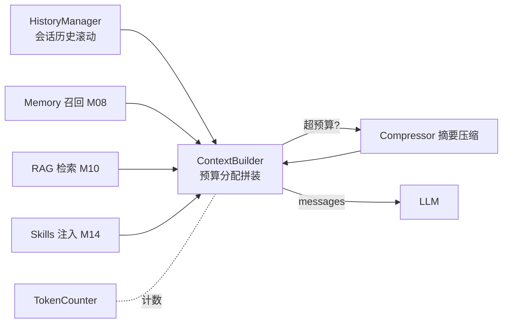

# M07 上下文工程（Context 四件套 + 压缩）

| 项 | 值 |
|---|---|
| 生产进度 | Sprint 5 · 里程碑 MI-2a「长会话 + 记忆」 |
| 代码落点 | `backend/agent_godot/context/`（token_counter/truncator/history/builder/compressor） |
| 前置模块 | M03（Loop 每轮重建上下文的钩子位）· M01（token 概念） |
| 手写比例 | 100% 纯手写 |
| 教程映射 | 📗 hello-agents context/ 四件套（同名致敬）· 📝笔记 Context Engineering · 📘 zero2Agent 06 课 |

---

## 0. 本模块在项目中的位置

M03 埋的问题在此偿还：循环每轮全量重发历史，20 轮后请求里塞满旧 Observation，token 成本爆炸、有效窗口被垃圾挤占。上下文工程 = **在有限窗口里给模型"此刻最该看的东西"**——它决定的不是省多少钱，而是 Agent 能不能做长任务（50 轮任务没上下文工程必崩）。

**交付后状态**：50 轮长会话稳定运行，任意时刻请求体积不超预算；旧观察被摘要压缩；每轮上下文构成可在 trace 里查看。



---

## 1. 知识点详解

### 1.1 TokenCounter：精确与估算的双模设计

**① 原理**

上下文工程的一切决策（截断/压缩/预算分配）都依赖计数，但精确计数只有两条路：调服务端 tokenizer 接口（慢、要网络）或本地加载 tiktoken 类词表（每模型一份）。生产折中：**估算常行、精确兜底**——

```text
估算：中文 ≈ 0.6 token/字，英文 ≈ 0.25 token/词（1.3 token/word 换算），结构开销每消息 +4
精确：预算临界点（估算值进入 [预算-500, 预算+500] 区间）时切 tiktoken 精算，避免"估算说没事、实际爆窗口"
对账：每次真实响应的 usage.input_tokens 记录下来，持续校准估算系数（自校准回归）
```

**② 演进**：按字符数（错得离谱）→ 固定比例估算 → tiktoken 本地精确 → 双模+自校准（本项目）。这个演化链本身就是"工程精度 vs 工程成本"权衡的经典教材。

**③ 最小案例**

```python
class TokenCounter:
    def estimate(self, messages: list[Message]) -> int:
        total = 0
        for m in messages:
            total += 4                                  # 每消息结构开销（角色/分隔符）
            c = m.content or ""
            cjk = sum('\u4e00' <= ch <= '\u9fff' for ch in c)
            total += int(cjk * 0.6 + (len(c) - cjk) / 4)  # 中文 0.6/字，英文 4 字符/token
            if m.tool_calls:
                total += sum(len(tc.arguments) // 4 + 8 for tc in m.tool_calls)
        return total + 2

    def exact(self, messages, model) -> int:            # 临界精算
        enc = tiktoken.get_encoding("o200k_base")
        return sum(len(enc.encode(m.content or "")) + 4 for m in messages)
```

**④ 易错点**
- 工具声明（tools 参数）本身也占输入 token——一个 MCP 服务器桥接进来可能就吃掉 2~4k，预算分配必须给 tools 留额度
- 不同模型 tokenizer 不同（Qwen ≠ DeepSeek），跨模型会话切换会话时计数要跟着切
- usage 的 input_tokens 含"缓存命中"与"未命中"两段（prompt_cache_hit_tokens），对账时别混

### 1.2 上下文预算分配（Budget Allocation）

**① 原理**

一个 128k 窗口的请求，各分区怎么分？本项目配额（`settings.yaml` 可调）：

```text
总窗口 128k
├─ 保留输出        8k    （max_tokens，输出不吃预算但要占窗口）
├─ 工具声明        ~5k   （活跃工具集的 FC schema，动态测量）
├─ 系统提示+Skills 4k    （身份/规范/技能文档）
├─ 记忆召回        2k    （M08：画像+相关情景记忆）
├─ RAG 注入        4k    （M10：检索片段，带引用编号）
├─ 历史消息       剩余的 60%~70%
└─ 最新观察       保底 16k（最近 2~3 轮的完整 Observation——模型的"工作记忆"不能压）
```

原则一句话：**越近越完整、越远越摘要**；工具结果这类"过程数据"优先压缩，用户指令与模型关键决策（assistant 的 content）最后压。

**② 演进**：无分配（塞满为止）→ 简单滑窗（丢最旧）→ 分区配额+优先级压缩（DSH/Cursor 级）。学界支撑：**Lost in the Middle**（Liu et al. 2023）——长上下文中间部分召回率显著低于首尾（U 型曲线）。所以重要信息要么放开头（system），要么放结尾（最新轮），中间注定是低价值区。

**③ 最小案例**：预算求解器（贪心+降级链）

```python
async def build(self, session) -> list[Message]:
    budget = self.window - RESERVED_OUTPUT - await self.tools_tokens()
    parts = [Part("system", self.system_prompt(), priority=0),          # 不可压
             Part("memory", await self.memory_block(), priority=1),     # 可丢
             Part("history", session.messages, priority=2),             # 可压可丢
             Part("latest_obs", session.recent_obs(n=3), priority=0)]   # 不可压
    used = sum(self.count(p) for p in parts)
    while used > budget:                               # 降级链：压 history → 丢 memory → 摘要更狠
        for p in sorted(parts, key=lambda x: x.priority, reverse=True):
            if p.priority == 0: continue
            p.downgrade(self.compressor)               # 压缩/丢弃/摘要，级别递进
            used = sum(self.count(x) for x in parts)
            break
    return self.assemble(parts)                        # system→memory→history→最新
```

**④ 易错点**
- 降级链要有下限：history 全摘要掉也超预算时，必须硬失败并提示用户开新会话，不能静默丢 system
- 每轮重建时分区内容会变（RAG 只在检索轮注入），预算是**每轮重算**不是会话级恒定
- 压缩本身也花钱（调 LLM 摘要）——压缩触发要有滞后带（如超 85% 才压到 70%），否则在阈值附近反复压缩抖动

### 1.3 HistoryManager：滚动窗口与"保留配对"

**① 原理**

最朴素的上下文管理：保留最近 N 条消息。难点在一个协议细节：**assistant(tool_calls) 与 tool 消息必须成对**。滚窗从中间切开（切在 calls 与 result 之间），下一轮请求直接 400——"保留配对"算法：

```text
从最新往回收集，遇 assistant 带 tool_calls 的消息时，
必须连同它前面那条（若配对跨界则扩展窗口）把它"引用的所有 tool_call_id 的 tool 消息"一起收进来
```

**② 演进**：定长队列（配对破坏）→ 保留配对滑窗（hello-agents 同款）→ 语义感知保留（关键决策标记 pin，永不滚出）。pin 机制：用户说"记住这个约定"或模型做出重大决策时，该消息打标，压缩时单条保留原文。

**③ 最小案例**

```python
def rolling(self, messages: list[Message], max_tokens: int) -> list[Message]:
    kept: list[Message] = []
    used = 0
    pending_calls: set[str] = set()                    # 尚未配对的 call_id
    for m in reversed(messages):                       # 从新到旧
        cost = self.count_one(m)
        if used + cost > max_tokens and not pending_calls:
            break
        if m.role == "tool":
            pending_calls.discard(m.tool_call_id)
            kept.append(m); used += cost
        elif m.role == "assistant" and m.tool_calls:
            pending_calls.update(tc.id for tc in m.tool_calls)
            kept.append(m); used += cost               # 可能临时超预算——配对优先于预算
        else:
            kept.append(m); used += cost
    # 兜底：反转后若首条是 tool（孤悬结果），再丢掉它
    return list(reversed(kept))
```

**④ 易错点**
- 配对完整性 > 预算上限：宁可这一轮超一点（多数 API 容忍少量超发？不——**正确做法是超了就触发更早轮次的压缩**，配对只是收集约束）
- 首条消息是 tool 时有些 API 直接拒收，反转后要再清洗一遍头部的孤悬 tool
- "最近 N 轮"按 token 不按条数——一条带 50KB 日志的 Observation 顶五十条对话

### 1.4 ObservationTruncator：工具结果的分级截断

**① 原理**

工具结果是最肥的上下文杀手（headless 日志 100KB、目录列表 2 万行）。三级策略：

```text
L1 展示截断：进上下文前截头保尾（M04 sandbox 已做，2k 上限）
L2 结构化摘要：结果转紧凑表格（目录列表→"共 214 文件，gd 32 个，前 20: …"）
L3 事后压缩：压缩轮 sweep 时，旧 Observation 一律替换为 "<obs: read_file a.gd, 38 行, hash 3f2a>" 一行占位
```

L3 的洞察：**旧 Observation 的"信息价值"随轮次衰减**——模型第 3 轮读的文件，第 40 轮时只需要知道"我读过它"，不需要原文。但被 pin 的关键结果（报错信息、用户确认过的 Diff）不降级。

**② 演进**：不截（撑爆）→ 定长截断 → 结构化摘要 → 按新鲜度衰减的占位替换。与人类记忆的"细节遗忘、梗概留存"同构。

**③ 最小案例**：压缩 sweep 的一行替换

```python
def shrink_observation(self, m: Message) -> Message:
    meta = json.loads(m.content)["meta"] if m.content.startswith("{") else {}
    label = meta.get("tool", "tool")
    return replace(m, content=f'<observation tool="{label}" summarized=true/>')
```

**④ 易错点**
- 模型有时会"回看"旧观察（如再次需要那个文件）——占位替换后它只能重调工具，这是**特性不是 bug**（用计算换窗口），但 trace 里要能看出来是替换导致的重调
- 截断要保结构边界：把 JSON 截成两半比超长更糟（模型会尝试"续写"残缺 JSON）

### 1.5 Compressor：摘要压缩三档

**① 原理**

把旧对话段压缩成摘要消息注入（不是删光）。三档策略对应不同保真需求：

```text
A 档（粗）：删除法——工具轮整体占位（1.4 的 L3），保留用户指令与 assistant 结论文本
B 档（中）：模板摘要——规则抽取每轮"用户意图 + 最终结果"两行（不调模型，零成本）
C 档（细）：LLM 摘要——调廉价模型（deepseek-chat）生成结构化纪要：
          <summary turn=1..12> 目标:加敌人 | 决策:用 CharacterBody2D | 已改: enemy.gd, player.tscn | 未决: 音效 </summary>
```

压缩后的会话注入一条 system：`以下为此前对话的摘要，完整原文已省略`——模型知道"我做过什么"但不再背原文。C 档是断线恢复（M09 checkpoint resume）与跨会话记忆抽取（M08）的共用底座。

**② 演进**：滑窗丢弃（信息突然消失，模型行为跳变）→ 纯滑窗+占位 → 摘要压缩（Claude Code 的 compact、DSH 的 auto-compact 同思想）。学术线：context compression（LLMLingua 等提示压缩）属于另一分支——token 级压缩，选读。

**③ 最小案例**：C 档摘要提示（这是本模块最值得打磨的一段 prompt）

```python
COMPRESS_PROMPT = """把以下 Agent 会话片段压缩为结构化纪要，供后续继续执行任务时参考。
要求：
- 保留：任务目标、关键决策及理由、已修改文件清单（含 hash）、未完成事项、用户明确偏好
- 丢弃：工具调用过程细节、中间试探、失败尝试（除非失败原因影响后续）
- 输出格式：目标/决策/已改/未决/偏好 五段，总长 ≤ {budget} tokens
片段：
{transcript}"""
```

**④ 易错点**
- 摘要里的文件清单必须带 hash——恢复执行时乐观锁要对版本，摘要丢 hash = 恢复后必冲突
- 压缩时机选"任务边界"（一次工具调用配对完成后）而非任意点——压缩点切在配对中间又要修补
- 压缩结果自身也要过 TokenCounter——摘要超预算是乌龙但真实发生过

---

## 2. 接口设计（完整签名）

```python
# context/token_counter.py
class TokenCounter:
    def estimate(self, messages: list[Message]) -> int: ...
    def exact(self, messages: list[Message], model: str) -> int: ...
    def calibrate(self, reported_input_tokens: int, estimated: int) -> None: ...

# context/history.py
@dataclass
class HistoryConfig:
    max_history_tokens: int = 64_000
    keep_recent_turns: int = 3
    pinned_max: int = 32

class HistoryManager:
    def rolling(self, messages: list[Message]) -> list[Message]: ...     # 保留配对
    def pin(self, index: int | Message) -> None: ...                    # 关键消息钉住
    def sweep_replace_observations(self, messages) -> list[Message]: ... # A 档

# context/truncator.py
class ObservationTruncator:
    def truncate(self, content: str, budget: int = 2000) -> str: ...    # L1
    def summarize_struct(self, tool: str, raw: str) -> str: ...         # L2

# context/builder.py
@dataclass
class Partition: name: str; content: Any; priority: int  # 0 不可压
class ContextBuilder:
    def __init__(self, counter: TokenCounter, compressor: "Compressor",
                 config: BudgetConfig): ...
    async def build(self, session: Session) -> list[Message]: ...       # 第 1.2 节算法
    def last_layout(self) -> dict[str, int]: ...   # 调试：上轮各分区实际 token

# context/compressor.py
class Compressor:
    async def summarize(self, messages: list[Message], budget: int) -> Message: ...  # C 档
    def template_digest(self, messages: list[Message]) -> Message: ...               # B 档
```

## 3. 关键难点参考片段：分区降级的联动

预算不足时"压 history"要同时满足配对完整与 pin 保留，降级不是独立的：

```python
async def _downgrade_history(self, part: Partition, deficit: int):
    msgs = part.content
    # 1) 先对最旧的一段做 C 档摘要（保留 pin 与最近 keep_recent_turns 轮）
    old = msgs[:-self.cfg.keep_recent_turns]
    keep = msgs[-self.cfg.keep_recent_turns:]
    summary = await self.compressor.summarize(old, budget=len(old) // 4)
    # 2) 重组后必须重跑配对检查（摘要边界恰好切在 calls/tool 之间）
    merged = [summary] + [m for m in keep if not self._is_orphan(m, summary)]
    part.content = merged
```

为什么难：压缩、配对、pin、预算四个约束在同一处交汇——单测必须覆盖"摘要后首条是 tool 消息"的修补场景。

## 4. 手敲指引

| 步骤 | 文件 | 做什么 | 验证 |
|---|---|---|---|
| 1 | token_counter.py | 估算+精算+校准 | 真 API 对账误差 <10% |
| 2 | history.py | 保留配对滑窗 | 构造切在配对中间的序列，断言无孤悬 |
| 3 | truncator.py | L1/L2 | 100KB 日志 → 2k 内结构摘要 |
| 4 | builder.py | 分区+贪心降级 | 造 50 轮会话，layout 各区不超配额 |
| 5 | compressor.py | B/C 档 | C 档摘要含五段结构 |
| 6 | 接入 M03 | Loop 换 ContextBuilder | 50 轮任务全程无超窗报错 |

## 5. 测试与验收

```python
def test_rolling_keeps_tool_pairing():
    msgs = make_messages_with_calls(n=30)
    rolled = hm.rolling(msgs)
    ids_out = {tc.id for m in rolled if m.tool_calls for tc in m.tool_calls}
    ids_in = {m.tool_call_id for m in rolled if m.role == "tool"}
    assert ids_out == ids_in                       # 无孤悬

async def test_builder_never_exceeds_window():
    session = make_session(turns=50, fat_obs=30_000)
    messages = await builder.build(session)
    assert counter.exact(messages, "deepseek-chat") <= WINDOW - RESERVED

def test_pinned_survives_compression():
    # pin 的"用户约定"消息在 C 档压缩后仍原文存在
```

**验收 Demo**：`godot-agent` 里连续 50 轮混合任务（读大文件/列目录/改代码），`--trace` 查看：第 50 轮请求 < 预算；压缩纪要出现在上下文里；模型仍记得第 2 轮的用户约定（pin 生效）。

## 6. 踩坑记录（留白）

| 日期 | 坑 | 现象 | 根因 | 解法 | 关联知识点 |
|---|---|---|---|---|---|
|     |    |     |     |    |          |

## 7. 面试拷打

1. Lost in the Middle 是什么现象？对上下文分区策略有什么直接指导？
2. 为什么要保留 tool_calls/tool 配对？破坏了会怎样？
3. token 估算和精算怎么配合？误差怎么持续收敛？
4. 画出你的预算分区图；为什么"最新观察"不可压而"历史"最先压？
5. 压缩触发为什么要滞后带？阈值抖动是什么问题？
6. 三档压缩各自成本与保真度？什么场景用哪档？
7. 摘要里为什么要保留文件 hash？
8. 旧 Observation 被占位替换后模型重调工具，这是缺陷还是设计？
9. 工具声明为什么占预算？MCP 服务器很多时怎么治理？（按模式/子代理裁剪工具集）
10. 开放题：128k 窗口时代还需要上下文工程吗？（成本/延迟/中间衰减/长任务四个角度反驳"窗口够大就行"）

## 8. 教程映射与延伸

- 📗 hello-agents `context/`（history/token_counter/truncator/builder 四件套直接对照）
- 📘 zero2Agent 06 课（context & memory）
- 必读：Lost in the Middle（Liu et al. 2023）
- 选读：LLMLingua（token 级提示压缩）；Claude Code compact 机制博客
