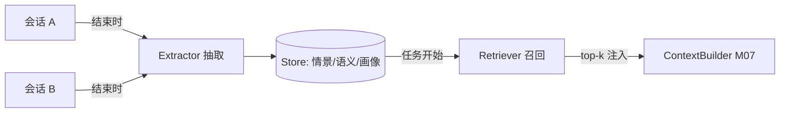

# M08 记忆系统（分层记忆 · 抽取 · 召回 · 污染治理）

| 项 | 值 |
|---|---|
| 生产进度 | Sprint 5 · 里程碑 MI-2a「长会话 + 记忆」（与 M07 同周） |
| 代码落点 | `backend/agent_godot/memory/`（4 个文件，见 §0.5） |
| 前置模块 | M07（Compressor 的 C 档摘要是抽取器的输入）· M01（embedding） |
| 手写比例 | 100% 手写（不用 mem0 SDK，但其思想全面吸收） |
| 教程映射 | 📗 hello-agents 记忆章 · 📝笔记 Memory · 📘 zero2Agent 06 课 |

---

## 0. 本模块在项目中的位置

**大白话**：上下文（M07）解决"**这一次对话**记得住"——但每次新会话，Agent 都是失忆重来：你昨天交代的"我们项目用 tabs 缩进"、上周踩的"Godot 4.3 改名坑"，今天它全忘了。记忆系统就是给 Agent 装**跨会话的长期记忆**：

```text
会话结束 → Extractor 从会话复盘"值得记的事" → Store 分类落库
下次会话开始 → Retriever 按当前任务召回相关记忆 → 注入 ContextBuilder 的 memory 分区
```

类比：M07 是你的**办公桌**（本次工作现场），M08 是你的**工作笔记**（跨天的经验积累）——桌上的东西每天清空，笔记越写越厚且随时翻查。关键区别：笔记不是流水账（全量存对话），而是**复盘提炼**（只记推导不出来的东西）。

**交付后状态**：今天告诉 Agent"我们项目用 tabs 缩进、信号命名用 snake_case"，明天新会话里它写代码自动遵守——无需重复交代。



---

## 0.5 ★ 施工文件清单（开工前必看的一页表）

**本模块你一共要新建 4 个文件**（按依赖顺序）：

| # | 新建文件（完整路径） | 职责一句话 | 关键类/函数 | 预估行数 | 手敲步骤(§4) | 依赖 |
|---|---|---|---|---|---|---|
| 1 | `memory/__init__.py` | 空包 | — | 1 | 步骤 0 | — |
| 2 | `memory/store.py` | 记忆库：SQLite+向量检索 | `MemoryRecord`、`MemoryStore` | 120 | 步骤 1 | M01 embedding |
| 3 | `memory/retriever.py` | 三因子加权召回+渲染 | `RecallConfig`、`MemoryRetriever` | 70 | 步骤 2 | store |
| 4 | `memory/extractor.py` | 会话复盘抽取+四路写入决策 | `MemoryExtractor` | 110 | 步骤 3 | store + M02 LLM + M07 compressor |
| 5 | `memory/profile.py` | 项目结构化档案 | `ProjectProfile`、`ProfileManager` | 60 | 步骤 4 | store |

**依赖链**：`store（先有库）→ retriever（先能读）→ extractor（再能写——写入决策要检索已有记忆做比对）→ profile（结构化事件流）`。先读后写不是随口说的：抽取的 UPDATE/DELETE 决策依赖检索能力。

**完成后你拥有**：跨会话约定生效验收 Demo（见 §5）；`/memory list`、`/memory delete` 两个 CLI 命令（M14 斜杠命令的挂载点）。

---

## 1. 知识点详解（每节五段：定义 → 大白话 → 举例 → 演进 → 易错点）

### 1.1 记忆分层：四种记忆各管一摊

**① 严格定义**：按认知心理学（Baddeley 工作记忆模型 + Tulving 情景/语义二分）分四层——**工作记忆**（当前会话上下文=M07 消息列表，天然在场）、**情景记忆**（带时间地点的任务过程纪要，跨会话，相似度+时间衰减检索）、**语义记忆**（去时间化的提炼事实：偏好/约定/API 结论，长期稳定）、**项目画像**（结构化档案：GDScript 版本/场景清单/依赖，直查不检索）。工程意义：**不同层用不同写入策略与遗忘曲线**。

**② 大白话**：四种记忆像**球队的不同记录体系**：工作记忆=当前比赛的战术板（赛后擦掉）；情景记忆=比赛录像（"上周那场我们因为越位战术输了"——带日期，细节会淡忘）；语义记忆=教练的经验教训（"边路传中对我们有效"——去时间化，长期有效）；项目画像=球队花名册（结构化表格，人员变动就更新，不用"回忆"）。分层的关键不是分类学好看，而是**遗忘策略不同**：录像三个月后归档（情景衰减），经验教训永远有效（语义稳定），花名册即时更新（upsert）。

**③ 举例**：同一个用户事件在三层各留什么：

```python
episodic = MemoryRecord(
    kind="episodic", content="2026-08-16 会话：为 player.tscn 添加敌人，因 CharacterBody2D "
    "碰撞检测在 Godot 4.3 改名(contacts_reported→max_contacts_reported) 而返工一次",
    session_id="s_123", project="dungeon-demo", importance=0.6)   # 带日期叙事
semantic = MemoryRecord(
    kind="semantic", content="用户偏好：GDScript 缩进用 tabs；信号回调命名 _on_<节点>_<信号>",
    importance=0.95)                       # 约定类 → 高重要性，几乎不遗忘
profile_update = {"godot_version": "4.3", "physics_style": "CharacterBody2D+move_and_slide"}
```

**④ 演进**：无记忆（每次冷启动）→ 全文塞 system（窗口爆炸）→ RAG 式记忆检索（向量库存记忆）→ **Mem0**（2024：抽取-合并-冲突消解流水线，比"存一切"省 token 且更准）→ 分层记忆（LangGraph/MemOS 方向）。本项目 = 分层 + Mem0 式写入流水线，全手写。

**⑤ 易错点**：
- 情景与语义的边界：情景=带时间地点的叙事；语义=去时间化的结论。把情景全存语义层 → 记忆库变"流水账日记"，召回精度崩
- 画像不是记忆表的一行：独立结构化文档（可整体替换），混进向量库失去"直查"能力
- 工作记忆层不要重复存 Store（M07 已管），双层都管必然打架

### 1.2 抽取器（Extractor）：会话结束时的"复盘"

**① 严格定义**：会话结束（或每 N 轮）触发，输入是 M07 Compressor 的 C 档纪要 + 关键消息，输出候选记忆。抽取判据：用户明确偏好/约定（→semantic，importance 0.9+）、踩坑与修复尤其版本差异类（→episodic 0.6）、项目结构事实（→profile 更新事件）、**丢弃寒暄/中间试错/可从代码库重新推导的事实**。写入不是直接 insert——经 Mem0 式四路决策（ADD/UPDATE/DELETE/NOOP）与已有记忆比对后落库。

**② 大白话**：**赛后复盘会**。不是把比赛录像原样归档（全量存对话=检索噪音），而是教练组开会提炼："这场暴露的传中问题记到教训本"（semantic）、"对方 7 号的边路突破存进录像摘要"（episodic）、"阵容变了更新花名册"（profile）、互相击掌的庆祝画面不用记（寒暄）。**第一设计原则："能从代码库重新推导的事实不要记"**——代码结构让 RAG（M10）实时查源，记忆只存"推导不出来的"（偏好、理由、教训）。否则记忆与代码漂移后，**错误记忆比没有记忆更糟**（Agent 满怀信心地用三个月前的旧结构写代码）。

**③ 举例**：四路写入决策提示词（Mem0 的核心机制）：

```python
DECIDE_PROMPT = """新事实: {fact}
已有相关记忆:
{existing}
决策（单选）:
- ADD: 全新信息，无重叠
- UPDATE: 与某条部分重叠且更准确/更新 → 给出合并后全文
- DELETE: 与某条矛盾且新事实为准 → 删除旧条
- NOOP: 重复信息
输出 JSON: {{"action": "...", "target_id": "...", "merged": "..."}}"""
```

**④ 演进**：全量存对话（检索噪音大）→ LLM 无判据抽取（什么都记）→ 判据化抽取 + 重要性打分 + 去重合并（Mem0 的四路决策）。重要性打分要给标尺（0.9=违反会导致返工的约定 / 0.5=背景知识），否则 LLM 全打 0.8。

**⑤ 易错点**：
- 抽取放在会话结束时**批量做**（一次调用）而不是每轮抽取——成本差 50 倍
- 抽取用廉价模型（deepseek-chat）与主模型分离配置——风险见面试题 9
- 抽取的输入用 C 档纪要而非全量原文（纪要已含目标/决策/偏好五段，正好是抽取需要的）

### 1.3 召回策略：相似度 × 新鲜度 × 重要性

**① 严格定义**：任务开始时，当前任务描述做 embedding 检索各层记忆，三因子加权融合排序：

$$
\text{score} = w_{sim} \cdot \cos(q, m) + w_{rec} \cdot e^{-\Delta days/\tau} + w_{imp} \cdot \text{importance}
$$

默认权重 0.6/0.2/0.2；τ 按层不同（episodic 14 天、semantic 90 天）；召回 top-k=8，注入预算 2k tokens（M07 memory 分区）。

**② 大白话**：**翻笔记的三条线索**。你在找"这个需求该用什么方案"时：先按主题翻（相似度——这条笔记讲的是不是这件事）；同类笔记里先翻最近的（新鲜度——三个月前的方法论可能过时了）；标注了"重要"的标签页优先（重要性——当时特意标红的约定）。三条线索加权，不是只看一条——只按时间会漏掉"永远有效的老约定"，只按相似度会把三年前的过时方案翻出来。

**③ 举例**（代数字看权重如何起作用）：

```text
query="给敌人加AI巡逻行为"，库中两条候选（相似度都是 0.75）：
  A: 情景记忆，7 天前，importance 0.6 → score = 0.6×0.75 + 0.2×e^(-7/14) + 0.2×0.6 = 0.45+0.121+0.12 = 0.69
  B: 情景记忆，60 天前，importance 0.6 → score = 0.6×0.75 + 0.2×e^(-60/14) + 0.2×0.6 = 0.45+0.001+0.12 = 0.57
  → A 排前（时间衰减拉开差距）

  C: 语义记忆"用户偏好 tabs"，90 天前，importance 0.95，相似度 0.3：
     score = 0.6×0.3 + 0.2×e^(-90/90) + 0.2×0.95 = 0.18+0.074+0.19 = 0.44
  → 不相关任务下偏好记忆排后；写代码任务（相似度会到 0.6+）时它升到前排
```

**④ 演进**：按时间倒序取最近 N 条（老约定被新任务淹没）→ 纯相似度（时间盲）→ 加权融合（本项目）→ Agentic 记忆（模型主动调 memory_search 工具按需检索——M14 把 retriever 注册为工具后自然获得）。

**⑤ 易错点**：
- 召回要**按项目隔离**（project_id 过滤先行），否则 A 项目的约定污染 B 项目
- 注入格式用显式标签包裹（`<project_memory>`），并在 system 里声明"这是历史记忆，可能与当前代码状态不符，**以工具实时读取为准**"——防记忆幻觉的关键提示
- 粗筛（向量 top32）与精排（加权）分离，权重做成配置可调

### 1.4 冲突与污染治理（Mem0 的核心贡献）

**① 严格定义**：记忆系统头号敌人是**自相矛盾**（"8 月说 tabs，9 月又说 spaces"，双双召回则模型当场精神分裂）。治理三板斧：①**写入时消解**（四路决策——矛盾在源头合并）；②**读取时标注**（时间戳随行渲染 `[2026-08] …`，system 提示明确"冲突时以新为准"）；③**定期 GC**（每周离线：相似度>0.9 的簇合并、DELETE 型矛盾归档、importance<0.3 且龄>90d 的情景记忆清除）。**记忆污染**（memory poisoning）：用户误述/模型幻觉被固化成长期记忆——防线：标注来源置信度（user_stated > model_inferred），模型推断类 importance 上限 0.6 且可被实时工具结果否决。

**② 大白话**：矛盾治理像**法律体系的法条更新**：新法出台时（写入），立法者要检查与旧法是否冲突——冲突就修订或废止旧法（四路决策），不是新旧两法并存；法官判案时（读取），看到新旧两条冲突条文按"后法优于前法"处理（时间戳标注）；司法部定期清理过期法规（GC）。污染治理像**证人可信度分级**：被告本人亲口说的（用户明说）可信度高，警方推测的（模型推断）可信度打折且可被实物证据（工具实时结果）推翻。

**③ 举例**：GC 合并任务（可直接参考）：

```python
async def gc_merge_duplicates(self):
    for cluster in await self.store.clusters(sim_threshold=0.92):  # 相似簇
        keep = max(cluster, key=lambda m: (m.ts, m.importance))    # 新且重要者留
        for m in cluster:
            if m.id != keep.id:
                await self.store.archive(m, reason=f"merged into {keep.id}")
                # archive 而非物理删——可审计可恢复
```

**④ 演进**：只增不删（矛盾积累）→ Mem0 四路写入决策（2024）→ 记忆生命周期管理（GC/归档/审计）。面试高频"你的 Agent 记忆错了怎么办"——答案就是三板斧 + 用户可删除性（`/memory list` 与 `/memory delete`）。

**⑤ 易错点**：
- **物理删除是红线**：记忆操作一律软删/归档（审计需要"它曾经记得什么"）
- 矛盾消解决策本身是 LLM 调用，它的错误会二次污染——UPDATE 的 merged 文本附两条原文 diff 供人工审计
- GC 别在服务高峰跑（全库扫相似度），放离线任务（M19 worker）

---

## 2. 接口设计（完整签名 = 你要手写的契约）

```python
# memory/store.py
@dataclass
class MemoryRecord:
    id: str; kind: Literal["episodic", "semantic"]
    content: str; emb: list[float] | None
    project_id: str; session_id: str | None
    ts: float; importance: float
    decay_days: int                       # 情景 14 / 语义 90
    source: Literal["user_stated", "model_inferred"]
    status: Literal["active", "archived"]

class MemoryStore:
    async def add(self, rec: MemoryRecord) -> None: ...
    async def update(self, id: str, content: str) -> None: ...
    async def archive(self, id: str, reason: str) -> None: ...
    async def search(self, project_id: str, q_emb: list[float],
                     top: int = 32) -> list[MemoryRecord]: ...
    async def clusters(self, sim_threshold: float) -> list[list[MemoryRecord]: ...
    async def get_profile(self, project_id: str) -> ProjectProfile: ...

# memory/extractor.py
class MemoryExtractor:
    def __init__(self, llm: LLM, embedder: Embedder, store: MemoryStore): ...
    async def extract_from_session(self, session: Session) -> ExtractReport: ...
    # ExtractReport: added/updated/deleted/noop 计数 + 明细（可审计）

# memory/retriever.py
@dataclass
class RecallConfig: k: int = 8; w_sim: float = .6; w_rec: float = .2
                    w_imp: float = .2; max_tokens: int = 2000
class MemoryRetriever:
    async def recall(self, project_id: str, query: str) -> list[ScoredMemory]: ...
    def render(self, scored: list[ScoredMemory]) -> str: ...

# memory/profile.py
@dataclass
class ProjectProfile:
    godot_version: str | None; naming_conventions: dict
    scene_inventory: dict[str, str]; recent_milestones: list[str]
class ProfileManager:
    async def apply_event(self, project_id: str, event: ProfileEvent) -> None: ...
```

---

## 3. 关键难点参考片段：抽取与消解的批处理

一次会话抽取 N 条候选，逐条做四路决策会放大 LLM 的不一致（前一条 UPDATE 了，后一条又基于旧文判断）。批内先分组再决策：

```python
async def extract_from_session(self, session):
    digest = await self.compressor.summarize(session.messages, budget=1500)
    candidates = await self._llm_extract(digest)               # 一次抽 N 条
    by_proj = group_by(candidates, key=lambda c: c.project_id)
    report = ExtractReport()
    for c in candidates:
        neighbors = await self.store.search(c.project_id,
                       await self.embedder.embed(c.content), top=3)
        decision = await self._decide(c, neighbors)            # 逐条消解（邻域小，可控）
        await getattr(self, f"_apply_{decision.action.lower()}")(c, decision)
        report.count(decision.action)
    return report
```

为什么难：批处理（抽取要批量省成本）与串行消解（决策要看到彼此效果）的张力——上面用"批量抽取 + 邻域串行"折中，邻域 top=3 保证决策上下文足够小而准。

---

## 4. 手敲指引（函数级伪代码）

### 步骤 1：`memory/store.py`
| 函数 | 作用（伪代码） |
|---|---|
| 建表 | `SQLite：memories 表（id/kind/content/emb 存 JSON/project_id/ts/importance/decay_days/source/status）+ profiles 表` |
| `add/update/archive` | `标准 CRUD；archive 只改 status='archived'（软删红线）；update 重算 emb` |
| `search` | `WHERE project_id=? AND status='active' → 全量取回 → 内存算余弦 → top-N`（单机版暴力扫即可，Milvus 迁移留 M10） |
| `clusters` | `GC 用：active 记录两两余弦（O(n²) 可接受，量级 <10k）→ 相似度>阈值的连通簇` |
**验证**：CRUD/检索单测过；archive 后 search 不可见但记录还在。

### 步骤 2：`memory/retriever.py`
| 函数 | 作用（伪代码） |
|---|---|
| `recall` | §1.3 公式代码化：`embed(query) → store.search(top=32) 粗筛 → 逐条算三因子加权分 → 排序取 k → budget 内截断` |
| `render` | `<project_memory>` 标签包裹 + 每条带时间戳 `[2026-08-16][semantic] 内容`（读取时标注）`</project_memory>` |
**验证**：§1.3 的代数字用例——同相似度下时间/重要性引起排序变化符合手算。

### 步骤 3：`memory/extractor.py`
| 函数 | 作用（伪代码） |
|---|---|
| `extract_from_session` | §3 难点代码：`compressor.summarize 得纪要 → LLM 按判据抽候选（给 importance 标尺）→ 逐条：检索邻域 top3 → DECIDE_PROMPT 四路决策 → apply → 计数报表` |
| `_apply_add/update/delete/noop` | `add：算 emb 落库；update：merged 文本替换+附 diff 审计；delete：archive(矛盾归档)；noop：跳过` |
**验证**：假会话（含一条约定+一次踩坑+若干寒暄）抽出 2 条 semantic + 1 条 episodic，寒暄零抽取。

### 步骤 4：`memory/profile.py` + 接入
| 函数 | 作用（伪代码） |
|---|---|
| `apply_event` | `事件类型分支：scene_added→inventory 更新 / version_detected→godot_version 覆盖 / milestone→追加（保留最近 10 条）`——全部 upsert 语义 |
| 接入 M07 | `ContextBuilder 的 memory 分区改为调 retriever.recall(project_id, task_query)` |
**验证**：§5 验收 Demo——跨会话约定生效。

---

## 5. 测试与验收

```python
async def test_preference_persists_across_sessions():
    # 会话 A: "以后信号回调都叫 _on_x_y" → 抽取 → 新会话 B 写代码任务
    # 断言 B 的上下文含该约定，且生成代码遵循

async def test_contradiction_updates_not_duplicates():
    store.add(MemoryRecord(content="缩进用 spaces", ...))
    await extractor._decide_and_apply(Memory("缩进用 tabs"))
    assert len(await store.search_all(...)) == 1        # UPDATE 而非新增

def test_recall_prefers_important_recent():
    # 同相似度下：importance 0.9/3天前 > 0.5/今天（代数字见 §1.3）

def test_model_inferred_capped():
    # model_inferred 来源的记忆 importance 永远 ≤ 0.6
```

**验收 Demo**：会话 1 告诉 Agent 三条约定并完成一个加敌人任务 → 关闭 → 会话 2 让它"再加一个类似的敌人" → 开场上下文可见记忆注入，新代码风格与约定一致，并复用了上次"max_contacts_reported"的版本坑经验（情景记忆命中）。

---

## 6. 踩坑记录（留白自填）

| 日期 | 坑 | 现象 | 根因 | 解法 | 关联知识点 |
|---|---|---|---|---|---|
|     |    |     |     |    |          |

---

## 7. 面试拷打（附详细参考答案）

**1. 四层记忆各自的写入/遗忘策略差异？为什么情景要衰减而语义不衰减？**
答：工作记忆随会话生灭（M07 管理，压缩即"遗忘"）；情景记忆（任务叙事）importance 中等、τ=14 天指数衰减、定期 GC 清低价值旧账；语义记忆（约定/偏好）importance 高、τ=90 天几乎不衰减、只被矛盾 UPDATE 替换；画像结构化 upsert，无"遗忘"只有"覆盖"。情景衰减的原因：情景的价值核心是**时效性上下文**（上周的踩坑这周还相关，三个月后环境早变了），且数量随会话线性增长不衰减就会淹没检索；语义不衰减的原因：约定类事实没有自然时效（"用 tabs"不因时间流逝而失效），失效只可能因为**被新约定取代**（矛盾消解路径），不是时间路径。

**2. Mem0 的四路写入决策解决什么问题？没有它会发生什么？**
答：解决"只增不删的记忆库必然劣化"。没有它：重复记忆堆积（同一偏好每会话抽一次，十条近重复）；矛盾并存（tabs vs spaces 双双召回，模型当场精神分裂或随机站队）；库越大检索噪音越大，最终记忆系统净收益转负。四路决策在**写入源头**做减法：ADD 只收新信息、UPDATE 合并演进、DELETE 处置矛盾、NOOP 挡住重复——每次写入后库里都保持"最简且自洽"。这也是"数据治理前置"思想的体现：宁可写入时多花一次 LLM 调用，不要读取时天天踩坑。

**3. "能从代码库重新推导的事实不要记"——为什么这条原则如此重要？**
答：三个理由：①**漂移风险**：代码是持续变动的唯一事实源，记忆是快照——记住"项目有 12 个场景"，两周后加了 3 个，错误记忆比没有记忆更糟（Agent 满怀信心地用旧结构写代码，错得理直气壮）；②**冗余成本**：可推导的事实让 RAG 实时查源永远是对的，记忆里存一份等于维护一个必然过期的缓存；③**信噪比**：库里塞满可推导事实，真正"推导不出来的"（偏好、理由、教训）被淹没。判据一句话：**记忆存"为什么"和"偏好什么"，不存"是什么"**——后者问代码就行。

**4. 召回打分三个因子怎么加权？什么场景要调高时间权重？**
答：默认 0.6/0.2/0.2（相似度主导——不相关的记忆再新再重要也不该注入）。调高时间权重（如 0.6/0.3/0.1）的场景：**快速迭代期**——用户偏好/项目结构天天变，旧记忆大概率过时（时间衰减因子压制陈旧条目）；**资讯类任务**——"上次查的 Godot 版本信息"时效敏感。调高重要性权重的场景：约定密集型项目——数十条编码约定必须稳定注入。工程上权重进 settings.yaml 可调 + 灰度对比（A/B 两套权重跑同任务集比返工率）。

**5. 记忆冲突的三板斧？矛盾记忆双双召回时靠什么兜底？**
答：三板斧=写入时消解（四路决策源头合并）/读取时标注（时间戳随行+system 声明"冲突以新为准"）/定期 GC（相似簇合并归档）。双双召回的兜底是第二板斧：即使两条矛盾记忆都过了召回线，模型看到 `[2026-08] tabs` 和 `[2026-09] spaces`，配合 system 的显式裁决规则，会倾向新者；若仍不确定，M07 的记忆标签声明"以工具实时读取为准"引导它调工具验尸（读一个文件看实际缩进）——**最终事实裁决权永远在实时数据**，记忆只是先验。

**6. 什么是记忆污染？你的系统里有几道防线？**
答：污染=错误信息（用户口误/模型幻觉/提示注入产物）被固化成长期记忆，之后每会话携带错误先验，且可能继续繁殖（基于错误记忆的决策又生成新的错误记忆）。四道防线：①抽取判据——寒暄/试错默认丢弃，降低噪音入库率；②来源分级——user_stated 可信度高（可到 0.95），model_inferred 硬上限 0.6 且注入时标注"推断"；③读取标注+实时否决——记忆与工具实时结果冲突时以工具为准（system 显式声明）；④可审计可删除——软删+diff 审计+`/memory delete` 用户命令，发现污染可精准摘除。纵深防御思想：任何单道防线都可能被绕过。

**7. 为什么记忆只准软删/归档？**
答：三个理由：①**审计**——记忆错误导致的 Agent 行为事故，事后要能回答"它当时记了什么"（物理删=毁证据），归档保留完整调查链；②**可恢复**——矛盾消解的 DELETE 判定本身是 LLM 调用可能误判（把"暂时不用但以后有效"的约定错删），软删可一键恢复；③**GC 安全**——批量合并/清理操作的回滚依赖原始数据在。这对应数据库软删除与 binlog 的通行实践：**用户数据的破坏性操作永远要留退路**。物理删除只发生在用户显式要求且二次确认的合规场景（隐私删除权）。

**8. 记忆注入为什么包 XML 标签并声明"以实时工具为准"？**
答：两个目的：①**结构隔离**——`<project_memory>` 显式分界，模型能区分"这是历史记忆"与"这是当前指令/事实"，防止记忆内容被当作当前任务的直接指令执行（提示注入面收窄）；②**权威分级**——声明"可能与当前代码状态不符，以工具实时读取为准"给模型一个明确的裁决规则：记忆是先验不是事实。没有这句话的行为风险：模型读到记忆"场景清单 12 个"，直接在回答里说"你有 12 个场景"——而实际早变了。有了它，模型倾向先调 godot_list_scenes 验证。这条提示是"记忆幻觉"的最后一道闸。

**9. 抽取用廉价模型、主对话用强模型，风险是什么？**
答：风险=**抽取质量的天花板被廉价模型压低**：判据理解偏差（把背景知识误判为约定，importance 乱打分）、四路决策失误（该 UPDATE 的判成 ADD → 重复堆积；该 DELETE 的 NOOP → 矛盾留存）、抽取遗漏（廉价模型对隐含偏好的敏感度低）。缓解：①判据和标尺写死在提示词里（把判断力外置为规则，降低对模型推理的依赖）；②ExtractReport 审计明细（M19 落库，定期抽查廉价模型的错误率）；③关键决策升档（UPDATE/DELETE 这类破坏性决策路由到强模型，ADD/NOOP 廉价模型做——分级调用策略）；④用户可纠错（/memory 命令）兜底。

**10. 开放题：给记忆系统设计评估集，怎么量化"记忆带来的收益"？**
答：设计四步：①**构造任务集**——20 个"跨会话依赖"任务对（会话 A 埋约定/踩坑，会话 B 执行依赖该约定的任务），如 A:"信号回调命名 _on_x_y" B:"给按钮加点击信号"；②**对照组**——同一任务集跑两组：记忆开（recall 注入）vs 记忆关（冷启动），其他条件全同；③**指标**——一级指标：任务 B 的**约定遵循率**（生成代码是否符合 A 的约定，规则可判定）/返工率；二级指标：注入的 token 成本（记忆的代价）、错误记忆注入数（污染指标）、M22 式端到端成功率；④**细分维度**——按记忆类型（semantic 偏好 vs episodic 踩坑）分别统计（两类记忆的收益模式不同：偏好型立竿见影，踩坑型在复现场景才兑现）。产出：一份"记忆净收益 = 遵循率提升 − token 成本 − 污染代价"的量化报告——这本身就是 M22 评估体系的一个子集。

---

## 8. 教程映射与延伸

- 📗 hello-agents 记忆章节（分层思想同源）
- 📘 zero2Agent 06 课
- 必读：Mem0 论文（2024，重点读 write/read pipeline 两节）
- 选读：Generative Agents（Park 2023，importance 打分的心理学出处）；MemOS
