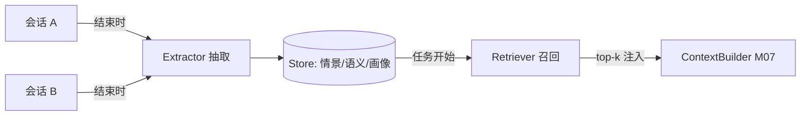

# M08 记忆系统（分层记忆 · 抽取 · 召回 · 污染治理）

| 项 | 值 |
|---|---|
| 生产进度 | Sprint 5 · 里程碑 MI-2a「长会话 + 记忆」（与 M07 同周） |
| 代码落点 | `backend/agent_godot/memory/`（store/extractor/retriever/profile） |
| 前置模块 | M07（Compressor 的 C 档摘要是抽取器的输入）· M01（embedding） |
| 手写比例 | 100% 手写（不用 mem0 SDK，但其思想全面吸收） |
| 教程映射 | 📗 hello-agents 记忆章 · 📝笔记 Memory · 📘 zero2Agent 06 课 |

---

## 0. 本模块在项目中的位置

上下文（M07）解决"**这一次对话**记得住"，记忆解决"**下一次对话**还想得起"：

```text
会话结束 → Extractor 从会话抽取值得记的事 → Store 分类落库
下次会话开始 → Retriever 按当前任务召回相关记忆 → 注入 ContextBuilder 的 memory 分区
```

**交付后状态**：今天告诉 Agent"我们项目用 tabs 缩进、信号命名用 snake_case"，明天新会话里它写代码自动遵守——无需重复交代。



---

## 1. 知识点详解

### 1.1 记忆分层：四种记忆各管一摊

**① 原理**

| 层 | 内容 | 生命周期 | 存储 | 检索方式 |
|---|---|---|---|---|
| **工作记忆** | 当前会话上下文 | 会话内 | 就是 M07 的消息列表 | 天然在场 |
| **情景记忆** | "上次发生的事"（某任务的过程纪要） | 跨会话 | SQLite/MySQL + embedding | 相似度+时间衰减 |
| **语义记忆** | 提炼的事实（用户偏好/项目约定/API 结论） | 长期 | 同上 | 相似度 |
| **项目画像** | 结构化档案（GDScript 版本/场景清单/依赖） | 随项目演进 | 结构化表 | 直查 |

分层源自认知心理学（Baddeley 工作记忆模型 + Tulving 情景/语义二分）。工程意义：**不同层用不同写入策略与遗忘曲线**——情景记忆自然衰减（旧任务的细节不重要了），语义记忆要稳定（约定类事实不能飘），画像随事件更新（结构化 upsert）。

**② 演进**：无记忆（每次冷启动）→ 全文塞 system（窗口爆炸）→ RAG 式记忆检索（向量库存记忆）→ **Mem0**（2024：抽取-合并-冲突消解的流水线，比"存一切"省 token 且更准）→ 分层记忆（LangGraph/MemOS 方向）。本项目 = 分层 + Mem0 式写入流水线，全手写。

**③ 最小案例**：三种记忆的同一个用户事件

```python
 episodic = MemoryRecord(
    kind="episodic", content="2026-08-16 会话：为 player.tscn 添加敌人，因 CharacterBody2D
    碰撞检测在 Godot 4.3 改名(contacts_reported→max_contacts_reported) 而返工一次",
    session_id="s_123", project="dungeon-demo",
    importance=0.6)
semantic = MemoryRecord(
    kind="semantic", content="用户偏好：GDScript 缩进用 tabs；信号回调命名 _on_<节点>_<信号>",
    importance=0.95)                       # 约定类 → 高重要性，几乎不遗忘
profile_update = {"godot_version": "4.3", "physics_style": "CharacterBody2D+move_and_slide"}
```

**④ 易错点**
- 情景与语义的边界：情景=带时间地点的叙事；语义=去时间化的结论。把情景全存语义层 → 记忆库变"流水账日记"，召回精度崩
- 画像不是记忆表的一行：它是独立结构化文档（可整体替换），混进向量库会失去"直查"能力
- 工作记忆层不要重复存 Store（M07 已管），双层都管必然打架

### 1.2 抽取器（Extractor）：会话结束时的"复盘"

**① 原理**

会话结束（或每 N 轮）触发，输入是 Compressor 的 C 档纪要 + 关键消息，输出候选记忆：

```text
抽取提示词骨架（零样本效果差，要点是给"值得记"的判据）：
- 用户明确表达的偏好/约定（"以后都…"）        → semantic, importance 0.9+
- 踩坑与修复（尤其 Godot 版本差异类）          → episodic, 0.6
- 项目结构事实（新场景/新系统/重命名）          → profile 更新事件
- 丢弃：寒暄/中间试错/可从代码库重新推导的事实   ← 最后一条最反直觉：能重查的不要记！
```

**"能从代码库重新推导的事实不要记"** 是本模块第一设计原则——记忆存"推导不出来的"（偏好、理由、教训），代码结构类事实让 RAG（M10）实时查源。否则记忆与代码漂移后，错误记忆比没有记忆更糟。

**② 演进**：全量存对话（检索噪音大）→ LLM 无判据抽取（什么都记）→ 判据化抽取 + 重要性打分 + 去重合并（Mem0 的 ADD/UPDATE/DELETE/NOOP 四路决策——下节展开）。

**③ 最小案例**：Mem0 式写入决策（抽取后不是直接 insert，而是与已有记忆比对）

```python
DECIDE_PROMPT = """新事实: {fact}
已有相关记忆:
{existing}
决策（单选）:
- ADD: 全新信息，无重叠
- UPDATE: 与某条部分重叠且更准确/更新 → 给出合并后全文
- DELETE: 与某条矛盾且新事实为准 → 删除旧条
- NOOP: 重复信息
输出 JSON: {{"action": "...", "target_id": "...", "merged": "..."}}"""
```

**④ 易错点**
- 抽取放在会话结束时批量做（一次调用）而不是每轮抽取——成本差 50 倍
- importance 由 LLM 打分要给标尺（0.9=违反会导致返工的约定 / 0.5=背景知识），否则全打 0.8
- 抽取用的模型可以用廉价档（deepseek-chat），与主模型分离配置

### 1.3 召回策略：相似度 × 新鲜度 × 重要性

**① 原理**

任务开始时，当前任务描述（用户输入 + 会话主题）做 embedding，检索各层记忆，融合排序：

```text
score = w_sim · cos(query, memory.emb)
      + w_rec · exp(-Δdays / τ)          # 时间衰减，τ 按层不同（episodic 14d, semantic 90d）
      + w_imp · memory.importance         # 约定类天然靠前
默认权重 0.6 / 0.2 / 0.2；召回 top-k=8，注入预算 2k tokens（M07 memory 分区）
```

**② 演进**：按时间倒序取最近 N 条（老约定被新任务淹没）→ 纯相似度（时间盲）→ 加权融合（本项目）→ Agentic 记忆（模型主动调用 memory_search 工具按需检索——M14 把 retriever 注册为工具后自然获得）。

**③ 最小案例**

```python
class Retriever:
    async def recall(self, query: str, k: int = 8) -> list[ScoredMemory]:
        q = await self.embedder.embed(query)
        cands = await self.store.search_all_layers(q, top=32)     # 向量粗筛
        now = time.time()
        scored = [ScoredMemory(
            m, 0.6 * cos(q, m.emb)
             + 0.2 * math.exp(-(now - m.ts) / 86400 / m.decay_days)
             + 0.2 * m.importance) for m in cands]
        scored.sort(key=lambda s: s.score, reverse=True)
        return self._budget_cut(scored[:k], max_tokens=2000)      # 预算内截断

    def render(self, scored: list[ScoredMemory]) -> str:
        return "<project_memory>\n" + "\n".join(
            f"- [{m.kind}] {m.content}" for m in scored) + "\n</project_memory>"
```

**④ 易错点**
- 召回要**按项目隔离**（project_id 过滤先行），否则 A 项目的约定污染 B 项目
- 注入格式用显式标签包裹（`<project_memory>`），并在 system 里说明"这是历史记忆，可能与当前代码状态不符，以工具实时读取为准"——防记忆幻觉的关键提示
- 检索粗筛（向量 top32）与精排（加权）分离，权重做成配置可调

### 1.4 冲突与污染治理（Mem0 的核心贡献）

**① 原理**

记忆系统的头号敌人是**自相矛盾**："用户 8 月说要 tabs，9 月又说 spaces"——两条都在库，召回时双双命中，模型当场精神分裂。治理三板斧：

```text
① 写入时消解：1.2 的 ADD/UPDATE/DELETE 决策——矛盾的记忆在源头合并
② 读取时标注：时间戳随行渲染 "[2026-08] ..."，新旧冲突时模型倾向新的（system 提示明确该规则）
③ 定期 GC：每周离线任务——相似度>0.9 的簇合并、DELETE 型矛盾归档、importance<0.3 且龄>90d 的情景记忆清除
```

**记忆污染**（memory poisoning）的极端形态：用户误述/模型幻觉被固化成长期记忆，之后每会话都带着错误。防线：抽取时标注来源置信度（用户明说 > 模型推断）；"模型推断类"记忆 importance 上限 0.6，召回后可被实时工具结果否决。

**② 演进**：只增不删（矛盾积累）→ Mem0 四路写入决策（2024）→ 记忆的生命周期管理（GC/归档/审计）。面试高频："你的 Agent 记忆错了怎么办"——答案就是这节三板斧 + 可删除性（用户可 /memory list 与 /memory delete）。

**③ 最小案例**：GC 合并任务骨架

```python
async def gc_merge_duplicates(self):
    for cluster in await self.store.clusters(sim_threshold=0.92):  # 相似簇
        keep = max(cluster, key=lambda m: (m.ts, m.importance))    # 新且重要者留
        for m in cluster:
            if m.id != keep.id:
                await self.store.archive(m, reason=f"merged into {keep.id}")
                # archive 而非物理删——可审计可恢复
```

**④ 易错点**
- 物理删除是红线：记忆操作一律软删/归档（审计需要"它曾经记得什么"）
- 矛盾消解决策本身是 LLM 调用，它的错误会二次污染——UPDATE 的 merged 文本要附带两条原文的 diff，方便人工审计
- GC 别在服务高峰跑（全库扫相似度），放离线任务（M19 worker）

---

## 2. 接口设计（完整签名）

```python
# memory/store.py
@dataclass
class MemoryRecord:
    id: str; kind: Literal["episodic", "semantic"]
    content: str; emb: list[float] | None
    project_id: str; session_id: str | None
    ts: float; importance: float
    decay_days: int                       # 情景 14 / 语义 90
    source: Literal["user_stated", "model_inferred"]
    status: Literal["active", "archived"]

class MemoryStore:
    async def add(self, rec: MemoryRecord) -> None: ...
    async def update(self, id: str, content: str) -> None: ...
    async def archive(self, id: str, reason: str) -> None: ...
    async def search(self, project_id: str, q_emb: list[float],
                     top: int = 32) -> list[MemoryRecord]: ...
    async def clusters(self, sim_threshold: float) -> list[list[MemoryRecord]]: ...
    async def get_profile(self, project_id: str) -> ProjectProfile: ...

# memory/extractor.py
class MemoryExtractor:
    def __init__(self, llm: LLM, embedder: Embedder, store: MemoryStore): ...
    async def extract_from_session(self, session: Session) -> ExtractReport: ...
    # ExtractReport: added/updated/deleted/noop 计数 + 明细（可审计）

# memory/retriever.py
@dataclass
class RecallConfig: k: int = 8; w_sim: float = .6; w_rec: float = .2
                    w_imp: float = .2; max_tokens: int = 2000
class MemoryRetriever:
    async def recall(self, project_id: str, query: str) -> list[ScoredMemory]: ...
    def render(self, scored: list[ScoredMemory]) -> str: ...

# memory/profile.py
@dataclass
class ProjectProfile:
    godot_version: str | None; naming_conventions: dict
    scene_inventory: dict[str, str]; recent_milestones: list[str]
class ProfileManager:
    async def apply_event(self, project_id: str, event: ProfileEvent) -> None: ...
```

## 3. 关键难点参考片段：抽取与消解的批处理

一次会话抽取 N 条候选，逐条做四路决策会放大 LLM 的不一致（前一条 UPDATE 了，后一条又基于旧文判断）。批内先分组再决策：

```python
async def extract_from_session(self, session):
    digest = await self.compressor.summarize(session.messages, budget=1500)
    candidates = await self._llm_extract(digest)               # 一次抽 N 条
    by_proj = group_by(candidates, key=lambda c: c.project_id)
    report = ExtractReport()
    for c in candidates:
        neighbors = await self.store.search(c.project_id,
                       await self.embedder.embed(c.content), top=3)
        decision = await self._decide(c, neighbors)            # 逐条消解（邻域小，可控）
        await getattr(self, f"_apply_{decision.action.lower()}")(c, decision)
        report.count(decision.action)
    return report
```

为什么难：批处理（抽取要批量省成本）与串行消解（决策要看到彼此效果）的张力——上面用"批量抽取 + 邻域串行"折中，邻域 top=3 保证决策上下文足够小而准。

## 4. 手敲指引

| 步骤 | 文件 | 做什么 | 验证 |
|---|---|---|---|
| 1 | store.py | SQLite 建表 + 向量暴力检索 | CRUD/检索单测过 |
| 2 | retriever.py | 加权召回 + 渲染 | 权重变化引起排序变化 |
| 3 | extractor.py | 抽取提示 + 四路决策 | 假会话抽出 2 条语义 1 条情景 |
| 4 | profile.py | 结构化画像 upsert | 事件序列后档案正确 |
| 5 | 接入 M07 | ContextBuilder memory 分区 | 新会话上下文含 `<project_memory>` |
| 6 | GC 任务 | 簇合并 + 归档 | 构造重复对，跑后留一条 |

## 5. 测试与验收

```python
async def test_preference_persists_across_sessions():
    # 会话 A: "以后信号回调都叫 _on_x_y" → 抽取 → 新会话 B 写代码任务
    # 断言 B 的上下文含该约定，且生成代码遵循

async def test_contradiction_updates_not_duplicates():
    store.add(MemoryRecord(content="缩进用 spaces", ...))
    await extractor._decide_and_apply(Memory("缩进用 tabs"))
    assert len(await store.search_all(...)) == 1        # UPDATE 而非新增

def test_recall_prefers_important_recent():
    # 同相似度下：importance 0.9/3天前 > 0.5/今天
```

**验收 Demo**：会话 1 告诉 Agent 三条约定并完成一个加敌人任务 → 关闭 → 会话 2 让它"再加一个类似的敌人" → 开场上下文可见记忆注入，新代码风格与约定一致，并复用了上次"max_contacts_reported"的版本坑经验（情景记忆命中）。

## 6. 踩坑记录（留白）

| 日期 | 坑 | 现象 | 根因 | 解法 | 关联知识点 |
|---|---|---|---|---|---|
|     |    |     |     |    |          |

## 7. 面试拷打

1. 四层记忆各自的写入/遗忘策略差异？为什么情景要衰减而语义不衰减？
2. Mem0 的四路写入决策解决什么问题？没有它会发生什么？
3. "能从代码库重新推导的事实不要记"——为什么这条原则如此重要？
4. 召回打分三个因子怎么加权？什么场景要调高时间权重？
5. 记忆冲突的三板斧？矛盾记忆双双召回时靠什么兜底？
6. 什么是记忆污染？你的系统里有几道防线？
7. 为什么记忆只准软删/归档？
8. 记忆注入为什么包 XML 标签并声明"以实时工具为准"？
9. 抽取用廉价模型、主对话用强模型，风险是什么？
10. 开放题：给记忆系统设计评估集，怎么量化"记忆带来的收益"？（A/B：开/关记忆跑同一任务集比对返工率）

## 8. 教程映射与延伸

- 📗 hello-agents 记忆章节（分层思想同源）
- 📘 zero2Agent 06 课
- 必读：Mem0 论文（2024，重点读 write/read pipeline 两节）
- 选读：Generative Agents（Park 2023，importance 打分的心理学出处）；MemOS
