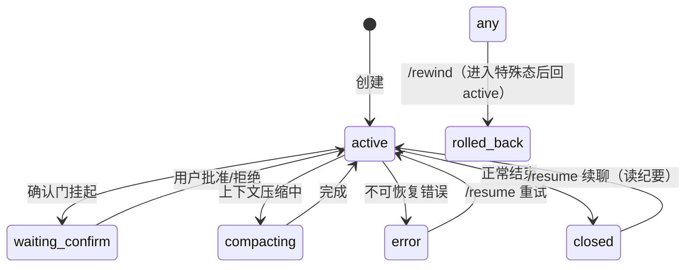

# M09 权限与会话（Permission Gate · 确认门 · Session 状态机 · Rewind）

| 项 | 值 |
|---|---|
| 生产进度 | Sprint 6 · 里程碑 **MI-2「可内测」——敢让别人用了** |
| 代码落点 | `backend/agent_godot/permission/`（4 文件）+ `session/`（4 文件），见 §0.5 |
| 前置模块 | M04（工具 risk 元数据）· M06（检查点）· M03（Dispatcher 挂 gate 的位置） |
| 手写比例 | 100% 手写 |
| 教程映射 | 📘 zero2Agent 07 课 · 📝笔记 Permission/Human-in-the-loop · Claude Code 权限模型 |

---

## 0. 本模块在项目中的位置

**大白话**：前六周做的是"能干活的 Agent"，本模块做的是"**不闯祸的 Agent**"。好比请了个能干的新员工：什么都要请示（全询问）没人受得了，什么都自己决定（全放行）迟早出大事——需要一套**门禁制度**：拿快递自己去（只读操作，放行）、进会议室刷工卡（本地可逆写，规则放行）、动保险柜必须你亲自开（高危操作，确认门）。再加上**事后补救**：录像回放（事件溯源）、一键撤销（rewind）。权限（事前拦截）+ 会话（事中挂起/事后回溯）双系统，内测的安全底线。

**交付后状态**：高危操作弹确认（CLI y/n；Web 端 M20 弹层）、规则可配置（permissions.yaml）、会话可暂停恢复（/resume）、可回滚（/rewind）、断线重连任务继续。

---

## 0.5 ★ 施工文件清单（开工前必看的一页表）

**本模块你一共要新建 9 个文件**（先权限后半会话——M03 Dispatcher 挂 gate 在中间接榫）：

| # | 新建文件（完整路径） | 职责一句话 | 关键类/函数 | 预估行数 | 手敲步骤(§4) | 依赖 |
|---|---|---|---|---|---|---|
| 1 | `permission/__init__.py` 等 | 空包 | — | 2 | 步骤 0 | — |
| 2 | `permission/risk.py` | 三级风险枚举+评级三问 | `RiskLevel`、`assess()` | 30 | 步骤 1 | M04 ToolMeta |
| 3 | `permission/rules.py` | yaml 规则+glob+优先级 | `PermissionRule`、`RuleEngine` | 100 | 步骤 1 | risk |
| 4 | `permission/gate.py` | 决策入口（挂在 Dispatcher 前） | `PermissionGate` | 50 | 步骤 2 | rules |
| 5 | `permission/confirm.py` | 确认门：挂起/恢复/超时 | `PendingConfirm`、`ConfirmGate` | 90 | 步骤 3 | gate + session |
| 6 | `session/__init__.py` 等 | 空包 | — | 2 | 步骤 0 | — |
| 7 | `session/state.py` | 六态状态机+事件定义 | `SessionState`、`SessionEvent` 家族 | 80 | 步骤 4 | 无 |
| 8 | `session/manager.py` | 事件溯源：创建/恢复/持久化 | `Session`、`SessionManager` | 110 | 步骤 5 | state |
| 9 | `session/rewind.py` | 对话-文件-记忆三联动回滚 | `rewind_to`、命名存档 | 70 | 步骤 6 | manager + M06 |
| — | `config/permissions.yaml` | 产品配置面 | — | 20 | 步骤 1 | — |

**依赖链**：`risk/rules（判定）→ gate（拦截）→ state/manager（挂起恢复的状态基座）→ confirm（在基座上做门）→ rewind（联动回滚）`。**接线点**：M03 Dispatcher 的每个 call 前插入 `gate.check()`——本模块与 M03 的唯一耦合点。

**完成后你拥有**：MI-2 验收 Demo 全程（高危确认/拒绝改道/杀进程恢复/rewind 三联动）。

---

## 1. 知识点详解（每节五段：定义 → 大白话 → 举例 → 演进 → 易错点）

### 1.1 风险分级：把"每个操作"映射到"几个等级"

**① 严格定义**：权限决策不可能逐工具手写——抽象出风险等级（LOW/MEDIUM/HIGH），工具注册时声明（M04 的 risk 字段），规则引擎按"等级+路径"决策：

```text
LOW    只读无副作用：list/read/search/check         → 默认放行
MEDIUM 本地可逆写：write_file/edit_scene/create_scene → 规则决定（白名单放行，其余询问）
HIGH   不可逆或出边界：delete/网络/装依赖/任意命令/headless 运行 → 默认询问；敏感配置默认拒
```

**② 大白话**：**小区门禁三级**。取快递（LOW）——快递柜自提，无需许可；进健身房（MEDIUM）——刷工卡，规则里有你就能进；开你家的门（HIGH）——必须你本人当面开门，一次一开。评级三问（任何新工具过一遍）：**可逆吗？**（有检查点=可逆，降一级——M06 检查点让"文件写"从 HIGH 降到 MEDIUM，可恢复性决定风险等级，两模块的深层耦合）**影响范围？**（项目内/系统级/网络）**频率？**（高频询问=确认疲劳，要规则化放行）。

**③ 举例**：默认规则表（permissions.yaml，具体规则优先于默认）：

```yaml
defaults: { low: allow, medium: ask, high: ask }
rules:
  - tool: write_file
    paths: ["scripts/**", "scenes/**"]     # 项目源码区
    action: allow                          # 内测期白名单直放
  - tool: delete_file
    action: deny                           # 任何路径都不许（deny 最高优先）
  - tool: godot_run_scene
    action: ask
    remember: session                      # "本次会话不再问"=会话内规则记忆
  - tool: mcp__fetch__*
    action: ask
```

**④ 演进**：全放行（玩具）→ 全询问（没人用）→ 分级+规则+记忆（Claude Code 三级：默认安全/自动接受编辑/危险跳过）。分级的本质：**把有限的人类注意力分配给真正的风险**。

**⑤ 易错点**：
- deny > allow > ask 优先级要显式实现（用户配了 deny 绝不能被 allow 覆盖）
- glob 锚定项目根（`scripts/**` 不该匹配 `../other/scripts`）
- 高频 LOW 误标 MEDIUM → 确认疲劳 → 用户无脑点允许——**安全设计的失败形态不是拒绝太多而是麻木**

### 1.2 Human-in-the-Loop：确认门的中断与恢复

**① 严格定义**：确认门是本模块工程难度最高的点：Loop 正在跑，Dispatcher 遇到 MEDIUM/HIGH 操作，要**暂停整条执行链等一个人回答**。两种风格——A（同步阻塞）：`await input()` 直接等，简单但 Web 多租户下不可行；**B（挂起恢复，本项目）**：检出需确认 → 不执行，生成 `PendingConfirm(call_id, 描述, diff 预览)` → Session 状态机转 `waiting_confirm`，"待确认队列"持久化后 Loop 正常退出（资源干净）→ 用户回答（CLI 输入/Web REST 回传）→ `active` → 从检查点恢复：重放上下文与已完成步骤，继续被批准/拒绝的工具。

**② 大白话**：**手术签字制度**。主刀医生（Agent）不能自己决定做不做手术（高危工具），必须家属（用户）签字：医生拿着手术方案（Diff 预览）到谈话间，说明"切哪里、有什么风险"（PendingConfirm 带足决策材料）；家属考虑期间医生不站手术室干耗（挂起落盘，进程可退）；签字（批准）→ 继续手术；拒签 → 医生换保守治疗方案（**拒绝也是信息**：不抛异常，把"用户拒绝，原因…"作为 Observation 回填，模型据此改道）。

**③ 举例**：挂起-恢复核心流（可直接参考）：

```python
class ConfirmGate:
    async def check(self, call: ToolCall) -> GateDecision: ...
        # allow / deny(规则直接拒) / need_confirm

    async def request(self, call: ToolCall) -> ToolResponse:
        pc = PendingConfirm(call_id=call.id, tool=call.name,
            args=call.arguments, risk=self._risk(call),
            preview=await self._preview(call))        # 写类操作附 Diff 预览
        self.session.suspend_with(pc)                  # 状态机→waiting_confirm 并落盘
        answer = await self.session.wait_resume()      # CLI:Future 由输入线程 set；Web:轮询恢复
        if answer.approved:
            return await self.dispatcher.execute_now(call)
        return ToolResponse(ok=False, error=ToolError(
            kind=ErrorKind.DENIED, tool=call.name,
            message="用户拒绝执行",
            hint="询问用户希望如何调整，或提出替代方案"))
```

**④ 演进**：同步 input()（仅 CLI）→ 回调注册（状态散乱）→ 状态机+持久化挂起（生产形态，Claude Code/CodeBuddy 同款）。A2A 协议里"任务挂起等人"也是一等公民（M15 呼应）。

**⑤ 易错点**：
- 恢复后**不重放已完成的副作用**（文件已写不能重写）——恢复点精确到"待确认 call 之前"
- 确认信息带足决策材料（Diff/目标路径/影响），"是否允许 write_file? y/n"是失败设计
- 超时策略：挂起 24h 未答自动拒绝收尾（防会话泄漏）

### 1.3 会话状态机与事件溯源

**① 严格定义**：Session 是有明确生命周期的状态机（active/waiting_confirm/compacting/error/rolled_back/closed），**每个状态迁移点都是持久化点**。事件溯源（Event Sourcing）：状态 = 初始状态 + 事件序列回放——消息、工具结果、确认答案、rewind 全部以事件落库，恢复=重放。断线恢复三层：

```text
L1 连接级：SSE 断了重连（M19 hub 按 Last-Event-ID 补发）
L2 任务级：Loop 进程崩了，从最近检查点重启循环（上下文用 M07 压缩纪要复原）
L3 会话级：隔天 /resume，纪要+记忆重建"它昨天做到哪了"
```

**② 大白话**：**飞机黑匣子**。不是每分钟存一张"飞机状态快照"（快照式：费空间且总落在两个快照之间），而是把每个动作（拉杆/收襟翼/报高度）都记进黑匣子（事件流）；要还原任意时刻的飞行状态，从头回放事件序列即可。出事（进程崩溃/断线）后 investigators（SessionManager.resume）按黑匣子逐条重放，飞机状态精确重现。事件溯源的额外红利：**完整轨迹就是 M17 GRPO 的训练数据原料——生产可靠性设施与训练数据采集是同一套东西**，本项目最漂亮的复用。



**③ 举例**：事件回放恢复（可直接参考）：

```python
class SessionManager:
    async def resume(self, session_id: str) -> Session:
        events = await self.db.load_events(session_id)      # 全量事件
        s = Session.new(session_id)
        for e in events:
            s.apply(e)                                      # 确定性回放
        return s

    async def rewind_to(self, session_id: str, turn: int) -> Session:
        events = await self.db.load_events(session_id)
        kept, dropped = split_before(events, turn)
        await self.db.append(session_id, RewindEvent(turn=turn,
                           files=await self.checkpoints.rollback(task_of(turn))))
        s = Session.new(session_id)
        for e in kept: s.apply(e)
        return s
```

**④ 演进**：内存态会话（崩=没）→ 数据库消息表（只有 L3）→ 事件溯源+检查点（三层齐备）。

**⑤ 易错点**：
- 回放必须**确定性**——事件里不能存"当时的随机数/时间"，生成类字段存结果不存种子
- /rewind 同时回滚"对话状态"与"文件系统"（M06 检查点）——只回滚一半是灾难级 bug
- waiting_confirm 挂起期间用户可能改了文件 → 恢复后第一次写必须重新过乐观锁

### 1.4 /rewind 与多级撤销

**① 严格定义**：用户后悔的三种粒度：撤销上一步文件改动（M06 单任务回滚）/ 回退到第 N 轮对话（事件截断+文件回滚联动）/ 回到命名存档点（`/checkpoint save "重构前"`，跨轮聚合检查点）。实现 = M06 TaskCheckpoints + 本模块事件截断的组合技。

**② 大白话**：**游戏多存档系统**。自动存档（每任务检查点）解决"上一步后悔了"；读档回第 N 章（rewind N 轮）解决"这个方向整个错了"；手动存档点（"打 Boss 前"）解决"知道接下来危险，先留退路"。和游戏一样，读档要**整个世界回到当时**——对话状态、文件系统、（抽取跳过的）记忆，缺一个就是"半截世界"。

**③ 举例**：命令族——

```text
/rewind 3        → 丢掉最近 3 轮对话事件 + 回滚这 3 轮产生的所有文件检查点
/rewind list     → 可回滚点列表（每轮：时间/用户输入摘要/涉及文件）
/checkpoint save "重构前" → 命名存档（跨轮聚合检查点）
/checkpoint restore "重构前"
```

**④ 演进**：Ctrl+Z（编辑器内单文件）→ git reset（全局但粗粒度、丢工作区）→ Agent 任务级 rewind（对话+文件+记忆联动，Claude Code /rewind 是直接对标物）。

**⑤ 易错点**：
- rewind 后记忆抽取要跳过被撤销的轮次（撤销的任务不应留下"完成"记忆）——Extractor 输入按 kept 事件构造
- 多次 rewind 组合语义：rewind 3 再 rewind 2 ≠ rewind 5——第二次基准是"当前（已缩短的）历史"，语义写清并测试
- 命名存档要容量上限与过期清理（检查点目录膨胀治理）

### 1.5 规则引擎实现要点（glob + 优先级）

**① 严格定义**：`fnmatch` 不够（无 `**` 语义），自实现分段 glob：`scripts/**` 匹配 scripts 下任意深度、`*.gd` 只匹配当前层；求值顺序 **deny 全表 → 精确路径规则 → 通配规则 → defaults[risk]**，首个命中即返回。

**② 大白话**：**门禁规则手册**。保安查验证件的顺序是固定的：先翻黑名单页（deny——在黑名单里其他全免谈）、再查专属授权页（精确规则）、再查通用授权页（通配规则）、最后才按"默认政策"（defaults）。顺序错一个，"黑名单的人拿通用卡进门"的事故就来了。

**③ 举例**：匹配核心（约 15 行）——`PurePosixPath` 统一化（Windows 反斜杠先 posix 化）+ 分段匹配：`**` 匹配任意段序列、`*` 匹配段内字符。测试用表驱动 10 个用例起步（`scripts/**` vs `scripts/*/a.gd` vs `**/*.gd` 的区分）。

**④ 演进**：bool 开关 → 正则匹配（过强易错配）→ 分段 glob + 优先级链（正则表达式做权限是反模式——可读性与误配率都不合格）。

**⑤ 易错点**：`**` 与 `*` 混用语义表必须写单测固定（这是将来最容易被用户报 bug 的地方）；规则热更新（改 yaml 不重启）要原子替换规则表。

---

## 2. 接口设计（完整签名 = 你要手写的契约）

```python
# permission/risk.py
class RiskLevel(Enum): LOW="low"; MEDIUM="medium"; HIGH="high"

# permission/rules.py
@dataclass
class PermissionRule:
    tool: str                          # 支持 "mcp__fetch__*" 通配
    paths: list[str] | None = None
    action: Literal["allow", "ask", "deny"]
    remember: Literal["never", "session", "always"] = "never"

class RuleEngine:
    def __init__(self, config_path: Path): ...        # permissions.yaml
    def decide(self, tool: str, args: dict) -> Decision: ...
    def grant_session(self, rule_hash: str) -> None: ...   # "本次会话不再问"
    def snapshot_for_resume(self) -> list[PermissionRule]: ...

# permission/gate.py + confirm.py
@dataclass
class GateDecision: action: Literal["allow","deny","need_confirm"]; reason: str

class PermissionGate:
    def __init__(self, rules: RuleEngine, session: "Session"): ...
    async def check(self, call: ToolCall) -> GateDecision: ...

@dataclass
class PendingConfirm:
    call_id: str; tool: str; args: dict
    risk: RiskLevel; preview: str | None      # Diff/命令预览
    expires_at: float

# session/state.py + manager.py + rewind.py
class SessionState(Enum):
    ACTIVE="active"; WAITING_CONFIRM="waiting_confirm"; COMPACTING="compacting"
    ERROR="error"; ROLLED_BACK="rolled_back"; CLOSED="closed"

class Session:
    def apply(self, event: SessionEvent) -> None: ...          # 事件回放
    async def suspend_with(self, pc: PendingConfirm) -> None: ...
    async def wait_resume(self) -> ConfirmAnswer: ...

class SessionManager:
    async def create(self, project_id: str) -> Session: ...
    async def resume(self, session_id: str) -> Session: ...
    async def rewind(self, session_id: str, turns: int) -> RewindReport: ...
    async def checkpoint_named(self, session_id: str, name: str) -> None: ...
```

---

## 3. 关键难点参考片段：恢复点的精确重构

挂起恢复后，Dispatcher 上下文里的"已完成步骤"必须精确重放，核心是恢复函数按事件重建：

```python
async def resume_loop_from(self, session: Session) -> None:
    pc = session.pending_confirm                     # 挂起原因
    answer = pc.answer                               # 恢复时已被填（CLI/Web 两路）
    events = session.events_since_suspend()
    # 已完成的同批 calls 里，除 pc.call_id 外都已执行过 → 构造"已完成响应表"
    done = {e.call_id: e.response for e in events if isinstance(e, ToolDoneEvent)}
    if answer.approved:
        done[pc.call_id] = await self.dispatcher.execute_now(pc.as_call())
    else:
        done[pc.call_id] = denied_response(pc)
    await self.loop.continue_with(session, done)     # 从"观察回填"步继续，不重放副作用
```

为什么难：**"同批并行 calls 部分确认"** 的组合——5 个并行调用 3 个免确认已执行、2 个待确认，用户批 1 拒 1。恢复逻辑必须精确知道哪 3 个别再跑。测试必须覆盖这个组合。

---

## 4. 手敲指引（函数级伪代码）

### 步骤 1：`permission/risk.py` + `rules.py`
| 函数 | 作用（伪代码） |
|---|---|
| `assess(tool_meta, has_checkpoint)` | `评级三问代码化：readonly→LOW；写且有检查点→MEDIUM；写无检查点/网络/任意命令→HIGH` |
| `RuleEngine.decide(tool, args)` | `①deny 全表扫（含通配 tool 匹配）→ ②精确路径规则（path 完全相等）→ ③通配规则（分段 glob）→ ④defaults[risk]。首个命中返回 Decision(action, reason, matched_rule)` |
| `RuleEngine.grant_session` | `"本次会话不再问"：规则 hash 进会话级 allow 集合（snapshot_for_resume 随会话持久化）` |
**验证**：表驱动 10 用例（§1.5）；deny 优先用例。

### 步骤 2：`permission/gate.py`
| 函数 | 作用（伪代码） |
|---|---|
| `PermissionGate.check(call)` | `查 registry 拿 risk → rules.decide(tool, args) → allow/deny 直接返回 GateDecision；ask → need_confirm` |
**验证**：单测三分支。

### 步骤 3：`session/state.py` + `manager.py`
| 函数 | 作用（伪代码） |
|---|---|
| 事件定义 | `SessionEvent 家族 dataclass：UserInput/AssistantMsg/ToolDone/ConfirmAsked/ConfirmAnswered/Rewind/Compact…每类带 ts` |
| `Session.apply(event)` | `按事件类型更新内部状态（messages/pending_confirm/…）；非法迁移（如 waiting_confirm 时来 UserInput）抛 InvalidTransition` |
| `SessionManager.resume` | §1.3 ③ 代码：`load_events 全量 → new Session → 逐条 apply → 返回` |
| `SessionManager.persist_event` | `事件 append 落库（SQLite）+ 可选 fsync——每个迁移点的持久化动作` |
**验证**：杀进程重启后 resume 回放结果与崩溃前内存态一致（对比测试）。

### 步骤 4：`permission/confirm.py`
| 函数 | 作用（伪代码） |
|---|---|
| `ConfirmGate.request(call)` | §1.2 ③ 代码：`构造 PendingConfirm（含 preview）→ session.suspend_with 落盘 → await wait_resume（CLI：输入线程 set Future；Web：恢复时回填）→ 批准执行/拒绝回填 DENIED Observation` |
| 超时 | `expires_at 到点自动按拒绝处理并收尾` |
**验证**：批准/拒绝两路集成测；拒绝后模型下一步改道（换工具或提问）。

### 步骤 5：接线 + `session/rewind.py`
| 函数 | 作用（伪代码） |
|---|---|
| 接线 | `M03 Dispatcher.execute 开头插入：gate.check(call) → need_confirm 则走 ConfirmGate` |
| `rewind_to` | §1.3 ③ 代码：`split_before 事件 → checkpoints.rollback（M06）联动文件 → append RewindEvent → kept 回放重建` |
| `checkpoint_named` | `跨轮聚合当前任务全部检查点 → 命名目录硬链接（省空间）` |
**验证**：MI-2 验收 Demo 全流程（§5）。

---

## 5. 测试与验收

```python
async def test_deny_rule_never_overridden():
    engine = load_rules({"rules":[{"tool":"delete_file","action":"deny"}],
                         "defaults":{"high":"ask"}})
    assert engine.decide("delete_file", {}).action == "deny"

async def test_partial_batch_confirm_resume():
    # 5 并行 calls：3 allow 已执行 + 2 待确认，批 1 拒 1
    # 断言：已执行的 3 个无二次副作用（文件 mtime 不变）

async def test_rewind_reverts_dialog_and_files():
    # 两轮写文件任务 → rewind(2) → 文件内容恢复且会话纪要回到第 0 轮

async def test_resume_after_crash_deterministic():
    # 同一事件序列回放两次 → 状态逐字段相等（确定性）

async def test_timeout_auto_deny():
    # expires_at 过期 → 自动拒绝 + 会话收尾事件落库
```

**验收 Demo（MI-2 里程碑）**：`craft "删除 tests 目录并重命名 player"` → delete 弹确认（拒绝后模型改道）→ rename 弹确认（批准）→ `/rewind 1` 对话与文件同时恢复 → 会话中途 Ctrl+C 杀进程 → 重启 `/resume` 从确认门继续。

---

## 6. 踩坑记录（留白自填）

| 日期 | 坑 | 现象 | 根因 | 解法 | 关联知识点 |
|---|---|---|---|---|---|
|     |    |     |     |    |          |

---

## 7. 面试拷打（附详细参考答案）

**1. 风险分级的三个评估维度？为什么"可恢复性"能降级？**
答：三维度：可逆性（操作能否撤销）、影响范围（项目内/系统级/网络）、频率（高频询问导致疲劳）。可恢复性降级的逻辑：风险=概率×损失，检查点把"文件写错"的损失从"人工恢复数小时"压到"rewind 秒级"——损失项坍缩后整体风险降档，所以 M06 检查点让 write_file 从 HIGH 降到 MEDIUM。这也解释了两个模块的耦合本质：**权限系统的严格程度是检查点系统的函数**——没有好检查点就不敢放权。

**2. deny/allow/ask 的优先级怎么实现？glob 的 `**` 与 `*` 语义差异？**
答：求值链：deny 全表 → 精确路径 → 通配规则 → defaults[risk]，首个命中返回——deny 放最前保证"黑名单绝对优先"，用户显式配置的安全意图不可被通用规则稀释。glob：`**` 匹配**任意深度段序列**（`scripts/**` 含 scripts/a/b/c.gd），`*` 只匹配**单段内字符**（`scripts/*.gd` 不含子目录）；实现用分段匹配（PurePosixPath 统一化后逐段比对）而非正则拼接（可读性差且易误配）。测试表驱动至少 10 用例固定语义。

**3. 确认门的"挂起-恢复"为什么不能简单 await input()？Web 场景流程完整走一遍。**
答：input() 阻塞的是**整个事件循环且绑定终端**——Web 多租户下：用户不在 CLI 前（在浏览器）、多个会话并发（一个 input 堵死全部）、进程重启回答丢失。Web 完整流：Dispatcher 检出需确认 → 生成 PendingConfirm（含 diff 预览）→ Session 转 waiting_confirm 并**落盘**→ Loop 优雅退出（不占进程）→ 前端收到确认弹层（SSE 事件）→ 用户点击 → REST `POST /sessions/{id}/confirm` → SessionManager 恢复会话、回填 answer → 新起 Loop 从恢复点继续（已完成的调用不重放）。挂起期间进程可崩、浏览器可关、明天再答都能续——因为状态全在盘上。

**4. 用户拒绝工具调用后，为什么把拒绝当 Observation 回填而不是抛异常？**
答：拒绝是**业务事件不是系统错误**。抛异常的后果：循环中断（M03 的分层：模型能处理的失败交给模型）——但模型完全有能力处理拒绝（换方案/问意图/绕路）。回填为 Observation（"用户拒绝执行，原因…"）后模型获得一次改道机会——这正是 ReAct 纠错精髓在"人类反馈"维度的延伸。用户体验差异：异常=对话死掉重来；Observation=Agent 说"好的，那我改用只读方式查看"。同类设计：权限 DENIED、工具超时，都是"错误也是数据"。

**5. 同批并行调用部分待确认，恢复时怎么防副作用重放？**
答：核心是"已完成响应表"：挂起时同批的 5 个调用中 3 个已执行（事件流里有 ToolDoneEvent 记录其 call_id 和响应）、2 个待确认。恢复函数按事件流重建 done 表（`{call_id: response}`），用户批 1 拒 1 → 被批的现场执行、被拒的构造 DENIED 响应 → 两者的响应**也进 done 表** → Loop 从"观察回填"步继续——已执行的 3 个用事件流里的旧响应，绝不二次执行（文件 mtime 不变是验收断言）。难点在于精确到 call_id 粒度的记账，事件流（黑匣子）让这一切可回放。

**6. 事件溯源恢复会话为什么必须确定性？哪些东西不能进事件？**
答：确定性=同一事件序列回放两次得到逐字段相同的状态。若事件里存"生成时的随机数/当前时间"这类每次不同的值，回放结果漂移——恢复出的会话与崩溃前不一致（消息顺序错乱/状态错位）。规则：**事件存"事实结果"不存"生成过程"**——随机抽样的结果直接存（不存种子重算）、时间戳在事件产生时固化存值、外部 API 响应存快照不存"重新拉取"。这也是事件溯源的标准纪律：Event 是不可变的历史事实。

**7. /rewind 的"对话-文件-记忆"三联动，漏一个会怎样？**
答：漏对话：文件回去了但模型"记得"自己改过——下轮基于幻觉状态继续，精神分裂。漏文件：对话回到改前但磁盘上是改后——模型重新执行写入时乐观锁冲突（hash 不匹配），最轻是报错重读，最重是它"自信地"基于旧 hash 二次写入覆盖用户手改。漏记忆：撤销的任务仍被 M08 抽取成"已完成"的情景/语义记忆——未来会话满怀信心引用一个被否定的决策。三联动实现：事件截断（对话）+ TaskCheckpoints.rollback（文件）+ Extractor 输入按 kept 事件构造（记忆）——一次 /rewind 命令三个子系统协同。

**8. 断线恢复三层分别解决什么？**
答：L1 连接级（SSE 断线重连，Last-Event-ID 补发）解决**传输瞬断**——用户网络抖动，页面刷新后不丢事件流，体验连续；L2 任务级（进程崩溃后从检查点重启 Loop）解决**计算持久性**——Python 进程死了，任务进度在盘上，重启续跑（M07 压缩纪要复原上下文）；L3 会话级（隔天 /resume）解决**人类节奏**——今天做一半明天继续，纪要+记忆重建"昨天做到哪"。三层覆盖三种时间尺度：秒级（抖动）、分钟级（崩溃）、天级（工作流）。

**9. 确认疲劳是什么？怎么从产品设计上防？**
答：确认疲劳=高频低价值确认把用户训练成"无脑点允许"——安全机制的心理失效（比没有机制更糟，因为它制造了虚假安全感）。防法四条：①分级准确（LOW 自动放行，只让真正的风险打扰用户）；②白名单规则化（高频安全路径配置 allow，如 scripts/** 的写操作）；③会话记忆（remember: session，"本次不再问"一次点击覆盖整个会话）；④确认材料可决策（diff 预览让用户 3 秒内能判断，材料不足的确认就是疲劳源）。度量：确认弹窗的"允许率"——若长期 >95% 且平均决策时间 <2s，说明这些确认该被规则化（数据驱动调权）。

**10. 开放题：设计权限的"审计三问"——谁在何时批准了什么？**
答：审计事件 schema：`PermissionAuditEvent{ts, tenant_id, session_id, call_id, tool, args_digest, risk, rule_matched, decision_source(rule/user), user_id?, action(approve/deny/timeout), preview_digest, latency_ms}`。三个还原问题的答法：**谁**——user_id 必填（Web 从认证态取，CLI 记 OS 用户）；**何时**——ts 用服务器单调时钟+墙钟双记录（排序用前者、展示用后者）；**批准了什么**——tool+args_digest（参数哈希防篡改+preview_digest（diff 摘要）——审计要能回答"用户到底看到了什么才点的允许"（决策材料存证）。落地：事件进 usage/audit 同一事件表（复用 M19 落库管道），保留期合规设定，Web 端提供过滤查询界面（M20 管理页）。设计要点：审计流与业务流同事务写（防"操作发生但审计丢失"）。

---

## 8. 教程映射与延伸

- 📘 zero2Agent 07 课（permission & session）
- 必读：Claude Code 权限模型文档（allow/deny/ask 语义对照）
- 选读：A2A 协议 task-state（waiting-for-input 即确认门的协议化）；Event Sourcing 模式（Fowler 文章）
