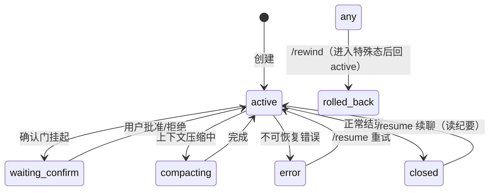

# M09 权限与会话（Permission Gate · 确认门 · Session 状态机 · Rewind）

| 项 | 值 |
|---|---|
| 生产进度 | Sprint 6 · 里程碑 **MI-2「可内测」——敢让别人用了** |
| 代码落点 | `backend/agent_godot/permission/`（risk/rules/gate/confirm）+ `session/`（manager/state/checkpoint/rewind） |
| 前置模块 | M04（工具 risk 元数据）· M06（检查点）· M03（Dispatcher 挂 gate 的位置） |
| 手写比例 | 100% 手写 |
| 教程映射 | 📘 zero2Agent 07 课 · 📝笔记 Permission/Human-in-the-loop · Claude Code 权限模型 |

---

## 0. 本模块在项目中的位置

前六周做的是"能干活的 Agent"，本模块做的是"**不闯祸的 Agent**"。内测前必须回答：删文件要不要问？联网要不要问？怎么问？问的时候任务挂起怎么办？出了事怎么撤？——权限（事前拦截）+ 会话（事中挂起/事后回溯）双系统。

**交付后状态**：高危操作弹确认（CLI 交互式 y/n；Web 端 M20 弹层）、规则可配置（permissions.yaml）、会话可暂停恢复可回滚（/rewind）、断线重连任务继续。

---

## 1. 知识点详解

### 1.1 风险分级：把"每个操作"映射到"几个等级"

**① 原理**

不可能对每个工具手工写权限逻辑——抽象出**风险等级**，工具注册时声明（M04 的 risk 字段），规则引擎按等级+路径做决策：

```text
LOW    只读无副作用：list/read/search/check        → 默认放行
MEDIUM 本地可逆写：write_file/edit_scene/create_scene → 规则决定（白名单路径放行，其余询问）
HIGH   不可逆或出边界：delete/网络请求/安装依赖/       → 默认询问；敏感配置默认拒绝
       执行任意命令/headless 运行（占资源）
```

评级三问（任何新工具过一遍）：**可逆吗？（有检查点=可逆降一级）影响范围？（项目内/系统级/网络）频率？（高频询问=疲劳，要规则化放行）**。注意：M06 检查点让"文件写"从 HIGH 降到 MEDIUM——**可恢复性决定风险等级**，这是两个模块的深层耦合。

**② 演进**：全放行（玩具）→ 全询问（没人用）→ 分级+规则+记忆（Claude Code 三级：默认安全/自动接受编辑/危险跳过；"不再询问"= 会话内规则记忆）。分级的本质是把有限的人类注意力分配给真正的风险。

**③ 最小案例**：默认规则表（permissions.yaml）

```yaml
defaults:
  low: allow
  medium: ask
  high: ask
rules:                          # 具体规则优先于默认
  - tool: write_file
    paths: ["scripts/**", "scenes/**"]     # 项目源码区
    action: allow                            # 内测期白名单直放
  - tool: delete_file
    action: deny                             # 任何路径都不许（deny 最高优先）
  - tool: godot_run_scene
    action: ask
    remember: session                        # 用户选"本次会话总是允许"时记忆
  - tool: mcp__fetch__*
    action: ask
```

**④ 易错点**
- deny > allow > ask 的优先级要显式实现（用户配了 deny 就绝不能被 allow 覆盖）
- glob 匹配要锚定项目根（`scripts/**` 不该匹配到 `../other/scripts`）
- 高频 LOW 操作误标 MEDIUM 会导致"确认疲劳"，用户开始无脑点允许——安全设计的失败形态不是拒绝太多而是麻木

### 1.2 Human-in-the-Loop：确认门的中断与恢复

**① 原理**

确认门是本模块工程难度最高的点：Loop 正在跑，Dispatcher 遇到 MEDIUM/HIGH 操作，要**暂停整条执行链等一个人回答**。两种实现风格：

```text
风格 A（同步阻塞）：await confirm() 直接等 CLI 输入 —— 简单但 Web 多租户下不可行
风格 B（挂起恢复，本项目）：
  1. Dispatcher 检出需确认 → 不执行，生成 PendingConfirm(call_id, 描述, diff 预览)
  2. Session 状态机 → waiting_confirm；Loop 把"待确认队列"持久化后正常退出（资源干净）
  3. 用户回答（CLI 输入 / Web REST 回传）→ Session → active
  4. Loop 从检查点恢复：重放上下文 + 已完成步骤，继续执行被批准/拒绝的工具
```

风格 B 的关键是"挂起时一切状态落盘"——进程崩了、浏览器关了、明天再答都能续上（同 M06 检查点与 M07 压缩纪要的存储复用）。用户拒绝后不是抛异常：把 `用户拒绝了该操作，原因：...` 作为 Observation 回填，模型据此改道（换方案/询问用户意图）——**拒绝也是信息**。

**② 演进**：同步 input()（仅 CLI）→ 回调注册（状态管理散乱）→ 状态机+持久化挂起（生产形态，Claude Code/CodeBuddy 同款）。A2A 协议里"任务挂起等人"也是一等公民（M15 呼应）。

**③ 最小案例**：挂起-恢复核心流

```python
class ConfirmGate:
    async def check(self, call: ToolCall) -> GateDecision: ...
        # allow / deny(规则直接拒) / need_confirm

    async def request(self, call: ToolCall) -> ToolResponse:
        pc = PendingConfirm(call_id=call.id, tool=call.name,
            args=call.arguments, risk=self._risk(call),
            preview=await self._preview(call))        # 写类操作附 Diff 预览
        self.session.suspend_with(pc)                  # 状态机→waiting_confirm 并落盘
        answer = await self.session.wait_resume()      # CLI:Future 由输入线程 set；Web:轮询恢复
        if answer.approved:
            return await self.dispatcher.execute_now(call)
        return ToolResponse(ok=False, error=ToolError(
            kind=ErrorKind.DENIED, tool=call.name,
            message="用户拒绝执行",
            hint="询问用户希望如何调整，或提出替代方案"))
```

**④ 易错点**
- 恢复后**不要重放已完成的副作用**（文件已写不能重写）——恢复点必须精确到"待确认的 call 之前"
- 确认信息必须带足够决策材料（Diff 预览/目标路径/影响），"是否允许 write_file? y/n"是失败设计
- 超时策略：挂起 24h 未答自动拒绝并收尾（防止会话泄漏）

### 1.3 会话状态机与断线恢复

**① 原理**

Session 不只是消息列表，是有明确生命周期的状态机：



每个状态迁移点都是持久化点（事件溯源思想：状态 = 初始 + 事件序列回放）。断线恢复的三层：

```text
L1 连接级：SSE 断了重连（M19 hub 按 Last-Event-ID 补发）
L2 任务级：Loop 进程崩了，从最近检查点重启循环（上下文用 M07 压缩纪要复原）
L3 会话级：隔天 /resume，纪要+记忆重建"它昨天做到哪了"
```

**② 演进**：内存态会话（崩=没）→ 数据库消息表（只有 L3）→ 事件溯源+检查点（三层齐备）。事件溯源的额外红利：完整轨迹就是 M17 GRPO 的训练数据原料——**生产可靠性设施与训练数据采集是同一套东西**，这是本项目最漂亮的复用。

**③ 最小案例**：事件回放恢复

```python
class SessionManager:
    async def resume(self, session_id: str) -> Session:
        events = await self.db.load_events(session_id)      # 全量事件
        s = Session.new(session_id)
        for e in events:
            s.apply(e)                                      # 确定性回放
        return s

    async def rewind_to(self, session_id: str, turn: int) -> Session:
        events = await self.db.load_events(session_id)
        kept, dropped = split_before(events, turn)
        await self.db.append(session_id, RewindEvent(turn=turn,
                           files=await self.checkpoints.rollback(task_of(turn))))
        s = Session.new(session_id)
        for e in kept: s.apply(e)
        return s
```

**④ 易错点**
- 回放必须确定性（事件里不能存"当时的时间随机数"，生成类字段要存结果不存种子）
- /rewind 同时回滚"对话状态"与"文件系统"（M06 检查点）——只回滚一半是灾难级 bug
- waiting_confirm 挂起期间用户可能改了文件 → 恢复后第一次写必须重新过乐观锁

### 1.4 /rewind 与多级撤销

**① 原理**

用户后悔的三种粒度：撤销上一步文件改动（M06 检查点单任务回滚）/**回退到第 N 轮对话**（本节，事件截断+文件回滚联动）/**回到某个命名存档点**（用户 /checkpoint save 命名，如"重构前"）。实现 = M06 的 TaskCheckpoints + 本模块事件截断的组合技：

```text
/rewind 3        → 丢掉最近 3 轮对话事件 + 回滚这 3 轮产生的所有文件检查点
/rewind list     → 可回滚点列表（每轮：时间/用户输入摘要/涉及文件）
/checkpoint save "重构前" → 命名存档（跨轮聚合检查点）
/checkpoint restore "重构前"
```

**② 演进**：Ctrl+Z（编辑器内，单文件）→ git reset（全局但粗粒度、丢工作区）→ Agent 任务级 rewind（对话+文件+记忆联动）。Claude Code 的 /rewind 是本节直接对标物。

**③ 最小案例**：见 1.3 的 `rewind_to`——注意 `files=await self.checkpoints.rollback(task_of(turn))` 这行就是"对话-文件联动"的钉子。

**④ 易错点**
- rewind 后记忆抽取要跳过被撤销的轮次（撤销的任务不应留下"完成"记忆）——Extractor 输入按 kept 事件构造
- 多次 rewind 的组合（rewind 3 再 rewind 2）等价于 rewind 5？不——第二次 rewind 的基准是"当前（已缩短的）历史"，语义要写清并测试
- 命名存档要有容量上限与过期清理（检查点目录膨胀治理）

### 1.5 规则引擎实现要点（glob + 优先级）

**① 原理**：`fnmatch` 不够（`**` 语义缺失），用 `pathlib.PurePath.match` 或自实现分段 glob：`scripts/**` 匹配 scripts 下任意深度；`*.gd` 只匹配当前层。规则求值顺序：**deny 全表 → 精确路径规则 → 通配规则 → defaults[risk]**，首个命中即返回。

**②③④ 合并要点**：匹配函数 15 行（`PurePosixPath` 统一化 + 分段匹配）；易错：Windows 反斜杠先 posix 化、`**` 与 `*` 混用语义表要写单测表驱动（10 个用例起步）。

---

## 2. 接口设计（完整签名）

```python
# permission/risk.py
class RiskLevel(Enum): LOW="low"; MEDIUM="medium"; HIGH="high"

# permission/rules.py
@dataclass
class PermissionRule:
    tool: str                          # 支持 "mcp__fetch__*" 通配
    paths: list[str] | None = None
    action: Literal["allow", "ask", "deny"]
    remember: Literal["never", "session", "always"] = "never"

class RuleEngine:
    def __init__(self, config_path: Path): ...        # permissions.yaml
    def decide(self, tool: str, args: dict) -> Decision: ...
    def grant_session(self, rule_hash: str) -> None: ...   # "本次会话不再问"
    def snapshot_for_resume(self) -> list[PermissionRule]: ...  # 会话级授权随会话持久化

# permission/gate.py + confirm.py
@dataclass
class GateDecision: action: Literal["allow","deny","need_confirm"]; reason: str

class PermissionGate:
    def __init__(self, rules: RuleEngine, session: "Session"): ...
    async def check(self, call: ToolCall) -> GateDecision: ...

@dataclass
class PendingConfirm:
    call_id: str; tool: str; args: dict
    risk: RiskLevel; preview: str | None      # Diff/命令预览
    expires_at: float

# session/state.py + manager.py + rewind.py
class SessionState(Enum):
    ACTIVE="active"; WAITING_CONFIRM="waiting_confirm"; COMPACTING="compacting"
    ERROR="error"; ROLLED_BACK="rolled_back"; CLOSED="closed"

class Session:
    def apply(self, event: SessionEvent) -> None: ...          # 事件回放
    async def suspend_with(self, pc: PendingConfirm) -> None: ...
    async def wait_resume(self) -> ConfirmAnswer: ...

class SessionManager:
    async def create(self, project_id: str) -> Session: ...
    async def resume(self, session_id: str) -> Session: ...
    async def rewind(self, session_id: str, turns: int) -> RewindReport: ...
    async def checkpoint_named(self, session_id: str, name: str) -> None: ...
```

## 3. 关键难点参考片段：恢复点的精确重构

挂起恢复后，Dispatcher 上下文里的"已完成步骤"必须精确重放，核心是恢复函数按事件重建：

```python
async def resume_loop_from(self, session: Session) -> None:
    pc = session.pending_confirm                     # 挂起原因
    answer = pc.answer                               # 恢复时已被填（CLI/Web 两路）
    events = session.events_since_suspend()
    # 已完成的同批 calls 里，除 pc.call_id 外都已执行过 → 构造"已完成响应表"
    done = {e.call_id: e.response for e in events if isinstance(e, ToolDoneEvent)}
    if answer.approved:
        done[pc.call_id] = await self.dispatcher.execute_now(pc.as_call())
    else:
        done[pc.call_id] = denied_response(pc)
    await self.loop.continue_with(session, done)     # 从"观察回填"步继续，不重放副作用
```

为什么难：**"同批并行 calls 部分确认"** 的组合——5 个并行调用 3 个免确认已执行、2 个待确认，用户批 1 拒 1。恢复逻辑必须精确知道哪 3 个别再跑。测试要覆盖这个组合。

## 4. 手敲指引

| 步骤 | 文件 | 做什么 | 验证 |
|---|---|---|---|
| 1 | risk/rules.py | yaml 加载 + glob 引擎 | 表驱动 10 用例 |
| 2 | session/state.py | 状态机 + 事件表 | 非法迁移抛错 |
| 3 | session/manager.py | 事件回放 resume | 杀进程重启回放一致 |
| 4 | confirm.py | CLI 确认 Future 桥 | input 线程 set Future |
| 5 | gate.py | 挂起-恢复全流 | 批准/拒绝两路集成测 |
| 6 | rewind.py | 对话+文件联动回滚 | rewind 3 后文件与对话同步 |
| 7 | 接线 | Dispatcher 前置 gate | 高危工具必弹确认 |

## 5. 测试与验收

```python
async def test_deny_rule_never_overridden():
    engine = load_rules({"rules":[{"tool":"delete_file","action":"deny"}]})
    assert engine.decide("delete_file", {}).action == "deny"

async def test_partial_batch_confirm_resume():
    # 5 并行 calls：3 allow 已执行 + 2 待确认，批 1 拒 1
    # 断言：已执行的 3 个无二次副作用（文件 mtime 不变）

async def test_rewind_reverts_dialog_and_files():
    # 两轮写文件任务 → rewind(2) → 文件内容恢复且会话纪要回到第 0 轮
```

**验收 Demo（MI-2 里程碑）**：`craft "删除 tests 目录并重命名 player"` → delete 弹确认（拒绝后模型改道）→ rename 弹确认（批准）→ `/rewind 1` 对话与文件同时恢复 → 会话中途 Ctrl+C 杀进程 → 重启 `/resume` 从确认门继续。

## 6. 踩坑记录（留白）

| 日期 | 坑 | 现象 | 根因 | 解法 | 关联知识点 |
|---|---|---|---|---|---|
|     |    |     |     |    |          |

## 7. 面试拷打

1. 风险分级的三个评估维度？为什么"可恢复性"能降级？
2. deny/allow/ask 的优先级怎么实现？glob 的 `**` 与 `*` 语义差异？
3. 确认门的"挂起-恢复"为什么不能简单 await input()？Web 场景下流程完整走一遍；
4. 用户拒绝工具调用后，为什么把拒绝当 Observation 回填而不是抛异常？
5. 同批并行调用部分待确认，恢复时怎么防副作用重放？
6. 事件溯源恢复会话为什么必须确定性？哪些东西不能进事件？
7. /rewind 的"对话-文件-记忆"三联动，漏一个会怎样？
8. 断线恢复三层（连接/任务/会话）分别解决什么？
9. 确认疲劳是什么？怎么从产品设计上防？
10. 开放题：设计权限的"审计三问"——谁在何时批准了什么？（审计日志的事件 schema 设计）

## 8. 教程映射与延伸

- 📘 zero2Agent 07 课（permission & session）
- 必读：Claude Code 权限模型文档（settings 的 allow/deny/ask 语义对照）
- 选读：A2A 协议的 task-state（waiting-for-input 状态即确认门的协议化）
