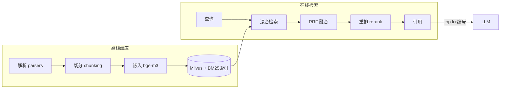

# M10 RAG（解析 · 切分 · 混合检索 · RRF · 重排 · 引用溯源）

| 项 | 值 |
|---|---|
| 生产进度 | Sprint 7 · 里程碑 MI-3a「知识库问答带引用」（两周大模块） |
| 代码落点 | `backend/agent_godot/rag/`（6 个子模块 12 个文件，见 §0.5） |
| 前置模块 | M01（embedding/InfoNCE）· M07（RAG 注入分区） |
| 手写比例 | 应用层 100% 手写（解析/切分/RRF/引用）；BM25 手写教学版；Milvus/bge-m3 用库 |
| 教程映射 | 📙 all-in-rag（主力教材）· 📗 hello-agents RAG 章 · 📝笔记 RAG |

---

## 0. 本模块在项目中的位置

**大白话**：模型不知道你项目的细节，也不知道最新的 Godot 4.4 变更——RAG 就是给 Agent 配一个**开卷考场**：闭卷（纯模型）靠背诵，会幻觉会过时；开卷（RAG）先翻书再答题，答案带页码（引用）。整条流水线是图书馆的数字化复刻：**采购编目**（解析入库）→**按主题上架**（切分+嵌入）→**读者提问后馆员双路找书**（向量检索=按意思找、BM25=按书名找）→**汇总去重排序**（RRF）→**馆长精挑**（重排）→**给出带页码的答案**（引用溯源）。

本项目两大数据源：Godot 官方文档库（预置）+ 用户上传（PDF/URL/项目代码库）。

**交付后状态**："CharacterBody2D 的 move_and_slide 返回值在 4.3 改了什么？"——答案带文档链接与原文高亮，而非模型幻觉。



---

## 0.5 ★ 施工文件清单（开工前必看的一页表）

**本模块你一共要新建 14 个文件**（两大块：先实验吃透算法，再工程化建管线）：

| # | 新建文件（完整路径） | 职责一句话 | 关键类/函数 | 预估行数 | 手敲步骤(§4) | 依赖 |
|---|---|---|---|---|---|---|
| 1 | `lab/m10/bm25.py` | 手写 BM25 教学版 | `MiniBM25` | 40 | 步骤 1 | 无 |
| 2 | `lab/m10/rrf.py` | RRF 融合实验 | `rrf_fuse` | 20 | 步骤 2 | 无 |
| 3 | `rag/__init__.py` 等 | 空包 | — | 2 | 步骤 0 | — |
| 4 | `rag/parsers/__init__.py` | 3 类解析器分发 | `get_parser`、`MarkdownParser/URLParser/PDFParser` | 100 | 步骤 3 | 无 |
| 5 | `rag/chunking/recursive.py` | 递归切分（默认） | `recursive_split` | 50 | 步骤 4 | 无 |
| 6 | `rag/chunking/structure_aware.py` | 结构感知切分 | `StructureAwareChunker` | 80 | 步骤 4 | M06 符号解析 |
| 7 | `rag/embedding.py` | bge-m3 服务接入 | `EmbeddingService` | 50 | 步骤 5 | TEI 容器 |
| 8 | `rag/retrieval/vector_index.py` | Milvus 封装 | `VectorIndex` | 90 | 步骤 5 | pymilvus |
| 9 | `rag/retrieval/bm25_index.py` | 工程版稀疏索引（jieba） | `BM25Index` | 60 | 步骤 6 | jieba |
| 10 | `rag/retrieval/hybrid.py` | 两路检索+RRF | `HybridRetriever` | 50 | 步骤 6 | 8/9 |
| 11 | `rag/rerank.py` | 交叉编码精排 | `Reranker` | 40 | 步骤 7 | TEI rerank |
| 12 | `rag/citation.py` | 引用渲染与抽取 | `CitationFormatter` | 50 | 步骤 7 | 无 |
| 13 | `rag/pipeline.py` | 建库流水线（增量） | `IngestPipeline.upsert_document` | 70 | 步骤 8 | 全部 |

**完成后你拥有**：MI-3a 验收 Demo（2 万页 Godot 文档问答带引用）+ 增量更新不残留旧 chunk。

---

## 1. 知识点详解（每节五段：定义 → 大白话 → 举例 → 演进 → 易错点）

### 1.1 文档解析与切分（决定上限的脏活）

**① 严格定义**："Garbage in, garbage out"——切分质量直接封顶检索质量。两条铁律：**语义完整**（不把一个函数/一节文档切两半）与**长度适中**（目标 256~512 token，重叠 10%~15%——太短丢上下文，太长稀释相似度）。切分策略谱系：固定长度 / 分隔符 / **递归切分（本项目默认）** / 语义切分 / **结构感知（.gd 与 Godot 文档启用）**。

**② 大白话**：**切菜准备工序**。火锅店切土豆片：不管纹理乱剁（固定长度）——土豆断在中间，涮的时候碎；顺着纹理切（结构感知）——每片完整。切太厚（chunk 太长）一锅只能涮几片还难熟透（相似度稀释）；切太薄（太短）没有口感（丢上下文）。重叠窗口=每片故意带一点上一片的边——防止"纹理恰好断在两片之间"的语义断裂。**结构感知切分器**（本项目特色）：`.gd` 按 M06 轻量 AST 的函数边界切、chunk 头部补"所属类+前导注释"；Godot 文档按 H2 切、chunk 保留面包屑路径（`Vector math > Advanced > Dot product`）——**chunk 自带定位信息，检索命中后引用更准**。

**③ 举例**：递归切分器核心（可直接进 chunking/recursive.py）：

```python
SEPARATORS = ["\n\n## ", "\n\n### ", "\n\n", "\n", "。", ". ", " ", ""]

def recursive_split(text: str, max_len: int, overlap: int = 0) -> list[str]:
    if len(text) <= max_len:
        return [text]
    for sep in SEPARATORS:                      # 优先级从高到低
        if sep in text:
            parts = text.split(sep)
            chunks, buf = [], ""
            for p in parts:
                candidate = (buf + sep + p) if buf else p
                if len(candidate) > max_len and buf:
                    chunks.append(buf); buf = p          # 满了就出块
                else:
                    buf = candidate
            if buf: chunks.append(buf)
            return chunks                             # 本级分隔符够用就返回
    return hard_split(text, max_len, overlap)         # 兜底硬切+重叠
```

**④ 演进**：固定窗口（初代）→ 递归分隔符（2023 事实标准，LangChain 同思想）→ 语义切分（embedding 相邻句相似度骤降处断开，Greg Kamradt 推广）→ **contextual chunking**（Anthropic 2024：每 chunk 让 LLM 生成一句"它在全文中的位置"，召回率显著提升）→ Agentic RAG（M12）。主线：**切分从"文本操作"进化为"语义操作"**。

**⑤ 易错点**：
- 重叠窗口不是万能药：15% 是成本与边界的折中，重叠过大导致近重复 chunk 污染检索（同一文档霸榜）
- PDF 解析是深坑（表格/双栏/扫描件），pypdf 起步、复杂 PDF 明示"建议转 Markdown"
- chunk 里必须存 metadata（source/heading/行号），没有它们检索后无法引用溯源

### 1.2 嵌入与 Milvus 接入（手写接入层）

**① 严格定义**：bge-m3 本地起服务（deploy/compose 的 TEI 容器），一个事实源三用途：RAG 嵌入 / 语义缓存（M02）/ 记忆嵌入（M08）——**同一模型保证相似度空间一致**。Milvus collection schema 手写是本节交付物（见原文签名）。

**② 大白话**：嵌入服务是**全公司的统一度量衡**。三处业务（RAG/缓存/记忆）都要"量相似度"——如果各用各的尺子（不同嵌入模型），量出来的数值互不可比，M02 语义缓存的 0.92 阈值拿到 M08 就失效。Milvus 是**图书馆的智能书架**：按"语义坐标"上架（HNSW 索引），取书时不用遍历全馆（O(log N) 图导航 vs O(N) 暴力扫）。

**③ 举例**：bge-m3 的 query 前缀（M01 埋的坑在此兑现）：

```python
async def embed_query(self, q: str) -> list[float]:
    return await self._serve(["为这个句子生成表示以用于检索相关文章：" + q])[0]
    # ★ bge 系列 query 要加指令前缀，document 不加——漏掉召回率掉 5~10 个点
```

HNSW 参数直觉（面试常问）：M=每节点最大连接数（内存↑召回↑）；efConstruction=建图候选队列长度（建库慢/质量好）；查询 ef 动态调（速度/精度旋钮）。思想：跳表式分层图，上层稀疏快速导航、底层稠密精确逼近。

**④ 演进**：FAISS（库，单机）→ Milvus（分布式、增量删改）→ 向量+标量混合过滤（kind/doc_id 过滤）。选 Milvus 的实际理由：**doc_id 删除**（用户删文档要能删向量）FAISS 做不到。

**⑤ 易错点**：
- collection 的 dim 必须与模型输出一致（1024）；**换嵌入模型=全量重建库**
- 归一化向量后 IP(内积)==余弦；未归一化时两者不等——建库统一 L2 归一化
- Milvus Lite（本地文件）到 Standalone（容器）数据不互通，部署形态早期定死

### 1.3 BM25 手写教学版（稀疏检索的活化石）

**① 严格定义**：BM25 = 词频饱和 + 文档长度归一 + 逆文档频率：

$$
score(q,d) = \sum_{t \in q} IDF(t) \cdot \frac{f(t,d)\cdot(k_1+1)}{f(t,d) + k_1\cdot(1 - b + b\cdot |d|/avgdl)}
$$

直觉：词在本文档出现越多分越高（k₁=1.5 封顶饱和防刷词）；文档越长稀释越重（b=0.75 调节惩罚）；全局越罕见的词权重越大（IDF）。

**② 大白话**：BM25 是**关键词匹配的老法师**。你问"max_contacts_reported 在哪定义"——它不懂语义，但它知道：全库只有 3 篇文档含这个词（IDF 极高，稀有词是大线索）、含 5 次的那篇比含 1 次的更可能是正主（词频），但如果那篇是 10 万字巨著则打折扣（长文档稀释）。**与向量检索互补**：API 名是"生僻 token"，嵌入空间里反而容易糊（M01 分词讲过：低频词拆成子词/字节，语义被打散）；BM25 精确抓术语，向量抓语义改写——两路各补对方瞎区。

**③ 举例**：`lab/m10/bm25.py` 手写教学版（可直接抄，40 行）：

```python
import math, re
from collections import Counter

class MiniBM25:
    def __init__(self, docs: list[str], k1: float = 1.5, b: float = 0.75):
        self.k1, self.b = k1, b
        self.docs = [re.findall(r"\w+", d.lower()) for d in docs]
        self.N = len(docs)
        self.avgdl = sum(map(len, self.docs)) / self.N
        self.tf = [Counter(d) for d in self.docs]
        self.df = Counter(w for d in self.docs for w in set(d))

    def idf(self, w):
        return math.log((self.N - self.df[w] + 0.5) / (self.df[w] + 0.5) + 1)

    def search(self, query: str, top_k: int = 5):
        qs = re.findall(r"\w+", query.lower())
        scores = []
        for i, d in enumerate(self.docs):
            s = sum(self.idf(w) * (self.tf[i][w] * (self.k1 + 1)) /
                    (self.tf[i][w] + self.k1 * (1 - self.b + self.b * len(d) / self.avgdl))
                    for w in qs)
            scores.append((s, i))
        return sorted(scores, reverse=True)[:top_k]
```

**④ 演进**：TF-IDF（无饱和无归一）→ BM25（1994，至今稀疏 baseline 王者）→ SPLADE（学习型稀疏，选读）。生产 ES/OpenSearch 内置 BM25；本项目手写教学版 + rank_bm25 对照验证。

**⑤ 易错点**：
- 中文要 jieba 分词后进 BM25，整句 `\w+` 会把整句当一个词
- IDF 里 +1 防 df=0 除零（查询词不在库中）——公式里最常被漏的平滑项
- BM25 分数无界不可跨查询比较——只用于同查询内排序

### 1.4 混合检索与 RRF 融合

**① 严格定义**：两路检索（向量 top50 + BM25 top50）合成一个榜单用 **RRF**：

$$
RRF(d) = \sum_{r} \frac{1}{k + rank_r(d)}, \quad k=60
$$

每个文档得分=它在各榜单中"倒数排名"之和——**不依赖原始分数量纲**，两路都命中的文档累加两份倒数（共识文档浮上来）。

**② 大白话**：**两位评委独立打分后的计票规则**。向量检索员按"意思像不像"排序，BM25 检索员按"术语命中"排序——两人的分数量纲完全不同（余弦 0~1 vs BM25 0~25），直接加权平均就是"拿身高加体重"的笑话。RRF 聪明地在**只看名次**：每路第 1 名得 1/61 分、第 2 名 1/62…两路都给好评的文档拿到两票，自然登顶；只有单路认可的吃单边票。k=60 是"防止第 1 名独裁"的平滑——名次差 1 的两位差距不至于悬殊。

**③ 举例**（融合器全量，生产直接用）：

```python
def rrf_fuse(rankings: list[list[str]], k: int = 60, top_k: int = 10):
    scores: dict[str, float] = {}
    for ranking in rankings:                       # 每路一个有序 id 列表
        for rank, doc_id in enumerate(ranking, start=1):
            scores[doc_id] = scores.get(doc_id, 0) + 1.0 / (k + rank)
    return sorted(scores.items(), key=lambda x: -x[1])[:top_k]

# vec_rank  = [A, B, C, D]      （余弦序）
# bm25_rank = [B, E, A, F]      （词法序）
# rrf: A=1/61+1/63  B=1/62+1/61  → B、A 靠前，E、C 各吃单边票
```

**④ 演进**：单路向量（语义强术语弱）→ 加权分数融合（量纲地狱：0.87 余弦怎么和 11.3 的 BM25 加权？）→ RRF（2019，零参可解释）→ 学习型融合 LTR（要训练数据，本项目不做）。RRF 是工程默认起点。

**⑤ 易错点**：
- rank 从 1 开始；k=60 经验值，调小头部更支配（更"精英"），调大更平均
- 两路 doc_id 必须同构（同一 chunk 同一主键）——id 对不齐 RRF 直接失效
- 两路同预算（top50+top50），单路太短 RRF 偏科

### 1.5 重排（Cross-Encoder Rerank）与引用溯源

**① 严格定义**：**双塔（bi-encoder）**：query 与 doc 各自编码成向量再算相似度——可离线建库、速度快，但两文本编码时"互相看不见"，细粒度匹配弱。**交叉编码（cross-encoder）**：query 与 doc 拼接后**一起**进模型直接输出相关分——精度高一截，但每对都要跑一次模型、无法预计算。分工：**粗排召回（双塔，毫秒级百万→50）→ 精排（交叉编码，百毫秒级 50→10）**。引用溯源（citation）：回答里每个论断挂 chunk 编号 `[1][3]`，前端点击跳原文高亮。

**② 大白话**：双塔是**简历筛选**（HR 各自给简历和岗位打标签再匹配，快但粗——一秒筛一万份）；交叉编码是**面试官面谈**（候选人和岗位要求放在一起当场评估，准但慢——一天面不了几个）。所以先简历筛到 50 人，再面试挑 10 人。引用是**论文的参考文献**——没有引用的回答等于"我听说"（与幻觉无法区分），带 [n] 的回答是"文献可查"（用户可验证）——**信任基石**。

**③ 举例**：注入格式与提示约束：

```python
def render_context(self, chunks: list[Chunk]) -> str:
    return "\n\n".join(
        f"[{i}] ({c.source}#{c.heading})\n{c.text}" for i, c in enumerate(chunks, 1))

CITE_PROMPT = "回答时必须标注依据：论断后附 [编号]；多个依据并列写出；"
              "检索结果不足以回答时明确说'知识库未覆盖'，禁止编造。"
```

**④ 演进**：单级向量 → 混合+RRF → 加 rerank（bge-reranker-v2-m3 开源标配）→ Agentic 检索（M12）。引用侧：无引用 → 尾注列表 → 行内 span 级引用（法学/医疗级）。

**⑤ 易错点**：
- rerank 输入是 `(query, doc)` 文本对（成对拼接），别喂成两路向量
- rerank 后不要用阈值砍到"全空也不放过"——有时全体不相关，应让模型看到空结果
- 引用编号在流式输出里会先于内容出现（模型先写 [1] 再写论断），前端渲染要容忍乱序

---

## 2. 接口设计（完整签名）

```python
# rag/parsers/
class Parser(Protocol):
    def parse(self, source: Path | str) -> ParsedDoc: ...
    # ParsedDoc: text + 结构(标题树/代码块标记) + metadata
def get_parser(kind: Literal["pdf","md","html","url","gdscript"]) -> Parser: ...

# rag/chunking/
@dataclass
class Chunk:
    text: str; source: str; heading: str
    start: int; doc_id: str; kind: str
class Chunker(ABC):
    def split(self, doc: ParsedDoc) -> list[Chunk]: ...
class RecursiveChunker(Chunker): ...          # 默认
class StructureAwareChunker(Chunker): ...     # .gd / 文档

# rag/embedding.py
class EmbeddingService:
    async def embed_documents(self, texts: list[str]) -> list[list[float]]: ...
    async def embed_query(self, q: str) -> list[float]: ...   # 带前缀

# rag/retrieval/
@dataclass
class RetrievalHit: chunk: Chunk; score: float; from_: set[str]
class VectorIndex:
    def upsert(self, chunks: list[Chunk]) -> int: ...
    def delete_doc(self, doc_id: str) -> None: ...
    async def search(self, q_emb, top: int, filter_kind: str | None): ...
class BM25Index:
    def build(self, chunks: list[Chunk]) -> None: ...
    def search(self, query: str, top: int) -> list[tuple[str, float]]: ...
class HybridRetriever:
    def __init__(self, vec, bm25, k_rrf: int = 60): ...
    async def retrieve(self, query: str, top_k: int = 10) -> list[RetrievalHit]: ...

# rag/rerank.py
class Reranker:
    async def rerank(self, query: str, hits: list[RetrievalHit],
                     top_k: int = 5) -> list[RetrievalHit]: ...

# rag/citation.py
class CitationFormatter:
    def render_context(self, hits: list[RetrievalHit]) -> str: ...
    def extract_citations(self, answer: str) -> list[int]: ...
```

---

## 3. 关键难点参考片段：建库流水线（增量更新）

全量重建简单，增量才是生产题：用户改了 1 个文档，只重建它的 chunks 且删旧向量：

```python
async def upsert_document(self, doc: ParsedDoc) -> int:
    new_chunks = self.chunker.split(doc)
    old = await self.db.chunk_ids_of(doc.doc_id)
    if old:
        await self.vec.delete_doc(doc.doc_id)        # 向量先删
        self.bm25.remove(old)                        # 稀疏索引同步删
    self.bm25.build_incremental(new_chunks)          # 增量插入
    embs = await self.embedder.embed_documents([c.text for c in new_chunks])
    await self.vec.upsert_with_emb(new_chunks, embs)
    await self.db.replace_chunks(doc.doc_id, new_chunks)   # 元数据最后原子替换
    return len(new_chunks)
```

为什么难：三个存储（Milvus/BM25/元数据库）的一致性——任何一步崩都会漂移。顺序（先删后插、元数据收尾）保证"最坏情况是多删可重建"，可加对账任务（三处计数不一致告警）。

---

## 4. 手敲指引（函数级伪代码）

| 步骤 | 文件 | 函数级作用（伪代码） | 验证 |
|---|---|---|---|
| 1 | `lab/m10/bm25.py` | `__init__：分词+统计 tf/df/avgdl；idf：对数公式+1 平滑；search：逐文档累加查询词得分排序` | 与 rank_bm25 排序 Spearman>0.9 |
| 2 | `lab/m10/rrf.py` | `rrf_fuse：双榜倒数名次累加→排序截断` | §1.4 手算用例对拍 |
| 3 | `rag/parsers/` | `get_parser 按扩展名分发；MarkdownParser：frontmatter+标题树提取；URLParser：httpx+正文抽取；PDFParser：pypdf 逐页+页码 metadata` | 3 类样本进统一 ParsedDoc |
| 4 | `rag/chunking/` | `recursive_split：§1.1 ③ 代码；StructureAwareChunker：.gd 走 M06 符号边界+类名回填头部、文档走 H2+面包屑` | .gd 按函数切、文档按 H2 切 |
| 5 | `embedding.py`+`vector_index.py` | `embed_query：加 bge 前缀；VectorIndex：schema 定义（§1.2）+upsert（批量 embed+insert）+delete_doc（expr 过滤删）+search（IP 度量+标量 filter）` | 建库 1000 chunks <1min |
| 6 | `hybrid.py` | `retrieve：embed_query→vec.search(top50) ∥ bm25.search(top50)→rrf_fuse→回填 RetrievalHit.from_` | API 名查询 BM25 路显著贡献 |
| 7 | `rerank.py`+`citation.py` | `rerank：(query,doc) 对批量调 TEI rerank 端点→按分截断；render_context：§1.5 ③；extract_citations：正则 \[(\d+)\]` | 回答带 [n] 且可点验 |
| 8 | `pipeline.py` | `upsert_document：§3 难点代码` | 改文档后旧 chunk 不残留 |

---

## 5. 测试与验收

```python
def test_bm25_matches_reference_implementation():
    # 同语料同查询，自实现 top5 与 rank_bm25 的排序（Spearman）> 0.9

async def test_hybrid_beats_single_route_on_api_names():
    # 查询 "max_contacts_reported 4.3 变更"：混合 top1 命中，纯向量 top5 不中

async def test_upsert_replaces_old_chunks():
    # doc 改后重灌：chunk 数量变化、旧 heading 检索不到

async def test_answer_citations_all_resolvable():
    # 抽取回答里全部 [n]，均存在于注入 chunk 集
```

**验收 Demo（MI-3a）**：导入 Godot 4.3 官方文档（约 2 万页）→ `ask "Area2D 的 body_entered 信号在什么条件下触发？和 monitored 属性什么关系？"` → 回答逐句带 [n]，点开 [2] 高亮文档原文；追问 "move_and_slide 的返回值语义"——API 术语查询验证 BM25 路。

---

## 6. 踩坑记录（留白自填）

| 日期 | 坑 | 现象 | 根因 | 解法 | 关联知识点 |
|---|---|---|---|---|---|
|     |    |     |     |    |          |

---

## 7. 面试拷打（附详细参考答案）

**1. 切分为什么 256~512 token？重叠窗口解决什么、带来什么？**
答：下界：嵌入模型对超短文本的语义表达不足，且 chunk 太短丢上下文（"返回 true"单独一个 chunk 毫无意义）；上界：太长稀释相似度（一个 chunk 塞三个主题，查询只匹配其中一个，平均相似度被拉低）且注入时浪费预算。256~512 是"语义单元完整性与相似度聚焦"的平衡带。重叠解决**边界语义断裂**：关键句恰好横跨切分点时，两个 chunk 各含一半+重叠区保证至少一个 chunk 完整含它；代价：存储与检索的近重复污染（同文档多 chunk 霸榜）——15% 是折中，不是越大越好。

**2. contextual chunking 是什么？为什么能提升召回？**
答：Anthropic 2024 技术：切分后让 LLM 为每个 chunk 生成一句"你在全文中的位置/角色"（如"这是《角色物理》第 3 节 move_and_slide 的返回值说明"），把这句话拼在 chunk 前再嵌入。提升召回的原因：脱离原文的 chunk 是"孤岛"——"返回 true 表示发生碰撞"这句话单看与碰撞查询的相似度一般；加上定位句后，chunk 的嵌入向量携带了全局语境（Godot/物理/碰撞），与相关查询的相似度显著提高。代价：每 chunk 一次 LLM 调用（建库成本上升）。本项目的"面包屑+类名回填"是它的零成本轻量版。

**3. 手推 BM25：k₁ 和 b 分别控制什么？IDF 为什么 +1？**
答：k₁（默认 1.5）控制**词频饱和速度**：分母里 f(t,d)+k₁(...) 的结构使 tf 增益随词频递减，k₁→∞ 退化为线性 tf（无饱和），k₁→0 则只看有无（布尔化）——防关键词刷屏。b（默认 0.75）控制**文档长度归一强度**：|d|/avgdl 项让长文档的词频贡献打折，b=1 完全归一（长文档重度惩罚），b=0 不归一。IDF 的 +1（准确说是公式整体 +1 平滑）：查询词可能完全不在库中（df=0），此时 (N-0+0.5)/(0+0.5)=2N+1 取对数仍为有限值而非除零崩溃——平滑项保证未见过的词也有合理（偏低但非负）的权重。

**4. 为什么向量检索对 API 名这类"生僻术语"反而弱？混合检索怎么互补？**
答：根本原因在分词与嵌入训练分布：API 名（max_contacts_reported）是"低频 token 组合"——M01 讲过 BBPE 下低频内容拆成子词/字节，嵌入对这种碎片化组合的语义表达弱；且嵌入训练语料以自然语言为主，代码符号的分布稀疏。BM25 天然免疫：它只做精确 token 匹配，生僻词反而 IDF 高、信号强。互补形态：语义改写型查询（"怎么让角色碰墙不掉下去"→向量找到 move_and_slide 文档）与术语型查询（"max_contacts_reported"→BM25 精确命中）各走各的强区，RRF 融合共识。

**5. RRF 为什么不融合原始分数？k=60 调大调小各什么效果？**
答：不融原始分因为**量纲不可比**：余弦 [0,1]、BM25 [0,25+]、SPLADE 又是一套——任何加权方案都要先解决归一化，而归一化对分布形状敏感（长尾 vs 均匀），调参地狱。RRF 只用名次（每个 ranker 内部序关系天然可比），零参数跨量纲。k 的效果：k 是名次差的平滑器——k 小（如 10）：第 1 名 1/11 vs 第 2 名 1/12，差距大，头部排名支配性强（"精英制"，单路第 1 名可能压过双路第 3/4 名）；k 大（如 100）：名次差距被抹平，更接近"出现次数投票"（"平均制"，共识文档更占优）。60 是原论文经验值，兼顾两者。

**6. 双塔与交叉编码的本质区别？粗排+精排的分工边界？**
答：本质区别在**编码时是否互相看见**：双塔 query/doc 独立编码（互相看不见），相似度=两向量点积——doc 可离线预计算（建库），在线只算 query 一次，毫秒级扫百万；代价是细粒度交互损失（词级对齐信息在各自池化时被压缩）。交叉编码把 query+doc 拼接后一起过 transformer，注意力层直接做词级对齐——精度高一截，但每对都要完整前向，无法预计算。分工边界：粗排管"召回率"（从百万降到 50，绝不能漏），用双塔；精排管"精度"（50 挑 10，排序要准），用交叉编码。边界由成本画定：交叉编码的吞吐（百 ms/批）只够处理几十个候选。

**7. rerank 输入是向量还是文本对？为什么？**
答：文本对 `(query, doc_text)` 拼接输入。因为交叉编码的全部价值就在"两段文本同场注意力交互"——喂向量等于把交互机会（它存在的理由）提前杀死，退化成双塔。工程细节：模型输入格式是 `[CLS] query [SEP] doc [SEP]`，超长 doc 要截断（rerank 模型 max_len 通常 512~1024，chunk 设计成 512 token 的原因之一）；批量打分要组 batch 提吞吐。

**8. 引用溯源为什么是信任基石？span 级引用怎么做？**
答：没有引用的 RAG 回答与幻觉在用户视角不可区分（都是模型说的一段话）——引用把"模型观点"升级为"可验证主张"：用户点 [2] 直接看原文，错了立刻发现，信任建立在可验证性上；也是幻觉的**事后检测接口**（引用对不上=幻觉实锤）。span 级（行内精确到句）实现：生成时要求模型输出 `<cite id=2>论断</cite>` 式标记；或后处理——用 rerank 模型对"论断句 × 各 chunk 句"逐句对齐打分取最优 span；前端高亮该 span。法学/医疗场景需要 span 级，一般场景 chunk 级够用。

**9. 增量更新时三个存储的一致性怎么保证？最坏情况是什么？**
答：三存储=Milvus（向量）、BM25（内存/磁盘索引）、元数据库（chunk 记录）。一致性策略：**操作顺序设计成"最坏可恢复"**——先删旧（向量→稀疏）再插新、元数据最后原子替换（单事务）：中途崩在最坏情况=该文档在新旧之间"多删"（检索不到，但不脏），重建一次即愈；绝不会出现"旧向量残留+新元数据"的脏命中。辅以对账任务：定期比对三处 doc_id→chunk 计数，不一致告警+触发重建。分布式下的更强方案（Outbox 模式/事件驱动同步）在 M19 顺带讲。

**10. 开放题：评估 RAG 质量的指标体系？**
答：四层指标（RAGAS 框架）：①**检索层**：recall@k（该找到的 chunk 是否在前 k）/ MRR（正确结果的排名倒数均值）/ precision@k——用标注的 query→chunk 对测；②**忠实度 faithfulness**：回答的每个论断能否被检索到的 chunk 支持（LLM 评判分解论断→逐条验证有无出处）——量幻觉率；③**答案相关性**：回答是否切题（LLM 评判或人工）；④**端到端**：带引用的回答里引用可解析率、用户反馈（点赞/纠错）。评估集构造：从 Godot 文档人工出 50 题标注标准 chunk + 标准答案要点。分层测的意义：忠实度低但 recall 高=生成侧问题（提示词/模型）；recall 低=检索侧问题（切分/嵌入/融合参数）——指标体系要能**定位责任层**。

---

## 8. 教程映射与延伸

- 📙 all-in-rag 全书（本项目 RAG 主线教材）
- 📗 hello-agents RAG 章（对照简化版实现）
- 必读：RRF 原论文（Cormack 2009，3 页）；Anthropic contextual chunking 博客
- 选读：HNSW 论文（Malkov 2016）；SPLADE；RAGAS 文档
