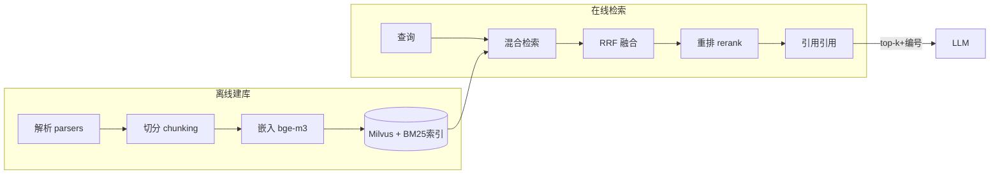

# M10 RAG（解析 · 切分 · 混合检索 · RRF · 重排 · 引用溯源）

| 项 | 值 |
|---|---|
| 生产进度 | Sprint 7 · 里程碑 MI-3a「知识库问答带引用」（两周大模块） |
| 代码落点 | `backend/agent_godot/rag/`（parsers/chunking/embedding/retrieval/rerank/citation） |
| 前置模块 | M01（embedding/InfoNCE）· M07（RAG 注入分区） |
| 手写比例 | 应用层 100% 手写（解析/切分/RRF/引用）；BM25 手写教学版；Milvus/bge-m3 用库 |
| 教程映射 | 📙 all-in-rag（主力教材）· 📗 hello-agents RAG 章 · 📝笔记 RAG |

---

## 0. 本模块在项目中的位置

模型不知道你项目的细节，也不知道最新的 Godot 4.4 变更——RAG 把"检索"插进"生成"前：**用户问 → 检索相关片段 → 注入上下文 → 带引用回答**。本项目两大数据源：Godot 官方文档库（预置）+ 用户上传（PDF/URL/项目代码库）。

**交付后状态**："CharacterBody2D 的 move_and_slide 返回值在 4.3 改了什么？"——答案带文档链接与原文高亮，而非模型幻觉。



---

## 1. 知识点详解

### 1.1 文档解析与切分（决定上限的脏活）

**① 原理**

"Garbage in, garbage out"——切分质量直接封顶检索质量。两条铁律：**语义完整**（不把一个函数/一节文档切两半）与**长度适中**（太短丢上下文，太长稀释相似度；目标 256~512 token，重叠 10%~15%）。

切分策略谱系：

```text
固定长度    按字符硬切            快但惨烈（函数被腰斩）
分隔符切分  按 \n\n / 标题切      Markdown 友好
递归切分    优先段落→句子→字符逐级降级（LangChain RecursiveCharacterTextSplitter 思想）★本项目默认
语义切分    embedding 相邻句相似度骤降处断开    更准但每篇多 N 次嵌入调用
结构感知    代码按函数/类边界，文档按 H2/H3     ★本项目对 .gd 与 Godot 文档启用
```

**结构感知切分器**（本项目特色）：`.gd` 用 M06 的轻量 AST 按函数边界切，每个 chunk 头部补"所属类 + 前导注释"（chunk 上下文增强，contextual chunking）；Godot 文档按 H2 切且 chunk 保留面包屑路径（`Vector math > Advanced> Dot product`）——**chunk 自带定位信息，检索命中后引用与模型引用都更准**。

**② 演进**：固定窗口（初代）→ 递归分隔符（2023 事实标准）→ 语义切分（Greg Kamradt 推广）→ contextual chunking（Anthropic 2024：每 chunk 让 LLM 生成一句"它在全文中的位置"，检索召回率显著提升）→ 晚近 Agentic RAG（M12）。理解主线：**切分从"文本操作"进化为"语义操作"**。

**③ 最小案例**：递归切分器核心（可直接进 chunking/recursive.py）

```python
SEPARATORS = ["\n\n## ", "\n\n### ", "\n\n", "\n", "。", ". ", " ", ""]

def recursive_split(text: str, max_len: int, overlap: int = 0) -> list[str]:
    if len(text) <= max_len:
        return [text]
    for sep in SEPARATORS:                      # 优先级从高到低
        if sep in text:
            parts = text.split(sep)
            chunks, buf = [], ""
            for p in parts:
                candidate = (buf + sep + p) if buf else p
                if len(candidate) > max_len and buf:
                    chunks.append(buf); buf = p          # 满了就出块
                else:
                    buf = candidate
            if buf: chunks.append(buf)
            return chunks                             # 本级分隔符够用就返回
    return hard_split(text, max_len, overlap)         # 兜底硬切+重叠
```

**④ 易错点**
- 重叠窗口不是万能药：重叠 15% 是成本与边界的折中，重叠过大导致近重复 chunk 污染检索（同一文档霸榜）
- PDF 解析是深坑（表格/双栏/扫描件），本项目 pypdf 起步、复杂 PDF 明示"建议转 Markdown"
- chunk 里要存 metadata（source/h2 标题/行号），检索后没有它们就无法引用溯源

### 1.2 嵌入与 Milvus 接入（手写接入层）

**① 原理**

bge-m3 本地起服务（deploy/compose 里的 TEI 容器），一个事实源三用途：RAG 嵌入 / 语义缓存（M02）/ 记忆嵌入（M08）——**同一模型保证相似度空间一致**。Milvus collection 设计（手写 schema 是本节交付物）：

```python
from pymilvus import CollectionSchema, FieldSchema, DataType
schema = CollectionSchema([
    FieldSchema("id", DataType.INT64, is_primary=True, auto_id=True),
    FieldSchema("vector", DataType.FLOAT_VECTOR, dim=1024),     # bge-m3
    FieldSchema("text", DataType.VARCHAR, max_length=8192),     # chunk 原文
    FieldSchema("source", DataType.VARCHAR, max_length=512),    # 文档路径/URL
    FieldSchema("heading", DataType.VARCHAR, max_length=512),   # 面包屑
    FieldSchema("doc_id", DataType.VARCHAR, max_length=64),     # 文档级删除键
    FieldSchema("kind", DataType.VARCHAR, max_length=16),       # doc/code/url
])
index_params = {"index_type": "HNSW", "metric_type": "IP",      # 内积(归一化后=余弦)
                "params": {"M": 16, "efConstruction": 200}}
```

**HNSW 参数直觉**（面试常问，原理属"手写教学版"选做）：M=每节点最大连接数（内存↑召回↑）；efConstruction=建图候选队列长度（建库慢/质量好）；查询时 ef 动态调（速度/精度旋钮）。思想：跳表式分层图，上层稀疏快速导航、底层稠密精确逼近——**用 O(log N) 的图导航换暴力扫描的 O(N)**。

**② 演进**：FAISS（库，单机）→ Milvus（分布式、增量删改）→ 向量+标量混合过滤（本项目用 kind/doc_id 过滤）。选 Milvus 的实际理由：**doc_id 删除**（用户删文档要能删向量）FAISS 做不到。

**③ 最小案例**：bge-m3 的 query 前缀（M01 埋的坑在此兑现）

```python
async def embed_query(self, q: str) -> list[float]:
    return await self._serve(["为这个句子生成表示以用于检索相关文章：" + q])[0]
    # ★ bge 系列 query 要加指令前缀，document 不加——漏掉召回率掉 5~10 个点
```

**④ 易错点**
- collection 的 dim 必须与模型输出一致（1024）；换嵌入模型=全量重建库
- 归一化向量后 IP(内积) == 余弦；未归一化时两者不等——建库时统一 L2 归一化
- Milvus Lite（本地文件）到 Standalone（容器）数据不互通，部署形态早期定死

### 1.3 BM25 手写教学版（稀疏检索的活化石）

**① 原理**

BM25 = 词频饱和 + 文档长度归一 + 逆文档频率的打分函数：

\[
score(q, d) = \sum_{t \in q} IDF(t) \cdot \frac{f(t,d)\cdot(k_1+1)}{f(t,d) + k_1\cdot(1 - b + b\cdot |d|/avgdl)}
\]

直觉：词在本文档出现越多分越高（但 k₁=1.5 封顶饱和，防止刷词）；文档越长稀释越重（b=0.75 调节惩罚强度）；全局越罕见的词权重越大（IDF）。**与向量检索互补**：BM25 抓精确术语（`move_and_slide`、`max_contacts_reported`——API 名是"生僻 token"，嵌入反而容易糊），向量抓语义改写。

**② 演进**：TF-IDF（无饱和无归一）→ BM25（1994，至今仍是稀疏检索 baseline 王者）→ SPLADE（学习型稀疏，选读）。生产里 Elasticsearch/OpenSearch 内置 BM25；本项目手写 80 行教学版 + rank_bm25 做对照验证。

**③ 最小案例** `lab/m10/bm25.py`（手写教学版，跑通即扔）

```python
import math, re
from collections import Counter

class MiniBM25:
    def __init__(self, docs: list[str], k1: float = 1.5, b: float = 0.75):
        self.k1, self.b = k1, b
        self.docs = [re.findall(r"\w+", d.lower()) for d in docs]
        self.N = len(docs)
        self.avgdl = sum(map(len, self.docs)) / self.N
        self.tf = [Counter(d) for d in self.docs]
        self.df = Counter(w for d in self.docs for w in set(d))

    def idf(self, w): 
        return math.log((self.N - self.df[w] + 0.5) / (self.df[w] + 0.5) + 1)

    def search(self, query: str, top_k: int = 5):
        qs = re.findall(r"\w+", query.lower())
        scores = []
        for i, d in enumerate(self.docs):
            s = sum(self.idf(w) * (self.tf[i][w] * (self.k1 + 1)) /
                    (self.tf[i][w] + self.k1 * (1 - self.b + self.b * len(d) / self.avgdl))
                    for w in qs)
            scores.append((s, i))
        return sorted(scores, reverse=True)[:top_k]
```

**④ 易错点**
- 中文要分词（jieba）后进 BM25，直接整句 `re.findall(\w+)` 会把整句当一个词
- IDF 里 +1 防 df=0 除零（查询词不在库中）；这是公式里最常被漏的平滑项
- BM25 分数无界不可跨查询比较——只用于同查询内的排序

### 1.4 混合检索与 RRF 融合

**① 原理**

两路检索（向量 top50 + BM25 top50）怎么合成一个榜单？**RRF（Reciprocal Rank Fusion）**：

\[
RRF(d) = \sum_{r \in \text{rankers}} \frac{1}{k + rank_r(d)}, \quad k=60
\]

每个文档的得分 = 它在各榜单中"倒数排名"之和。妙处：**不依赖原始分数量纲**（余弦 0~1 与 BM25 0~25 完全不可比，RRF 只看名次），k=60 抑制头部排名的支配性。两路都命中的文档自然累加两份倒数——"共识文档"浮上来。

**② 演进**：单路向量（语义强、术语弱）→ 加权分数融合（量纲地狱：0.87 余弦怎么和 11.3 的 BM25 加权？）→ RRF（2019，零参可解释）→ 学习型融合（LTR，需要训练数据，本项目不做）。RRF 是工程默认起点。

**③ 最小案例**（融合器全量，生产直接用）

```python
def rrf_fuse(rankings: list[list[str]], k: int = 60, top_k: int = 10) -> list[tuple[str, float]]:
    scores: dict[str, float] = {}
    for ranking in rankings:                       # 每路一个有序 id 列表
        for rank, doc_id in enumerate(ranking, start=1):
            scores[doc_id] = scores.get(doc_id, 0) + 1.0 / (k + rank)
    return sorted(scores.items(), key=lambda x: -x[1])[:top_k]

# vec_rank  = [A, B, C, D]      （余弦序）
# bm25_rank = [B, E, A, F]      （词法序）
# rrf: A=1/61+1/63  B=1/62+1/61  → B、A 靠前，E、C 各吃单边票
```

**④ 易错点**
- rank 从 1 开始；k 经验值 60，调小会让头部更支配（更"精英"），调大更平均
- 两路的 doc_id 必须同构（同一 chunk 的同一主键）——id 对不齐 RRF 直接失效
- 混合检索前各路要同预算（top50+top50），单路太短会让 RRF 偏科

### 1.5 重排（Cross-Encoder Rerank）与引用溯源

**① 原理**

**双塔（bi-encoder，嵌入检索）**：query 与 doc 各自编码成向量再算相似度——可离线建库、速度快，但两文本编码时"互相看不见"，细粒度匹配弱。**交叉编码（cross-encoder，重排）**：query 与 doc 拼接后**一起**进模型直接输出相关分——精度高一截，但每对都要跑一次模型、无法预计算。于是分工：**粗排召回（双塔，毫秒级从百万到 50）→ 精排（交叉编码，百毫秒级从 50 到 10）**。两级火箭，各司其职。

引用溯源（citation）：回答里每个论断挂 chunk 编号 `[1][3]`，前端（M20）点击跳原文高亮。实现三要素：chunk 带定位 metadata（1.1 的面包屑/行号）→ 注入时编号 `[1] text...` → 生成约束（system 要求引用）。**引用是 RAG 产品的信任基石**——没有引用的 RAG 回答与幻觉无法区分。

**② 演进**：单级向量 → 混合+RRF → 加 rerank（bge-reranker-v2-m3，开源标配）→ Agentic 检索（模型自主决定检索次数与查询，M12）。引用侧：无引用 → 尾注列表 → 行内 span 级引用（法学/医疗级要求）。

**③ 最小案例**：注入格式与提示约束

```python
def render_context(self, chunks: list[Chunk]) -> str:
    return "\n\n".join(
        f"[{i}] ({c.source}#{c.heading})\n{c.text}" for i, c in enumerate(chunks, 1))

CITE_PROMPT = "回答时必须标注依据：论断后附 [编号]；多个依据并列写出；"
              "检索结果不足以回答时明确说'知识库未覆盖'，禁止编造。"
```

**④ 易错点**
- rerank 模型的输入格式是 `(query, doc)` 对（成对拼接），别喂成两路向量
- rerank 后不要再用阈值砍"全部"（有时全体都不相关——应让模型看到空结果而非硬塞）
- 引用编号在流式输出里会先于内容出现（模型先写 [1] 再写论断），前端渲染要容忍乱序引用

---

## 2. 接口设计（完整签名）

```python
# rag/parsers/
class Parser(Protocol):
    def parse(self, source: Path | str) -> ParsedDoc: ...
    # ParsedDoc: text + 结构(标题树/代码块标记) + metadata
def get_parser(kind: Literal["pdf","md","html","url","gdscript"]) -> Parser: ...

# rag/chunking/
@dataclass
class Chunk:
    text: str; source: str; heading: str
    start: int; doc_id: str; kind: str
class Chunker(ABC):
    def split(self, doc: ParsedDoc) -> list[Chunk]: ...
class RecursiveChunker(Chunker): ...          # 默认
class StructureAwareChunker(Chunker): ...     # .gd / 文档

# rag/embedding.py
class EmbeddingService:
    async def embed_documents(self, texts: list[str]) -> list[list[float]]: ...
    async def embed_query(self, q: str) -> list[float]: ...   # 带前缀

# rag/retrieval/
@dataclass
class RetrievalHit: chunk: Chunk; score: float; from_: set[str]  # 来自哪几路
class VectorIndex:
    def upsert(self, chunks: list[Chunk]) -> int: ...
    def delete_doc(self, doc_id: str) -> None: ...
    async def search(self, q_emb: list[float], top: int,
                     filter_kind: str | None) -> list[tuple[str, float]]: ...
class BM25Index:
    def build(self, chunks: list[Chunk]) -> None: ...
    def search(self, query: str, top: int) -> list[tuple[str, float]]: ...
class HybridRetriever:
    def __init__(self, vec: VectorIndex, bm25: BM25Index, k_rrf: int = 60): ...
    async def retrieve(self, query: str, top_k: int = 10) -> list[RetrievalHit]: ...

# rag/rerank.py
class Reranker:
    async def rerank(self, query: str, hits: list[RetrievalHit],
                     top_k: int = 5) -> list[RetrievalHit]: ...

# rag/citation.py
class CitationFormatter:
    def render_context(self, hits: list[RetrievalHit]) -> str: ...
    def extract_citations(self, answer: str) -> list[int]: ...
```

## 3. 关键难点参考片段：建库流水线（增量更新）

全量重建简单，增量才是生产题：用户改了 1 个文档，只重建它的 chunks 且删旧向量：

```python
async def upsert_document(self, doc: ParsedDoc) -> int:
    new_chunks = self.chunker.split(doc)
    old = await self.db.chunk_ids_of(doc.doc_id)
    if old:
        await self.vec.delete_doc(doc.doc_id)        # 向量先删
        self.bm25.remove(old)                        # 稀疏索引同步删
    self.bm25.build_incremental(new_chunks)          # 增量插入
    embs = await self.embedder.embed_documents([c.text for c in new_chunks])
    await self.vec.upsert_with_emb(new_chunks, embs)
    await self.db.replace_chunks(doc.doc_id, new_chunks)   # 元数据最后原子替换
    return len(new_chunks)
```

为什么难：三个存储（Milvus/BM25/元数据库）的一致性——任何一步崩都会漂移。上面顺序（先删后插、元数据收尾）保证"最坏情况是多删可重建"，并可加对账任务（三处计数不一致告警）。

## 4. 手敲指引

| 步骤 | 文件 | 做什么 | 验证 |
|---|---|---|---|
| 1 | lab/m10/bm25.py | 手写 BM25 | 与 rank_bm25 库结果排序一致 |
| 2 | lab/m10/rrf.py | RRF 融合 | 双榜组合手算对拍 |
| 3 | chunking/ | 递归+结构感知 | Godot 文档按 H2 切、.gd 按函数切 |
| 4 | parsers/ | md/url/pdf | 3 类样本进 ParsedDoc |
| 5 | embedding.py + VectorIndex | bge 服务+Milvus schema | 建库 1000 chunks <1min |
| 6 | HybridRetriever | 两路+RRF | API 名查询 BM25 路显著贡献 |
| 7 | rerank + citation | 精排+引用注入 | 回答带 [n] 且可点验 |
| 8 | 建库流水线 | 增量 upsert | 改文档后旧 chunk 不残留 |

## 5. 测试与验收

```python
def test_bm25_matches_reference_implementation():
    # 同语料同查询，自实现 top5 与 rank_bm25 的排序（Spearman）> 0.9

async def test_hybrid_beats_single_route_on_api_names():
    # 查询 "max_contacts_reported 4.3 变更"：混合 top1 命中，纯向量 top5 不中

async def test_upsert_replaces_old_chunks():
    # doc 改后重灌：chunk 数量变化、旧 heading 检索不到

async def test_answer_citations_all_resolvable():
    # 抽取回答里全部 [n]，均存在于注入 chunk 集
```

**验收 Demo（MI-3a）**：导入 Godot 4.3 官方文档（约 2 万页）→ `ask "Area2D 的 body_entered 信号在什么条件下触发？和 monitored 属性什么关系？"` → 回答逐句带 [n]，点开 [2] 高亮文档原文；追问 "move_and_slide 的返回值语义"——API 术语查询验证 BM25 路。

## 6. 踩坑记录（留白）

| 日期 | 坑 | 现象 | 根因 | 解法 | 关联知识点 |
|---|---|---|---|---|---|
|     |    |     |     |    |          |

## 7. 面试拷打

1. 切分为什么 256~512 token？重叠窗口解决什么、带来什么？
2. contextual chunking 是什么？为什么能提升召回？
3. 手推 BM25：k₁ 和 b 分别控制什么？IDF 为什么 +1？
4. 为什么向量检索对 API 名这类"生僻术语"反而弱？混合检索怎么互补？
5. RRF 为什么不融合原始分数？k=60 调大调小各什么效果？
6. 双塔与交叉编码的本质区别？"粗排+精排"两级火箭的分工边界？
7. rerank 输入是向量还是文本对？为什么？
8. 引用溯源为什么是 RAG 产品的信任基石？span 级引用怎么做？
9. 增量更新时三个存储的一致性怎么保证？最坏情况是什么？
10. 开放题：评估 RAG 质量的指标体系？（召回率@k / MRR / 忠实度 faithfulness / 答案相关性——RAGAS 四件套）

## 8. 教程映射与延伸

- 📙 all-in-rag 全书（本项目 RAG 主线教材，章节映射见总纲 0.2）
- 📗 hello-agents RAG 章（对照简化版实现）
- 必读：RRF 原论文（Cormack 2009，3 页）；Anthropic contextual chunking 博客
- 选读：HNSW 论文（Malkov 2016）；SPLADE；RAGAS 文档
