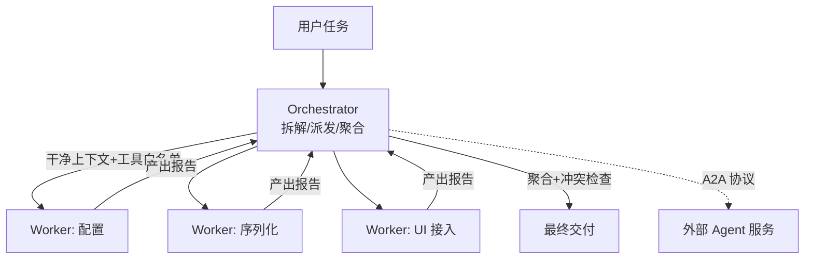

# M15 Subagent 与 A2A（多代理编排 · 隔离 · 协作协议）

| 项 | 值 |
|---|---|
| 生产进度 | Sprint 10 · 里程碑 MI-4「完整 Agent 形态」收官 |
| 代码落点 | `backend/agent_godot/agent/orchestrator.py` + `subagents/`（3 个文件，见 §0.5） |
| 前置模块 | M03（子代理复用 AgentLoop）· M04（registry.filter 工具视图）· M13（multi 模式骨架） |
| 手写比例 | 100% 手写（A2A 用 HTTP+JSON，不依赖官方 SDK） |
| 教程映射 | 📝笔记 Multi-Agent/A2A · A2A 官方规范 · Claude Code 子代理机制 |

---

## 0. 本模块在项目中的位置

**大白话**：单 Agent 像一个**全能但只有一双手的师傅**——什么都会，但一次只能干一件事，且工作台上堆满所有项目的资料（上下文污染）。multi 模式（M13 骨架）在此长出血肉：** Orchestrator（包工头）+ Worker（专业工人）**。包工头不砌墙不布线，只做三件事：**拆活**（把大任务分解）、**派活**（给每个工人干净的迷你工作台——独立上下文+专属工具）、**验收**（汇总各工人产出）。两个杀手级收益：**并行**（水电和木工同时干）与**隔离**（水电工的工作台不会被木工的图纸淹没——每个子任务上下文干净）。A2A 再进一步：工人可以不是"你公司的员工"（进程内子代理），而是**别家公司的专业外包**（跨进程/跨机器的独立 Agent 服务，走标准协议协作）。

**交付后状态**：`multi "给游戏加完整存档系统"`——orchestrator 拆出 3 个子代理（配置/序列化/UI）并行执行、互不污染，产出汇总交卷；外部 A2A 服务器可注册为一个"专家工人"。



---

## 0.5 ★ 施工文件清单（开工前必看的一页表）

**本模块你一共要新建 5 个文件**：

| # | 新建文件（完整路径） | 职责一句话 | 关键类/函数 | 预估行数 | 手敲步骤(§4) | 依赖 |
|---|---|---|---|---|---|---|
| 1 | `subagents/__init__.py` | 空包 | — | 1 | 步骤 0 | — |
| 2 | `subagents/base.py` | 子代理定义（角色/工具/提示） | `SubagentSpec`、`spawn` | 70 | 步骤 1 | M03/M04 |
| 3 | `subagents/builtin.py` | 内置角色 ×3 | `EXPLORER/CODER/VERIFIER` | 50 | 步骤 2 | base |
| 4 | `agent/orchestrator.py` | 拆解/并发/聚合/冲突检查 | `Orchestrator`、`SubtaskResult` | 140 | 步骤 3 | subagents |
| 5 | `agent/a2a.py` | A2A 客户端（外部专家接入） | `A2AClient`、agent card | 80 | 步骤 4 | httpx |

**完成后你拥有**：multi 模式真并行；`/agents list` 查看可用角色；外部 A2A 服务可被派活。

> 落地补充（接线不在表内，但缺了跑不起来）：`paradigms/multi.py` 加
> `run_multi_mode`（M13 骨架接 M15 血肉）、`cli.py` 的 `_run_turn` 给 multi 加一条
> 外循环分支、命令表加 `/agents`、事件渲染加子代理事件；测试落在
> `backend/tests/test_agent/test_multi.py`。

---

## 1. 知识点详解（每节五段：定义 → 大白话 · 举例 · 演进 · 易错点）

### 1.1 为什么要多代理：并行与隔离

**① 严格定义**：多代理两大动机——**并行**（无依赖子任务并发执行，墙钟时间=最长分支而非总和）与**上下文隔离**（每个子代理独立消息列表+工具白名单：主上下文不被子任务过程数据污染，子代理看不到也无需看到全局）。反直觉账本：多代理**总 token 成本更高**（每个子代理重复读任务书），买的是**质量**（专注窗口）与**时间**（并发）——不是省钱是买准。

**② 大白话**：**包工头制 vs 全能师傅**。全能师傅（单 Agent）干装修：水电干到一半去调油漆，回来忘了水管走到哪了（上下文互相踩踏）；工期=所有工序串行相加。包工头：给水电工一张**只关于水电的工单**（"三楼卫生间冷热水，用 PPR 管，验收标准打压 0.8MPa"）——他不需要知道全屋设计图（隔离），木工和水电同时开工（并行）。代价：包工头要写三份工单+三方验收（协调开销）——**但复杂任务里这笔账绝对划算**。

**③ 举例**：成本对照（真实感来自量级）：

```text
任务"加存档系统"（约 120k token 工作量）：
单 Agent：一个上下文从 0 涨到 120k——第 8 万 token 时 Lost in the Middle，
         早期决策细节已被压缩遗忘，后期修改开始"精神分裂"
multi：  主控 20k（拆解+聚合）+ 3×子代理各 30k（独立上下文）
        总量 110k 差不多，但每个窗口 ≤30k 全程高注意力；三路并行墙钟≈1/2.5
```

**④ 演进**：单 Agent 一条道（上下文滚雪球）→ 手写函数调用编排（无标准形态）→ LangGraph 图编排（有状态图）→ AutoGen/CrewAI 角色对话（偏重多轮互聊，token 爆炸）→ **DSH/Claude Code 实用主义**（轻量 Orchestrator+一次性子代理，subagent 完成即销毁）——本项目沿后者。A2A（Google 2025）把"工人"外化为标准服务。

**⑤ 易错点**：
- 子代理不是聊天室：一次性派活-收工（no 中途闲聊），反复对话的形态 token 成本失控
- 拆分粒度：3 个左右子任务最优——拆 10 个的协调开销吞掉并行收益
- 子代理间的**文件冲突**（两个都改 player.gd）必须由 orchestrator 静态检查依赖后分组串行

### 1.2 子代理生命周期：定义 → 派生 → 销毁

**① 严格定义**：SubagentSpec 四要素——`name/role_prompt`（角色提示：你是配置专家…）、`tools`（工具白名单，M04 registry.filter 生成视图）、`model`（可指定廉价模型——探查类子代理不必用旗舰）、`budget`（steps/tokens 上限，M03 BudgetTracker 复用）。生命周期：**spawn（独立 Session+Loop 实例）→ run（一次性任务书）→ 销毁**（上下文不回传主控，只交产出报告——过程数据留在子代理坟场）。

**② 大白话**：**临时工合同制**。开工前签合同（Spec：岗位职责/可用工具/预算上限/用哪个"级别"的员工），干完活交**一页交付报告**（产出+关键决策+遗留问题），合同终止——临时工的草稿纸（过程上下文）不搬进包工头办公室（主控上下文），只带走报告。这个"只交报告"的设计是主控上下文卫生的命门。

**③ 举例**：三个内置角色（Claude Code 同款思想）：

```python
EXPLORER = SubagentSpec(
    name="explorer", role_prompt="你是代码勘察员。只读不写，产出结构化勘察报告："
        "相关文件清单/关键符号/风险点。禁止修改任何文件。",
    tools=registry.filter(readonly=True),      # 只读视图=物理隔离
    model="deepseek-chat", budget=Budget(steps=8, tokens=20_000))

CODER = SubagentSpec(
    name="coder", role_prompt="你是 Godot 实现者。按任务书实现，写完必须过 headless 校验。",
    tools=registry.filter(tags={"godot", "file"}), model="deepseek-reasoner",
    budget=Budget(steps=20, tokens=60_000))

VERIFIER = SubagentSpec(
    name="verifier", role_prompt="你是验收员。逐条核对交付物与验收标准，"
        "输出 通过/不通过+问题清单。立场独立，不做修复。",
    tools=registry.filter(readonly=True), model="deepseek-chat",
    budget=Budget(steps=6, tokens=15_000))
```

探查/验收用廉价模型（只读+结构化输出）、实现用推理模型——**按角色配模型**是 multi 的成本关键杠杆。

**④ 演进**：单一全能提示 → 角色化提示（同一循环换提示词）→ Spec 化（提示+工具+模型+预算四合一配置，文件化后用户可自定义角色——`.claude/agents/*.md` 同思想）。

**⑤ 易错点**：
- 子代理工具白名单要用**视图**（filter 返回新 registry）而非全局——ask 子代理物理上无写工具
- 子代理预算独立于主控（防爆仓）：超限自杀并返回"预算耗尽"报告，不向主控求救（否则隔离失效）
- 角色提示要写明"禁止"（explorer 禁改文件）——白名单是硬约束，提示是软约束，双保险

### 1.3 Orchestrator：拆解、并发与聚合

**① 严格定义**：主控的四步循环——**拆解**（任务→子任务清单+依赖标注，一次 LLM 调用输出 JSON）→**静态冲突检查**（文件级依赖图：两个子任务写同一文件→强制串行分组）→**并发执行**（无依赖组 `asyncio.gather` 并发 spawn，每组内串行）→**聚合**（产出报告合并、跨子任务一致性检查（命名/风格冲突）、生成交付说明）。失败处理：子任务失败→主控判断重派（改任务书）或吞并（自己接管）或上抛（问用户）。

**② 大白话**：包工头的**排班表+验收单**。拆活（"水电、木工可以同时，油漆必须等木工"）→ 冲突检查（"水电和木工都要动卫生间墙面"——不能同时，分组排队）→ 派活（能并行的同时开工）→ 验收（水电报告说用 PPR、木工报告说打了 PVC 线槽——**材料风格冲突**，包工头统一裁定返工标准）。子任务失败的包工头三板斧：改工单重派（任务书写得不清）/自己顶上（小活不值得再派）/上报业主（方向性问题）。

**③ 举例**：静态冲突检查（并发安全的静态防线）：

```python
def resolve_groups(self, subtasks: list[Subtask]) -> list[list[Subtask]]:
    """写文件集相交的子任务必须同组串行（否则并行写同一文件=竞态）。"""
    groups: list[list[Subtask]] = []
    for st in subtasks:
        placed = False
        for g in groups:
            if st.write_targets & {t for s in g for t in s.write_targets}:
                g.append(st); placed = True; break     # 目标相交→进组排队
        if not placed:
            groups.append([st])                        # 独立新组
    return groups                                       # 组间并行、组内串行
```

聚合的跨任务一致性检查：收集各报告的"新增文件清单/命名约定"，重叠或冲突（两个子代理都建了 `save_manager.gd`）→ 触发一次仲裁子任务（合并或删一）。

**④ 演进**：手写顺序调用 → asyncio.gather 无依赖并发 → 依赖图调度（本模块分组制）→ 黑板模式/自由对话（多 Agent 互聊，token 成本高、行为难控，本项目不采用——见面试题 9）。

**⑤ 易错点**：
- 拆解质量决定一切：任务书要含**验收标准**（verifier 才有判定依据）+**边界**（"只动 save/ 目录"）
- 并发度上限（同时 3 个子代理）：每个子代理都在打 LLM API，并发爆表触发限流（M02 令牌桶全局共享）
- 聚合不是拼接：报告矛盾（一个说完成一个说部分完成）必须显式仲裁，静默拼接=埋雷

### 1.4 A2A：跨进程/跨机器的 Agent 协作协议

**① 严格定义**：Agent2Agent（Google 2025，Linux 基金项目）——独立 Agent 服务间的互操作协议。三要素：**Agent Card**（`/.well-known/agent.json`：身份/能力/端点/认证方式——服务自描述）＋ **Task 生命周期**（submitted→working→input-required→completed/failed——与 M09 确认门的 waiting_confirm 异曲同工）＋ **Artifact**（任务产物：文件/结构化数据）。传输：HTTPS+JSON-RPC/SSE。信任模型：认证（API key/OAuth）+能力声明的最小授权。

**② 大白话**：**公司间的标准合作流程**。进程内子代理是"自家员工"（直接喊话就行）；A2A 是"跨公司外包"——你不了解对方内部怎么运作（黑盒），合作全靠**三份标准文书**：对方的名片（Agent Card：我们会干什么、找谁、怎么签合同）、工单状态流转（submitted→干活中→**缺料等确认**→完工交付）、交付物清单（Artifact）。"缺料等确认"（input-required）就是 M09 确认门的跨公司版：外包方说"图纸不全，等补充"——挂起等你回。

**③ 举例**：把外部"Godot 资产市场 Agent"注册为专家：

```python
class A2AClient:
    async def discover(self, base_url: str) -> AgentCard:
        r = await self.http.get(f"{base_url}/.well-known/agent.json")
        return AgentCard.from_json(r.json())        # name/skills/endpoint/auth

    async def send_task(self, card: AgentCard, text: str) -> A2ATask:
        task = await self.http.post(card.endpoint, json={
            "jsonrpc": "2.0", "method": "message/send",
            "params": {"message": {"role": "user", "parts": [
                {"kind": "text", "text": text}]}}}, headers=self._auth(card))
        return A2ATask.from_json(task.json())        # taskId + status

    async def poll(self, card, task_id) -> A2ATask:  # SSE 订阅或轮询
        ...
```

Orchestrator 把 A2A 服务当作"远程 Worker"统一派活（适配器把 A2ATask 包装成 SubtaskResult 进聚合管线——又一个 Adapter 实战）。

**④ 演进**：MCP（工具级互操作——"借个锤子"）→ A2A（代理级互操作——"把这面墙砌了"）；两者互补：MCP 连接工具与数据，A2A 连接自主 Agent。业界现状：A2A 还在快速演进（规范版本化），本项目实现"最小可用子集"（card 发现+send+poll）作为扩展性演示。

**⑤ 易错点**：
- 外部 Agent 是**不可信边界**：任务书里不放密钥/内部路径；产出物落地前过验证（与 M04 沙箱同哲学）
- A2A 响应可能慢（远程排队）：派发要配超时+取消（本地子代理秒级，远程分钟级——预算不同）
- Agent Card 缓存与失效：能力变了要重发现（version 字段比对）

---

## 2. 接口设计（完整签名）

```python
# subagents/base.py
@dataclass
class SubagentSpec:
    name: str; role_prompt: str
    tools: ToolRegistry                     # 视图（filter 产物）
    model: str; budget: Budget
    @classmethod
    def from_markdown(cls, path: Path, registry: ToolRegistry) -> "SubagentSpec": ...

@dataclass
class SubtaskResult:
    spec_name: str; ok: bool
    report: str                             # 交付报告（唯一回传物）
    artifacts: list[str]; usage: Usage; stop_reason: str

async def spawn(spec: SubagentSpec, task: str, session_ctx: dict) -> SubtaskResult:
    """独立 Session + AgentLoop 跑一次任务书，返回交付报告。"""

# agent/orchestrator.py
@dataclass
class Subtask:
    title: str; task_brief: str             # 含验收标准+边界
    spec: SubagentSpec; write_targets: set[str]; depends: list[str]

class Orchestrator:
    def __init__(self, llm: LLM, specs: dict[str, SubagentSpec],
                 registry: ToolRegistry, bus: EventBus): ...
    async def run(self, session: Session, task: str) -> OrchestrResult: ...
    async def decompose(self, task: str) -> list[Subtask]: ...
    def resolve_groups(self, subtasks: list[Subtask]) -> list[list[Subtask]]: ...
    async def aggregate(self, results: list[SubtaskResult]) -> OrchestrResult: ...

# agent/a2a.py
@dataclass
class AgentCard: name: str; description: str; endpoint: str; auth: dict
class A2AClient:
    async def discover(self, base_url: str) -> AgentCard: ...
    async def send_task(self, card: AgentCard, text: str) -> str: ...
    async def poll(self, card: AgentCard, task_id: str) -> A2ATask: ...
    def as_remote_worker(self, card: AgentCard) -> "SubagentSpec": ...  # 适配
```

---

## 3. 关键难点参考片段：拆解提示（决定 multi 上限的一段 prompt）

拆解是 orchestrator 唯一的"智能"步骤——任务书质量直接封顶子代理表现：

```python
DECOMPOSE_PROMPT = """你是任务编排者。把用户任务拆解为 2~4 个子任务，输出 JSON：
[{{"title": "...", "brief": "给子代理的完整任务书：目标+边界(只许动哪些文件/目录)+
   验收标准(可检查的完成判据)", "spec": "explorer|coder|verifier",
   "write_targets": ["..."], "depends": ["其他子任务title或空"]}}]
拆解原则：
- 探查先行：不熟悉项目时第一个子任务必须是 explorer 勘察
- 写目标不相交：两个子任务不许写同一个文件（做不到就串行 depends）
- 验收独立：最后一个子任务建议是 verifier 全局验收
- 每份任务书自包含：子代理看不到全局对话，缺的信息写进 brief

用户任务：{task}
项目现状摘要：{digest}"""
```

为什么难：**任务书自包含**是反直觉要求（主控知道的一切不写进 brief，子代理就不知道——因为上下文隔离）；write_targets 的准确性依赖 explorer 的勘察产出。测试用固定任务对拍拆解结果的**结构**（目标数/依赖无环/写目标不交叉）。

---

## 4. 手敲指引（函数级伪代码）

| 步骤 | 文件 | 函数级作用（伪代码） | 验证 |
|---|---|---|---|
| 1 | `subagents/base.py` | `spawn：新 Session（不挂主控历史）→ AgentLoop(llm=get_llm(spec.model), dispatcher=白名单视图, budgets=spec.budget) → run(spec.role_prompt+task_brief) → 只取 final_text/usage 组装 SubtaskResult（上下文销毁）` | explorer 跑勘察任务，报告含文件清单 |
| 2 | `subagents/builtin.py` | `三个角色常量（§1.2 ③）；from_markdown：解析 frontmatter（name/tools 标签/model/budget）+正文当 role_prompt` | /agents list 显示 3 角色 |
| 3 | `agent/orchestrator.py` | `run：decompose（§3 提示）→ resolve_groups（§1.3 ③ 写目标分组合并 depends）→ 逐组：组内 gather 并发 spawn → aggregate：报告合并+一致性检查（文件重叠/命名冲突）→ OrchestrResult（含每子任务 usage 汇总）` | "加存档系统"三路并行、报告聚合无冲突 |
| 4 | `agent/a2a.py` | `discover/send/poll（§1.4 ③）；as_remote_worker：A2A 包装成 SubagentSpec（run 时走 HTTP 而非本地 Loop——适配器）` | 用官方示例服务器跑通一轮 send/poll |

---

## 5. 测试与验收

```python
async def test_subagent_isolated_context():
    # 子代理任务书里没有的信息，其上下文/报告中不得出现（隔离断言）

async def test_write_conflict_serialized():
    subs = [Subtask(write_targets={"a.gd"}), Subtask(write_targets={"a.gd"})]
    groups = orch.resolve_groups(subs)
    assert len(groups) == 1                     # 同组串行

async def test_parallel_wallclock():
    # 两个 2s 的只读子任务并发 → 总耗时 < 3s

async def test_budget_exceeded_returns_report():
    # steps=2 的子代理跑无限任务 → 返回"预算耗尽"报告而非挂死
```

**验收 Demo（MI-4 收官）**：`multi "给 sample 项目加完整存档系统（配置+序列化+UI 提示）"` → trace 看到 explorer 先行勘察 → coder×2 并行（不同目录）→ verifier 验收 → 聚合交付；对比 craft 单代理跑同任务的 token/时长/质量三列报告。

---

## 6. 踩坑记录（留白自填）

| 日期 | 坑 | 现象 | 根因 | 解法 | 关联知识点 |
|---|---|---|---|---|---|
| 2026-08-28 | depends 只排到"更晚的组" | 依赖者与前驱**同时开跑**，读到未生成的文件 | 组语义是"组间并行、组内串行"——组下标更大 ≠ 执行更晚，两组是并发的 | 依赖者与被依赖者**合并进同一组**（串到其后）；依赖跨多组时把这几组合并 | §1.3 ③ 静态冲突检查 |
| 2026-08-28 | multi 走外循环，主控会话缺用户消息 | `/rewind` 回放时看不到"用户到底要了什么" | `run_multi_mode` 不经过 `loop.run`，没人负责把 user 消息记进会话 | Orchestrator.run 开头自己补记 user 消息，结尾补记聚合报告（各子代理过程消息一条都不进） | §1.2 ② 只交报告 |
| 2026-08-28 | Agent Card 缓存无法感知对方能力变更 | 用了过期端点/旧能力，失败很隐蔽 | 缓存命中直接 return，重发现（比对 version）的代码永远跑不到 | 缓存带 TTL，过期或 `force=True` 才重发现；重发现比对 version 并发 `a2a_card_changed` 事件 | §1.4 ⑤ 卡片缓存与失效 |

---

## 7. 面试拷打（附详细参考答案）

**1. 什么时候值得上多代理？判据是什么？**
答：三判据至少满足其二：①**子任务可独立**（能拆成 2~4 个写目标不相交的块——强耦合任务拆了全是协调开销）；②**上下文压力大**（预估单 Agent 上下文将超 50k——隔离买质量）；③**可并行**（无依赖分支多——买墙钟时间）。反例不值得：单文件小改动（拆解+聚合的开销 > 任务本身）、强串行探索任务（每步依赖上一步发现）。经验阈值：**预估 <20k token 的任务直接单 Agent**——多代理是复杂度工具不是炫技场。

**2. 子代理的"只交报告不交上下文"为什么是命门？**
答：隔离的全部价值在这一条。若子代理的过程消息回传主控：①主控上下文被 N 份过程数据淹没（隔离失效，回到单 Agent 滚雪球）；②子代理间的中间态互相污染（explorer 的犹豫笔记影响 coder 判断）。报告是**蒸馏产物**（结论+产出+遗留），信息密度高且可控（限 1~2k token）。类比：外包公司交的是竣工图不是施工日记。工程实现：spawn 返回 SubtaskResult 只含 report/artifacts/usage——Session 对象随子代理销毁。

**3. 并发安全为什么用"静态写目标分组"而不是运行时锁？**
答：静态分组=执行前分析任务书的 write_targets，目标相交者同组串行——**在派发时消灭竞态**。运行时锁（文件锁）的问题：①死锁风险（A 等 B 的锁、B 等 A 的）；②性能（锁等待浪费并发额度）；③模型不可编程性（让 LLM"记得加锁"是提示词迷信）。静态分析的前提是任务书必须声明写目标——decompose 提示强制输出 write_targets 字段，这是**把并发控制从运行时上移到规划时**的工程选择（编译期检查优于运行时崩溃的同一哲学）。漏报兜底：M04 乐观锁在文件级仍生效（声明漏了也会 CONFLICT 拦住）。

**4. 按角色配模型的成本杠杆怎么用？**
答：原则：**任务难度决定模型档位**。explorer（只读勘察+结构化输出）用廉价档（deepseek-chat，能力过剩浪费）；verifier（对照验收标准逐条核对）廉价档够；coder（真实代码生成+调试）用推理档（deepseek-reasoner）。成本差 5~10 倍——一次 multi 任务里探查/验收占比 40% 的工作量用便宜模型，整体成本省 30%+。这也是 models.yaml 路由表在子代理维度的延伸（M02 路由 + M15 角色配置=完整的成本矩阵）。错误示范：全角色旗舰模型——除了账单没区别。

**5. 子任务失败的三种处置（重派/吞并/上抛）怎么选？**
答：按失败原因分类路由：①**任务书缺陷**（brief 不清/验收标准模糊——子代理报告说"无法确定范围"）→改任务书重派（换 codER 无用，问题在说明书）；②**执行性小失败**（语法错两处、缺一个文件）→主控吞并自己修（再派一轮的 spawn 开销 > 主控顺手修）；③**方向性失败**（验收标准本身矛盾/需要用户提供决策——如"要 JSON 还是 ConfigFile 存档"）→上抛用户（确认门）。判断依据：子代理报告里的 stop_reason+错误类型——这就是 spawn 强制返回结构化报告的原因之一（给主控的处置决策供料）。

**6. A2A 与 MCP 的分界？会融合吗？**
答：分界在交互对象的**自主性**：MCP 连接的是**工具/数据源**（无自主决策——调用即返回，像函数）；A2A 连接的是**Agent**（有自主决策——接任务后自己规划执行，可能反问你要补充信息（input-required），像合作方）。一个 A2A Agent 内部可能用 MCP 调工具——协议栈分层而非竞争。融合展望：长期看任务编排层（A2A）与工具层（MCP）会形成稳定分层（如 HTTP 与 DNS 的关系），短期两者边界仍在演化（MCP 的 sampling 让服务器侧也有了一点"主动性"）。面试立场：**不是替代是分层，本项目两者都实现正是为了吃透边界**。

**7. A2A 的 input-required 与 M09 确认门的关系？**
答：同一模式在不同层级的实例化：M09 是**进程内**的挂起（Loop 等用户回答，Session 状态机 waiting_confirm）；A2A 的 input-required 是**跨服务**的挂起（远程 Agent 说"缺料等补充"，任务对象进入该状态，我方轮询/订阅等待）。工程上后者更难：等待可能是小时级（远程排队+异步通知）、通知通道要可靠（SSE 断线重连）、超时策略要双层（我方对用户 24h、我方对远程 30min）。本项目把 A2A 的 input-required 适配成本地确认门事件（统一用户体验：无论工人是进程内还是远程，用户看到的都是同一个确认弹层）——**协议适配归 adapter，体验归产品**。

**8. 拆解提示里"任务书自包含"为什么反直觉？漏了会怎样？**
答：反直觉点：主控"当然知道"的信息（任务背景、项目约定、之前对话），子代理**一无所知**——因为隔离是双向的（子代理看不到主控对话）。漏写的症状极具迷惑性：子代理报告"已完成"，verifier 却验收不过——因为子代理按自己的理解补全了缺失背景（比如用户之前说过"用 ConfigFile 不用 JSON"没写进 brief，coder 用了 JSON）。防漏三招：①decompose 提示强制"缺的信息写进 brief"原则；②digest 参数（项目现状摘要+用户关键约定）随提示注入；③verifier 的验收标准与 brief 同源（brief 漏的验收也漏——系统性对齐）。这是 multi 模式最大的暗坑，测试要专门覆盖"约定传递"场景。

**9. 为什么不采用"多 Agent 自由对话"（AutoGen 式）？**
答：三个工程理由：①**token 成本失控**——两个 Agent 互聊一轮=两次完整推理，任务复杂时对话轮数不可预测（实测常常 10+ 轮，成本是编排式的 5 倍）；②**行为不可控**——自由对话可能跑题、互相恭维、死循环（两个都客气地说"你先"）；③**责任模糊**——出错时无法定位是哪个 Agent 的哪句话导致的（编排式每个子任务有明确输入输出边界）。DSH/Claude Code 的实用主义选择：**Orchestrator 单点决策+子代理一次性执行**——像公司靠流程（工单）协作而不是靠开会协作。自由对话在"辩论出更好方案"类任务有独特价值（选读 AutoGen 论文），但工程主线不采用。

**10. 开放题：设计 multi 模式的可观测性（怎么知道包工头干得好不好）？**
答：四层观测：①**结构层**——每次 multi 的拆解 DAG 快照（子任务/依赖/分组）落盘，回放可视化（哪个环节排队了）；②**个体层**——每子代理的 usage/stop_reason/报告哈希（对比多次运行稳定性）；③**质量层**——verifier 验收通过率、聚合冲突次数（拆解质量指标：写目标冲突多=decompose 差）、重派率（任务书质量指标）；④**对照层**——同任务集跑 multi vs craft 的三列对比报告（token/墙钟/验收通过率），这是"多代理到底值不值"的最终裁决数据（M22 评估体系的 multi 维度）。指标进 M21 仪表盘，阈值告警（重派率>40% 说明拆解提示要迭代）。核心思想：**编排系统本身也需要被编排质量的反馈回路**。

---

## 8. 教程映射与延伸

- 必读：Claude Code Subagents 官方文档（Spec 四要素对照）；A2A 官方规范（Task 生命周期一节）
- 选读：AutoGen/CrewAI 论文（对话式多代理的对照面）；LangGraph（图编排另一形态）
