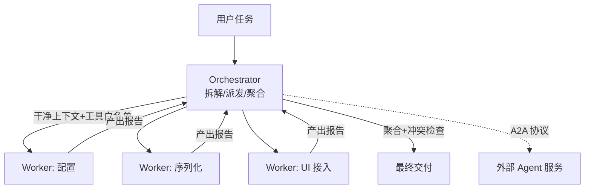

# M15 Subagent 与 A2A（多代理编排 · 隔离 · 协作协议）

| 项 | 值 |
|---|---|
| 生产进度 | Sprint 10 · 里程碑 MI-4「完整 Agent 形态」收官 |
| 代码落点 | `backend/agent_godot/agent/orchestrator.py` + `subagents/`（3 个文件，见 §0.5） |
| 前置模块 | M03（子代理复用 AgentLoop）· M04（registry.filter 工具视图）· M13（multi 模式骨架） |
| 手写比例 | 100% 手写（A2A 用 HTTP+JSON，不依赖官方 SDK） |
| 教程映射 | 📝笔记 Multi-Agent/A2A · A2A 官方规范 · Claude Code 子代理机制 |

---

## 0. 本模块在项目中的位置

**大白话**：单 Agent 像一个**全能但只有一双手的师傅**——什么都会，但一次只能干一件事，且工作台上堆满所有项目的资料（上下文污染）。multi 模式（M13 骨架）在此长出血肉：** Orchestrator（包工头）+ Worker（专业工人）**。包工头不砌墙不布线，只做三件事：**拆活**（把大任务分解）、**派活**（给每个工人干净的迷你工作台——独立上下文+专属工具）、**验收**（汇总各工人产出）。两个杀手级收益：**并行**（水电和木工同时干）与**隔离**（水电工的工作台不会被木工的图纸淹没——每个子任务上下文干净）。A2A 再进一步：工人可以不是"你公司的员工"（进程内子代理），而是**别家公司的专业外包**（跨进程/跨机器的独立 Agent 服务，走标准协议协作）。

**交付后状态**：`multi "给游戏加完整存档系统"`——orchestrator 拆出 3 个子代理（配置/序列化/UI）并行执行、互不污染，产出汇总交卷；外部 A2A 服务器可注册为一个"专家工人"。



---

## 0.5 ★ 施工文件清单（开工前必看的一页表）

**本模块你一共要新建 5 个文件**：

| # | 新建文件（完整路径） | 职责一句话 | 关键类/函数 | 预估行数 | 手敲步骤(§4) | 依赖 |
|---|---|---|---|---|---|---|
| 1 | `subagents/__init__.py` | 空包 | — | 1 | 步骤 0 | — |
| 2 | `subagents/base.py` | 子代理定义（角色/工具/提示） | `SubagentSpec`、`spawn` | 70 | 步骤 1 | M03/M04 |
| 3 | `subagents/builtin.py` | 内置角色 ×3 | `EXPLORER/CODER/VERIFIER` | 50 | 步骤 2 | base |
| 4 | `agent/orchestrator.py` | 拆解/并发/聚合/冲突检查 | `Orchestrator`、`SubtaskResult` | 140 | 步骤 3 | subagents |
| 5 | `agent/a2a.py` | A2A 客户端（外部专家接入） | `A2AClient`、agent card | 80 | 步骤 4 | httpx |

**完成后你拥有**：multi 模式真并行；`/agents list` 查看可用角色；外部 A2A 服务可被派活。

> **第二轮加固（§1.4，本轮新增知识点）**：上表 5 个文件是"能跑"的最小集，
> §1.4 是在**既有文件内**的加固（不新增文件）——把 `resolve_groups` 从"精确
> 路径相等 → 串行"升级为"前缀树判定 + 七类处置决策树 + 串行链语义"。
> 手敲顺序建议：先按 §4 跑通 5 个文件（验证并行与隔离），再按 §1.4 ⑥ 清单
> 逐条加固（验证冲突不再静默丢数据）。

> 落地补充（接线不在表内，但缺了跑不起来）：`paradigms/multi.py` 加
> `run_multi_mode`（M13 骨架接 M15 血肉）、`cli.py` 的 `_run_turn` 给 multi 加一条
> 外循环分支、命令表加 `/agents`、事件渲染加子代理事件；测试落在
> `backend/tests/test_agent/test_multi.py`。

---

## 1. 知识点详解（每节五段：定义 → 大白话 · 举例 · 演进 · 易错点）

### 1.1 为什么要多代理：并行与隔离

**① 严格定义**：多代理两大动机——**并行**（无依赖子任务并发执行，墙钟时间=最长分支而非总和）与**上下文隔离**（每个子代理独立消息列表+工具白名单：主上下文不被子任务过程数据污染，子代理看不到也无需看到全局）。反直觉账本：多代理**总 token 成本更高**（每个子代理重复读任务书），买的是**质量**（专注窗口）与**时间**（并发）——不是省钱是买准。

**② 大白话**：**包工头制 vs 全能师傅**。全能师傅（单 Agent）干装修：水电干到一半去调油漆，回来忘了水管走到哪了（上下文互相踩踏）；工期=所有工序串行相加。包工头：给水电工一张**只关于水电的工单**（"三楼卫生间冷热水，用 PPR 管，验收标准打压 0.8MPa"）——他不需要知道全屋设计图（隔离），木工和水电同时开工（并行）。代价：包工头要写三份工单+三方验收（协调开销）——**但复杂任务里这笔账绝对划算**。

**③ 举例**：成本对照（真实感来自量级）：

```text
任务"加存档系统"（约 120k token 工作量）：
单 Agent：一个上下文从 0 涨到 120k——第 8 万 token 时 Lost in the Middle，
         早期决策细节已被压缩遗忘，后期修改开始"精神分裂"
multi：  主控 20k（拆解+聚合）+ 3×子代理各 30k（独立上下文）
        总量 110k 差不多，但每个窗口 ≤30k 全程高注意力；三路并行墙钟≈1/2.5
```

**④ 演进**：单 Agent 一条道（上下文滚雪球）→ 手写函数调用编排（无标准形态）→ LangGraph 图编排（有状态图）→ AutoGen/CrewAI 角色对话（偏重多轮互聊，token 爆炸）→ **DSH/Claude Code 实用主义**（轻量 Orchestrator+一次性子代理，subagent 完成即销毁）——本项目沿后者。A2A（Google 2025）把"工人"外化为标准服务。

**⑤ 易错点**：
- 子代理不是聊天室：一次性派活-收工（no 中途闲聊），反复对话的形态 token 成本失控
- 拆分粒度：3 个左右子任务最优——拆 10 个的协调开销吞掉并行收益
- 子代理间的**文件冲突**（两个都改 player.gd）必须由 orchestrator 静态检查依赖后分组串行
  ——但"串行"只是最保守的一档，判定精度与四种处置见 **§1.4**

### 1.2 子代理生命周期：定义 → 派生 → 销毁

**① 严格定义**：SubagentSpec 四要素——`name/role_prompt`（角色提示：你是配置专家…）、`tools`（工具白名单，M04 registry.filter 生成视图）、`model`（可指定廉价模型——探查类子代理不必用旗舰）、`budget`（steps/tokens 上限，M03 BudgetTracker 复用）。生命周期：**spawn（独立 Session+Loop 实例）→ run（一次性任务书）→ 销毁**（上下文不回传主控，只交产出报告——过程数据留在子代理坟场）。

**② 大白话**：**临时工合同制**。开工前签合同（Spec：岗位职责/可用工具/预算上限/用哪个"级别"的员工），干完活交**一页交付报告**（产出+关键决策+遗留问题），合同终止——临时工的草稿纸（过程上下文）不搬进包工头办公室（主控上下文），只带走报告。这个"只交报告"的设计是主控上下文卫生的命门。

**③ 举例**：三个内置角色（Claude Code 同款思想）：

```python
EXPLORER = SubagentSpec(
    name="explorer", role_prompt="你是代码勘察员。只读不写，产出结构化勘察报告："
        "相关文件清单/关键符号/风险点。禁止修改任何文件。",
    tools=registry.filter(readonly=True),      # 只读视图=物理隔离
    model="deepseek-chat", budget=Budget(steps=8, tokens=20_000))

CODER = SubagentSpec(
    name="coder", role_prompt="你是 Godot 实现者。按任务书实现，写完必须过 headless 校验。",
    tools=registry.filter(tags={"godot", "file"}), model="deepseek-reasoner",
    budget=Budget(steps=20, tokens=60_000))

VERIFIER = SubagentSpec(
    name="verifier", role_prompt="你是验收员。逐条核对交付物与验收标准，"
        "输出 通过/不通过+问题清单。立场独立，不做修复。",
    tools=registry.filter(readonly=True), model="deepseek-chat",
    budget=Budget(steps=6, tokens=15_000))
```

探查/验收用廉价模型（只读+结构化输出）、实现用推理模型——**按角色配模型**是 multi 的成本关键杠杆。

**④ 演进**：单一全能提示 → 角色化提示（同一循环换提示词）→ Spec 化（提示+工具+模型+预算四合一配置，文件化后用户可自定义角色——`.claude/agents/*.md` 同思想）。

**⑤ 易错点**：
- 子代理工具白名单要用**视图**（filter 返回新 registry）而非全局——ask 子代理物理上无写工具
- 子代理预算独立于主控（防爆仓）：超限自杀并返回"预算耗尽"报告，不向主控求救（否则隔离失效）
- 角色提示要写明"禁止"（explorer 禁改文件）——白名单是硬约束，提示是软约束，双保险
- **任务书必须自包含**：子代理看不到主控对话，主控"当然知道"的项目约定漏进不了 brief
  就会被子代理用"行业惯例"静默补全——全链路绿灯、结果全错。完整机制与闭环见 **§1.6**

### 1.3 Orchestrator：拆解、并发与聚合

**① 严格定义**：主控的四步循环——**拆解**（任务→子任务清单+依赖标注，一次 LLM 调用输出 JSON）→**静态冲突检查**（文件级依赖图：两个子任务写同一文件→强制串行分组）→**并发执行**（无依赖组 `asyncio.gather` 并发 spawn，每组内串行）→**聚合**（产出报告合并、跨子任务一致性检查（命名/风格冲突）、生成交付说明）。失败处理：子任务失败→主控判断重派（改任务书）或吞并（自己接管）或上抛（问用户）。

四步里**只有第二步决定正确性**（其余三步决定的是效率与可读性）：并发写同一文件是静默丢数据，不会报错、不会重试、只会交出一份看起来合理的半成品。所以它的判定精度与处置策略单列一节——**§1.4 静态冲突检查**。

**② 大白话**：包工头的**排班表+验收单**。拆活（"水电、木工可以同时，油漆必须等木工"）→ 冲突检查（"水电和木工都要动卫生间墙面"——不能同时，分组排队）→ 派活（能并行的同时开工）→ 验收（水电报告说用 PPR、木工报告说打了 PVC 线槽——**材料风格冲突**，包工头统一裁定返工标准）。子任务失败的包工头三板斧：改工单重派（任务书写得不清）/自己顶上（小活不值得再派）/上报业主（方向性问题）。

**③ 举例**：静态冲突检查（并发安全的静态防线）：

```python
def resolve_groups(self, subtasks: list[Subtask]) -> list[list[Subtask]]:
    """写文件集相交的子任务必须同组串行（否则并行写同一文件=竞态）。"""
    groups: list[list[Subtask]] = []
    for st in subtasks:
        placed = False
        for g in groups:
            if st.write_targets & {t for s in g for t in s.write_targets}:
                g.append(st); placed = True; break     # 目标相交→进组排队
        if not placed:
            groups.append([st])                        # 独立新组
    return groups                                       # 组间并行、组内串行
```

聚合的跨任务一致性检查：收集各报告的"新增文件清单/命名约定"，重叠或冲突（两个子代理都建了 `save_manager.gd`）→ 触发一次仲裁子任务（合并或删一）。

**④ 演进**：手写顺序调用 → asyncio.gather 无依赖并发 → 依赖图调度（本模块分组制）→ 黑板模式/自由对话（多 Agent 互聊，token 成本高、行为难控，本项目不采用——见面试题 9）。

**⑤ 易错点**：
- 拆解质量决定一切：任务书要含**验收标准**（verifier 才有判定依据）+**边界**（"只动 save/ 目录"）
- 并发度上限（同时 3 个子代理）：每个子代理都在打 LLM API，并发爆表触发限流（M02 令牌桶全局共享）
- 聚合不是拼接：报告矛盾（一个说完成一个说部分完成）必须显式仲裁，静默拼接=埋雷

### 1.4 静态冲突检查：冲突判定与四种处置

**① 严格定义**

**文件级冲突判定**（conflict detection）：给定子任务集合 \(S\)，对任意 \(s_i, s_j\) 计算其**写作用域**（`WriteScope` ＝ 归一化路径 + 访问模式）在**路径前缀树**上是否相交。判定四要素：

1. **归一化**：路径分隔符统一 POSIX（`\`→`/`，win32 必做）、剥离 `res://` `user://` 等 Godot 协议前缀、`./` 前导；大小写折叠**必须与目标文件系统语义一致**（NTFS 大小写不敏感 → 折叠；ext4 敏感 → 保留）。
2. **访问模式三态**：`READ`（只读，与任何访问都不冲突）／`WRITE`（与同路径或祖先/后代路径的 `WRITE` 冲突）／`EXCLUSIVE`（受保护文件，与一切冲突）。
3. **前缀包含（双向）**：`save/` ⊇ `save/manager.gd` 判为冲突，反之亦然——目录与文件是同一棵前缀树的节点，不是两种东西。
4. **声明三态**：`声明写`／`声明只读`（`[]`，可并行）／**未声明**（`None`，知识缺失）。**未声明 ≠ 只读**——把"未知"当"无"是 fail-open，是本节最危险的一类漏判。

判定为冲突后，**不是只有"串行"一条路**，而是一个按"冲突是否可切分"路由的**处置决策树**：

| # | 冲突类型 | 首选处置 | 次选 | 判据 |
|---|---|---|---|---|
| 1 | 写-写，**不同语义区域**（可切分） | **契约化重拆**：共享文件降级为契约文件，各写各的 + 装配者 | 串行 | 主控能明确说出接缝在哪 |
| 2 | 写-写，**同一区域**（不可切分） | **合并**为一个子任务（升级模型档位 + 预算翻倍） | 串行 | 改动重叠度高 |
| 3 | 写-写，**受保护文件**（入口/配置/migration/锁文件） | **上抛用户**（确认门） | 串行 + 快照回滚兜底 | 命中 `PROTECTED` 名单 |
| 4 | 写-写，其余（判不出来） | **串行化**（默认安全档） | — | 兜底 |
| 5 | 写-读（B 要读 A 的产出） | **升级为 `depends` 数据依赖**（串行 + 前驱产出注入） | — | B 的 brief 引用了 A 的产出 |
| 6 | 读-读 | **不管**（天然并行） | — | — |
| 7 | **未声明**写目标 | **fail-safe 并入写组串行** + emit 拆解质量告警 | 触发重拆 | `write_targets is None` |

**② 大白话**

两个水电工都要改卫生间同一面墙。包工头有四招：让他们**排队**（串行，一个改完另一个进）、在墙上**先钉一条分界线图纸**再各贴自己那半（契约化重拆）、干脆派一个老师傅**一口气干完**（合并）、或者这是**承重墙**得先问业主（上抛）。

**排队是"能跑"不是"好"**——两个人抢同一面墙，说明分活的时候图纸就分错了；排队只是把耦合的代价从"出错"转移到"慢"。真正高明的做法是**先把共享物变成契约**（分界线图纸）：两边的改动从"写同一面墙"降级为"读同一张图纸 + 各贴各的半边"。这就是软件工程的"引入间接层"，它在并发领域的同名招数叫**用不可变契约替代共享可变状态**——同一件事，一个发生在架构层，一个发生在调度层，前者治本。

一句话选型口诀：**能切就切（契约化），切不开就合（合并），合不了才排队（串行），碰承重墙就上报（上抛）。**

**③ 举例**

**(a) 判定：WriteScope（归一化 + 前缀树 + 三态访问）**

```python
class Access(str, Enum):
    READ = "read"        # 只读：与任何访问都不冲突
    WRITE = "write"      # 写：与同路径/祖先/后代的 WRITE 冲突
    EXCLUSIVE = "excl"   # 受保护文件：与一切冲突（入口/锁文件/migration）

@dataclass(frozen=True)
class WriteScope:
    """归一化后的写作用域：路径前缀树上的一个节点。

    归一化铁律（跨平台 + 抗幻觉）：
      1. 分隔符统一 POSIX——win32 的 '\\' 必须吃（本项目开发环境即 win32）
      2. 剥离 res:// user:// 等协议前缀（Godot 与裸路径是同一文件）
      3. 大小写折叠**跟随目标文件系统**：NTFS 不敏感→折叠，ext4 敏感→保留。
         折叠策略与目标不一致 = 同一份编排代码在两个平台上判定结果不同
         ——这是最隐蔽的一类"跨平台竞态"
      4. 目录形态统一补尾斜杠，否则 'save' 会误判为 'savesettings' 的祖先
    """
    norm: str
    access: Access = Access.WRITE

    @classmethod
    def of(cls, raw: str, access: Access = Access.WRITE,
           case_insensitive: bool = False) -> "WriteScope":
        p = str(raw or "").strip().replace("\\", "/")
        for scheme in ("res://", "user://", "file://"):
            if p.lower().startswith(scheme):
                p = p[len(scheme):]
                break
        # 只剥单个 './' 前缀——不能用 lstrip("./")：它会连剥并把 '/abs/x' 的
        # 首斜杠也吃掉，把绝对路径变成相对路径（归一化把语义改了比不改更糟）
        p = p[2:] if p.startswith("./") else p
        p = p.lstrip("/")
        p = p.lower() if case_insensitive else p
        return cls(p.rstrip("/") + "/" if _is_dir(raw) else p, access)

    def conflicts_with(self, other: "WriteScope") -> bool:
        if self.access is Access.READ or other.access is Access.READ:
            return False                    # 读-读、读-写都不冲突（写-读走 depends）
        if Access.EXCLUSIVE in (self.access, other.access):
            return True                     # 受保护文件：无条件冲突
        return _covers(self.norm, other.norm) or _covers(other.norm, self.norm)


def _covers(a: str, b: str) -> bool:
    """a 覆盖 b：相等，或 a 是 b 的祖先目录（'save/' ⊇ 'save/manager.gd'）。"""
    return a == b or b.startswith(a if a.endswith("/") else a + "/")
```

**(b) 处置 #1：契约化重拆（并行度 1 → 2）**

```text
原始拆解（冲突，并行度 1）：
  coder-A: 写 save_manager.gd 的配置部分   ┐ 抢同一文件
  coder-B: 写 save_manager.gd 的序列化部分 ┘ → 必须串行，且 B 易覆盖 A

契约化重拆（并行度 2）：
  step-0  起草契约（廉价档模型）→ 只写 save_types.gd
          （常量、序列化接口签名、错误码枚举——双方都**只读**它）
  coder-A: 写 save_config.gd  （import save_types.gd）  ┐ 并行
  coder-B: 写 save_codec.gd   （import save_types.gd）  ┘
  coder-C: 写 save_manager.gd（只做装配，depends=[A,B]）
```

成本：多一次廉价 LLM 调用。收益：写-写冲突降级为「读契约 + 各写各的」，最终文件是**可预测的装配结果**而非两次改写的叠加态。

**(c) 处置 #4 的正确姿势：串行链 ≠ 安全，要注入前驱产出 + fail-fast**

```python
CHAIN_HINT = """
【串行链上下文】你前面的子任务「{title}」已完成，它对这些文件做了如下改动：
{report_digest}
当前文件基线 hash: {hashes}
请**基于上述现状增量修改**，不要重写整个文件（重写会丢失前驱的改动）。
"""

async def _run_group(self, group: list[Subtask], ctx: dict) -> list[SubtaskResult]:
    """组内串行：写目标相交 / 依赖链。两条铁律：产出注入 + fail-fast。"""
    out, chain = [], dict(ctx)
    for i, st in enumerate(group):
        async with self._sem:                      # 并发度上限（防 LLM 限流）
            res = await self._run_subtask(st, chain)
        out.append(res)
        if not res.ok and not st.tolerate_upstream_failure:
            # 前驱废了 → 后继不许在半成品上继续写（脏数据比失败更难排查）
            out.extend(SubtaskResult(spec_name=p.spec_name, ok=False,
                                     title=p.title, stop_reason="blocked",
                                     report=f"被上游「{st.title}」阻塞，已跳过")
                       for p in group[i + 1:])
            break
        chain = self._chain_ctx(chain, res)        # 注入前驱 report + 文件 hash
    return out
```

**(d) 纵深防御：任何一层都不可省略**

| 层 | 时机 | 机制 | 兜底的是什么 | 现状 |
|---|---|---|---|---|
| **L0** | 规划期 | `DECOMPOSE_PROMPT` 强制声明 `write_targets` + `access`；契约先行 | 减少冲突**产生** | 提示有，未强制校验 |
| **L1** | 派发前 | `WriteScope` 判定 + 决策树分组（本节） | 消灭**已知**冲突 | 本轮加固目标 |
| **L2** | 运行时 | 乐观锁 hash → `CONFLICT` → 重读重改（M04 §1.5） | 拦截 L1 **漏报** | 已有，单进程 |
| **L3** | 聚合期 | artifacts 重叠检测 → verifier 仲裁 → `CheckpointStore` 回滚 | 拦截 L2 **漏报** | 检测有，回滚未接线 |

**④ 演进**

| 代 | 做法 | 解决什么 | 死穴（→ 下一代） |
|---|---|---|---|
| 1 | 无检查 | — | 两子代理并发写，后写覆盖前写，**静默丢数据** |
| 2 | 精确路径字符串相等 → 合并同组串行（本项目 `resolve_groups` 现状） | 显式写同一文件 | 漏判目录/文件、协议前缀、分隔符、大小写 |
| 3 | 前缀树 + 访问三态 + 未声明 fail-safe（本节目标） | 漏判与 fail-open | 只治调度层，并行度仍被耦合吃掉 |
| 4 | 契约化重拆（架构层消解冲突） | 并行度归零 | 接缝判断错了代价更大 |
| 5 | 跨进程租约锁（TTL lease） | 多主控实例并发 | 单机单进程下是纯开销 |
| ✗ | 符号级语义合并（AST / diff3 三方合并） | — | **不做**：LLM 声明不出符号级边界（幻觉率 > 收益），且"缝合怪比冲突更难调试"——与 M04 乐观锁拒绝自动合并同一哲学 |

**⑤ 易错点**（现象 → 根因 → 防法）

1. **路径精确相等导致漏判**：`save/` 与 `save/manager.gd` 被判为不冲突 → 两组并行、后写覆盖。根因：`set` 相交要求字符串全等，目录与文件不是同一"字符串"。防法：归一化 + 前缀树双向包含。
2. **win32 分隔符与大小写**：`src\a.gd` 与 `res://src/a.gd` 是同一文件；`SaveManager.gd` 与 `savemanager.gd` 在 NTFS 上是同一文件、在 ext4 上是两个文件。根因：大小写折叠没跟随文件系统语义 → **同一份编排代码跨平台判定结果不同**。防法：`case_insensitive = (os.name == "nt")`，且冲突判定的测试**必须双平台各跑一遍**。
3. **未声明 `write_targets` 的 fail-open**（最危险）：LLM 漏输出该字段 → 空集与谁都不相交 → 静默并行写。根因：把"未知"当成了"无"。防法：三态区分 `None`／`[]`／`[...]`，`None` 走最保守分支并记一条 `orchestrator_warn`（判定函数保持纯函数，由 `run` 统一 emit，见 §3 难点二）—— **宁可并行度归零，不可产出脏数据**。
4. **串行 ≠ 安全（语义覆盖）**：同组串行跑完，前驱的改动被后继整个重写覆盖。根因：组内只保证了"不并发写"，没传递"改了什么"。防法：后继任务书注入前驱 report 摘要 + 变更文件最新 hash，并显式要求"增量修改而非重写"。
5. **前驱失败后后继继续写**：上游 `max_steps` 中断留下半成品文件，下游接着在上面写 → 产出比"失败"更难排查的脏数据。根因：串行循环无条件继续。防法：前驱 `ok=False` 时后继标 `blocked` 跳过（fail-fast），除非工单显式声明 `tolerate_upstream_failure`。
6. **拓扑序不确定 → 不可复现**：同一任务两次运行产出不同、测试无法对拍。根因：Kahn 队列的 tie-break 依赖输入顺序。防法：稳定排序——拓扑序优先，`title` 字典序做 tie-break。
7. **并行度归零 = 白拆**：分组后只有 1 组，串行执行还额外付了拆解开销。根因：拆解质量差，或任务本身强耦合（不该上 multi）。防法：分组后健康检查，`len(groups) == 1` → 带 hint 重拆一次，仍为 1 → 降级单 `coder`。
8. **契约化重拆的判断失误成本不对称**：契约不完整 → 两个 coder 同时跑偏，比串行更糟。防法：只在"能明确说出接缝在哪"时走 #1；说不清就老实落回 #4 串行。**默认保守，把激进档做成显式开关。**

**⑥ 高并发与边界清单**

1. **静态分组的有效域是单进程**。`Orchestrator` 的内存分组对"另一个进程/另一台机器上的主控"完全无感。M20/M21 上多 worker 并发编排同一项目时，L1 失效 → 必须补**跨进程租约锁**（带 TTL 的文件 advisory lock 或 Redis `SET NX PX`）。注意 M04 乐观锁是**事后检测**（写完才发现冲突），跨进程需要**事前互斥**——两者不是替代关系。当前单机单进程部署，L1 够用。
2. **重派幂等**：`_run_subtask` 重派会重跑整个子任务，前一次已写的部分文件构成脏基线，第二次在脏基线上再改一遍。防法：重派前比对 `write_targets` 的内容 hash，变了先回滚再重派。
3. **并发上限的维度是 LLM 不是 CPU**：`asyncio.Semaphore` 必须落在**每个子任务**上（不是每组），因为每个子代理都在打 API，令牌桶全局共享（M02）。
4. **串行链长度上限**：链式依赖 > 4 时累计延迟与误差放大显著，应主动提示用户"该任务本质上不适合并行"（与 §7 题 1 的三判据呼应）。
5. **受保护文件的动作要分环境**：`on_protected = ask | serialize | abort`，交互式默认 `ask`；**CI / A2A 无人值守场景强制 `abort`**——没人应答的确认门等于永久挂起。
6. **锁粒度选文件级**：文件 / 目录 / 符号三级中，文件级是"LLM 能稳定声明"的最小粒度；符号级超出 LLM 的声明能力，幻觉率高于收益。
7. **失败不许掀桌子**：单个子代理异常必须翻译成 `SubtaskResult(ok=False)` 进聚合（`_run_groups` 已用 `return_exceptions=True`），绝不让 `gather` 炸掉整轮编排——这是编排层的"断路器"，与 M02 熔断器同一思想。
8. **可回滚是冲突处置的最后一道保险**：`run` 开头建 task 级 `CheckpointStore` 快照，冲突无法自动消解时**默认保留现场**（用户可能想人工救），并把 `task_id` 写进交付说明，一句 `/rewind {task_id}` 可回（M06 §1.4 / M09 §1.4 三联动）。

### 1.5 A2A：跨进程/跨机器的 Agent 协作协议

**① 严格定义**：Agent2Agent（Google 2025，Linux 基金项目）——独立 Agent 服务间的互操作协议。三要素：**Agent Card**（`/.well-known/agent.json`：身份/能力/端点/认证方式——服务自描述）＋ **Task 生命周期**（submitted→working→input-required→completed/failed——与 M09 确认门的 waiting_confirm 异曲同工）＋ **Artifact**（任务产物：文件/结构化数据）。传输：HTTPS+JSON-RPC/SSE。信任模型：认证（API key/OAuth）+能力声明的最小授权。

**② 大白话**：**公司间的标准合作流程**。进程内子代理是"自家员工"（直接喊话就行）；A2A 是"跨公司外包"——你不了解对方内部怎么运作（黑盒），合作全靠**三份标准文书**：对方的名片（Agent Card：我们会干什么、找谁、怎么签合同）、工单状态流转（submitted→干活中→**缺料等确认**→完工交付）、交付物清单（Artifact）。"缺料等确认"（input-required）就是 M09 确认门的跨公司版：外包方说"图纸不全，等补充"——挂起等你回。

**③ 举例**：把外部"Godot 资产市场 Agent"注册为专家：

```python
class A2AClient:
    async def discover(self, base_url: str) -> AgentCard:
        r = await self.http.get(f"{base_url}/.well-known/agent.json")
        return AgentCard.from_json(r.json())        # name/skills/endpoint/auth

    async def send_task(self, card: AgentCard, text: str) -> A2ATask:
        task = await self.http.post(card.endpoint, json={
            "jsonrpc": "2.0", "method": "message/send",
            "params": {"message": {"role": "user", "parts": [
                {"kind": "text", "text": text}]}}}, headers=self._auth(card))
        return A2ATask.from_json(task.json())        # taskId + status

    async def poll(self, card, task_id) -> A2ATask:  # SSE 订阅或轮询
        ...
```

Orchestrator 把 A2A 服务当作"远程 Worker"统一派活（适配器把 A2ATask 包装成 SubtaskResult 进聚合管线——又一个 Adapter 实战）。

**④ 演进**：MCP（工具级互操作——"借个锤子"）→ A2A（代理级互操作——"把这面墙砌了"）；两者互补：MCP 连接工具与数据，A2A 连接自主 Agent。业界现状：A2A 还在快速演进（规范版本化），本项目实现"最小可用子集"（card 发现+send+poll）作为扩展性演示。

**⑤ 易错点**：
- 外部 Agent 是**不可信边界**：任务书里不放密钥/内部路径；产出物落地前过验证（与 M04 沙箱同哲学）
- A2A 响应可能慢（远程排队）：派发要配超时+取消（本地子代理秒级，远程分钟级——预算不同）
- Agent Card 缓存与失效：能力变了要重发现（version 字段比对）

### 1.6 任务书自包含与约定传递闭环

**① 严格定义**

**任务书自包含**（self-contained brief）：子代理的任务书必须包含完成该任务所需的**全部**背景——项目约定、技术选型、命名规范、前置决策。形式化：设主控上下文为 \(C\)，子代理可见信息为 \(V = 角色提示 + brief + digest + CONSTRAINTS\)，则必须满足

\[needs(task) \subseteq V\]

而**不能**依赖 \(C \setminus V\)。因为隔离是双向的（子代理的 `Session` 是新建的，见 §1.2 ②），任何依赖 \(C \setminus V\) 的任务书都构成**漏写**。

漏写的失败模式叫**静默补全**（silent completion）：子代理**不会报错**——它用训练分布里的高频做法（"行业惯例"）把空缺填上，产出一份**能通过自身测试、却违反项目约定**的交付物。三个特征让它成为 multi 模式最大的暗坑：

1. **不报错**：没有异常、没有 `CONFLICT`、没有"未完成"，三份报告全是绿的。
2. **测不出**：脑补的方案本身是自洽的（JSON 序列化也跑得通），单测/headless 全过。
3. **验收漏**：verifier 的验收标准与 brief **同源**，brief 漏的它也漏——系统性对齐的另一面是系统性一起漏。

闭环三机制（"让遗漏自己浮出来"，而不是指望主控想起来写）：

| 机制 | 作用点 | 解决什么 |
|---|---|---|
| **CONSTRAINTS 块** | `_task_prompt` 无条件注入 | 项目硬约束不依赖主控记忆，且**同时注入 verifier**——切断"同源一起漏" |
| **自报假设**（assumptions） | 交付报告第 5 条 | 把主控的"未知未知"变成子代理主动暴露的"已知未知" |
| **约定比对**（constraint check） | 聚合阶段 | assumptions × CONSTRAINTS 求交，违反即进 `conflicts` |

**② 大白话**

**老张 vs 今早刚来的临时工**。你让共事三年的老张"把那个存档改一下"——他知道"那个"是哪个、知道你们组不用 JSON。但子代理是今早刚从劳务市场拉来的临时工：没参加过任何一次会、没看过任何一封邮件，你给他一张纸条，**纸条上没写的他一概不知**——而且他不会问，他会自己猜一个行业惯例闷头干完，然后交一份漂漂亮亮的报告说"干完了，测试通过了"。

**知识的诅咒**是更精准的类比：你给外地人指路"就在**那个**银行旁边"——你觉得那是地标，外地人根本不知道是哪个银行。主控就处在这个位置："用 ConfigFile 不用 JSON"在它看来是显然的常识，**所以它压根不会想起来写进任务书**。你没法想象"不知道它"是什么状态，所以你不会主动说——这就是反直觉的根源。

因此三招的定位是：

- **让主控记得写**（提示强制）＝ 靠自觉，**治标**，知识的诅咒靠提示词根除不了；
- **CONSTRAINTS 硬注入** ＝ 约定不进主控的脑子也能到子代理手里，**治本**；
- **自报假设** ＝ 前两招都漏了也还有兜底，**让遗漏自己浮出来**——这是唯一能捕获"主控自己都不知道自己漏了"的机制，成本只有一行提示。

**③ 举例**

**(a) 一次"全链路无报错、结果全错"的完整事故**

用户在前几轮对话里说过四条约定（都在主控对话历史里，子代理一条也看不到）：

| # | 用户约定 |
|---|---|
| 1 | 存档格式**用 ConfigFile，不用 JSON** |
| 2 | 运行时路径放 `user://`（`res://` 打包后只读） |
| 3 | 统一 GDScript，不引入 C# |
| 4 | 命名 `snake_case` |

主控拆给 coder 的 brief（**漏了第 1 条**）：

> 实现存档序列化模块：新建 `save/save_manager.gd`，提供 `save_game()` / `load_game()`。边界：只动 `save/`。验收：headless 下写入后能正确读回。

四层视角：

| 角色 | 知不知道"用 ConfigFile" | 产出 |
|---|---|---|
| 用户 | ✅ 自己说的 | 等着收货 |
| 主控 | ✅ 对话里有 | 拆解完成，派 3 个子任务 |
| **coder** | ❌ | 任务书没要求 → 按社区常见做法用 `JSON.stringify()` → 跑通 → 报告**"已完成，读写测试通过"** |
| **verifier** | ❌ 验收标准源自 brief | 文件建了✅ 方法有了✅ 读写跑通✅ → 报告**"通过"** |

**最终**：用户打开发现是 JSON 不是 ConfigFile。整条链路没有任何一个环节报错。

**(b) CONSTRAINTS 块：与 digest 分离的硬约束**

```text
# 项目硬性约定（不可协商，违反即不通过）
- 存档/配置序列化：使用 ConfigFile，禁止 JSON
- 运行时写入路径：user://，res:// 打包后只读
- 语言：GDScript，不引入 C#
- 命名：snake_case
```

与 `digest` 的本质区别（`_task_prompt` 里必须**分成两段**，不能合并）：

| | `digest`（§1.3 现状） | `CONSTRAINTS`（本节新增） |
|---|---|---|
| 性质 | 软信息：最近 6 条对话摘要 | **硬约束**：不可协商的规则 |
| 稳定性 | 随对话滚动，会漂移、会带噪声 | 稳定，不随对话滚动 |
| 注入时机 | 有才注入 | **无条件注入**（空也要注入空标记） |
| 是否注入 verifier | 否 | **是**——这才是切断"同源一起漏"的关键 |

```python
def _task_prompt(spec, task, ctx):
    parts = [f"# 角色\n{spec.role_prompt}", f"# 任务书\n{task}"]
    if digest := str(ctx.get("digest") or "").strip():
        parts.append("# 项目现状摘要（参考背景）\n" + digest)
    # ★ CONSTRAINTS 无条件注入（哪怕为空），且与 digest 分段——混在一起会被
    #   模型当成"参考信息"而非"硬性要求"，软约束是挡不住脑补的
    parts.append("# 项目硬性约定（不可协商，违反即验收不通过）\n"
                 + (ctx.get("constraints") or "（本项目暂无登记约定）"))
    parts.append("# 交付要求\n" + DELIVERY_SPEC)     # 含第 5 条：自报假设
    return "\n\n".join(parts)
```

**(c) 自报假设：一行提示换一个显式信号**

交付要求追加第 5 条：

```python
DELIVERY_SPEC = """...
5. **你的假设**：列出本次你做的技术决策中，**任务书未明确要求、由你自己判断**
   的部分（格式/路径/命名/依赖选型等）。每条一行，没有就写「无」。
   ★ 不要写套话——这一条的作用是让主控发现"你脑补了任务书没说的东西"。
"""
```

回到例子，coder 会报告：

> 2. 产出清单：`save/save_manager.gd`
> 5. 我的假设：任务书未指定序列化格式，我按 Godot 社区常见做法选用了 JSON。

主控一比对 CONSTRAINTS 立刻发现冲突 → 当场重派，而不是等用户肉眼看代码。

**(d) 约定比对（聚合侧）**

```python
def check_constraints(self, results: list[SubtaskResult],
                      rules: list[Rule]) -> list[str]:
    """assumptions × CONSTRAINTS 求交：命中禁止项 → 进 conflicts。

    只查**假设**（任务书没说、子代理自己定的），不查任务书明确要求的东西——
    后者本来就该由 verifier 按验收标准核。
    """
    hits: list[str] = []
    for r in results:
        for a in r.assumptions:
            for rule in rules:
                if rule.forbids(a):                  # 规则：关键词/正则/语义
                    hits.append(f"约定违反：子任务「{r.title}」假设「{a}」，"
                                f"与项目约定「{rule.text}」冲突")
    return hits
```

**④ 演进**

| 代 | 做法 | 解决什么 | 死穴（→ 下一代） |
|---|---|---|---|
| 1 | 约定只存在于用户对话里 | — | 子代理完全看不到，全靠主控转述 |
| 2 | 提示词里写"记得把背景写全" | 提醒主控 | **知识的诅咒**——靠自觉，根除不了 |
| 3 | `digest` 摘要注入（本项目现状） | 自动带一部分背景 | 滚动窗口会漏、会带噪声，且是软信息 |
| 4 | `CONSTRAINTS` 结构化硬约束 + 无条件注入 verifier（本节） | 约定不依赖主控记忆 | 约定从哪来？仍需人工登记 |
| 5 | **自报假设 + 自动比对**（本节） | 前三层都漏了也能兜住 | 假设清单可能被模型写成套话 |
| 6 | LLM 自动从对话/代码抽取约定（需人工确认） | 免登记 | 抽错=系统性污染，必须人工确认 + 版本化 |

**⑤ 易错点**（现象 → 根因 → 防法）

1. **以为 verifier 能兜住**：brief 漏了 JSON/ConfigFile，verifier 也验不出。根因：验收标准与 brief 同源 = 一起漏。防法：CONSTRAINTS **无条件注入 verifier**，让验收标准 = brief + CONSTRAINTS。
2. **CONSTRAINTS 与 digest 合并成一段**：约定被模型当"参考背景"而非"硬要求"，照样脑补。根因：软硬信息混在一起，注意力权重被稀释。防法：分段 + 标题带"不可协商/违反即不通过"措辞。
3. **CONSTRAINTS 膨胀**：约定越积越多，几百行塞进每个子任务，token 爆炸且真正重要的被淹没。根因：只加不改不删。防法：硬上限（建议 20 条 / 800 token），超限截断并 emit 告警要求人工整理；带 `updated_at`，超期（如 90 天）提示复核。
4. **CONSTRAINTS 自相矛盾**：用户先说"用 JSON"后改口"用 ConfigFile"，两条都在。根因：只追加不做冲突消解。防法：登记时按 key 覆盖（同 key 后者胜）而非追加；无法判断 key 相同时，登记阶段就上抛用户裁决。
5. **假设清单写成套话**：模型输出"假设：项目使用 Godot 4.x"这种无效内容。根因：示例写得太抽象，模型照猫画虎。防法：提示里给**具体反例**（"不要写『使用 Godot』这类任务书已隐含的内容，只写任务书**没说而你自己定了**的"）。
6. **只注入 coder 不注入 verifier**：coder 守住了，verifier 却按旧标准放行/误杀。防法：CONSTRAINTS 注入是**全局的**（所有角色一视同仁），在 `_task_prompt` 里无条件拼装，不给任何角色开后门。
7. **约定过期**：项目早已换技术栈，CONSTRAINTS 还写着老约定，反而成为错误来源。根因：约定是一次性登记、无人维护。防法：`updated_at` + 定期复核提示；与 M22 评估联动（verifier 因约定误杀率升高 = 约定该清理了）。

**⑥ 高并发与边界清单**

1. **CONSTRAINTS 是读多写少**：编排期间所有子代理并发读，只有用户 `/constraint add` 时才写。防法：**原子写**（临时文件 + `rename`，与 M06 `CheckpointStore` 的 manifest 同一手法），避免子代理读到写了一半的文件。
2. **假设必须结构化，不能靠解析报告文本**：`SubtaskResult` 加 `assumptions: list[str]` 字段，由 `spawn` 从交付报告的"第 5 条"里抽取回填；只靠正则解析自由文本，格式一变就全漏（M03 的 Observation 结构化是同一原则）。
3. **token 预算**：CONSTRAINTS 占每个子代理的输入，N 个子代理就是 N 倍放大。必须有硬上限，且超限时的降级策略要显式（截断 + 告警，而不是静默丢）。
4. **项目根绑定**：CONSTRAINTS 存在项目内（`.agent_godot/constraints.md`）且受沙箱约束（M04 `resolve_in_root`），不能跨项目串味；子任务 brief 里也不许放内部绝对路径（§1.5 ⑤ 不可信边界）。
5. **比对命中后走哪条路**：沿用 §1.4 的三板斧——**明显违反且可改**（改个格式）→ 重派并 brief 里显式写清约定；**约定本身需要人裁决**（新场景没有约定）→ 上抛用户并询问是否登记为新约定；**轻微/存疑** → 进 `conflicts` 交 verifier 仲裁。
6. **冷启动（CONSTRAINTS 为空）**：首次运行无约定时，比对无意义。防法：空 CONSTRAINTS 时**只自报假设、不做比对**，并在聚合报告里提示"本项目未登记约定，以下假设未经校验"——让用户知道这批产出是"无约定约束"的。
7. **digest 与 CONSTRAINTS 都可能漂移**：两者都要进子代理的"可见信息快照"并落盘，否则事后复盘无法回答"当时子代理到底看到了什么"——这是编排可观测性（§7 题 10）在"约定传递"维度的一格。

---

## 2. 接口设计（完整签名）

```python
# subagents/base.py
@dataclass
class SubagentSpec:
    name: str; role_prompt: str
    tools: ToolRegistry                     # 视图（filter 产物）
    model: str; budget: Budget
    @classmethod
    def from_markdown(cls, path: Path, registry: ToolRegistry) -> "SubagentSpec": ...

@dataclass
class SubtaskResult:
    spec_name: str; ok: bool
    report: str                             # 交付报告（唯一回传物）
    artifacts: list[str]; usage: Usage; stop_reason: str
    assumptions: list[str] = field(default_factory=list)   # §1.6：自报假设清单
    file_hashes: dict[str, str] = field(default_factory=dict)  # §1.4：串行链传递基线

async def spawn(spec: SubagentSpec, task: str, session_ctx: dict) -> SubtaskResult:
    """独立 Session + AgentLoop 跑一次任务书，返回交付报告。"""

# agent/orchestrator.py
@dataclass
class Subtask:
    title: str; task_brief: str             # 含验收标准+边界
    spec: SubagentSpec; write_targets: set[str]; depends: list[str]
    access: Access = Access.WRITE           # 该子任务的默认访问模式（§1.4 ①）
    tolerate_upstream_failure: bool = False # True=前驱失败时自己照跑（默认 fail-fast）

class Orchestrator:
    def __init__(self, llm: LLM, specs: dict[str, SubagentSpec],
                 registry: ToolRegistry, bus: EventBus): ...
    async def run(self, session: Session, task: str) -> OrchestrResult: ...
    async def decompose(self, task: str) -> list[Subtask]: ...
    # ↓ §1.4：冲突判定（纯函数，可单测）→ 决策树打标 → 按标分组
    def detect_conflicts(self, subtasks: list[Subtask]) -> list[Conflict]: ...
    def plan_conflicts(self, conflicts: list[Conflict]) -> list[Conflict]: ...  # 填 action
    def resolve_groups(self, subtasks: list[Subtask]) -> list[list[Subtask]]: ...
    def run_health_check(self, subtasks: list[Subtask]) -> list[list[Subtask]]: ...
    # ↑ 分组后体检：len(groups)==1 → 带 hint 重拆一次，仍为 1 → 降级单 coder
    def _chain_ctx(self, ctx: dict, done: SubtaskResult) -> dict: ...  # 前驱产出注入
    async def aggregate(self, results: list[SubtaskResult]) -> OrchestrResult: ...

# agent/orchestrator.py —— 冲突判定与处置（§1.4）
class Access(str, Enum):
    READ = "read"; WRITE = "write"; EXCLUSIVE = "excl"   # 只读 / 写 / 受保护（独占）

@dataclass(frozen=True)
class WriteScope:
    norm: str                               # 归一化路径（目录带尾斜杠）
    access: Access = Access.WRITE
    @classmethod
    def of(cls, raw: str, access: Access = Access.WRITE,
           case_insensitive: bool = False) -> "WriteScope": ...   # 归一化工厂
    def conflicts_with(self, other: "WriteScope") -> bool: ...    # 前缀树双向包含

@dataclass
class Conflict:
    a: str; b: str                          # 冲突的两个子任务 title
    scope: str                              # 冲突路径（归一化后）
    kind: str                               # write_write | protected | undeclared | write_read
    action: str = ""                        # 决策树产出：serialize|contract|merge|escalate|depends

# agent/a2a.py
@dataclass
class AgentCard: name: str; description: str; endpoint: str; auth: dict
class A2AClient:
    async def discover(self, base_url: str) -> AgentCard: ...
    async def send_task(self, card: AgentCard, text: str) -> str: ...
    async def poll(self, card: AgentCard, task_id: str) -> A2ATask: ...
    def as_remote_worker(self, card: AgentCard) -> "SubagentSpec": ...  # 适配
```

---

## 3. 关键难点参考片段

### 难点一：拆解提示（决定 multi 上限的一段 prompt）

拆解是 orchestrator 唯一的"智能"步骤——任务书质量直接封顶子代理表现：

```python
DECOMPOSE_PROMPT = """你是任务编排者。把用户任务拆解为 2~4 个子任务，输出 JSON：
[{{"title": "...", "brief": "给子代理的完整任务书：目标+边界(只许动哪些文件/目录)+
   验收标准(可检查的完成判据)", "spec": "explorer|coder|verifier",
   "write_targets": ["..."], "depends": ["其他子任务title或空"]}}]
拆解原则：
- 探查先行：不熟悉项目时第一个子任务必须是 explorer 勘察
- 写目标不相交：两个子任务不许写同一个文件（做不到就串行 depends）
- 验收独立：最后一个子任务建议是 verifier 全局验收
- 每份任务书自包含：子代理看不到全局对话，缺的信息写进 brief
- write_targets 必须**精确到文件路径**（不是目录）；确实拿不准就写 null，
  编排层会按最保守方式处理（宁可串行，不可并行写坏文件）

用户任务：{task}
项目现状摘要：{digest}"""
```

★ 最后一条是 §1.4 的 **L0（规划期防线）**：提示只能**减少**冲突，不能**保证**
无冲突——所以才需要 L1 判定、L2 乐观锁、L3 聚合回滚三层兜底。显式告诉模型
"拿不准就写 null"，是为了**让"未声明"变成一个可见信号**，而不是让它瞎编一个
路径（瞎编的路径会骗过 L1，只能靠 L2 拦）。

为什么难：**任务书自包含**是反直觉要求（主控知道的一切不写进 brief，子代理就不知道——因为上下文隔离）；write_targets 的准确性依赖 explorer 的勘察产出。测试用固定任务对拍拆解结果的**结构**（目标数/依赖无环/写目标不交叉）。

---

### 难点二：冲突决策树（§1.4 ③ 的落点，决定并行度与数据安全）

拆解提示只能**减少**冲突，不能**保证**无冲突——LLM 会漏字段、会把目录写成文件、会把同一文件拆给两个子任务。所以判定之后必须有处置：

```python
def plan_conflicts(self, conflicts: list[Conflict]) -> list[Conflict]:
    """给每条冲突打处置标签（决策树，默认保守档）。**纯函数**，便于单测。

    路由顺序即"风险从低到高"：
      protected  → escalate（受保护文件，人说了算）
      undeclared → serialize（知识缺失，宁可慢不可错）+ 记一条拆解质量告警
      write_read → depends  （转成数据依赖，串行 + 产出注入）
      write_write:
          接缝可切分 → contract（契约化重拆，唯一能提并行度的一档）
          重叠不可分 → merge  （合成一个子任务，升级模型 + 预算翻倍）
          其余       → serialize（默认安全档）

    ★ 本函数**不发事件**：async 的 emit 会让"纯判定逻辑"不可单测。
      告警收集到 self.warnings，由调用方（run）统一 emit。
    """
    for c in conflicts:
        if c.kind == "protected":
            c.action = "escalate" if self.on_protected == "ask" else self.on_protected
        elif c.kind == "undeclared":
            c.action = "serialize"
            self.warnings.append(("undeclared_write_targets", c.a))
            # ↑ 拆解质量可观测指标：该指标持续偏高说明 DECOMPOSE_PROMPT 要迭代
            #   （§7 题 10 的四层观测）
        elif c.kind == "write_read":
            c.action = "depends"
        else:                                       # write_write
            c.action = ("contract" if self._has_seam(c)
                        else "merge" if self._overlap_ratio(c) > 0.5
                        else "serialize")
    return conflicts
```

为什么难：**"接缝可切分"没有客观判据**——它依赖主控对语义的理解，判错的代价（两个 coder 同时跑偏）大于判对保守的代价（慢一点）。所以默认档必须保守，把 `contract` 做成需要显式开的能力（§1.4 ⑤ 易错点 8）。`_has_seam()` 的最小可用实现：让一次廉价 LLM 调用回答"这两个任务改的是同一文件的不同区域吗？能否抽出一个双方只读的契约文件？"——**判不出来就返回 False**。

---

## 4. 手敲指引（函数级伪代码）

| 步骤 | 文件 | 函数级作用（伪代码） | 验证 |
|---|---|---|---|
| 1 | `subagents/base.py` | `spawn：新 Session（不挂主控历史）→ AgentLoop(llm=get_llm(spec.model), dispatcher=白名单视图, budgets=spec.budget) → run(spec.role_prompt+task_brief) → 只取 final_text/usage 组装 SubtaskResult（上下文销毁）` | explorer 跑勘察任务，报告含文件清单 |
| 2 | `subagents/builtin.py` | `三个角色常量（§1.2 ③）；from_markdown：解析 frontmatter（name/tools 标签/model/budget）+正文当 role_prompt` | /agents list 显示 3 角色 |
| 3 | `agent/orchestrator.py` | `run：decompose（§3 提示）→ resolve_groups（§1.3 ③ 写目标分组合并 depends）→ 逐组：组内 gather 并发 spawn → aggregate：报告合并+一致性检查（文件重叠/命名冲突）→ OrchestrResult（含每子任务 usage 汇总）` | "加存档系统"三路并行、报告聚合无冲突 |
| 4 | `agent/a2a.py` | `discover/send/poll（§1.5 ③）；as_remote_worker：A2A 包装成 SubagentSpec（run 时走 HTTP 而非本地 Loop——适配器）` | 用官方示例服务器跑通一轮 send/poll |

**补充：§1.4 加固轮（步骤 1~4 跑通后再做，主体在既有文件内加固）**

| # | 文件 | 函数级作用（伪代码） | 验证 |
|---|---|---|---|
| 5 | `agent/orchestrator.py` | `Access/WriteScope：of() 归一化（\→/、剥 res://、按 os.name 折叠大小写、目录补尾斜杠）→ conflicts_with() 前缀双向包含；detect_conflicts：两两判定，未声明（None）直接记 undeclared 冲突` | `test_dir_prefix_conflict` / `test_path_alias_conflict` 通过 |
| 6 | `agent/orchestrator.py` | `plan_conflicts：按 kind 打 action（escalate/serialize/depends/contract/merge），纯函数不 emit，告警进 self.warnings；resolve_groups：按 action 分组合并 + 稳定排序（拓扑序 + title 字典序 tie-break）` | 同输入两次调用分组结果完全一致 |
| 7 | `agent/orchestrator.py` | `_run_group：组内串行 + 前驱产出注入（_chain_ctx 传 report 摘要 + 文件 hash）+ fail-fast（前驱 !ok → 后继标 blocked 跳过）` | `test_upstream_failure_blocks_downstream` 通过 |
| 8 | `config/protected.yaml` | `PROTECTED 文件名单 + on_protected: ask\|serialize\|abort（CI 环境强制 abort）` | 改 `project.godot` 触发确认门 |
| 9 | `tools/godot/checkpoints.py` | `Orchestrator.run 开头建 task 级快照，冲突未消解时**保留现场**并把 task_id 写进交付说明` | `/rewind {task_id}` 能回到编排前 |

---

## 5. 测试与验收

```python
async def test_subagent_isolated_context():
    # 子代理任务书里没有的信息，其上下文/报告中不得出现（隔离断言）

async def test_write_conflict_serialized():
    subs = [Subtask(write_targets={"a.gd"}), Subtask(write_targets={"a.gd"})]
    groups = orch.resolve_groups(subs)
    assert len(groups) == 1                     # 同组串行

# ---------- §1.4 冲突判定与处置（加固轮新增） ----------

async def test_dir_prefix_conflict():
    """目录 ⊇ 文件 必须判为冲突（前缀包含，不是字符串相等）。"""
    subs = [_sub("A", {"save/"}), _sub("B", {"save/manager.gd"})]
    assert orch.detect_conflicts(subs)          # 非空 = 判出冲突

async def test_path_alias_conflict():
    """同一文件的多种写法必须归一化到同一节点（win32 分隔符 + res:// 前缀）。"""
    subs = [_sub("A", {".\\src\\a.gd"}), _sub("B", {"res://src/a.gd"})]
    assert orch.detect_conflicts(subs)

async def test_undeclared_is_fail_safe():
    """未声明（None）≠ 只读（[]）：必须与所有写着同组串行。"""
    subs = [_sub("A", {"a.gd"}), _sub("B", None)]
    assert len(orch.resolve_groups(subs)) == 1
    assert ("undeclared_write_targets", "B") in orch.warnings

async def test_upstream_failure_blocks_downstream():
    """前驱失败 → 后继标 blocked 跳过，不许在半成品上继续写。"""
    results = await orch._run_group([_sub("A", {"a.gd"}), _sub("B", {"a.gd"})], {})
    assert any(r.stop_reason == "blocked" for r in results)

async def test_chain_injects_predecessor_output():
    """串行链上后继必须拿到前驱的报告摘要 + 变更文件 hash（防语义覆盖）。"""
    done = SubtaskResult("coder", True, "已写入 a.gd", artifacts=["a.gd"], title="A")
    hint = orch._chain_ctx({}, done)["chain_hint"]
    assert "A" in hint and "a.gd" in hint and "增量" in hint

async def test_grouping_is_deterministic():
    """稳定排序：同输入两次分组结果必须完全一致（可复现是测试对拍的前提）。"""
    subs = [_sub("C", {"c.gd"}), _sub("A", {"a.gd"}), _sub("B", {"a.gd"})]
    assert orch.resolve_groups(subs) == orch.resolve_groups(subs)

async def test_parallelism_health_check():
    """分组后仅 1 组 = 白拆：带 hint 重拆一次，仍为 1 则降级单 coder（不白付拆解开销）。"""
    subs = [_sub("A", {"x.gd"}), _sub("B", {"x.gd"}), _sub("C", {"x.gd"})]
    groups = orch.run_health_check(subs)
    assert orch.decompose_calls == 2                # 原始拆解 + 重拆一次（不多拆）
    assert sum(len(g) for g in groups) == 1         # 重拆仍为 1 组 → 降级成单 coder

async def test_parallel_wallclock():
    # 两个 2s 的只读子任务并发 → 总耗时 < 3s

async def test_budget_exceeded_returns_report():
    # steps=2 的子代理跑无限任务 → 返回"预算耗尽"报告而非挂死
```

**验收 Demo（MI-4 收官）**：`multi "给 sample 项目加完整存档系统（配置+序列化+UI 提示）"` → trace 看到 explorer 先行勘察 → coder×2 并行（不同目录）→ verifier 验收 → 聚合交付；对比 craft 单代理跑同任务的 token/时长/质量三列报告。

---

## 6. 踩坑记录（留白自填）

| 日期 | 坑 | 现象 | 根因 | 解法 | 关联知识点 |
|---|---|---|---|---|---|
| 2026-08-28 | depends 只排到"更晚的组" | 依赖者与前驱**同时开跑**，读到未生成的文件 | 组语义是"组间并行、组内串行"——组下标更大 ≠ 执行更晚，两组是并发的 | 依赖者与被依赖者**合并进同一组**（串到其后）；依赖跨多组时把这几组合并 | §1.3 ③ 静态冲突检查 |
| 2026-08-28 | multi 走外循环，主控会话缺用户消息 | `/rewind` 回放时看不到"用户到底要了什么" | `run_multi_mode` 不经过 `loop.run`，没人负责把 user 消息记进会话 | Orchestrator.run 开头自己补记 user 消息，结尾补记聚合报告（各子代理过程消息一条都不进） | §1.2 ② 只交报告 |
| 2026-08-28 | Agent Card 缓存无法感知对方能力变更 | 用了过期端点/旧能力，失败很隐蔽 | 缓存命中直接 return，重发现（比对 version）的代码永远跑不到 | 缓存带 TTL，过期或 `force=True` 才重发现；重发现比对 version 并发 `a2a_card_changed` 事件 | §1.5 ⑤ 卡片缓存与失效 |
| 2026-08-30 | write_targets 用**精确字符串相等**判冲突 | `save/` 与 `save/manager.gd` 被判为不冲突 → 两组并行、后写覆盖前写，但交付报告写"全部完成" | `set` 相交要求字符串全等；目录与文件不是同一"字符串"而是前缀树的父子节点 | `WriteScope` 归一化 + 前缀**双向**包含 | §1.4 ⑤-1 |
| 2026-08-30 | 未声明 write_targets 被当成"只读" | LLM 漏输出该字段 → 空集与谁都不相交 → 静默并行写同一文件 | **fail-open**：把"未知（None）"当成了"无（[]）" | 声明三态 `None`/`[]`/`[...]`；`None` 走最保守分支并记一条 `orchestrator_warn` | §1.4 ⑤-3 |
| 2026-08-30 | 串行组内后继**重写整个文件** | 同组串行跑完，前驱的改动消失了 | 组内只保证"不并发写"，没传递"改了什么"——**串行 ≠ 安全** | `_chain_ctx` 注入前驱 report 摘要 + 变更文件最新 hash，任务书强制"增量修改而非重写" | §1.4 ⑤-4 |
| 2026-08-30 | 前驱失败后继继续写 | 上游 `max_steps` 中断留下半成品文件，下游接着在上面改 → 产出比"失败"更难排查的脏数据 | 串行循环无条件 `continue` | fail-fast：前驱 `!ok` 时后继标 `blocked` 跳过（除非工单声明 `tolerate_upstream_failure`） | §1.4 ⑤-5 |
| 2026-08-30 | win32 大小写折叠策略错 | `SaveManager.gd` 与 `savemanager.gd`：Windows 上判冲突、Linux 上不判——同一份编排代码跨平台行为不一致 | 折叠策略没跟随**目标文件系统**语义（NTFS 不敏感 / ext4 敏感） | `case_insensitive = (os.name == "nt")`；冲突判定测试**双平台各跑一遍** | §1.4 ⑤-2 |

---

## 7. 面试拷打（附详细参考答案）

**1. 什么时候值得上多代理？判据是什么？**
答：三判据至少满足其二：①**子任务可独立**（能拆成 2~4 个写目标不相交的块——强耦合任务拆了全是协调开销）；②**上下文压力大**（预估单 Agent 上下文将超 50k——隔离买质量）；③**可并行**（无依赖分支多——买墙钟时间）。反例不值得：单文件小改动（拆解+聚合的开销 > 任务本身）、强串行探索任务（每步依赖上一步发现）。经验阈值：**预估 <20k token 的任务直接单 Agent**——多代理是复杂度工具不是炫技场。

**2. 子代理的"只交报告不交上下文"为什么是命门？**
答：隔离的全部价值在这一条。若子代理的过程消息回传主控：①主控上下文被 N 份过程数据淹没（隔离失效，回到单 Agent 滚雪球）；②子代理间的中间态互相污染（explorer 的犹豫笔记影响 coder 判断）。报告是**蒸馏产物**（结论+产出+遗留），信息密度高且可控（限 1~2k token）。类比：外包公司交的是竣工图不是施工日记。工程实现：spawn 返回 SubtaskResult 只含 report/artifacts/usage——Session 对象随子代理销毁。

**3. 并发安全为什么用"静态写目标分组"而不是运行时锁？**
答：静态分组=执行前分析任务书的 write_targets，目标相交者同组串行——**在派发时消灭竞态**。运行时锁（文件锁）的问题：①死锁风险（A 等 B 的锁、B 等 A 的）；②性能（锁等待浪费并发额度）；③模型不可编程性（让 LLM"记得加锁"是提示词迷信）。静态分析的前提是任务书必须声明写目标——decompose 提示强制输出 write_targets 字段，这是**把并发控制从运行时上移到规划时**的工程选择（编译期检查优于运行时崩溃的同一哲学）。漏报兜底：M04 乐观锁在文件级仍生效（声明漏了也会 CONFLICT 拦住）。

**4. 按角色配模型的成本杠杆怎么用？**
答：原则：**任务难度决定模型档位**。explorer（只读勘察+结构化输出）用廉价档（deepseek-chat，能力过剩浪费）；verifier（对照验收标准逐条核对）廉价档够；coder（真实代码生成+调试）用推理档（deepseek-reasoner）。成本差 5~10 倍——一次 multi 任务里探查/验收占比 40% 的工作量用便宜模型，整体成本省 30%+。这也是 models.yaml 路由表在子代理维度的延伸（M02 路由 + M15 角色配置=完整的成本矩阵）。错误示范：全角色旗舰模型——除了账单没区别。

**5. 子任务失败的三种处置（重派/吞并/上抛）怎么选？**
答：按失败原因分类路由：①**任务书缺陷**（brief 不清/验收标准模糊——子代理报告说"无法确定范围"）→改任务书重派（换 codER 无用，问题在说明书）；②**执行性小失败**（语法错两处、缺一个文件）→主控吞并自己修（再派一轮的 spawn 开销 > 主控顺手修）；③**方向性失败**（验收标准本身矛盾/需要用户提供决策——如"要 JSON 还是 ConfigFile 存档"）→上抛用户（确认门）。判断依据：子代理报告里的 stop_reason+错误类型——这就是 spawn 强制返回结构化报告的原因之一（给主控的处置决策供料）。

**6. A2A 与 MCP 的分界？会融合吗？**
答：分界在交互对象的**自主性**：MCP 连接的是**工具/数据源**（无自主决策——调用即返回，像函数）；A2A 连接的是**Agent**（有自主决策——接任务后自己规划执行，可能反问你要补充信息（input-required），像合作方）。一个 A2A Agent 内部可能用 MCP 调工具——协议栈分层而非竞争。融合展望：长期看任务编排层（A2A）与工具层（MCP）会形成稳定分层（如 HTTP 与 DNS 的关系），短期两者边界仍在演化（MCP 的 sampling 让服务器侧也有了一点"主动性"）。面试立场：**不是替代是分层，本项目两者都实现正是为了吃透边界**。

**7. A2A 的 input-required 与 M09 确认门的关系？**
答：同一模式在不同层级的实例化：M09 是**进程内**的挂起（Loop 等用户回答，Session 状态机 waiting_confirm）；A2A 的 input-required 是**跨服务**的挂起（远程 Agent 说"缺料等补充"，任务对象进入该状态，我方轮询/订阅等待）。工程上后者更难：等待可能是小时级（远程排队+异步通知）、通知通道要可靠（SSE 断线重连）、超时策略要双层（我方对用户 24h、我方对远程 30min）。本项目把 A2A 的 input-required 适配成本地确认门事件（统一用户体验：无论工人是进程内还是远程，用户看到的都是同一个确认弹层）——**协议适配归 adapter，体验归产品**。

**8. 拆解提示里"任务书自包含"为什么反直觉？漏了会怎样？**
答：反直觉点：主控"当然知道"的信息（任务背景、项目约定、之前对话），子代理**一无所知**——因为隔离是双向的（子代理看不到主控对话）。漏写的症状极具迷惑性：子代理报告"已完成"，verifier 却验收不过——因为子代理按自己的理解补全了缺失背景（比如用户之前说过"用 ConfigFile 不用 JSON"没写进 brief，coder 用了 JSON）。防漏三招：①decompose 提示强制"缺的信息写进 brief"原则；②digest 参数（项目现状摘要+用户关键约定）随提示注入；③verifier 的验收标准与 brief 同源（brief 漏的验收也漏——系统性对齐）。这是 multi 模式最大的暗坑，测试要专门覆盖"约定传递"场景。

**9. 为什么不采用"多 Agent 自由对话"（AutoGen 式）？**
答：三个工程理由：①**token 成本失控**——两个 Agent 互聊一轮=两次完整推理，任务复杂时对话轮数不可预测（实测常常 10+ 轮，成本是编排式的 5 倍）；②**行为不可控**——自由对话可能跑题、互相恭维、死循环（两个都客气地说"你先"）；③**责任模糊**——出错时无法定位是哪个 Agent 的哪句话导致的（编排式每个子任务有明确输入输出边界）。DSH/Claude Code 的实用主义选择：**Orchestrator 单点决策+子代理一次性执行**——像公司靠流程（工单）协作而不是靠开会协作。自由对话在"辩论出更好方案"类任务有独特价值（选读 AutoGen 论文），但工程主线不采用。

**10. 开放题：设计 multi 模式的可观测性（怎么知道包工头干得好不好）？**
答：四层观测：①**结构层**——每次 multi 的拆解 DAG 快照（子任务/依赖/分组）落盘，回放可视化（哪个环节排队了）；②**个体层**——每子代理的 usage/stop_reason/报告哈希（对比多次运行稳定性）；③**质量层**——verifier 验收通过率、聚合冲突次数（拆解质量指标：写目标冲突多=decompose 差）、重派率（任务书质量指标）；④**对照层**——同任务集跑 multi vs craft 的三列对比报告（token/墙钟/验收通过率），这是"多代理到底值不值"的最终裁决数据（M22 评估体系的 multi 维度）。指标进 M21 仪表盘，阈值告警（重派率>40% 说明拆解提示要迭代）。核心思想：**编排系统本身也需要被编排质量的反馈回路**。

**11. 两个子任务都要改同一个文件，你怎么处理？只有"串行"一条路吗？**

答：**串行是最保守的一档，不是最优解**。我的处置决策树按"冲突是否可切分"路由：①**受保护文件**（入口/配置/migration/锁文件）→ 上抛用户，这是承重墙，不能让工人自己决定；②**未声明写目标** → 串行 + 告警（知识缺失时宁可慢不可错，fail-safe）；③**写-读** → 转成 `depends` 数据依赖，串行并把前驱产出注入后继；④**写-写但可切分**（改的是不同语义区域）→ **契约化重拆**：先起草一个双方只读的契约文件（接口签名/常量/schema），两个子任务各写各的文件并 import 契约，装配者最后合——**这是唯一能把并行度从 1 恢复到 2 的一档**；⑤**写-写且不可切分** → 合并成一个子任务（升级模型档位 + 预算翻倍），避免两次读写的上下文割裂；⑥其余 → 串行兜底。

判断的核心是**代价不对称**：契约化判错了（接缝不存在）会让两个 coder 同时跑偏，比串行慢一点糟糕得多。所以默认档必须保守，只有"能明确说出接缝在哪"时才走契约化。**两个子任务抢一个文件，本质信号不是"要排队"，而是职责边界划错了**——排队只是把耦合成本从"出错"转移到"慢"。

**12. 有了静态分组，运行时锁（乐观锁/文件锁）是不是就没用了？**

答：**都要，它们是纵深防御的不同层，不是替代关系**。静态分组（L1）在派发前消灭**已知**冲突，代价是零运行时开销；乐观锁（L2，M04 §1.5）在运行时拦截 L1 的**漏报**——LLM 会漏声明、会写任务书之外的文件、路径归一化也可能没覆盖到，这些 L1 永远看不见。还有一层：静态分组只在**派发时刻**有效，若两个子代理的写操作在时间上错开但仍属同一次编排，锁才是最后一道保险。

另外两者的失败语义不同：静态分组失败 = 并行度下降（慢）；乐观锁失败 = `CONFLICT` 让子代理重读重改（多花一轮但数据正确）。**用规划期的确定性换运行时的低开销，用运行时的检测兜规划期的不完备**——这与"编译期类型检查 + 运行时边界检查"是同一套哲学。要提醒的是：单进程内乐观锁够用，**多主控进程并发编排同一项目时静态分组完全失效**（内存状态互不可见），必须补跨进程租约锁（TTL lease）——这是 M20/M21 多 worker 部署时的必答题。

**13. 把冲突的两个子任务串行执行，就安全了吗？**

答：**不安全，串行只消灭了"并发写"，没解决"语义覆盖"**。三个必须补的点：①**产出注入**——组内第二个子任务不知道前驱改了什么，很可能重新读文件、按自己的理解重写一遍，把前驱的改动整段抹掉。正解是在后继的任务书里注入前驱的报告摘要 + 变更文件的最新 hash，并显式要求"增量修改而非重写"（hash 还能让乐观锁一次命中，省掉 CONFLICT 重读的一轮）。②**fail-fast**——前驱失败（预算耗尽留下半成品文件）时后继必须标 `blocked` 跳过，在半成品上继续写产出的脏数据比明明白白的失败难排查十倍。③**顺序确定性**——拓扑序的 tie-break 若依赖输入顺序，同一任务两次运行产出就不同，测试无法对拍、线上无法复现；必须用 `title` 字典序做稳定排序。

一句话：**串行解决的是"同时写"，注入与 fail-fast 解决的是"接着写"，后者才是真正的难点。**

**14. "契约文件先行"算不算过度设计？什么时候不值？**

答：**在冲突可切分时值，判不准时不值——它是架构层解法，成本在于多一次 LLM 调用且判断错了代价更高**。值的情况：两个子任务改同一文件但语义区域清晰可分（一个写配置加载、一个写序列化），此时契约文件（常量 + 接口签名 + 错误码枚举）把"共享可变状态"变成"不可变契约 + 各自实现"，并行度直接翻倍，且最终文件是可预测的装配结果。不值的情况：接缝说不清（改动纠缠在同一段逻辑里）、或者任务本身只需要 2 个子任务且总耗时很短——此时多一次调用换来的并行收益覆盖不了协调开销。

工程上的落地建议：**把它做成显式开关而非默认行为**。默认串行（保守档），只有主控能给出明确接缝判据时才启用契约化；并且契约起草用廉价档模型（它只产出签名与常量，不需要推理能力）——这也是 §1.2 ③"按角色配模型"的延伸。判据不准时的兜底就是老老实实排队：**宁可慢，不可两个 coder 一起跑偏。**

**15. 多代理并行改文件，怎么保证可复现、可回滚、可观测？**

答：三件事对应三个机制。①**可复现**——判定的每一步都必须是确定性的：路径归一化规则固定（含大小写折叠跟随文件系统语义）、分组用稳定排序（拓扑序 + 字典序 tie-break）、`temperature` 压到 0.2（子代理是干活不是创作）。做不到完全可复现的（LLM 采样）就靠测试对拍结构而非内容。②**可回滚**——编排开始前建 task 级 `CheckpointStore` 快照（M06 §1.4，逆序回放 undo log 语义），冲突无法自动消解时**默认保留现场**（用户可能想人工救），把 `task_id` 写进交付说明，一句 `/rewind {task_id}` 回去（M09 §1.4 三联动）。注意重派前要先比对基线 hash 再重派，否则第二次是在脏基线上改。③**可观测**——把冲突本身当指标：`undeclared_write_targets` 告警率、分组后并行度（长期为 1 说明拆解提示该迭代）、`CONFLICT` 重试次数、verifier 仲裁触发率。这些与 §7 题 10 的四层观测合并，就是"编排质量"的仪表盘。

核心思想：**并发系统里，"能跑通"和"能解释清、能退回去"是两码事**——后者才是敢让它无人值守的前提。

---

## 8. 教程映射与延伸

- 必读：Claude Code Subagents 官方文档（Spec 四要素对照）；A2A 官方规范（Task 生命周期一节）
- 选读：AutoGen/CrewAI 论文（对话式多代理的对照面）；LangGraph（图编排另一形态）
- §1.4 延伸：乐观并发控制（Kung & Robinson 的经典论述，本项目 M04 乐观锁的理论源头）；
  Git 合并策略（三方合并 vs 冲突上报——为什么"缝合怪比冲突更难调试"）；
  分布式租约锁（Lease / fencing token，M20/M21 多 worker 部署时回读）
