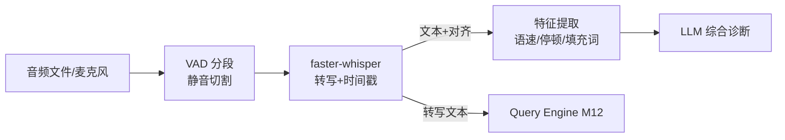

# M16 STT 与语音分析（whisper · VAD · 口语诊断）

| 项 | 值 |
|---|---|
| 生产进度 | Sprint 11 · 里程碑 MI-5「语音」 |
| 代码落点 | `backend/agent_godot/voice/`（stt/vad/features） |
| 前置模块 | M02（whisper 服务接入复用网关韧性管道）· M04（transcribe/analyze 注册为工具） |
| 手写比例 | 接入层与应用层 100% 手写；声学模型（whisper）只用不写 |
| 教程映射 | 📘 zero2Agent 10 课 · 📝笔记 STT/语音 · faster-whisper 文档 |

---

## 0. 本模块在项目中的位置

两条产品线用语音：① **语音输入**——对着麦克风说"给玩家加双跳"，转写后进 Query Engine（M12）；② **口语诊断**（面试练习场景移植）：分析录音的语速/停顿/填充词，产出诊断报告（本项目演示"语音特征工程"这一通用能力，Godot 侧可用于录制旁白/台词的质检）。

**交付后状态**：`voice transcribe interview.wav` 出带时间戳转写；`voice analyze interview.wav` 出诊断报告（语速 182 字/分、填充词"就是"×23、最长停顿 4.2s@08:31...）；聊天里语音消息自动转文字进入对话。



---

## 1. 知识点详解

### 1.1 语音转文字管线（VAD → ASR）

**① 原理**

**VAD（Voice Activity Detection）** 先切出"有人说话的段"再送 ASR：省算力（静音不跑模型）+ 质量更高（whisper 对长静音易幻觉出"谢谢观看"——训练数据里 YouTube 片尾的污染，著名坑）。Silero-VAD 输出逐帧语音概率，按阈值+最短段长+最短间隔合并成段。

**whisper 的三合一输出**：转写文本 + **词/段级时间戳**（word_timestamps=True）+ 语言检测。时间戳是特征工程的全部数据源——语速、停顿全从它算。

```text
chunk 策略：VAD 段 >30s 再切（whisper 上下文 30s 窗口）；段间带 0.5s 重叠防切词
后处理：繁简转换/标点恢复（whisper 自带）/ 语气词过滤开关
```

**② 演进**：HMM-GMM 时代（需要发音词典）→ E2E 神经 ASR（DeepSpeech/Conformer）→ **whisper**（2022 OpenAI：68 万小时弱监督训练，多语言+零样本鲁棒性革命性）→ faster-whisper（CTranslate2 重写，4 倍速+显存减半）→ Paraformer/SenseVoice（中文更优，可替换）。工程锚点：**我们只写"管线与后处理"，声学模型是可替换件**。

**③ 最小案例**：

```python
from faster_whisper import WhisperModel
model = WhisperModel("large-v3", device="cuda", compute_type="float16")

def transcribe(path: str) -> TranscriptionResult:
    segments, info = model.transcribe(
        path, language="zh", vad_filter=True, vad_parameters=dict(
            min_silence_duration_ms=500,          # 静音>500ms 才切段
            speech_pad_ms=200),                   # 段前后各补 200ms 防切字
        word_timestamps=True)
    return TranscriptionResult(
        language=info.language,
        segments=[Seg(s.start, s.end, s.text, s.words) for s in segments])
```

**④ 易错点**
- word_timestamps 与 vad_filter 同开时段时间戳要重对齐（段是 VAD 后的，原音频时间要加回 pad）
- 中文语速按"字/分"、英文按"词/分"——先语言检测再选单位，混算出鬼数
- whisper 幻觉（静音段编造内容）：VAD 前置 + `condition_on_previous_text=False`（长音频防前文污染传播）双防

### 1.2 语音特征工程（从时间戳到诊断指标）

**① 原理**

转写只是数据，特征才是洞见。三类核心指标（全部从词级时间戳推导，零额外模型）：

```text
流利度
  语速 = 有效语音时长内字数/分钟（剔除停顿）
  停顿 = 相邻词间隙 >0.8s（思考型）/ >2s（卡壳型）分别计数与分布
  节奏方差 = 语速的滑动窗标准差（忽快忽慢检测）
填充词
  词表匹配："就是/然后/那个/嗯/呃/equal/like"
  密度 = 填充词/总词数（中文口语正常 5~8%，>12% 显著）
结构（LLM 辅助）
  回答是否有 STAR 结构、要点覆盖、结论先行——LLM 读转写判，规则判不了
```

**特征工程的通用方法论**（可迁移到任何领域）：原始信号 → 可计算指标 → **指标的业务化解释**（"182 字/分"要翻译成"语速偏快，听众易疲劳，建议 150~170"——阈值标定来自领域知识，写进配置可调）。

**② 演进**：人工听录音评估（主观）→ 规则指标（客观但零散）→ 指标+LLM 综合诊断（结构化输入给模型，报告有理有据）。与 RAG 引用同理：**LLM 的判断要挂在可复核的数值上**（报告里"语速过快 [实测 182，参考区间 150-170]"），不是纯嘴说。

**③ 最小案例**：停顿与语速计算

```python
def pauses(words: list[WordInfo], threshold: float = 0.8) -> list[Pause]:
    out = []
    for a, b in zip(words, words[1:]):
        gap = b.start - a.end
        if gap >= threshold:
            out.append(Pause(start=a.end, duration=gap,
                             kind="卡壳" if gap > 2 else "思考"))
    return out

def speech_rate(words, total_audio_s: float, pause_s: float, lang: str) -> float:
    effective = total_audio_s - pause_s                 # 剔除停顿的"纯说话时间"
    unit = len(words) if lang.startswith("en") else sum(len(w.text) for w in words)
    return unit / (effective / 60)
```

**④ 易错点**
- 语速分母用"纯说话时间"而非音频总长——含 30s 静音的录音直接腰斩语速
- 词表匹配要做归一化（"就是就是"连说、大小写、繁简）且只统计口语语境（引述别人原话不算——LLM 结构分析时豁免标注）
- 特征阈值（0.8s/2s 停顿、5~8% 填充率）进配置文件，标注数据来源——"魔法数"要可追溯

### 1.3 诊断报告生成（结构化输入 → LLM）

**① 原理**

特征值 + 转写全文喂给 LLM 生成报告——关键是**输入的结构化**与**输出的模板化**：

```python
DIAGNOSE_PROMPT = """基于以下实测数据与转写，生成口语诊断报告。
实测数据（优先采信，不得改写数值）：
{features_json}
转写全文（用于结构与内容分析）：
{transcript}
输出模板：
## 总评（一句话+总分 10 分制）
## 流利度（引用实测值对照参考区间）
## 填充词 Top3（词/次数/出现语境）
## 结构性建议（结合内容）
## 3 条可执行改进项
要求：每个论断标注数据依据；数据与内容矛盾时以数据为准。"""
```

**② 演进**：纯 LLM 听音频（贵、慢、不能复核）→ 特征工程+LLM 综合（当前形态）→ 多模态模型直评（未来，但可复核性仍不如数值特征）。

**③ 最小案例**：报告数据回路——报告里每个 `[实测: x]` 标记可回链到原始时间戳（点击跳音频位置），复用 M10 的引用思想：**诊断报告也要"引用溯源"**。

**④ 易错点**
- 长转写（>30min）超 LLM 上下文：分段诊断再汇总（复用 M07 压缩思想）
- LLM 倾向"和稀泥"评语——提示里强制"必须指出最严重的一个问题"
- 报告落盘同时存特征 JSON（可复核、可二次分析——审计思维一以贯之）

### 1.4 语音输入集成（作为工具与入口）

**① 原理**：两条集成路径：CLI/Web 上传音频 → 后端 transcribe 工具 → 文本进 QueryEngine；聊天内语音消息（M20 前端录音组件）→ SSE 上行 → 同管线。**transcribe 是工具（模型可用），语音入口是产品功能（用户直接用）**——两个身份并存，M04 注册 + M19 API 各挂一份。

**②③④**：要点合并——麦克风流式 VAD（分段即转，实时反馈）是加分项可后置；上传格式统一转 16kHz mono wav（ffmpeg 预处理）；隐私：录音默认不落库、只存转写与特征（设置可开关，合规意识）。

---

## 2. 接口设计（完整签名）

```python
# voice/stt.py
@dataclass
class WordInfo: text: str; start: float; end: float
@dataclass
class Seg: start: float; end: float; text: str; words: list[WordInfo]
@dataclass
class TranscriptionResult:
    language: str; duration: float; segments: list[Seg]
class Transcriber:
    def __init__(self, model_name: str = "large-v3", device: str = "auto"): ...
    def transcribe(self, audio_path: Path) -> TranscriptionResult: ...

# voice/vad.py
def vad_segments(audio: np.ndarray, sr: int,
                 threshold: float = 0.5, min_speech_ms: int = 250,
                 min_silence_ms: int = 500) -> list[tuple[float, float]]: ...

# voice/features.py
@dataclass
class Pause: start: float; duration: float; kind: Literal["思考", "卡壳"]
@dataclass
class SpeechFeatures:
    speech_rate: float; pauses: list[Pause]; fillers: dict[str, int]
    rhythm_variance: float; total_speech_s: float
def extract_features(tr: TranscriptionResult,
                     filler_words: list[str]) -> SpeechFeatures: ...
def to_diagnosis_input(f: SpeechFeatures) -> dict: ...       # 报告输入 JSON

# 工具注册（M04）
@register_tool(readonly=True, risk="low")
class TranscribeTool(BaseTool): ...        # 音频路径 → 转写+时间戳
@register_tool(readonly=True, risk="low")
class AnalyzeSpeechTool(BaseTool): ...     # 音频路径 → 特征+诊断报告
```

## 3. 关键难点参考片段：whisper 服务化（GPU 复用）

模型加载 3~10 秒，每请求冷启不可接受——faster-whisper 常驻服务（deploy/compose 已列），本项目接入层走 HTTP：

```python
class RemoteTranscriber(Transcriber):
    """whisper 服务（TEI 同款部署模式）：本地大显存机或容器。"""
    async def transcribe(self, path: Path) -> TranscriptionResult:
        async with httpx.AsyncClient(timeout=600) as c:      # 长音频转写耗时
            r = await c.post(f"{self.base}/transcribe",
                files={"file": path.open("rb")},
                data={"language": "zh", "word_timestamps": "true"})
            r.raise_for_status()
            return TranscriptionResult.from_api(r.json())
        # 失败重试/熔断：直接复用 M02 with_retry + CircuitBreaker 包一层——
        # 网关韧性管道的又一次复用（第 3 次：LLM/embedding/whisper）
```

## 4. 手敲指引

| 步骤 | 文件 | 做什么 | 验证 |
|---|---|---|---|
| 1 | lab/m16/ | 自录 1 分钟样本 | 听一遍人工标注词数/停顿 |
| 2 | stt.py | 本地 faster-whisper | 转写准确率目测 >95% |
| 3 | vad.py | silero 分段 | 段边界与人工听感一致 |
| 4 | features.py | 三类特征 | 与人工标注对拍 |
| 5 | 诊断流 | LLM 报告 | 数值引用可回链 |
| 6 | 工具注册 | 两个工具 | 模型在对话中可用 |
| 7 | RemoteTranscriber | 服务化接入 | 断网重试验证 |

## 5. 测试与验收

```python
def test_speech_rate_excludes_pauses():
    # 60s 音频含 10s 静音、100 字 → 语速 = 100/(50/60) = 120 字/分（非 100）

def test_filler_count_normalization():
    # "就是就是" 连说计 2 次；"他说'那个'这个词" 引述不计（豁免标注场景）

def test_pause_kinds_threshold():
    # 0.8~2s → 思考；>2s → 卡壳；边界值 0.8 恰好不计
```

**验收 Demo（MI-5）**：录 3 分钟"自我介绍+项目讲解" → `voice analyze` 出报告（语速/填充词/停顿分布图 + LLM 结构建议）→ 聊天里发同一段语音，Agent 转写后正确响应语音里的请求（"帮我加双跳"）。

## 6. 踩坑记录（留白）

| 日期 | 坑 | 现象 | 根因 | 解法 | 关联知识点 |
|---|---|---|---|---|---|
|     |    |     |     |    |          |

## 7. 面试拷打

1. 为什么要 VAD 前置？whisper 静音幻觉是什么？
2. whisper 的时间戳有什么用？哪些特征完全依赖它？
3. 语速计算的分子分母分别是什么？为什么要剔除停顿？
4. 停顿 0.8s/2s 两档的依据？魔法数怎么管理？
5. 特征工程方法论的三步（信号→指标→业务解释）怎么迁移到游戏领域（如玩家行为分析）？
6. 诊断报告为什么要"数值引用可回链"？（与 RAG 引用同构）
7. condition_on_previous_text=False 防什么？
8. whisper 服务化与本地加载的取舍？韧性管道怎么复用？
9. 录音隐私的产品设计考量？
10. 开放题：实时语音对话（STT→LLM→TTS 全双工）的延迟预算怎么拆？各环节多少 ms？

## 8. 教程映射与延伸

- 📘 zero2Agent 10 课（stt & speech）
- 必读：whisper 论文（数据规模化思想）；faster-whisper README（性能对照表）
- 选读：Silero-VAD 文档；SenseVoice（中文替代方案对比）
