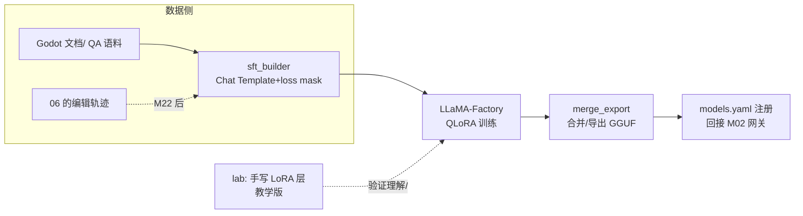

# M17 SFT 与 LoRA（监督微调 · 低秩适配 · 数据构造）

| 项 | 值 |
|---|---|
| 生产进度 | Sprint 12 · 里程碑 MI-6a「SFT/LoRA」 |
| 代码落点 | `training/datasets/`（sft_builder/quality）+ `training/sft/`（lora_layer/train_sft/merge_export）+ `lab/m17/` |
| 前置模块 | M01（Chat Template 也是 token）· M06（Godot 领域知识来源）· M22 预埋（评估先行） |
| 手写比例 | **② 手写教学版**：LoRA 层、loss mask、数据构造 100% 手写；生产训练用 LLaMA-Factory 配方 |
| 教程映射 | 📗 hello-agents 微调章 · 📝笔记 SFT/LoRA · LLaMA-Factory 文档 |

---

## 0. 本模块在项目中的位置

通用模型不懂你的领域细节（Godot 4.3 的 API 变更、你项目的代码风格）。两条路：RAG（外挂知识，M10）或微调（内化能力）。判定准则：**知识频繁更新→RAG；风格/格式/领域能力要稳定复现→微调**。本项目微调目标：让 qwen2.5-coder-7b 在 Godot 任务上贴近 deepseek-chat 的效果（本地免费、数据不出域）。

**交付后状态**：`lab/m17/lora_layer.py` 教学版 LoRA 在玩具任务收敛；LLaMA-Factory 跑通 Godot 语料 QLoRA 微调；合并导出的模型注册进 `models.yaml` 可被网关调用。



---

## 1. 知识点详解

### 1.1 SFT 的本质：条件概率的再校准

**① 原理**

预训练学了"通用语言的下一 token 分布"；SFT 用 `(指令, 期望回答)` 对把分布**校准到指令跟随格式**。损失依然是 next-token 交叉熵，差别全在数据形态与 **loss mask**：

```text
一条 SFT 样本的 token 序列（Chat Template 展开）：
<|im_start|>user\n 给敌人加碰撞伤害 <|im_end|>\n<|im_start|>assistant\n [改 enemy.gd ...] <|im_end|>
└──────────── 只算"格式怎么开头" ────────────┘└────────── 损失全在这段（回答）──────────┘

loss mask：prompt 部分 mask=-100（不参与损失），回答部分 mask=标签
→ 模型只学"怎么答"，不被"怎么问"分心，同一条数据的有效梯度密度翻倍
```

**为什么 SFT 不学提问部分**：学提问会让模型倾向模仿用户口吻（复读机化）；且问句分布千变万化，学它是浪费容量。面试一句话：**SFT = 在冻结的世界知识上，重练"对齐格式的条件概率"**。

**② 演进**：全参数微调（7B 要 8×A100，个人无缘）→ Prompt Tuning/Prefix Tuning（只训连续提示向量，容量小）→ **LoRA**（2021，低秩旁路，性价比革命）→ QLoRA（2023：4bit 量化基座+LoRA，7B 单卡 24G 可训）→（下一站 M18 的 RLHF/DPO/GRPO——从"模仿"到"择优"）。

**③ 最小案例** `lab/m17/loss_mask.py`（手搓一条样本的完整张量，这是全模块最值得跑的 40 行）

```python
from transformers import AutoTokenizer
tok = AutoTokenizer.from_pretrained("Qwen/Qwen2.5-Coder-7B-Instruct")

def build_sft_sample(instruction: str, answer: str):
    prompt_ids = tok.apply_chat_template(
        [{"role": "user", "content": instruction}], tokenize=True, add_generation_prompt=True)
    answer_ids = tok(answer, add_special_tokens=False)["input_ids"] + [tok.eos_token_id]
    input_ids = prompt_ids + answer_ids
    labels = [-100] * len(prompt_ids) + answer_ids.copy()     # ★ loss mask 现场
    return input_ids, labels
# 检查：labels 里 -100 的边界恰在 assistant 起始标记之后；
#       手数一遍 special token 数量与 template 字符串对齐——漏一个格式 token，训练全歪
```

**④ 易错点**
- Chat Template 每家不同（`<|im_start|>` vs `<s>[INST]`），**用错模板=训练出只会输出乱码的模型**——必须 `apply_chat_template` 而非手拼字符串
- EOS 要作为 label 学到（不学 EOS 推理时停不下来，车轱辘话无限生成）
- 样本截断（超 max_len 从中间截）会把完整回答砍成两半——要么整条丢弃，要么从回答尾部保头部
- 数据里 assistant 回答含"抱歉我不能"类拒答样本会教坏模型——质量过滤先于数量（1 万条精品 > 10 万条带毒）

### 1.2 LoRA：低秩假设与 ΔW=BA

**① 原理**

微调的本质是给权重找增量 ΔW。**低秩假设**：微调引起的变化是低秩的（任务只需要很少的"自由度"）——那么 ΔW 可以分解为两个瘦矩阵乘积：

\[
W' = W_0 + \Delta W = W_0 + BA, \quad B \in \mathbb{R}^{d \times r},\ A \in \mathbb{R}^{r \times k},\ r \ll \min(d,k)
\`

- **W₀ 冻结**（不进优化器、不存梯度态）——显存大头消失
- A 高斯初始化、**B 零初始化**（保证训练起点 ΔW=0，不破坏基座）
- 可训参数量 = 2·d·r（d=4096, r=16 时约 0.1%）
- 推理可合并：W' = W₀+BA 烘焙回原矩阵，**零额外延迟**（对比 Adapter 方案要串一层）
- 缩放因子 α/r：有效增量 = (α/r)·BA，控制 LoRA 的影响强度

**LoRA 挂载点**惯例：注意力层的 Wq、Wv（原论文结论）；现代实践（QLoRA 配方）常 q/k/v/o 全挂 + FFN 也挂，效果更好但参数更多。

**② 演进**：Adapter（串行小层，**推理加延迟**——LoRA 论文的靶子）→ LoRA（并行旁路，可合并零延迟）→ QLoRA（NF4 量化冻结基座+LoRA：7B 显存 80G→10G）→ DoRA/rsLoRA（改良变体）。理解锚点：LoRA 之于微调 ≈ 残差连接之于深网——**"不动原结构，加一条可学习的捷径"**。

**③ 最小案例** `lab/m17/lora_layer.py`（手写教学版，60 行看穿一切）

```python
import torch, torch.nn as nn

class LoRALinear(nn.Module):
    def __init__(self, base: nn.Linear, r: int = 8, alpha: int = 16):
        super().__init__()
        self.base = base                                  # 冻结的原层
        for p in self.base.parameters():
            p.requires_grad_(False)
        self.A = nn.Parameter(torch.randn(r, base.in_features) * 0.01)   # 高斯
        self.B = nn.Parameter(torch.zeros(base.out_features, r))         # ★ 零init
        self.scale = alpha / r

    def forward(self, x):
        return self.base(x) + self.scale * (x @ self.A.T @ self.B.T)
        # 训练只更新 A/B；ΔW = B@A 起点为零 → 起点行为=基座
```

实验：套在两层 MLP 上用玩具任务训练——观察 A/B 逐渐非零、损失下降；再实现 `merge()`（`base.weight += scale * B @ A`）验证合并前后输出 allclose。

**④ 易错点**
- B 零初始化（不是 A）：A 零 + B 高斯时起点 ΔW≠0，冷启动破坏基座输出
- r 不是越大越好（r=64+ 易过拟合小数据集）；α 常取 r 的 1~2 倍
- merge 后要删 LoRA 模块再 save，否则加载时结构对不上
- 多 LoRA 切换（网关里 godot-lora 与 code-lora 热切换）不 merge、运行时叠加——两种模式别混

### 1.3 训练数据构造（决定上限的脏活）

**① 原理**

SFT 数据三源（本项目）：

```text
A 文档指令化：Godot 官方文档 → LLM 生成 (Q, A) 对（"self-instruct" 路线）
   质量关键：A 必须基于文档原文生成（RAG 约束生成），否则模型学会编造
B 真实轨迹：M22 之后，把成功 craft 会话的事件流转成 (任务描述, 工具调用+代码回答) 样本
   ★ Agent SFT 的精华：模型学的不是"答案"而是"怎么用工具的过程"（tool_calls 序列也要进样本）
C 风格样本：本项目代码约定（M08 画像）→ 少量高质，教风格不教知识
配比与清洗：去重（MinHash 近重复）→ 规则过滤（拒答/太短/格式烂）→ 配比 A:B:C ≈ 5:4:1
```

**B 类轨迹样本**是 Agent 微调与普通 Chat 微调的分水岭：样本的 assistant 部分是**结构化的 tool_calls JSON + 代码**，loss mask 只盖这些——模型学的是"何时调什么工具、怎么写 Godot 代码"的联合分布。这类数据 M17 阶段先用人工示范顶（你手打 50 条高质量轨迹），M22 后自动化。

**② 演进**：人工标注（贵）→ Self-Instruct（2022，LLM 自产指令）→ Alpaca/Evol-Instruct（复杂度进化）→ 轨迹蒸馏（强模型跑 Agent 任务采集轨迹，微调小模型——这就是"DeepSeek-R1 蒸馏"与 Agent 微调的共同范式）。

**③ 最小案例**：轨迹样本构造（B 类核心逻辑）

```python
def trajectory_to_sample(task: str, events: list[AgentEvent]) -> tuple[str, str]:
    """成功会话事件流 → SFT 样本。assistant 部分重建 tool_calls 序列与最终回答。"""
    assistant_turns = []
    for ev in events:
        if ev.type == "tool_call_start":
            assistant_turns.append(("tool_calls", ev.payload))    # 结构化保留
        elif ev.type == "message_end":
            assistant_turns.append(("text", ev.payload["final_text"]))
    # 展开成多轮 messages：user(任务) → [assistant(tool) → tool(结果) →]* → assistant(答案)
    return render_chat_messages(task, assistant_turns)            # 再走 1.1 的 loss_mask
```

**④ 易错点**
- 失败轨迹别全扔：改写后是"错误纠正对"（模型看到坏结果→修正），少量掺入（<10%）有益
- 合成数据（A 类）的同质化：一个模板生成五千条"怎么用 move_and_slide"——去重后可能只剩五十条有效
- 学习率与数据量的匹配：1 万条 SFT 用 2e-4（LoRA 常规）会过拟合，先跑 loss 曲线再定

### 1.4 训练工程与部署回接

**① 原理**

生产配方（LLaMA-Factory，写配置不写训练循环）：

```yaml
# training/configs/qwen25coder_godot_qlora.yaml（节选）
model_name_or_path: Qwen/Qwen2.5-Coder-7B-Instruct
stage: sft
finetuning_type: lora
lora_rank: 16; lora_alpha: 32; lora_target: all       # qkvo+FFN 全挂
quantization_bit: 4                                     # QLoRA
dataset: godot_sft_v1                                   # datasets/ 注册
template: qwen                                          # ★ 必须与基座匹配
cutoff_len: 4096; per_device_train_batch_size: 2
gradient_accumulation: 8; learning_rate: 1.0e-4
num_train_epochs: 3.0; lr_scheduler_type: cosine
```

训练后三部曲：**评估（M22 GodotBench，先于一切）→ 合并导出（merge & 4bit GGUF 给 LM Studio / vLLM 起 OpenAI 兼容服务）→ models.yaml 注册（`sft: { default: local/godot-coder-sft }`）**。回接网关即插即用——M02 的适配器模式在此兑现"微调模型与云端模型同权"。

**②③④ 合并要点**：常见坑——cutoff_len 截断轨迹样本的 tool 序列（样本构造时就控长在 4k 内，而非训练时硬截）；eval_loss 与下游分数脱节（必须跑 GodotBench，loss 不代表任务能力）；显存不够先降 cutoff_len 再降 batch（梯度累积补）。

---

## 2. 接口设计（完整签名）

```python
# training/datasets/sft_builder.py
@dataclass
class SFTSample:
    messages: list[dict]                 # openai 格式（含 tool_calls 轮）
    source: Literal["doc_qa", "trajectory", "style"]
    weight: float = 1.0
class SFTBuilder:
    def from_docs(self, parsed: list[ParsedDoc], generator: LLM) -> list[SFTSample]: ...
    def from_trajectory(self, task: str, events: list[AgentEvent]) -> SFTSample | None: ...
    def to_sharegpt(self, samples: list[SFTSample], path: Path) -> None: ...
        # LLaMA-Factory 数据格式（含工具轮的 messages 结构）

# training/datasets/quality.py
class QualityFilter:
    def dedup(self, samples, threshold=0.9) -> list[SFTSample]: ...   # MinHash
    def rule_filter(self, samples) -> list[SFTSample]: ...             # 拒答/长度/格式
    def balance(self, samples, ratios: dict[str, float]) -> list[SFTSample]: ...

# training/sft/lora_layer.py（教学版，见 1.2）
class LoRALinear(nn.Module):
    def __init__(self, base: nn.Linear, r: int, alpha: int): ...
    def forward(self, x): ...
    def merge(self) -> nn.Linear: ...

# training/sft/train_sft.py
def run(config_path: Path) -> TrainReport: ...      # 封装 LLaMA-Factory CLI
def sweep(configs: list[Path]) -> list[TrainReport]: ...

# training/sft/merge_export.py
def merge_lora(base_model: str, adapter_dir: Path, out_dir: Path) -> None: ...
def export_gguf(model_dir: Path, quant: str = "q4_k_m") -> Path: ...
def register_to_models_yaml(model_dir: Path, alias: str) -> None: ...
```

## 3. 关键难点参考片段：loss mask 的边界验证

模板 token 数错一个，训练全歪且**不报错**（loss 照样下降）。手写一个"边界审计器"，训练前必跑：

```python
def audit_mask(sample_tokens, labels, tok):
    first_learn = next(i for i, l in enumerate(labels) if l != -100)
    decoded_prefix = tok.decode(sample_tokens[:first_learn])
    assert decoded_prefix.endswith("assistant\n"), \
        f"边界异常: mask 结束于 {decoded_prefix[-20:]!r}"
    assert labels.count(-100) + sum(1 for l in labels if l != -100) == len(labels)
    assert labels[-1] == tok.eos_token_id, "最后一位必须是 EOS 的标签"
    print(f"prompt {first_learn} tok / answer {len(labels)-first_learn} tok ✓")
```

为什么难：它防的是"沉默的错位"——没有它，template 改版、tokenizer 升级、数据重建任何一个动作都可能让整批数据 mask 错位，损失曲线一切正常，只有 GodotBench 分数雪崩才暴露。

## 4. 手敲指引

| 步骤 | 文件 | 做什么 | 验证 |
|---|---|---|---|
| 1 | lab/m17/loss_mask.py | 样本张量+审计器 | 边界对齐人工数 token |
| 2 | lab/m17/lora_layer.py | 教学版 LoRA+merge | 玩具任务收敛+merge allclose |
| 3 | datasets/quality.py | 去重/过滤/配比 | 万级样本跑通 |
| 4 | datasets/sft_builder.py | A 类文档指令化 | 抽检 50 条质量 |
| 5 | 轨迹样本 | 手打 50 条示范轨迹 | 事件流→样本正确 |
| 6 | train_sft.py | QLoRA 首跑 | loss 平滑下降 |
| 7 | merge_export + 注册 | 部署回接 | LM Studio 对话可用 |

## 5. 测试与验收

```python
def test_lora_zero_init_identity():
    layer = LoRALinear(base, r=8)
    x = torch.randn(4, base.in_features)
    assert torch.allclose(layer(x), base(x))            # ΔW 起点=0

def test_mask_boundary():
    ids, labels = build_sft_sample("hi", "hello")
    audit_mask(ids, labels, tok)                        # 不抛即通过

def test_dedup_collapses_near_duplicates():
    # 5000 条模板同质样本去重后 < 500
```

**验收 Demo（MI-6a）**：教学版 LoRA 收敛曲线截图 + LLaMA-Factory 训练完成 + `models.yaml` 注册后 `godot-agent ask --model local/godot-coder-sft "Area2D 检测碰撞的信号"`——回答风格明显贴合训练数据（GodotBench 量化留 M22）。

## 6. 踩坑记录（留白）

| 日期 | 坑 | 现象 | 根因 | 解法 | 关联知识点 |
|---|---|---|---|---|---|
|     |    |     |     |    |          |

## 7. 面试拷打

1. SFT 与预训练的损失函数相同，差别在哪？（数据形态+loss mask）
2. 为什么 prompt 部分 mask -100？不 mask 会怎样？
3. Chat Template 用错会发生什么？为什么必须 apply_chat_template？
4. LoRA 的低秩假设是什么？A/B 谁零初始化、为什么？
5. LoRA 为什么推理零延迟？Adapter 方案差在哪？
6. r 和 α 的作用？rank 大就好吗？
7. QLoRA 怎么把 7B 塞进单卡？（NF4 量化基座 + 冻结 + LoRA 旁路 fp16）
8. 轨迹样本（tool_calls 进 SFT）与普通 QA 样本的区别？loss mask 怎么处理工具轮？
9. eval_loss 降但下游任务分不涨，怎么办？（以 benchmark 为准 + 数据质量排查）
10. 开放题：RAG 与微调怎么配合而不是二选一？（知识外挂+能力内化；更新频率分界；成本曲线）

## 8. 教程映射与延伸

- 📗 hello-agents 微调章（LoRA/SFT 基础与本项目同型）
- 必读：LoRA 论文（Hu 2021）；QLoRA 论文（Dettmers 2023，读 NF4 与双重量化节）
- 选读：Self-Instruct；LLaMA-Factory README（配置项字典）
