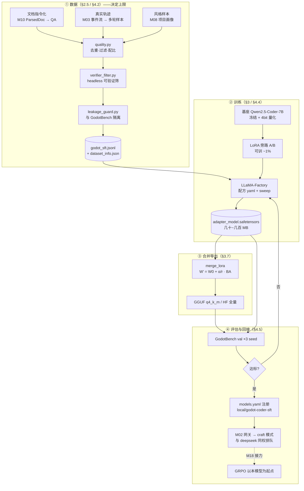

# M17 SFT 与 LoRA（监督微调 · 低秩适配 · 数据构造 · 回接网关）

> 本文档共 11 节 + 18 道面试题，覆盖：零基础地基（§1）→ SFT 全链路（§2，含基座选型/多轮 mask/packing/CPT/训练工程）→ LoRA 全链路（§3，含 SVD/梯度推导/QLoRA/变体/合并部署）→ 本项目落地（§4）→ 接口与施工（§5~§8）。

| 项 | 值 |
|---|---|
| 生产进度 | Sprint 12 · 里程碑 MI-6a「SFT/LoRA」 |
| 代码落点 | `lab/m17/`（9 个教学实验）+ `training/datasets/`（9 文件）+ `training/sft/`（4 文件）+ `training/configs/`（2 文件），见 §0.5 |
| 前置模块 | M01（Chat Template 也是 token）· M03（事件流=训练数据母语）· M04（工具 Schema 决定样本里的 tool_calls 形态）· M06（headless 校验=可验证数据筛）· M08（项目画像=风格样本源）· M10（ParsedDoc=文档样本源）· M22 预埋（评估先行，没评分就没有模型选择） |
| 手写比例 | 教学版（LoRA 层/loss mask/packing/显存账本/数据构造）100% 手写；生产训练用 LLaMA-Factory 配方 |
| 教程映射 | 📗 hello-agents 微调章 · 📝笔记 SFT/LoRA · LoRA 论文（Hu 2021）· QLoRA 论文（Dettmers 2023）· LLaMA-Factory 文档 |

> **本版改动**：补齐零基础地基（§1 从"权重是什么"讲起）、补齐 LoRA 底层（SVD 直觉 + 梯度手推 + 显存账本公式）、补齐 SFT 工程细节（packing 污染、训练动力学、遗忘对策），并把计划功能**重新对齐到本仓库真实代码**：`AgentEvent` 事件流 → 轨迹双源录制器（§4.2）、`ToolRegistry` 的 FC Schema → 样本里的 tool_calls 一致性（§4.3）、`GodotRunner` → 可验证数据筛选（§6 难点片段 C）、`models.yaml` → 训练产物回接（§4.5）。
>
> **二次增补**（完整性审查后补的 6 个缺口）：§2.0 基座选型（base vs Instruct，实操第一决策）、§2.3 多轮对话+工具轮的 mask 构造（本项目轨迹全是多轮，单轮版不够用）、§2.8 两阶段范式 CPT→SFT、§2.9 训练工程四件套原理（梯度累积/检查点/混合精度/优化器）、§3.7 模型合并方法族（TIES/DARE/SLERP）、§3.6 补 LongLoRA；面试题扩到 18 道。

---

## 0. 本模块在项目中的位置

**大白话**：通用模型是**通识大学毕业的员工**——什么都懂一点，但不了解你们公司的 Godot 4.3 变更和代码风格。两条培养路线：**RAG（外挂知识，M10）=给他配一个随查随用的资料库**——快、可更新，但每次都要"去查"；**微调（内化能力）=送他去岗位培训班**——把领域技能练进肌肉记忆，稳定复现不用想。判据：**知识频繁更新→RAG；风格/格式/领域能力要稳定→微调**（两条路最终配合，见面试题 10）。本模块目标：让 qwen2.5-coder-7b 在 Godot 任务上贴近 deepseek-chat（本地免费、数据不出域）。

**交付后状态**：教学版 LoRA 在玩具任务收敛；LLaMA-Factory 跑通 Godot 语料 QLoRA 微调；合并导出模型注册进 `models.yaml` 被网关调用——M02 适配器模式兑现"微调模型与云端模型同权"。

---

## 0.1 阅读导航（四种读者四条路线）

**前置自测**（不会的话从 §1 读起，会的话直接跳 §2）：

1. 我知道交叉熵是什么、`-100` 在 PyTorch 里是什么含义吗？
2. 我能说清"一次 SGD 更新"到底改了哪几个数字吗？
3. 我知道 `apply_chat_template` 输出的那串 token 里，哪几个是特殊符号吗？
4. 我能解释"矩阵的秩"是什么意思吗？

| 读者 | 路线 | 预计 |
|---|---|---|
| 零基础（4 问全不会） | §0.2 → §1 全部 → §2 → §3 → §4 → §7 手敲 | 2~3 天 |
| 懂深度学习、没做过微调 | §2 → §3 → §4（重点 §2.3/§2.4/§3.4） | 半天 |
| 只要在本项目落地 | §0.5 → §4 → §5 接口 → §7 手敲 → §8 测试 | 半天 |
| 只要面试 | §10 面试拷打（18 题）→ 不会的题按"关联知识点"回溯 | 1 小时 |

**配套实验**：`lab/m17/` 下 9 个脚本按编号顺序跑一遍，等于把本文档手做一遍（每个脚本自带 `assert` 自检）。

```bash
uv run python lab/m17/00_nn_from_scratch.py      # 权重到底是什么（纯 numpy）
uv run python lab/m17/01_ce_and_mask.py          # 交叉熵与 -100
uv run python lab/m17/02_autoregressive.py       # 自回归与 EOS
uv run python lab/m17/03_tokenizer_template.py   # Chat Template 逐 token 解剖
uv run python lab/m17/04_loss_mask.py            # SFT 样本张量 + 边界审计
uv run python lab/m17/05_rank_svd.py             # 低秩直觉
uv run python lab/m17/06_lora_layer.py           # 手写 LoRA 层
uv run python lab/m17/07_inject_qwen.py          # 注入真实模型 + 显存账本
uv run python lab/m17/08_train_toy.py            # 玩具任务端到端训练 + merge 验证
```

---

## 0.2 全景图：一次微调的完整生命周期



一句话记住这张图：**数据定上限，LoRA 决定怎么便宜地学到，评估决定能不能上岗，models.yaml 决定上哪个岗**。

---

## 0.5 ★ 施工文件清单（开工前必看的一页表）

**本模块你一共要新建 24 个文件**（lab 先行吃透原理，再上生产配方）：

### A 组：`lab/m17/` 教学实验（跑通即扔，不进生产依赖）

| # | 文件 | 职责一句话 | 关键函数 | 预估行数 | 手敲步骤(§7) | 依赖 |
|---|---|---|---|---|---|---|
| 1 | `lab/m17/00_nn_from_scratch.py` | 纯 numpy 手搓 MLP 反向传播 | `train_xor` | 60 | 步骤 1 | numpy |
| 2 | `lab/m17/01_ce_and_mask.py` | 交叉熵手算对拍 + `-100` 行为 | `ce_manual`、`demo_ignore` | 50 | 步骤 1 | torch |
| 3 | `lab/m17/02_autoregressive.py` | 自回归采样 + EOS 停不下来的复现 | `generate`、`demo_no_eos` | 60 | 步骤 1 | torch |
| 4 | `lab/m17/03_tokenizer_template.py` | Chat Template 逐 token 解剖 | `dissect` | 50 | 步骤 2 | transformers |
| 5 | `lab/m17/04_loss_mask.py` | SFT 样本张量 + 边界审计器 | `build_sft_sample`、`audit_mask` | 70 | 步骤 2 | transformers |
| 6 | `lab/m17/05_rank_svd.py` | SVD 低秩近似实验 | `low_rank_approx` | 50 | 步骤 3 | numpy |
| 7 | `lab/m17/06_lora_layer.py` | 教学版 LoRA 层（含 merge） | `LoRALinear` | 90 | 步骤 3 | torch |
| 8 | `lab/m17/07_inject_qwen.py` | 往真实模型注入 + 参数/显存账本 | `inject_lora`、`memory_report` | 90 | 步骤 4 | transformers |
| 9 | `lab/m17/08_train_toy.py` | 玩具任务端到端训练 + merge 后 allclose | `train_toy`、`assert_merge_identity` | 90 | 步骤 4 | torch |

### B 组：`training/datasets/` 数据工程（本模块真正的价值所在）

| # | 文件 | 职责一句话 | 关键类/函数 | 预估行数 | 手敲步骤(§7) | 依赖 |
|---|---|---|---|---|---|---|
| 10 | `training/datasets/__init__.py` | 空包 + 版本常量 | `DATASET_VERSION` | 15 | 步骤 0 | — |
| 11 | `training/datasets/schema.py` | 样本数据结构与项目常量 | `SFTSample`、`Trajectory` | 60 | 步骤 0 | pydantic?（用 dataclass，零依赖） |
| 12 | `training/datasets/trajectory_recorder.py` | ★ 挂 EventBus 的双源轨迹录制 | `TrajectoryRecorder` | 90 | 步骤 5 | M03 EventBus |
| 13 | `training/datasets/trajectory_builder.py` | 轨迹 → 训练样本（含纠错对） | `trajectory_to_sample`、`to_repair_pair` | 120 | 步骤 5 | M04 ToolCall |
| 14 | `training/datasets/doc_qa_builder.py` | ParsedDoc → RAG 约束 QA | `from_docs` | 90 | 步骤 6 | M10 ParsedDoc |
| 15 | `training/datasets/style_builder.py` | 项目画像 → 风格/格式样本 | `from_profile` | 60 | 步骤 6 | M08 profile |
| 16 | `training/datasets/quality.py` | 去重/规则过滤/配比/分桶 | `QualityFilter` | 140 | 步骤 7 | 无 |
| 17 | `training/datasets/verifier_filter.py` | ★ headless 可验证筛选（Godot 独有） | `verify_gdscript` | 80 | 步骤 7 | M06 GodotRunner |
| 18 | `training/datasets/leakage_guard.py` | 与 GodotBench 防泄漏三闸对齐 | `LeakageGuard` | 60 | 步骤 7 | M22 tasks |
| 19 | `training/datasets/mix_export.py` | 配比导出 + 数据集卡（dataset card） | `export_sharegpt`、`write_card` | 90 | 步骤 8 | 无 |

### C 组：`training/sft/` + 配置（训练与回接）

| # | 文件 | 职责一句话 | 关键函数 | 预估行数 | 手敲步骤(§7) | 依赖 |
|---|---|---|---|---|---|---|
| 20 | `training/sft/__init__.py` | 空包 | — | 5 | 步骤 0 | — |
| 21 | `training/sft/lora_layer.py` | 生产可读版 LoRA 层（教学版同款，可被 import） | `LoRALinear`、`inject_lora`、`merge_lora` | 120 | 步骤 9 | torch |
| 22 | `training/sft/train_sft.py` | LLaMA-Factory 封装 + 超参 sweep | `run`、`sweep` | 90 | 步骤 10 | llamafactory |
| 23 | `training/sft/merge_export.py` | 合并 → GGUF → 注册 models.yaml | `merge_lora`、`export_gguf`、`register` | 110 | 步骤 11 | llama.cpp |
| 24 | `training/sft/eval_gate.py` | 训练后自动跑 GodotBench 子集并出闸门结论 | `evaluate`、`gate` | 80 | 步骤 11 | M22 runner |
| — | `training/configs/qwen25coder_godot_qlora.yaml` | 生产配方 | — | 60 | 步骤 10 | — |
| — | `training/configs/dataset_info.json` | LLaMA-Factory 数据集登记 | — | 25 | 步骤 8 | — |

**完成后你拥有**：`models.yaml` 里多一行 `local/godot-coder-sft`，`routing.craft` 指过去，`godot-agent craft` 用的就是你自己训出来的模型。

---

# 第一部分 地基（零基础补齐）

> 本部分的目标：让你闭着眼睛也能回答"微调到底在改什么"。全部代码可直接运行。

## 1.1 权重的本质：一次更新改了哪几个数字

**① 严格定义**：神经网络 = 一堆**参数矩阵**（权重 W、偏置 b）与固定的计算图。训练 = 前向算出 loss → 反向求出每个参数的梯度 → 按 `p ← p − lr·g` 更新。**"预训练"与"微调"在数学上是同一个动作**，区别只有三点：起始参数（随机 vs 预训练权重）、数据（海量无标注 vs 精选指令对）、学习率与步数。

**② 大白话**：模型是一本**填满数字的账簿**（7B 模型 = 70 亿个可调节的旋钮）。推理 = 按账簿算账；训练 = 找出"算错的账"该怪哪个旋钮，把旋钮拧一点点。**微调就是拧旋钮，只拧一点点**。LoRA 的天才之处在于：**不拧原账簿，而是在旁边贴一张小抄（ΔW），最后把小抄并进去**。

**③ 举例**（`lab/m17/00_nn_from_scratch.py`，纯 numpy 无框架，跑通即懂反向传播）：

```python
import numpy as np
rng = np.random.default_rng(0)

# 数据：XOR（线性模型学不会，逼出隐藏层）
X = np.array([[0, 0], [0, 1], [1, 0], [1, 1]], dtype=np.float32)
y = np.array([[0], [1], [1], [0]], dtype=np.float32)

# 参数（= 账簿）：2→8→1 的两层 MLP
W1 = rng.normal(0, 0.5, (2, 8)).astype(np.float32); b1 = np.zeros((1, 8), np.float32)
W2 = rng.normal(0, 0.5, (8, 1)).astype(np.float32); b2 = np.zeros((1, 1), np.float32)

relu      = lambda z: np.maximum(0, z)
relu_grad = lambda z: (z > 0).astype(np.float32)

for step in range(1, 3001):
    # ---- 前向：账簿 → 预测 ----
    z1 = X @ W1 + b1
    a1 = relu(z1)
    out = a1 @ W2 + b2
    loss = np.mean((out - y) ** 2)                    # 均方误差

    # ---- 反向：链式法则，谁该背锅 ----
    dout = 2 * (out - y) / len(X)                     # ∂L/∂out
    dW2 = a1.T @ dout;               db2 = dout.sum(0, keepdims=True)
    da1 = dout @ W2.T                                 # 梯度往回传
    dz1 = da1 * relu_grad(z1)                         # 过激活函数
    dW1 = X.T @ dz1;                 db1 = dz1.sum(0, keepdims=True)

    # ---- 更新：★ 微调的全部秘密就是这三行 ----
    lr = 0.5
    for p, g in ((W1, dW1), (b1, db1), (W2, dW2), (b2, db2)):
        p -= lr * g

    if step % 1000 == 0:
        acc = ((out > 0.5) == y).mean()
        print(f"step {step:5d}  loss={loss:.4f}  acc={acc:.0%}")

assert float(np.mean((((X @ W1 + b1).clip(0) @ W2 + b2) > 0.5) == y)) == 1.0, "XOR 没学会"
print("✓ XOR 100% —— 这就是一次完整的训练")
```

**④ 演进**：感知机（1958）→ 反向传播（1986）→ 深度卷积（2012）→ Transformer（2017）→ 大模型预训练（2020+）→ PEFT/LoRA（2021+）。**越往后，"从头训"越少，"改一点点"越多**——这是本模块存在的产业背景。

**⑤ 易错点**：
- 把"微调"想象成往模型里"塞知识"——错。它调的是**条件概率分布**，知识的注入效率极低（一条事实要训几十遍才记住，且会污染别的事实）→ 事实类知识请走 RAG。
- 以为 lr 越大学得越快——错。lr 过大会让 loss 震荡甚至 NaN（§2.6 曲线诊断）。
- 忘了 `p -= lr*g` 是**原地改**：这也是为什么训练前要备份基座权重（merge 后想回退必须有原始 W₀）。

## 1.2 交叉熵与 `-100`（SFT 的技术心脏）

**① 严格定义**：语言模型的输出是词表上的**概率分布**。交叉熵损失衡量"模型把多少概率给了正确答案"：

\[
\mathcal{L} = -\log p_\theta(x_t \mid x_{<t}) = -\log \frac{\exp(z_t[y])}{\sum_j \exp(z_t[j])}
\]

PyTorch 的 `F.cross_entropy(logits, target, ignore_index=-100)` 里，`ignore_index=-100` 表示：**这个位置不计损失、不产生梯度**。`-100` 不是魔法数字，只是一个**约定俗成的哨兵值**（token id 都是 ≥0 的整数，负数天然不会冲突）。

**② 大白话**：交叉熵 = **考试扣分**：模型对每个空给出"我觉得每个候选词的把握"，正确答案拿到的把握越高，扣分越少（全对扣 0 分，把握 50% 扣 0.69 分，把握 1% 扣 4.6 分）。`-100` = **这道题不考**（老师划掉的部分）——不计分、不影响平时分（梯度）。SFT 的 loss mask 就是给 prompt 部分的每一道题都盖上"不考"的章。

**③ 举例**（`lab/m17/01_ce_and_mask.py`）：

```python
import torch
import torch.nn.functional as F

logits = torch.tensor([[2.0, 1.0, 0.1],    # 样本1：logits（未归一化的打分）
                       [0.5, 2.0, 0.3]])   # 样本2
target = torch.tensor([0, 1])              # 正确 token id

# ---- 手算交叉熵（对拍用）----
def ce_manual(logits, target):
    z = logits - logits.max(dim=-1, keepdim=True).values   # 减最大值 = 数值稳定 trick
    logp = z - torch.logsumexp(z, dim=-1, keepdim=True)    # log softmax
    picked = logp.gather(-1, target.unsqueeze(-1)).squeeze(-1)
    return -picked

mine, theirs = ce_manual(logits, target), F.cross_entropy(logits, target, reduction="none")
assert torch.allclose(mine, theirs, atol=1e-6), "手算与框架不一致，公式理解有误"
print("每个位置的损失:", mine.tolist())          # [0.4170, 0.3412]

# ---- -100 的行为：不进损失、不进均值 ----
target_masked = torch.tensor([0, -100])
print("mask 后均值:", F.cross_entropy(logits, target_masked).item())   # == 只有样本1 的 0.4170
assert F.cross_entropy(logits, target_masked).item() == mine[0].item()

# ---- 梯度验证：被 mask 的位置梯度恒为 0 ----
w = logits.clone().requires_grad_(True)
F.cross_entropy(w, target_masked).backward()
assert torch.all(w.grad[1] == 0), "被 mask 的位置竟然有梯度！"
print("✓ -100 位置梯度全零：mask 是真的生效，不只是显示问题")
```

**④ 演进**：均方误差（早期语言建模）→ 交叉熵（标配）→ label smoothing（防过拟合，SFT 少用）→ **masked CE（SFT 标配）** → DPO/GRPO 的偏好损失（M18，不再需要"标准答案 token"）。

**⑤ 易错点**：
- 手算时忘了减最大值 → `exp(1000)` 溢出成 `inf` → NaN。所有框架内部都做了这个 stabilization。
- 用 `reduction="mean"` 时，**mask 掉的位置不计入分母**（PyTorch 行为正确），但自己写 loss 时容易写成 `sum / len(all)` → 有效 token 越少 loss 越小，**短样本被高估** → 训练偏向短回答。生产框架（LLaMA-Factory）用 token 级 mean，自写循环务必对齐。
- `-100` 只对 `cross_entropy` 生效；如果你自己写 `log_softmax + gather`，要手动过滤，否则 `-100` 会变成非法索引直接报错。

## 1.3 自回归生成与 EOS（为什么必须学"结束符"）

**① 严格定义**：生成是**逐步采样**：\(x_t \sim p_\theta(\cdot \mid x_{<t})\)，把采样出的 token 拼回输入继续。停止条件是采到 **EOS**（end-of-sequence，Qwen 系列是 `<|im_end|>`）。SFT 数据中如果不把 EOS 作为 label 训练，模型**永远不知道该停**。

**② 大白话**：自回归 = **接龙**：你说一个字，我接一个字，我接的字又变成你接下来要接的上下文。EOS 是**"我说完了"这句话本身**——如果教材里每次示范都以"师傅突然被打断"结尾（没有结束语），徒弟学完后就会**永远说个不停**（车轱辘话、重复到最后被 max_tokens 截断）。

**③ 举例**（`lab/m17/02_autoregressive.py`）：

```python
import torch
import torch.nn.functional as F

VOCAB, EOS_ID = 8, 7
model = torch.nn.Linear(VOCAB, VOCAB, bias=False)   # 玩具模型：直接预测下一个 token

@torch.no_grad()
def generate(model, prompt: list[int], max_new=20, temperature=1.0, top_p=0.9,
             eos_id=EOS_ID) -> list[int]:
    ids = list(prompt)
    for _ in range(max_new):
        logits = model(torch.tensor([ids]))[0, -1] / temperature
        probs = F.softmax(logits, dim=-1)
        # top-p（核采样）：只在累积概率达到 p 的最小候选集里采样
        sorted_p, sorted_i = torch.sort(probs, descending=True)
        keep = torch.cumsum(sorted_p, dim=-1) <= top_p
        keep[0] = True                                        # 至少留一个
        cand_i, cand_p = sorted_i[keep], sorted_p[keep]
        nxt = cand_i[torch.multinomial(cand_p / cand_p.sum(), 1)].item()
        ids.append(nxt)
        if nxt == eos_id:
            break
    return ids

# 实验：把 EOS 的 logit 人为压到极低，模拟"训练时没学 EOS"
with torch.no_grad():
    model.weight[EOS_ID] = -50.0
out = generate(model, [1, 2, 3], max_new=20)
print("未学 EOS 的生成长度:", len(out), "→ 必然打满 max_new（车轱辘话的成因）")
assert len(out) == 23, "实验失效：应打满 20 个新 token"
```

**④ 演进**：greedy → beam search（翻译时代）→ temperature/top-k/top-p（对话时代）→ 结构化生成约束（JSON schema 约束解码，本项目工具调用需要）。

**⑤ 易错点**：
- **训练时不加 EOS → 推理停不下来**（最常见的"SFT 翻车"）。修正：`answer_ids = tok(answer) + [eos_id]`。
- 训练时把 **pad token 的 label 设成 eos** → 模型学会吐 `<|endoftext|>`。正确：pad 位置 label 必须是 `-100`。
- 评估/推理的 `stop` 词表要包含 `<|im_end|>`，否则 vLLM 会把它当普通文本吐出来。

## 1.4 Tokenizer 与 Chat Template（SFT 最容易静默翻车的一环）

**① 严格定义**：Tokenizer 把文本切成 **token id 序列**（BPE 子词算法）。模型只认识 id。**Chat Template** 是把 `messages` 列表（role/content）渲染成**带特殊 token 的 id 序列**的规则，各家不同：

| 模型族 | 角色标记 | 生成提示符 |
|---|---|---|
| Qwen2.5 | `<\|im_start\|>role\n…<\|im_end\|>\n` | `<\|im_start\|>assistant\n` |
| Llama3 | `<\|start_header_id\|>role<\|end_header_id\|>\n\n…<\|eot_id\|>` | 同左 role=assistant |
| ChatGLM | `[gMASK]sop<|user|>\n …` | `<\|assistant\|>` |

**必须用 `tok.apply_chat_template(...)`**，不许手拼字符串——模板里有换行、特殊 token 合并规则、add_special_tokens 开关，手拼几乎必然差一两个 token。

**② 大白话**：Tokenizer = **把中文拆成字典里有的零件**（"碰撞检测" 可能切成 "碰撞"+"检测" 两个零件）。Chat Template = **剧本格式**：谁说话、从哪开始说到哪结束，都要有舞台提示（`<|im_start|>assistant`）。**训练和推理必须用同一份剧本**——你按 Qwen 的剧本排练（训练），上台却按 Llama 的剧本演（部署），演员（模型）看到的全是没见过的提示，只能乱演（乱码/复读）。

**③ 举例**（`lab/m17/03_tokenizer_template.py`）：

```python
from transformers import AutoTokenizer

BASE = "Qwen/Qwen2.5-Coder-7B-Instruct"
tok = AutoTokenizer.from_pretrained(BASE)

msgs = [{"role": "user", "content": "给敌人加碰撞伤害"}]

# ① 不带生成提示符（训练时构造 prompt 段用）
full = tok.apply_chat_template(msgs, tokenize=False)
print(repr(full))
# '<|im_start|>user\n给敌人加碰撞伤害<|im_end|>\n'

# ② 带生成提示符（add_generation_prompt=True）—— SFT 构造 prompt 段必须用这个
prompt = tok.apply_chat_template(msgs, tokenize=False, add_generation_prompt=True)
print(repr(prompt))
# '<|im_start|>user\n给敌人加碰撞伤害<|im_end|>\n<|im_start|>assistant\n'

# ③ 逐 token 解剖（★ 训练前必做一次肉眼核对）
ids = tok.apply_chat_template(msgs, tokenize=True, add_generation_prompt=True)
for tid, piece in zip(ids, tok.convert_ids_to_tokens(ids)):
    print(f"{tid:>7}  {piece!r}")
# 151644 '<|im_start|>'  872 'user'  198 '\n'  …  151645 '<|im_end|>'  198 '\n'
# 151644 '<|im_start|>'  77091 'assistant'  198 '\n'   ← 生成提示符：回答从这里开始

print("特殊 token:", tok.special_tokens_map)
print("eos:", tok.eos_token, tok.eos_token_id, "| pad:", tok.pad_token, tok.pad_token_id)

# ④ 反面教材：手拼 vs 模板，差几个 token？
hand = tok("<|im_start|>user\n给敌人加碰撞伤害<|im_end|>\n<|im_start|>assistant")["input_ids"]
assert hand != ids, "侥幸一致——换个模型就会错，别赌"
print(f"手拼 {len(hand)} tok / 模板 {len(ids)} tok → 差 {len(ids)-len(hand)} 个 token（通常差最后的 \\n）")
```

**④ 演进**：word-level → BPE/WordPiece（子词，解决 OOV）→ SentencePiece/unigram → **带特殊 token 的 Chat Template**（2023 指令微调标准化，也从此成为"模板错=全盘错"的雷区）。

**⑤ 易错点**：
- 训练用 A 模板、推理用 B → **输出乱码或复读**。本项目基座是 Qwen2.5-Coder，`template: qwen` 必须写死在配方里。
- `pad_token` 缺失（Qwen 系列常见）→ DataCollator 拿 eos 当 pad → label 里出现 eos 噪声 → 学会乱停。修正：`tok.pad_token = tok.eos_token` 或显式 `<|endoftext|>`，并确保 label 里 pad 位是 `-100`。
- tokenizer 版本升级后**全量重建数据集**（换词表 = 换语言，旧数据全是噪声）。

---

# 第二部分 SFT（监督微调）

## 2.0 基座选型：从 base 还是 Instruct 开始？（动手前的第一个决策）

**① 严格定义**：HuggingFace 上的模型通常有两个版本，微调前必须先选一个：

| | **base 版**（如 `Qwen2.5-Coder-7B`） | **Instruct 版**（如 `Qwen/Qwen2.5-Coder-7B-Instruct`） |
|---|---|---|
| 训练履历 | 只有预训练（下一 token 语言建模） | 预训练 + 官方指令 SFT + 对齐（RLHF/DPO） |
| 会不会听指令 | ❌ 只会续写（问它"写个函数"可能续写"的问题怎么解决？"） | ✅ 懂指令格式、会拒答、有安全对齐 |
| 微调数据需求 | **10 万+ 条**指令对（要教会全部行为，含"怎么回答"本身） | **几千~几万条**（只教增量：领域 + 风格） |
| 微调后的行为 | 白纸任你画：行为完全由你的数据定义 | 继承官方对齐惯性，你的数据只做增量偏移 |
| 适合 | 研究/竞赛、彻底重塑行为、有海量自有数据 | **产品级领域适配（本项目）** |

**② 大白话**：base 是**刚毕业什么都没干过的新人**——你要从"如何接电话"教起，教得好就完全是你要的样子，但培训成本巨大；Instruct 是**在别的公司上过岗的熟手**——基本的职业素养都有，你只需要教"我们公司这一摊业务"，一周上岗。数据不够却从 base 训 = 让新人只看 50 页手册就上岗（行为混乱）；数据很多却从 Instruct 训 = 把熟手已有的好习惯覆盖掉（浪费且有过拟合到窄风格的风险）。

**③ 举例**：本项目的选择与验证方法：

```python
from transformers import AutoModelForCausalLM, AutoTokenizer

# 决策依据（跑一下就知道 base 为什么不行）：
base = AutoModelForCausalLM.from_pretrained("Qwen/Qwen2.5-Coder-7B", device_map="cpu")
tok_b = AutoTokenizer.from_pretrained("Qwen/Qwen2.5-Coder-7B")
msgs = [{"role": "user", "content": "给敌人加碰撞伤害"}]
# base 模型没有 chat template 的角色训练 → apply_chat_template 要么报错要么输出裸续写
# 用同一个 prompt 各生成一次：base 大概率输出"的几种方法有哪些？"这类续写，而非回答

# ★ 本项目结论：选 Instruct 版
#   1) 数据量只有几千条（M17 阶段 50 条手打轨迹起步）——base 喂不饱
#   2) 目标是"Godot 风格 + 工具决策"的增量适配，不是重塑行为
#   3) Qwen2.5-Coder-Instruct 本身懂代码工具调用格式（它就是代码助手出身）
#   代价：继承它的模板依赖（必须用 qwen template）与对齐惯性（拒答倾向需数据覆盖）
```

**④ 演进**：早期只能从 base 训（没有现成 Instruct）→ ChatGPT 后厂商开放 Instruct 权重 → **"Instruct + LoRA 做领域适配"成为 2023+ 的事实标准** → 2024+ 开源 Instruct 越来越强，"base 微调"退回研究场景。

**⑤ 易错点**：
- **从 base 微调却只喂几千条** → 模型学不会指令跟随，输出格式混乱（不是"风格不对"，是"不会答题"）。
- **从 Instruct 微调却喂了大量通用指令数据** → 把官方对齐覆盖掉，模型变得又笨又没规矩（通用能力重复训练没有增益，还有害）。
- 忽视 **base 版可能没有 chat_template**（`tok.chat_template is None`）——数据构造直接崩，开工前先检查这个字段。

## 2.1 严格定义与数学形式

**① 严格定义**：预训练学的是通用下一 token 分布 \(p_{\text{pre}}(x_t \mid x_{<t})\)；SFT 用 \((x^{\text{prompt}}, y^{\text{answer}})\) 对，把分布**校准到指令跟随**：

\[
\mathcal{L}_{\text{SFT}}(\theta) = -\frac{1}{\sum_i |y^{(i)}|} \sum_i \sum_{t=1}^{|y^{(i)}|} \log p_\theta\!\left(y^{(i)}_t \,\middle|\, x^{(i)}, y^{(i)}_{<t}\right)
\]

写成掩码形式（工程实现就是它）：

\[
\mathcal{L} = -\frac{\sum_t m_t \log p_\theta(x_t \mid x_{<t})}{\sum_t m_t},
\quad m_t = \begin{cases} 1 & t \in \text{answer 段}\\ 0 & t \in \text{prompt/pad 段}\end{cases}
\]

其中 \(m_t=0\) 的位置在实现上就是 `labels[t] = -100`。

**② 大白话**：**师傅带徒弟的示范教学**。徒弟（模型）已经大学毕业（预训练：世界知识都在），SFT 是师傅做一遍给他看：这个任务该这么接、这么答。关键纪律：**只考答案不考提问**——考试卷上徒弟该背的是"师傅怎么答的"，不是"客户怎么问的"（学提问会让模型模仿用户口吻、复读机化；且问句千变万化，学它是浪费容量）。loss mask 就是试卷上的**划重点线**：线之前（问题）不考，线之后（回答）才考——同一份教材，有效训练密度翻倍。

**③ 举例**：一条样本的 token 流（Qwen Chat Template 展开）：

```text
<|im_start|>user\n 给敌人加碰撞伤害 <|im_end|>\n<|im_start|>assistant\n [改 enemy.gd...] <|im_end|>
└───────── mask = -100（不学提问）─────────┘└─────── 损失全在这段（含 EOS）────────┘
```

**④ 演进**：全参数微调（7B 要 8×A100，个人无缘）→ Prompt/Prefix Tuning（只训提示向量，容量小、占用上下文）→ **LoRA（2021 低秩旁路，性价比革命）** → QLoRA（2023：4bit 基座 + LoRA，单卡可训）→ M18 的 RL（从"模仿"到"择优"）。

**⑤ 易错点**：
- **Chat Template 每家不同**，用错模板 = 训出只会输出乱码的模型——必须 `apply_chat_template`。
- EOS 必须作为 label 学到（不学 EOS 推理时停不下来）。
- 样本超长从中间截 = 回答砍两半——整条丢弃或保头截尾（§2.4）。
- 拒答样本（"抱歉我不能"）会教坏模型——质量过滤先于数量（1 万精品 > 10 万带毒）。

## 2.2 SFT 与预训练的三个差别（表）

| 维度 | 预训练 | SFT |
|---|---|---|
| 数据 | 万亿 token 无标注文本 | 万~十万级（指令, 回答）对 |
| 损失 | 全序列交叉熵 | **带 mask 的交叉熵**（只算回答段） |
| 学习率 | 1e-4 ~ 3e-4（含 warmup + 长衰减） | 全参 1e-5 ~ 2e-5；LoRA 1e-4 ~ 2e-4 |
| epoch | 1 遍（数据海量，不重复） | 2~3 遍（数据少，重复看几遍） |
| 目标 | 学世界知识与语言建模 | 学**格式、风格、任务范式、工具使用** |
| 归因 | — | 学不会"新知识"（效率低且易幻觉），知识请走 RAG |

## 2.3 loss mask 手写 + 边界审计器（本项目 §6 难点片段 A）

```python
# lab/m17/04_loss_mask.py
from transformers import AutoTokenizer

def build_sft_sample(tok, instruction: str, answer: str,
                     system: str | None = None) -> tuple[list[int], list[int]]:
    """一条 SFT 样本：返回 (input_ids, labels)，labels 里 prompt 段为 -100。"""
    msgs = ([{"role": "system", "content": system}] if system else [])
    msgs.append({"role": "user", "content": instruction})

    prompt_ids = tok.apply_chat_template(msgs, tokenize=True,
                                         add_generation_prompt=True)   # 结尾含 <|im_start|>assistant\n
    answer_ids = tok(answer, add_special_tokens=False)["input_ids"]     # ★ 不再加特殊 token
    answer_ids = answer_ids + [tok.eos_token_id]                        # ★ 必须补 EOS

    input_ids = prompt_ids + answer_ids
    labels    = [-100] * len(prompt_ids) + answer_ids                   # ★ mask 现场
    assert len(input_ids) == len(labels)
    return input_ids, labels


def audit_mask(tok, input_ids: list[int], labels: list[int]) -> dict:
    """边界审计器：防"沉默的错位"（模板/分词器/数据任一变动都可能让整批 mask 错位）。"""
    first = next((i for i, lab in enumerate(labels) if lab != -100), None)
    assert first is not None, "整条样本没有任何可学习 token —— 数据构造错了"
    prefix = tok.decode(input_ids[:first])
    assert prefix.rstrip().endswith("assistant"), \
        f"mask 边界异常，学习起点前的内容是: {prefix[-30:]!r}"
    assert labels[-1] == tok.eos_token_id, "最后一位必须是 EOS 标签（否则推理停不下来）"
    n_learn = sum(1 for lab in labels if lab != -100)
    assert n_learn / len(labels) > 0.05, f"可学习 token 占比仅 {n_learn/len(labels):.1%}，样本可能被截断"
    return {"prompt_tok": first, "answer_tok": n_learn, "ratio": n_learn / len(labels)}


if __name__ == "__main__":
    tok = AutoTokenizer.from_pretrained("Qwen/Qwen2.5-Coder-7B-Instruct")
    ids, labels = build_sft_sample(tok, "Area2D 怎么检测碰撞？", "连接 body_entered 信号即可。")
    print(tok.convert_ids_to_tokens(ids))
    print(labels)
    print(audit_mask(tok, ids, labels))
```

**为什么必须有审计器**：模板改版 / tokenizer 升级 / 数据重建，任何一个动作都可能让整批 mask 错位，**loss 曲线一切正常**，只有 GodotBench 分数雪崩才暴露。审计器把"事后爆炸"提前到"事前断言"。

### 2.3.1 ★ 多轮对话样本的 mask 构造（本项目轨迹全是多轮，单轮版不够用）

**原理**：多轮对话的 mask 规则比单轮多两条——①**中间轮的 assistant 回答也要计损**（它也是"回答"）；②**每个 assistant 轮末尾的角色结束符（`<|im_end|>`，即 eos）要作为该轮的"句号"学到**，否则模型学会"答完第一轮不停顿直接抢答第二轮"。构造算法用**增量差分法**：对每个消息前缀调用一次模板，前后长度之差就是该轮的 token 区间——这比手工拼字符串安全得多（模板内部怎么渲染每轮，完全交给官方实现）：

```python
# lab/m17/04_loss_mask.py（续）
def build_multi_turn_sample(tok, messages: list[dict]) -> tuple[list[int], list[int]]:
    """多轮样本：增量差分法逐轮切块，assistant 轮计损、其余轮 mask。

    ★ 前提：模板必须是"前缀递增"的（qwen/llama3 都满足——
    每加一条消息只是在末尾追加 token，不改动前面）。
    非前缀递增的模板不能用差分法（差分会错位），必须整体渲染后按特殊 token 搜索边界。
    """
    input_ids: list[int] = []
    labels: list[int] = []
    prev_len = 0
    for i, m in enumerate(messages):
        is_last = (i == len(messages) - 1)
        rendered = tok.apply_chat_template(
            messages[: i + 1], tokenize=True,
            add_generation_prompt=(m["role"] != "assistant" and is_last))
        seg = rendered[prev_len:]                     # ★ 该轮新增的 token 区间
        prev_len = len(rendered)
        if m["role"] == "assistant":
            # qwen 模板：assistant 轮的差分段天然以 <|im_end|>（=eos）结尾，无需再补
            labels += seg
        else:
            labels += [-100] * len(seg)
        input_ids += seg
    assert len(input_ids) == len(labels) == prev_len
    return input_ids, labels


def learn_spans(labels: list[int]) -> list[tuple[int, int]]:
    """把 labels 压缩成可学习区间列表（审计/测试用）。"""
    spans, start = [], None
    for i, lab in enumerate(labels):
        if lab != -100 and start is None:
            start = i
        elif lab == -100 and start is not None:
            spans.append((start, i)); start = None
    if start is not None:
        spans.append((start, len(labels)))
    return spans


if __name__ == "__main__":
    msgs = [
        {"role": "system", "content": "你是 Godot 4 开发助手。"},
        {"role": "user", "content": "读一下 player.gd"},
        {"role": "assistant", "content": "好的，内容如下……"},
        {"role": "user", "content": "给 _on_body_entered 加 10 点伤害"},
        {"role": "assistant", "content": "已修改 enemy.gd……"},
    ]
    ids, labels = build_multi_turn_sample(tok, msgs)
    spans = learn_spans(labels)
    print(f"可学习区间数: {len(spans)}（应为 2，对应两次 assistant 回答）")
    for s, e in spans:
        head = tok.decode(ids[s:s+8])
        assert head.startswith(("已", "好")) or "assistant" in tok.decode(ids[max(0,s-4):s]), \
            f"区间起点不对: {head!r}"
    # 每段末尾必须是 <|im_end|>（该轮的"句号"）
    for s, e in spans:
        assert labels[e-1] == tok.eos_token_id, "assistant 轮末尾缺 eos"
```

**含 tool_calls 的多轮**（本项目轨迹的真实形态）不必手写：`user → assistant(tool_calls) → tool → assistant(text)` 的渲染与计损由 LLaMA-Factory 的 sharegpt 格式原生处理（`function_call` 计损、`observation` 不计损，见 §4.4 映射表）——手写模板渲染 tool_calls JSON 极易与官方实现不一致，**教学版练纯文本轮，生产版交给框架**。

**⑤ 易错点（多轮专项）**：
- 只给最后一轮 assistant 计损（把前面轮全 mask）→ 模型只会"总结式回答"，学不会多轮协作里的即时响应——**中间轮也是示范**。
- 差分法用在非前缀递增模板上 → 某些模板（如带全局 system 重排的）加一条消息会改写前面的 token，差分全部错位。开工前用 `learn_spans` + 人工数一次 token。
- 把多轮样本整体当一条序列 packing 进长序列 → 跨轮注意力是**合法**的（同一会话内本来就该互相看见），但跨**样本**仍必须隔离（§2.4）。

## 2.4 批处理：padding / attention mask / packing（底层，面试高频）

**① 严格定义**：训练要组批。三种做法：

```text
(a) 逐条训练（batch=1）   ：慢，但零污染
(b) padding               ：短样本右侧补 pad token，labels 对应位置 -100，attention_mask 置 0
(c) packing（拼接）        ：多条样本首尾相接填满 max_len，吞吐最高，但★有"跨界污染"风险
```

**污染问题的本质**：naive packing 把样本 A 和 B 拼成一条序列，自回归注意力会让 **A 的最后一个 token 看到 B 的所有内容**——模型学到"预测 A 的结尾时要参考 B"，这是训练时的作弊、推理时的错位。两种解法：

1. **position_ids 重置 + 块对角 attention mask**（通用做法）：每条样本的 position 从 0 重新编号，且注意力被限制在本样本内。
2. **FlashAttention varlen**（高效做法）：不拼 mask，直接传 `cu_seqlens`（每条样本的边界偏移），内核内部按段做注意力，零浪费零污染。

**② 大白话**：**考试卷的装订问题**。padding = 每人发同样长的卷子，空白处写"此题不考"（浪费纸张但绝不会串题）；packing = 把几份卷子首尾粘成一长条（省纸），但如果不加分隔挡板（块对角 mask / varlen），考生做第一份卷子时**能瞟到第二份的答案**——练出来的"能力"是作弊能力，上真考场（推理）就露馅。

**③ 举例**：

```python
import torch

def collate_padding(batch, pad_id: int):
    """(b) padding 组批：labels 的 pad 位必须是 -100，attention_mask 的 pad 位是 0。"""
    max_len = max(len(x["input_ids"]) for x in batch)
    input_ids = torch.full((len(batch), max_len), pad_id, dtype=torch.long)
    labels    = torch.full((len(batch), max_len), -100, dtype=torch.long)
    attn      = torch.zeros((len(batch), max_len), dtype=torch.long)
    for i, x in enumerate(batch):
        n = len(x["input_ids"])
        input_ids[i, :n] = torch.tensor(x["input_ids"])
        labels[i, :n]    = torch.tensor(x["labels"])     # 里面的 -100 保持原样
        attn[i, :n]      = 1
    return {"input_ids": input_ids, "labels": labels, "attention_mask": attn}


def pack_with_position_reset(samples, max_len: int, pad_id: int):
    """(c) packing + position_ids 重置 + 块对角 mask（教学版，形状即原理）。
    生产环境请把 block_diag 换成 flash-attn 的 cu_seqlens（省掉这块 O(L²) 显存）。"""
    ids, labs, pos, bounds = [], [], [], [0]
    for s in samples:
        if len(ids) + len(s["input_ids"]) > max_len:
            break
        bounds.append(len(s["input_ids"]))
        ids  += s["input_ids"]
        labs += s["labels"]
        pos  += list(range(len(s["input_ids"])))          # ★ 每条样本从 0 重新编号
    L = len(ids)
    ids_t   = torch.tensor(ids).unsqueeze(0)
    labs_t  = torch.tensor(labs).unsqueeze(0)
    pos_t   = torch.tensor(pos).unsqueeze(0)

    # 块对角 causal mask：段内因果、段间不可见
    seg = torch.zeros(L, L, dtype=torch.bool)
    start = 0
    for length in bounds[1:]:
        idx = torch.arange(start, start + length)
        block = torch.tril(torch.ones(length, length, dtype=torch.bool))
        seg[idx.unsqueeze(1), idx.unsqueeze(0)] |= block     # 段内下三角
        start += length
    causal = torch.tril(torch.ones(L, L, dtype=torch.bool))
    mask = causal & seg                                       # 既因果、又不跨段
    return {"input_ids": ids_t, "labels": labs_t,
            "position_ids": pos_t, "attn_mask_4d": mask.unsqueeze(0).unsqueeze(0)}
```

**④ 演进**：固定长截断 → 动态 padding → packing（无 mask，有污染）→ **position_ids 重置 + 块对角 mask** → FlashAttention-2 varlen（工业标配）。LLaMA-Factory 用 `packing: true` + `neat_packing: true` 开关控制（开启后使用无污染实现）。

**⑤ 易错点**：
- padding 时忘了把 label 的 pad 位设成 `-100` → 模型疯狂学"输出 pad"（loss 还降得很好看）。
- 用 packing 但没开位置重置 / neat packing → **数据污染**，下游分数莫名下降且查不出原因。
- `cutoff_len` 截断发生在**数据层还是训练层**：本项目要求在数据层控长（§4.3），否则轨迹的 tool 序列被拦腰截断 = 教模型"调用工具不写参数"。

## 2.5 数据工程（决定上限的脏活）

**① 严格定义**：SFT 数据三源——

```text
A 文档指令化（doc_qa） ：Godot 文档/官方教程 → LLM 生成 QA 对（self-instruct 路线）
                        ★ 必须基于原文生成（RAG 约束），否则学会编造
B 真实轨迹（trajectory）：成功 craft 会话的事件流 → (任务, tool_calls + 代码) 样本
                        ★ Agent SFT 的精华：学的不是答案，是"怎么用工具"的过程
C 风格样本（style）    ：M08 项目画像约定 → 少量高质（tabs 缩进 / _on_x 命名 / @onready 写法）
```

配比建议 **A:B:C ≈ 5:4:1**（起步），流水线：`MinHash 去重 → 规则过滤 → headless 可验证筛 → 配比 → 防泄漏 → 导出`。

**② 大白话**：**教材编写决定学生上限**。A 类 = 从官方手册改编习题（答案必须忠于原文——习题答案乱编，学生学会瞎说）；B 类 = **师傅工作实录**（最珍贵：不只记"最终交了什么"，还记"中间查了哪份图纸、先做什么后做什么"——徒弟学的是完整工作流）；C 类 = 公司风格规范（"我们用 tabs"）。B 类是 Agent 微调与普通 Chat 微调的分水岭：assistant 部分是结构化 tool_calls + 代码，模型学"何时调什么工具、怎么写代码"的**联合分布**。

**③ 举例**（配比与去重的核心逻辑，完整实现见 `training/datasets/quality.py`）：

```python
import hashlib, re
from collections import defaultdict

def shingle(text: str, k: int = 5) -> set[str]:
    """k-gram  shingles（MinHash 的原料）：把文本变成"词集合"。"""
    words = re.findall(r"\w+", text.lower())
    return {" ".join(words[i:i + k]) for i in range(max(0, len(words) - k + 1))}

def jaccard(a: set, b: set) -> float:
    return len(a & b) / max(1, len(a | b))

def dedup(samples: list[dict], threshold: float = 0.75) -> list[dict]:
    """近似去重：签名分桶（只比同桶的），再算 Jaccard。
    阈值经验：合成数据同质化严重，0.75 就能砍掉一大半；真实轨迹用 0.9 更保守。"""
    buckets: dict[str, list[int]] = defaultdict(list)
    sigs = []
    for i, s in enumerate(samples):
        sh = shingle(s["answer"] + s.get("instruction", ""))
        sigs.append(sh)
        if sh:
            buckets[min(sh)].append(i)          # 用最小 shingle 做桶键（廉价的分桶启发）
    drop = set()
    for _, idxs in buckets.items():
        for a in range(len(idxs)):
            for b in range(a + 1, len(idxs)):
                i, j = idxs[a], idxs[b]
                if j in drop:
                    continue
                if jaccard(sigs[i], sigs[j]) >= threshold:
                    drop.add(j)
    return [s for i, s in enumerate(samples) if i not in drop]

def balance(samples: list[dict], ratios: dict[str, float], total: int) -> list[dict]:
    """按 source 配比采样：先算目标条数，不足的源用重复采样补齐（重复 2~3 遍可接受）。"""
    by_src = defaultdict(list)
    for s in samples:
        by_src[s["source"]].append(s)
    out = []
    for src, ratio in ratios.items():
        want = int(total * ratio)
        pool = by_src.get(src, [])
        if not pool:
            continue
        out += [pool[i % len(pool)] for i in range(want)]
    return out
```

**④ 演进**：人工标注（贵）→ Self-Instruct（2022 LLM 自产指令）→ Evol-Instruct（复杂度进化）→ **轨迹蒸馏**（强模型跑任务采集轨迹微调小模型——DeepSeek-R1 蒸馏同范式）→ 可验证筛选（本项目：Godot headless 跑得通才入库）。

**⑤ 易错点**：
- 失败轨迹别全扔：改写成**"错误纠正对"**少量掺入（<10%）有益（教模型"看到这个报错该怎么改"）。
- 合成数据同质化：一个模板生成五千条"怎么用 move_and_slide"，去重后只剩五十条有效。
- 学习率配数据量：1 万条用 2e-4 会过拟合，先看 loss 曲线（§2.6）。

## 2.6 训练动力学：超参与 loss 曲线诊断

**① 严格定义**：SFT 的关键超参与推荐起点（Qwen2.5-Coder-7B + QLoRA）：

| 超参 | 推荐 | 说明 |
|---|---|---|
| `learning_rate` | 1e-4（LoRA）/ 1e-5（全参） | LoRA 可训参数少，需要更大步长 |
| `lr_scheduler_type` | cosine | 配合 `warmup_ratio: 0.03` |
| `num_train_epochs` | 2~3 | 数据 <5k 可到 3；>50k 用 1~2 |
| `per_device_train_batch_size` × `gradient_accumulation_steps` | 有效 batch ≈ 32~64 条 | 太小噪声大，太大易欠拟合 |
| `lora_rank` / `lora_alpha` | 16 / 32 | 风格任务 8/16；领域能力 16/32；复杂推理 32~64 |
| `lora_dropout` | 0.05 | 小数据防过拟合（>0.1 通常有害） |
| `cutoff_len` | 4096（轨迹）/ 2048（QA） | 由数据层控长，训练层只做兜底 |
| `bf16` | true | 30 系及以后显卡支持；不支持用 fp16 + `flash_attn` 关掉 |

**② 大白话**：学习率是**每次拧旋钮的力度**，epoch 是**把教材翻几遍**。翻太多遍（epoch 大）且力气大（lr 大）= 把教材连同印刷错误一起背下来（过拟合），考试换个说法就不会了。

**③ 举例**：loss 曲线形状诊断表（本项目 `training/sft/eval_gate.py` 会打印这张表辅助判断）：

| 曲线形状 | 可能病因 | 处方 |
|---|---|---|
| 不降（平在 2.x） | lr 太小 / **模板或 mask 错位** / 数据全是噪声 | 先跑 `audit_mask`；lr ×3；抽检 20 条数据 |
| 降得极快 → 极低（<0.3） | 数据大量重复 / 训练评估集泄漏 / 答案是模板串 | 去重、跑 `leakage_guard`、看实际生成样例 |
| 剧烈震荡 | lr 太大 / batch 太小 | lr ÷3 或有效 batch ×2；加 warmup |
| train 降、eval 反升 | 过拟合 | 减 epoch、加 dropout、加数据量、降 rank |
| eval 降但 GodotBench 不涨 | **数据分布与任务不匹配** | 查配比：合成 QA 太多、真实轨迹太少（面试题 9） |
| 先降后 NaN | bf16 溢出 / 梯度爆炸 | `max_grad_norm: 1.0`；换 fp32 主权重（peft 默认已是） |

**④ 演进**：固定 lr → warmup + cosine/linear 衰减 → 自动调参（sweep）→ 基于验证集的早停与模型选择（本项目：GodotBench val 分替代 eval_loss 做选择）。

**⑤ 易错点**：
- **拿 eval_loss 当模型选择标准**——它是"模仿得像不像"，不是"任务做得对不对"。本项目裁判只有一个：GodotBench。
- epoch 之间不改数据顺序 → 建议固定 seed 保证可复现（`seed: 42`）。
- 多卡训练时有效 batch 会随卡数放大，lr 要同步调（或明确用 lr ×√卡数）。

## 2.7 灾难性遗忘与对策

**① 严格定义**：在小领域数据上微调后，模型通用能力下降（常识、数学、其他语言崩坏），称为**灾难性遗忘**。机理：参数被拉向新任务的损失谷底，旧任务的决策边界被破坏。

**② 大白话**：**岗位培训把大学知识忘了**——天天练 GDScript，半年后不会写 Python 了（真实现象：单领域微调后模型在通用 benchmark 上掉 5~15 分）。

**③ 举例**：三条对策（本项目采用第 1 + 第 3 条，成本最低）：

```text
1) 数据混洗（replay）：训练数据里掺 10~20% 通用指令数据（如 alpaca/self-oss 子集）
   —— 最便宜、最有效。本项目掺 15% 通用代码 QA（非 Godot 语言，如 Python/TS）
2) 正则约束（KL 到基座）：损失加 β·KL(π_θ ‖ π_base)，限制偏离幅度
   —— 实现复杂（要跑两份 logits），M18 GRPO 里原生就有，这里不必重复造
3) 降低干预强度：LoRA 本身就是最强的抗遗忘手段（W₀ 冻结 + 低秩 = 改不动太多）
   —— 这也是本项目选 LoRA 而非全参的隐藏理由之一
```

**④ 演进**：EWC（弹性权重固化，2017）→ replay（经验回放）→ **LoRA 天然抗遗忘** → 参数正则 + 适配器叠加（多任务各自一个 LoRA，不互相干扰）。

**⑤ 易错点**：
- 只看领域分数，不看通用分数 → 遗忘静默发生。本项目在 GodotBench 的组件评估里加一条"通用代码能力（HumanEval 风格 20 题）"做体检。
- 通用数据掺太多（>30%）→ 领域能力提升被稀释。**先定 15%，按曲线调**。

## 2.8 两阶段范式：CPT（继续预训练）→ SFT（领域适配的完整图景）

**① 严格定义**：领域适配的完整流水线其实是两段，本模块只做第二段，但必须知道第一段的存在：

```text
阶段一 CPT（Continued Pre-Training，继续预训练/领域自适应预训练）
  · 数据：领域纯文本语料（GDScript 代码、Godot 文档正文、changelog——无指令结构）
  · 损失：全序列语言建模（无 mask，与预训练相同）
  · 目标：注入领域知识与词法分布（让 GDScript 的 token 分布、Godot 术语
    "Area2D/body_entered/move_and_slide" 变成模型的"母语"）

阶段二 SFT（指令微调，本模块主体）
  · 数据：（指令, 回答）对
  · 损失：带 mask 的交叉熵
  · 目标：教会指令行为（格式、工具调用、风格）
```

| 维度 | CPT | SFT |
|---|---|---|
| 数据形态 | GB 级纯文本 | 万级指令对 |
| 有效下限 | **约 10 亿 token 起步**（低于此收益趋零） | 几千条即可见效 |
| 改变的是 | 知识与词法分布 | 行为与格式 |
| 风险 | 小语料强训 → 灾难性遗忘（必须混 30~50% 通用语料） | 过拟合到窄风格 |

**② 大白话**：CPT 是**让员工先读三个月领域专业书**（不考试，就是泡在术语和代码里长语感）；SFT 是**再上岗位培训班**（师傅示范怎么干活）。先读书再培训效果最好；但只有 20 页手册可读的话，硬"泡"三个月纯属浪费时间——**本项目现状正是如此**。

**③ 举例**：本项目的决策与未来触发条件：

```yaml
# 现状：不启用 CPT。理由：
#   1) Godot 官方文档 + 本仓库代码 ≈ 几十 MB，远低于 CPT 的亿级 token 下限
#   2) 事实类知识走 RAG（可更新、可溯源），比灌进权重划算
# 未来触发条件（满足其一再考虑）：
#   · 爬取到大规模 GDScript 开源项目语料（>1B token）
#   · 发现模型"不认识"高频领域 token（生成代码用错 API 名的比例高到离谱）
# 届时配方（LLaMA-Factory 的 pretrain 阶段，一行之差）：
#   stage: pt                    # pretrain 而非 sft
#   dataset: godot_corpus        # 纯文本语料（无指令结构）
#   packing: true                # 纯文本无边界概念，packing 必开提吞吐
#   + 语料混入 30~50% 通用代码（防遗忘）
```

**④ 演进**：直接 SFT（小数据时代）→ **CPT+SFT 两阶段**（BERT 时代 NLP 领域适配的标准做法，被 LLM 继承）→ 领域大模型潮（法律/医疗，语料够大所以 CPT 值得）→ RAG 兴起后"小语料直接 SFT、知识外挂"回流。

**⑤ 易错点**：
- 拿几十 MB 语料跑 CPT → loss 降了但下游零提升（语料量低于信息注入阈值，模型只是背下了这几本书）。
- CPT 不混通用语料 → 遗忘最惨烈的组合（长时间全序列计损 + 无指令信号）。
- 顺序颠倒（先 SFT 再 CPT）→ 把学会的指令格式冲掉，必须 **CPT → SFT**。

## 2.9 训练工程四件套：梯度累积 / 梯度检查点 / 混合精度 / 优化器（配方里四个开关的原理）

配方 yaml 里有四个"知其然"的开关，这一节补"知其所以然"——排查 NaN、显存爆、loss 异常时全靠它们。

### (a) 梯度累积（gradient accumulation）：小显存模拟大 batch

```python
# 原理：batch=1 跑 16 次，梯度不清零地累加，第 16 次才 optimizer.step()
# 数学上等价于 batch=16 的单次更新（前提：loss 每次都除以累积步数——框架已处理）
optimizer.zero_grad()
for i, batch in enumerate(loader):
    loss = model(**batch).loss / accum_steps        # ★ 除以累积步数 = 平均
    loss.backward()                                 # 梯度累加进 .grad
    if (i + 1) % accum_steps == 0:
        torch.nn.utils.clip_grad_norm_(model.parameters(), 1.0)   # 梯度裁剪
        optimizer.step()
        optimizer.zero_grad()
```

为什么要大有效 batch：单条样本的梯度噪声大（尤其轨迹样本长短不一），有效 batch ≥ 32 才能把更新方向稳定下来。**代价**：优化器实际步数变少，总训练时间不变但收敛步数要相应换算（epoch 数别缩水）。

### (b) 梯度检查点（gradient checkpointing）：拿计算换显存

```text
正常反向传播：前向时保存每一层的中间激活 → 反向时直接用     → 激活显存 O(层数)
梯度检查点  ：前向时只存每层的边界输出，中间激活丢弃
              反向到该层时重新前向一遍再算梯度               → 激活显存 O(√层数)
代价：约 30% 额外前向计算（整网大约多算一遍的部分层）
```

7B 模型 + cutoff 4096 下，激活显存是 24G 单卡的主要压力源——**本项目的 `gradient_checkpointing: true` 是必开项**。注意 transformers 里要配 `use_reentrant=False`（新 API，否则与 LoRA 冻结参数有兼容性警告）。

### (c) 混合精度：bf16 vs fp16 vs fp32 主权重

| 格式 | 指数位/尾数位 | 动态范围 | 精度 | 一句话 |
|---|---|---|---|---|
| fp32 | 8 / 23 | 大 | 高 | 训练的"账本格式"（master weights） |
| fp16 | 5 / 10 | **小（易溢出 → NaN）** | 中 | 老卡唯一选择，必须配 loss scaling |
| **bf16** | **8 / 7** | **与 fp32 同（不溢出）** | 低 | **Ampere+ 显卡默认，本项目用这个** |

为什么更新必须发生在 fp32 主权重：lr·g（如 1e-4 × 1e-3 = 1e-7）相对 fp16 的最小可表示增量太小，**fp16 下小更新会被精度吞掉**（参数永远不动，loss 平台不动）——AdamW 内部始终维护 fp32 副本。**"loss 先降后 NaN"排查顺序：检查是不是 fp16 没开 loss scaling → 换 bf16 → 降 lr**（§2.6 诊断表）。

### (d) 优化器：AdamW 与 LLM 特调

```text
AdamW = 动量 m（一阶矩，惯性）+ 自适应步长 v（二阶矩，按梯度历史缩放）+ 解耦 weight decay
LLM 训练惯例：
  · β2 从 0.999 调到 0.95 —— 梯度尖峰频繁，短记忆的二阶矩响应更快
  · LoRA 的 weight_decay 建议 0（或 ≤0.01）—— 旁路参数本来就少，
    decay 会持续把 B·A 往零压（= 逼模型遗忘刚学的技能）
  · 全参微调常用 wd=0.1（防权重膨胀），LoRA 不要照抄这个数字
```

---

# 第三部分 LoRA（低秩适配）

## 3.1 矩阵的秩与低秩假设（LoRA 的地基）

**① 严格定义**：矩阵 \(W \in \mathbb{R}^{d\times k}\) 的**秩** = 线性无关的行（列）数 = SVD 分解中非零奇异值的个数。任意矩阵可写成 \(W = \sum_i \sigma_i u_i v_i^\top\)，其中 \(\sigma_1 \ge \sigma_2 \ge \dots\)。**只保留前 r 项就是最优秩-r 近似**（Eckart–Young 定理）。

LoRA 的**低秩假设**：微调引起的权重增量 \(\Delta W\) 的"内在维度"很低——任务适配只需调整特征空间里很少的方向，所以 \(\Delta W\) 可以用 \(B A\)（秩 ≤ r）充分近似。

**② 大白话**：一张照片能用 1000×1000 个像素存，也能用"几十个基本形状叠加"近似（jpeg 就是这个思想）。**秩 = 描述这件事需要几个"基本形状"**。LoRA 的赌注是：**"从通用程序员变成 Godot 程序员"这件事，不需要改 70 亿个旋钮，只需要调几十个方向上的组合**——实验证明这个赌注赢了（r=8~16 在多数任务上就够）。

**③ 举例**（`lab/m17/05_rank_svd.py`）：

```python
import numpy as np
rng = np.random.default_rng(0)

# 构造一个"本质低秩"的矩阵：信息其实只来自 3 个方向 + 少量噪声
d, k, true_r = 200, 200, 3
U = rng.normal(size=(d, true_r)); V = rng.normal(size=(true_r, k))
W = U @ V + 0.01 * rng.normal(size=(d, k))       # 真实秩 3，叠加噪声后名义满秩

U_svd, S, Vt = np.linalg.svd(W)
print("前 8 个奇异值:", np.round(S[:8], 2))
print("前 8 个奇异值占比:", np.round(S[:8] / S.sum(), 4))
# → 前 3 个奇异值占了 99.9% 的能量：★ 这就是低秩假设的实验证据

def low_rank_approx(W, r):
    U_svd, S, Vt = np.linalg.svd(W)
    return (U_svd[:, :r] * S[:r]) @ Vt[:r]

for r in (1, 2, 3, 8, 16, 32):
    err = np.linalg.norm(W - low_rank_approx(W, r)) / np.linalg.norm(W)
    print(f"r={r:>2}  相对重建误差={err:.4f}  参数量占比={(r*(W.shape[0]+W.shape[1]))/W.size:.1%}")
# r=3  误差≈0.001（噪声级）参数 1.5%     r=16 误差更小但参数 8%
# ★ 结论：超过"真实内在秩"之后，加秩只是拟合噪声 —— rank 不是越大越好
```

**④ 演进**：PCA（1901）→ SVD 低秩近似（图像压缩/推荐系统）→ 神经网络的低秩分解加速（2014）→ **内在维度研究（Aghajanyan 2021：预训练模型适配一个新任务所需的"自由参数维度"远小于总参数量——LoRA 的理论前身）** → **LoRA 把"低秩"从加速技巧变成微调范式（2021）** → PiSSA/OLoRA（用 SVD 初始化 A/B，2024，收敛更快）。

**⑤ 易错点**：
- 把"低秩"理解成"效果打折"——不。低秩约束的是**增量** \(\Delta W\)，不是基座 \(W_0\)（基座该多复杂就多复杂）。
- r 设得比任务真实复杂度高很多 → 等于用小数据拟合大模型 → 过拟合（§2.6 曲线诊断）。
- r 太小（1~2）会出现"学不动"（表达力不足），表现为 loss 降到一个平台后不动。

## 3.2 ΔW = BA：数学与梯度推导

**① 严格定义**：

\[
h = W_0 x + \frac{\alpha}{r}\, B A x, \qquad
B \in \mathbb{R}^{d\times r},\; A \in \mathbb{R}^{r\times k},\; r \ll \min(d,k)
\]

- \(W_0\) 冻结（`requires_grad=False`），**不进优化器、不存梯度、不存 Adam 状态**。
- 初始化：\(A \sim \mathcal{N}(0, \sigma^2)\)（小方差），**\(B = 0\)** → 起点 \(\Delta W = 0\)，模型行为与基座**逐位相同**。
- 缩放 \(\alpha/r\)：把"学习到的增量"放大固定倍数，且**换 r 时不用重调 lr**（学习率对 r 解耦）。

**② 梯度推导**（令 \(s = \alpha/r\)，\(u = Ax\)，记上游梯度 \(g = \partial \mathcal{L}/\partial h\)）：

\[
h = W_0 x + s\,B u
\quad\Rightarrow\quad
\begin{aligned}
\frac{\partial \mathcal{L}}{\partial B} &= s\, g\, u^\top = s\, g\, (Ax)^\top \\
\frac{\partial \mathcal{L}}{\partial A} &= s\, B^\top g\, x^\top \\
\frac{\partial \mathcal{L}}{\partial x} &= W_0^\top g + s\, A^\top B^\top g
\end{aligned}
\]

**为什么必须 B 零初始化（不能 A 零初始化）**：从 \(\partial\mathcal{L}/\partial B = s\,g\,(Ax)^\top\) 看，若 \(A=0\)，则 \(\partial\mathcal{L}/\partial B = 0\)；而 \(B\) 恒为 0 又使得 \(\partial\mathcal{L}/\partial A = s\,B^\top g x^\top = 0\)。**两者互相锁死在零点**——不是"起点对称所以无所谓"，而是**梯度结构不对称导致的死锁**。反之 \(B=0\) 时：\(\partial\mathcal{L}/\partial A = 0\) 但 \(\partial\mathcal{L}/\partial B = s\,g\,(Ax)^\top \ne 0\)（因为 \(A\) 非零），第一步就把 \(B\) 推离零点，训练正常启动。

**③ 大白话**：**岗位培训，不上重读大学**。全参微调 = 把通识教育重学一遍（4 年学费 + 全部课本重买）；LoRA = 大学知识冻结原样（W₀ 不动），只上三个月岗位课（A/B 两个瘦矩阵）——花 1% 的学费，学到岗位所需的全部增量。B 零初始化的巧思：培训第一天**什么都没改变**（ΔW=0，行为 = 基座），从零开始逐步加技能——不会一进培训班就把大学知识打乱。训练完"结业合并"（merge：W₀ += BA），岗位技能融进本体，推理时**不多一层计算、零延迟**——这是它击败 Adapter（串行小层，推理加延迟）的关键。

理解锚点：**LoRA 之于微调 ≈ 残差连接之于深网——不动原结构，加一条可学习的捷径**。

**④ 演进**：Adapter（串行小层，**推理加延迟**——LoRA 论文的靶子）→ LoRA（并行旁路可合并）→ QLoRA（NF4 量化冻结基座）→ DoRA / rsLoRA / LoRA+ / AdaLoRA（改良变体，§3.6）。

**⑤ 易错点**：
- **B 零初始化（不是 A）**——理由见上面的梯度死锁推导。
- r 不是越大越好（r=64+ 易过拟合小数据）；α 常取 r 的 1~2 倍。
- merge 后删 LoRA 模块再 `save_pretrained`，否则加载时结构对不上（`unexpected keys`）。
- 多 LoRA 热切换（godot-lora / style-lora 运行时叠加）与 merge 部署是两种模式，别混（§3.7）。
- **tie_word_embeddings**（`lm_head` 与 `embed_tokens` 共享权重）的模型，替换 `lm_head` 会连带改 embedding——注入时跳过它。
- **Embedding 层的 LoRA 是"反方向"的**：`nn.Embedding` 的输入是 token id（等价 one-hot），旁路两矩阵的维度方向与 Linear 相反——原论文附录专门为此换了写法。实践中更常见的做法是**不动 embedding**（本项目默认），或用 `modules_to_save` 把 embedding/lm_head 整层全参保存训练（只对"需要新 token/改词表"的任务值得，比如长上下文扩展）。

## 3.3 手写 LoRALinear（完整教学版）

```python
# lab/m17/06_lora_layer.py 与 training/sft/lora_layer.py 同款
import math
import torch
import torch.nn as nn


class LoRALinear(nn.Module):
    """把任意 nn.Linear 包一层低秩旁路：h = W0·x + (α/r)·B·A·x + b。

    设计要点（每一条都对应一个易错点）：
      · base 冻结：不进优化器、不存梯度 —— 显存省在优化器状态上
      · A 高斯小方差、B 全零    —— 起点 ΔW=0，行为与基座逐位一致
      · scaling = α / r          —— 换 rank 不用重调学习率
      · merge/unmerge            —— 训练完可代数合并，推理零额外延迟
      · dropout 只在训练期生效   —— 推理合并后不再引入随机性
    """

    def __init__(self, base: nn.Linear, r: int = 8, alpha: int = 16,
                 dropout: float = 0.05):
        super().__init__()
        assert r > 0 and alpha > 0
        self.base = base
        self.r, self.alpha = r, alpha
        self.scaling = alpha / r
        self.merged = False

        # ① 冻结原权重（★ LoRA 的全部经济性来源）
        for p in self.base.parameters():
            p.requires_grad_(False)

        # ② 旁路参数
        self.lora_A = nn.Parameter(torch.empty(r, base.in_features))
        self.lora_B = nn.Parameter(torch.empty(base.out_features, r))
        self.lora_dropout = nn.Dropout(p=dropout) if dropout > 0 else nn.Identity()
        self.reset_lora_parameters()

    def reset_lora_parameters(self) -> None:
        # A：Kaiming 均匀（等同 N(0, 1/in) 的常用初始化）；B：★ 全零
        nn.init.kaiming_uniform_(self.lora_A, a=math.sqrt(5))
        nn.init.zeros_(self.lora_B)

    @property
    def delta_w(self) -> torch.Tensor:
        """合并用的增量矩阵：ΔW = scaling · B @ A（形状与 base.weight 一致）。"""
        return self.scaling * (self.lora_B @ self.lora_A)

    def forward(self, x: torch.Tensor) -> torch.Tensor:
        out = self.base(x)
        if not self.merged:                                  # 合并后旁路不再参与计算
            lora = self.lora_dropout(x) @ self.lora_A.T @ self.lora_B.T
            out = out + self.scaling * lora
        return out

    # ---------- 结业合并 ----------
    @torch.no_grad()
    def merge(self) -> None:
        if self.merged:
            return
        self.base.weight.data += self.delta_w                 # ★ 就地烘焙
        self.merged = True

    @torch.no_grad()
    def unmerge(self) -> None:
        if not self.merged:
            return
        self.base.weight.data -= self.delta_w                 # 想继续训练时再拆开
        self.merged = False

    def extra_repr(self) -> str:
        return f"r={self.r}, alpha={self.alpha}, scaling={self.scaling:.2f}, merged={self.merged}"


if __name__ == "__main__":
    torch.manual_seed(0)
    base = nn.Linear(64, 32)
    layer = LoRALinear(base, r=8, alpha=16)
    x = torch.randn(2, 64)

    # ① 零起点恒等性：ΔW=0 ⇒ 输出与基座完全一致
    assert torch.allclose(layer(x), base(x), atol=1e-6), "起点不是恒等映射"
    print("✓ 零初始化恒等")

    # ② 训练后 merge 前后输出一致（合并 ≠ 改变行为，只改变计算方式）
    opt = torch.optim.SGD([p for p in layer.parameters() if p.requires_grad], lr=0.05)
    target = torch.randn(2, 32)
    for _ in range(50):
        opt.zero_grad()
        loss = torch.nn.functional.mse_loss(layer(x), target)
        loss.backward()
        opt.step()
    before = layer(x).clone()
    layer.merge()
    after = layer(x)
    assert torch.allclose(before, after, atol=1e-5), "merge 改变了输出——合并公式有误"
    print(f"✓ merge 前后一致（loss={loss.item():.4f}）")
    print("可训参数:", sum(p.numel() for p in layer.parameters() if p.requires_grad),
          "/ 总参数:", sum(p.numel() for p in layer.parameters()))
```

## 3.4 注入真实模型 + 参数/显存账本

```python
# lab/m17/07_inject_qwen.py（节选）
import torch, torch.nn as nn
from transformers import AutoModelForCausalLM, AutoTokenizer
from training.sft.lora_layer import LoRALinear

# 现代做法：注意力四矩阵 + FFN 三矩阵全挂（论文原版只挂 q/v，全挂效果更好）
DEFAULT_TARGETS = ("q_proj", "k_proj", "v_proj", "o_proj",
                   "gate_proj", "up_proj", "down_proj")

def inject_lora(model: nn.Module, targets=DEFAULT_TARGETS, r=16, alpha=32,
                dropout=0.05, skip=("lm_head",)) -> int:
    """原地替换目标 Linear 为 LoRALinear。返回注入数量。"""
    n = 0
    for name, module in list(model.named_modules()):
        leaf = name.split(".")[-1]
        if leaf in skip or not isinstance(module, nn.Linear):
            continue
        if leaf not in targets:
            continue
        parent = model.get_submodule(name.rsplit(".", 1)[0]) if "." in name else model
        setattr(parent, leaf, LoRALinear(module, r=r, alpha=alpha, dropout=dropout))
        n += 1
    return n


def lora_report(model: nn.Module) -> dict:
    trainable = sum(p.numel() for p in model.parameters() if p.requires_grad)
    total     = sum(p.numel() for p in model.parameters())
    # ---- 显存账本（字节/参数）----
    # 基座：4bit 量化存储 0.5 B（QLoRA）/ fp16 2 B（普通 LoRA）
    # 可训参数：权重 2B(fp16) + 梯度 2B + Adam m 4B + Adam v 4B = 12 B/param
    lora_bytes = trainable * 12
    return {
        "trainable": trainable,
        "total": total,
        "pct": trainable / total,
        "base_4bit_GB": total * 0.5 / 1024**3,
        "base_fp16_GB": total * 2 / 1024**3,
        "lora_state_GB": lora_bytes / 1024**3,
    }


if __name__ == "__main__":
    BASE = "Qwen/Qwen2.5-Coder-7B-Instruct"
    tok = AutoTokenizer.from_pretrained(BASE)
    model = AutoModelForCausalLM.from_pretrained(
        BASE, torch_dtype=torch.float16, device_map="cpu")     # 只做结构分析，不上 GPU
    n = inject_lora(model, r=16, alpha=32)
    rep = lora_report(model)
    print(f"注入 {n} 个模块")
    print(f"可训参数 {rep['trainable']/1e6:.1f}M / 总 {rep['total']/1e9:.2f}B = {rep['pct']:.2%}")
    print(f"基座 4bit {rep['base_4bit_GB']:.1f}GB | fp16 {rep['base_fp16_GB']:.1f}GB "
          f"| LoRA 优化器状态 {rep['lora_state_GB']:.2f}GB")
```

**实测参考量级**（Qwen2.5-Coder-7B，r=16，全线性目标）：可训参数约 **80M~160M（1%~2%）**，产物 `adapter_model.safetensors` 约 **150~320 MB**（fp16）。你跑上面脚本会拿到精确数字——**以实测为准**，不同 r 与挂载点差异很大。

## 3.5 显存账本：全参 vs LoRA vs QLoRA

**① 严格定义**：训练显存 ≈ 权重存储 + 梯度 + 优化器状态 + 激活值。以 \(N\) = 参数量、\(P\) = 可训参数量为例（字节/参数）：

| 方案 | 权重 | 梯度 | 优化器状态 | 7B 模型（N=7.6e9）合计 |
|---|---|---|---|---|
| 全参微调（fp16 + fp32 主权重 + AdamW） | 4（2+2 master） | 4（fp32） | 8（m+v） | ≈ **16 B/param ≈ 122 GB**（需 2×A100 80G + 并行） |
| 全参 + 8bit 优化器 / ZeRO-3 | 4 | 4 | 2 | ≈ 10 B/param ≈ 76 GB |
| LoRA（fp16 基座） | 2 | 仅 LoRA 2 | 仅 LoRA 8 | ≈ 15.2 GB + LoRA(0.16+0.16+0.64≈1 GB) + 激活 |
| **QLoRA（4bit 基座）** | **0.5** | 仅 LoRA | 仅 LoRA 8 | ≈ **3.8 GB + ~1 GB + 激活**（24G 单卡可训） |

激活显存：与 \( \text{batch} \times \text{seq\_len} \times \text{hidden} \times \text{layers} \) 成正比，**开梯度检查点（`gradient_checkpointing: true`）后从 O(L) 降到 O(√L) 级别**，代价是约 30% 额外计算。QLoRA 在 24G 卡上跑 7B + cutoff 4096 的标准搭配就是：4bit 基座 + 梯度检查点 + batch 1 + 梯度累积。

**② 大白话**：全参微调 = **把整栋楼重新装修**（所有房间都要腾空放工具）；LoRA = **只装修一个房间**（工具只放这一间）；QLoRA = **先把楼里的家具拍照压缩存起来（4bit），再装修那一间**——同样的活儿，从需要两栋楼的空地变成只需要一个单间。

**③ 举例**：QLoRA 三板斧（Dettmers 2023）：

```text
1) NF4 量化冻结基座：正态分布友好的 4bit 格点（信息损失最小），权重存储 ÷4
2) 计算时反量化    ：前向按块把 NF4 反量化回 bf16 参与矩阵乘，精度损失可控
3) 双重量化        ：连"量化常数"本身也量化（每 64 个参数为一块），再省 0.4 bit/参数
   分页优化器      ：显存峰值时用 CPU 内存换页（防 OOM，不提速）
★ 可训练的 LoRA 旁路始终保持 fp16/bf16 —— 梯度只流经全精度旁路
```

**④ 演进**：FP16 混合精度 → ZeRO-1/2/3（切分优化器状态/梯度/参数）→ 8bit 优化器 → **QLoRA（4bit 基座 + LoRA）** → 更低比特（2bit/1bit 研究阶段）。

**⑤ 易错点**：
- 4bit 训练**不能反向传播到量化权重**（梯度只走 LoRA）——这正是"量化 + 微调"能同时成立的原因。
- QLoRA 推理时如果直接用 4bit 基座 + adapter，速度慢且有量化误差；**生产部署应 merge + 再量化成 GGUF q4_k_m**（一次量化 vs 训练时量化，目的不同）。
- `bf16` 与 `fp16` 别混：Ampere 及以后用 bf16（数值范围大，不易溢出）。

## 3.6 LoRA 家族变体（选型表）

| 变体 | 核心改动 | 何时用 | 代价 |
|---|---|---|---|
| **LoRA**（2021） | ΔW = (α/r)·BA，B 零初始化 | 默认起点 | — |
| **QLoRA**（2023） | 4bit NF4 基座 + 双重量化 | 显存不够（单卡 24G 训 7B） | 训练稍慢，精度略损 |
| **rsLoRA**（2024） | scaling = α/√r（而非 α/r） | **r > 32 时**必须用，否则高秩下等效 lr 被压得过小 | 无 |
| **LoRA+**（2024） | B 的学习率设为 A 的 8~16 倍 | 想更快收敛（尤其大 rank） | 多一个超参 |
| **DoRA**（2024） | 把 W 拆成"幅度 × 方向"，只对方向做 LoRA | 追求逼近全参效果（+1~2 分） | 训练/显存 +20%，merge 稍复杂 |
| **AdaLoRA**（2023） | 用 SVD 形式自适应分配各层秩 | 层数多、想自动调秩预算 | 实现复杂，收敛慢 |
| **PiSSA / OLoRA**（2024） | 用 W₀ 的 SVD 初始化 A/B（而非随机+零） | 想加速收敛、小数据更好 | 需预计算 SVD |
| **LongLoRA**（2023） | shift-short attention + 放开 embedding 位置编码训练 | **扩展上下文窗口**（8k→32k+） | 训练成本高；本项目 cutoff 4096 用不上，知道即可 |
| **多适配器叠加** | \(W' = W_0 + \sum_i \lambda_i B_i A_i\) | 风格/领域/工具三个能力想分别炼再合并 | 需验证不互相干扰（先跑消融） |

**DoRA 的一行直觉**：LoRA 只学"往哪个方向转"，DoRA 认为**转多少度（幅度）和往哪转（方向）应该分开学**——就像调音量（幅度）和调音色（方向）用两个旋钮，比一个旋钮更可控。

## 3.7 合并、量化、部署（回接 M02 网关的最后一公里）

**① 严格定义**：训练产出 `adapter_model.safetensors`（LoRA 权重）。三种上线形态：

```text
(a) merge 后整体导出（推荐）
    W' = W₀ + (α/r)·B·A  →  save_pretrained  →  再量化 GGUF  →  LM Studio / vLLM
    优点：推理零开销、部署简单；缺点：一个模型一份全量文件

(b) vLLM 多 LoRA 热插（--enable-lora --lora-modules godot=./adapter）
    优点：一份基座 + N 个几十 MB 适配器，按请求切换；缺点：有少量调度开销，需 vLLM

(c) 多个 LoRA 先合并成一个（task arithmetic），再走 (a)
    W' = W₀ + Σ λᵢ·ΔWᵢ    本项目：style(λ=0.8) + tool(λ=1.0)
    优点：兼顾两者；缺点：λ 需要实验确定
```

**模型合并（model merging）方法族**（多模型/多适配器融合的完整工具箱，task arithmetic 只是其中最简单的一种）：

| 方法 | 核心思想 | 适用 | 一句话 |
|---|---|---|---|
| **Linear / Task Arithmetic** | ΔW 加权和：\(W' = W_0 + \sum \lambda_i \Delta W_i\) | 2~3 个方向不冲突的 LoRA | 默认选择，本项目用这个 |
| **SLERP**（球面线性插值） | 在权重球面上插值两个模型 | **恰好两个**模型、想精细控制混合比例 | 两模型的"黄金分割" |
| **TIES-Merging**（2023） | 裁剪小幅值 ΔW → 按符号一致性消解冲突 → 求和 | **多个 ΔW 冲突**（一个让啰嗦一个让简洁） | 先"各自降噪"再"投票表决" |
| **DARE**（2023） | 随机把 90%+ 的 ΔW 置零再平均 | 多模型融合（假设：ΔW 高度稀疏，小幅值项是噪声） | "扔掉九成参数反而更好"的反直觉发现 |

共同纪律：**合并是权重空间的手术，产物必须全量评估**——冲突的 ΔW 合并可能产生任何单模型都没出现过的行为；且 linear 合并后**无法再拆出单个技能**（想回退就得留着原基座重合）。本项目两三个适配器用 linear 足够，真到"多模型大融合"再研究 TIES/DARE。

**② 大白话**：merge = **把培训笔记的内容真正写进员工手册**（之后不用再翻笔记）；热插 = **员工随身带几本笔记，进哪个车间翻哪本**（灵活但要花时间翻）。

**③ 举例**：

```python
# training/sft/merge_export.py（核心节选）
import torch
from pathlib import Path
from peft import PeftModel
from transformers import AutoModelForCausalLM, AutoTokenizer

def merge_lora(base_model: str, adapter_dir: Path, out_dir: Path) -> Path:
    model = AutoModelForCausalLM.from_pretrained(
        base_model, torch_dtype=torch.bfloat16, device_map="cpu")
    model = PeftModel.from_pretrained(model, str(adapter_dir))
    model = model.merge_and_unload()          # ★ 结业合并（内部就是 W₀ += scaling·BA）
    out_dir.mkdir(parents=True, exist_ok=True)
    model.save_pretrained(str(out_dir), safe_serialization=True)
    AutoTokenizer.from_pretrained(base_model).save_pretrained(str(out_dir))
    return out_dir

def export_gguf(model_dir: Path, quant: str = "q4_k_m") -> Path:
    """llama.cpp 转换 + 量化（需先 clone llama.cpp 并 pip install -r requirements.txt）。"""
    import subprocess
    f16 = model_dir / "godot-coder-f16.gguf"
    subprocess.run(["python", "llama.cpp/convert_hf_to_gguf.py", str(model_dir),
                    "--outfile", str(f16), "--outtype", "f16"], check=True)
    out = model_dir / f"godot-coder-{quant}.gguf"
    subprocess.run(["llama.cpp/build/bin/llama-quantize", str(f16), str(out), quant], check=True)
    return out

def register_to_models_yaml(model_dir: Path, alias: str = "godot-coder-sft") -> None:
    """把新模型写进 config/models.yaml 的 routing（★ 简单起见用注释锚点插入）。"""
    p = Path("config/models.yaml")
    text = p.read_text(encoding="utf-8")
    block = (
        f"\n  # ---- M17 微调产物（由 training/sft/merge_export.py 自动注册）----\n"
        f"  {alias}:\n"
        f"    provider: openai            # vLLM / LM Studio 的 OpenAI 兼容端点\n"
        f"    base_url: http://127.0.0.1:8000/v1\n"
        f"    model: {alias}\n"
        f"    api_key: dummy\n"
    )
    if f"\n  {alias}:" not in text:
        text = text.replace("\nrouting:", block + "\nrouting:")
        p.write_text(text, encoding="utf-8")
    # 再把 routing.craft 指过去（人工确认后执行——灰度切换不该全自动）
```

**④ 演进**：Adapter（不可合并）→ LoRA（可合并）→ 量化部署（GGUF/GPTQ/AWQ）→ 多 LoRA 服务化（vLLM/SGLang）。

**⑤ 易错点**：
- merge 后**必须重新验证一遍**：用同一批 prompt 对比 merge 前后输出（`allclose` 或 GodotBench 子集），防止"合并后分数掉了没人知道"。
- 量化（q4_k_m）会掉 1~3 分——**量化后也要跑一次 GodotBench**，别把掉的分算到微调头上。
- 注册 models.yaml 只做"新增 provider"，**切换 routing 由人确认**（M00 热加载的会话撕裂问题，见 M00 面试题 9）。

---

# 第四部分 在本项目落地（Agent-Godot 专属）

> 前三部分是通用知识，这一部分回答"**在我的 Godot Agent 里怎么用**"。所有代码都对着本仓库真实 API 写（`AgentEvent` / `Message.to_openai()` / `ToolRegistry.tool_specs()` / `GodotRunner.check()` / `models.yaml`）。

## 4.1 RAG vs 微调 vs Prompt vs 工具：本项目的判据

**① 严格定义**：四种"让模型变强"的手段，本质区别在于**干预位置**：

| 手段 | 干预位置 | 更新成本 | 适合承载 |
|---|---|---|---|
| 工具/校验（M04/M06） | 模型外部（执行环境） | 零 | 确定性计算、文件读写、headless 校验 |
| Prompt / Skills（M14） | 上下文（每次请求） | 分钟级 | 临时规则、项目约定、当前任务清单 |
| **RAG（M10/M11）** | 上下文（检索注入） | 小时级 | **事实性知识**：Godot 4.3 的 API 签名、版本变更 |
| **微调（本模块）** | 模型权重 | 天~周级 | **能力与风格**：GDScript 写法、工具调用决策模式、输出格式 |

**② 大白话**：**知识放抽屉（RAG），能力长身上（微调）**。今天 Godot 出 4.4 改了 API——改抽屉（重新索引文档）一晚上搞定，改身上（重训）要一周；反过来，"每次写完文件都要先跑 check" 这种工作习惯，你不能指望他每次去翻手册——得练成肌肉记忆（微调）。

**③ 举例**：本项目 `craft` 模式一次"给敌人加碰撞伤害"的分解：

```text
① SceneTree 里有哪些节点        → 工具（godot_list_scenes / read_scene）
② Area2D 的 body_entered 信号怎么连 → RAG（Godot 文档片段进上下文）+ 知识图谱（M11）
③ 写出来的 GDScript 用什么缩进、@onready 还是 _ready 里 get_node → 微调（项目风格）
④ 改完要不要跑校验、跑哪一级         → 微调（工具调用习惯：write_file → check 的固定搭配）
```

**④ 演进**：Prompt 工程（2020-2022）→ RAG（2023 主流）→ 微调平民化（LoRA/QLoRA，2023+）→ **混合编排（QueryEngine 路由，M12）**：按意图决定"这一问该检索还是该靠内化"。

**⑤ 易错点**：
- 用微调塞知识（"我们公司用的是 Godot 4.3"）→ 版本一变就全错，且无法溯源。**事实走 RAG**。
- 用 RAG 解决风格问题（每次把 100 条代码规范塞进上下文）→ 贵、慢、还塞不下。**风格走微调**。
- 微调后 RAG 检索质量下降（模型输出格式变了导致查询改写失效）→ **先微调、再调 RAG**，顺序不能反（M12 的 rewrite 角色会受到影响）。

## 4.2 ★ 数据从哪来：事件流 → 轨迹样本（双源重建）

**① 严格定义**：M03 的 `AgentLoop` 每一次运行都产生两路数据：

```text
(a) 事件流（EventBus）  ：时序骨架 + 最终回答 + usage，但 tool_call_start 的 payload
                          只有 calls=[工具名]（loop.py:258），★ 没有参数
(b) session.messages    ：完整对话内容（含 assistant.tool_calls 的 arguments JSON 字符串），
                          但★ 不含"自然终止时的最终回答"（loop.py:238 直接 return，没 append）
```

结论：**两路都不完整，必须双源重建**——以事件流定时序与成功标记，以 `session.messages` 补全工具参数，再从 `message_end` 事件取回最终回答。

**② 大白话**：事件流是**行车记录仪**（记录了"什么时间踩了刹车"，但没记录踩多深）；session.messages 是**维修工单**（记录了"刹车踩了 30%"，但没记录最后到达了哪）。要把一次成功作业整理成教材（训练样本），两份得对着拼起来。

**③ 举例**（`training/datasets/trajectory_recorder.py` 核心）：

```python
"""轨迹录制器：★ 只做 EventBus 的消费者，不改核心包一行代码。

架构纪律（M00 铁律 1）：核心包是纯库，不感知训练的存在。
录制器挂在 bus.stream() 上与 CLI 渲染器"并发消费"同一个流——
M03 当时为了给 SSE/CLI 双前端设计的"一个协议多消费者"，在此兑现为第三条消费端。
"""
from __future__ import annotations

import json
from dataclasses import dataclass, field

from agent_godot.core import Message


@dataclass
class Trajectory:
    task: str                          # 用户原始指令
    messages: list[dict]               # OpenAI 格式（含 tool_calls / tool 轮）
    tools: list[dict]                  # 工具集快照（FC Schema）
    ok: bool | None                    # 是否成功（None=未知）
    stop_reason: str | None
    steps: int
    usage: dict
    events: list[dict] = field(default_factory=list)   # 原始事件（审计/回放）


class TrajectoryRecorder:
    """消费事件流 + 兜 session.messages 的双源录制器。

    用法（CLI / app 侧）：
        rec = TrajectoryRecorder(task=user_input, tools=registry.tool_specs())
        await asyncio.gather(render_cli(bus), rec.consume(bus, session))
        traj = rec.build(session)
    """

    def __init__(self, task: str, tools: list, keep_events: bool = True):
        self.task = task
        self.tools = [t.to_openai() if hasattr(t, "to_openai") else t for t in tools]
        self.keep_events = keep_events
        self.final_text: str | None = None
        self.stop_reason: str | None = None
        self.usage: dict = {}
        self.steps = 0
        self.had_error = False
        self.events: list[dict] = []
        self._messages: list = []              # consume() 结束时从 session 取快照

    async def consume(self, bus, session) -> None:
        """与前端渲染器并发消费同一个事件流（不阻塞、不修改）。"""
        async for ev in bus.stream():
            if self.keep_events:
                self.events.append({"type": ev.type, "payload": ev.payload, "ts": ev.ts})
            self._on_event(ev)
        self._messages = list(session.messages)      # ★ 流关闭后再取完整消息（含参数）

    def _on_event(self, ev) -> None:
        t, p = ev.type, ev.payload
        if t == "tool_call_start":
            self.steps += 1
        elif t == "message_end":
            # ★ 最终回答只在事件里（Loop 自然终止时没有 append 进 session）
            self.final_text = p.get("text", "")
            self.stop_reason = p.get("stop_reason")
            self.usage = p.get("usage", {}) or {}
        elif t == "tool_call_result":
            if not p.get("ok", True):
                self.had_error = True

    def build(self, session) -> Trajectory:
        msgs = self._render_messages(session)
        return Trajectory(
            task=self.task,
            messages=msgs,
            tools=self.tools,
            ok=self._judge_ok(),
            stop_reason=self.stop_reason,
            steps=self.steps,
            usage=self.usage,
            events=self.events,
        )

    def _render_messages(self, session) -> list[dict]:
        """session.messages → OpenAI 格式；补上最终回答；把校验反馈降级为 system 轮。"""
        out: list[dict] = []
        for m in getattr(self, "_messages", session.messages):
            d = m.to_openai() if isinstance(m, Message) else dict(m)
            if d.get("role") == "assistant" and not d.get("content") and not d.get("tool_calls"):
                continue                                   # 空 assistant 轮丢掉
            out.append(d)
        # ★ 补最终回答：Loop 自然终止时它只在 message_end 事件里
        if self.final_text:
            if out and out[-1].get("role") == "tool":
                out.append({"role": "assistant", "content": self.final_text})
            elif out and out[-1].get("role") == "assistant" and not out[-1].get("content"):
                out[-1]["content"] = self.final_text
            else:
                out.append({"role": "assistant", "content": self.final_text})
        return out

    def _judge_ok(self) -> bool | None:
        """成功判定（三档）：自然终止且无工具报错 = 成功；预算/死循环终止 = 失败。"""
        if self.stop_reason in ("max_steps", "token_budget", "usd_budget",
                                "timeout", "loop_detected", "error"):
            return False
        if self.stop_reason == "natural":
            return not self.had_error
        return None
```

转成训练样本（`training/datasets/trajectory_builder.py`）：

```python
from training.datasets.schema import SFTSample

def trajectory_to_sample(traj: Trajectory, *, keep_feedback: bool = True) -> SFTSample | None:
    """轨迹 → SFT 样本。

    ★ mask 策略（Agent 微调的核心）：
      · user 轮        → mask（不学"怎么问"）
      · assistant 轮   → 计损（含 tool_calls 的 JSON 字符串：学"何时调、调什么、参数怎么写"）
      · tool 轮        → mask（工具结果是环境给的，学它 = 背执行结果）
      · system 反馈轮  → mask（M06 校验反馈是运行时注入，学它 = 依赖外部校验器喂饭）
    """
    if not traj.ok:
        return None                       # 失败轨迹默认不直接进 SFT（改写见 to_repair_pair）
    messages = [
        {"role": "system", "content": SYSTEM_PROMPT_VERSIONED},   # ★ 固定版本的系统提示
        {"role": "user", "content": traj.task},
    ]
    for m in traj.messages:
        if m["role"] == "system":
            if keep_feedback and "反馈" in (m.get("content") or ""):
                messages.append(m)        # 保留（让分布与推理一致）但训练时会被 mask
            continue
        if m["role"] == "user" and m["content"] == traj.task:
            continue                      # 去重：任务已在开头
        messages.append(m)
    return SFTSample(messages=messages, source="trajectory",
                     tools=traj.tools, meta={"steps": traj.steps, "usage": traj.usage})


def to_repair_pair(traj: Trajectory) -> SFTSample | None:
    """失败轨迹 → 纠错对（掺入 <10%）：把"报错 → 改正"变成可学样本。

    构造：找到第一条工具报错，把报错前的 assistant 调用作为"错误示范"放进 user 轮
    （"你上一步这样做了，结果报错 X，请修正"），正确写法作为 assistant 计损段。
    """
    if traj.ok or not traj.messages:
        return None
    err = next((m for m in traj.messages
                if m["role"] == "tool" and "ok=False" in (m.get("content") or "")), None)
    if err is None:
        return None
    idx = traj.messages.index(err)
    wrong = next((m for m in reversed(traj.messages[:idx]) if m["role"] == "assistant"), None)
    if wrong is None:
        return None
    repair_user = (f"{traj.task}\n\n【上一步的做法】\n{json.dumps(wrong.get('tool_calls'), ensure_ascii=False)}"
                   f"\n【执行结果】\n{err['content'][:800]}\n请修正。")
    fixed = next((m for m in traj.messages[idx:] if m["role"] == "assistant" and m.get("content")), None)
    if fixed is None:
        return None
    return SFTSample(
        messages=[{"role": "system", "content": SYSTEM_PROMPT_VERSIONED},
                  {"role": "user", "content": repair_user},
                  {"role": "assistant", "content": fixed["content"]}],
        source="trajectory", tools=traj.tools, weight=0.5,
        meta={"kind": "repair"})
```

**④ 演进**：人工标注（贵）→ 日志回放（早期 Agent 项目）→ **事件流即数据契约**（本项目：M03 设计事件流时给 SSE/CLI 用，M17/M18/M22 三处复用——当初的"顺便"在此变主要收益，见 M22 面试题 8）。

**⑤ 易错点**（本项目的三个具体坑）：
- **只录事件流** → 样本里 tool_calls 没有 arguments → 模型学会"调用工具但不写参数"（灾难）。
- **只录 session.messages** → 丢最终回答 → 模型学会"调完工具就停，不给结论"。
- **把 M06 的校验反馈算进损失** → 模型依赖"有人告诉我错了"，自主性下降。**保留但不计损**是正解。

## 4.3 工具集快照、三个专项适配器与 models.yaml 路由

**① 严格定义**：训练样本里的 `tool_calls` 必须与**推理时 `ToolRegistry.tool_specs()` 产出的 FC Schema 严格一致**。工具改名、参数增删、描述改写，都会让旧训练数据变成"教模型用过时的工具"。因此引入**工具集快照版本号**：

```python
# training/datasets/schema.py
SYSTEM_PROMPT_VERSIONED = (
    "你是 Godot 4 游戏开发助手。遵循：GDScript 使用 Tab 缩进；"
    "信号回调命名 _on_<节点>_<信号>；写文件后必须调用 check 校验。"
)
TOOLS_VERSION = "godot-tools-2026-08-31"     # ★ 工具快照版本（改工具即改版本号）

def snapshot_tools(registry) -> dict:
    from agent_godot.core import ToolSpec
    specs = registry.tool_specs()
    payload = [s.to_openai() if isinstance(s, ToolSpec) else s for s in specs]
    return {"version": TOOLS_VERSION, "tools": payload}

def assert_tools_compatible(sample_tools: list[dict], snapshot: dict) -> None:
    """数据集 × 当前工具集的兼容性断言（训练前必跑）。"""
    names = {t["function"]["name"] for t in snapshot["tools"]}
    used  = {c["function"]["name"] for m in sample_tools
             for c in (m.get("tool_calls") or [])}
    ghost = used - names
    assert not ghost, f"样本用到的工具已不存在/改名: {sorted(ghost)}（需重建数据集）"
```

**② 三个专项适配器**（LoRA 的"多适配器"能力在本项目的用武之地）：

| 适配器 | rank | 数据 | 目标能力 | 产物大小 |
|---|---|---|---|---|
| `godot-style-lora` | 8 | C 风格样本（M08 画像：缩进/命名/@onready 写法） | 输出风格与项目一致 | ~40 MB |
| `godot-tool-lora` | 32 | B 轨迹（工具决策 + GDScript 生成） | 何时调什么工具、怎么写代码 | ~320 MB |
| `godot-doc-lora` | 16 | A 文档 QA（API 知识问答格式） | 问答格式规范、带引用 | ~160 MB |

两条上线路径（§3.7）：
- **起步**：先只训 `godot-tool-lora`（收益最大），merge 成 `godot-coder-sft` 单模型注册。
- **进阶**：三个分开训，用 vLLM 多 LoRA 热插；或 task arithmetic 合并 \(W' = W_0 + 1.0·\Delta W_{tool} + 0.8·\Delta W_{style}\)（λ 需实验）。

**③ 回接 `config/models.yaml`**（M02 适配器模式兑现"微调模型与云端模型同权"）：

```yaml
providers:
  # ---- M17 微调产物（vLLM 起本地服务）----
  godot-sft:
    provider: openai                 # vLLM 的 OpenAI 兼容端点
    base_url: http://127.0.0.1:8000/v1
    model: godot-coder-sft
    api_key: dummy                   # vLLM 默认不校验
    timeout: 300

routing:
  ask:
    ref: deepseek/deepseek-chat      # 知识问答继续用云端 + RAG（事实不该进权重）
    temperature: 0.7
  craft:
    ref: godot-sft/godot-coder-sft   # ★ 改一行：本地微调模型上线（免费、数据不出域）
    temperature: 0.1
  plan:
    ref: deepseek/deepseek-chat
    temperature: 0.2
  multi:
    ref: deepseek/deepseek-chat
    temperature: 0.3
```

★ 注意 `ask` **故意不改**：知识问答靠 RAG，微调模型在这方面没有优势（且通用能力可能因遗忘下降）。**只把"能力型"路由（craft）交给微调模型**——这是 §4.1 判据的直接落地。

## 4.4 生产配方（LLaMA-Factory）

`training/configs/qwen25coder_godot_qlora.yaml`：

```yaml
### model
model_name_or_path: Qwen/Qwen2.5-Coder-7B-Instruct
trust_remote_code: true

### method
stage: sft
do_train: true
finetuning_type: lora
lora_rank: 16
lora_alpha: 32
lora_dropout: 0.05
lora_target: all                    # q,k,v,o,gate,up,down 全挂（比只挂 q,v 更强）
quantization_bit: 4                 # QLoRA
quantization_method: bitsandbytes
double_quantization: true

### dataset
dataset: godot_sft
template: qwen                      # ★ 必须与基座匹配（错一个 token 全盘皆输）
cutoff_len: 4096
max_samples: 10000
overwrite_cache: true
preprocessing_num_workers: 8
packing: true                       # 需要无污染实现；不确定就关掉（见 §2.4）
neat_packing: true

### output
output_dir: saves/qwen25coder-godot-qlora
logging_steps: 10
save_steps: 200
plot_loss: true
overwrite_output_dir: true
report_to: none

### train
per_device_train_batch_size: 1
gradient_accumulation_steps: 16     # 有效 batch = 16 条
learning_rate: 1.0e-4
num_train_epochs: 3.0
lr_scheduler_type: cosine
warmup_ratio: 0.03
bf16: true
gradient_checkpointing: true        # 24G 单卡必开（激活显存 O(L) → O(√L)）
max_grad_norm: 1.0
seed: 42

### eval
val_size: 0.05
per_device_eval_batch_size: 1
eval_strategy: steps
eval_steps: 200
```

`training/configs/dataset_info.json`（LLaMA-Factory 靠它找到数据）：

```json
{
  "godot_sft": {
    "file_name": "../datasets/export/godot_sft.jsonl",
    "formatting": "sharegpt",
    "columns": {"messages": "conversations", "system": "system", "tools": "tools"},
    "tags": {
      "role_tag": "from",
      "content_tag": "value",
      "user_tag": "human",
      "assistant_tag": "gpt",
      "observation_tag": "observation",
      "function_tag": "function_call"
    }
  }
}
```

★ **sharegpt 的四个角色与本项目的对应关系**（这是"Agent 微调"能成立的关键映射）：

| sharegpt 角色 | 本项目对应 | 是否计损 |
|---|---|---|
| `human` | user 轮（任务） | ❌ mask |
| `gpt` | assistant 文本轮（最终回答） | ✅ |
| `function_call` | assistant 的 tool_calls（JSON 字符串） | ✅（学参数怎么写） |
| `observation` | tool 轮（工具执行结果） | ❌ mask |

**为什么选 LLaMA-Factory**（训练框架生态一瞥，知道有替代品即可）：

| 框架 | 形态 | 优势 | 局限 | 本项目 |
|---|---|---|---|---|
| 原生 HF Trainer | 代码 | 完全掌控每个细节 | 一切自己写（数据/模板/packing） | lab 教学版的终点 |
| **LLaMA-Factory** | 配置 yaml | sharegpt 格式原生支持 tool_calls（`function_call`/`observation`）、中文文档全、QLoRA/DoRA 开箱即用、自带 web ui 与 sweep | 黑盒程度中等（出问题要读源码） | ★ 生产选型 |
| Axolotl | 配置 yaml | 社区配方丰富、yaml 灵活 | tool_calls 支持与文档不如前者顺手 | 备选 |
| ms-swift（魔搭） | 配置 | LoRA 变体最全、国产模型支持最快 | 生态偏 ModelScope | 备选 |
| torchtune | 代码 | PyTorch 官方、代码干净可读 | 轮子要自己搬 | 不用 |

决定性理由：**本项目的核心数据是含 tool_calls 的轨迹样本**，LLaMA-Factory 的 sharegpt 四角色（§4.4 映射表）是现成答案；其余框架要么要自己写渲染器，要么工具调用格式文档语焉不详。

**sweep 实验矩阵**（`training/sft/train_sft.py::sweep`）：

```python
GRID = [
    {"lora_rank": 8,  "lora_alpha": 16, "learning_rate": 1.0e-4, "num_train_epochs": 2},
    {"lora_rank": 16, "lora_alpha": 32, "learning_rate": 1.0e-4, "num_train_epochs": 3},
    {"lora_rank": 16, "lora_alpha": 32, "learning_rate": 5.0e-5, "num_train_epochs": 3},
    {"lora_rank": 32, "lora_alpha": 64, "learning_rate": 1.0e-4, "num_train_epochs": 3},
]
# 每组训完 → eval_gate 跑 GodotBench val 子集 → 选分数最高的那组（不是 loss 最低）
```

## 4.5 评估与回接：评估先行，达标才上岗

**① 严格定义**：训练结束 ≠ 可以上线。判定链路（**唯一裁判是 GodotBench，不是 eval_loss**）：

```text
adapter → merge → 量化(可选) → GodotBench val 子集（20 题 × 3 seed）
                             → 对比 base 基线与 SFT 分数
                             → 闸门：pass_rate 提升 ≥ 3 个点 且 通用代码能力不降 > 2 个点
                             → 通过：注册 models.yaml + 人工切换 routing
                             → 不通过：回到数据（查配比）或超参（查曲线），不注册
```

**② 大白话**：**培训班结业三步**：先考试（GodotBench，不是看出勤率 eval_loss）、再发证（merge 导出）、再上岗（注册进网关轮岗表——与 DeepSeek 云端模型同权排队）。**考试不及格不给结业证**，更不许上岗。

**③ 举例**（`training/sft/eval_gate.py` 核心）：

```python
@dataclass
class GateResult:
    passed: bool
    sft_pass_rate: float
    base_pass_rate: float
    general_delta: float        # 通用能力变化（负=遗忘）
    reason: str

async def evaluate(model_ref: str, split: str = "val", task_ids: list[str] | None = None,
                  repeats: int = 3) -> float:
    """跑 GodotBench 子集，返回平均通过率（M22 BenchRunner 复用）。"""
    from benchmarks.task_def import load_tasks
    from benchmarks.runner import BenchRunner
    tasks = [t for t in load_tasks(split) if task_ids is None or t.id in task_ids]
    recs = await BenchRunner(engine=lambda: make_engine(model_ref),
                             tasks=tasks, repeats=repeats).run_all()
    return sum(r.verdict.ok for r in recs) / len(recs)

async def gate(sft_ref: str, base_ref: str = "qwen2.5-coder-7b-base",
               min_gain: float = 0.03, max_forget: float = 0.02) -> GateResult:
    sft  = await evaluate(sft_ref)
    base = await evaluate(base_ref)
    general = await evaluate(sft_ref, task_ids=GENERAL_CODE_TASKS)   # 通用代码体检 20 题
    general_base = await evaluate(base_ref, task_ids=GENERAL_CODE_TASKS)
    delta, gdelta = sft - base, general - general_base
    passed = delta >= min_gain and gdelta >= -max_forget
    reason = (f"GodotBench {base:.1%}→{sft:.1%}（+{delta:.1%}），"
              f"通用能力 {gdelta:+.1%}" + ("，达标" if passed else "，未达标（不注册）"))
    return GateResult(passed, sft, base, gdelta, reason)
```

**④ 演进**：看 loss 就上线（2023 年初普遍现象）→ 单一 benchmark → **多维度闸门（能力 + 遗忘 + 成本三阈值）** → CI 回归门禁（M22 的 `regression_gate`）。

**⑤ 易错点**：
- 拿全量 test 集调超参 → 数据泄漏。**只用 val 调参，test 最终跑一次**（M22 铁律）。
- 单次跑分噪声 ±7%（50 题、60% 通过率的标准差）→ **必须 3 seed 取均值**，否则 3 个点的提升测不出来。
- 忘了测"通用能力" → 遗忘静默发生，等用户抱怨"它不会写 Python 了"才发现。

## 4.6 与 M18 GRPO 的接力

**① 严格定义**：SFT 与 RL 的分工——**SFT 学"怎么做"（模仿示范），GRPO 学"怎样算做得好"（在可验证反馈里择优）**。二者的连接点：

```text
起点     ：GRPO 的初始策略 = 本模块的 SFT 模型（SFT 先把手感练出来，RL 才好探索）
KL 参考  ：GRPO 的 π_ref = SFT 模型（防止 RL 把模型带偏太远）
数据     ：trajectory_builder.py 两个模块共用（M18 §0.5 已声明依赖 M17）
奖励     ：M06 headless 校验器（本模块用它筛数据，M18 用它算奖励——同一套 verifier 两种用法）
评估     ：同跑 GodotBench，构成 M22 四级曲线的 base → SFT → (+LoRA) → GRPO
```

**② 大白话**：SFT 是**照着师傅的动作练**——动作会了，但不知道"哪套动作更省力、更能过"；GRPO 是**自己反复做，用"过没过校验"当裁判**，慢慢悟出更好的做法。**先有动作（SFT）才能谈优化动作（RL）**——直接让一个不会调工具瞎试，采样空间太大，学不出来。

**③ 举例**：本模块为 M18 预置的三件东西（在 M17 阶段就写好，M18 直接复用）：

```python
# 1) 轨迹格式即 RL 的 rollout 格式（trajectory_builder.py 两边共用）
# 2) 可验证判定的复用：本模块筛数据 = M18 算奖励
from agent_godot.tools.godot.headless import GodotRunner, CheckResult
async def verify_gdscript(project_root: Path, script: str | None = None) -> CheckResult:
    runner = GodotRunner(None, project_root)          # 复用 M06 四级校验
    return await runner.check(script=script, timeout=15.0)   # L1 语法检查（秒级）
# 3) SFT 模型路径写进配置（M18 直接读）
#    training/configs/grpo_godot.yaml:  model_name_or_path: saves/qwen25coder-godot-sft-merged
```

**④ 演进**：SFT（2022 主流）→ RLHF（PPO + 奖励模型，2022）→ DPO（2023，偏好数据直训）→ **GRPO + 可验证奖励（2024-2025，R1 路线）**：领域内可自动判定时，RL 比堆 SFT 数据更划算。

**⑤ 易错点**：
- 想跳过 SFT 直接 RL（省事）→ 探索空间爆炸、奖励稀疏、训不出来。**SFT 是 RL 的必要前置**。
- SFT 训过头（3 epoch 以上、loss 极低）会让模型**输出分布过于确定**（熵坍缩）→ RL 采样出的 8 条轨迹千篇一律 → **组内优势没信号，GRPO 失效**。建议 SFT 控制在 2~3 epoch，保留采样多样性。

---

## 5. 接口设计（完整签名）

```python
# ---------------- training/datasets/schema.py ----------------
DATASET_VERSION = "2026-08-31"
TOOLS_VERSION   = "godot-tools-2026-08-31"
SYSTEM_PROMPT_VERSIONED: str

@dataclass
class SFTSample:
    messages: list[dict]                    # OpenAI 格式（可含 tool_calls / tool 轮）
    source: Literal["doc_qa", "trajectory", "style"]
    tools: list[dict] = field(default_factory=list)   # 工具集快照（sharegpt 的 tools 列）
    weight: float = 1.0                     # 配比/降权用（纠错对 0.5）
    meta: dict = field(default_factory=dict)

@dataclass
class Trajectory:                           # 见 §4.2
    task: str; messages: list[dict]; tools: list[dict]
    ok: bool | None; stop_reason: str | None; steps: int
    usage: dict; events: list[dict]

def snapshot_tools(registry) -> dict: ...
def assert_tools_compatible(sample_tools: list[dict], snapshot: dict) -> None: ...

# ---------------- training/datasets/trajectory_recorder.py ----------------
class TrajectoryRecorder:
    def __init__(self, task: str, tools: list, keep_events: bool = True): ...
    async def consume(self, bus, session) -> None: ...   # 与前端渲染器并发消费
    def build(self, session) -> Trajectory: ...

# ---------------- training/datasets/trajectory_builder.py ----------------
def trajectory_to_sample(traj: Trajectory, *, keep_feedback: bool = True) -> SFTSample | None: ...
def to_repair_pair(traj: Trajectory) -> SFTSample | None: ...

# ---------------- training/datasets/doc_qa_builder.py ----------------
class DocQABuilder:
    def from_docs(self, parsed: list[ParsedDoc], generator: LLM,
                  *, per_chunk: int = 2, grounded: bool = True) -> list[SFTSample]: ...
    # grounded=True 时把原文 chunk 塞进生成 prompt（"只依据以下内容回答"），防编造

# ---------------- training/datasets/style_builder.py ----------------
def from_profile(profile: ProjectProfile, examples: list[str]) -> list[SFTSample]: ...

# ---------------- training/datasets/quality.py ----------------
class QualityFilter:
    def dedup(self, samples, threshold: float = 0.75) -> list[SFTSample]: ...
    def rule_filter(self, samples) -> list[SFTSample]: ...     # 拒答词表/长度/格式/重复串
    def balance(self, samples, ratios: dict, total: int) -> list[SFTSample]: ...
    def length_report(self, samples) -> dict: ...              # 分桶直方图（定 cutoff_len 用）

# ---------------- training/datasets/verifier_filter.py ----------------
async def verify_gdscript(project_root: Path, script: str | None = None) -> CheckResult: ...
async def filter_by_verifier(samples: list[SFTSample], workspace: Path,
                             *, keep_unverifiable: bool = False) -> list[SFTSample]: ...

# ---------------- training/datasets/leakage_guard.py ----------------
class LeakageGuard:
    def ensure_no_overlap(self, train_prompts: list[str], bench_split: str) -> list[str]: ...

# ---------------- training/datasets/mix_export.py ----------------
def to_sharegpt(sample: SFTSample) -> dict: ...            # conversations/system/tools 三列
def export_sharegpt(samples: list[SFTSample], path: Path) -> Path: ...
def write_card(samples: list[SFTSample], path: Path) -> Path: ...   # 数据集卡（可复现性）

# ---------------- training/sft/lora_layer.py ----------------
class LoRALinear(nn.Module):                                # §3.3 完整版
    def __init__(self, base: nn.Linear, r: int = 8, alpha: int = 16, dropout: float = 0.05): ...
    def reset_lora_parameters(self) -> None: ...
    def merge(self) -> None: ...
    def unmerge(self) -> None: ...
    @property
    def delta_w(self) -> torch.Tensor: ...
def inject_lora(model, targets=DEFAULT_TARGETS, r=16, alpha=32,
                dropout=0.05, skip=("lm_head",)) -> int: ...
def lora_report(model) -> dict: ...

# ---------------- training/sft/train_sft.py ----------------
def run(config_path: Path, overrides: dict | None = None) -> TrainReport: ...
def sweep(base_config: Path, grid: list[dict]) -> list[TrainReport]: ...

# ---------------- training/sft/merge_export.py ----------------
def merge_lora(base_model: str, adapter_dir: Path, out_dir: Path) -> Path: ...
def export_gguf(model_dir: Path, quant: str = "q4_k_m") -> Path: ...
def register_to_models_yaml(model_dir: Path, alias: str) -> None: ...

# ---------------- training/sft/eval_gate.py ----------------
async def evaluate(model_ref: str, split: str = "val",
                   task_ids: list[str] | None = None, repeats: int = 3) -> float: ...
async def gate(sft_ref: str, base_ref: str = "qwen2.5-coder-7b-base",
               min_gain: float = 0.03, max_forget: float = 0.02) -> GateResult: ...
```

---

## 6. 关键难点参考片段

### A. mask 边界审计器（防沉默错位）

见 §2.3 完整代码。为什么难：模板改版 / tokenizer 升级 / 数据重建任何一个动作都可能让整批 mask 错位，**loss 曲线一切正常**，只有 GodotBench 分数雪崩才暴露。**审计器是把"事后爆炸"提前到"事前断言"**。

### B. ★ 双源轨迹重建（本项目特有）

见 §4.2。两个"坑"都来自对 Loop 源码的精确阅读：

```python
# backend/agent_godot/agent/loop.py
await self.bus.emit("tool_call_start", calls=[c.name for c in calls])   # ← 只有名字
...
if not calls:
    await self.bus.emit("message_end", text=final, ...)                  # ← 最终回答只在事件里
    return LoopResult(final, ...)                                        # ← 没有 session.append
```

**为什么难**：这两个坑都属于"**数据静默不完整**"——录制器不报错、样本看着正常、训练 loss 正常下降，只是模型悄悄学会了"调工具不写参数"和"调完工具不给结论"。只有真正跑 GodotBench 才会发现通过率暴跌，而那时你怀疑的是超参、是数据配比、是模型选型，**几乎不会怀疑录制器**。教训：**数据管线的断言要像生产代码一样严**（`assert arguments != "{}"`、`assert final_answer`）。

### C. ★ headless 可验证筛选（Godot 领域独有红利）

普通 SFT 数据只能做"格式过滤"，本项目多一个杀手锏：**生成的代码能不能过 Godot 语法检查，可以机器判定**。

```python
# training/datasets/verifier_filter.py（节选）
import asyncio, tempfile
from pathlib import Path
from agent_godot.tools.godot.headless import GodotRunner

async def filter_by_verifier(samples, workspace: Path, *, keep_unverifiable: bool = False):
    """含 GDScript 的样本：写进临时项目 → headless --check-only → 只保留通过的。

    ★ 这是 M06 建的客观验证器的第二次变现（第一次是 craft 自修复，第三次是 M18 的奖励）。
    效果：把"看起来像 GDScript 但编译不过"的合成数据直接挡在训练集外——
    这类数据正是"教会模型写出跑不起来的代码"的元凶。
    """
    keeper, dropped = [], 0
    for s in samples:
        code = extract_gdscript(s)                       # 从 assistant 段抽 ```gdscript 代码块
        if code is None:
            if keep_unverifiable:
                keeper.append(s)
            continue
        with tempfile.TemporaryDirectory() as td:
            proj = Path(td); (proj / "project.godot").write_text(CONFIG_SNIPPET)
            (proj / "snippet.gd").write_text(code)
            res = await GodotRunner(None, proj).check(script="snippet.gd", timeout=15.0)
        if res.ok:
            keeper.append(s)
        else:
            dropped += 1
    print(f"可验证筛选：保留 {len(keeper)} / 丢弃 {dropped}（{dropped/max(1,len(samples)):.1%}）")
    return keeper
```

**为什么难**：它需要"把训练数据当代码跑一遍"的工程能力——临时项目骨架（`project.godot` 的最小配置）、并发控制（Godot 进程启动有成本，用信号量限流）、超时兜底（死循环代码要 kill）。**跨过这道坎后，你的数据质量自动领先所有"只做格式过滤"的对手一个身位**。

---

## 7. 手敲指引（12 步，函数级伪代码）

| 步骤 | 文件 | 函数级作用（伪代码） | 验证 |
|---|---|---|---|
| 0 | `training/datasets/__init__.py` 等 4 个空包 | 建 `training/{datasets,sft,configs}`，加 `pyproject.toml`（uv workspace member，重依赖与后端隔离） | `uv run python -c "import training"` |
| 1 | `lab/m17/00~02` | `train_xor：§1.1 全量；ce_manual：§1.2；generate：§1.3` | XOR 100% 收敛；手算 CE 对拍；未学 EOS 打满 20 |
| 2 | `lab/m17/03~04` | `dissect：逐 token 打印；build_sft_sample/audit_mask：§2.3 全量；build_multi_turn_sample：§2.3.1 增量差分法` | 边界对齐人工数 token；手拼 vs 模板差几个；多轮样本两段计损、每段以 eos 收尾 |
| 3 | `lab/m17/05~06` | `low_rank_approx：§3.1；LoRALinear：§3.3 全量` | 前 3 奇异值占 99%；零起点恒等 + merge 后 allclose |
| 4 | `lab/m17/07~08` | `inject_lora/lora_report：§3.4；train_toy：玩具任务端到端` | 打印可训参数 %；玩具 loss 下降、merge 无差 |
| 5 | `trajectory_recorder.py` + `trajectory_builder.py` | `consume：事件流 + session 双源；build：补最终回答；trajectory_to_sample：mask 策略；to_repair_pair` | 手打 50 条示范轨迹全部转换正确；参数非空断言通过 |
| 6 | `doc_qa_builder.py` + `style_builder.py` | `from_docs：chunk → RAG 约束生成 QA（"只依据以下内容回答"）→ SFTSample；from_profile：画像→风格样本` | 抽检 50 条答案忠于原文（无编造） |
| 7 | `quality.py` + `verifier_filter.py` + `leakage_guard.py` | `dedup：shingle 分桶 + Jaccard；rule_filter：拒答词表/长度/重复串；balance：按 source 采样；filter_by_verifier：§6-C；ensure_no_overlap：与 M22 对齐` | 5000 同质样本去重后 <500；合成代码过检率 >90% |
| 8 | `mix_export.py` + `dataset_info.json` | `to_sharegpt：四种角色映射（§4.4 表）；write_card：数据集卡（版本/配比/来源/生成参数）` | LLaMA-Factory 能 `check_dataset` 通过 |
| 9 | `training/sft/lora_layer.py` | 把 lab 版搬过来（加 `extra_repr`/类型注解/单测），生产与教学同源 | pytest 全绿 |
| 10 | `train_sft.py` + 配方 yaml | `run：subprocess 调 llamafactory-cli train + overrides；sweep：§4.4 四组矩阵串行跑` | 首跑 loss 平滑下降，无 NaN |
| 11 | `merge_export.py` + `eval_gate.py` | `merge_lora：peft merge_and_unload；export_gguf：转换+量化；register：models.yaml 追加 provider；gate：3 seed 对比 base` | LM Studio 加载可对话；闸门出结论 |
| 12 | **回接与灰度** | 人工改 `routing.craft.ref → godot-sft/godot-coder-sft`，跑 20 个真实任务对比 | GodotBench val 提升 ≥3 点，通用能力不降 |

---

## 8. 测试与验收

```python
# backend/tests/test_training/test_sft.py（或 training/tests/）

def test_lora_zero_init_identity():
    base = nn.Linear(64, 32); layer = LoRALinear(base, r=8)
    x = torch.randn(2, 64)
    assert torch.allclose(layer(x), base(x), atol=1e-6)      # ΔW 起点 = 0

def test_lora_merge_preserves_output():
    layer = LoRALinear(nn.Linear(64, 32), r=8)
    x = torch.randn(2, 64)
    train_a_few_steps(layer, x)                              # 训几步让 B 非零
    before = layer(x).clone(); layer.merge()
    assert torch.allclose(before, layer(x), atol=1e-5)
    layer.unmerge()
    assert torch.allclose(before, layer(x), atol=1e-5)       # 可反复拆装

def test_lora_scaling_is_rank_invariant():
    """α/r 的作用：换 r 后等效更新幅度不变（学习率不用重调的理论依据）。"""
    a = LoRALinear(nn.Linear(16, 8), r=8,  alpha=16).scaling
    b = LoRALinear(nn.Linear(16, 8), r=32, alpha=64).scaling
    assert a == b == 2.0

def test_mask_boundary_and_eos():
    ids, labels = build_sft_sample(tok, "hi", "hello")
    assert audit_mask(tok, ids, labels)["answer_tok"] >= 2   # hello + EOS
    assert labels[-1] == tok.eos_token_id

def test_multi_turn_mask_spans():
    """★ 多轮样本：可学习区间数 == assistant 轮数，每段末尾是 eos。"""
    msgs = [{"role": "system", "content": "s"},
            {"role": "user", "content": "u1"},
            {"role": "assistant", "content": "a1"},
            {"role": "user", "content": "u2"},
            {"role": "assistant", "content": "a2"}]
    ids, labels = build_multi_turn_sample(tok, msgs)
    spans = learn_spans(labels)
    assert len(spans) == 2                                   # 两个 assistant 轮各一段
    for s, e in spans:
        assert labels[e - 1] == tok.eos_token_id             # 每段以 eos 收尾

def test_padding_positions_are_ignored():
    batch = collate_padding([{"input_ids": [1, 2, 3], "labels": [-100, 4, 5]},
                             {"input_ids": [1], "labels": [-100]}], pad_id=0)
    assert batch["labels"][1, 1:].eq(-100).all()             # pad 位全 -100
    assert batch["attention_mask"][1].tolist() == [1, 0, 0]

def test_pack_has_no_cross_contamination():
    out = pack_with_position_reset(SAMPLES, max_len=64, pad_id=0)
    m = out["attn_mask_4d"][0, 0]
    # 第 0 条样本的最后一个位置，不能看到第 1 条样本的任何位置
    assert not m[BOUNDARY - 1, BOUNDARY:].any()
    assert out["position_ids"][0, BOUNDARY] == 0             # 位置重新编号

def test_trajectory_recorder_captures_arguments():
    """★ 防"只录事件流"的坑：参数必须非空。"""
    traj = run_fake_session_with_tool_call()
    calls = [c for m in traj.messages if m["role"] == "assistant" for c in (m.get("tool_calls") or [])]
    assert calls and all(json.loads(c["function"]["arguments"]) for c in calls)

def test_trajectory_recorder_captures_final_answer():
    """★ 防"只录 session.messages"的坑：最终回答必须存在。"""
    traj = run_fake_session_with_tool_call()
    assert traj.messages[-1]["role"] == "assistant" and traj.messages[-1]["content"]

def test_failing_trajectory_becomes_repair_pair():
    traj = Trajectory(..., ok=False, ...)
    s = to_repair_pair(traj)
    assert s is None or (s.weight == 0.5 and "请修正" in s.messages[1]["content"])

def test_dedup_collapses_near_duplicates():
    samples = [mk(f"如何使用 move_and_slide {i%3}", "答案" + "A" * 50) for i in range(300)]
    assert len(dedup(samples, threshold=0.75)) < 30

def test_tools_snapshot_compatibility():
    snap = snapshot_tools(build_default_registry())
    assert_tools_compatible([sample.messages for sample in samples], snap)   # 幽灵工具 → 报错

def test_verifier_filter_drops_uncompilable():
    bad = mk_sample_with_code("func _ready():\n\tvar x =")        # 语法错误
    assert filter_by_verifier([bad], workspace) == []              # 被挡下

def test_gate_blocks_regression():
    r = asyncio.run(gate("local/godot-coder-sft"))
    assert isinstance(r.passed, bool) and r.reason                # 闸门给结论而非抛错
```

**验收 Demo（MI-6a）**：

```bash
# ① 教学版（零依赖，笔记本可跑）
uv run python lab/m17/08_train_toy.py        # LoRA 收敛曲线 + merge 零延迟验证

# ② 数据管线（跑通即产出可训练数据集）
uv run python -m training.datasets.mix_export --out training/datasets/export/godot_sft.jsonl
# → 打印：总量 / 三源配比 / 长度分桶 / 去重丢弃数 / 过检率 / 泄漏检查结果

# ③ 生产训练（单卡 24G）
uv run python -m training.sft.train_sft training/configs/qwen25coder_godot_qlora.yaml

# ④ 评估闸门 + 注册
uv run python -m training.sft.eval_gate --sft local/godot-coder-sft
# → "GodotBench 41.2%→47.8%（+6.6%），通用能力 -0.8%，达标" → 注册 models.yaml

# ⑤ 端到端
godot-agent craft --model godot-sft/godot-coder-sft "给敌人加碰撞伤害"
# 观察：先 read_scene → write_file → check 的工具节奏与训练数据一致，输出为 Tab 缩进
```

---

## 9. 踩坑记录（留白自填）

| 日期 | 坑 | 现象 | 根因 | 解法 | 关联知识点 |
|---|---|---|---|---|---|
|      |    |     |     |    |          |

**开工前先抄这三条**（本模块几乎必然踩，先记下来省得重蹈）：

| 日期 | 坑 | 现象 | 根因 | 解法 | 关联知识点 |
|---|---|---|---|---|---|
| 预填 | 模板/mask 错位 | loss 正常下降，GodotBench 雪崩 | 手拼模板或 tokenizer 升级 | 每次重建数据跑 `audit_mask` | §2.3 / 面试题 3 |
| 预填 | 忘加 EOS | 生成停不下来、车轱辘话 | `answer_ids` 没补 `eos_token_id` | 审计器断言最后一位 | §1.3 |
| 预填 | 合成数据同质化 | 5000 条去重后只剩几十条有效 | 一个模板批量生成 | 提高生成温度 + 多模板 + `dedup(0.75)` | §2.5 |

---

## 10. 面试拷打（18 题，附详细参考答案）

**1. SFT 与预训练的损失函数相同，差别在哪？**
答：三个差别：①数据形态——预训练用海量无标注文本（自回归即可），SFT 用精选的（指令,回答）对；②**loss mask**——SFT 把 prompt 部分置 -100，只对回答计损（学"怎么答"不学"怎么问"）；③数据量级与超参——预训练万亿 token/小学习率/1 epoch，SFT 万级样本/大学习率（LoRA 1e-4 级）/2~3 epoch。一句话：**SFT = 在冻结的世界知识上，重练"对齐格式的条件概率"**——同一把尺子（交叉熵），量的是不同的东西。

**2. 为什么 prompt 部分 mask -100？不 mask 会怎样？**
答：mask 的理由：①容量效率——问句分布千变万化且不是训练目标，学它浪费模型容量；②行为安全——学提问会让模型倾向模仿用户口吻（生成时爱"扮演用户"、复读机化）；③梯度密度——同一条数据有效梯度全集中在回答段，数据利用率翻倍。不 mask 的实际后果（可实验验证）：模型开始生成"用户视角"的文本（回答开头出现"请问…"）、指令跟随变弱。特例：多轮对话中**中间轮的 assistant 回答也计损**（它是"回答"的一部分），只有 user/tool 轮 mask。

**3. Chat Template 用错会发生什么？为什么必须 apply_chat_template？**
答：推理时服务端用模板把 messages 渲染成 token 流——训练与推理的模板必须逐 token 一致。用错模板（拿 qwen 模板训、llama 模板部署）的后果：模型看到的"开场白"全是训练时没见过的 token 序列——输出乱码或复读特殊符号；或半错位（勉强回答但行为怪异，格式 token 的条件概率全错）。必须用 `apply_chat_template` 的理由：模板不是简单字符串拼接（含特殊 token 的 tokenization 规则/角色顺序/生成提示符/末尾换行），各家实现有细节差异——手拼几乎必然错一两个 token。mask 边界审计器（§6-A）就是为抓住这种错位而生。

**4. LoRA 的低秩假设是什么？A/B 谁零初始化、为什么？**
答：低秩假设：微调引起的权重变化 ΔW 的"内在维度"很低——任务适配只需调整特征空间中很少的方向（实验支持：多数任务 r=8~16 足够），因此 ΔW∈R^{d×k} 可用 BA（d×r 与 r×k，r≪min）近似，参数量从 d·k 降到 2·d·r。**B 零初始化**（A 高斯）：ΔW=BA，B=0 时 ΔW=0——训练起点模型行为与基座完全一致，技能从零逐步加上；反过来 A=0 时，从梯度公式 \(\partial L/\partial B = s·g·(Ax)^\top\) 看，A=0 使 B 的梯度恒为 0，而 B 恒为 0 又使 \(\partial L/\partial A = s·B^\top g x^\top = 0\)，**两者互相锁死**——不对称的根源在梯度结构，不是"随便选一个"。

**5. LoRA 为什么推理零延迟？Adapter 方案差在哪？**
答：LoRA 训练时是并行旁路（y=W₀x+scale·BAx），部署时可**代数合并**：W'=W₀+scale·BA 烘焙成一个矩阵——推理时就是一个普通 Linear，与原模型逐 FLOP 相同，零额外延迟零额外显存。Adapter（Houlsby 2019）是**串行**小层插在层间（y=f(W₀x)+adapter(x)），含非线性因此无法合并，每层永远多两次矩阵乘 + 激活，延迟随深度累积。这是 LoRA 论文的直接靶子：**"效果相当，但我不加推理成本"**——也是它迅速成为工业标准的原因。

**6. r 和 α 的作用？rank 大就好吗？**
答：r（秩）= 旁路的"自由度/容量"：r 越大 ΔW 能表达的变化越丰富，参数与过拟合风险同步增加。α 配合 scale=α/r 控制 LoRA 输出的**影响强度**，且**让最优学习率对 r 解耦**（换 r 不用重调 lr）。经验：简单风格任务 r=8、领域能力 r=16~32、复杂推理 r=64+；**r>32 时改用 rsLoRA 的 α/√r 缩放**，否则高秩下等效步长被压得过小。rank 大不好的原因：万级样本下高秩旁路易过拟合（把噪声也学进去）；参数与显存线性涨。正确姿势：从 r=16 起步，用 GodotBench val 分数做模型选择——**rank 是超参，不是越大越好的容量崇拜**。

**7. QLoRA 怎么把 7B 塞进单卡？**
答：三板斧：①**NF4 量化冻结基座**——W₀ 用 4bit NormalFloat 存储（正态分布友好的量化格点，信息损失最小），相比 fp16 显存 ÷4；②**计算时反量化**——前向按需把 NF4 块反量化回 bf16 参与矩阵乘；③**LoRA 旁路保持 fp16/bf16**——可训练部分全精度，梯度只流经旁路。附加技巧：双重量化（量化常数也量化）、分页优化器（显存峰值换页防 OOM）。账本（§3.5）：7B 基座 4bit ≈ 3.8GB + LoRA 优化器状态 ≈ 1GB + 激活（开梯度检查点）→ 24G 单卡可训，对比全参微调需 ≈122GB（2×A100 80G）。

**8. 轨迹样本与普通 QA 样本的区别？工具轮怎么进 loss mask？**
答：普通 QA：assistant = 纯文本回答。轨迹样本：assistant 轮是**结构化 tool_calls**（name + arguments JSON）+ 后续 tool 轮（执行结果）+ 最终 text 轮——模型学的是"何时调什么工具 + 怎么写代码 + 怎么整合结果"的联合分布。mask 处理：**user 轮与 tool 轮 mask**（tool 结果是环境给的，学它会教模型"背诵执行结果"），**assistant 轮（含 tool_calls JSON 的 token）计损**——JSON 结构、参数写法、调用时机全是学习目标。本项目还有第三类：**M06 校验反馈的 system 轮保留但 mask**（推理时它会出现，不能让分布不一致；但它是外部注入，不该让模型学会依赖）。这是 Agent 微调的核心技术点：**教的是决策与生成，不是环境反馈**。对应 LLaMA-Factory sharegpt 的 `function_call` 计损、`observation` 不计损。

**9. eval_loss 降但下游任务分不涨，怎么办？**
答：诊断三步：①**先怀疑数据**——loss 衡量"模仿训练分布"的拟合度，若训练数据与真实任务分布有偏（合成 QA 多、真实轨迹少），模型把"错误的教材"背得更好，分数当然不涨——查数据配比与真实任务的匹配度；②**再怀疑模板/部署错位**——训练用 A 模板、推理用 B（或 merge 没做、量化掉精度）：`audit_mask` 复检 + 部署链路逐步排查（合并前后对比输出）；③**最后怀疑过拟合**——eval_loss 也在降但分数不涨，说明学到的是"像训练数据的风格"而非任务能力。原则：**下游 benchmark 是唯一裁判，loss 只是训练过程的体温计**——这也解释了为什么 M22 评估要先于微调模块存在。

**10. 开放题：RAG 与微调怎么配合？Godot 5.0 API 大改，重训链路怎么排？**
答：分工本质：RAG = 知识外挂（**知道什么**：事实、版本细节、文档），微调 = 能力内化（**怎么做**：格式、风格、工具使用模式）。本项目配合形态：日常问答靠 RAG（文档可更新，所以 `routing.ask` 仍指向 deepseek + RAG），代码生成风格与工具决策靠 SFT（`routing.craft` 指向本地微调模型）。Godot 5.0 场景的重训链路排序：①**RAG 先行**（小时级）——新文档入库，问答立刻覆盖新 API；②**风格不受影响**（SFT 学的缩进/命名不变）；③**工具轨迹需增量重训**（周级）——新 API 的示范轨迹（人工 50 条 + 强模型采集）增量 SFT；④**RL 奖励函数检查**——验证器升级（新版本的 check/test 语义变了要适配），然后在**新环境**重跑 GRPO（旧轨迹的奖励在新版本下失效）。关键洞察：**分层设计让"知识更新"（RAG 小时级）与"能力更新"（微调周级）解耦**——这正是当初选择双轨的回报。

**11. packing 为什么会污染训练？怎么解决？**
答：naive packing 把多条样本首尾相接，自回归注意力让**前一条样本的 token 能看到后一条的内容**——模型学到"预测这条结尾时可以参考下一条"，这是训练时的作弊、推理时（单条输入）永远不存在的条件，属于 train/test 分布不一致。两种解法：①**position_ids 重置 + 块对角 attention mask**——段内因果、段间不可见（§2.4 代码）；②**FlashAttention varlen**——传 `cu_seqlens` 让内核按段计算，零污染且零浪费（工业标配）。实践建议：不确定框架实现是否安全时，**关掉 packing**（损失 20~30% 吞吐，换来的是确定性）；本项目配方开 `neat_packing: true`，并在升级 LLaMA-Factory 版本后**验证一次 mask 行为**。识别污染的信号：loss 比无 packing 时明显更低，但下游分数持平或下降。

**12. 什么时候该全参微调而不是 LoRA？**
答：LoRA 足够（默认）的场景：数据量小（<10 万条）、单卡资源、要快速迭代/多适配器、领域与基座差距不大。该上全参的场景：①**数据量大且分布与基座差异极大**（如从通用模型训成法律/医疗专家，需要重写大量知识关联——低秩装不下）；②**基座很小**（<1B，LoRA 省不了多少，全参反而更省心）；③**有充足算力且追求 SOTA**（研究/竞赛，差距通常 1~3 分）。判断经验：先用 LoRA 跑基线，若**加大 rank 到 64 仍在欠拟合**（train loss 高、GodotBench 不涨），说明容量不足→考虑全参；若小 rank 就过拟合→说明瓶颈在数据不在容量。**不要在数据量不足时用全参——那是遗忘最快的组合**。

**13. 多个 LoRA 能叠加吗？有什么风险？**
答：能，两种叠加方式：①**训练后合并（task arithmetic）**：\(W' = W_0 + \sum_i \lambda_i \Delta W_i\)，本项目可用于 `style(λ=0.8) + tool(λ=1.0)`；②**推理时热插**（vLLM `--enable-lora --lora-modules`），按请求切换。风险与对策：①**互相干扰**——不同适配器的 ΔW 可能指向冲突方向（一个让输出更啰嗦、一个让更简洁）→ 合并后必须跑评估，不能假设"两个都好=合起来更好"；②**λ 需要实验**——建议先单测每个适配器，再网格搜索 λ（0.5/0.8/1.0）；③**合并顺序有数值误差**——先合并再量化，不要量化后再合并；④热插服务的开销与上限（vLLM 对并发 LoRA 数有限制）。经验：本项目**起步阶段只训一个 `godot-tool-lora`**，多适配器是进阶玩法。

**14. LoRA 与全参微调的差距有多大？什么时候会追上/追不上？**
答：研究结论（LoRA 原论文及后续）：在**中等数据量、单任务、风格/格式适配**上，LoRA（全线性挂载、r≥16）与全参差距通常在 1 分以内，很多时候持平；差距会拉大的场景：①**需要大量新知识注入**（低秩装不下新事实——这也是"知识走 RAG"的又一佐证）；②**数据量极大**（十万~百万级，全参的额外容量才用得上）；③**长程推理链改造**（需要改变模型的多步行为模式）。缩小差距的手段：挂更多模块（全线性 > 只挂 q,v）、加大 rank、rsLoRA/DoRA/LoRA+、把 embedding/lm_head 也训（额外训练词表层的 `modules_to_save`）。本项目的判断：**Godot 风格 + 工具调用属于"模式适配"而非"知识注入"，正是 LoRA 的主场**——全参微调带来的额外收益不值得那 10 倍成本。

**15. 数据配比（A:B:C = 5:4:1）是怎么定的？怎么验证它对不对？**
答：起点是**经验先验**（文档 QA 便宜量大负责"知识与格式"，轨迹昂贵但最贴近真实任务负责"能力"，风格样本少量负责"一致性"），但**先验必须被实验检验**。验证方法（消融实验）：①固定总量（如 4000 条）与超参，跑 3~4 组配比（5:4:1 / 3:6:1 / 7:2:1 / 纯轨迹），统一用 GodotBench val 打分；②观察**边际收益**——通常轨迹占比提高，任务通过率上升但风格一致性下降，找拐点；③用**分层指标**判断（工具调用准确率看 B 的比例、风格遵循率看 C、API 问答正确率看 A），而不是只看总分。注意事项：配比实验要**控制总条数相同**（否则变成"数据越多越好"的实验）；每组 3 seed；记录数据集卡（`write_card`）保证可复现。最终本项目很可能落在 4:5:1 附近——**轨迹比合成 QA 更值钱，这是 Agent 微调的普遍规律**。

**16. 该从 base 还是 Instruct 模型开始微调？**
答：看目标与数据量的匹配（§2.0 决策表）。**base = 白纸**：没学过指令格式与安全对齐，需要 10 万+ 指令数据从头教行为，但行为完全由你定义——适合研究/竞赛/彻底重塑。**Instruct = 熟手**：已具备指令跟随与对齐，几千~几万条即可完成领域增量适配，收敛快风险低，但继承其模板依赖与对齐惯性。本项目的选择：**Instruct**（数据仅几千条；目标是"Godot 风格+工具决策"的增量适配；Qwen2.5-Coder-Instruct 本身就懂代码工具调用格式）。两个典型翻车：①数据不够却从 base 训——模型学不会指令跟随，输出格式混乱；②从 Instruct 训却喂大量通用指令数据——把官方对齐覆盖掉，越训越笨。附送检查点：base 版 tokenizer 常缺 `chat_template`，开工前先确认这个字段存在。

**17. CPT 和 SFT 的区别？什么时候需要加 CPT 阶段？**
答：CPT 在领域**纯文本**语料上继续语言建模（全 token 计损、无 mask），注入领域知识与词法分布；SFT 在**指令对**上训练（mask prompt），教会行为与格式。顺序必须 CPT → SFT（先灌知识再教格式，颠倒会把格式冲掉）。加 CPT 的判据是**语料规模**：有效下限约 10 亿 token——低于这个量，CPT 只是让模型"背下这几本书"，下游零提升还附赠灾难性遗忘。本项目 Godot 文档仅几十 MB → 不启用 CPT，知识走 RAG（可更新、可溯源，比灌权重划算）。真要跑 CPT 的两条纪律：混 30~50% 通用语料防遗忘；packing 必开（纯文本无边界概念，吞吐优先）。这个判断本身是面试亮点：**知道一个技术"什么时候不该用"，比知道"怎么用"更能体现工程成熟度**。

**18. 模型合并有哪些方法？多 LoRA 合并属于哪种？**
答：四族（§3.7 表）：**Linear/Task Arithmetic**（ΔW 加权和，多 LoRA 合并就是它）、**SLERP**（两模型球面插值）、**TIES**（裁剪小幅值 + 符号一致消解冲突 + 求和，解决多任务 ΔW 冲突）、**DARE**（随机置零 90%+ 的 ΔW 再平均，基于"ΔW 高度稀疏"的发现）。共同纪律：①合并是权重空间手术，产物可能表现出任何单模型都没有的行为——**必须全量评估**；②linear 合并不可逆（想拆回单技能只能拿原基座重来）；③合并方向可能冲突（一个让啰嗦一个让简洁），此时 TIES 比 linear 稳。本项目两三个适配器（style/tool/doc）用 linear 足够，λ 网格搜索 0.5/0.8/1.0。

---

## 11. 教程映射与延伸

**必读**：
- LoRA 论文（Hu et al. 2021）——§3.2/§3.3，读第 4 节的实验（挂哪些模块效果最好）
- QLoRA 论文（Dettmers et al. 2023）——§3.5，重点读 NF4、双重量化、分页优化器三节
- LLaMA-Factory README（配置项字典 + dataset_info.json 的 sharegpt 格式）——§4.4

**选读**：
- Self-Instruct / Evol-Instruct（数据合成，§2.5）
- rsLoRA、DoRA、LoRA+、PiSSA、LongLoRA（§3.6 变体，各读摘要与图 1 即可）
- 《LoRA Learns Less and Forgets Less》（LoRA 与全参的知识/遗忘对比，对应面试题 14）
- Intrinsic Dimension（Aghajanyan 2021，低秩假设的理论前身，§3.1）
- TIES-Merging / DARE（模型合并方法族，§3.7，对应面试题 18）
- 🔥 LoRA、QLoRA、DoRA 原理和实战 —— https://www.bilibili.com/video/BV1gk4y1Q7uL/

**本项目内交叉引用**：
- M01（Chat Template 也是 token）→ §1.4
- M03（事件流 = 训练数据母语）→ §4.2（本项目最关键的一节）
- M04（工具 Schema）→ §4.3 工具集快照
- M06（headless 四级校验）→ §6-C 可验证筛选、§4.6 奖励复用
- M08（项目画像）→ §4.2 风格样本源
- M10/M11（RAG / GraphRAG）→ §4.1 判据、§4.2 文档 QA 的 RAG 约束
- M18（GRPO）→ §4.6 接力
- M22（GodotBench）→ §4.5 评估闸门、四级能力曲线

