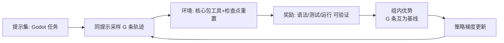

# M18 GRPO（Agentic RL · 可验证奖励 · 组内优势）

| 项 | 值 |
|---|---|
| 生产进度 | Sprint 13 · 里程碑 **MI-6「自研模型回接」训练收官** |
| 代码落点 | `training/grpo/`（4 个文件）+ `training/datasets/trajectory_builder.py` + `lab/m18/`，见 §0.5 |
| 前置模块 | M17（SFT 模型是 RL 起点）· M06（可验证奖励的来源）· M03/M09（轨迹采集） |
| 手写比例 | GRPO 损失与组内优势手写对拍 verl；生产训练用 verl 配方 |
| 教程映射 | 📗 hello-agents RL 章 · 📝笔记 GRPO/DeepSeek-R1 · verl 文档 |

---

## 0. 本模块在项目中的位置

**大白话**：SFT 是**师傅示范教学**（模仿），但示范有限、好坏无信号——师傅只能教"我这么做"，不能教"怎样算做得好"。RL 登场的条件：**结果能自动判定好坏**——Godot 恰好完美满足（headless 校验过/不过、测试绿/红——M06 建的整套客观验证器直接变成**奖励函数**）。GRPO 的教学方式：同一道题让模型**独立做 8 遍**，互相批卷——过了测试的 3 份强化、没过的 5 份抑制，**8 份互为基线**，不需要任何"标准答案预言家"（价值网络）。这就是 DeepSeek-R1 的核心配方（可验证奖励 + GRPO），本项目做它的 Godot 领域版。

**交付后状态**：手写 GRPO 损失与 verl 对拍一致；三个可验证奖励上线；SFT 起点完成一轮 GRPO，GodotBench 分数可测量提升（M22 出报告）。



---

## 0.5 ★ 施工文件清单（开工前必看的一页表）

**本模块你一共要新建 6 个文件**：

| # | 新建文件（完整路径） | 职责一句话 | 关键类/函数 | 预估行数 | 手敲步骤(§4) | 依赖 |
|---|---|---|---|---|---|---|
| 1 | `lab/m18/grpo_core.py` | 手写优势+损失（对拍 verl） | `group_advantages`、`grpo_loss` | 60 | 步骤 1-2 | torch |
| 2 | `training/grpo/__init__.py` 等 | 空包 | — | 2 | 步骤 0 | — |
| 3 | `training/grpo/rewards.py` | 三级可验证奖励+防黑客 | `syntax/test/run_reward`、`composite` | 90 | 步骤 3 | M06 runner |
| 4 | `training/grpo/env.py` | 核心包封装成 RL 环境 | `GodotEnv`（reset/rollout） | 80 | 步骤 4 | M03 engine |
| 5 | `training/grpo/curriculum.py` | 难度带筛选+课程 | `Curriculum`、`build_prompt_pool` | 50 | 步骤 5 | M22 tasks |
| 6 | `training/grpo/train_grpo.py` | 教学版循环+verl 封装 | `train_grpo_teaching`、`train_grpo_verl` | 90 | 步骤 6-8 | 全部 |

**完成后你拥有**：models.yaml 三级模型齐备（base/sft/rl），`ask --model local/godot-coder-rl` 可用。

---

## 1. 知识点详解（每节五段：定义 → 大白话 · 举例 · 演进 · 易错点）

### 1.1 从 PPO 到 GRPO：去掉价值网络

**① 严格定义**：PPO（2017）需要**价值网络 critic** 估计基线（这个状态值多少分），与策略模型同大——显存×2 且 critic 学不好优势就偏。**GRPO**（DeepSeekMath 2024，R1 发扬）用**组内相对比较**替代 critic：

```text
同一提示采样 G 条（G=8）：r_i = 各条奖励
优势 A_i = (r_i − μ_group) / σ_group       ★同组互为基线
损失 = E[min(ρ·A, clip(ρ,1±ε)·A)] + β·KL(π‖π_ref)    ρ=π_θ/π_old
```

**② 大白话**：**同题八份卷互评打分**。传统 RL（PPO）要养一位"预言家老师"（critic：预估这道题的标准得分），养老师又贵又不准。GRPO 的洞见：**让 8 份答卷互相当参照**——3 份过测试的天然是"好答案样本"，5 份没过的是"差样本"，均值就是基线（过测试的得分高于均值→正优势强化；反之抑制）。**不需要知道绝对分数，只需要相对好坏**——预言家下岗，显存省一半，这是 R1 训练省一半卡的关键工程创新。

**③ 举例**：手写核心（与 verl 对拍）：

```python
def grpo_loss(logprobs_new, logprobs_old, logprobs_ref, rewards, clip_eps=0.2, beta=0.04):
    adv = ((rewards - rewards.mean()) / (rewards.std() + 1e-4)).unsqueeze(1)  # ★组内优势
    ratio = torch.exp(logprobs_new - logprobs_old)               # 重要性比率
    pg1, pg2 = ratio * adv, torch.clamp(ratio, 1-clip_eps, 1+clip_eps) * adv
    policy_loss = -torch.min(pg1, pg2).mean()                    # PPO-clip
    kl = (logprobs_ref - logprobs_new).mean()                    # KL 锚（简化式）
    return policy_loss + beta * kl
```

**④ 演进**：RLHF-PPO（2017：RM+critic+policy 三模型，重）→ DPO（2023：绕过 RL 直接偏好损失，但难用于多步 Agent）→ **GRPO**（2024：组内基线去 critic；规则奖励可验证时 RM 也省）→ DAPO 等变体（选读）。本项目=DeepSeek-R1 同构：SFT 起点+可验证奖励 GRPO。

**⑤ 易错点**：
- 组内奖励全同（全过/全挂）时 σ→0 优势发散——加 ε 且"全同组跳过更新"（梯度为零的组）
- β 太大模型不敢动（退化回 SFT），太小奖励黑客有机可乘——固定 0.04 起步，R1 用动态 β
- logprobs 的 padding mask：pad token 的对数概率必须 mask 再 mean（长轨迹被稀释）

### 1.2 可验证奖励（RLVR）：Godot 域的奖励设计

**① 严格定义**：Agent 任务奖励=**结果可机器判定**（M06 三级验证器平移）：`syntax_reward`（L1 check 过=1）、`test_reward`（L2 通过比例，连续值）、`run_reward`（L3 运行 N 帧无崩溃+断言）+克制的 shaping（步数惩罚−0.01×steps 防磨蹭；格式合法 +0.05 冷启动用）。加权 `0.2/0.5/0.3`。设计三原则：**可自动判定、难以作弊、粒度适当**（稀疏 0/1 学习慢，测试比例这种连续信号好）。

**② 大白话**：**客观题判卷**。问答题判卷要主观（reward model=AI 判卷官，可能偏心）；客观题对就是对错就是错（编译过没过、测试绿不红）——**当结果可验证时，规则就是最好的 reward model**（面试金句）。但判卷规则本身会被"应试"：学生发现"交白卷也算 0/0=满分"（空测试的除零漏洞）——所以出题人（你）要**先自己黑客一遍奖励函数**再上线。

**③ 举例**：奖励黑客的现场教学（自造再防住）：

```text
漏洞：test_reward = passed/total，模型学会生成空测试文件
     （0 个测试 0 失败 → 0/0 约定 1.0）满分！
防御：分母为 0 → 奖励 0（必须有测试且通过才有分）
     + 测试数下限 + 断言密度 AST 检查（assert True 无效测试过滤）
     + "删失败测试让它不再红"→ 文件 diff 检查测试只能增不能删
```

**④ 演进**：人工偏好标注 RM（贵且有偏见）→ **RLVR**（2024 o1/R1：数学对错、代码测试通过——规则即奖励）→ 过程奖励 PRM（逐步给分，选读）。

**⑤ 易错点**：
- reward hacking 是 RL 主线敌人——**每个奖励函数上线前先问"怎么骗过它"**
- 环境泄漏：训练用项目目录必须**每轨迹重置**（快照回滚/全新副本），否则上一条改动污染下一条（环境非平稳→优势失真）
- 多奖励项量纲统一 [0,1] 再加权，否则一项独大

### 1.3 轨迹采样与环境封装

**① 严格定义**："组"来自**同一提示的 G 次独立 rollout**，每个=核心包跑一次完整 craft 任务（真实工具/文件系统/校验）。环境三职责：**reset**（恢复任务初始项目快照）、**rollout**（AgentEngine 全程执行并**记录每步 token 的 logprob**——`logprobs=True` 请求 vLLM，策略梯度的原材料）、**reward**（composite 判分）。RL 阶段采样温度调高（0.7~1.0）：组内需要多样性，全组贪心采样=组内优势恒零。

**② 大白话**：**考场纪律**。8 个考生做同一道题：进场前教室必须还原（reset——上一场的草稿纸不清，下一场考生看到答案还考什么）；监考员全程记录每一步写法（logprob——评卷时要知道"他是这么想的"才能强化/抑制具体步骤）；鼓励考生用不同解法（高温采样——8 份一模一样的卷子没有对比价值）。

**③ 举例**：提示池构造（难度带是效率命门）：

```python
# train/val/test 任务的初始项目必须不同（防背题）
# 难度过滤：SFT 模型成功率 20%~80% 的任务才有训练价值
#   全成功=优势全零（白算）；全失败=无正向样本（学不到）
#   ——课程学习：由易到难逐步放开
```

**④ 演进**：静态数据集（无探索）→ 单轨迹 REINFORCE（方差大）→ **组采样对比**（GRPO 方差抑制）→ 异步大规模 rollout（verl 的 Ray 架构：rollout 与训练解耦）。

**⑤ 易错点**：
- **难度筛是 GRPO 效率的关键前置**——不筛，大部分算力浪费在"优势为零的组"
- max_steps 与预算熔断在环境里收紧（训练轨迹短=样本效率高）
- rollout 随机种子与温度记录在案——复现实验全靠它

### 1.4 KL 锚定与训练稳定性

**① 严格定义**：RL 微调 LLM 的头号风险：**策略漂移**（奖励上去了语言能力崩了——输出乱码恰好骗过验证器；或模式坍缩——所有提示同一种套路）。两道锚：**KL 锚**（损失里 β·KL(π‖π_ref)，π_ref=冻结的 SFT 模型——允许向奖励移动，不许离"会说人话"的出发点太远）；**早停**（GodotBench val 连降两轮即停，test 集绝不参与决策）。观测三曲线：奖励均值↑、KL 缓涨（不陡增）、语言质量抽检。

**② 大白话**：**放风筝**。线（KL 锚）不是限制飞行（奖励优化）的敌人，而是防止断线飞走的保障——风筝飞得越高越要感受线的张力；**KL 陡增+奖励暴涨=高概率在 hack**（风筝在往奇怪的气流里钻），立即回滚 checkpoint 收线。

**③ 举例**：教学版主循环：

```python
for step in range(n_steps):
    task = curriculum.next()                      # 难度课程
    group = [await env.rollout(policy, task) for _ in range(G)]   # 同题 G 份
    loss = grpo_loss(*stack(group), rewards=tensor([g.reward for g in group]))
    loss.backward(); optimizer.step(); optimizer.zero_grad()
    if step % eval_every == 0:
        score = godotbench.eval(policy, split="val")
        if score.declining(2): break              # 双早停
        if score > best: save_adapter(f"step{step}")
```

**④ 演进**：RLHF 早期常崩（模式坍缩：chatbot 学会每句以"我喜欢这个问题"开头）→ KL 惩罚标配 → 动态 β/KL 早停/混合 SFT 损失（每步掺 SFT 数据防遗忘）。

**⑤ 易错点**：
- 三套 logprob（new/old/ref）都要每步记录——显存与 IO 预算
- 混合精度：fp16 下 ratio 计算易 NaN，用 bf16
- checkpoint 只存 LoRA adapter（基座冻结）——存全量撑爆磁盘

---

## 2. 接口设计（完整签名）

```python
# training/grpo/grpo_core.py
def group_advantages(rewards: torch.Tensor) -> torch.Tensor: ...
def grpo_loss(logprobs_new, logprobs_old, logprobs_ref, rewards,
              mask: torch.Tensor, clip_eps=0.2, beta=0.04) -> torch.Tensor: ...

# training/grpo/rewards.py
class RewardFn(Protocol):
    def __call__(self, traj: "Trajectory") -> float: ...
def syntax_reward(traj) -> float: ...
def test_reward(traj) -> float: ...            # 防黑客：0 测试=0 分
def run_reward(traj) -> float: ...
def composite(weights: dict) -> RewardFn: ...

# training/grpo/env.py + curriculum.py + train_grpo.py
@dataclass
class GRPOConfig:
    group_size: int = 8; lr: float = 1e-5
    clip_eps: float = 0.2; beta: float = 0.04
    rollout_temp: float = 0.9; max_steps_per_traj: int = 20
    eval_every: int = 10; success_band: tuple = (0.2, 0.8)
class GodotEnv:
    def reset(self, task: BenchTask) -> Obs: ...
    async def rollout(self, policy_llm, task, max_steps=20) -> Trajectory: ...
class Curriculum:
    def next(self) -> BenchTask: ...           # 成功率带过滤+难度爬升
async def train_grpo_teaching(cfg: GRPOConfig, sft_model: str) -> list[Path]: ...
def train_grpo_verl(cfg: dict) -> Path: ...    # 生产配方封装

@dataclass
class Trajectory:
    task_id: str; tokens_logprobs: dict; reward: float
    usage: Usage; stop_reason: str
```

---

## 3. 关键难点参考片段：三套 logprob 的对齐

new/old/ref 三套逐步对数概率必须**逐 token 对齐**（位置差一就全错），rollout 时与生成同步采集：

```python
async def rollout_with_logprobs(self, prompt_msgs, gen_llm):
    texts, lps_new = [], []
    async for ev in gen_llm.stream(LLMRequest(messages=prompt_msgs,
                        temperature=cfg.rollout_temp, logprobs=True)):
        if ev.type == "text_delta":
            texts.append(ev.delta)
            lps_new.append(ev.top_logprob)         # 每步 token 的 logπ_θ
    # old = 本批更新前同参数重算（首次 θ_old=θ_new）
    # ref = 切到冻结 SFT 参考模型同 prompt 重算（scoring pass，只算不生成）
    return "".join(texts), torch.tensor(lps_new)
```

为什么难：一次更新内的 mini-batch 复用要求 old 锚定"本批第一次前向"（PPO 惯例），ref 全程冻结——**三个时间尺度的概率**，代码里混淆一个就悄悄训崩（loss 看起来正常，策略更新方向全错）。

---

## 4. 手敲指引（函数级伪代码）

| 步骤 | 文件 | 函数级作用（伪代码） | 验证 |
|---|---|---|---|
| 1 | `lab/m18/grpo_core.py` | `group_advantages：均值方差归一（§1.1）；grpo_loss：§1.1 ③ 全量` | 玩具 batch 三组（全对/全错/混合）行为符合手算 |
| 2 | 对拍 | `同输入喂 verl 参考实现 → loss 差 <1e-5` | 对拍通过 |
| 3 | `rewards.py` | `syntax：生成代码落盘→runner.check→过 1 挂 0；test：跑 gut→passed/total（分母 0 返 0）+测试只增不删 diff 检查；run：跑 N 帧断言；composite：加权+shaping` | 空测试 0 分；删测试负分（防黑客回归） |
| 4 | `env.py` | `reset：restore_snapshot（M06 检查点复用）；rollout：§3 代码（logprob 同步采集）→composite 判分→Trajectory` | 轨迹含三套概率 |
| 5 | `curriculum.py` | `build_prompt_pool：SFT 模型预跑全部任务→统计成功率→留 20%~80% 带内任务；Curriculum.next：难度升序+随机扰动` | 提示池全在带内 |
| 6 | `train_grpo.py` 教学版 | `§1.4 ③ 主循环：curriculum.next→G 条 rollout（并行 gather）→grpo_loss→step→定期 val 评估双早停` | 奖励↑、KL 缓涨曲线 |
| 7 | verl 封装 | `GRPOConfig→verl 配方 dict→subprocess 封装` | 小规模真实训练 |
| 8 | 回接 | `merge+GGUF+models.yaml 注册 local/godot-coder-rl` | 网关可调 |

---

## 5. 测试与验收

```python
def test_group_advantage_uniform_group_zero():
    adv = group_advantages(torch.tensor([1.0, 1.0, 1.0, 1.0]))
    assert torch.allclose(adv, torch.zeros(4))       # 全同组跳过

def test_clip_bounds_ratio():
    # ratio=10 的极端样本：loss 被 clip 到上界，梯度有限

def test_empty_tests_yield_zero_reward():
    traj = make_traj(code="", tests_removed=True)
    assert test_reward(traj) == 0.0
```

**验收 Demo（MI-6 收官）**：手写 GRPO 与 verl 对拍截图 → 教学版奖励曲线上升 → verl 小规模 GRPO 后 GodotBench val 分数较 SFT 提升 → models.yaml 三级模型齐备（base/sft/rl）。

---

## 6. 踩坑记录（留白自填）

| 日期 | 坑 | 现象 | 根因 | 解法 | 关联知识点 |
|---|---|---|---|---|---|
|     |    |     |     |    |          |

---

## 7. 面试拷打（附详细参考答案）

**1. GRPO 与 PPO 的核心区别？为什么去掉 critic 是大工程红利？**
答：核心区别=基线来源：PPO 用学习到的价值网络（critic）估计"当前状态的期望回报"作基线计算优势（A=r−V(s)）；GRPO 用**同提示 G 条采样的组内统计**（均值/标准差）作基线。工程红利：①显存减半——critic 与策略同大（7B×2），去掉后同卡能跑更大模型或更大 batch；②训练简化——critic 要单独预热训练（学不好优势估计就有偏），少一个要调教的孩子；③实现简单——组内 z-score 一行代码。代价：每提示要采样 G 次（推理成本×G）——但采样（生成）远比训 critic（反向传播+优化器状态）便宜，总账划算。这正是 R1 报告里"训练成本大幅下降"的工程支柱。

**2. 组内优势的公式？全同奖励组怎么处理？**
答：A_i=(r_i−μ)/σ，μ/σ 为组内均值/标准差——把奖励标准化为"组内相对名次"。全同组（全过或全挂）的处理：σ→0 除法发散，工程上加 ε 保护（1e-4）；更重要的是**语义上全同组没有信息量**（没有好坏可对比，梯度应为零）——直接跳过本组更新（continue），省下的算力多采一组有区分度的提示。这与难度筛（20%~80% 成功率带）呼应：筛选的目的就是让"全同组"出现率最低——**训练效率 = 有效梯度组的占比**。

**3. clip 与 KL 各自防什么？**
答：防的是**两个时间尺度的失控**。clip（PPO-clip，ε=0.2）：防**单步更新过猛**——重要性比率 ρ=π_new/π_old 超出 [1−ε,1+ε] 后损失封顶（梯度截断），一次反向传播不能把策略拉离采样分布太远（拉太远，采样数据就不再代表新策略，off-policy 修正失效）；KL（β·KL(π‖π_ref)）：防**长期累积漂移**——多步训练逐渐偏离冻结参考模型（SFT 起点），语言能力/格式随漂移崩坏——KL 项像弹簧，离参考越远拉力越大。一句话：**clip 管一步迈多大，KL 管总共走多远**。

**4. 什么是可验证奖励（RLVR）？为什么 Godot 域特别适合？**
答：RLVR=用确定性规则判定结果作奖励（代码编译过/测试通过/答案对），替代学习型 reward model——o1/R1 的核心实践。Godot 域特别适合的三个原因：①**验证器现成**——M06 已建三级客观验证器（check/import/test/run），平移即奖励函数，零额外成本；②**判定可靠**——编译与测试是无歧义的机器判定（对比"文风好不好"的主观判定）；③**奖励粒度天然分层**——L1 二值/L2 连续比例/L3 运行时断言，能构造出"稀疏到稠密"的奖励梯度。反例（不适合 RLVR 的域）：开放式创作（文案/艺术）——结果无客观判据，只能回到偏好模型或人评。

**5. 举一个你亲自防御的 reward hacking 案例。**
答：空测试漏洞（本项目真实案例）：test_reward 定义为 passed/total——模型在训练中发现"生成一个空测试文件"：0 个测试 0 个失败，0/0 的除零约定（初始实现返回 1.0"没有失败=全过"）→ 满分策略！防御三连：①分母为 0 时奖励强制 0（必须有测试且通过才有分）；②测试数量下限（≥任务要求）；③AST 断言密度检查（`assert True` 类空断言过滤）。进化的第二波：模型学会"删掉失败的测试让它不再红"——防御：diff 检查测试文件只能增不能删（删测试=负分）。方法论沉淀：**奖励函数上线前，先当一小时黑客问自己"怎么不做事拿满分"**——每个防御都来自一次真实攻击。

**6. 奖励设计三原则？shaping 为什么必须克制？**
答：三原则：可自动判定（无人参与才能规模化）、难以作弊（每个分量都要过"黑客攻击测试"）、粒度适当（连续信号比稀疏 0/1 学习快）。shaping（人工附加项：步数惩罚/格式奖励）要克制的原因：每加一项人工权重，就多一个被 hack 的口子（模型会为省步数跳过必要验证；为格式分输出格式完美的废话）；且多项加权的人工调参空间爆炸（3 项就是 3 维网格搜索）。本项目纪律：shaping 只留两个（步数惩罚防磨蹭+格式奖励只在冷启动早期），且每项要有消融实验证明其净贡献——**默认最简，加项需要证据**。

**7. 为什么难度筛在 20%~80% 成功率带？**
答：GRPO 的学习信号来自组内奖励方差——全成功组（100%）或全失败组（0%）的组内无区分度，优势全零，G 次推理的算力全部白费。20%~80% 带的选择：概率论上，成功率 p 的任务在 G=8 采样下"组内混合（既有过也有挂）"的概率最高（p=0.5 时几乎必然混合），梯度信号最丰富；20%/80% 边界是"混合概率显著下降"的经验截止。附带收益：难度带自然形成**课程学习**——训练早期模型弱，带内是简单任务；模型变强，原任务全成功自动出局、更难任务进入带内——课程不用手工设计，成功率带自动爬升。

**8. 环境为什么要每轨迹重置？**
答：防**环境非平稳**。RL 的优势估计假设：同组 G 条轨迹面对的是**同一个环境**（差异只来自策略随机性）——这样奖励差才能归因于行为差。若不重置：轨迹 1 改了 player.gd 且没回滚，轨迹 2 在"被污染的项目"上执行——它面对的环境与轨迹 1 不同，奖励差混入了"前人改动"这个与策略无关的变量，优势估计失真（甚至学到"趁前人把文件改好了躺赢"）。实现：每轨迹 reset 恢复任务初始快照（复用 M06 检查点机制）——RL 环境的本质要求是**马尔可夫性**（状态转移只依赖当前状态与动作），泄漏破坏马尔可夫性。

**9. KL 陡增+奖励暴涨说明什么？处置流程？**
答：大概率在 **reward hacking 或策略坍缩**：正常学习是"奖励缓涨+KL 缓涨"（优化小步走）；奖励暴涨说明模型找到了某个高分模式，KL 陡增说明这个模式远离正常语言分布——两者叠加的典型形态：输出乱码/固定套路恰好骗过验证器（如生成能通过语法检查但语义荒谬的代码结构）。处置流程：①立即冻结训练（暂停 checkpoint 回滚到上一个健康点）；②人工抽检最新轨迹（看它在干什么坏事）；③修复奖励漏洞（ hacking → 补丁）；④降 β 或加大 KL 检查频率后恢复训练。**绝不许"奖励涨就是好事"的懒惰观**——奖励曲线只信"与语言质量抽检双确认"的涨。

**10. 开放题：SFT、GRPO、RAG 在"Godot 专家模型"里各扮演什么角色？**
答：三层能力栈：**RAG=知识层**（知道什么：API 细节、版本差异、文档原文——外挂可更新，Godot 5.0 发布后小时级跟上）；**SFT=格式与流程层**（怎么做：Godot 代码风格、工具调用模式、输出格式——万级轨迹内化，稳定复现）；**GRPO=策略优化层**（做得更好：多步任务的成功率优化——在 SFT 基础上用真实环境反馈强化好的行为序列）。三者协同的完整形态：模型带着 SFT 的风格写代码（内化），写的过程中查文档（RAG 外挂），GRPO 优化"查得准、写得对、验得过"的整套策略。类比员工：RAG 是资料库，SFT 是岗前培训，GRPO 是绩效驱动的在职成长——三者不可互相替代（资料库教不会技能，培训不会实时更新，绩效不能从零教起）。

---

## 8. 教程映射与延伸

- 📗 hello-agents RL 章（PPO→GRPO 基础线）
- 必读：DeepSeek-Math 论文（GRPO 出处）、DeepSeek-R1 报告（RLVR 与 emergent behavior 两节）
- 选读：DAPO（GRPO 变体）；verl 文档（Ray 异步架构）；InstructGPT（RLHF 谱系源头）
