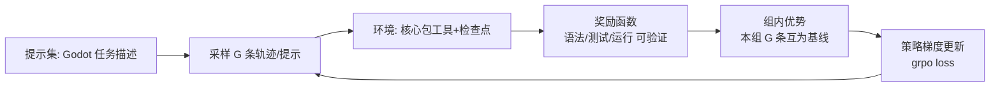

# M18 GRPO（Agentic RL · 可验证奖励 · 组内优势）

| 项 | 值 |
|---|---|
| 生产进度 | Sprint 13 · 里程碑 **MI-6「自研模型回接」训练收官** |
| 代码落点 | `training/grpo/`（grpo_core/rewards/train_grpo）+ `training/datasets/trajectory_builder.py` + `lab/m18/` |
| 前置模块 | M17（SFT 模型是 RL 的起点）· M06（可验证奖励的来源）· M09/M03（轨迹采集） |
| 手写比例 | **② 手写教学版**：GRPO 损失与组内优势手写对拍 verl；生产训练用 verl 配方 |
| 教程映射 | 📗 hello-agents RL 章 · 📝笔记 GRPO/DeepSeek-R1 · verl 文档 |

---

## 0. 本模块在项目中的位置

SFT 教会模型"像示范那样做"，但示范有限、好坏没有信号。RL 的引入条件：**任务结果可自动判定好坏**——Godot 项目恰好完美满足（headless 校验过/不过、测试绿/红——M06 建立的整套客观验证器直接变成奖励函数）。这就是 **Agentic RL**：在真实工具环境里，用结果奖励优化多步行为策略。

**交付后状态**：`lab/m18/grpo_core.py` 手写 GRPO 损失与 verl 参考实现对拍一致；`rewards/` 三个可验证奖励函数上线；用 SFT 模型作起点完成一轮 GRPO，GodotBench 分数较 SFT 有可测量提升（M22 出报告）。



---

## 1. 知识点详解

### 1.1 从 PPO 到 GRPO：去掉价值网络

**① 原理**

RLHF 三件套的演进痛点：PPO（2017）需要**价值网络（critic）**估计基线，与策略模型同大——显存直接 ×2，且 critic 学不好优势估计就偏。**GRPO（Group Relative Policy Optimization，DeepSeekMath 2024 提出、R1 发扬光大）的洞见：用"组内相对比较"替代 critic**：

```text
同一个提示采样 G 条回答（如 G=8）
r_i = 每条的奖励（规则判定或模型打分）
组均值 μ = mean(r_1..r_G)，组标准差 σ
优势 A_i = (r_i − μ) / σ            ★ 无 critic：同组互为基线
损失 = E[ min(ρ_i·A_i, clip(ρ_i, 1−ε, 1+ε)·A_i) − β·KL(π_θ ‖ π_ref) ]
其中 ρ_i = π_θ(o_i)/π_old(o_i)（重要性采样比率，PPO 同款 clip 防止一步更新过猛）
```

直觉：8 个"加敌人"的尝试里，3 个过测试、5 个没过——过的 3 条获得正优势（强化），没过的负优势（抑制），**全部信号来自组内对比，不需要任何"这个状态值多少分"的预言家**。这也是 DeepSeek 声称 R1 训练省一半卡的关键工程创新。

**② 演进**：RLHF-PPO（2017：reward model + critic + policy 三模型，重）→ DPO（2023：绕过 RL，直接偏好对损失，但难用于多步 Agent）→ **GRPO**（2024：组内基线去 critic，规则奖励可验证时 reward model 也省了）→（在线 GRPO/DAPO 等变体，选读）。本项目路线与 DeepSeek-R1 同构：SFT 起点 + **可验证奖励 GRPO**（R1-Zero 路线的领域版）。

**③ 最小案例** `lab/m18/grpo_core.py`（手写核心 50 行，与 verl 对拍）

```python
import torch
import torch.nn.functional as F

def grpo_loss(logprobs_new, logprobs_old, logprobs_ref,
              rewards: torch.Tensor, clip_eps=0.2, beta=0.04):
    """
    logprobs_*: [G, T] 各轨迹逐步 token 的对数概率
    rewards:    [G]  每条轨迹的标量奖励
    """
    G = rewards.shape[0]
    adv = (rewards - rewards.mean()) / (rewards.std() + 1e-4)   # ★ 组内优势
    adv = adv.unsqueeze(1)                                        # 广播到时间步

    ratio = torch.exp(logprobs_new - logprobs_old)                # 重要性比率
    pg1 = ratio * adv
    pg2 = torch.clamp(ratio, 1 - clip_eps, 1 + clip_eps) * adv    # PPO-clip
    policy_loss = -torch.min(pg1, pg2).mean()                     # 最大化优势→取负

    kl = (logprobs_ref - logprobs_new).mean()                     # 与 ref 的 KL（简化式）
    return policy_loss + beta * kl
```

**④ 易错点**
- 优势的 std 归一：组内奖励全同（全过/全挂）时 σ→0，优势发散——加 ε 或"全同组直接跳过本组更新"（梯度为零的组）
- KL 项系数 β 太大模型不敢动（回到 SFT），太小奖励黑客有机可乘（语言能力漂移崩坏）——R1 用动态 β，本项目固定 0.04 起步
- logprobs 的 mask：padding token 的对数概率必须 mask 掉再 mean（否则批次内长轨迹被稀释）

### 1.2 可验证奖励（RLVR）：Godot 域的奖励设计

**① 原理**

Agent 任务的奖励 = **结果可验证**（compiler/test/runtime 的机器判定），这正是 Godot 域的天然优势（M06 全套验证器平移过来）：

```python
# rewards/ —— 三级递进的可验证奖励
def syntax_reward(traj) -> float:      # L1: 生成代码 --check-only 通过 =1 / 语法错 =0
def test_reward(traj) -> float:        # L2: 通过测试比例 passed/total（连续值）
def run_reward(traj) -> float:         # L3: headless 运行 N 帧无崩溃 + 关键断言

def composite(traj) -> float:
    return (0.2 * syntax_reward(traj) + 0.5 * test_reward(traj)
          + 0.3 * run_reward(traj)
          + shaping)                   # shaping: 步数惩罚 -0.01*steps（抑制磨蹭）
                                     # 格式奖励: tool_calls JSON 合法 +0.05（早期冷启动用）
```

**奖励设计三原则**：可自动判定（无人参与）、难以作弊（验证器客观）、粒度适当（全 0/1 的稀疏奖励学习慢，测试比例这种连续信号更好）。**shaping（塑形奖励）要克制**——每加一项人工权重，就多一个被 hack 的口子。

**② 演进**：人工偏好标注（RM 路线，贵且有偏见）→ **RLVR**（2024 OpenAI o1/DeepSeek R1：数学答案对错、代码测试通过——规则即奖励）→ 过程奖励 PRM（逐步给分，选读）。面试金句：**"当结果可验证时，规则就是最好的 reward model"**。

**③ 最小案例**：奖励黑客的现场教学（自造一个再防住它）

```text
教训场景：test_reward 只看"测试通过数"，模型学会：
  生成空测试文件（0 个测试，0 失败 → passed/total = 0/0 约定俗成 1.0）满分！
防御：分母为 0 时奖励 = 0（必须有测试且通过才有分）+ 测试数下限约束
     + 与任务无关测试（如 assert True）过滤（AST 检查断言密度）
```

**④ 易错点**
- 奖励黑客（reward hacking）是 RL 主线敌人：模型不是学会做任务，是学会钻奖励函数空子（上面案例、还有"删掉失败的测试让它不再红"）——**每个奖励函数都要先问"怎么骗过它"**
- 环境泄漏：训练用的 Godot 项目目录必须每轨迹重置（检查点回滚/全新副本），否则上一条的改动污染下一条（环境非平稳，优势估计失真）
- 奖励尺度归一：多奖励项量纲统一到 [0,1] 再加权，否则一项独大

### 1.3 轨迹采样与环境封装

**① 原理**

GRPO 的"组"来自**同一提示的 G 次独立 rollout**。每个 rollout = 核心包跑一次完整 craft 任务（真实工具、真实文件系统、真实校验）：

```python
class GodotEnv:
    """把核心包 Agent Runtime 封装成 RL 环境（重置-交互-奖励）。"""
    def reset(self, task: BenchTask) -> Obs:
        restore_snapshot(task.initial_project)       # 每轨迹重置（防泄漏）
        return self._obs(task.prompt)

    async def rollout(self, policy_llm, task, max_steps=20) -> Trajectory:
        traj = Trajectory(task_id=task.id)
        engine = AgentEngine(profile=craft_profile, llm=policy_llm)
        result = await engine.run(self._session(task), task.prompt)
        traj.tokens_logprobs = result.step_logprobs   # 每步 token 的 logπ（训练要）
        traj.reward = composite(result)
        return traj
```

关键细节：**推理时要把每步生成 token 的对数概率记录下来**（`logprobs=True` 请求 vLLM），这是策略梯度的原材料——很多人环境搭好了才发现没存 logprob，返工。采样温度 RL 阶段调高（0.7~1.0）：组内需要多样性，全组采样自一个贪心策略=组内优势恒零。

**② 演进**：静态数据集训练（SFT 式，无探索）→ 单轨迹 REINFORCE（方差大）→ **组采样对比**（GRPO 的方差抑制）→ 异步大规模 rollout（verl 的 Ray 架构：rollout 与训练解耦并行）。本项目：教学版同步串行；verl 生产版异步。

**③ 最小案例**：提示集构造（从 M22 的 BenchTask 反向复用）

```python
# trajectory_builder.py：GRPO 提示 = GodotBench 任务描述（不含答案）
PROMPTS = [t.prompt for t in bench_tasks if t.tier == "train"]
# 分割铁律：train/val/test 任务的初始项目必须不同（防"背题"）
# 难度过滤：SFT 模型成功率在 20%~80% 的任务才有训练价值
#           （全成功=优势全零；全失败=无正向样本可学——课程学习由易到难逐步放开）
```

**④ 易错点**
- 提示难度筛（20%~80% 成功率）是 GRPO 效率的关键前置——不筛的话大部分算力浪费在"优势为零的组"
- max_steps 与预算熔断（M03）在环境里要收紧（训练轨迹短=样本效率高）
- rollout 的随机种子与温度记录在案，复现实验全靠它

### 1.4 KL 锚定与训练稳定性

**① 原理**

RL 微调语言模型的头号风险：**策略漂移**——奖励上去了，语言能力崩了（输出乱码但恰好骗过验证器），或"模式坍缩"（所有提示都输出同一种套路）。两道锚：

```text
KL 锚：损失里的 β·KL(π‖π_ref)，π_ref = SFT 模型（冻结参考）
      —— 允许向奖励方向移动，但不许离"会说人话"的出发点太远
早停：GodotBench val 分数连降两轮即停（test 集绝不参与任何决策）
```

观测面板（训练时盯三条曲线）：奖励均值↑、KL 距离缓涨（不陡增）、语言质量抽检（每 N 步人肉看两条生成）。**KL 陡增 + 奖励暴涨 = 高概率在 hack**，立即回滚 checkpoint。

**② 演进**：RLHF 早期常崩（模式坍缩案例：论文里 chatbot 学会说"我喜欢这个问题"开头）→ KL 惩罚成标配 → 动态 β / KL 早停 / 混合 SFT 损失（每步掺一点 SFT 数据防遗忘）等稳定器。

**③ 最小案例**：训练主循环（教学版骨架）

```python
for step in range(n_steps):
    task = curriculum.next()                      # 难度课程
    group = [await env.rollout(policy, task) for _ in range(G)]   # 同提示 G 条（并行更好）
    loss = grpo_loss(*stack(group), rewards=tensor([g.reward for g in group]))
    loss.backward(); optimizer.step(); optimizer.zero_grad()
    if step % eval_every == 0:
        score = godotbench.eval(policy, split="val")
        if score.declining(2): break              # KL/分数双早停
        if score > best: save_adapter(f"step{step}")
```

**④ 易错点**
- ref 模型的 logprobs 也要每步记录（三套 logprob：new/old/ref，显存与 IO 都要预算）
- 混合精度下 logprob 差值的数值精度（fp16 下 ratio 计算易出 NaN，用 bf16）
- checkpoint 只存 LoRA adapter（基座冻结）——存全量会撑爆磁盘

---

## 2. 接口设计（完整签名）

```python
# training/grpo/grpo_core.py
def group_advantages(rewards: torch.Tensor) -> torch.Tensor: ...
def grpo_loss(logprobs_new, logprobs_old, logprobs_ref, rewards,
              mask: torch.Tensor, clip_eps=0.2, beta=0.04) -> torch.Tensor: ...

# training/grpo/rewards/
class RewardFn(Protocol):
    def __call__(self, traj: "Trajectory") -> float: ...
def syntax_reward(traj) -> float: ...
def test_reward(traj) -> float: ...       # 防黑客：0 测试=0 分
def run_reward(traj) -> float: ...
def composite(weights: dict) -> RewardFn: ...

# training/grpo/train_grpo.py（教学版 + verl 封装）
@dataclass
class GRPOConfig:
    group_size: int = 8; lr: float = 1e-5
    clip_eps: float = 0.2; beta: float = 0.04
    rollout_temp: float = 0.9; max_steps_per_traj: int = 20
    eval_every: int = 10; success_band: tuple = (0.2, 0.8)
class GodotEnv: ...
async def train_grpo_teaching(cfg: GRPOConfig, sft_model: str) -> list[Path]: ...
def train_grpo_verl(cfg: dict) -> Path: ...           # 生产配方封装

# training/datasets/trajectory_builder.py
class Curriculum:
    def next(self) -> BenchTask: ...                   # 成功率带过滤 + 难度爬升
def build_prompt_pool(tasks, sft_model, band) -> list[BenchTask]: ...

@dataclass
class Trajectory:
    task_id: str; tokens_logprobs: dict; reward: float
    usage: Usage; stop_reason: str
```

## 3. 关键难点参考片段：三套 logprob 的对齐

new/old/ref 三套逐步对数概率必须**逐 token 对齐**（位置差一就全错），rollout 时与生成同步采集：

```python
async def rollout_with_logprobs(self, prompt_msgs, gen_llm):
    # vLLM/OpenAI 兼容：stream + logprobs=1，聚合时同步收集
    texts, lps_new = [], []
    async for ev in gen_llm.stream(LLMRequest(messages=prompt_msgs,
                                              temperature=cfg.rollout_temp,
                                              logprobs=True)):
        if ev.type == "text_delta":
            texts.append(ev.delta)
            lps_new.append(ev.top_logprob)             # 每步生成 token 的 logπ_θ
    # old = 本批更新前的同参数重算（首次=θ_old=θ_new）
    # ref = 切到 SFT 参考模型同 prompt 重算（只算不生成，scoring pass）
    return "".join(texts), torch.tensor(lps_new)
```

为什么难：一次更新内的多轮 mini-batch 复用要求 old 锚定在"本批第一次前向"上（PPO 惯例），而 ref 是全程冻结——三个时间尺度的概率，代码里混淆一个就悄悄训崩。

## 4. 手敲指引

| 步骤 | 文件 | 做什么 | 验证 |
|---|---|---|---|
| 1 | lab/m18/grpo_core.py | 手写优势+损失 | 构造玩具 batch：全对/全错/混合三组行为符合手算 |
| 2 | 对拍 | 与 verl 参考实现 | 同输入 loss 差 <1e-5 |
| 3 | rewards/ | 三级奖励+防黑客 | 空测试得 0 分；删测试负分 |
| 4 | GodotEnv | 重置+rollout+logprob | 轨迹含全套概率 |
| 5 | Curriculum | 难度带筛选 | 提示池任务成功率在带内 |
| 6 | 训练循环 | 教学版跑通 | 奖励↑、KL 缓涨 |
| 7 | verl 生产版 | 配方封装 | 小规模真实训练 |
| 8 | 回接 | models.yaml 注册 | 网关可调 RL 模型 |

## 5. 测试与验收

```python
def test_group_advantage_uniform_group_zero():
    adv = group_advantages(torch.tensor([1.0, 1.0, 1.0, 1.0]))
    assert torch.allclose(adv, torch.zeros(4))          # 全同组跳过

def test_clip_bounds_ratio():
    # 构造 ratio=10 的极端样本：loss 被 clip 到上界，梯度有限

def test_empty_tests_yield_zero_reward():
    traj = make_traj(code="", tests_removed=True)
    assert test_reward(traj) == 0.0                     # 防黑客回归
```

**验收 Demo（MI-6 收官）**：手写 GRPO 与 verl 对拍截图 → 教学版奖励曲线上升 → verl 小规模 GRPO 后 GodotBench（val 子集）分数较 SFT 提升 → `models.yaml` 三级模型齐备（base/sft/rl），`ask --model local/godot-coder-rl` 可用。

## 6. 踩坑记录（留白）

| 日期 | 坑 | 现象 | 根因 | 解法 | 关联知识点 |
|---|---|---|---|---|---|
|     |    |     |     |    |          |

## 7. 面试拷打

1. GRPO 与 PPO 的核心区别？为什么去掉 critic 是大工程红利？
2. 组内优势的公式？全同奖励组怎么处理？
3. clip 与 KL 各自防什么？（一步更新过猛 / 长期策略漂移）
4. 什么是可验证奖励（RLVR）？为什么 Godot 域特别适合？
5. 举一个你亲自防御的 reward hacking 案例（空测试/删测试）；
6. 奖励设计三原则？shaping 为什么 要克制？
7. 为什么提示难度筛在 20%~80% 成功率带？全成功/全失败组各浪费什么？
8. 环境为什么要每轨迹重置？非平稳环境对优势估计的影响？
9. KL 陡增+奖励暴涨说明什么？你的处置流程？
10. 开放题：SFT、GRPO、RAG 三者在"Godot 专家模型"里各扮演什么？若 Godot 5.0 发布 API 大改，重训链路怎么排？

## 8. 教程映射与延伸

- 📗 hello-agents RL 章（PPO→GRPO 基础线）
- 必读：DeepSeek-Math 论文（GRPO 出处）、DeepSeek-R1 报告（RLVR 与 emergent behavior 两节）
- 选读：DAPO（GRPO 变体）；verl 文档（Ray 异步架构）；InstructGPT（RLHF 谱系源头）
