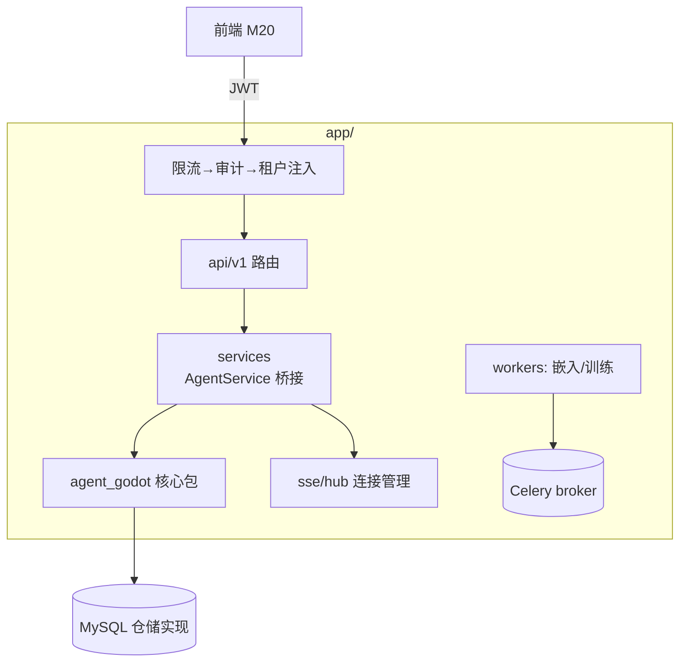

# M19 应用端平台（FastAPI 多租户 · 认证 · SSE 网关 · 异步任务）

| 项 | 值 |
|---|---|
| 生产进度 | Sprint 14 · 里程碑 MI-7a「多租户后端」 |
| 代码落点 | `backend/app/`（main/core/auth/middleware/api/v1/services/sse/workers/models/alembic） |
| 前置模块 | M00（应用端架构已定）· M09（确认门 REST 化）· M03（事件流协议已定） |
| 手写比例 | 100% 手写（FastAPI 直用，无脚手架） |
| 教程映射 | 📘 zero2Agent 11 课（deploy）· FastAPI 官方安全教程 · 📝笔记多租户/SSE |

---

## 0. 本模块在项目中的位置

17 周的 CLI 产品进化为 Web 平台：把核心包（纯库）包进多租户外壳。**本模块不写任何 Agent 逻辑**——全部是"外壳工程"：认证、隔离、SSE 透传、异步任务。M00 的架构纪律在此兑现：核心包零改动（或仅加 db ports 的 MySQL 实现）。

**交付后状态**：两个租户各自注册登录，互相看不到对方的项目/会话/知识库；SSE 流式对话全交互；配额超限 429；确认门在 Web 弹层闭环。



---

## 1. 知识点详解

### 1.1 JWT 认证与 RBAC

**① 原理**

**JWT 三段式**：`header.payload.signature`——payload 含 `sub(user_id)/tenant_id/role/exp`，签名防篡改。**无状态验证**（服务端不查会话表，验签即认）换来水平扩展自由，代价是**撤销难**（签发后到 exp 前始终有效）——所以 access token 短命（15min）+ refresh token 长命（7d，服务端可撤销，存表）。

```text
本项目三级凭证：
JWT access     15min   Web 交互（Authorization: Bearer）
JWT refresh    7d      仅 /auth/refresh 端点接受，旋转式（用一次发新）
API Key        长期     程序调用（hash 存库，前缀展示 ak-xxx...）
```

**RBAC 矩阵**（角色×资源的权限表，硬编码进 `rbac.py`）：

| 资源 | owner | admin | dev | viewer |
|---|---|---|---|---|
| 租户设置/成员管理 | ✓ | ✓ | — | — |
| 项目/会话/知识库 | ✓ | ✓ | ✓ | 只读 |
| 确认门操作 | ✓ | ✓ | ✓ | — |
| 训练任务/审计 | ✓ | ✓ | 只读 | — |

**② 演进**：session cookie（有状态、CSRF 烦）→ JWT（无状态、撤销难）→ access+refresh 双 token（折中主流）→ opaque token + Redis 会话（可撤销回归，大厂内部常用）。面试要点：**能讲清"无状态便利 vs 撤销能力"的取舍链**。

**③ 最小案例**：依赖注入式鉴权（FastAPI 惯用法）

```python
security = HTTPBearer(auto_error=False)

async def current_actor(cred = Depends(security), db=Depends(get_db)) -> Actor:
    token = cred.credentials
    try:
        payload = jwt.decode(token, SECRET, algorithms=["HS256"])
    except jwt.ExpiredSignatureError:
        raise HTTPException(401, "token 过期")
    if await revoked(token_jti=payload["jti"]):        # 撤销检查（登出黑名单）
        raise HTTPException(401, "已撤销")
    return Actor(user_id=payload["sub"], tenant_id=payload["tenant_id"],
                 role=payload["role"])

def require(*perms: Perm):
    def dep(actor: Actor = Depends(current_actor)):
        if not rbac.has(actor.role, *perms):
            raise HTTPException(403, f"需要权限 {perms}")
        return actor
    return dep

# 路由侧：一行声明
@router.post("/projects/{id}/confirm/{cid}")
async def confirm(..., actor=Depends(require(Perm.CONFIRM_ACT))): ...
```

**④ 易错点**
- JWT payload 只是 base64 不是加密——**别放敏感信息**（邮箱可以，手机号不要）
- `tenant_id` 必须来自 token 而非请求参数——前端传什么 tenant 就用什么 = 越权洞（水平越权经典）
- 密钥管理：SECRET 走环境变量，测试环境独立密钥（泄漏过的密钥立即轮换）

### 1.2 多租户数据隔离（共享表 + tenant_id）

**① 原理**

三种隔离模型对比（面试必考）：

| 模型 | 隔离度 | 成本 | 运维 | 本项目 |
|---|---|---|---|---|
| 独立库/租户 | 强 | 高（连接/迁移×N） | 难 | ✗ |
| 独立 schema/租户 | 中 | 中 | 迁移×N | ✗ |
| **共享表+tenant_id** | 弱（靠查询纪律） | 低 | 易 | ✓（个人/小团队产品定位） |

共享表的命门：**每条查询必须带 tenant_id 过滤**，漏一条就是数据泄漏。三道防线：

```text
1. ORM 层强制：Repository 基类自动注入 tenant_id（业务代码想漏都难）
2. 中间件兜底：慢日志/审计抽样检查"无 tenant 条件的查询"（ SQLAlchemy event 钩子）
3. 测试守门：集成测试用双租户数据，断言 A 租户的任何接口都查不到 B 的行
```

**② 演进**：单租户部署（每客户一套）→ 共享表（SaaS 起步标配）→ schema 隔离（合规要求客户）→ 混合（大客户独立、小客户共享）。**隔离模型是产品/合规决策而非纯技术决策**。

**③ 最小案例**：仓储基类自动注入

```python
class TenantRepository(Generic[T]):
    def __init__(self, model: type[T], actor: Actor):
        self.model, self.actor = model, actor
    def query(self, db: Session) -> Query:
        return db.query(self.model).filter(self.model.tenant_id == self.actor.tenant_id)
    # 所有业务查询从 self.query() 出发——tenant 过滤不可能被"忘记"
    # 跨租户的管理员操作走显式的 AdminRepository（代码评审重点盯防）
```

**④ 易错点**
- 关联查询的 JOIN 表漏 tenant 条件（主表过滤了、JOIN 出来的行没过滤）——用 ORM 关系而非手写 JOIN 可缓解
- 全局缓存（Redis）的键必须带 tenant 前缀——缓存泄漏比查询泄漏更隐蔽
- Celery 任务上下文要显式传 tenant_id（worker 里没有请求上下文，Actor 要随任务参数传递）

### 1.3 SSE 网关与连接管理

**① 原理**

`POST /sessions/{id}/messages` 返回 `text/event-stream`：应用端把核心包 EventBus（M03）的事件实时转发。三个工程问题：

```text
断线重连    响应头 X-Accel-Buffering: no（nginx 关缓冲）+ 每事件带 id:（单调递增）
            → 客户端重连时 Last-Event-ID，hub 从环形缓冲补发缺失段
背压        async for 逐事件写 response；写不动的慢客户端（10s 没消费）主动断开
            ——不能让慢客户端把核心包的队列堵死（级联雪崩）
心跳        每 15s 注释帧 ": ping\n\n"（过中间件 idle 超时，且帧内无业务语义）
```

**AgentService 桥接**（应用端最核心的 30 行——HTTP 世界与纯库世界的接缝）：

```python
async def stream_message(self, session_id: int, content: str, actor: Actor):
    session = await self.sessions.load(session_id, actor)       # 租户过滤加载
    engine = self.engine_for(actor.tenant_id)                    # 租户级配置（models.yaml 可按租户）
    task = asyncio.create_task(engine.run(session, content, mode=session.mode))
    async for ev in self.bus.subscribe(session.id):              # 核心包事件流
        yield sse_format(ev, id=self.hub.next_id(session.id))
    await task                                                      # 收尾拿 LoopResult
    yield sse_format(AgentEvent("message_end", usage=task.result().usage_total))
```

**② 演进**：短轮询（延迟差）→ WebSocket（全双工但重：协议升级、代理兼容、断线语义复杂）→ **SSE**（单向流的正确工具：HTTP/1.1 原生、自动重连、经得起企业代理）→ HTTP/2 流多路复用（同域多会话不再抢 6 连接上限）。**判断口诀：客户端只收不发选 SSE，双向实时（协同编辑）才上 WS**。

**③ 最小案例**：hub 的环形补发缓冲

```python
class SSEHub:
    def __init__(self, replay_size: int = 256):
        self.ring: dict[str, deque] = defaultdict(lambda: deque(maxlen=replay_size))
    def next_id(self, sid) -> int: ...
    async def replay_from(self, sid, last_id: int) -> list[str]:
        return [frame for frame in self.ring[sid] if frame.id > last_id]
    # 客户端断连 30s 内重连 → 无感补发；超 256 帧只能全量刷新会话状态
```

**④ 易错点**
- uvicorn worker 重载/发布时 SSE 连接全断——发布策略要配合前端"重连+拉增量"（M20 的 useSSE 要与 hub 的 replay 对齐）
- 确认门事件（confirm_required，M09）挂起时 SSE 保持开放但无事件——心跳帧就是为这 24h 窗口准备的
- 每连接一个 task 的资源账（1000 并发会话=1000 协程+队列）：压测（M21）定容量上限

### 1.4 异步任务（Celery）与配额计量

**① 原理**

两类活必须出主进程：**慢活**（知识库嵌入构建 10 分钟、训练任务数小时）与**定时活**（记忆 GC、检查点清理）。Celery 三件套：broker（Redis）排队、worker 执行、beat 定时。

```python
@celery.task(bind=True, max_retries=3)
def embed_document(self, tenant_id: str, doc_id: str):
    actor = Actor.system(tenant_id)                    # 系统身份（带租户上下文！）
    with tenant_session(actor) as db:
        chunks = parse_and_chunk(doc_id)
        embs = embedding_service.embed_documents([c.text for c in chunks])
        vector_index.upsert(actor, chunks, embs)       # 全程租户过滤
    return {"chunks": len(chunks)}
# 进度上报：Redis HSET task:progress {doc_id: 42%}，前端轮询（或走独立 SSE 通道）
```

**配额计量**（SaaS 的生命线）：中间件在请求结束把 `usage`（来自 LoopResult）写入 `usage_records(tenant_id, user_id, model, input_tokens, output_tokens, cost_usd, created_at)`；配额检查在下一请求入口（余额不足 429 + 前端引导充值）。**计量在出口处（权威数据来自网关 usage），配额在入口处（拦截新请求）**——两者分离，"超限一点点"是设计允许的（不做硬实时扣减，那是数据库热点）。

**② 演进**：线程池（单机）→ Celery（分布式标准）→ arq/dramatiq（轻量替代）→ Kubernetes Job/Argo（云原生）。选 Celery：生态成熟 + beat 定时够用。

**③ 最小案例**：幂等键防重复入队

```python
async def upload_document(file, actor):
    doc = await repo.create(actor, file.meta)
    task = embed_document.apply_async(
        args=[actor.tenant_id, doc.id],
        task_id=f"embed:{doc.id}")          # ★ 固定 task_id=幂等键
    return doc.with_task(task.id)           # 重试/重传不会产生双份构建
```

**④ 易错点**
- worker 的依赖与 web 进程一致（同一 venv/镜像）——版本漂移的隐性 bug 源（CI 一并构建）
- 任务里不能用请求级 Actor——系统身份+显式 tenant_id 是唯一正道
- beat 的时区：容器默认 UTC，cron 表达式按业务时区写清楚（凌晨 3 点的 GC 是哪个 3 点？）

---

## 2. 接口设计（REST API 面 v1）

```text
POST   /api/v1/auth/register|login|refresh|api-keys
GET    /api/v1/me                                  # 当前 actor + 配额余量
POST   /api/v1/projects            绑定 Godot 项目目录（校验可访问）
GET    /api/v1/projects/{id}/files?path=...        文件树（租户过滤）
POST   /api/v1/sessions            创建会话（project, mode）
GET    /api/v1/sessions            列表（分页/搜索）
POST   /api/v1/sessions/{id}/messages        ★ SSE 流式对话（M00 协议）
POST   /api/v1/sessions/{id}/confirm/{cid}   确认门回传 {approved, reason?}
POST   /api/v1/sessions/{id}/rewind          {turns}
GET    /api/v1/diffs/{id}           Diff 详情（hunks）
POST   /api/v1/diffs/{id}/apply     {approved_hunks: [0,2]}
POST   /api/v1/knowledge/documents  上传（返回 task_id，异步构建）
GET    /api/v1/knowledge/documents/{id}/status
POST   /api/v1/training/jobs        启动训练（admin）
GET    /api/v1/admin/audit?...      审计查询（admin）
```

（签名层面 FastAPI 依赖注入已覆盖：`Depends(current_actor)/Depends(require(...))`/`Depends(get_db)`。）

## 3. 关键难点参考片段：SSE 生成器的生命周期

FastAPI 的 StreamingResponse 生成器在**客户端断开**时收到 GeneratorExit——必须清理 hub 订阅与后台 task，否则协程泄漏：

```python
async def stream_message(...):
    sub = hub.subscribe(session_id)
    task = asyncio.create_task(engine.run(...))
    try:
        yield "retry: 3000\n\n"                       # 客户端重连退避提示
        for frame in await hub.replay_from(sid, last_id):
            yield frame
        async for ev in sub:
            yield sse_format(ev)
    finally:
        await hub.unsubscribe(sub)                    # ★ 断开必清
        if not task.done():
            task.cancel()                             # 客户端断开≠任务终止：
            with suppress(asyncio.CancelledError):    # 会话可 /resume 续跑（M09 L2 恢复）
                await task                            # 这里选择取消；持久化任务由 resume 恢复
```

为什么难：三个异步体（HTTP 连接、事件订阅、Agent 任务）的生命周期各不相同——断开时"谁跟着谁死"是策略问题（上面选了"连接死、任务取消、可恢复"），策略错任一处就是泄漏或僵尸任务。

## 4. 手敲指引

| 步骤 | 文件 | 做什么 | 验证 |
|---|---|---|---|
| 1 | core+auth | 配置/JWT/RBAC | 双 token 旋转全流程 |
| 2 | models+alembic | 14 张租户表迁移 | alembic upgrade 幂等 |
| 3 | TenantRepository | 强制注入 | 双租户泄漏测试绿 |
| 4 | sse/hub | 订阅/重放/心跳 | 断连重连无感补发 |
| 5 | AgentService | 桥接+流式生成器 | curl -N 看到事件流 |
| 6 | messages/confirm API | 完整对话闭环 | Web 未动先 curl 全流程 |
| 7 | middleware | 限流/审计/配额 | 429 与审计记录 |
| 8 | workers | 嵌入任务+beat | 上传→异步构建→状态轮询 |

## 5. 测试与验收

```python
async def test_tenant_isolation_on_every_endpoint():
    # 参数化遍历全部 GET 端点：租户 A 的 token 访问 B 的资源 → 404（不是 403！防探测）

async def test_sse_resume_after_reconnect():
    # 中途断开→带 Last-Event-ID 重连→收到缺失帧且顺序 id 单调

async def test_quota_blocks_new_request():
    # 配额耗尽：新会话 429，进行中的流不掐断（优雅降级）
```

**验收 Demo（MI-7a）**：起两个浏览器 Profile 分别注册租户 A/B → A 建项目开会话对话（SSE 流式）→ B 看不到 A 的任何资源 → A 触发写文件确认门，B 的管理员收到的是自己租户的空列表 → 知识库上传后 Celery 进度从 0 到 100%。

## 6. 踩坑记录（留白）

| 日期 | 坑 | 现象 | 根因 | 解法 | 关联知识点 |
|---|---|---|---|---|---|
|     |    |     |     |    |          |

## 7. 面试拷打

1. JWT 无状态的代价？access+refresh 双 token 怎么补救撤销？
2. tenant_id 为什么必须来自 token？水平越权的经典路径？
3. 共享表 vs schema 隔离 vs 独立库的决策维度？
4. 仓储基类自动注入是怎么"让遗漏不可能"的？JOIN 场景的漏洞？
5. SSE vs WebSocket 的选型判据？SSE 的断线补发怎么实现？
6. 慢客户端背压为什么必须服务端断开？级联雪崩的传导链？
7. 三个异步体（连接/订阅/任务）断开时的清理策略？
8. 计量在出口、配额在入口，为什么不做硬实时扣减？
9. Celery 任务的幂等键怎么设计？worker 的租户上下文从哪来？
10. 开放题：单区域部署到多区域，这套多租户架构最先崩的是哪里？（SSE 有状态连接 → 连接层网关/Sticky；跨区延迟→读写分离）

## 8. 教程映射与延伸

- FastAPI 官方：Security/OAuth2 与 Dependencies 章（本模块直用其模式）
- 必读：MDN Server-Sent Events（retry/id/Last-Event-ID 语义）
- 选读：Celery best practices；多租户架构模式综述（微软 Azure 多租户白皮书）
