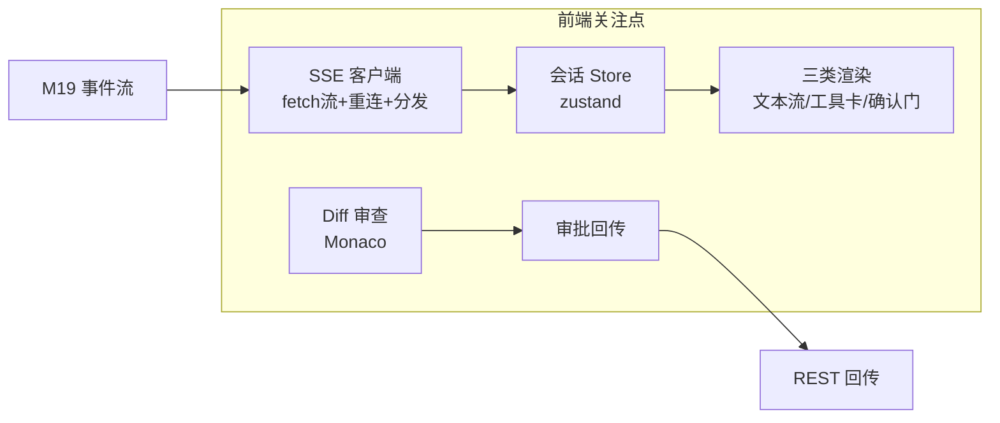

# M20 Web 前端（React 工作台 · SSE 客户端 · Diff 审查 · 状态管理）

| 项 | 值 |
|---|---|
| 生产进度 | Sprint 15 · 里程碑 **MI-7「Web 工作台可用」** |
| 代码落点 | `frontend/`（app/api/stores/features/chat/editor/knowledge/training/admin） |
| 前置模块 | M19（API 与 SSE 协议即合同）· M06（Diff/artifact 结构）· M09（确认门事件） |
| 手写比例 | 100% 手写（openapi-typescript 生成客户端属于工具链） |
| 教程映射 | 📘 zero2Agent 12 课（web-ui）· React 19/Vite 官方文档 · 📝笔记前端架构 |

---

## 0. 本模块在项目中的位置

Agent 的能力再强，用户感知的全部就是这块屏幕：**流式打字、工具卡片、确认弹层、Diff 审查、场景树可视化**。前端的工程本质 = **把 M19 的 SSE 事件流忠实且优雅地渲染成界面，并把用户的每个决策可靠地回传**。

**交付后状态**：完整工作台可用——会话列表/流式对话/工具调用卡片折叠展开/写文件确认弹层/Diff 逐块审批/文件树+Monaco/知识库管理页；CLI 与 Web 双前端并存（M00 架构验证）。



---

## 1. 知识点详解

### 1.1 SSE 客户端：为什么手写而不用 EventSource

**① 原理**

原生 `EventSource` 的三不满足：**不能 POST**（对话要发消息体）、**不能带 Authorization 头**（JWT）、**不能设自定义 content-type**。所以用 `fetch` + `ReadableStream` 手写：

```typescript
// api/sse.ts —— 本前端最核心的 60 行
export async function streamSSE(
  url: string, body: unknown, token: string,
  onEvent: (ev: SSEEvent) => void, signal?: AbortSignal
) {
  let lastId = 0;
  while (true) {                                   // 外层重连环
    const resp = await fetch(url, {
      method: "POST",
      headers: { "Content-Type": "application/json",
                 Authorization: `Bearer ${token}`,
                 ...(lastId ? { "Last-Event-ID": String(lastId) } : {}) },
      body: JSON.stringify(body), signal,
    });
    if (!resp.ok && resp.status !== 429) throw new APIError(resp.status);
    const reader = resp.body!.pipeThrough(new TextDecoderStream()).getReader();
    let buf = "";
    while (true) {                                 // 内层读帧环
      const { done, value } = await reader.read();
      if (done) break;
      buf += value;
      let idx;
      while ((idx = buf.indexOf("\n\n")) >= 0) {   // ★ SSE 帧以空行分隔
        const frame = buf.slice(0, idx); buf = buf.slice(idx + 2);
        const ev = parseFrame(frame);              // data:/id:/注释心跳 三类
        if (ev.id) lastId = ev.id;
        if (ev.data) onEvent(ev);
      }
    }
    await sleep(Math.min(1000 * 2 ** retries++, 15000));  // 指数退避
  }
}
```

与 M19 hub 的契约：`id` 单调递增 → 断线带 `Last-Event-ID` → 服务端环形缓冲补发 → **前端幂等渲染**（重复帧按 id 去重，store 里对 message_end 之前的状态做归并）。

**② 演进**：轮询 → EventSource（2015 标准化，只够"订阅"场景）→ fetch 流手写（POST/头自由）→ React Server Components 流（另一范式，交互密集工作台不适用）。**手写一遍 SSE 解析器，WebSocket/HTTP2 流都触类旁通**。

**③ 最小案例**：心跳注释帧的静默处理

```typescript
function parseFrame(frame: string): SSEEvent | null {
  if (frame.startsWith(":")) return null;          // ": ping" 心跳，跳过
  const lines = frame.split("\n");
  const ev: SSEEvent = { data: "" };
  for (const l of lines) {
    if (l.startsWith("data:")) ev.data += l.slice(5).trimStart();
    if (l.startsWith("id:")) ev.id = Number(l.slice(3));
  }
  return ev.data ? { ...ev, data: JSON.parse(ev.data) } : null;
}
```

**④ 易错点**
- SSE 帧分隔是 `\n\n`，但跨 chunk 边界会劈开——必须缓冲区攒帧（上面的 buf 模式），逐 chunk 直接 parse 会丢帧
- React StrictMode 双执行 effect：SSE 订阅要幂等（AbortController 清理 + store 去重），否则开发环境双倍消息
- 429 与 401 的分流：401 静默刷新 token 重试，429 退避后提示（两种"失败"用户体验完全不同）

### 1.2 会话状态：zustand 的最小切片设计

**① 原理**

三类状态按**变化频率与共享范围**分家（选 zustand 而非 Redux：样板少、切片自由、流式高频更新不连坐渲染）：

```text
useSessionStore   服务端数据的本地镜像（会话列表/当前会话消息流）—— SSE 事件驱动
useUIStore        纯前端态（面板开合/主题/选中文件）—— 用户驱动
useAuthStore      token/actor/配额 —— 登录与 401 驱动
```

**流式渲染的性能命门**：text_delta 每秒几十次，直接 setState 整棵消息树会卡。方案：**按 message_id 分片订阅**——`MessageBubble` 只订阅自己的那条消息（zustand selector），delta 更新只重渲染一个气泡；文本合并用 `useSyncExternalStore` 批处理（requestAnimationFrame 节流渲染）。

**② 演进**：useState 提升（prop drilling 地狱）→ Context（全树重渲染）→ Redux（样板重）→ zustand/jotai（原子化订阅）。主线：**订阅粒度越来越细，渲染范围越来越小**。

**③ 最小案例**：事件到 store 的纯函数归并（可单测，React 之外）

```typescript
export function reduceSession(state: SessionState, ev: AgentEvent): SessionState {
  switch (ev.type) {
    case "text_delta":
      return patchMessage(state, ev.message_id, m => ({ ...m, text: m.text + ev.delta }));
    case "tool_call_start":
      return addToolCall(state, { id: ev.call_id, name: ev.tool, status: "running" });
    case "tool_call_result":
      return patchToolCall(state, ev.call_id, { status: ev.ok ? "ok" : "failed",
                                                summary: ev.summary });
    case "confirm_required":
      return { ...state, pendingConfirm: ev };      // 触发 ConfirmGate 弹层
    case "message_end":
      return { ...state, streaming: false, usage: ev.usage };
  }
}
```

**④ 易错点**
- reducer 必须纯函数且不可变——它是"事件溯源"的前端投影（M09 同款思想），不纯无法去重与回放调试
- 工具卡片折叠态别存 store（UI 局部态），存了会话恢复时"折叠了没展开过"的荒谬状态

### 1.3 三类渲染单元：消息流 · 工具卡片 · 确认门

**① 原理**

消息流是**异构列表**：user 气泡 / assistant 流式 markdown / tool 卡片 / 引用角标 / 系统提示条。渲染策略矩阵：

```text
流式 markdown：dangerouslySetInnerHTML 禁止（XSS）→ marked+DOMPurify，
              rAF 节流（每帧最多一次 re-parse）
工具卡片：    三态（running 转圈/ok 折叠摘要/failed 展开错误+重试建议）
              复杂参数/结果默认折叠——工具是"过程"，用户要的是"结论+可展开细节"
确认门：      全局唯一弹层（队列化：多个待确认排队展示），
              内容= M09 的 preview（Diff 预览/命令），动作= 允许一次/本会话总是/拒绝+理由
```

**"本会话总是"**直连 M09 的 `remember: session` 规则授予；**拒绝必须可填理由**（回填为 Observation，模型需要它改道——M09 的设计在前端兑现）。

**② 演进**：聊天 UI 从"文本框"（terminal）→ "气泡流"（IM）→ **"过程可见的工作流"**（Cursor/Claude Code 式：工具卡+Diff 内联+确认门）——Agent 产品的 UI 演进方向是**把执行过程从黑箱变成可审计的时间线**。

**③ 最小案例**：ConfirmGate 的队列化（防多个确认叠弹层）

```tsx
function ConfirmGate() {
  const queue = useSessionStore(s => s.confirmQueue);   // M09 pendingConfirm 排队而来
  const [current, ...rest] = queue;
  if (!current) return null;
  return (
    <Modal title={`${current.tool} 需要确认`} risk={current.risk}>
      <pre>{current.preview}</pre>
      <ReasonInput placeholder="拒绝时建议填写理由（模型会参考）" />
      <Actions onAllow={...} onAlways={...} onDeny={...} />
    </Modal>);
}
```

**④ 易错点**
- markdown 流式中半截代码块（``` 未闭合）——parser 容忍未闭合并渲染为进行中代码块，别崩
- 工具卡片的 summary 是给模型的 2k 截断版，前端要拉 `/artifacts/{id}` 拿完整数据
- 确认门期间用户切换会话——弹层必须跟随 pendingConfirm 的会话归属，不能串台

### 1.4 Diff 审查与编辑器工作台

**① 原理**

M06 的 FileDiff + hunks → Monaco DiffEditor 渲染，**逐 hunk 审批**（approve/reject 勾选）→ `POST /diffs/{id}/apply {approved_hunks}`。三个细节：

```text
只读 Diff 视图：  Monaco DiffEditor（original=快照, modified=生成）inline 模式
逐 hunk 交互：    DiffEditor 之上叠交互层：hunk 序号勾选框（数据来自 API 的 hunks 数组，
                 与 Monaco 的 diff 区块按行号对齐）
编辑器工作台：    左 FileTree（懒加载/虚拟滚动）+ 中 Monaco（GDScript 语法高亮——
                 monaco-languageclient 自定义或用 gdscript 现成贡献）+ 右 SceneTree/预览
状态回写：        apply 成功后文件树刷新 + 会话内嵌一条"已应用 Diff"系统消息
```

**GDScript 高亮**：Monaco 无内置 gdscript——引 monaco 编辑器 + 自定义 language registration（关键字/内置类型/注解三组 token 规则，200 行内搞定，参考 Godot 官方 editor 的 tmLanguage 定义转 monaco 格式）。

**② 演进**：textarea（史前）→ CodeMirror/Monaco（LSP 级体验）→ **AI 审查流**（Diff 作为对话的一等公民，审查即聊天）→ 结构化编辑（场景树直改，M00 的 SceneTree 雏形）。

**③ 最小案例**：hunk 审批状态到 Monaco 的对齐

```tsx
const HunkLayer = ({ diff, approved, onToggle }) => (
  <div className="hunk-sidebar">
    {diff.hunks.map((h, i) => (
      <label key={i} className={approved.has(i) ? "on" : "off"}>
        <input type="checkbox" checked={approved.has(i)}
               onChange={() => onToggle(i)} />
        Hunk {i + 1} · {h.old_start}-{h.old_start + h.old_len}
      </label>))}
    <button disabled={!approved.size}
            onClick={() => api.applyDiff(diff.id, [...approved])}>
      应用选中的 {approved.size} 块
    </button>
  </div>);
```

**④ 易错点**
- 部分应用后 Diff 缓存失效（行号漂移）——apply 响应返回新文件 hash，前端失效本地缓存强制刷新
- 大文件 Diff（5000 行）Monaco 卡顿——DiffEditor 的 renderSideBySide=false + computeDiff 异步
- 用户在 Monaco 里手改文件与 Agent 写冲突——编辑器 dirty 状态下 Agent 的 write 预览要提示"你有未保存修改"（乐观锁前端版）

### 1.5 工程化：类型链路与构建

**① 原理**：**端到端类型安全**——后端 OpenAPI（FastAPI 自动生成）→ `openapi-typescript` 生成 `apiTypes.ts` → 手写薄客户端 `api/client.ts`（fetch 封装+token 刷新）→ 业务代码零 any。SSE 事件类型单独维护 `api/sse.ts` 的 `AgentEvent` 联合类型（与后端 `agent/events.py` 常量同源评审）。Vite 分包：monaco（最大件）动态 import，首屏不含编辑器。

**②③④ 合并**：路由用 React Router 惰性加载 feature 级代码分割；错误边界兜底 SSE 解析异常；易错——openapi 类型再生成后 any 冒头要 CI 拦（tsc strict + noImplicitAny 是底线）。

---

## 2. 接口设计（前端骨架签名）

```typescript
// api/client.ts
export const api = {
  auth: { login(f), refresh(), me() },
  sessions: { list(), create(p), messages(id, body, onEvent, signal), confirm(id, cid, a) },
  projects: { list(), files(id, path), bind(p) },
  diffs: { get(id), apply(id, hunks) },
  knowledge: { upload(f, onProgress), status(docId) },
};
// api/sse.ts —— streamSSE/parseFrame（1.1 已给）

// stores/session.ts
interface SessionStore {
  sessions: SessionMeta[]; messages: Record<string, Message[]>;
  streaming: boolean; confirmQueue: PendingConfirm[]; usage: Usage | null;
  dispatch(ev: AgentEvent): void;          // reduceSession 的出口
  send(content: string): Promise<void>;    // 调 api + 订阅自己的事件流
}

// features/chat/ MessageStream.tsx · ToolCallCard.tsx · ConfirmGate.tsx · CitationBadge.tsx
// features/editor/ FileTree.tsx · MonacoPane.tsx · DiffReview.tsx（+HunkLayer） · SceneTree.tsx
```

## 3. 关键难点参考片段：token 刷新的并发单飞（single-flight）

多个并发请求同时 401，各自触发 refresh 会互相作废旧 token（刷新旋转下第二次 refresh 已失效）——全局单飞锁：

```typescript
let refreshPromise: Promise<string> | null = null;
export async function authedFetch(input: RequestInfo, init: RequestInit) {
  let resp = await fetch(input, withAuth(init));
  if (resp.status === 401) {
    refreshPromise ??= refreshToken().finally(() => (refreshPromise = null)); // ★单飞
    const token = await refreshPromise;
    resp = await fetch(input, withAuth(init, token));       // 用新 token 重放一次
  }
  return resp;
}
```

为什么难：竞态在于"多个 401 共享一次刷新"与"刷新失败要全员登出"的异常传播路径——finally 清锁保证后续 401 能再次发起刷新，而共享的 promise 让同批请求等同一个结果。

## 4. 手敲指引

| 步骤 | 文件 | 做什么 | 验证 |
|---|---|---|---|
| 1 | 脚手架 | Vite+TS+Router+Tailwind | 空壳跑起 |
| 2 | api/client | openapi 类型生成+authedFetch | 登录流程通 |
| 3 | api/sse.ts | streamSSE+parseFrame | 假事件流回放单测 |
| 4 | stores | reduceSession 三态 | 事件序列回放快照测试 |
| 5 | chat | 消息流+工具卡+确认门 | curl 造事件全渲染 |
| 6 | editor | FileTree+Monaco+gdscript 高亮 | 打开项目文件 |
| 7 | DiffReview | hunk 审批+apply | 部分应用回写成功 |
| 8 | knowledge/training/admin | 三管理页 | 全功能走查 |

## 5. 测试与验收

```typescript
test("sse parser handles frames split across chunks", () => {
  const p = new SSEParser();
  p.feed('data: {"type":"text_de');
  const evs = p.feed('lta"}\n\n: ping\n\n');
  expect(evs).toEqual([{ data: { type: "text_delta" } }]);
});

test("reduce is idempotent under frame replay", () => {
  const s1 = reduce(s0, deltaEv(1, "ab"));
  expect(reduce(s1, deltaEv(1, "ab"))).toEqual(s1);   // 重连补发去重
});

test("refresh single-flight under concurrent 401s", () => { ... });
```

**验收 Demo（MI-7 里程碑）**：浏览器完成全流程：登录 → 绑定 lab/m06 项目 → `craft "给玩家加双跳"` → 看流式打字与工具卡片 → 写文件弹确认门（预览 Diff、选"本会话总是"）→ DiffReview 逐块审批应用 → Monaco 打开改后文件高亮正确 → 刷新页面会话完整恢复（事件重放）。

## 6. 踩坑记录（留白）

| 日期 | 坑 | 现象 | 根因 | 解法 | 关联知识点 |
|---|---|---|---|---|---|
|     |    |     |     |    |          |

## 7. 面试拷打

1. EventSource 三不满足是什么？手写 fetch 流的关键点（帧缓冲/分隔符）？
2. SSE 断线补发的前端配合（Last-Event-ID + 幂等 reduce）？
3. 流式高频更新怎么防全树重渲染？（切片订阅 + rAF 节流）
4. reduceSession 为什么必须是纯函数？（去重/回放/调试三用途）
5. 流式 markdown 的 XSS 防线？半截语法怎么容错？
6. 确认门队列化的原因？"本会话总是"对应后端什么机制？
7. 逐 hunk 审批的数据对齐问题？部分应用后的缓存失效链？
8. token 刷新单飞解决什么竞态？
9. Monaco 大文件 Diff 的优化清单？
10. 开放题：如果要把会话时间线做成"可协作"（多人同时看同一会话），前端架构改什么？（事件流多播、光标/审批权仲裁——引向 CRDT/OT）

## 8. 教程映射与延伸

- 📘 zero2Agent 12 课（web ui）
- 必读：MDN SSE；zustand docs（切片模式）；Monaco DiffEditor API
- 选读：React 19 useSyncExternalStore 深读；openapi-typescript 工作流
